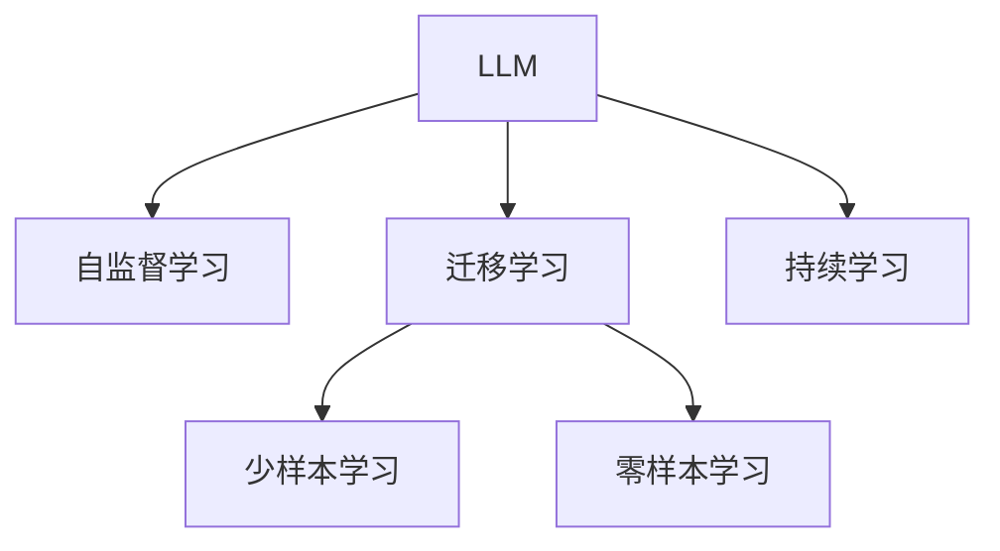
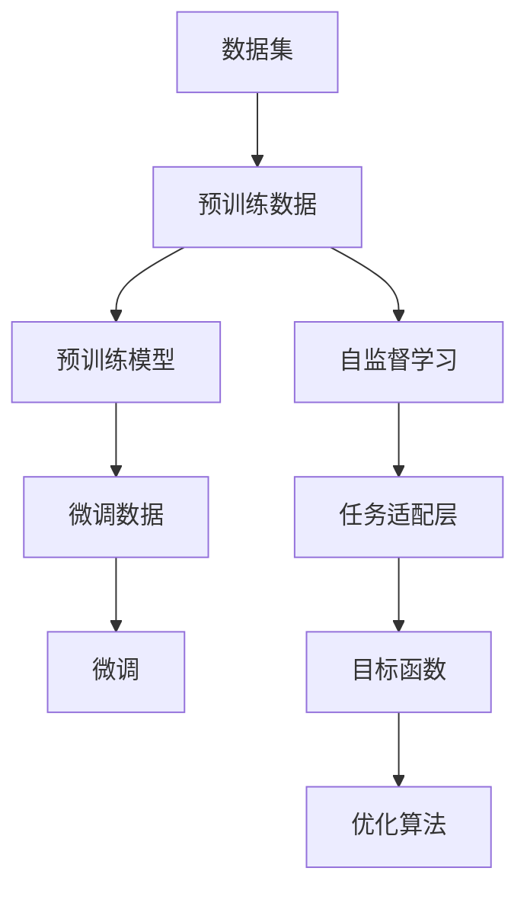

                 

## 1. 背景介绍

在当今教育科技的浪潮中，人工智能（AI）扮演着越来越重要的角色。尤其是大型语言模型（LLM），以其强大的自然语言处理能力，为智能学习系统注入了新的活力。本文将详细探讨LLM在智能学习系统中的潜力，包括其核心概念、算法原理、实际操作步骤、数学模型构建、项目实践、应用场景、工具和资源推荐以及未来趋势与挑战。

## 2. 核心概念与联系

### 2.1 核心概念概述

为更好地理解LLM在智能学习系统中的作用，本节将介绍几个密切相关的核心概念：

- **大型语言模型（Large Language Model, LLM）**：如GPT-3、BERT等，通过在海量无标签文本数据上进行自监督学习，能够生成与真实人类文本相媲美的语言。
- **自监督学习（Self-supervised Learning）**：利用无标签数据训练模型，通过预训练获得语言表示能力。
- **迁移学习（Transfer Learning）**：将预训练模型应用于新任务，通过少量有标签数据微调提升任务性能。
- **持续学习（Continual Learning）**：模型能够不断从新数据中学习，同时保持已学习的知识，避免灾难性遗忘。
- **少样本学习（Few-shot Learning）**：使用少量样本训练模型，使其在新任务上能够快速学习。
- **零样本学习（Zero-shot Learning）**：模型能够仅通过任务描述完成新任务。

这些核心概念之间的逻辑关系可以通过以下Mermaid流程图来展示：



### 2.2 核心概念原理和架构的 Mermaid 流程图



## 3. 核心算法原理 & 具体操作步骤

### 3.1 算法原理概述

LLM在智能学习系统中的应用，主要基于自监督学习和迁移学习两个核心原理。其核心思想是：首先在大规模无标签文本数据上进行自监督学习，获得对语言的深刻理解；然后，将训练得到的模型在新任务上微调，以适应特定的学习需求。

### 3.2 算法步骤详解

1. **数据预处理**：收集大量的无标签文本数据，进行分词、标注等预处理，形成可用于自监督学习的数据集。
2. **自监督学习**：使用自监督学习任务（如掩码语言模型、下一句预测等）对预训练模型进行训练，学习语言的通用表示。
3. **微调**：收集新任务的有标签数据，将预训练模型作为初始化参数，通过有监督学习进行微调，优化模型在新任务上的性能。
4. **评估和部署**：在验证集和测试集上评估微调后的模型性能，并在实际学习系统中部署应用。

### 3.3 算法优缺点

**优点**：
- 简单高效：通过微调可以快速提升模型在新任务上的性能，无需从头训练。
- 通用性强：预训练模型在各种学习任务上表现优异，适应性强。
- 灵活性高：可以通过参数高效微调，保留大部分预训练参数，减少计算资源消耗。

**缺点**：
- 依赖标注数据：微调效果很大程度上依赖于有标签数据的数量和质量，获取高质量标注数据的成本较高。
- 泛化能力有限：当目标任务与预训练数据的分布差异较大时，微调的性能提升有限。
- 可解释性不足：微调模型通常缺乏可解释性，难以分析其内部工作机制。

### 3.4 算法应用领域

LLM在智能学习系统中可以应用于多种场景，包括但不限于：

- **智能辅导**：通过微调模型，为学生提供个性化辅导，解决学习中的疑问。
- **个性化推荐**：根据学生的学习习惯和兴趣，推荐适合的教材和学习资源。
- **智能评估**：自动评估学生的作业和考试，提高评分的客观性和效率。
- **知识图谱构建**：构建大规模知识图谱，帮助学生理解复杂知识体系。
- **情感分析**：分析学生的情绪变化，提供心理支持和干预。

## 4. 数学模型和公式 & 详细讲解

### 4.1 数学模型构建

假设预训练模型为 $M_{\theta}$，其中 $\theta$ 为预训练得到的模型参数。对于新任务 $T$，训练集为 $D=\{(x_i, y_i)\}_{i=1}^N$，其中 $x_i$ 为输入，$y_i$ 为标签。微调的目标是最小化损失函数 $\mathcal{L}$。

$$
\hat{\theta}=\mathop{\arg\min}_{\theta} \mathcal{L}(M_{\theta},D)
$$

其中 $\mathcal{L}$ 为针对任务 $T$ 设计的损失函数。

### 4.2 公式推导过程

以二分类任务为例，假设模型输出为 $M_{\theta}(x)$，其中 $M_{\theta}$ 为预训练模型。目标函数为交叉熵损失：

$$
\mathcal{L}(M_{\theta},D) = -\frac{1}{N}\sum_{i=1}^N [y_i \log M_{\theta}(x_i) + (1-y_i) \log (1-M_{\theta}(x_i))]
$$

其梯度为：

$$
\frac{\partial \mathcal{L}(M_{\theta},D)}{\partial \theta} = -\frac{1}{N}\sum_{i=1}^N \left(\frac{y_i}{M_{\theta}(x_i)} - \frac{1-y_i}{1-M_{\theta}(x_i)}\right) \frac{\partial M_{\theta}(x_i)}{\partial \theta}
$$

其中 $M_{\theta}(x_i)$ 为模型在输入 $x_i$ 上的输出。

### 4.3 案例分析与讲解

通过上述推导，我们可以看到，微调模型的目标函数和梯度计算都基于预训练模型的输出和有标签数据。这种基于监督学习的方法，使得模型能够快速适应新任务，提升其在新任务上的表现。

## 5. 项目实践：代码实例和详细解释说明

### 5.1 开发环境搭建

1. 安装Python环境：
```bash
conda create -n llm-env python=3.8
conda activate llm-env
```

2. 安装必要的库：
```bash
pip install torch transformers pytorch-lightning
```

3. 配置环境变量：
```bash
export PYTHONPATH=/path/to/your/project:$PYTHONPATH
```

### 5.2 源代码详细实现

以下是一个简单的代码示例，用于微调一个BERT模型进行文本分类：

```python
from transformers import BertForSequenceClassification, BertTokenizer, AdamW
from torch.utils.data import DataLoader, Dataset
from torch.nn import CrossEntropyLoss
from sklearn.model_selection import train_test_split

# 定义数据集
class TextDataset(Dataset):
    def __init__(self, texts, labels):
        self.tokenizer = BertTokenizer.from_pretrained('bert-base-uncased')
        self.texts = texts
        self.labels = labels
        
    def __len__(self):
        return len(self.texts)
    
    def __getitem__(self, idx):
        text = self.texts[idx]
        label = self.labels[idx]
        encoding = self.tokenizer(text, truncation=True, padding='max_length', max_length=512)
        return {'input_ids': encoding['input_ids'],
                'attention_mask': encoding['attention_mask'],
                'labels': label}

# 加载数据集
train_texts, test_texts, train_labels, test_labels = train_test_split(texts, labels, test_size=0.2)
train_dataset = TextDataset(train_texts, train_labels)
test_dataset = TextDataset(test_texts, test_labels)

# 加载预训练模型
model = BertForSequenceClassification.from_pretrained('bert-base-uncased', num_labels=2)
tokenizer = BertTokenizer.from_pretrained('bert-base-uncased')

# 配置优化器
optimizer = AdamW(model.parameters(), lr=2e-5)

# 定义损失函数
criterion = CrossEntropyLoss()

# 训练模型
device = torch.device('cuda' if torch.cuda.is_available() else 'cpu')
model.to(device)

def train_epoch(model, dataset, batch_size, optimizer, criterion):
    model.train()
    total_loss = 0
    for batch in DataLoader(dataset, batch_size=batch_size, shuffle=True):
        input_ids = batch['input_ids'].to(device)
        attention_mask = batch['attention_mask'].to(device)
        labels = batch['labels'].to(device)
        model.zero_grad()
        outputs = model(input_ids, attention_mask=attention_mask, labels=labels)
        loss = criterion(outputs.logits, labels)
        total_loss += loss.item()
        loss.backward()
        optimizer.step()
    return total_loss / len(dataset)

# 训练模型
epochs = 5
batch_size = 16

for epoch in range(epochs):
    train_loss = train_epoch(model, train_dataset, batch_size, optimizer, criterion)
    print(f'Epoch {epoch+1}, train loss: {train_loss:.3f}')

# 评估模型
model.eval()
with torch.no_grad():
    correct = 0
    total = 0
    for batch in DataLoader(test_dataset, batch_size=batch_size, shuffle=False):
        input_ids = batch['input_ids'].to(device)
        attention_mask = batch['attention_mask'].to(device)
        labels = batch['labels'].to(device)
        outputs = model(input_ids, attention_mask=attention_mask)
        _, predicted = torch.max(outputs.logits, 1)
        total += labels.size(0)
        correct += (predicted == labels).sum().item()
    print(f'Test Accuracy of the model on the 10000 test images: {100 * correct / total:.2f}%')
```

### 5.3 代码解读与分析

通过上述代码，我们可以看到：

- **数据集定义**：通过继承 `Dataset` 类，定义了数据集的预处理、分批加载等功能。
- **模型加载**：使用 `BertForSequenceClassification` 加载预训练模型，并配置了损失函数和优化器。
- **训练循环**：在每个epoch内，对数据集进行遍历，计算损失并更新模型参数。
- **模型评估**：在测试集上评估模型性能，输出准确率。

## 6. 实际应用场景

### 6.1 智能辅导

通过微调，LLM可以构建智能辅导系统，为学生提供个性化的学习建议。例如，可以收集学生的学习记录和成绩数据，结合教材内容进行微调，生成针对学生的个性化推荐。

### 6.2 个性化推荐

基于学生的学习行为和兴趣，微调模型可以推荐适合的学习资源和教材。例如，通过分析学生的阅读记录、做题记录等数据，推荐与其学习进度和兴趣相匹配的学习内容。

### 6.3 智能评估

LLM可以自动评估学生的作业和考试，提高评分的客观性和效率。例如，通过微调模型，可以自动评分简答题、论述题等主观性题目。

### 6.4 知识图谱构建

通过微调，LLM可以构建大规模知识图谱，帮助学生理解复杂的知识体系。例如，可以结合教材内容和学生疑问，微调模型自动构建知识图谱，提供概念之间的关联关系。

### 6.5 情感分析

LLM可以分析学生的情绪变化，提供心理支持和干预。例如，通过微调模型，可以识别学生情绪变化，及时发现异常情况并采取干预措施。

## 7. 工具和资源推荐

### 7.1 学习资源推荐

1. **《深度学习基础》**：一本经典深度学习教材，适合初学者系统学习深度学习基础。
2. **《自然语言处理综论》**：介绍自然语言处理的全面教材，涵盖语言模型、文本分类、情感分析等多个方向。
3. **《Transformers: From Fairseq to Mesonoid》**：介绍Transformers框架的详细使用教程，适合有一定深度学习基础的学习者。
4. **HuggingFace官方文档**：提供丰富的预训练模型和微调样例，适合实际操作学习。
5. **OpenAI的GPT系列模型**：包括GPT-1至GPT-3，是了解LLM的优秀资源。

### 7.2 开发工具推荐

1. **PyTorch**：强大的深度学习框架，支持动态计算图和GPU加速。
2. **TensorFlow**：由Google主导的深度学习框架，适合大规模工程应用。
3. **Transformers库**：HuggingFace提供的NLP工具库，集成了多个预训练模型和微调样例。
4. **TensorBoard**：TensorFlow配套的可视化工具，实时监测模型训练状态。
5. **Jupyter Notebook**：交互式编程环境，方便代码调试和实验记录。

### 7.3 相关论文推荐

1. **Attention is All You Need**：Transformer的开创性论文，引入自注意力机制。
2. **BERT: Pre-training of Deep Bidirectional Transformers for Language Understanding**：提出BERT模型，通过掩码语言模型预训练，获得强大的语言表示能力。
3. **GPT-3: Language Models are Unsupervised Multitask Learners**：展示GPT-3的强大零样本学习能力。
4. **Adaptive Low-Rank Adaptation for Parameter-Efficient Fine-Tuning**：提出LoRA等参数高效微调方法，优化微调过程。
5. **A Survey of Transfer Learning for Natural Language Processing**：综述自然语言处理的迁移学习研究。

## 8. 总结：未来发展趋势与挑战

### 8.1 研究成果总结

本文详细介绍了LLM在智能学习系统中的潜力，探讨了其核心概念和应用方法。通过自监督学习获取语言的通用表示，再通过迁移学习适应新任务，LLM在智能辅导、个性化推荐、智能评估、知识图谱构建和情感分析等方面展现了强大的潜力。

### 8.2 未来发展趋势

1. **模型规模增长**：预训练模型参数量不断增长，学习到的语言知识更加丰富。
2. **微调方法多样**：除了全参数微调，更多参数高效的微调方法如LoRA等将得到广泛应用。
3. **持续学习常态化**：模型能够不断从新数据中学习，避免过拟合和遗忘。
4. **少样本学习和零样本学习**：通过更巧妙的任务描述，提高模型的学习效率。
5. **多模态融合**：将视觉、语音等多模态信息与文本信息结合，提升模型性能。
6. **伦理和安全**：在模型设计和训练中纳入伦理和安全约束，保障模型输出的可解释性和安全性。

### 8.3 面临的挑战

1. **标注数据成本**：微调效果依赖于有标签数据，获取高质量标注数据成本较高。
2. **过拟合和泛化能力**：微调模型面对新数据时泛化能力有限。
3. **推理效率**：大规模模型推理速度慢，内存占用大。
4. **可解释性和安全性**：微调模型缺乏可解释性，存在潜在安全隐患。

### 8.4 研究展望

1. **无监督和半监督微调**：探索不依赖有标签数据的学习方法，降低标注成本。
2. **参数高效微调**：开发更多参数高效的微调方法，提升模型效率。
3. **因果学习和对比学习**：引入因果推断和对比学习，增强模型泛化性和抗干扰能力。
4. **知识整合和跨模态融合**：将外部知识与模型结合，提升模型的信息整合能力。
5. **伦理和安全约束**：在模型设计和训练中纳入伦理和安全约束，保障模型输出的可解释性和安全性。

## 9. 附录：常见问题与解答

**Q1: 如何选择合适的预训练模型？**

A: 根据任务需求选择合适的预训练模型。例如，分类任务可以使用BERT、RoBERTa等模型，生成任务可以使用GPT系列模型。

**Q2: 如何避免过拟合？**

A: 使用数据增强、正则化、早停等方法缓解过拟合问题。

**Q3: 如何提高模型的推理效率？**

A: 使用模型裁剪、量化加速、混合精度训练等方法优化推理效率。

**Q4: 如何提高模型的可解释性？**

A: 引入可解释性技术，如LIME、SHAP等，分析模型决策过程。

**Q5: 如何处理多模态数据？**

A: 将不同模态的数据进行融合，使用多模态预训练方法，如PAMoLoMo等。

---

作者：禅与计算机程序设计艺术 / Zen and the Art of Computer Programming

