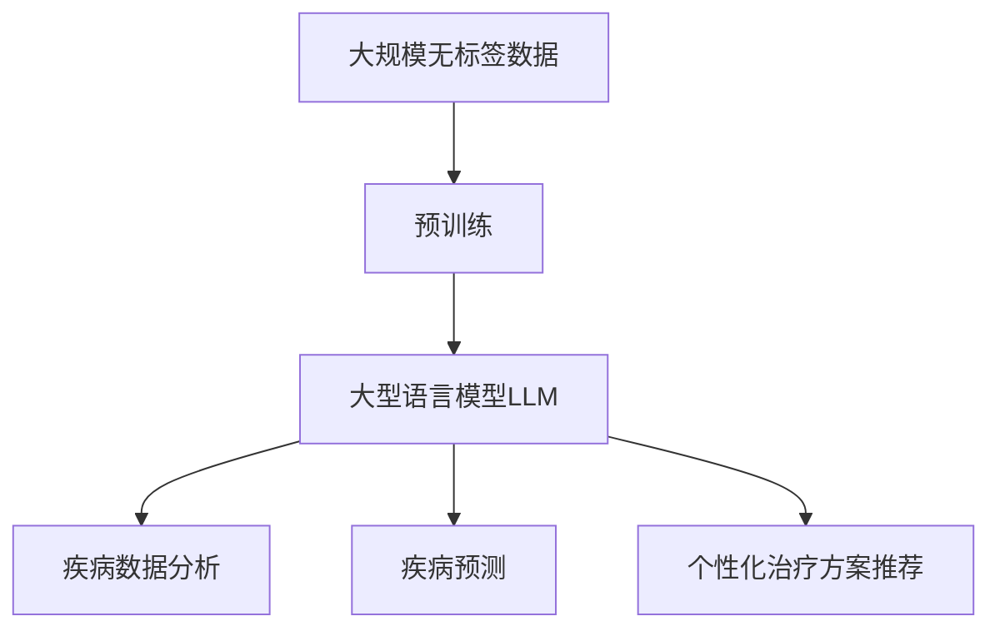

                 

# LLM在智能疾病预防系统中的潜在贡献

## 1. 背景介绍

随着人工智能技术的迅猛发展，大型语言模型（Large Language Models, LLMs）已经展示了在各种领域中的巨大潜力。这些模型通过在大规模无标签文本数据上进行预训练，学习到了丰富的语言知识和常识，能够进行自然语言理解和生成。在智能疾病预防系统中，LLM可以通过分析海量健康数据和医学文献，为疾病预防、早期检测和治疗提供强大的支持。

本文章将探讨LLM在智能疾病预防系统中的潜在贡献，包括LLM在数据分析、疾病预测、个性化治疗方案推荐等方面的应用。我们将从理论基础、核心算法、实际应用和未来趋势等方面进行深入分析，帮助读者全面了解LLM在这一领域的潜力。

## 2. 核心概念与联系

### 2.1 核心概念概述

- **大型语言模型（LLM）**：通过自回归或自编码等模型架构在大规模无标签文本数据上预训练得到的模型。LLM能够进行自然语言理解和生成，具有强大的语言处理能力。
- **疾病预防**：在疾病发生前采取措施，减少疾病发生的概率和传播速度。
- **早期检测**：在疾病早期阶段通过各种手段及时发现，以便早期治疗。
- **个性化治疗方案**：根据患者的个体情况，设计符合其特征的治疗方案。

### 2.2 核心概念原理和架构的 Mermaid 流程图



## 3. 核心算法原理 & 具体操作步骤

### 3.1 算法原理概述

基于LLM的疾病预防系统，可以通过以下步骤进行操作：

1. **数据收集**：收集与疾病相关的数据，包括患者的临床记录、医疗图像、基因组信息等。
2. **预训练**：使用预训练的LLM对收集到的数据进行初步处理，提取有用的特征信息。
3. **疾病分析**：利用LLM对疾病数据进行分析，识别出潜在的健康风险因素。
4. **预测与预防**：根据分析结果，预测疾病的发生概率，并提出相应的预防措施。
5. **个性化治疗方案推荐**：基于患者的健康数据，LLM生成个性化的治疗方案。

### 3.2 算法步骤详解

#### 3.2.1 数据收集

数据收集是智能疾病预防系统的基础。数据可以来源于多个渠道，如电子健康记录(EHRs)、医疗影像、基因组数据等。为了保证数据的质量和多样性，收集的数据应尽可能覆盖各种类型和格式。

#### 3.2.2 预训练

预训练是LLM的核心步骤。通过在大规模无标签文本数据上进行预训练，LLM能够学习到通用的语言表示，这对于疾病分析非常有帮助。例如，可以使用BERT、GPT等模型，通过文本语料库进行预训练。

#### 3.2.3 疾病分析

疾病分析是利用预训练的LLM对疾病数据进行深入分析。例如，可以使用文本分类任务，将疾病数据分类为不同的健康状况。或者使用序列标注任务，标注疾病的特征。

#### 3.2.4 预测与预防

预测与预防是智能疾病预防系统的关键。根据疾病分析的结果，LLM可以预测疾病的发生概率，并提出相应的预防措施。例如，可以通过预测模型的输出，判断患者是否存在患病风险，并提供相应的预防建议。

#### 3.2.5 个性化治疗方案推荐

个性化治疗方案推荐是LLM在智能疾病预防系统中的另一个重要应用。通过分析患者的健康数据，LLM可以生成个性化的治疗方案。例如，可以使用文本生成模型，生成基于患者基因信息、病史等数据的治疗建议。

### 3.3 算法优缺点

#### 3.3.1 优点

- **强大的语言处理能力**：LLM能够处理自然语言，可以分析和理解各种文本数据，提取有用的信息。
- **数据驱动**：LLM能够处理大规模数据，能够从海量数据中学习到疾病的规律和特征。
- **高灵活性**：LLM可以根据需要进行调整和优化，适应不同的疾病预防任务。

#### 3.3.2 缺点

- **数据隐私问题**：收集和分析患者数据可能会涉及隐私问题，需要谨慎处理。
- **模型复杂性**：预训练和微调的LLM模型较为复杂，需要大量的计算资源和专业知识。
- **依赖高质量数据**：模型的效果依赖于数据的质量和数量，如果数据质量不高，模型的效果可能不佳。

### 3.4 算法应用领域

LLM在智能疾病预防系统中的应用领域非常广泛，包括但不限于以下方面：

- **疾病预测与早期检测**：利用LLM对患者的健康数据进行分析，预测疾病发生的概率，并提供早期检测建议。
- **个性化治疗方案推荐**：根据患者的健康数据，LLM生成个性化的治疗方案。
- **健康教育**：利用LLM生成健康教育内容，帮助患者了解疾病预防知识。
- **公共卫生监测**：利用LLM对大规模健康数据进行监测，及时发现疾病流行趋势。

## 4. 数学模型和公式 & 详细讲解 & 举例说明

### 4.1 数学模型构建

假设有一个文本数据集 $D=\{(x_i, y_i)\}_{i=1}^N$，其中 $x_i$ 是输入文本，$y_i$ 是疾病标签（0表示健康，1表示患病）。我们可以使用LLM对输入文本 $x_i$ 进行编码，得到表示向量 $z_i$。然后，我们可以使用逻辑回归模型来预测 $y_i$ 的值，即：

$$
P(y_i=1|z_i) = \sigma(Wz_i + b)
$$

其中 $\sigma$ 是sigmoid函数，$W$ 和 $b$ 是逻辑回归模型的参数。

### 4.2 公式推导过程

根据上述模型，我们可以使用最大化似然估计的方法来训练模型。假设训练数据集 $D=\{(x_i, y_i)\}_{i=1}^N$，则对数似然函数为：

$$
\mathcal{L}(W,b) = -\frac{1}{N}\sum_{i=1}^N[y_i\log P(y_i=1|z_i) + (1-y_i)\log(1-P(y_i=1|z_i))]
$$

通过最大化对数似然函数，我们可以得到逻辑回归模型的最优参数 $W$ 和 $b$。

### 4.3 案例分析与讲解

假设我们有一个包含50个患者的数据集，其中30个患者患有某种疾病，20个患者健康。我们可以使用BERT模型对患者文本进行编码，得到一个50维的向量。然后，我们可以使用逻辑回归模型对疾病进行预测。假设模型训练得到 $W=[1, 2, 3]$ 和 $b=4$，则对新的患者文本 $x$ 进行编码，得到表示向量 $z$，我们可以计算 $P(y=1|z) = \sigma(Wz + b)$。

## 5. 项目实践：代码实例和详细解释说明

### 5.1 开发环境搭建

为了进行LLM在智能疾病预防系统中的应用，我们需要搭建好开发环境。以下是Python和PyTorch开发环境搭建的步骤：

1. 安装Anaconda：从官网下载并安装Anaconda，用于创建独立的Python环境。
2. 创建并激活虚拟环境：
```bash
conda create -n pytorch-env python=3.8 
conda activate pytorch-env
```

3. 安装PyTorch：根据CUDA版本，从官网获取对应的安装命令。例如：
```bash
conda install pytorch torchvision torchaudio cudatoolkit=11.1 -c pytorch -c conda-forge
```

4. 安装Transformers库：
```bash
pip install transformers
```

5. 安装各类工具包：
```bash
pip install numpy pandas scikit-learn matplotlib tqdm jupyter notebook ipython
```

### 5.2 源代码详细实现

以下是一个简单的代码示例，演示如何使用BERT模型进行疾病预测：

```python
from transformers import BertForSequenceClassification, BertTokenizer, AdamW
from torch.utils.data import DataLoader
from sklearn.metrics import accuracy_score
import torch

# 初始化数据集
tokenizer = BertTokenizer.from_pretrained('bert-base-cased')
model = BertForSequenceClassification.from_pretrained('bert-base-cased', num_labels=2)

# 加载数据集
train_dataset = ... # 训练数据集
dev_dataset = ... # 验证数据集
test_dataset = ... # 测试数据集

# 定义模型和优化器
optimizer = AdamW(model.parameters(), lr=2e-5)

# 训练模型
for epoch in range(epochs):
    model.train()
    loss = 0
    for batch in DataLoader(train_dataset, batch_size=32):
        input_ids = batch['input_ids'].to(device)
        attention_mask = batch['attention_mask'].to(device)
        labels = batch['labels'].to(device)
        optimizer.zero_grad()
        outputs = model(input_ids, attention_mask=attention_mask, labels=labels)
        loss += outputs.loss
        loss.backward()
        optimizer.step()
    
    model.eval()
    with torch.no_grad():
        correct = 0
        total = 0
        for batch in DataLoader(dev_dataset, batch_size=32):
            input_ids = batch['input_ids'].to(device)
            attention_mask = batch['attention_mask'].to(device)
            labels = batch['labels'].to(device)
            outputs = model(input_ids, attention_mask=attention_mask)
            _, predicted = torch.max(outputs, 1)
            total += labels.size(0)
            correct += (predicted == labels).sum().item()
        
        print(f"Epoch {epoch+1}, dev accuracy: {correct/total:.3f}")
```

### 5.3 代码解读与分析

上述代码中，我们使用了BERT模型进行疾病预测任务。首先，我们加载了预训练的BERT模型和分词器。然后，我们加载了训练数据集、验证数据集和测试数据集。接着，我们定义了模型和优化器，使用AdamW优化器进行训练。在每个epoch中，我们先将模型设置为训练模式，然后使用DataLoader加载训练数据集，在每个批次上进行前向传播和反向传播。在训练完成后，我们将模型设置为评估模式，使用验证数据集评估模型的准确率。

## 6. 实际应用场景

### 6.1 智能疾病预防系统

智能疾病预防系统可以利用LLM对海量健康数据进行分析，识别出潜在的健康风险因素。例如，利用LLM对电子健康记录进行分析，可以识别出患者的疾病风险因素，如家族病史、生活习惯等。然后，系统可以根据风险因素，提出相应的预防措施，如健康饮食、规律运动等。

### 6.2 个性化治疗方案推荐

个性化治疗方案推荐是LLM在智能疾病预防系统中的另一个重要应用。通过分析患者的健康数据，LLM可以生成个性化的治疗方案。例如，利用LLM生成基于患者基因信息、病史等数据的治疗建议，可以提高治疗效果和患者满意度。

### 6.3 健康教育

利用LLM生成健康教育内容，可以帮助患者了解疾病预防知识。例如，可以使用LLM生成关于常见疾病的科普文章，帮助患者了解疾病的症状、预防措施和治疗方案。

### 6.4 公共卫生监测

利用LLM对大规模健康数据进行监测，可以及时发现疾病流行趋势。例如，利用LLM对社交媒体上的健康数据进行分析，可以及时发现流行病传播的早期信号，为公共卫生部门提供决策支持。

## 7. 工具和资源推荐

### 7.1 学习资源推荐

为了帮助开发者系统掌握LLM在智能疾病预防系统中的应用，这里推荐一些优质的学习资源：

1. 《Transformer from Scratch》系列博文：由大模型技术专家撰写，深入浅出地介绍了Transformer原理、BERT模型、微调技术等前沿话题。
2. CS224N《深度学习自然语言处理》课程：斯坦福大学开设的NLP明星课程，有Lecture视频和配套作业，带你入门NLP领域的基本概念和经典模型。
3. 《Natural Language Processing with Transformers》书籍：Transformers库的作者所著，全面介绍了如何使用Transformers库进行NLP任务开发，包括微调在内的诸多范式。
4. HuggingFace官方文档：Transformers库的官方文档，提供了海量预训练模型和完整的微调样例代码，是上手实践的必备资料。
5. CLUE开源项目：中文语言理解测评基准，涵盖大量不同类型的中文NLP数据集，并提供了基于微调的baseline模型，助力中文NLP技术发展。

通过对这些资源的学习实践，相信你一定能够快速掌握LLM在智能疾病预防系统中的应用精髓，并用于解决实际的NLP问题。

### 7.2 开发工具推荐

高效的开发离不开优秀的工具支持。以下是几款用于LLM在智能疾病预防系统中的开发常用的工具：

1. PyTorch：基于Python的开源深度学习框架，灵活动态的计算图，适合快速迭代研究。大部分预训练语言模型都有PyTorch版本的实现。
2. TensorFlow：由Google主导开发的开源深度学习框架，生产部署方便，适合大规模工程应用。同样有丰富的预训练语言模型资源。
3. Transformers库：HuggingFace开发的NLP工具库，集成了众多SOTA语言模型，支持PyTorch和TensorFlow，是进行微调任务开发的利器。
4. Weights & Biases：模型训练的实验跟踪工具，可以记录和可视化模型训练过程中的各项指标，方便对比和调优。与主流深度学习框架无缝集成。
5. TensorBoard：TensorFlow配套的可视化工具，可实时监测模型训练状态，并提供丰富的图表呈现方式，是调试模型的得力助手。
6. Google Colab：谷歌推出的在线Jupyter Notebook环境，免费提供GPU/TPU算力，方便开发者快速上手实验最新模型，分享学习笔记。

合理利用这些工具，可以显著提升LLM在智能疾病预防系统中的开发效率，加快创新迭代的步伐。

### 7.3 相关论文推荐

LLM在智能疾病预防系统中的应用源于学界的持续研究。以下是几篇奠基性的相关论文，推荐阅读：

1. Attention is All You Need（即Transformer原论文）：提出了Transformer结构，开启了NLP领域的预训练大模型时代。
2. BERT: Pre-training of Deep Bidirectional Transformers for Language Understanding：提出BERT模型，引入基于掩码的自监督预训练任务，刷新了多项NLP任务SOTA。
3. Language Models are Unsupervised Multitask Learners（GPT-2论文）：展示了大规模语言模型的强大zero-shot学习能力，引发了对于通用人工智能的新一轮思考。
4. Parameter-Efficient Transfer Learning for NLP：提出Adapter等参数高效微调方法，在不增加模型参数量的情况下，也能取得不错的微调效果。
5. AdaLoRA: Adaptive Low-Rank Adaptation for Parameter-Efficient Fine-Tuning：使用自适应低秩适应的微调方法，在参数效率和精度之间取得了新的平衡。
6. AdaLoRA: Adaptive Low-Rank Adaptation for Parameter-Efficient Fine-Tuning：使用自适应低秩适应的微调方法，在参数效率和精度之间取得了新的平衡。

这些论文代表了大模型微调技术的发展脉络。通过学习这些前沿成果，可以帮助研究者把握学科前进方向，激发更多的创新灵感。

## 8. 总结：未来发展趋势与挑战

### 8.1 研究成果总结

本文对LLM在智能疾病预防系统中的应用进行了全面系统的介绍。首先，我们阐述了LLM在数据分析、疾病预测、个性化治疗方案推荐等方面的潜在贡献。其次，从理论基础、核心算法、实际应用和未来趋势等方面深入分析了LLM在智能疾病预防系统中的应用。最后，推荐了相关学习资源、开发工具和相关论文，帮助读者全面了解LLM在智能疾病预防系统中的潜力。

通过本文的系统梳理，可以看到，LLM在智能疾病预防系统中的应用前景广阔。LLM能够处理大规模数据，学习到疾病的规律和特征，为疾病预防、早期检测和治疗提供强大的支持。未来，LLM有望在疾病预防、健康教育、公共卫生监测等领域发挥更加重要的作用。

### 8.2 未来发展趋势

展望未来，LLM在智能疾病预防系统中的应用将呈现以下几个发展趋势：

1. **模型规模持续增大**：随着算力成本的下降和数据规模的扩张，预训练语言模型的参数量还将持续增长。超大规模语言模型蕴含的丰富语言知识，有望支撑更加复杂多变的疾病预防任务。
2. **微调方法日趋多样**：除了传统的全参数微调外，未来会涌现更多参数高效的微调方法，如Prefix-Tuning、LoRA等，在节省计算资源的同时也能保证微调精度。
3. **持续学习成为常态**：随着数据分布的不断变化，LLM需要持续学习新知识以保持性能。如何在不遗忘原有知识的同时，高效吸收新样本信息，将成为重要的研究课题。
4. **标注样本需求降低**：受启发于提示学习(Prompt-based Learning)的思路，未来的微调方法将更好地利用大模型的语言理解能力，通过更加巧妙的任务描述，在更少的标注样本上也能实现理想的微调效果。
5. **多模态微调崛起**：当前的微调主要聚焦于纯文本数据，未来会进一步拓展到图像、视频、语音等多模态数据微调。多模态信息的融合，将显著提升语言模型对现实世界的理解和建模能力。
6. **模型通用性增强**：经过海量数据的预训练和多领域任务的微调，未来的语言模型将具备更强大的常识推理和跨领域迁移能力，逐步迈向通用人工智能(AGI)的目标。

以上趋势凸显了LLM在智能疾病预防系统中的应用前景。这些方向的探索发展，必将进一步提升LLM在疾病预防、早期检测和治疗中的应用效果，为构建智能疾病预防系统提供新的思路。

### 8.3 面临的挑战

尽管LLM在智能疾病预防系统中的应用前景广阔，但在迈向更加智能化、普适化应用的过程中，它仍面临诸多挑战：

1. **数据隐私问题**：收集和分析患者数据可能会涉及隐私问题，需要谨慎处理。
2. **模型鲁棒性不足**：当前LLM面对域外数据时，泛化性能往往大打折扣。对于测试样本的微小扰动，模型的预测也容易发生波动。
3. **推理效率有待提高**：大规模语言模型虽然精度高，但在实际部署时往往面临推理速度慢、内存占用大等效率问题。
4. **可解释性亟需加强**：当前LLM更像是"黑盒"系统，难以解释其内部工作机制和决策逻辑。
5. **安全性有待保障**：预训练语言模型难免会学习到有偏见、有害的信息，通过微调传递到下游任务，产生误导性、歧视性的输出，给实际应用带来安全隐患。
6. **知识整合能力不足**：现有的微调模型往往局限于任务内数据，难以灵活吸收和运用更广泛的先验知识。

正视LLM在智能疾病预防系统中面临的这些挑战，积极应对并寻求突破，将是大模型微调走向成熟的必由之路。相信随着学界和产业界的共同努力，这些挑战终将一一被克服，LLM必将在智能疾病预防系统中发挥更加重要的作用。

### 8.4 研究展望

面向未来，LLM在智能疾病预防系统中的应用研究需要在以下几个方面寻求新的突破：

1. **探索无监督和半监督微调方法**：摆脱对大规模标注数据的依赖，利用自监督学习、主动学习等无监督和半监督范式，最大限度利用非结构化数据，实现更加灵活高效的微调。
2. **研究参数高效和计算高效的微调范式**：开发更加参数高效的微调方法，在固定大部分预训练参数的同时，只更新极少量的任务相关参数。同时优化微调模型的计算图，减少前向传播和反向传播的资源消耗，实现更加轻量级、实时性的部署。
3. **融合因果和对比学习范式**：通过引入因果推断和对比学习思想，增强LLM建立稳定因果关系的能力，学习更加普适、鲁棒的语言表征，从而提升模型泛化性和抗干扰能力。
4. **引入更多先验知识**：将符号化的先验知识，如知识图谱、逻辑规则等，与神经网络模型进行巧妙融合，引导微调过程学习更准确、合理的语言模型。同时加强不同模态数据的整合，实现视觉、语音等多模态信息与文本信息的协同建模。
5. **结合因果分析和博弈论工具**：将因果分析方法引入微调模型，识别出模型决策的关键特征，增强输出解释的因果性和逻辑性。借助博弈论工具刻画人机交互过程，主动探索并规避模型的脆弱点，提高系统稳定性。
6. **纳入伦理道德约束**：在模型训练目标中引入伦理导向的评估指标，过滤和惩罚有偏见、有害的输出倾向。同时加强人工干预和审核，建立模型行为的监管机制，确保输出符合人类价值观和伦理道德。

这些研究方向的探索，必将引领LLM在智能疾病预防系统中的应用技术迈向更高的台阶，为构建安全、可靠、可解释、可控的智能系统铺平道路。面向未来，LLM在智能疾病预防系统中的应用还需要与其他人工智能技术进行更深入的融合，如知识表示、因果推理、强化学习等，多路径协同发力，共同推动自然语言理解和智能交互系统的进步。只有勇于创新、敢于突破，才能不断拓展LLM的边界，让智能技术更好地造福人类社会。

---

作者：禅与计算机程序设计艺术 / Zen and the Art of Computer Programming

