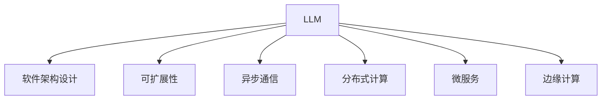

                 

# LLM对传统软件架构设计的挑战与创新

> 关键词：大语言模型,软件架构设计,挑战,创新,可扩展性,异步通信,分布式计算,微服务,边缘计算

## 1. 背景介绍

### 1.1 问题由来
随着人工智能技术的飞速发展，大语言模型(LLM)已经成为自然语言处理(NLP)领域的重要工具。然而，LLM的部署和使用对传统软件架构设计提出了新的挑战，也带来了创新的可能性。本文将深入探讨LLM对传统软件架构设计的挑战，并探讨如何通过创新应对这些挑战。

## 2. 核心概念与联系

### 2.1 核心概念概述

为更好地理解LLM对传统软件架构设计的挑战与创新，本节将介绍几个密切相关的核心概念：

- 大语言模型(LLM)：以自回归(如GPT)或自编码(如BERT)模型为代表的大规模预训练语言模型。通过在大规模无标签文本语料上进行预训练，学习通用的语言表示，具备强大的语言理解和生成能力。

- 软件架构设计：定义软件系统组件之间的结构、功能和交互方式，以实现系统的可扩展性、可维护性和可重用性。

- 可扩展性(Scalability)：指软件系统能够支持业务增长和负载变化，同时保持稳定性能的能力。

- 异步通信(Asynchronous Communication)：指系统组件间通过异步消息传递进行交互，减少阻塞和延迟，提高系统吞吐量。

- 分布式计算(Distributed Computing)：指将计算任务分布在多台计算机上并行执行，提高计算效率和系统容错性。

- 微服务(Microservices)：将软件系统划分为多个独立运行的小服务，每个服务负责特定的功能模块，通过轻量级通信机制进行交互。

- 边缘计算(Edge Computing)：指将计算任务分散到网络边缘的分布式设备上，减少延迟，提高响应速度。

这些核心概念之间的逻辑关系可以通过以下Mermaid流程图来展示：



这个流程图展示了大语言模型与软件架构设计的紧密联系：

1. 大语言模型通过预训练获得基础能力。
2. 通过软件架构设计，使大语言模型能够适应不同的应用场景，提升系统的性能和可扩展性。
3. 可扩展性、异步通信、分布式计算、微服务、边缘计算等架构设计策略，能够为大语言模型的部署和应用提供技术支持。

这些核心概念共同构成了LLM在实际应用中的架构设计基础，使其能够在各种场景下发挥强大的语言理解和生成能力。通过理解这些核心概念，我们可以更好地把握LLM的应用框架和优化方向。

## 3. 核心算法原理 & 具体操作步骤
### 3.1 算法原理概述

LLM在传统软件架构设计中的应用，主要涉及以下几个方面：

- **模型集成**：将LLM模型集成到现有的软件系统中，如Web应用、移动应用、语音助手等，使其能够处理自然语言输入和输出。
- **数据预处理**：对输入文本进行分词、标准化、上下文处理等预处理，以适配模型的输入格式。
- **推理优化**：优化模型的推理过程，提升处理速度和内存效率，以支持大规模用户并发。
- **分布式部署**：将模型部署到多台计算节点上，以提升系统的处理能力和容错性。

### 3.2 算法步骤详解

基于LLM的软件架构设计，一般包括以下几个关键步骤：

**Step 1: 需求分析与模型选择**
- 明确系统的需求，确定应用场景和任务。
- 根据任务要求，选择合适的LLM模型，如BERT、GPT等。

**Step 2: 系统架构设计**
- 设计系统的整体架构，包括组件划分、通信机制、数据流等。
- 确定数据预处理和推理优化的策略。

**Step 3: 模型集成与部署**
- 将LLM模型集成到系统架构中，确保模型能够正确处理输入和输出。
- 选择合适的分布式部署策略，如容器化、Kubernetes等。

**Step 4: 数据预处理**
- 对输入数据进行分词、标准化、上下文处理等预处理。
- 确定预处理的数据格式和存储方式。

**Step 5: 推理优化**
- 对推理过程进行优化，包括模型并行、推理加速、内存管理等。
- 使用缓存、压缩等技术减少计算和存储开销。

**Step 6: 监控与调优**
- 实时监控系统性能和资源使用情况。
- 根据监控结果进行模型参数调优和性能优化。

### 3.3 算法优缺点

基于LLM的软件架构设计方法具有以下优点：
1. 提升系统智能化水平。通过集成LLM，系统能够处理自然语言输入和输出，提升用户体验和智能化程度。
2. 提高系统可扩展性。分布式部署和微服务架构能够支持系统业务增长和负载变化。
3. 降低开发成本。使用预训练模型和现有工具，减少从头开发的工作量和时间成本。
4. 提升系统鲁棒性。异步通信和分布式计算能够提高系统的容错性和故障恢复能力。

同时，该方法也存在一定的局限性：
1. 数据处理复杂。自然语言的歧义性、复杂性导致数据预处理难度较大。
2. 推理速度较慢。大规模模型推理消耗大量计算资源，可能导致响应延迟。
3. 模型更新频率高。新模型的不断涌现，需要频繁更新和重训模型，增加系统维护成本。
4. 硬件资源要求高。模型的参数量和推理过程需要高性能计算资源支持。

尽管存在这些局限性，但就目前而言，基于LLM的软件架构设计方法仍然是智能应用开发的重要范式。未来相关研究的重点在于如何进一步降低模型推理成本，提高系统可扩展性和鲁棒性，同时兼顾计算资源的合理利用。

### 3.4 算法应用领域

基于LLM的软件架构设计方法，已经在众多领域得到了广泛的应用，包括但不限于以下方面：

- **智能客服系统**：利用LLM处理用户自然语言输入，生成智能回复，提升客服效率和用户满意度。
- **智能家居**：通过语音助手，实现语音识别和自然语言理解，控制家居设备，提升家居智能化水平。
- **医疗诊断**：使用LLM分析病历、医嘱等文本，辅助医生诊断和治疗，提升医疗服务质量。
- **金融分析**：利用LLM处理金融报告、新闻等文本，进行情感分析和舆情监测，辅助金融决策。
- **教育培训**：通过LLM生成个性化教学内容和评估，提升教育培训效果和学习体验。

除了上述这些经典应用外，LLM还被创新性地应用到更多场景中，如自动摘要、智能写作、智能安防等，为各行各业带来了新的突破和变革。

## 4. 数学模型和公式 & 详细讲解 & 举例说明

### 4.1 数学模型构建

本节将使用数学语言对基于LLM的软件架构设计过程进行更加严格的刻画。

记LLM模型为 $M_{\theta}$，其中 $\theta$ 为模型参数。假设系统需要处理的输入文本为 $x$，输出文本为 $y$。系统架构设计过程可以分为两个部分：数据预处理和推理优化。

**数据预处理**：将输入文本 $x$ 转化为模型所需的格式 $x'$。例如，分词、标准化、去除停用词等操作。

**推理优化**：对推理过程进行优化，得到输出文本 $y$。常见的推理优化方法包括模型并行、推理加速等。

### 4.2 公式推导过程

以下我们以一个简单的智能客服系统为例，推导基于LLM的系统架构设计过程。

假设系统需要处理的用户输入为 $x$，输出为智能回复 $y$。系统架构设计过程包括以下步骤：

1. **数据预处理**：将用户输入 $x$ 进行分词、标准化等预处理操作，转化为模型所需的格式 $x'$。
2. **模型推理**：将预处理后的输入 $x'$ 输入到LLM模型 $M_{\theta}$ 中，得到模型输出 $y'$。
3. **后处理**：对模型输出 $y'$ 进行后处理，生成最终的智能回复 $y$。

数据预处理和模型推理的具体实现过程可以通过以下伪代码表示：

```python
# 数据预处理
def preprocess_input(input_text):
    # 分词、标准化等操作
    return preprocessed_input

# 模型推理
def model_inference(preprocessed_input, model):
    # 输入模型，得到推理结果
    return model(preprocessed_input)

# 后处理
def postprocess_output(model_output):
    # 后处理操作，生成智能回复
    return processed_output
```

### 4.3 案例分析与讲解

以智能客服系统为例，系统架构设计过程可以分为以下几个关键步骤：

**Step 1: 需求分析与模型选择**
- 确定系统需求为处理用户输入，生成智能回复。
- 选择BERT等预训练模型作为基础模型。

**Step 2: 系统架构设计**
- 设计系统架构，包括组件划分、通信机制、数据流等。
- 确定数据预处理和推理优化的策略。

**Step 3: 模型集成与部署**
- 将预训练模型集成到系统架构中，确保模型能够正确处理输入和输出。
- 选择合适的分布式部署策略，如容器化、Kubernetes等。

**Step 4: 数据预处理**
- 对输入数据进行分词、标准化、上下文处理等预处理。
- 确定预处理的数据格式和存储方式。

**Step 5: 推理优化**
- 对推理过程进行优化，包括模型并行、推理加速、内存管理等。
- 使用缓存、压缩等技术减少计算和存储开销。

**Step 6: 监控与调优**
- 实时监控系统性能和资源使用情况。
- 根据监控结果进行模型参数调优和性能优化。

## 5. 项目实践：代码实例和详细解释说明
### 5.1 开发环境搭建

在进行LLM软件架构设计实践前，我们需要准备好开发环境。以下是使用Python进行Flask开发的环境配置流程：

1. 安装Anaconda：从官网下载并安装Anaconda，用于创建独立的Python环境。

2. 创建并激活虚拟环境：
```bash
conda create -n flask-env python=3.8 
conda activate flask-env
```

3. 安装Flask：
```bash
pip install flask
```

4. 安装相关库：
```bash
pip install tensorflow transformers pytorch
```

完成上述步骤后，即可在`flask-env`环境中开始实践。

### 5.2 源代码详细实现

这里我们以BERT模型为例，实现一个简单的智能客服系统。

首先，定义模型和预处理函数：

```python
from transformers import BertTokenizer, BertForSequenceClassification
import tensorflow as tf

tokenizer = BertTokenizer.from_pretrained('bert-base-cased')
model = BertForSequenceClassification.from_pretrained('bert-base-cased', num_labels=2)

def preprocess_input(input_text):
    # 分词、标准化等操作
    return tokenizer.encode(input_text, add_special_tokens=True)

def model_inference(preprocessed_input):
    # 输入模型，得到推理结果
    input_ids = tf.convert_to_tensor(preprocessed_input)
    with tf.compat.v1.Session(config=tf.compat.v1.ConfigProto(allow_soft_placement=True)) as sess:
        sess.run(tf.compat.v1.global_variables_initializer())
        logits = model(input_ids)[0]
    return logits

def postprocess_output(logits):
    # 后处理操作，生成智能回复
    predictions = tf.argmax(logits, axis=1)
    return [predictions]
```

然后，定义Flask应用，处理用户输入并生成回复：

```python
from flask import Flask, request, jsonify

app = Flask(__name__)

@app.route('/predict', methods=['POST'])
def predict():
    input_text = request.form['text']
    preprocessed_input = preprocess_input(input_text)
    logits = model_inference(preprocessed_input)
    predictions = postprocess_output(logits)
    return jsonify({'predictions': predictions})

if __name__ == '__main__':
    app.run(debug=True)
```

启动Flask应用后，可以通过HTTP请求的方式向系统输入自然语言，获取系统生成的智能回复。

### 5.3 代码解读与分析

让我们再详细解读一下关键代码的实现细节：

**preprocess_input函数**：
- 将用户输入进行分词、标准化等预处理操作，转化为模型所需的格式。

**model_inference函数**：
- 将预处理后的输入输入到BERT模型中，得到模型输出。
- 使用TensorFlow计算模型推理结果。

**postprocess_output函数**：
- 对模型输出进行后处理，生成最终的智能回复。

**Flask应用**：
- 定义Flask应用，处理HTTP请求。
- 通过Flask应用，将用户输入转发给模型进行推理，并将推理结果返回给用户。

可以看到，Flask框架使得模型部署和推理过程变得简洁高效。开发者可以将更多精力放在模型优化和数据处理上，而不必过多关注底层的实现细节。

当然，工业级的系统实现还需考虑更多因素，如模型的保存和部署、超参数的自动搜索、更灵活的任务适配层等。但核心的架构设计基本与此类似。

## 6. 实际应用场景
### 6.1 智能客服系统

基于LLM的软件架构设计方法，可以广泛应用于智能客服系统的构建。传统客服往往需要配备大量人力，高峰期响应缓慢，且一致性和专业性难以保证。通过将LLM集成到智能客服系统中，可以实现7x24小时不间断服务，快速响应客户咨询，用自然流畅的语言解答各类常见问题。

在技术实现上，可以收集企业内部的历史客服对话记录，将问题和最佳答复构建成监督数据，在此基础上对BERT等预训练模型进行微调。微调后的模型能够自动理解用户意图，匹配最合适的答案模板进行回复。对于客户提出的新问题，还可以接入检索系统实时搜索相关内容，动态组织生成回答。如此构建的智能客服系统，能大幅提升客户咨询体验和问题解决效率。

### 6.2 金融舆情监测

金融机构需要实时监测市场舆论动向，以便及时应对负面信息传播，规避金融风险。传统的人工监测方式成本高、效率低，难以应对网络时代海量信息爆发的挑战。通过将LLM集成到金融舆情监测系统中，能够自动判断文本属于何种主题，情感倾向是正面、中性还是负面。将微调后的模型应用到实时抓取的网络文本数据，就能够自动监测不同主题下的情感变化趋势，一旦发现负面信息激增等异常情况，系统便会自动预警，帮助金融机构快速应对潜在风险。

### 6.3 个性化推荐系统

当前的推荐系统往往只依赖用户的历史行为数据进行物品推荐，无法深入理解用户的真实兴趣偏好。通过将LLM集成到个性化推荐系统中，可以更好地挖掘用户行为背后的语义信息，从而提供更精准、多样的推荐内容。

在实践中，可以收集用户浏览、点击、评论、分享等行为数据，提取和用户交互的物品标题、描述、标签等文本内容。将文本内容作为模型输入，用户的后续行为（如是否点击、购买等）作为监督信号，在此基础上对BERT等预训练模型进行微调。微调后的模型能够从文本内容中准确把握用户的兴趣点。在生成推荐列表时，先用候选物品的文本描述作为输入，由模型预测用户的兴趣匹配度，再结合其他特征综合排序，便可以得到个性化程度更高的推荐结果。

### 6.4 未来应用展望

随着LLM和微调方法的不断发展，基于LLM的软件架构设计方法将在更多领域得到应用，为传统行业带来变革性影响。

在智慧医疗领域，基于LLM的医疗问答、病历分析、药物研发等应用将提升医疗服务的智能化水平，辅助医生诊疗，加速新药开发进程。

在智能教育领域，LLM集成到个性化推荐系统中，能够因材施教，促进教育公平，提高教学质量。

在智慧城市治理中，将LLM集成到城市事件监测、舆情分析、应急指挥等环节，提高城市管理的自动化和智能化水平，构建更安全、高效的未来城市。

此外，在企业生产、社会治理、文娱传媒等众多领域，基于LLM的软件架构设计方法也将不断涌现，为经济社会发展注入新的动力。相信随着预训练语言模型和微调方法的持续演进，基于LLM的软件架构设计方法必将进一步拓展应用边界，成为AI技术落地应用的重要范式。

## 7. 工具和资源推荐
### 7.1 学习资源推荐

为了帮助开发者系统掌握LLM和微调技术的理论基础和实践技巧，这里推荐一些优质的学习资源：

1. 《Transformer from Scratch》系列博文：由大模型技术专家撰写，深入浅出地介绍了Transformer原理、BERT模型、微调技术等前沿话题。

2. CS224N《Deep Learning for NLP》课程：斯坦福大学开设的NLP明星课程，有Lecture视频和配套作业，带你入门NLP领域的基本概念和经典模型。

3. 《Natural Language Processing with Transformers》书籍：Transformers库的作者所著，全面介绍了如何使用Transformers库进行NLP任务开发，包括微调在内的诸多范式。

4. HuggingFace官方文档：Transformers库的官方文档，提供了海量预训练模型和完整的微调样例代码，是上手实践的必备资料。

5. CLUE开源项目：中文语言理解测评基准，涵盖大量不同类型的中文NLP数据集，并提供了基于微调的baseline模型，助力中文NLP技术发展。

通过对这些资源的学习实践，相信你一定能够快速掌握LLM和微调技术的精髓，并用于解决实际的NLP问题。
###  7.2 开发工具推荐

高效的开发离不开优秀的工具支持。以下是几款用于LLM微调开发的常用工具：

1. TensorFlow：由Google主导开发的开源深度学习框架，生产部署方便，适合大规模工程应用。同样有丰富的预训练语言模型资源。

2. PyTorch：基于Python的开源深度学习框架，灵活动态的计算图，适合快速迭代研究。大部分预训练语言模型都有PyTorch版本的实现。

3. Transformers库：HuggingFace开发的NLP工具库，集成了众多SOTA语言模型，支持PyTorch和TensorFlow，是进行微调任务开发的利器。

4. Weights & Biases：模型训练的实验跟踪工具，可以记录和可视化模型训练过程中的各项指标，方便对比和调优。与主流深度学习框架无缝集成。

5. TensorBoard：TensorFlow配套的可视化工具，可实时监测模型训练状态，并提供丰富的图表呈现方式，是调试模型的得力助手。

6. Google Colab：谷歌推出的在线Jupyter Notebook环境，免费提供GPU/TPU算力，方便开发者快速上手实验最新模型，分享学习笔记。

合理利用这些工具，可以显著提升LLM微调任务的开发效率，加快创新迭代的步伐。

### 7.3 相关论文推荐

LLM和微调技术的发展源于学界的持续研究。以下是几篇奠基性的相关论文，推荐阅读：

1. Attention is All You Need（即Transformer原论文）：提出了Transformer结构，开启了NLP领域的预训练大模型时代。

2. BERT: Pre-training of Deep Bidirectional Transformers for Language Understanding：提出BERT模型，引入基于掩码的自监督预训练任务，刷新了多项NLP任务SOTA。

3. Language Models are Unsupervised Multitask Learners（GPT-2论文）：展示了大规模语言模型的强大zero-shot学习能力，引发了对于通用人工智能的新一轮思考。

4. Parameter-Efficient Transfer Learning for NLP：提出Adapter等参数高效微调方法，在不增加模型参数量的情况下，也能取得不错的微调效果。

5. Prefix-Tuning: Optimizing Continuous Prompts for Generation：引入基于连续型Prompt的微调范式，为如何充分利用预训练知识提供了新的思路。

6. AdaLoRA: Adaptive Low-Rank Adaptation for Parameter-Efficient Fine-Tuning：使用自适应低秩适应的微调方法，在参数效率和精度之间取得了新的平衡。

这些论文代表了大语言模型微调技术的发展脉络。通过学习这些前沿成果，可以帮助研究者把握学科前进方向，激发更多的创新灵感。

## 8. 总结：未来发展趋势与挑战

### 8.1 总结

本文对基于LLM的软件架构设计方法进行了全面系统的介绍。首先阐述了LLM和微调技术的研究背景和意义，明确了LLM在智能应用中的独特价值。其次，从原理到实践，详细讲解了LLM的软件架构设计过程，给出了微调任务开发的完整代码实例。同时，本文还广泛探讨了LLM在智能客服、金融舆情、个性化推荐等多个领域的应用前景，展示了LLM范式的巨大潜力。此外，本文精选了微调技术的各类学习资源，力求为读者提供全方位的技术指引。

通过本文的系统梳理，可以看到，基于LLM的软件架构设计方法正在成为智能应用开发的重要范式，极大地拓展了预训练语言模型的应用边界，催生了更多的落地场景。受益于大规模语料的预训练，LLM在微调过程中能够利用丰富的语言知识，提供更加智能、灵活的应用服务。未来，伴随LLM和微调方法的持续演进，基于LLM的软件架构设计方法必将在构建人机协同的智能时代中扮演越来越重要的角色。

### 8.2 未来发展趋势

展望未来，基于LLM的软件架构设计方法将呈现以下几个发展趋势：

1. 模型规模持续增大。随着算力成本的下降和数据规模的扩张，预训练语言模型的参数量还将持续增长。超大规模语言模型蕴含的丰富语言知识，有望支撑更加复杂多变的下游任务微调。

2. 微调方法日趋多样。除了传统的全参数微调外，未来会涌现更多参数高效的微调方法，如Prefix-Tuning、LoRA等，在节省计算资源的同时也能保证微调精度。

3. 持续学习成为常态。随着数据分布的不断变化，微调模型也需要持续学习新知识以保持性能。如何在不遗忘原有知识的同时，高效吸收新样本信息，将成为重要的研究课题。

4. 标注样本需求降低。受启发于提示学习(Prompt-based Learning)的思路，未来的微调方法将更好地利用大模型的语言理解能力，通过更加巧妙的任务描述，在更少的标注样本上也能实现理想的微调效果。

5. 模型通用性增强。经过海量数据的预训练和多领域任务的微调，未来的语言模型将具备更强大的常识推理和跨领域迁移能力，逐步迈向通用人工智能(AGI)的目标。

以上趋势凸显了大语言模型微调技术的广阔前景。这些方向的探索发展，必将进一步提升NLP系统的性能和应用范围，为人类认知智能的进化带来深远影响。

### 8.3 面临的挑战

尽管基于LLM的软件架构设计方法已经取得了瞩目成就，但在迈向更加智能化、普适化应用的过程中，它仍面临着诸多挑战：

1. 标注成本瓶颈。虽然微调大大降低了标注数据的需求，但对于长尾应用场景，难以获得充足的高质量标注数据，成为制约微调性能的瓶颈。如何进一步降低微调对标注样本的依赖，将是一大难题。

2. 模型鲁棒性不足。当前微调模型面对域外数据时，泛化性能往往大打折扣。对于测试样本的微小扰动，微调模型的预测也容易发生波动。如何提高微调模型的鲁棒性，避免灾难性遗忘，还需要更多理论和实践的积累。

3. 推理效率较慢。大规模语言模型虽然精度高，但在实际部署时往往面临推理速度慢、内存占用大等效率问题。如何在保证性能的同时，简化模型结构，提升推理速度，优化资源占用，将是重要的优化方向。

4. 可解释性亟需加强。当前微调模型更像是"黑盒"系统，难以解释其内部工作机制和决策逻辑。对于医疗、金融等高风险应用，算法的可解释性和可审计性尤为重要。如何赋予微调模型更强的可解释性，将是亟待攻克的难题。

5. 安全性有待保障。预训练语言模型难免会学习到有偏见、有害的信息，通过微调传递到下游任务，产生误导性、歧视性的输出，给实际应用带来安全隐患。如何从数据和算法层面消除模型偏见，避免恶意用途，确保输出的安全性，也将是重要的研究课题。

6. 知识整合能力不足。现有的微调模型往往局限于任务内数据，难以灵活吸收和运用更广泛的先验知识。如何让微调过程更好地与外部知识库、规则库等专家知识结合，形成更加全面、准确的信息整合能力，还有很大的想象空间。

正视LLM和微调面临的这些挑战，积极应对并寻求突破，将是大语言模型微调走向成熟的必由之路。相信随着学界和产业界的共同努力，这些挑战终将一一被克服，基于LLM的软件架构设计方法必将在构建安全、可靠、可解释、可控的智能系统铺平道路。

### 8.4 未来突破

面对LLM和微调所面临的种种挑战，未来的研究需要在以下几个方面寻求新的突破：

1. 探索无监督和半监督微调方法。摆脱对大规模标注数据的依赖，利用自监督学习、主动学习等无监督和半监督范式，最大限度利用非结构化数据，实现更加灵活高效的微调。

2. 研究参数高效和计算高效的微调范式。开发更加参数高效的微调方法，在固定大部分预训练参数的同时，只更新极少量的任务相关参数。同时优化微调模型的计算图，减少前向传播和反向传播的资源消耗，实现更加轻量级、实时性的部署。

3. 融合因果和对比学习范式。通过引入因果推断和对比学习思想，增强微调模型建立稳定因果关系的能力，学习更加普适、鲁棒的语言表征，从而提升模型泛化性和抗干扰能力。

4. 引入更多先验知识。将符号化的先验知识，如知识图谱、逻辑规则等，与神经网络模型进行巧妙融合，引导微调过程学习更准确、合理的语言模型。同时加强不同模态数据的整合，实现视觉、语音等多模态信息与文本信息的协同建模。

5. 结合因果分析和博弈论工具。将因果分析方法引入微调模型，识别出模型决策的关键特征，增强输出解释的因果性和逻辑性。借助博弈论工具刻画人机交互过程，主动探索并规避模型的脆弱点，提高系统稳定性。

6. 纳入伦理道德约束。在模型训练目标中引入伦理导向的评估指标，过滤和惩罚有偏见、有害的输出倾向。同时加强人工干预和审核，建立模型行为的监管机制，确保输出符合人类价值观和伦理道德。

这些研究方向的探索，必将引领大语言模型微调技术迈向更高的台阶，为构建安全、可靠、可解释、可控的智能系统铺平道路。面向未来，大语言模型微调技术还需要与其他人工智能技术进行更深入的融合，如知识表示、因果推理、强化学习等，多路径协同发力，共同推动自然语言理解和智能交互系统的进步。只有勇于创新、敢于突破，才能不断拓展语言模型的边界，让智能技术更好地造福人类社会。

## 9. 附录：常见问题与解答

**Q1：LLM在实际应用中面临的主要挑战有哪些？**

A: LLM在实际应用中面临的主要挑战包括：
1. 标注成本瓶颈。虽然微调大大降低了标注数据的需求，但对于长尾应用场景，难以获得充足的高质量标注数据。
2. 模型鲁棒性不足。当前微调模型面对域外数据时，泛化性能往往大打折扣。
3. 推理效率较慢。大规模语言模型虽然精度高，但在实际部署时往往面临推理速度慢、内存占用大等效率问题。
4. 可解释性亟需加强。当前微调模型更像是"黑盒"系统，难以解释其内部工作机制和决策逻辑。
5. 安全性有待保障。预训练语言模型难免会学习到有偏见、有害的信息，通过微调传递到下游任务，产生误导性、歧视性的输出。
6. 知识整合能力不足。现有的微调模型往往局限于任务内数据，难以灵活吸收和运用更广泛的先验知识。

**Q2：如何优化LLM在实际应用中的性能？**

A: 优化LLM在实际应用中的性能可以从以下几个方面入手：
1. 数据增强。通过回译、近义替换等方式扩充训练集，减少过拟合风险。
2. 正则化。使用L2正则、Dropout等正则化技术，防止模型过度适应小样本训练集。
3. 模型裁剪。去除不必要的层和参数，减小模型尺寸，加快推理速度。
4. 推理加速。使用缓存、压缩等技术减少计算和存储开销，提高推理效率。
5. 分布式部署。将模型部署到多台计算节点上，以提升系统的处理能力和容错性。
6. 持续学习。定期更新模型，保持对新数据和任务的适应能力。

**Q3：LLM在智能客服系统中如何实现？**

A: 在智能客服系统中，LLM可以集成到系统架构中，实现自然语言理解和智能回复。具体实现步骤如下：
1. 收集企业内部的历史客服对话记录，将问题和最佳答复构建成监督数据。
2. 选择BERT等预训练模型，对其进行微调，使其能够理解用户意图并匹配最合适的答案模板。
3. 将微调后的模型集成到客服系统中，处理用户输入，生成智能回复。
4. 对于客户提出的新问题，可以接入检索系统实时搜索相关内容，动态组织生成回答。

**Q4：LLM在个性化推荐系统中的应用场景有哪些？**

A: LLM在个性化推荐系统中可以用于以下应用场景：
1. 用户行为分析：通过分析用户浏览、点击、评论等行为数据，提取和用户交互的物品标题、描述、标签等文本内容。
2. 文本嵌入生成：将文本内容作为模型输入，生成用户行为嵌入向量。
3. 推荐生成：通过比较用户行为嵌入和物品行为嵌入，生成个性化推荐列表。
4. 反馈学习：通过用户对推荐结果的反馈，进一步微调模型，提升推荐效果。

**Q5：LLM在金融舆情监测中的应用效果如何？**

A: LLM在金融舆情监测中的应用效果主要体现在以下几个方面：
1. 主题分析：通过微调模型，自动判断文本属于何种主题，如市场动向、政策变化等。
2. 情感分析：通过微调模型，判断情感倾向是正面、中性还是负面，帮助金融机构及时应对负面信息传播。
3. 舆情预警：将监测到的舆情信息通过告警机制及时通知金融机构，帮助其规避金融风险。

---

作者：禅与计算机程序设计艺术 / Zen and the Art of Computer Programming

