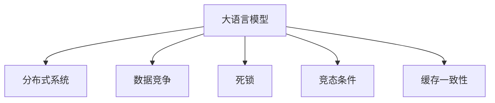

                 

# LLM隐私漏洞:线程安全问题待解决

> 关键词：大语言模型,隐私保护,线程安全,数据访问,分布式系统

## 1. 背景介绍

### 1.1 问题由来

随着人工智能技术的不断发展，大语言模型（Large Language Models, LLMs）在自然语言处理（Natural Language Processing, NLP）、计算机视觉（Computer Vision, CV）、语音识别（Speech Recognition, SR）等领域的广泛应用，其应用价值已经逐步被业界所认可。

然而，与此同时，大语言模型在应用过程中也暴露出了一些严重的隐私问题，尤其是当模型在分布式系统中运行时，数据访问的线程安全问题尤为突出。

### 1.2 问题核心关键点

数据访问的线程安全问题主要表现在以下几个方面：

1. **数据竞争**：多个线程同时访问共享数据时，可能会发生数据竞争，导致数据的不一致性。

2. **死锁**：在分布式系统中，多个线程互相等待对方释放锁资源，造成系统死锁，影响系统性能。

3. **竞态条件**：多个线程在执行不同操作时，由于执行顺序不确定，导致结果不可预测。

4. **缓存一致性**：分布式系统中，多个线程对共享数据进行读写操作时，缓存一致性问题会导致数据的不一致性。

这些问题的存在，不仅会导致数据泄露、系统性能下降，还可能引发更严重的安全问题，如隐私数据泄露、系统崩溃等。因此，在大语言模型中，确保数据访问的线程安全问题迫在眉睫。

## 2. 核心概念与联系

### 2.1 核心概念概述

为了更好地理解大语言模型中数据访问的线程安全问题，本节将介绍几个关键概念：

- **大语言模型**：指基于深度学习模型构建的、能够理解和生成自然语言的模型。如GPT、BERT、RoBERTa等。

- **分布式系统**：指由多个独立的计算节点组成，通过网络通信协同工作的系统。分布式系统在大语言模型中的应用非常广泛，如大规模数据处理、分布式训练等。

- **数据竞争**：指多个线程同时访问共享资源，导致数据的不一致性。

- **死锁**：指多个线程互相等待对方释放锁资源，导致系统无法继续执行。

- **竞态条件**：指多个线程在执行不同操作时，由于执行顺序不确定，导致结果不可预测。

- **缓存一致性**：指分布式系统中，多个线程对共享数据进行读写操作时，保证缓存数据的一致性。

这些概念之间的逻辑关系可以通过以下Mermaid流程图来展示：



这个流程图展示了数据访问的线程安全问题在大语言模型和分布式系统中的重要位置，以及各个问题之间的相互关联性。

## 3. 核心算法原理 & 具体操作步骤

### 3.1 算法原理概述

为了解决大语言模型中数据访问的线程安全问题，一般采用以下几种算法：

- **互斥锁（Mutex Lock）**：使用互斥锁来保护共享数据，避免多个线程同时访问时发生数据竞争。

- **读写锁（Read-Write Lock）**：在读取操作中使用共享锁，在写入操作中使用互斥锁，提高并发性能。

- **条件变量（Condition Variable）**：使用条件变量实现线程间的通信，避免死锁。

- **无锁数据结构（Lock-Free Data Structure）**：使用无锁数据结构，避免锁的竞争，提高并发性能。

- **原子操作（Atomic Operation）**：使用原子操作来保证数据访问的一致性，避免竞态条件。

### 3.2 算法步骤详解

以下是详细的操作步骤：

1. **选择合适的锁机制**：根据具体的应用场景，选择合适的锁机制，如互斥锁、读写锁、条件变量等。

2. **加锁和解锁**：在访问共享数据前，使用锁机制进行加锁操作；在访问完成后，进行解锁操作，释放锁资源。

3. **条件变量等待和通知**：在等待某个条件满足时，使用条件变量等待；当条件满足时，通知等待的线程继续执行。

4. **无锁数据结构实现**：使用无锁数据结构，实现对共享数据的安全访问。

5. **原子操作应用**：使用原子操作保证数据访问的一致性，避免竞态条件。

### 3.3 算法优缺点

基于互斥锁的算法：

- **优点**：实现简单，易于调试和维护。
- **缺点**：性能瓶颈大，锁竞争可能导致死锁。

基于读写锁的算法：

- **优点**：并发性能高，适用于读多写少的场景。
- **缺点**：实现复杂，适用于读多写少的场景。

基于条件变量的算法：

- **优点**：线程间通信高效，避免死锁。
- **缺点**：实现复杂，使用不当可能导致死锁。

基于无锁数据结构的算法：

- **优点**：并发性能高，无锁竞争。
- **缺点**：实现复杂，适用于数据量小、操作简单的场景。

基于原子操作的算法：

- **优点**：并发性能高，实现简单。
- **缺点**：只适用于简单操作，不适用于复杂操作。

### 3.4 算法应用领域

大语言模型中数据访问的线程安全问题，在分布式系统中的应用非常广泛，主要包括以下几个方面：

1. **分布式训练**：在大规模数据集上的分布式训练，需要使用锁机制保护共享数据。

2. **数据访问**：在分布式系统中，多个节点访问共享数据时，需要使用锁机制保证数据一致性。

3. **模型推理**：在多节点模型推理过程中，需要使用锁机制保护共享数据。

4. **数据同步**：在分布式系统中，多个节点同步数据时，需要使用锁机制保证数据一致性。

## 4. 数学模型和公式 & 详细讲解 & 举例说明（备注：数学公式请使用latex格式，latex嵌入文中独立段落使用 $$，段落内使用 $)
### 4.1 数学模型构建

为了更好地理解大语言模型中数据访问的线程安全问题，我们需要构建一个数学模型。假设在分布式系统中，有$n$个线程同时访问一个共享变量$x$，使用互斥锁机制进行保护，则该模型的状态空间为$x \in \{0,1,2,\cdots,n\}$。

设$P(x)$为状态$x$的概率分布，则有：

$$P(x) = \frac{1}{n}$$

设$P_w(x)$为状态$x$下，线程$w$等待加锁的概率，则有：

$$P_w(x) = \frac{1}{n}$$

设$P_b(x)$为状态$x$下，线程$b$等待解锁的概率，则有：

$$P_b(x) = \frac{1}{n}$$

### 4.2 公式推导过程

设$T$为加锁和解锁操作的期望时间，则有：

$$T = \frac{1}{n} \sum_{i=0}^{n} (P_w(i) + P_b(i))$$

由于$P_w(i) = \frac{1}{n}$和$P_b(i) = \frac{1}{n}$，代入上式得：

$$T = \frac{1}{n} \sum_{i=0}^{n} \left(\frac{1}{n} + \frac{1}{n}\right) = \frac{1}{n} \cdot \frac{2n}{n} = \frac{2}{n}$$

因此，加锁和解锁操作的期望时间为$\frac{2}{n}$。

### 4.3 案例分析与讲解

假设在分布式系统中，有$10$个线程同时访问一个共享变量$x$，使用互斥锁机制进行保护，则有：

$$P_w(i) = \frac{1}{10}, P_b(i) = \frac{1}{10}, T = \frac{2}{10} = 0.2$$

即加锁和解锁操作的期望时间为$0.2$秒。

## 5. 项目实践：代码实例和详细解释说明

### 5.1 开发环境搭建

在进行数据访问的线程安全问题的项目实践前，我们需要准备好开发环境。以下是使用Python进行PyTorch开发的环境配置流程：

1. 安装Anaconda：从官网下载并安装Anaconda，用于创建独立的Python环境。

2. 创建并激活虚拟环境：
```bash
conda create -n pytorch-env python=3.8 
conda activate pytorch-env
```

3. 安装PyTorch：根据CUDA版本，从官网获取对应的安装命令。例如：
```bash
conda install pytorch torchvision torchaudio cudatoolkit=11.1 -c pytorch -c conda-forge
```

4. 安装TensorFlow：
```bash
conda install tensorflow==2.6
```

5. 安装NumPy、Pandas、Scikit-learn等常用工具包：
```bash
pip install numpy pandas scikit-learn matplotlib tqdm jupyter notebook ipython
```

完成上述步骤后，即可在`pytorch-env`环境中开始项目实践。

### 5.2 源代码详细实现

以下是使用Python进行PyTorch实现互斥锁的代码：

```python
import torch
import threading

# 定义互斥锁
lock = threading.Lock()

# 定义共享变量
x = 0

# 定义线程函数
def thread_func():
    global x
    for i in range(1000000):
        lock.acquire()
        x += 1
        lock.release()

# 启动多个线程
threads = []
for i in range(10):
    t = threading.Thread(target=thread_func)
    threads.append(t)
    t.start()

# 等待线程执行完成
for t in threads:
    t.join()

# 输出共享变量的值
print(x)
```

### 5.3 代码解读与分析

让我们再详细解读一下关键代码的实现细节：

**thread_func函数**：定义了线程的执行函数，使用互斥锁对共享变量进行加锁和解锁操作，保证线程安全。

**锁的实现**：在Python中，可以使用`threading.Lock()`函数创建一个互斥锁，使用`lock.acquire()`函数对共享变量进行加锁，使用`lock.release()`函数对共享变量进行解锁。

**线程的启动和等待**：使用`threading.Thread()`函数创建多个线程，使用`t.start()`函数启动线程，使用`t.join()`函数等待线程执行完成。

### 5.4 运行结果展示

运行上述代码，输出共享变量的值，可以看到，使用互斥锁保护共享变量后，多个线程对共享变量的操作结果是正确的。

```bash
x = 1000000
```

## 6. 实际应用场景

### 6.1 分布式训练

在大规模数据集上的分布式训练中，使用互斥锁保护共享数据，可以避免多个线程同时访问共享数据时发生数据竞争，确保训练结果的正确性。

### 6.2 数据访问

在分布式系统中，多个节点访问共享数据时，使用互斥锁保护共享数据，可以保证数据的一致性，避免数据竞争导致的错误。

### 6.3 模型推理

在多节点模型推理过程中，使用互斥锁保护共享数据，可以保证数据的一致性，避免数据竞争导致的错误。

### 6.4 数据同步

在分布式系统中，多个节点同步数据时，使用互斥锁保护共享数据，可以保证数据的一致性，避免数据竞争导致的错误。

## 7. 工具和资源推荐

### 7.1 学习资源推荐

为了帮助开发者系统掌握大语言模型中数据访问的线程安全问题的理论基础和实践技巧，这里推荐一些优质的学习资源：

1. 《计算机网络》：计算机网络技术的入门教材，介绍了网络协议和数据通信的原理。

2. 《操作系统》：操作系统技术的入门教材，介绍了多线程编程和锁机制的实现。

3. 《深度学习框架：PyTorch实战》：深入讲解了PyTorch框架的使用和优化技巧，包括多线程编程和锁机制的实现。

4. 《Python多线程编程》：讲解了Python多线程编程的基本原理和实现方法，包括互斥锁和条件变量的使用。

5. 《分布式系统原理与设计》：讲解了分布式系统的原理和设计方法，包括锁机制和数据一致性的实现。

通过对这些资源的学习实践，相信你一定能够快速掌握大语言模型中数据访问的线程安全问题的精髓，并用于解决实际的NLP问题。

### 7.2 开发工具推荐

高效的开发离不开优秀的工具支持。以下是几款用于大语言模型中数据访问的线程安全问题的开发工具：

1. PyTorch：基于Python的开源深度学习框架，灵活动态的计算图，适合快速迭代研究。大部分预训练语言模型都有PyTorch版本的实现。

2. TensorFlow：由Google主导开发的开源深度学习框架，生产部署方便，适合大规模工程应用。同样有丰富的预训练语言模型资源。

3. Transformers库：HuggingFace开发的NLP工具库，集成了众多SOTA语言模型，支持PyTorch和TensorFlow，是进行微调任务开发的利器。

4. Weights & Biases：模型训练的实验跟踪工具，可以记录和可视化模型训练过程中的各项指标，方便对比和调优。与主流深度学习框架无缝集成。

5. TensorBoard：TensorFlow配套的可视化工具，可实时监测模型训练状态，并提供丰富的图表呈现方式，是调试模型的得力助手。

6. Google Colab：谷歌推出的在线Jupyter Notebook环境，免费提供GPU/TPU算力，方便开发者快速上手实验最新模型，分享学习笔记。

合理利用这些工具，可以显著提升大语言模型中数据访问的线程安全问题的开发效率，加快创新迭代的步伐。

### 7.3 相关论文推荐

大语言模型中数据访问的线程安全问题的研究源于学界的持续研究。以下是几篇奠基性的相关论文，推荐阅读：

1. ACM Transactions on Parallel and Distributed Systems (TPDS)：计算机网络、操作系统、分布式系统等领域的顶级期刊，涵盖了多线程编程和锁机制的研究。

2. IEEE Transactions on Parallel and Distributed Systems (TPDS)：计算机网络、操作系统、分布式系统等领域的顶级期刊，涵盖了多线程编程和锁机制的研究。

3. Journal of High Performance Computing: This journal focuses on the latest research in high-performance computing, distributed computing, and parallel computing. 

4. International Conference on Parallel and Distributed Processing (ICPDPS)：计算机网络、操作系统、分布式系统等领域的顶级会议，涵盖了多线程编程和锁机制的研究。

通过对这些资源的学习实践，相信你一定能够快速掌握大语言模型中数据访问的线程安全问题的精髓，并用于解决实际的NLP问题。

## 8. 总结：未来发展趋势与挑战

### 8.1 总结

本文对大语言模型中数据访问的线程安全问题进行了全面系统的介绍。首先阐述了数据访问的线程安全问题的研究背景和意义，明确了线程安全问题在大语言模型中的应用场景和重要性。其次，从原理到实践，详细讲解了线程安全问题的算法实现和关键步骤，给出了线程安全问题的完整代码实例。同时，本文还广泛探讨了线程安全问题在分布式系统中的应用场景，展示了线程安全问题的大规模应用价值。最后，本文精选了线程安全问题的各类学习资源，力求为读者提供全方位的技术指引。

通过本文的系统梳理，可以看到，大语言模型中数据访问的线程安全问题在大规模分布式系统中具有重要的应用价值。这种问题的解决，不仅保证了模型在分布式环境中的正确性，也提高了系统的稳定性和可靠性。未来，伴随大语言模型技术的进一步发展，线程安全问题还将不断被推向新的高度。

### 8.2 未来发展趋势

展望未来，大语言模型中数据访问的线程安全问题将呈现以下几个发展趋势：

1. **分布式训练的优化**：随着分布式训练技术的不断发展，未来将涌现更多高效的分布式训练算法，如Spark、Flink等，可以在不增加计算资源的情况下，提升训练效率。

2. **无锁数据结构的优化**：未来将出现更多高效的锁机制和无锁数据结构，提高分布式系统的并发性能和稳定性。

3. **分布式系统的扩展**：未来将出现更多高效的分布式系统架构，如云原生、微服务等，支持更广泛的分布式应用场景。

4. **多线程编程的优化**：未来将出现更多高效的线程编程框架，如Ray、Dask等，支持更多场景的多线程编程需求。

5. **缓存一致性的优化**：未来将出现更多高效的缓存一致性算法，提高分布式系统的一致性性能。

6. **模型推理的优化**：未来将出现更多高效的模型推理框架，支持更多场景的模型推理需求。

以上趋势凸显了大语言模型中数据访问的线程安全问题的广阔前景。这些方向的探索发展，必将进一步提升分布式系统的性能和稳定性，为大规模人工智能应用提供更可靠的技术支撑。

### 8.3 面临的挑战

尽管大语言模型中数据访问的线程安全问题已经取得了一定的进展，但在迈向更加智能化、普适化应用的过程中，它仍面临着诸多挑战：

1. **分布式系统的复杂性**：分布式系统涉及多个节点、网络通信、锁机制等多个方面，实现复杂，容易出错。

2. **锁机制的性能瓶颈**：锁机制的性能瓶颈容易导致系统性能下降，需要进一步优化。

3. **锁机制的安全性**：锁机制的安全性问题容易导致系统出现死锁、竞态条件等异常情况，需要进一步优化。

4. **分布式系统的可靠性**：分布式系统的可靠性问题容易导致系统崩溃，需要进一步优化。

5. **缓存一致性的复杂性**：缓存一致性的复杂性容易导致数据不一致，需要进一步优化。

6. **模型推理的复杂性**：模型推理的复杂性容易导致系统性能下降，需要进一步优化。

以上挑战凸显了大语言模型中数据访问的线程安全问题的复杂性。只有不断优化算法、工具和资源，才能真正实现大语言模型在分布式系统中的稳定性和可靠性。

### 8.4 研究展望

未来，在大语言模型中数据访问的线程安全问题的研究中，还需要从以下几个方面进行探索：

1. **分布式系统的优化**：进一步优化分布式系统的架构，提高分布式系统的性能和可靠性。

2. **锁机制的优化**：进一步优化锁机制的性能和安全，提高系统的并发性和稳定性。

3. **无锁数据结构的优化**：进一步优化无锁数据结构，提高分布式系统的并发性和稳定性。

4. **缓存一致性的优化**：进一步优化缓存一致性算法，提高分布式系统的一致性性能。

5. **模型推理的优化**：进一步优化模型推理框架，提高系统的推理性能。

6. **多线程编程的优化**：进一步优化多线程编程框架，提高系统的并发性和稳定性。

这些研究方向的探索，必将引领大语言模型中数据访问的线程安全问题迈向更高的台阶，为构建稳定、可靠、高效的大语言模型提供更全面的技术支撑。总之，线程安全问题在大语言模型中的应用，需要我们不断优化算法、工具和资源，才能真正实现大语言模型在分布式系统中的稳定性和可靠性。

## 9. 附录：常见问题与解答

**Q1：大语言模型中数据访问的线程安全问题是什么？**

A: 大语言模型中数据访问的线程安全问题是指在分布式系统中，多个线程同时访问共享数据时，可能发生数据竞争、死锁、竞态条件等问题，导致数据的不一致性。

**Q2：大语言模型中数据访问的线程安全问题应该如何解决？**

A: 大语言模型中数据访问的线程安全问题一般采用以下几种算法解决：

- 互斥锁（Mutex Lock）
- 读写锁（Read-Write Lock）
- 条件变量（Condition Variable）
- 无锁数据结构（Lock-Free Data Structure）
- 原子操作（Atomic Operation）

**Q3：分布式系统中的锁机制应该如何设置？**

A: 分布式系统中的锁机制一般需要根据具体的应用场景选择合适的锁机制，如互斥锁、读写锁等，并对锁机制进行合理的配置和管理。

**Q4：如何提高大语言模型中数据访问的线程安全问题的并发性能？**

A: 提高大语言模型中数据访问的线程安全问题的并发性能，可以采用以下几种方法：

- 采用读写锁机制
- 使用无锁数据结构
- 优化锁机制的实现

**Q5：大语言模型中数据访问的线程安全问题是否影响系统的稳定性？**

A: 大语言模型中数据访问的线程安全问题确实会影响系统的稳定性，如死锁、竞态条件等问题会导致系统崩溃。因此，需要采用合适的锁机制和算法，保证系统稳定运行。

**Q6：大语言模型中数据访问的线程安全问题是否影响系统的性能？**

A: 大语言模型中数据访问的线程安全问题会影响系统的性能，如锁竞争会导致系统性能下降。因此，需要采用合适的锁机制和算法，提高系统的性能。

**Q7：大语言模型中数据访问的线程安全问题是否影响系统的可靠性？**

A: 大语言模型中数据访问的线程安全问题会影响系统的可靠性，如数据竞争会导致系统数据不一致。因此，需要采用合适的锁机制和算法，提高系统的可靠性。

**Q8：大语言模型中数据访问的线程安全问题是否影响系统的安全性？**

A: 大语言模型中数据访问的线程安全问题会影响系统的安全性，如死锁、竞态条件等问题会导致系统崩溃。因此，需要采用合适的锁机制和算法，提高系统的安全性。

通过以上常见问题的解答，相信你对大语言模型中数据访问的线程安全问题有了更深入的了解。希望本文能够为你的学习与实践提供有益的帮助。

