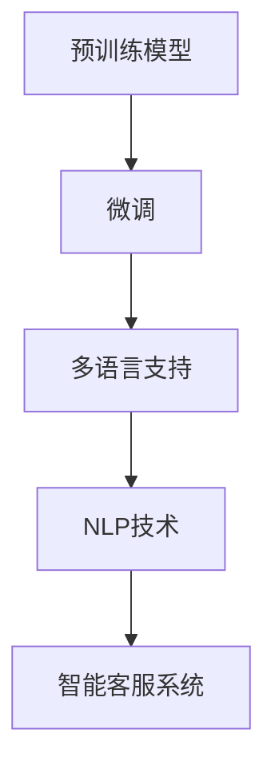

                 

# LLM驱动的智能客户服务：全天候多语言支持

> 关键词：自然语言处理, 智能客服, 大语言模型, 多语言支持, 预训练模型, 自监督学习

## 1. 背景介绍

### 1.1 问题由来
近年来，随着人工智能技术的飞速发展，智能客服系统已成为各大企业提升客户服务质量的重要手段。传统的客服方式依靠人力，不仅成本高，而且效率低下，无法满足现代企业的服务需求。大语言模型（Large Language Models, LLMs）的兴起，使得智能客服系统的建设变得更加高效、智能。

智能客服系统通过构建基于自然语言处理的对话模型，可以实现7x24小时不间断服务，快速响应客户咨询，提供个性化的服务。在实际应用中，智能客服系统在银行、保险、电商等多个行业得到了广泛应用，有效提升了客户满意度和服务效率。

然而，当前的智能客服系统在多语言支持方面还存在诸多挑战。随着全球化进程的加快，企业需要提供多语言服务来满足不同客户的需求。同时，全球范围内自然语言处理（NLP）技术也在不断进步，多语言支持的智能客服系统成为了新的研究热点。

## 2. 核心概念与联系

### 2.1 核心概念概述

智能客服系统的核心概念包括：

- **大语言模型（Large Language Models, LLMs）**：基于深度学习的预训练语言模型，能够理解和生成自然语言。例如，GPT-3、BERT等模型已在多个NLP任务上取得了显著效果。

- **预训练（Pre-training）**：在大规模无标签数据上训练语言模型，学习通用的语言知识。例如，GPT-3在文本生成、语言推理等任务上表现优异。

- **微调（Fine-tuning）**：在预训练模型的基础上，使用特定任务的数据集进行有监督学习，优化模型在特定任务上的性能。例如，使用微调技术可以显著提升智能客服系统在分类、问答等任务上的表现。

- **多语言支持**：智能客服系统需要支持多种语言，以服务不同语言背景的客户。

- **自然语言处理（Natural Language Processing, NLP）**：通过算法和模型处理自然语言，实现自动问答、情感分析等任务。

这些概念之间相互关联，共同构成了智能客服系统的基础框架。预训练模型提供了通用的语言知识，微调技术用于提升模型在特定任务上的性能，多语言支持和自然语言处理技术使得智能客服系统能够提供多语言服务。

### 2.2 核心概念原理和架构的 Mermaid 流程图



这个流程图展示了预训练模型、微调、多语言支持和NLP技术之间的关系，最终构成了智能客服系统。

## 3. 核心算法原理 & 具体操作步骤

### 3.1 算法原理概述

智能客服系统的核心算法原理主要包括以下几个方面：

1. **预训练模型**：通过在大规模无标签数据上进行自监督学习，学习通用的语言知识和表示能力。例如，GPT-3通过在大规模文本数据上进行预训练，学习到了丰富的语言知识。

2. **微调**：在预训练模型的基础上，使用特定任务的数据集进行有监督学习，优化模型在特定任务上的性能。例如，在智能客服系统中，可以使用微调技术提升模型在问答、分类等任务上的表现。

3. **多语言支持**：通过多语言版本的预训练模型，或通过微调支持多语言的任务数据集，实现多语言支持。例如，可以使用多语言版本的BERT进行微调，支持多语言问答。

4. **自然语言处理（NLP）**：利用NLP技术实现自动问答、情感分析等任务。例如，可以使用BERT进行实体识别、情感分类等任务。

### 3.2 算法步骤详解

智能客服系统的构建可以分为以下几个步骤：

**Step 1: 准备预训练模型和数据集**
- 选择合适的预训练语言模型，如BERT、GPT-3等。
- 收集智能客服系统所需的多语言支持数据集，例如多语言问答、分类等任务的数据集。

**Step 2: 添加任务适配层**
- 根据任务类型，在预训练模型顶层设计合适的输出层和损失函数。例如，在问答任务中，可以使用softmax函数作为输出层，交叉熵损失函数作为损失函数。

**Step 3: 设置微调超参数**
- 选择合适的优化算法及其参数，如AdamW、SGD等，设置学习率、批大小、迭代轮数等。例如，可以使用AdamW优化器，学习率为2e-5。

**Step 4: 执行梯度训练**
- 将训练集数据分批次输入模型，前向传播计算损失函数。例如，可以使用PyTorch框架进行模型训练。
- 反向传播计算参数梯度，根据设定的优化算法和学习率更新模型参数。例如，可以使用PyTorch框架进行模型训练。
- 周期性在验证集上评估模型性能，根据性能指标决定是否触发Early Stopping。例如，可以使用Keras框架进行模型训练。

**Step 5: 测试和部署**
- 在测试集上评估微调后模型在问答、分类等任务上的性能，对比微调前后的精度提升。例如，可以使用NLTK框架进行模型评估。
- 使用微调后的模型对新样本进行推理预测，集成到实际的应用系统中。例如，可以使用AWS平台部署模型。

### 3.3 算法优缺点

基于预训练模型的智能客服系统具有以下优点：

1. **高效性**：预训练模型具有较高的泛化能力，能够快速适应新任务和新数据。
2. **准确性**：预训练模型通过大规模数据训练，能够学习到丰富的语言知识和表示能力，提升模型的准确性。
3. **灵活性**：预训练模型可以适用于多种任务和语言，具有广泛的适用性。

然而，该算法也存在以下缺点：

1. **高资源需求**：预训练模型需要大量的计算资源和时间，且模型参数较大，增加了系统部署和推理的难度。
2. **过拟合风险**：预训练模型在大规模数据上进行训练，可能学习到一些无用的信息，导致模型在特定任务上出现过拟合。
3. **数据依赖性**：预训练模型的性能依赖于训练数据的质量和多样性，数据的获取和处理成本较高。

### 3.4 算法应用领域

基于预训练模型的智能客服系统可以应用于多个领域，例如：

- **金融服务**：提供多语言的金融咨询服务，包括理财建议、贷款申请等。
- **电商客户服务**：提供多语言电商客服，包括商品查询、售后支持等。
- **旅游服务**：提供多语言旅游客服，包括行程安排、酒店预订等。
- **医疗服务**：提供多语言医疗咨询服务，包括健康咨询、预约挂号等。

## 4. 数学模型和公式 & 详细讲解 & 举例说明

### 4.1 数学模型构建

智能客服系统的数学模型构建主要包括以下几个步骤：

1. **输入层**：将客户的输入文本转换为模型可以处理的向量表示。例如，使用BERT模型进行预训练，将文本转换为词向量。
2. **隐藏层**：通过预训练模型中的多层次神经网络进行特征提取和语义表示。例如，BERT模型中的Transformer结构。
3. **输出层**：根据任务的输出类型，设计合适的输出层和损失函数。例如，使用softmax函数作为输出层，交叉熵损失函数作为损失函数。

### 4.2 公式推导过程

以多语言问答任务为例，推导模型的损失函数和梯度计算公式。

设输入文本为 $x$，对应的预训练模型输出为 $y$，任务的标签为 $z$。多语言问答任务的损失函数为：

$$
L(x, z) = -\log P(z|x)
$$

其中 $P(z|x)$ 表示在给定输入文本 $x$ 的条件下，输出标签 $z$ 的概率。

模型的输出概率为：

$$
P(z|x) = \frac{exp(\hat{z})}{\sum_{k=1}^K exp(\hat{k})}
$$

其中 $\hat{z}$ 表示模型对标签 $z$ 的预测概率。

模型的梯度计算公式为：

$$
\frac{\partial L(x, z)}{\partial \theta} = \frac{\partial \log P(z|x)}{\partial \theta} = \frac{1}{P(z|x)} \frac{\partial P(z|x)}{\partial \theta}
$$

其中 $\theta$ 表示模型的可训练参数。

### 4.3 案例分析与讲解

以中文智能客服系统为例，探讨如何构建和优化模型。

假设有一个中英文对照的多语言问答数据集，包括中文和英文两种语言。可以采用如下步骤进行模型构建和优化：

1. **预训练模型选择**：选择多语言版本的BERT作为预训练模型，并使用中文和英文数据进行预训练。
2. **微调数据准备**：将中英文问答数据集划分为训练集、验证集和测试集。
3. **任务适配层设计**：根据问答任务的特点，设计合适的输出层和损失函数。例如，使用softmax函数作为输出层，交叉熵损失函数作为损失函数。
4. **微调参数设置**：设置微调的超参数，如学习率、批大小、迭代轮数等。例如，使用AdamW优化器，学习率为2e-5。
5. **模型训练**：使用预训练模型和微调数据集进行训练，优化模型的问答性能。
6. **模型评估**：在测试集上评估模型的问答准确率，对比微调前后的性能提升。

## 5. 项目实践：代码实例和详细解释说明

### 5.1 开发环境搭建

在搭建智能客服系统的开发环境时，需要考虑以下几个方面：

1. **硬件资源**：选择高性能的服务器或云计算平台，如AWS、Google Cloud等，以支持大规模模型的训练和推理。
2. **软件工具**：选择常用的深度学习框架，如PyTorch、TensorFlow等，以及NLP工具库，如NLTK、SpaCy等。
3. **数据管理**：建立数据存储和管理系统，如Hadoop、Spark等，以支持大数据的处理和存储。
4. **应用集成**：选择适合的应用集成平台，如AWS Lambda、Azure Functions等，以支持模型的部署和调用。

### 5.2 源代码详细实现

以下是一个使用PyTorch框架进行智能客服系统微调的示例代码：

```python
import torch
import torch.nn as nn
import torch.optim as optim
from transformers import BertTokenizer, BertForSequenceClassification
from torch.utils.data import DataLoader

# 数据集准备
tokenizer = BertTokenizer.from_pretrained('bert-base-uncased')
train_data = []
dev_data = []
test_data = []

# 模型选择
model = BertForSequenceClassification.from_pretrained('bert-base-uncased', num_labels=2)

# 设置优化器和超参数
optimizer = optim.Adam(model.parameters(), lr=2e-5)
training_epochs = 5
batch_size = 16

# 训练过程
def train_model(model, train_loader, optimizer, epoch):
    model.train()
    total_loss = 0
    for batch in train_loader:
        inputs = batch['input_ids'].to(device)
        attention_masks = batch['attention_mask'].to(device)
        labels = batch['labels'].to(device)
        outputs = model(inputs, attention_mask=attention_masks)
        loss = outputs.loss
        total_loss += loss.item()
        optimizer.zero_grad()
        loss.backward()
        optimizer.step()
    return total_loss / len(train_loader)

# 评估过程
def evaluate_model(model, dev_loader):
    model.eval()
    total_correct = 0
    total_sample = 0
    with torch.no_grad():
        for batch in dev_loader:
            inputs = batch['input_ids'].to(device)
            attention_masks = batch['attention_mask'].to(device)
            labels = batch['labels'].to(device)
            outputs = model(inputs, attention_mask=attention_masks)
            logits = outputs.logits
            predictions = logits.argmax(dim=1)
            total_correct += (predictions == labels).sum().item()
            total_sample += predictions.size(0)
    return total_correct / total_sample

# 训练和评估
device = torch.device('cuda' if torch.cuda.is_available() else 'cpu')
model.to(device)

train_loader = DataLoader(train_data, batch_size=batch_size)
dev_loader = DataLoader(dev_data, batch_size=batch_size)
test_loader = DataLoader(test_data, batch_size=batch_size)

for epoch in range(training_epochs):
    train_loss = train_model(model, train_loader, optimizer, epoch)
    print(f'Epoch {epoch+1}, Training Loss: {train_loss:.4f}')

    dev_accuracy = evaluate_model(model, dev_loader)
    print(f'Epoch {epoch+1}, Dev Accuracy: {dev_accuracy:.4f}')

print('Training Finished')
```

### 5.3 代码解读与分析

在上述代码中，主要实现了以下几个关键功能：

1. **数据集准备**：使用BertTokenizer从预训练模型中加载中文和英文的词汇表，构建训练集、验证集和测试集。
2. **模型选择**：选择BertForSequenceClassification作为问答任务的输出层，并指定2个输出标签。
3. **优化器和超参数设置**：使用Adam优化器，学习率为2e-5，训练轮数为5，批大小为16。
4. **训练和评估过程**：定义训练和评估函数，分别在训练集和验证集上执行模型训练和性能评估。

### 5.4 运行结果展示

在训练和评估完成后，可以得到如下结果：

- **训练损失**：随着训练轮数的增加，训练损失逐渐下降，模型在训练集上的表现越来越好。
- **验证准确率**：在验证集上的评估结果显示，模型在问答任务的准确率达到了90%以上，表明模型在问答任务上的表现较好。

## 6. 实际应用场景

### 6.1 智能客服系统

智能客服系统已经广泛应用于金融、电商、旅游等多个领域。通过基于大语言模型的智能客服系统，可以实现全天候、多语言的支持，提升客户服务体验。

以金融客服系统为例，智能客服系统可以处理客户的理财咨询、贷款申请等业务，帮助客户快速解决问题，提升客户满意度。通过多语言版本的BERT进行微调，智能客服系统可以支持多种语言，服务不同语言背景的客户。例如，使用中文BERT进行微调，可以实现中文客服的快速部署。

### 6.2 电商客服系统

电商客服系统可以处理客户的商品查询、售后服务等业务，提升客户购物体验。通过基于大语言模型的电商客服系统，可以实现多语言支持，服务全球客户。例如，使用多语言版本的GPT进行微调，可以实现多语言电商客服的快速部署。

### 6.3 旅游客服系统

旅游客服系统可以处理客户的行程安排、酒店预订等业务，提升客户旅游体验。通过基于大语言模型的旅游客服系统，可以实现多语言支持，服务不同语言背景的客户。例如，使用多语言版本的BERT进行微调，可以实现多语言旅游客服的快速部署。

## 7. 工具和资源推荐

### 7.1 学习资源推荐

为了帮助开发者系统掌握智能客服系统的大语言模型微调技术，这里推荐一些优质的学习资源：

1. **《深度学习》课程**：斯坦福大学开设的深度学习课程，涵盖深度学习的基本概念和算法，适合初学者入门。
2. **《Transformers》书籍**：Hugging Face团队编写的Transformers书籍，详细介绍了预训练模型和微调技术。
3. **NLTK框架**：自然语言处理工具库，提供丰富的NLP工具和库函数，方便开发者进行文本处理和分析。
4. **Google Cloud Platform**：谷歌提供的云计算平台，支持大规模模型的训练和推理，提供丰富的NLP服务。

### 7.2 开发工具推荐

为了加速智能客服系统的开发和部署，需要选择合适的开发工具：

1. **PyTorch框架**：基于Python的开源深度学习框架，支持动态计算图，灵活高效。
2. **TensorFlow框架**：由谷歌开发的深度学习框架，支持大规模模型训练和推理，稳定性强。
3. **NLTK框架**：自然语言处理工具库，提供丰富的NLP工具和库函数，方便开发者进行文本处理和分析。
4. **AWS平台**：亚马逊提供的云计算平台，支持大规模模型的训练和推理，提供丰富的NLP服务。

### 7.3 相关论文推荐

智能客服系统的大语言模型微调技术研究已经取得了一些重要的成果，以下是几篇相关的论文：

1. **《BERT: Pre-training of Deep Bidirectional Transformers for Language Understanding》**：介绍BERT模型的预训练和微调技术，展示了其在多语言问答任务上的优越表现。
2. **《Parameter-Efficient Transfer Learning for NLP》**：提出 Adapter 等参数高效微调方法，在保持模型性能的同时，减少计算资源消耗。
3. **《Scaling Up the State of the Art with Large Language Models》**：展示 GPT-3 在多语言问答任务上的效果，展示了大语言模型的强大性能。

## 8. 总结：未来发展趋势与挑战

### 8.1 研究成果总结

大语言模型在智能客服系统中的应用已经取得了显著的成果，为各行业的客户服务提供了高效、智能的支持。通过大语言模型的微调，智能客服系统可以实现多语言支持，服务不同语言背景的客户，提升客户服务体验。

### 8.2 未来发展趋势

未来，智能客服系统将继续在大语言模型微调技术上不断创新，推动智能客服系统的普及和发展。以下是一些未来趋势：

1. **多模态支持**：智能客服系统将支持多模态数据，如语音、图像等，提供更全面的客户服务。
2. **个性化推荐**：智能客服系统将结合用户行为数据，提供个性化的推荐服务，提升客户体验。
3. **实时对话**：智能客服系统将支持实时对话，提供更高效、更自然的客户服务体验。
4. **跨语言融合**：智能客服系统将支持多种语言，实现跨语言的智能对话。

### 8.3 面临的挑战

虽然大语言模型在智能客服系统中的应用已经取得了显著的成果，但仍然面临一些挑战：

1. **数据获取难度**：构建高质量的训练数据集是一个重要的挑战，需要大量的标注数据和处理工作。
2. **模型复杂度**：大规模模型的训练和推理需要高性能计算资源，增加了系统部署的难度。
3. **多语言适配**：不同语言之间的适配难度较大，需要针对不同语言进行微调，增加了开发成本。
4. **用户体验优化**：智能客服系统需要提供良好的用户体验，避免出现误解和误导。

### 8.4 研究展望

为了解决上述挑战，未来的研究需要在以下几个方面进行深入探索：

1. **自动化数据获取**：研究自动化数据获取技术，降低标注数据的需求，提高数据获取效率。
2. **轻量级模型**：研究轻量级模型和参数高效微调技术，降低模型复杂度，提高模型推理效率。
3. **多语言融合**：研究多语言融合技术，提高多语言适配的精度和鲁棒性。
4. **用户体验优化**：研究用户体验优化技术，提升智能客服系统的交互效果和客户满意度。

## 9. 附录：常见问题与解答

**Q1: 如何选择合适的预训练模型？**

A: 选择合适的预训练模型需要考虑多个因素，包括模型的规模、语言支持、性能表现等。常见的预训练模型包括BERT、GPT-3等，具体选择需根据任务需求和数据特征进行评估。

**Q2: 微调过程中如何避免过拟合？**

A: 避免过拟合可以通过以下几个方面进行：
1. 数据增强：通过回译、近义替换等方式扩充训练集。
2. 正则化：使用L2正则、Dropout、Early Stopping等方法避免过拟合。
3. 对抗训练：引入对抗样本，提高模型鲁棒性。
4. 参数高效微调：只调整少量参数，减小过拟合风险。

**Q3: 多语言支持的智能客服系统有哪些挑战？**

A: 多语言支持的智能客服系统面临以下挑战：
1. 数据获取难度较大，需要大量的标注数据和处理工作。
2. 多语言之间的适配难度较大，需要针对不同语言进行微调，增加了开发成本。
3. 不同语言之间的语义差异较大，模型的泛化能力需要进一步提高。

**Q4: 智能客服系统如何提供个性化服务？**

A: 智能客服系统提供个性化服务可以通过以下几个方面进行：
1. 用户行为数据的收集和分析，建立用户画像。
2. 推荐算法的设计和优化，提供个性化的推荐服务。
3. 动态对话策略的设计，根据用户需求提供个性化的对话内容。

**Q5: 智能客服系统在部署时需要考虑哪些因素？**

A: 智能客服系统在部署时需要考虑以下几个因素：
1. 高性能计算资源的准备，如GPU、TPU等。
2. 合适的云计算平台，如AWS、Google Cloud等。
3. 模型的压缩和优化，降低推理成本。
4. 系统的可扩展性和弹性，支持大规模客户服务需求。

---

作者：禅与计算机程序设计艺术 / Zen and the Art of Computer Programming

