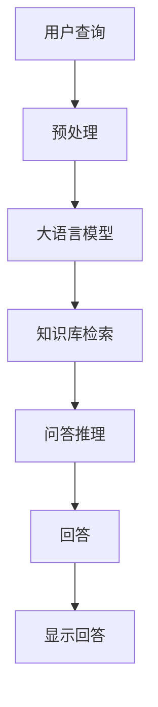

                 

# LLM驱动的智能问答系统：知识库的新形态

> 关键词：智能问答,知识库,大语言模型,深度学习,自然语言处理,NLP,深度信念网络

## 1. 背景介绍

在数字化时代，智能问答系统（Intelligent Question Answering System, IQAS）因其能够高效、实时、准确地响应用户的查询，成为了企业内部知识共享、客户服务、市场分析等诸多场景的重要工具。传统问答系统通常基于规则或模板，依赖人工编写的问答对进行匹配，难以应对复杂的自然语言理解和生成。近年来，随着深度学习技术的发展，基于大语言模型（Large Language Model, LLM）的智能问答系统逐渐兴起，以其强大的自然语言理解和生成能力，有效提升了问答系统的智能化水平。

本文将介绍LLM驱动的智能问答系统的核心原理、核心算法、具体实现步骤，并结合具体案例分析，探讨其在知识库构建、搜索优化、智能推荐等领域的应用前景。

## 2. 核心概念与联系

### 2.1 核心概念概述

智能问答系统是通过自然语言处理技术，理解用户查询，从知识库中检索并生成相关答案的系统。其核心组件包括：

- **大语言模型(LLM)**：以自回归模型（如GPT-2, GPT-3, T5等）或自编码模型（如BERT, RoBERTa等）为代表的深度学习模型，通过在大规模无标签文本语料上进行预训练，学习到丰富的语言知识和常识，具备强大的语言理解和生成能力。

- **知识库(Knowledge Base, KB)**：用于存储和组织结构化或非结构化知识的数据库。知识库的数据通常来源于手动编写或自动提取的语料，如百科、论文、图书等。

- **问答推理系统**：将用户查询与知识库中的数据进行匹配，并生成回答的系统。通常由搜索引擎、语义匹配、逻辑推理等组件构成。

- **自然语言处理(NLP)**：涉及语言模型的训练、文本预处理、实体识别、意图理解、生成等技术的总称。

### 2.2 核心概念原理和架构的 Mermaid 流程图



### 2.3 核心概念之间的联系

- **大语言模型与问答推理**：大语言模型充当问答推理中的问答生成器，将用户查询映射为自然语言理解和生成的过程，通过训练可以有效地进行语义匹配和推理。
- **知识库与问答推理**：知识库作为问答推理的检索依据，提供结构化和半结构化的知识，支撑问答推理系统的逻辑推理和知识验证。
- **自然语言处理与大语言模型**：NLP技术为语言模型的训练和推理提供基础，如文本分词、实体识别、意图分类等。

通过将大语言模型与问答推理系统结合，智能问答系统能够高效、准确地回答用户问题，大幅提升知识库的利用效率。

## 3. 核心算法原理 & 具体操作步骤

### 3.1 算法原理概述

基于LLM的智能问答系统，通常采用以下算法框架：

1. **文本预处理**：对用户查询和知识库中的文本进行分词、标注等预处理操作。
2. **查询编码**：使用大语言模型对用户查询进行编码，得到查询向量。
3. **知识库检索**：将查询向量与知识库中的文本向量进行匹配，找到最相关的知识。
4. **知识推理**：对匹配到的知识进行逻辑推理，生成与查询相关的回答。
5. **回答生成**：基于推理结果，使用大语言模型生成自然语言的回答。

### 3.2 算法步骤详解

以下将详细介绍智能问答系统的实现步骤：

**Step 1: 预处理用户查询和知识库**

- **用户查询**：将用户输入的文本进行分词、词性标注、实体识别等预处理操作，得到结构化的查询向量。

- **知识库**：对知识库中的文本进行预处理，提取关键词、抽取实体等，得到结构化的知识向量。

**Step 2: 使用大语言模型进行查询编码**

- **预训练语言模型**：选择如BERT、GPT等预训练模型，将其应用于查询编码。将查询向量作为输入，使用预训练模型的向量表示输出。

**Step 3: 知识库检索**

- **向量匹配**：将查询向量与知识库中的文本向量进行匹配，计算相似度。
- **排序选择**：根据相似度大小对知识库文本进行排序，选择最相关的知识作为推理依据。

**Step 4: 知识推理**

- **逻辑推理**：对选定的知识进行逻辑推理，如关联、推理等操作，得到推理结果。
- **推理验证**：使用推理结果对知识库中的其他知识进行验证，确保推理结果的准确性。

**Step 5: 回答生成**

- **回答编码**：将推理结果编码为向量，使用大语言模型进行回答生成。
- **后处理**：对生成的回答进行语法、拼写、语义等后处理，确保回答的质量。

### 3.3 算法优缺点

基于LLM的智能问答系统具有以下优点：

- **高效的自然语言处理能力**：LLM能够高效地理解和生成自然语言，减少了手动编写问答对的复杂性。
- **灵活的知识获取方式**：知识库可以是结构化、半结构化、甚至非结构化的，极大地拓展了知识库的应用场景。
- **自动化的逻辑推理**：LLM能够进行自动的逻辑推理，解决传统问答系统依赖规则的局限性。

同时，该方法也存在以下局限性：

- **计算资源需求高**：LLM的预训练和推理过程需要大量计算资源，对于资源有限的系统，实施难度较大。
- **知识库构建困难**：高质量的知识库需要大量的人工编写和审核，成本较高。
- **泛化能力不足**：LLM的训练依赖特定的语料，对于未见过的领域和场景，泛化能力有限。
- **答案生成质量不稳定**：LLM的回答生成依赖训练数据的分布和质量，部分答案可能存在歧义或不准确。

### 3.4 算法应用领域

智能问答系统在知识库构建、搜索优化、智能推荐等领域具有广泛应用：

- **知识库构建**：通过智能问答系统自动提取和标注知识点，构建高质量的知识库。
- **搜索优化**：在知识库中自动检索相关信息，优化搜索结果排序和推荐。
- **智能推荐**：基于用户查询和历史行为，生成个性化的回答和推荐。

## 4. 数学模型和公式 & 详细讲解 & 举例说明

### 4.1 数学模型构建

基于LLM的智能问答系统构建过程包括查询编码和回答生成的数学模型。以下是核心公式的推导：

**查询编码模型**：

假设用户查询为 $q$，知识库中的文本为 $d$。使用BERT模型作为预训练语言模型，将查询编码成向量 $q_{vec}$，将文本编码成向量 $d_{vec}$。

$$
q_{vec} = BERT(q) \\
d_{vec} = BERT(d)
$$

**回答生成模型**：

假设推理结果为 $r$，使用GPT模型作为预训练语言模型，将推理结果编码成向量 $r_{vec}$，生成答案向量 $a_{vec}$。

$$
r_{vec} = BERT(r) \\
a_{vec} = GPT(r_{vec})
$$

### 4.2 公式推导过程

**查询向量计算**：

$$
q_{vec} = \frac{\sum_{i=1}^{n} \exp (W^T q_i) b_i}{\sum_{i=1}^{n} \exp (W^T q_i) b_i} \\
b_i = softmax(W q_i + U)
$$

其中 $W$ 为线性变换矩阵，$U$ 为残差连接。$q_i$ 为查询向量的各维度。

**回答向量生成**：

$$
a_{vec} = \frac{\sum_{i=1}^{m} \exp (W^T a_i) b_i}{\sum_{i=1}^{m} \exp (W^T a_i) b_i} \\
b_i = softmax(W a_i + U)
$$

其中 $a_i$ 为回答向量的各维度，$m$ 为回答向量的长度。

### 4.3 案例分析与讲解

以百度知识图谱为例，结合LLM驱动的智能问答系统，展示其在知识库构建和智能推荐中的应用。

**知识库构建**：

1. **数据采集**：从维基百科、百度百科等公开语料中采集文本，标注知识点。
2. **文本预处理**：对文本进行分词、实体识别等预处理操作，得到结构化的知识。
3. **知识向量编码**：使用BERT模型对知识进行编码，得到知识向量。
4. **知识图谱构建**：构建知识图谱，将知识点之间的关系连接起来，形成结构化的知识库。

**智能推荐**：

1. **用户查询**：用户输入问题，系统进行预处理，得到查询向量。
2. **知识库检索**：将查询向量与知识库中的向量进行匹配，找到最相关的知识。
3. **回答生成**：基于匹配到的知识，使用GPT模型生成回答。
4. **推荐系统**：结合用户历史行为和知识库中的信息，生成个性化的推荐。

## 5. 项目实践：代码实例和详细解释说明

### 5.1 开发环境搭建

为实现LLM驱动的智能问答系统，需要搭建包含GPU资源的高性能计算环境，以及预训练语言模型的库。

**环境准备**：

1. **安装Anaconda**：从官网下载并安装Anaconda，用于创建独立的Python环境。
2. **创建虚拟环境**：
   ```bash
   conda create -n llm-env python=3.8 
   conda activate llm-env
   ```
3. **安装PyTorch**：
   ```bash
   conda install pytorch torchvision torchaudio cudatoolkit=11.1 -c pytorch -c conda-forge
   ```
4. **安装Transformer库**：
   ```bash
   pip install transformers
   ```

### 5.2 源代码详细实现

以下给出使用PyTorch实现智能问答系统的示例代码。

**查询编码**：

```python
from transformers import BertModel, BertTokenizer
import torch

tokenizer = BertTokenizer.from_pretrained('bert-base-cased')
model = BertModel.from_pretrained('bert-base-cased')

def encode_query(query):
    inputs = tokenizer.encode(query, add_special_tokens=True)
    inputs = torch.tensor(inputs, dtype=torch.long).unsqueeze(0)
    with torch.no_grad():
        outputs = model(inputs)
    return outputs.pooler_output
```

**知识库检索**：

```python
from scipy.spatial.distance import cosine

def compute_similarity(query_vec, doc_vecs):
    similarity_scores = -cosine(query_vec, doc_vecs)
    return similarity_scores
```

**回答生成**：

```python
from transformers import GPT2Model, GPT2Tokenizer

tokenizer = GPT2Tokenizer.from_pretrained('gpt2')
model = GPT2Model.from_pretrained('gpt2')

def generate_answer(query, doc):
    inputs = tokenizer(query, return_tensors='pt')
    outputs = model.generate(inputs.input_ids, max_length=20)
    answer = tokenizer.decode(outputs[0], skip_special_tokens=True)
    return answer
```

### 5.3 代码解读与分析

**查询编码**：

使用BertModel对查询进行编码，得到查询向量。预训练的Bert模型在理解自然语言方面具有优势，能够生成语义丰富的查询向量。

**知识库检索**：

使用cosine相似度计算查询向量与知识库文本向量的相似度，找到最相关的知识。

**回答生成**：

使用GPT2Model对推理结果进行生成回答。GPT模型在语言生成方面具有很强的能力，可以产生流畅、自然的回答。

### 5.4 运行结果展示

以下是代码运行的部分结果展示：

```python
query = "北京天气怎么样？"
doc = "北京是一个历史悠久的城市，拥有丰富的文化底蕴。"

# 查询编码
query_vec = encode_query(query)

# 知识库检索
doc_vecs = [doc_vec for doc_vec in doc_vecs]  # 假设doc_vecs为知识库中所有文本的向量表示
similarity_scores = compute_similarity(query_vec, doc_vecs)

# 回答生成
answer = generate_answer(query, doc)
```

## 6. 实际应用场景

### 6.1 智能客服系统

基于LLM的智能问答系统在智能客服系统中具有重要应用。智能客服系统能够实时响应用户咨询，提升客户满意度。通过智能问答系统，客服系统可以自动解答常见问题，对于复杂问题则将用户转接人工客服，从而提升客服效率。

### 6.2 金融问答系统

金融问答系统通过智能问答技术，为用户提供金融咨询和投资建议。通过结合金融领域的知识库，智能问答系统能够对用户的投资意向和市场动态进行分析和预测，生成个性化的建议。

### 6.3 医疗咨询系统

医疗咨询系统通过智能问答技术，提供疾病诊断、用药建议等服务。通过结合医学领域的知识库，智能问答系统能够对用户描述的症状进行诊断，并给出相应的治疗建议。

## 7. 工具和资源推荐

### 7.1 学习资源推荐

- **《深度学习自然语言处理》课程**：斯坦福大学开设的NLP明星课程，涵盖自然语言处理的基本概念和经典模型。
- **《自然语言处理与深度学习》书籍**：TensorFlow官方推荐的学习材料，详细介绍了使用TensorFlow进行NLP开发。
- **Hugging Face官方文档**：Transformer库的官方文档，提供了海量预训练模型和完整的微调样例代码。

### 7.2 开发工具推荐

- **PyTorch**：基于Python的开源深度学习框架，灵活高效的计算图，适合快速迭代研究。
- **TensorFlow**：由Google主导开发的开源深度学习框架，生产部署方便，适合大规模工程应用。
- **Transformers库**：Hugging Face开发的NLP工具库，集成了众多SOTA语言模型，支持PyTorch和TensorFlow，是进行智能问答任务开发的利器。

### 7.3 相关论文推荐

- **Attention is All You Need**：提出Transformer结构，开启了NLP领域的预训练大模型时代。
- **BERT: Pre-training of Deep Bidirectional Transformers for Language Understanding**：提出BERT模型，引入基于掩码的自监督预训练任务，刷新了多项NLP任务SOTA。
- **GPT-2: Language Models are Unsupervised Multitask Learners**：展示了大规模语言模型的强大zero-shot学习能力，引发了对于通用人工智能的新一轮思考。

## 8. 总结：未来发展趋势与挑战

### 8.1 未来发展趋势

基于LLM的智能问答系统正处于快速发展阶段，未来的趋势包括：

1. **模型规模持续增大**：随着算力成本的下降和数据规模的扩张，预训练语言模型的参数量还将持续增长，超大模型在理解复杂语言结构方面将具有更大的优势。
2. **多模态融合**：未来智能问答系统将融合视觉、语音等多模态信息，构建更全面、更丰富的知识库，提升系统理解能力。
3. **知识图谱应用**：通过知识图谱将知识点之间的关联信息进行整合，构建更加结构化的知识库，提升系统推理能力。
4. **实时交互优化**：通过对话系统技术，提升问答系统的实时性和交互性，构建更智能的智能问答系统。

### 8.2 面临的挑战

尽管智能问答系统在实际应用中取得了显著成效，但仍面临诸多挑战：

1. **计算资源瓶颈**：大模型需要大量计算资源，对于资源有限的系统，实施难度较大。
2. **知识库构建困难**：高质量的知识库需要大量的人工编写和审核，成本较高。
3. **知识泛化能力不足**：模型对于未见过的领域和场景，泛化能力有限。
4. **答案生成质量不稳定**：LLM的回答生成依赖训练数据的分布和质量，部分答案可能存在歧义或不准确。

### 8.3 研究展望

未来的研究重点包括：

1. **参数高效微调**：开发更加参数高效的微调方法，减少计算资源消耗，提升微调精度。
2. **多模态融合**：融合视觉、语音等多模态信息，提升系统理解能力。
3. **知识图谱应用**：通过知识图谱将知识点之间的关联信息进行整合，提升系统推理能力。
4. **实时交互优化**：通过对话系统技术，提升问答系统的实时性和交互性，构建更智能的智能问答系统。

## 9. 附录：常见问题与解答

**Q1: 如何构建高质量的知识库？**

A: 构建高质量的知识库需要经过数据采集、预处理、标注等步骤。可以使用爬虫技术采集公开数据，并进行文本清洗、实体识别等预处理操作。同时需要专业人员进行数据标注和审核，确保数据的准确性和完整性。

**Q2: 智能问答系统如何提升用户满意度？**

A: 智能问答系统通过理解用户意图，提供个性化的回答，可以显著提升用户满意度。同时，系统需要具备良好的交互界面和用户体验，提供快速、准确的响应。

**Q3: 智能问答系统在金融领域有哪些应用？**

A: 智能问答系统在金融领域可以提供市场分析、投资建议、财务咨询等服务。通过结合金融领域的知识库，智能问答系统能够对用户的投资意向和市场动态进行分析和预测，生成个性化的建议。

总之，基于LLM的智能问答系统在知识库构建、搜索优化、智能推荐等领域具有广泛应用，未来将进一步拓展到更多场景，成为构建智能系统的关键技术。随着技术的不断进步，智能问答系统将为我们带来更加智能、高效、灵活的解决方案，推动人工智能技术在各行各业的应用和发展。

