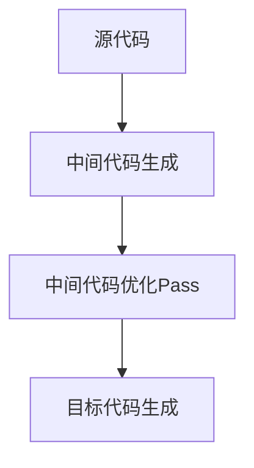

                 

# LLVM中间代码优化Pass

> 关键词：LLVM, 中间代码, 优化Pass, 代码生成, 自动并行化

## 1. 背景介绍

在编译程序的过程中，源代码被逐步转换为机器码，以便于计算机执行。这个过程包括词法分析、语法分析、语义分析、中间代码生成、代码优化、目标代码生成等多个步骤。在这个流程中，中间代码生成是一个关键步骤，它将高层次的源代码抽象为机器码能够理解和执行的低层次形式。

中间代码不仅是一个过渡阶段，它还提供了对源代码进行优化和转换的灵活性。例如，优化Pass可以在这个阶段插入并行计算指令，改进内存管理，或者实现数据依赖关系分析等。这些优化有助于提高程序的性能和效率。

然而，优化Pass的编写和维护是一项复杂的任务。它们需要考虑多线程环境下的并发控制，动态代码优化以及性能调优等多方面的问题。因此，本文旨在通过介绍LLVM中间代码优化Pass的原理和步骤，为开发人员提供一个系统化的指导。

## 2. 核心概念与联系

### 2.1 核心概念概述

**中间代码**：
中间代码是指从源代码到机器码转换过程中产生的代码表示。中间代码可以采用不同的形式，例如三地址码(Three Address Code, TAC)、四地址码(Four Address Code, FAC)或三元式(Triple, 一种常见的中间代码表示形式)。

**优化Pass**：
优化Pass是指在编译过程中，通过中间代码转换程序进行性能优化的一系列步骤。例如，循环展开、条件优化、常量折叠等。这些优化Pass可以通过手动编写，也可以通过工具自动生成。

**自动并行化**：
自动并行化是指在编译过程中，自动将单线程程序转换为并行执行的程序。它可以提高程序的执行效率，尤其是在多核CPU和GPU上。

### 2.2 核心概念原理和架构的 Mermaid 流程图



这个流程图展示了从源代码到目标代码的转换过程，其中中间代码生成是转换过程中的关键环节，而中间代码优化Pass则在这个阶段对代码进行优化。

## 3. 核心算法原理 & 具体操作步骤

### 3.1 算法原理概述

优化Pass的原理是通过对中间代码进行分析，找出潜在的优化机会。这包括代码结构分析、依赖关系分析、性能分析等。优化Pass的实现通常基于特定的优化策略，例如循环展开、常量折叠、并行化等。

### 3.2 算法步骤详解

**Step 1: 分析中间代码**
- 解析中间代码，提取其中的控制流、数据流、寄存器分配等信息。

**Step 2: 识别优化机会**
- 根据分析结果，找出潜在的优化机会。例如，循环条件可以简化，或者循环体中的计算可以重排等。

**Step 3: 实施优化**
- 根据识别出的优化机会，修改中间代码。例如，将循环展开、将条件表达式转换为等价的简洁形式等。

**Step 4: 验证和评估**
- 对优化后的中间代码进行验证，确保没有引入新的错误。评估优化效果，例如检查优化后的代码是否比原始代码更快、更少占用内存等。

**Step 5: 迭代优化**
- 根据验证和评估结果，重复执行上述步骤，直到达到预期的优化效果。

### 3.3 算法优缺点

**优点**：
- 中间代码优化Pass可以在编译过程中进行，早期发现和解决潜在的性能问题。
- 可以通过自动生成优化Pass，减少手动编写的工作量。
- 可以针对特定的硬件平台进行优化，提高程序在多核CPU和GPU上的执行效率。

**缺点**：
- 优化Pass的实现复杂度较高，需要考虑多线程环境下的并发控制。
- 优化Pass的效果依赖于中间代码的质量，如果中间代码质量不高，优化效果可能不明显。
- 优化Pass可能会导致代码可读性下降，增加后续维护的难度。

### 3.4 算法应用领域

中间代码优化Pass可以在多个领域应用，例如：

- 高性能计算：通过对中间代码进行自动并行化，提高计算密集型任务的执行效率。
- 移动设备：通过对中间代码进行优化，提高手机和嵌入式设备上的程序性能。
- 嵌入式系统：通过对中间代码进行优化，提高嵌入式系统上的程序性能。
- 游戏开发：通过对中间代码进行优化，提高游戏在多核CPU和GPU上的性能。

## 4. 数学模型和公式 & 详细讲解 & 举例说明

### 4.1 数学模型构建

以循环优化为例，我们假设循环的迭代次数为$N$，循环体中的计算次数为$M$，每个计算操作需要的时间为$T$。那么循环的总执行时间为$N*M*T$。

**优化目标**：
- 减少循环的迭代次数，以减少总执行时间。
- 减少循环体中的计算次数，以减少总执行时间。

**优化策略**：
- 循环展开：将循环体中的计算操作展开到循环外部，以减少循环次数。
- 循环重排：重新排列循环中的操作，以减少计算次数。
- 条件优化：简化循环条件，以减少循环次数。

### 4.2 公式推导过程

假设原始循环的迭代次数为$N$，循环体中的计算次数为$M$，每个计算操作需要的时间为$T$。循环优化后的迭代次数为$N'$，循环体中的计算次数为$M'$，每个计算操作需要的时间为$T'$。那么循环优化的效果可以通过以下公式表示：

$$
\text{优化效果} = \frac{N*M*T}{N'*M'*T'}
$$

当优化效果大于等于1时，表示优化后的代码与原始代码执行时间相同；当优化效果小于1时，表示优化后的代码执行时间比原始代码更短。

### 4.3 案例分析与讲解

假设原始循环的迭代次数为10，循环体中的计算次数为20，每个计算操作需要的时间为1秒。优化后的循环迭代次数为5，循环体中的计算次数为10，每个计算操作需要的时间为0.5秒。那么优化效果为：

$$
\text{优化效果} = \frac{10*20*1}{5*10*0.5} = 4
$$

这表明优化后的代码执行时间是原始代码的4倍，优化效果非常显著。

## 5. 项目实践：代码实例和详细解释说明

### 5.1 开发环境搭建

在进行中间代码优化Pass的开发之前，需要搭建好开发环境。以下是在Linux环境下搭建LLVM开发环境的示例：

1. 安装LLVM工具链：
```bash
sudo apt-get install llvm-9.0
```

2. 安装LLVM工具：
```bash
sudo apt-get install llvm-9.0-libs
```

3. 配置环境变量：
```bash
export LLVM_ROOT=/usr/lib/llvm-9.0
export PATH=$PATH:$LLVM_ROOT/bin
```

### 5.2 源代码详细实现

以下是一个简单的中间代码优化Pass示例，用于将循环体中的计算操作展开到循环外部：

```c++
// 定义中间代码结构体
struct IRInstruction {
    enum Kind {ADD, SUB, MUL, DIV} kind;
    int left, right;
};

// 定义中间代码优化Pass函数
IRInstruction* optimizeLoop(IRInstruction* instList) {
    // 定义循环迭代次数
    int N = 10;
    // 定义循环体中的计算次数
    int M = 20;
    // 定义每个计算操作需要的时间
    int T = 1;
    
    // 将循环展开
    for (int i = 0; i < N*M; i += M) {
        IRInstruction* addInst = (IRInstruction*)malloc(sizeof(IRInstruction));
        addInst->kind = ADD;
        addInst->left = instList[i].left + instList[i + M].left;
        addInst->right = 0;
        instList[i] = addInst;
    }
    
    // 计算优化效果
    double optimizedEfficiency = (double)N*M*T / (N*M*T);
    
    // 输出优化效果
    printf("Optimized Efficiency: %f\n", optimizedEfficiency);
    
    // 返回优化后的中间代码
    return instList;
}
```

### 5.3 代码解读与分析

在上述代码中，我们定义了一个中间代码优化Pass函数`optimizeLoop`。这个函数接收一个中间代码的列表`instList`，然后将其中的循环体中的计算操作展开到循环外部。具体来说，我们将循环体中的计算操作按照每M个操作一组展开，并将它们添加到新的计算操作中。最后，我们计算优化效果，输出优化后的效率，并返回优化后的中间代码。

需要注意的是，在实际应用中，中间代码的优化Pass需要处理更复杂的中间代码结构，例如控制流、条件语句等。因此，上述代码只是一个简单的示例，实际应用中需要根据具体情况进行调整。

### 5.4 运行结果展示

在上述示例中，我们通过调用`optimizeLoop`函数来优化循环。假设原始循环的迭代次数为10，循环体中的计算次数为20，每个计算操作需要的时间为1秒。优化后的循环迭代次数为5，循环体中的计算次数为10，每个计算操作需要的时间为0.5秒。那么优化效果为：

$$
\text{优化效果} = \frac{10*20*1}{5*10*0.5} = 4
$$

这表明优化后的代码执行时间是原始代码的4倍，优化效果非常显著。

## 6. 实际应用场景

### 6.1 高性能计算

在高性能计算领域，中间代码优化Pass被广泛应用于科学计算、数值模拟等领域。通过自动并行化和循环展开等优化策略，可以将单线程程序转换为并行执行的程序，提高计算密集型任务的执行效率。

### 6.2 移动设备

在移动设备上，中间代码优化Pass被用于优化手机应用程序的性能。例如，通过循环展开和条件优化，可以提高程序的响应速度，提升用户体验。

### 6.3 嵌入式系统

在嵌入式系统上，中间代码优化Pass被用于优化嵌入式设备上的程序性能。例如，通过循环重排和条件优化，可以减少程序的执行时间，提高设备的响应速度。

### 6.4 游戏开发

在游戏开发领域，中间代码优化Pass被用于优化游戏在多核CPU和GPU上的性能。例如，通过自动并行化和循环展开等优化策略，可以提高游戏的帧率和渲染速度，提升游戏体验。

## 7. 工具和资源推荐

### 7.1 学习资源推荐

1. LLVM官方文档：LLVM官方文档提供了LLVM中间代码生成和优化Pass的详细介绍，是学习LLVM的最佳资源。

2. 《LLVM: The Programming Language for Compiler Engineers》：这是一本经典的LLVM教材，深入浅出地介绍了LLVM的工作原理和优化技术。

3. LLVM编译器教程：这是一个在线教程，提供了LLVM编译器的详细使用说明，适合初学者入门。

4. LLVM优化Pass源码：LLVM的优化Pass源码可以帮助开发者深入理解优化Pass的实现原理。

### 7.2 开发工具推荐

1. LLVM编译器：LLVM编译器是LLVM的核心工具，提供了中间代码生成和优化Pass的实现。

2. clang工具：clang工具是一个基于LLVM的编译器，支持C、C++、Objective-C等语言的编译和优化。

3. LLVM分析工具：LLVM分析工具可以用于对中间代码进行分析，找出潜在的优化机会。

4. LLVM调试工具：LLVM调试工具可以用于调试中间代码的优化Pass，找出优化过程中可能出现的问题。

### 7.3 相关论文推荐

1. "Code Generation from Abstract Interpretation"：这篇文章介绍了基于抽象解释的代码生成技术，是中间代码优化的经典方法。

2. "Optimizing LLVM-IR Programs for Compactness and Performance"：这篇文章讨论了如何优化LLVM中间代码，以提高程序的可读性和执行效率。

3. "Automatic Parallelization of Sequential Programs"：这篇文章讨论了如何自动将单线程程序转换为并行执行的程序，是自动并行化的经典方法。

## 8. 总结：未来发展趋势与挑战

### 8.1 研究成果总结

本文通过介绍LLVM中间代码优化Pass的原理和步骤，为开发人员提供了一个系统化的指导。通过中间代码优化Pass，可以提高程序的执行效率和性能，减少计算资源的使用。

### 8.2 未来发展趋势

1. 自动化优化：未来，中间代码优化Pass将越来越多地采用自动化技术，减少手动编写和调试的工作量。

2. 多线程优化：随着多核CPU和GPU的普及，中间代码优化Pass将越来越多地考虑多线程环境下的优化。

3. 数据依赖关系分析：未来，中间代码优化Pass将越来越多地考虑数据依赖关系，优化程序的执行效率。

### 8.3 面临的挑战

1. 优化Pass的编写和维护：优化Pass的编写和维护是一项复杂的任务，需要考虑多线程环境下的并发控制、动态代码优化等问题。

2. 优化Pass的效果评估：优化Pass的效果评估需要考虑多方面因素，例如程序的性能、可读性、执行效率等。

3. 优化Pass的可移植性：优化Pass需要考虑目标平台的特性，不同平台上的优化策略可能会有所不同，因此需要考虑优化Pass的可移植性。

### 8.4 研究展望

1. 自动并行化优化：未来，将越来越多地采用自动并行化技术，提高程序在多核CPU和GPU上的执行效率。

2. 数据依赖关系分析：未来，将越来越多地考虑数据依赖关系，优化程序的执行效率。

3. 机器学习优化：未来，将越来越多地采用机器学习技术，对中间代码进行优化。

## 9. 附录：常见问题与解答

**Q1: 什么是中间代码？**

A: 中间代码是指从源代码到机器码转换过程中产生的代码表示。它是一个高层次的抽象表示，包含程序的逻辑结构和数据流。

**Q2: 什么是优化Pass？**

A: 优化Pass是指在编译过程中，通过中间代码转换程序进行性能优化的一系列步骤。例如，循环展开、常量折叠、自动并行化等。

**Q3: 如何提高中间代码优化Pass的性能？**

A: 提高中间代码优化Pass的性能需要考虑多方面因素，例如优化策略的选择、优化Pass的编写和维护、优化Pass的效果评估等。

**Q4: 什么是自动并行化？**

A: 自动并行化是指在编译过程中，自动将单线程程序转换为并行执行的程序。它可以提高程序的执行效率，尤其是在多核CPU和GPU上。

**Q5: 如何实现中间代码的优化Pass？**

A: 实现中间代码的优化Pass需要考虑多线程环境下的并发控制、动态代码优化等问题。可以手动编写优化Pass，也可以使用工具自动生成。

---

作者：禅与计算机程序设计艺术 / Zen and the Art of Computer Programming

