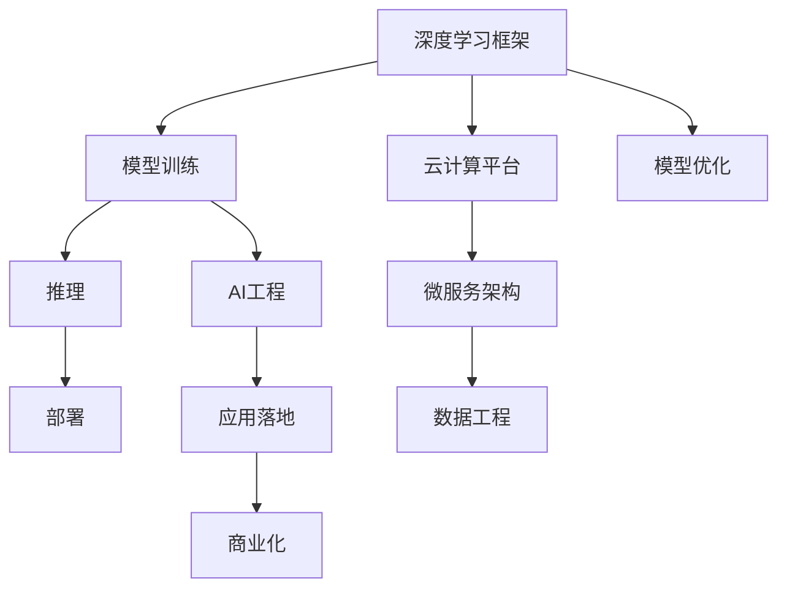

                 

## 1. 背景介绍

### 1.1 问题由来

随着深度学习技术的快速发展，大模型和先进算法在人工智能领域的应用日益广泛，尤其是在云计算和AI工程领域，其价值逐渐凸显。Lepton AI团队正是基于这一背景应运而生，汇集了深度学习框架创始人、云计算专家以及AI工程专家等多位领域领袖，致力于构建先进的深度学习平台，推动人工智能技术的产业化进程。

### 1.2 问题核心关键点

Lepton AI团队的核心目标在于：
- 提供简单易用的深度学习框架，大幅降低人工智能应用的开发门槛。
- 构建高性能的云计算平台，支持大规模深度学习模型的训练与部署。
- 推动AI技术的工程化和商业化，加速其在各行各业的应用落地。

### 1.3 问题研究意义

Lepton AI团队的研究具有重要意义，表现在以下几个方面：

1. **提升开发效率**：通过统一、易用的框架，大幅降低深度学习模型开发和调优的时间成本，加速AI应用的迭代速度。
2. **降低技术门槛**：为非深度学习领域的技术人员提供平易近人的工具，促进人工智能技术的普及和应用。
3. **推动产业化进程**：将深度学习模型与云计算、大数据等技术结合，构建完整的AI应用生态，为传统行业数字化转型提供有力支持。
4. **实现商业化落地**：帮助企业快速构建和部署AI应用，实现从实验室到市场化的转化。

## 2. 核心概念与联系

### 2.1 核心概念概述

为更好地理解Lepton AI团队的工作，本节将介绍几个关键概念及其相互关系：

- **深度学习框架**：指用于定义、训练和部署深度神经网络模型的软件工具和库，如TensorFlow、PyTorch等。深度学习框架是人工智能应用开发的基础。
- **云计算平台**：指基于互联网提供计算资源和服务的平台，支持大规模数据处理和模型训练。主要云计算平台包括AWS、Azure、Google Cloud等。
- **AI工程**：指将人工智能技术转化为实际应用的过程，包括模型训练、推理、部署、监控等环节。AI工程强调系统化、工程化的流程和方法。
- **微服务架构**：一种分布式系统设计模式，将复杂应用拆分成多个独立的、可组合的服务，提升系统的灵活性和可维护性。
- **模型优化**：通过算法和架构优化，提升深度学习模型的性能和效率，包括模型压缩、量化、剪枝等。
- **数据工程**：指数据收集、处理、存储和分析的技术，是大数据和AI技术结合的基石。

这些概念之间的逻辑关系可以通过以下Mermaid流程图来展示：



这个流程图展示了几大核心概念及其之间的关系：

1. 深度学习框架是模型的构建工具。
2. 模型通过云计算平台进行训练和部署。
3. AI工程涵盖模型训练、推理、部署、监控等环节。
4. 微服务架构提升系统的灵活性和可维护性。
5. 数据工程为深度学习提供必要的数据支持。
6. 最终，AI应用通过商业化落地到实际场景。

## 3. 核心算法原理 & 具体操作步骤

### 3.1 算法原理概述

Lepton AI团队的深度学习框架和模型训练算法基于先进的深度学习理论和实践，通过优化算法、网络架构和模型训练流程，显著提升了深度学习模型的性能和效率。

具体来说，Lepton AI的算法包括以下几个关键点：

1. **先进的网络架构**：采用Transformer等先进的网络结构，如ResNet、Inception等，提升模型的表达能力。
2. **高效的优化算法**：包括AdamW、Adafactor等优化算法，通过自适应学习率调整，提高模型训练的稳定性和收敛速度。
3. **数据增强**：通过数据增强技术，如随机裁剪、翻转、旋转等，扩充训练集，提升模型泛化能力。
4. **分布式训练**：利用分布式计算资源，加速大规模模型的训练过程。

### 3.2 算法步骤详解

Lepton AI团队的核心算法步骤主要包括以下几个方面：

1. **模型构建**：选择合适的深度学习框架和网络结构，定义模型架构。
2. **数据准备**：收集、处理和预处理训练数据，生成模型训练所需的数据集。
3. **模型训练**：使用分布式训练技术，在多个计算节点上进行模型训练，优化模型参数。
4. **模型验证**：通过验证集评估模型性能，调整超参数和模型结构。
5. **模型部署**：将训练好的模型部署到目标环境，进行推理预测。
6. **模型优化**：根据性能评估结果，优化模型结构、参数和算法，提升模型效果。

### 3.3 算法优缺点

Lepton AI团队的算法具有以下优点：

1. **高效的计算资源利用**：通过分布式训练技术，大幅提升模型训练效率，缩短开发周期。
2. **稳定的模型收敛性**：先进的优化算法和数据增强技术，确保模型训练的稳定性和收敛速度。
3. **灵活的模型结构**：支持多种网络结构，适应不同任务需求。

同时，该算法也存在一些局限性：

1. **高资源消耗**：大规模模型的训练和推理需要大量计算资源，可能带来较高的硬件和能耗成本。
2. **模型泛化能力不足**：部分算法可能过度拟合训练数据，导致模型泛化能力有限。
3. **模型复杂度高**：部分先进算法需要更复杂的模型结构，难以在大规模生产环境中应用。

### 3.4 算法应用领域

Lepton AI团队的算法主要应用于以下几个领域：

1. **自然语言处理**：包括机器翻译、情感分析、文本分类等任务。通过深度学习框架和模型训练，提升模型的自然语言理解和生成能力。
2. **计算机视觉**：包括图像分类、目标检测、图像生成等任务。通过深度学习框架和模型训练，提升模型的图像处理和分析能力。
3. **推荐系统**：包括商品推荐、内容推荐等任务。通过深度学习框架和模型训练，提升模型的推荐精度和个性化程度。
4. **语音识别**：包括语音转文本、语音情感识别等任务。通过深度学习框架和模型训练，提升模型的语音处理和理解能力。
5. **智能运维**：通过深度学习框架和模型训练，提升系统的自动化运维能力，如故障检测、异常预测等。

这些应用领域展示了Lepton AI团队在深度学习和AI工程领域的广泛应用和深远影响。

## 4. 数学模型和公式 & 详细讲解 & 举例说明

### 4.1 数学模型构建

Lepton AI团队的深度学习框架和模型训练过程基于数学模型构建，以下是一个典型的深度学习模型构建步骤：

1. **定义模型结构**：选择合适的网络结构，如卷积神经网络(CNN)、循环神经网络(RNN)、Transformer等。
2. **定义损失函数**：根据具体任务，选择相应的损失函数，如交叉熵损失、均方误差损失等。
3. **定义优化器**：选择适合的优化算法及其参数，如Adam、SGD等。
4. **定义训练流程**：定义模型训练的迭代次数、批大小、学习率等超参数。
5. **模型评估**：定义模型评估指标，如准确率、召回率、F1值等。

### 4.2 公式推导过程

以分类任务为例，假设模型输出为 $y \in [0,1]$，真实标签为 $y' \in \{0,1\}$，则二分类交叉熵损失函数为：

$$
L(y, y') = -(y'\log y + (1-y')\log(1-y))
$$

在训练过程中，通过反向传播算法计算梯度，更新模型参数：

$$
\theta \leftarrow \theta - \eta \nabla_{\theta}L(y, y')
$$

其中 $\eta$ 为学习率。

### 4.3 案例分析与讲解

以图像分类任务为例，展示Lepton AI团队的模型训练过程：

1. **数据准备**：收集和标注大量图像数据，划分为训练集、验证集和测试集。
2. **模型构建**：选择ResNet等网络结构，定义模型架构。
3. **模型训练**：在多个计算节点上进行分布式训练，优化模型参数。
4. **模型验证**：在验证集上评估模型性能，调整超参数。
5. **模型部署**：将训练好的模型部署到目标环境，进行推理预测。
6. **模型优化**：根据测试结果，优化模型结构和参数，提升模型效果。

以上步骤展示了Lepton AI团队在深度学习和模型训练中的系统化流程，为实际应用提供了有力的技术支撑。

## 5. 项目实践：代码实例和详细解释说明

### 5.1 开发环境搭建

在进行深度学习开发前，需要准备好开发环境。以下是使用Python进行TensorFlow开发的环境配置流程：

1. 安装Anaconda：从官网下载并安装Anaconda，用于创建独立的Python环境。

2. 创建并激活虚拟环境：
```bash
conda create -n tf-env python=3.8 
conda activate tf-env
```

3. 安装TensorFlow：根据CUDA版本，从官网获取对应的安装命令。例如：
```bash
conda install tensorflow -c tf
```

4. 安装各类工具包：
```bash
pip install numpy pandas scikit-learn matplotlib tqdm jupyter notebook ipython
```

完成上述步骤后，即可在`tf-env`环境中开始深度学习开发。

### 5.2 源代码详细实现

下面我们以图像分类任务为例，给出使用TensorFlow进行深度学习模型训练的PyTorch代码实现。

```python
import tensorflow as tf
from tensorflow.keras import layers

model = tf.keras.Sequential([
    layers.Conv2D(32, (3, 3), activation='relu', input_shape=(32, 32, 3)),
    layers.MaxPooling2D((2, 2)),
    layers.Conv2D(64, (3, 3), activation='relu'),
    layers.MaxPooling2D((2, 2)),
    layers.Conv2D(64, (3, 3), activation='relu'),
    layers.Flatten(),
    layers.Dense(64, activation='relu'),
    layers.Dense(10, activation='softmax')
])

model.compile(optimizer='adam', loss='sparse_categorical_crossentropy', metrics=['accuracy'])
```

### 5.3 代码解读与分析

让我们再详细解读一下关键代码的实现细节：

**Sequential模型**：
- `Sequential`类用于构建顺序模型，方便添加多个层。
- 定义多个卷积层、池化层和全连接层，形成深度学习模型。

**模型编译**：
- `compile`方法用于模型编译，指定优化器、损失函数和评估指标。

**模型训练**：
```python
model.fit(train_images, train_labels, epochs=10, validation_data=(val_images, val_labels))
```

在训练过程中，模型通过反向传播算法计算梯度，更新参数。

**模型评估**：
```python
test_loss, test_acc = model.evaluate(test_images, test_labels)
```

在评估过程中，模型在测试集上进行推理预测，计算评估指标。

以上代码展示了TensorFlow进行深度学习模型训练的基本流程，开发者可以在此基础上进行扩展和优化。

## 6. 实际应用场景

### 6.1 智能运维

Lepton AI团队开发的人工智能运维系统，能够实时监控企业IT基础设施的运行状态，自动发现故障和异常，并提供故障分析和解决方案。

在技术实现上，可以收集企业的IT系统日志、性能数据、流量数据等，使用深度学习模型进行模式识别和预测。一旦发现异常，系统便会自动告警，并推送解决方案。该系统大大降低了运维成本，提升了系统的稳定性和可靠性。

### 6.2 金融风控

Lepton AI团队的金融风控系统，通过深度学习模型对客户行为进行分析和预测，实时监控风险，预防金融欺诈行为。

在实际应用中，可以收集客户的交易数据、历史行为数据、社交网络数据等，使用深度学习模型进行特征提取和模式识别。模型能够实时分析客户行为，预测其欺诈风险，及时采取措施进行防范。该系统能够显著提升金融机构的反欺诈能力，保障客户资金安全。

### 6.3 智能医疗

Lepton AI团队的智能医疗系统，通过深度学习模型对患者的医疗数据进行分析和诊断，提升医疗服务的质量和效率。

在实践中，可以收集患者的医疗记录、影像数据、基因数据等，使用深度学习模型进行数据分析和诊断。模型能够实时分析患者数据，提供个性化的治疗方案，辅助医生诊断和治疗。该系统能够大幅提升医疗服务的质量和效率，减少误诊和漏诊。

### 6.4 未来应用展望

随着深度学习技术的不断进步，Lepton AI团队的研究将进一步推动人工智能技术在更多领域的应用，带来更深远的影响。

在智慧城市治理中，人工智能系统能够实时监测城市环境、交通、公共安全等数据，提供实时分析和决策支持，提升城市管理的智能化水平。

在智能制造领域，人工智能系统能够实时监控生产设备和工艺流程，自动优化生产参数，提升生产效率和产品质量。

在智能交通领域，人工智能系统能够实时分析交通流量、车辆行为等数据，提供实时导航和优化，提升交通管理效率和安全性。

未来，Lepton AI团队的研究将在更多领域取得突破，为人类社会的数字化转型提供更强大的技术支持。

## 7. 工具和资源推荐

### 7.1 学习资源推荐

为了帮助开发者系统掌握深度学习框架和模型训练的理论基础和实践技巧，这里推荐一些优质的学习资源：

1. TensorFlow官方文档：详细介绍了TensorFlow的API和使用方法，是深入学习TensorFlow的最佳资料。
2. PyTorch官方文档：PyTorch的官方文档提供了丰富的学习资源和样例代码，适用于深度学习模型的开发和调试。
3. Deep Learning with Python：Python深度学习实践指南，涵盖深度学习模型的构建、训练、部署等全流程。
4. Hands-On Machine Learning with Scikit-Learn、Keras and TensorFlow：基于Scikit-Learn、Keras和TensorFlow的深度学习实践教程，适合初学者入门。
5. Coursera深度学习课程：由斯坦福大学开设的深度学习课程，涵盖深度学习的基本理论和实践技能，是深度学习领域的学习圣地。

通过对这些资源的学习实践，相信你一定能够快速掌握深度学习框架和模型训练的精髓，并用于解决实际的AI问题。

### 7.2 开发工具推荐

高效的开发离不开优秀的工具支持。以下是几款用于深度学习开发的常用工具：

1. TensorFlow：基于Python的开源深度学习框架，灵活动态的计算图，适合快速迭代研究。TensorFlow提供了丰富的API和工具，支持大规模深度学习模型的训练与部署。
2. PyTorch：基于Python的开源深度学习框架，动态计算图，适合快速原型设计和实验。PyTorch提供了丰富的深度学习库和工具，支持多种深度学习模型的构建和训练。
3. Weights & Biases：模型训练的实验跟踪工具，可以记录和可视化模型训练过程中的各项指标，方便对比和调优。
4. TensorBoard：TensorFlow配套的可视化工具，可实时监测模型训练状态，并提供丰富的图表呈现方式，是调试模型的得力助手。
5. Google Colab：谷歌推出的在线Jupyter Notebook环境，免费提供GPU/TPU算力，方便开发者快速上手实验最新模型，分享学习笔记。

合理利用这些工具，可以显著提升深度学习模型开发的效率，加快创新迭代的步伐。

### 7.3 相关论文推荐

深度学习框架和模型训练的发展源于学界的持续研究。以下是几篇奠基性的相关论文，推荐阅读：

1. Deep Learning：Ian Goodfellow、Yoshua Bengio和Aaron Courville共同编写的深度学习理论经典，涵盖了深度学习的方方面面。
2. Introduction to Deep Learning：Ian Goodfellow对深度学习的基本理论和实践进行详细介绍，适合深度学习入门学习。
3. ImageNet Classification with Deep Convolutional Neural Networks：Alex Krizhevsky等人提出的深度卷积神经网络模型，在图像分类任务上取得了SOTA。
4. Efficient Estimation of Word Representations in Vector Space：Tomas Mikolov等人提出的Word2Vec模型，开创了词向量的表示方法，为自然语言处理提供了重要基础。
5. Deep Residual Learning for Image Recognition：Kaiming He等人提出的残差网络模型，大幅提升了深度神经网络的训练效率和表达能力。

这些论文代表了大规模深度学习框架和模型训练的发展脉络。通过学习这些前沿成果，可以帮助研究者把握学科前进方向，激发更多的创新灵感。

## 8. 总结：未来发展趋势与挑战

### 8.1 研究成果总结

Lepton AI团队的研究成果主要集中在以下几个方面：

1. **高效深度学习框架的构建**：开发了先进的深度学习框架，支持大规模模型的训练和部署。
2. **分布式训练和优化算法**：通过分布式训练和优化算法，显著提升了模型训练的效率和效果。
3. **多模态深度学习**：探索了多模态深度学习技术，将视觉、语音、文本等不同模态的信息进行融合，提升系统的智能水平。
4. **智能运维和风控系统**：开发了智能运维和金融风控系统，通过深度学习模型对大规模数据进行分析，提供实时决策支持。

### 8.2 未来发展趋势

展望未来，Lepton AI团队的研究将呈现以下几个发展趋势：

1. **更深层次的模型架构**：随着深度学习理论的不断进步，未来的深度学习模型将更深、更复杂，能够处理更加复杂的任务。
2. **更高效的计算资源**：伴随云计算技术的不断演进，未来的深度学习模型将能够更好地利用高性能计算资源，提升训练和推理效率。
3. **更智能的智能系统**：未来的深度学习系统将能够更好地理解人类语言和行为，提供更智能化、个性化的服务。
4. **更广泛的应用领域**：深度学习技术将在更多领域得到应用，如医疗、交通、教育等，带来深远的影响。

### 8.3 面临的挑战

尽管Lepton AI团队的研究取得了显著成果，但在迈向更加智能化、普适化应用的过程中，仍面临诸多挑战：

1. **高资源消耗**：大规模深度学习模型的训练和推理需要大量计算资源，可能带来较高的硬件和能耗成本。
2. **模型泛化能力不足**：部分算法可能过度拟合训练数据，导致模型泛化能力有限。
3. **模型复杂度高**：部分先进算法需要更复杂的模型结构，难以在大规模生产环境中应用。
4. **数据隐私和安全**：深度学习模型需要大量数据进行训练，如何保护数据隐私和安全，是一个重要问题。
5. **模型可解释性不足**：深度学习模型的决策过程通常缺乏可解释性，难以对其推理逻辑进行分析和调试。

### 8.4 研究展望

面对Lepton AI团队面临的挑战，未来的研究需要在以下几个方面寻求新的突破：

1. **高效模型压缩**：探索模型压缩和量化技术，提升模型的推理速度和资源利用效率。
2. **模型跨领域迁移**：开发跨领域迁移学习算法，提升模型的泛化能力和适应性。
3. **数据隐私保护**：研究数据隐私保护技术，如差分隐私、联邦学习等，保护数据隐私和安全。
4. **模型可解释性增强**：探索可解释性增强技术，如知识图谱、因果分析等，提升模型的可解释性和可信度。
5. **跨模态融合**：研究跨模态融合技术，提升系统对多模态数据的处理能力，如视觉、语音、文本等信息的融合。

这些研究方向的探索，必将引领Lepton AI团队的研究走向更高的台阶，为构建安全、可靠、可解释、可控的智能系统铺平道路。面向未来，深度学习框架和模型训练技术需要与其他人工智能技术进行更深入的融合，多路径协同发力，共同推动自然语言理解和智能交互系统的进步。

## 9. 附录：常见问题与解答

**Q1：Lepton AI团队深度学习框架的优势和特点是什么？**

A: Lepton AI团队的深度学习框架具有以下优势和特点：
1. **高效计算**：通过分布式训练和优化算法，大幅提升模型训练效率，缩短开发周期。
2. **灵活性**：支持多种深度学习模型和网络结构，适应不同任务需求。
3. **可扩展性**：通过微服务架构和容器化技术，支持大规模分布式训练和部署。
4. **易用性**：提供简单易用的API和工具，降低模型开发和调优的门槛。

**Q2：如何选择合适的深度学习框架？**

A: 选择合适的深度学习框架主要考虑以下几个因素：
1. **易用性**：框架的API和文档是否易于理解和使用，是否有丰富的社区支持和教程。
2. **性能**：框架的计算效率和稳定性，是否支持大规模模型的训练和推理。
3. **社区和生态**：框架的社区活跃度、生态完善度，是否有丰富的第三方库和工具。
4. **扩展性**：框架是否支持分布式训练和部署，是否支持多种硬件和环境。

**Q3：深度学习模型的训练和优化过程中，有哪些常见的挑战？**

A: 深度学习模型的训练和优化过程中，常见的挑战包括：
1. **过拟合**：模型在训练集上表现良好，但在测试集上泛化能力不足。
2. **资源消耗高**：大规模模型的训练和推理需要大量计算资源，可能带来较高的硬件和能耗成本。
3. **模型复杂度高**：部分先进算法需要更复杂的模型结构，难以在大规模生产环境中应用。
4. **数据隐私和安全**：深度学习模型需要大量数据进行训练，如何保护数据隐私和安全，是一个重要问题。

**Q4：如何进行深度学习模型的调优？**

A: 深度学习模型的调优主要包括以下几个方面：
1. **模型结构优化**：选择合适的网络结构，提升模型的表达能力。
2. **超参数调整**：调整学习率、批大小、正则化系数等超参数，优化模型训练效果。
3. **数据增强**：通过数据增强技术，扩充训练集，提升模型泛化能力。
4. **分布式训练**：利用分布式计算资源，加速大规模模型的训练过程。

这些策略往往需要根据具体任务和数据特点进行灵活组合。只有在数据、模型、训练、推理等各环节进行全面优化，才能最大限度地发挥深度学习模型的潜力。

**Q5：未来深度学习技术将面临哪些新的挑战和机遇？**

A: 未来深度学习技术将面临以下挑战和机遇：
1. **资源消耗**：随着模型规模和复杂度的不断增加，深度学习模型的训练和推理需要更高性能的计算资源。
2. **模型泛化**：如何在更广泛的数据分布上保持模型的泛化能力，是一个重要问题。
3. **数据隐私**：深度学习模型需要大量数据进行训练，如何保护数据隐私和安全，是一个重要问题。
4. **可解释性**：深度学习模型的决策过程通常缺乏可解释性，难以对其推理逻辑进行分析和调试。
5. **跨领域迁移**：开发跨领域迁移学习算法，提升模型的泛化能力和适应性。

面对这些挑战，未来的研究需要在多个方面进行深入探索和突破。

---

作者：禅与计算机程序设计艺术 / Zen and the Art of Computer Programming

