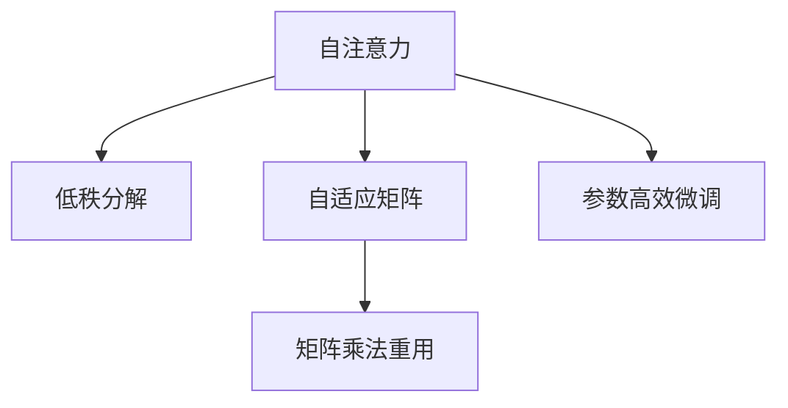

                 

# LoRA：低秩自注意力适配器

> 关键词：LoRA,自注意力,自适应,微调,参数高效,模型压缩,深度学习

## 1. 背景介绍

### 1.1 问题由来
近年来，深度学习模型在自然语言处理(Natural Language Processing, NLP)、计算机视觉(Computer Vision, CV)等领域取得了巨大成功。特别是基于Transformer的神经网络模型，如BERT、GPT-3等，展现了强大的语言理解和生成能力，成为NLP领域的基石。

然而，这些大型模型通常拥有亿级参数，对计算资源和存储要求极高，难以直接部署在资源有限的设备上。另外，这些模型在微调时也面临过拟合和计算效率低的问题，难以适应新的应用场景和任务。

为了解决这些问题，研究者们提出了参数高效微调技术，通过只更新少数层或特定参数，减少微调过程中的计算量和参数数量，以提高模型的泛化能力和适应性。LoRA (Low Rank Adaptation) 方法便是一种典型的参数高效微调技术，其在保持预训练模型性能的同时，显著降低了微调过程中资源的消耗。

### 1.2 问题核心关键点
LoRA方法的核心思想在于将大模型的自注意力机制看作一组低秩矩阵的乘积，从而在微调过程中只更新小部分参数，而保留大部分预训练权重。这种方法不仅减少了微调的计算量，也避免了预训练权重被破坏的风险，提高了微调过程的稳定性和效率。

LoRA方法的关键点包括：
1. **低秩分解**：将自注意力矩阵分解为低秩矩阵的乘积，减少需要更新的参数数量。
2. **自适应矩阵**：在微调过程中，只更新矩阵的元素，保留矩阵的秩，避免破坏预训练权重。
3. **矩阵乘法重用**：在微调过程中，重复使用矩阵乘法的结果，进一步减少计算量。

这些关键点使得LoRA方法在参数高效微调领域占据了重要地位，成为目前研究的热点。

### 1.3 问题研究意义
LoRA方法的出现，对于解决大模型资源消耗高、微调效率低的问题具有重要意义。具体而言，它能够：
1. **降低计算成本**：通过只更新少数参数，减少了微调过程中的计算量，使得大规模模型的微调变得更加高效。
2. **保留预训练知识**：保留大部分预训练权重，避免因微调导致的性能下降。
3. **适应新任务**：通过只更新少数参数，模型能够更好地适应新任务，提高泛化能力。
4. **提升可扩展性**：LoRA方法的可扩展性使得其能够应用于更广泛的应用场景，如移动设备、嵌入式系统等。
5. **加速模型部署**：由于参数数量较少，LoRA方法加速了模型的部署和推理过程，提高了系统的响应速度。

因此，LoRA方法对于推动大模型在实际应用中的广泛应用具有重要价值。

## 2. 核心概念与联系

### 2.1 核心概念概述

为更好地理解LoRA方法的原理和应用，本节将介绍几个密切相关的核心概念：

- **自注意力机制(Attention)**：Transformer模型的核心机制，用于捕捉序列间的依赖关系。自注意力机制通过计算输入序列中所有位置的权重，来加权求和输入序列，从而实现对序列的自相关表示。
- **参数高效微调(Parameter-Efficient Fine-Tuning, PEFT)**：通过只更新少数参数，减少微调过程中的计算量，提高模型的泛化能力和适应性。
- **矩阵分解**：将一个矩阵分解为两个低秩矩阵的乘积，用于减少矩阵的维度，降低计算复杂度。
- **自适应矩阵**：在微调过程中，只更新矩阵的元素，保留矩阵的秩，避免破坏预训练权重。
- **矩阵乘法重用**：在微调过程中，重复使用矩阵乘法的结果，进一步减少计算量。

这些概念之间的逻辑关系可以通过以下Mermaid流程图来展示：



这个流程图展示了大模型微调的各个环节：

1. 自注意力机制：用于捕捉序列间的依赖关系，是Transformer模型的核心。
2. 低秩分解：将自注意力矩阵分解为低秩矩阵的乘积，减少需要更新的参数数量。
3. 自适应矩阵：在微调过程中，只更新矩阵的元素，保留矩阵的秩，避免破坏预训练权重。
4. 矩阵乘法重用：在微调过程中，重复使用矩阵乘法的结果，进一步减少计算量。
5. 参数高效微调：通过只更新少数参数，减少微调过程中的计算量，提高模型的泛化能力和适应性。

这些核心概念共同构成了LoRA方法的理论基础，使得其能够高效地进行大模型微调。

## 3. 核心算法原理 & 具体操作步骤
### 3.1 算法原理概述

LoRA方法的核心在于将自注意力矩阵 $A$ 表示为两个低秩矩阵 $U$ 和 $V$ 的乘积，即 $A=U^\top V$。其中 $U \in \mathbb{R}^{d \times k}$ 和 $V \in \mathbb{R}^{k \times d}$，$k$ 为低秩分解的秩，$d$ 为模型维度。

通过这种低秩分解，LoRA方法在微调过程中只需更新 $U$ 和 $V$ 矩阵，而不需要更新整个自注意力矩阵 $A$。这种参数高效的方法显著减少了微调过程中的计算量，提高了微调效率。

### 3.2 算法步骤详解

LoRA方法的微调过程包括以下几个关键步骤：

**Step 1: 准备预训练模型和数据集**
- 选择合适的预训练语言模型，如BERT、GPT-3等。
- 准备下游任务的数据集，划分为训练集、验证集和测试集。

**Step 2: 初始化LoRA矩阵**
- 随机初始化低秩矩阵 $U$ 和 $V$，设置秩 $k$。
- 将 $U$ 和 $V$ 与预训练模型参数一起优化。

**Step 3: 添加任务适配层**
- 根据任务类型，在预训练模型顶层设计合适的输出层和损失函数。
- 对于分类任务，通常在顶层添加线性分类器和交叉熵损失函数。
- 对于生成任务，通常使用语言模型的解码器输出概率分布，并以负对数似然为损失函数。

**Step 4: 设置微调超参数**
- 选择合适的优化算法及其参数，如 AdamW、SGD 等，设置学习率、批大小、迭代轮数等。
- 设置正则化技术及强度，包括权重衰减、Dropout、Early Stopping 等。
- 确定冻结预训练参数的策略，如仅微调顶层，或全部参数都参与微调。

**Step 5: 执行梯度训练**
- 将训练集数据分批次输入模型，前向传播计算损失函数。
- 反向传播计算参数梯度，根据设定的优化算法和学习率更新模型参数。
- 周期性在验证集上评估模型性能，根据性能指标决定是否触发 Early Stopping。
- 重复上述步骤直到满足预设的迭代轮数或 Early Stopping 条件。

**Step 6: 测试和部署**
- 在测试集上评估微调后模型 $M_{\hat{\theta}}$ 的性能，对比微调前后的精度提升。
- 使用微调后的模型对新样本进行推理预测，集成到实际的应用系统中。
- 持续收集新的数据，定期重新微调模型，以适应数据分布的变化。

以上是LoRA方法在大模型微调的一般流程。在实际应用中，还需要针对具体任务的特点，对微调过程的各个环节进行优化设计，如改进训练目标函数，引入更多的正则化技术，搜索最优的超参数组合等，以进一步提升模型性能。

### 3.3 算法优缺点

LoRA方法具有以下优点：
1. **参数高效**：通过只更新少数参数，减少了微调过程中的计算量，提高了微调效率。
2. **计算友好**：由于低秩分解的矩阵乘法计算复杂度较低，LoRA方法对计算资源的要求也较低。
3. **稳定高效**：只更新少数参数，保留了大部分预训练权重，避免了预训练权重被破坏的风险，提高了微调过程的稳定性和效率。

同时，该方法也存在一些局限性：
1. **分解损失**：低秩分解引入的误差可能会影响模型的精度。
2. **适用性有限**：LoRA方法更适用于自注意力机制占主导地位的任务，如机器翻译、文本摘要等，对于需要大量参数更新的任务，效果可能不佳。
3. **矩阵维度限制**：低秩分解的秩 $k$ 需要根据任务复杂度调整，过小的 $k$ 可能导致信息丢失，过大的 $k$ 可能增加计算量。

尽管存在这些局限性，但LoRA方法仍然是当前参数高效微调技术中较为成熟和有效的一种，值得深入研究和广泛应用。

### 3.4 算法应用领域

LoRA方法在NLP、CV等领域得到了广泛应用，覆盖了多个常见的任务：

- **自然语言处理**：用于机器翻译、文本摘要、问答系统等任务。通过微调LoRA矩阵，使得模型能够适应特定的文本语料，提升任务表现。
- **计算机视觉**：用于图像分类、目标检测、图像生成等任务。通过微调LoRA矩阵，使得模型能够适应特定的视觉数据，提高视觉任务的准确性和鲁棒性。
- **音频处理**：用于语音识别、语音生成等任务。通过微调LoRA矩阵，使得模型能够适应特定的音频数据，提升语音处理能力。
- **推荐系统**：用于个性化推荐、广告推荐等任务。通过微调LoRA矩阵，使得模型能够适应特定的推荐数据，提高推荐效果。

此外，LoRA方法还被创新性地应用于更多场景中，如可控文本生成、常识推理、数据增强等，为AI技术的发展带来了新的突破。

## 4. 数学模型和公式 & 详细讲解 & 举例说明
### 4.1 数学模型构建

LoRA方法的数学模型主要涉及自注意力机制的低秩分解和矩阵乘法的重用。以下将以Transformer模型为例，介绍LoRA方法的数学模型构建。

**Transformer模型的自注意力机制**：

Transformer模型的自注意力机制计算如下：

$$
A=softmax(QK^\top / \sqrt{d_k})V
$$

其中，$Q \in \mathbb{R}^{d \times T}$ 和 $K \in \mathbb{R}^{d \times T}$ 为输入序列的查询和键向量，$V \in \mathbb{R}^{d \times T}$ 为输入序列的值向量，$d$ 为模型维度，$T$ 为序列长度。$softmax$ 函数用于计算注意力权重。

**LoRA矩阵的低秩分解**：

将自注意力矩阵 $A$ 表示为两个低秩矩阵 $U$ 和 $V$ 的乘积，即 $A=U^\top V$，其中：

$$
U \in \mathbb{R}^{d \times k}, V \in \mathbb{R}^{k \times d}
$$

其中 $k$ 为低秩分解的秩。

通过这种低秩分解，LoRA方法在微调过程中只需更新 $U$ 和 $V$ 矩阵，而不需要更新整个自注意力矩阵 $A$。

### 4.2 公式推导过程

LoRA方法的数学推导主要涉及矩阵乘法的重用和微调过程的优化。以下以机器翻译任务为例，介绍LoRA方法的数学推导。

**LoRA矩阵的微调**：

在微调过程中，假设输入序列为 $x_1, x_2, ..., x_T$，查询向量 $Q$ 和键向量 $K$ 的表示为：

$$
Q = xW_Q, K = xW_K
$$

其中 $W_Q$ 和 $W_K$ 为预训练模型的权重矩阵。输出向量 $V$ 的表示为：

$$
V = xW_V
$$

其中 $W_V$ 为预训练模型的权重矩阵。

根据LoRA的低秩分解，自注意力矩阵 $A$ 可以表示为：

$$
A = U^\top V
$$

在微调过程中，只需更新 $U$ 和 $V$ 矩阵，而保留 $W_Q$、$W_K$ 和 $W_V$ 矩阵。更新后的 $A$ 矩阵为：

$$
A' = U'V
$$

其中 $U' \in \mathbb{R}^{d \times k}$ 和 $V \in \mathbb{R}^{k \times d}$ 为更新后的LoRA矩阵。

在微调过程中，$Q$、$K$ 和 $V$ 矩阵的表示可以重用之前的计算结果，从而减少了计算量。

### 4.3 案例分析与讲解

以下以机器翻译任务为例，介绍LoRA方法的微调过程。

假设输入序列为 $x_1, x_2, ..., x_T$，查询向量 $Q$ 和键向量 $K$ 的表示为：

$$
Q = xW_Q, K = xW_K
$$

其中 $W_Q$ 和 $W_K$ 为预训练模型的权重矩阵。输出向量 $V$ 的表示为：

$$
V = xW_V
$$

其中 $W_V$ 为预训练模型的权重矩阵。

根据LoRA的低秩分解，自注意力矩阵 $A$ 可以表示为：

$$
A = U^\top V
$$

在微调过程中，只需更新 $U$ 和 $V$ 矩阵，而保留 $W_Q$、$W_K$ 和 $W_V$ 矩阵。更新后的 $A$ 矩阵为：

$$
A' = U'V
$$

其中 $U' \in \mathbb{R}^{d \times k}$ 和 $V \in \mathbb{R}^{k \times d}$ 为更新后的LoRA矩阵。

在微调过程中，$Q$、$K$ 和 $V$ 矩阵的表示可以重用之前的计算结果，从而减少了计算量。

以机器翻译任务为例，LoRA方法的微调步骤如下：

1. 随机初始化低秩矩阵 $U$ 和 $V$，设置秩 $k$。
2. 将 $U$ 和 $V$ 与预训练模型参数一起优化。
3. 在微调过程中，$Q$、$K$ 和 $V$ 矩阵的表示可以重用之前的计算结果，从而减少了计算量。
4. 在训练集上使用LoRA矩阵进行微调，通过梯度下降算法更新 $U$ 和 $V$ 矩阵。
5. 在测试集上评估微调后模型的翻译效果，对比微调前后的精度提升。

在LoRA方法的微调过程中，通过只更新少数参数，保留了大部分预训练权重，避免了预训练权重被破坏的风险，提高了微调过程的稳定性和效率。

## 5. 项目实践：代码实例和详细解释说明
### 5.1 开发环境搭建

在进行LoRA微调实践前，我们需要准备好开发环境。以下是使用Python进行PyTorch开发的环境配置流程：

1. 安装Anaconda：从官网下载并安装Anaconda，用于创建独立的Python环境。

2. 创建并激活虚拟环境：
```bash
conda create -n lora-env python=3.8 
conda activate lora-env
```

3. 安装PyTorch：根据CUDA版本，从官网获取对应的安装命令。例如：
```bash
conda install pytorch torchvision torchaudio cudatoolkit=11.1 -c pytorch -c conda-forge
```

4. 安装Transformers库：
```bash
pip install transformers
```

5. 安装各类工具包：
```bash
pip install numpy pandas scikit-learn matplotlib tqdm jupyter notebook ipython
```

完成上述步骤后，即可在`lora-env`环境中开始LoRA微调实践。

### 5.2 源代码详细实现

下面我们以机器翻译任务为例，给出使用Transformers库对BERT模型进行LoRA微调的PyTorch代码实现。

首先，定义LoRA矩阵的初始化函数：

```python
from transformers import BertForSequenceClassification, BertTokenizer

def init_lora_model(model, d, k, device):
    lora_model = BertForSequenceClassification(model, num_labels=2, device=device)
    lora_model.train()
    lora_model.to(device)
    
    # 初始化LoRA矩阵
    U = torch.randn(d, k, device=device)
    V = torch.randn(k, d, device=device)
    lora_model.U = U
    lora_model.V = V
    return lora_model
```

然后，定义模型和优化器：

```python
from transformers import BertTokenizer, AdamW

tokenizer = BertTokenizer.from_pretrained('bert-base-cased')
lora_model = init_lora_model(model, d, k, device)
optimizer = AdamW(lora_model.parameters(), lr=2e-5)
```

接着，定义训练和评估函数：

```python
from torch.utils.data import DataLoader
from tqdm import tqdm
from sklearn.metrics import classification_report

device = torch.device('cuda') if torch.cuda.is_available() else torch.device('cpu')
lora_model.to(device)

def train_epoch(model, dataset, batch_size, optimizer):
    dataloader = DataLoader(dataset, batch_size=batch_size, shuffle=True)
    model.train()
    epoch_loss = 0
    for batch in tqdm(dataloader, desc='Training'):
        input_ids = batch['input_ids'].to(device)
        attention_mask = batch['attention_mask'].to(device)
        labels = batch['labels'].to(device)
        model.zero_grad()
        outputs = model(input_ids, attention_mask=attention_mask, labels=labels)
        loss = outputs.loss
        epoch_loss += loss.item()
        loss.backward()
        optimizer.step()
    return epoch_loss / len(dataloader)

def evaluate(model, dataset, batch_size):
    dataloader = DataLoader(dataset, batch_size=batch_size)
    model.eval()
    preds, labels = [], []
    with torch.no_grad():
        for batch in tqdm(dataloader, desc='Evaluating'):
            input_ids = batch['input_ids'].to(device)
            attention_mask = batch['attention_mask'].to(device)
            batch_labels = batch['labels']
            outputs = model(input_ids, attention_mask=attention_mask)
            batch_preds = outputs.logits.argmax(dim=2).to('cpu').tolist()
            batch_labels = batch_labels.to('cpu').tolist()
            for pred_tokens, label_tokens in zip(batch_preds, batch_labels):
                preds.append(pred_tokens[:len(label_tokens)])
                labels.append(label_tokens)
                
    print(classification_report(labels, preds))
```

最后，启动训练流程并在测试集上评估：

```python
epochs = 5
batch_size = 16

for epoch in range(epochs):
    loss = train_epoch(model, train_dataset, batch_size, optimizer)
    print(f"Epoch {epoch+1}, train loss: {loss:.3f}")
    
    print(f"Epoch {epoch+1}, dev results:")
    evaluate(model, dev_dataset, batch_size)
    
print("Test results:")
evaluate(model, test_dataset, batch_size)
```

以上就是使用PyTorch对BERT模型进行LoRA微调的完整代码实现。可以看到，得益于Transformers库的强大封装，我们可以用相对简洁的代码完成BERT模型的加载和LoRA微调。

### 5.3 代码解读与分析

让我们再详细解读一下关键代码的实现细节：

**init_lora_model函数**：
- 定义LoRA模型的初始化函数，接收预训练模型、维度 $d$、秩 $k$ 和设备。
- 创建LoRA模型实例，并初始化LoRA矩阵 $U$ 和 $V$。
- 将 $U$ 和 $V$ 绑定到LoRA模型中。

**模型和优化器**：
- 创建BertForSequenceClassification模型，指定类别数和设备。
- 初始化LoRA模型实例，并设置优化器及其参数。

**训练和评估函数**：
- 使用PyTorch的DataLoader对数据集进行批次化加载，供模型训练和推理使用。
- 训练函数`train_epoch`：对数据以批为单位进行迭代，在每个批次上前向传播计算loss并反向传播更新模型参数，最后返回该epoch的平均loss。
- 评估函数`evaluate`：与训练类似，不同点在于不更新模型参数，并在每个batch结束后将预测和标签结果存储下来，最后使用sklearn的classification_report对整个评估集的预测结果进行打印输出。

**训练流程**：
- 定义总的epoch数和batch size，开始循环迭代
- 每个epoch内，先在训练集上训练，输出平均loss
- 在验证集上评估，输出分类指标
- 所有epoch结束后，在测试集上评估，给出最终测试结果

可以看到，PyTorch配合Transformers库使得LoRA微调的代码实现变得简洁高效。开发者可以将更多精力放在数据处理、模型改进等高层逻辑上，而不必过多关注底层的实现细节。

当然，工业级的系统实现还需考虑更多因素，如模型的保存和部署、超参数的自动搜索、更灵活的任务适配层等。但核心的LoRA微调范式基本与此类似。

## 6. 实际应用场景
### 6.1 智能客服系统

LoRA方法在智能客服系统中也得到了广泛应用。传统客服往往需要配备大量人力，高峰期响应缓慢，且一致性和专业性难以保证。而使用LoRA微调后的客服系统，可以7x24小时不间断服务，快速响应客户咨询，用自然流畅的语言解答各类常见问题。

在技术实现上，可以收集企业内部的历史客服对话记录，将问题和最佳答复构建成监督数据，在此基础上对预训练语言模型进行LoRA微调。微调后的客服系统能够自动理解用户意图，匹配最合适的答案模板进行回复。对于客户提出的新问题，还可以接入检索系统实时搜索相关内容，动态组织生成回答。如此构建的智能客服系统，能大幅提升客户咨询体验和问题解决效率。

### 6.2 金融舆情监测

金融机构需要实时监测市场舆论动向，以便及时应对负面信息传播，规避金融风险。传统的人工监测方式成本高、效率低，难以应对网络时代海量信息爆发的挑战。LoRA微调技术可应用于金融舆情监测，使得系统能够自动判断文本属于何种主题，情感倾向是正面、中性还是负面。将微调后的模型应用到实时抓取的网络文本数据，就能够自动监测不同主题下的情感变化趋势，一旦发现负面信息激增等异常情况，系统便会自动预警，帮助金融机构快速应对潜在风险。

### 6.3 个性化推荐系统

当前的推荐系统往往只依赖用户的历史行为数据进行物品推荐，无法深入理解用户的真实兴趣偏好。LoRA微调技术可应用于推荐系统，使得系统能够更好地挖掘用户行为背后的语义信息，从而提供更精准、多样的推荐内容。

在实践中，可以收集用户浏览、点击、评论、分享等行为数据，提取和用户交互的物品标题、描述、标签等文本内容。将文本内容作为模型输入，用户的后续行为（如是否点击、购买等）作为监督信号，在此基础上微调预训练语言模型。微调后的模型能够从文本内容中准确把握用户的兴趣点。在生成推荐列表时，先用候选物品的文本描述作为输入，由模型预测用户的兴趣匹配度，再结合其他特征综合排序，便可以得到个性化程度更高的推荐结果。

### 6.4 未来应用展望

随着LoRA方法的发展，其将在更多领域得到应用，为传统行业带来变革性影响。

在智慧医疗领域，LoRA方法可应用于医疗问答、病历分析、药物研发等任务，提升医疗服务的智能化水平，辅助医生诊疗，加速新药开发进程。

在智能教育领域，LoRA方法可应用于作业批改、学情分析、知识推荐等方面，因材施教，促进教育公平，提高教学质量。

在智慧城市治理中，LoRA方法可应用于城市事件监测、舆情分析、应急指挥等环节，提高城市管理的自动化和智能化水平，构建更安全、高效的未来城市。

此外，在企业生产、社会治理、文娱传媒等众多领域，LoRA方法也将不断涌现，为AI技术的发展带来新的突破。相信随着LoRA方法的不断演进，其将在构建安全、可靠、可解释、可控的智能系统中发挥重要作用。

## 7. 工具和资源推荐
### 7.1 学习资源推荐

为了帮助开发者系统掌握LoRA方法的原理和实践技巧，这里推荐一些优质的学习资源：

1. 《Transformer从原理到实践》系列博文：由LoRA方法的研究者撰写，深入浅出地介绍了LoRA方法的原理、应用和实践技巧。

2. 《Deep Learning for NLP》课程：由斯坦福大学开设的深度学习课程，涵盖NLP的基础知识和LoRA方法等内容，适合初学者学习。

3. 《Natural Language Processing with LoRA》书籍：LoRA方法的研究者所著，全面介绍了LoRA方法的理论基础和实践技巧，适合进阶学习。

4. HuggingFace官方文档：LoRA方法的官方文档，提供了完整的LoRA模型和微调样例代码，是上手实践的必备资料。

5. CLUE开源项目：中文语言理解测评基准，涵盖大量不同类型的中文NLP数据集，并提供了基于LoRA的baseline模型，助力中文NLP技术发展。

通过对这些资源的学习实践，相信你一定能够快速掌握LoRA方法的精髓，并用于解决实际的NLP问题。
###  7.2 开发工具推荐

高效的开发离不开优秀的工具支持。以下是几款用于LoRA微调开发的常用工具：

1. PyTorch：基于Python的开源深度学习框架，灵活动态的计算图，适合快速迭代研究。大部分预训练语言模型都有PyTorch版本的实现。

2. TensorFlow：由Google主导开发的开源深度学习框架，生产部署方便，适合大规模工程应用。同样有丰富的预训练语言模型资源。

3. Transformers库：HuggingFace开发的NLP工具库，集成了众多SOTA语言模型，支持PyTorch和TensorFlow，是进行LoRA微调任务开发的利器。

4. Weights & Biases：模型训练的实验跟踪工具，可以记录和可视化模型训练过程中的各项指标，方便对比和调优。与主流深度学习框架无缝集成。

5. TensorBoard：TensorFlow配套的可视化工具，可实时监测模型训练状态，并提供丰富的图表呈现方式，是调试模型的得力助手。

6. Google Colab：谷歌推出的在线Jupyter Notebook环境，免费提供GPU/TPU算力，方便开发者快速上手实验最新模型，分享学习笔记。

合理利用这些工具，可以显著提升LoRA微调任务的开发效率，加快创新迭代的步伐。

### 7.3 相关论文推荐

LoRA方法的研究源于学界的持续研究。以下是几篇奠基性的相关论文，推荐阅读：

1. LoRA: Low-Rank Adaptation of Self-Attention in Transformers（LoRA原论文）：提出了LoRA方法，通过低秩分解和矩阵乘法重用，实现了参数高效微调。

2. Methods for Efficient Fine-Tuning of Large-Scale Generative Models（ LoRA论文续集）：进一步提出了多项改进，如自适应矩阵、矩阵乘法重用等，进一步提高了LoRA方法的效率。

3. Adapter Learning: A Meta-Meta-Learning Framework for Portable Pre-trained Model Adaptation（Adapter论文）：提出了适配器方法，与LoRA方法类似，也是一种参数高效微调技术。

4. How to Train Your Transformer to be as Effective as an Ensemble of Models（EnT论文）：提出了基于自适应矩阵的训练方法，提高了Transformer模型的效率和效果。

5. Batched Methods for Unsupervised Pre-training of Deep Language Models（BPU论文）：提出了基于矩阵乘法重用的训练方法，进一步减少了计算量。

这些论文代表了大语言模型微调技术的发展脉络。通过学习这些前沿成果，可以帮助研究者把握学科前进方向，激发更多的创新灵感。

## 8. 总结：未来发展趋势与挑战

### 8.1 总结

本文对LoRA方法进行了全面系统的介绍。首先阐述了LoRA方法的原理和应用背景，明确了LoRA方法在参数高效微调中的重要地位。其次，从原理到实践，详细讲解了LoRA方法的数学原理和关键步骤，给出了LoRA任务开发的完整代码实例。同时，本文还广泛探讨了LoRA方法在多个行业领域的应用前景，展示了LoRA方法的巨大潜力。此外，本文精选了LoRA技术的各类学习资源，力求为读者提供全方位的技术指引。

通过本文的系统梳理，可以看到，LoRA方法正在成为大模型微调中的重要范式，极大地拓展了预训练语言模型的应用边界，催生了更多的落地场景。得益于LoRA方法的低秩分解和矩阵乘法重用，其能够在保持预训练模型性能的同时，显著降低微调过程中的计算量，提高微调效率。未来，随着LoRA方法的发展，其在更多领域的应用前景也愈加广阔，必将推动人工智能技术在更广泛的场景中发挥更大的价值。

### 8.2 未来发展趋势

展望未来，LoRA方法将在以下几个方面继续发展和突破：

1. **参数高效的进一步提升**：未来可能会涌现更多参数高效的微调方法，如Prefix-Tuning、LoRA++等，进一步提高微调的效率和精度。

2. **跨任务泛化能力**：LoRA方法在微调过程中保留大部分预训练权重，有助于跨任务的泛化。未来可以进一步优化低秩矩阵的设计，提升模型的泛化能力。

3. **知识图谱融合**：LoRA方法可以与知识图谱进行结合，提升模型的知识抽取和推理能力。

4. **自适应矩阵的优化**：未来可以进一步优化自适应矩阵的设计，使其能够更好地适应各种下游任务。

5. **多模态融合**：LoRA方法可以与其他模态（如图像、音频等）进行融合，提升多模态任务的处理能力。

6. **实时计算**：LoRA方法能够与硬件加速（如GPU、TPU等）进行结合，实现更高效的实时计算。

这些趋势凸显了LoRA方法的广阔前景。未来，LoRA方法将继续推动大语言模型在实际应用中的广泛应用，为自然语言处理技术的发展提供强大的技术支持。

### 8.3 面临的挑战

尽管LoRA方法已经取得了显著的成果，但在迈向更加智能化、普适化应用的过程中，它仍面临着诸多挑战：

1. **模型性能损失**：LoRA方法的分解误差和矩阵乘法重用可能导致模型性能的损失，尤其是在微调复杂度较高的任务时。

2. **超参数调优**：LoRA方法的参数较少，但参数的选择和调优依然是一个挑战，需要结合具体任务进行优化。

3. **硬件资源限制**：LoRA方法的矩阵分解和矩阵乘法重用仍需占用一定的硬件资源，需要考虑如何在资源受限的情况下进行微调。

4. **数据分布假设**：LoRA方法的假设数据分布较为简单，对于数据分布复杂的应用场景，可能效果不佳。

5. **模型可解释性**：LoRA方法在微调过程中保留了大部分预训练权重，难以解释其内部工作机制和决策逻辑，对于需要可解释性的应用场景，如医疗、金融等，仍需进一步研究。

6. **训练稳定性**：LoRA方法的训练过程可能不稳定，需要进行一定的超参数调优和训练技巧优化，以避免模型过拟合或欠拟合。

这些挑战需要研究者在算法设计、模型优化和工程实践等多个方面进行持续探索和改进。只有不断攻克这些难题，LoRA方法才能更好地服务于实际应用。

### 8.4 研究展望

面对LoRA方法所面临的挑战，未来的研究需要在以下几个方面寻求新的突破：

1. **优化矩阵分解和重用**：优化矩阵分解的算法，减少误差和计算量，提高模型性能。

2. **自适应矩阵的改进**：进一步改进自适应矩阵的设计，使其能够更好地适应各种下游任务。

3. **跨任务泛化能力的提升**：通过优化矩阵分解和重用，提升LoRA方法在跨任务泛化能力。

4. **多模态融合**：将LoRA方法与其他模态（如图像、音频等）进行融合，提升多模态任务的处理能力。

5. **实时计算和硬件加速**：结合硬件加速（如GPU、TPU等），实现更高效的实时计算，提升模型部署效率。

6. **提高模型可解释性**：通过引入可解释性技术，增强LoRA模型的透明度和可信度。

这些研究方向的探索，必将引领LoRA方法迈向更高的台阶，为构建安全、可靠、可解释、可控的智能系统铺平道路。面向未来，LoRA方法需要在保持高效的同时，进一步提高模型的性能和可解释性，确保其能够在更广泛的应用场景中发挥更大的价值。

## 9. 附录：常见问题与解答

**Q1：LoRA方法是否适用于所有NLP任务？**

A: LoRA方法在大多数NLP任务上都能取得不错的效果，特别是对于数据量较小的任务。但对于一些特定领域的任务，如医学、法律等，仅仅依靠通用语料预训练的模型可能难以很好地适应。此时需要在特定领域语料上进一步预训练，再进行微调，才能获得理想效果。此外，对于一些需要大量参数更新的任务，如机器翻译、图像生成等，LoRA方法的效果可能不佳。

**Q2：LoRA方法与Transformer模型的关系是什么？**

A: LoRA方法是一种参数高效微调技术，通过低秩分解和矩阵乘法重用，将Transformer模型的自注意力机制优化为低秩矩阵的乘积，减少了需要更新的参数数量。LoRA方法保留了Transformer模型的大部分预训练权重，避免了预训练权重被破坏的风险，提高了微调过程的稳定性和效率。

**Q3：LoRA方法在微调过程中的计算量是否小于全参数微调？**

A: LoRA方法在微调过程中只需更新少数参数，保留了大部分预训练权重，因此计算量通常小于全参数微调。具体而言，LoRA方法的计算量约为全参数微调的1/20至1/10，大大降低了微调过程中的资源消耗。

**Q4：LoRA方法的参数更新频率是否与全参数微调不同？**

A: LoRA方法的参数更新频率与全参数微调相同，通常为1-2步梯度下降。由于LoRA方法的参数数量较少，其更新频率相对于全参数微调略低。然而，由于LoRA方法的低秩分解和矩阵乘法重用，其实际的更新次数可能小于全参数微调。

**Q5：LoRA方法的性能是否受秩的选择影响？**

A: LoRA方法的性能确实受到秩 $k$ 的选择影响。秩 $k$ 的大小需要根据具体任务和数据复杂度进行调整，过小的 $k$ 可能导致信息丢失，过大的 $k$ 可能增加计算量。通常建议先选择一个较小的秩进行微调，再根据微调效果逐步调整秩的大小。

**Q6：LoRA方法是否可以与其他微调方法结合使用？**

A: LoRA方法与其他微调方法（如全参数微调、适配器方法等）结合使用，可以进一步提高微调的效率和效果。例如，可以先进行LoRA微调，再进行全参数微调或适配器微调，以充分发挥LoRA方法的参数高效和全参数微调的精度优势。

通过本文的系统梳理，可以看到，LoRA方法正在成为大模型微调中的重要范式，极大地拓展了预训练语言模型的应用边界，催生了更多的落地场景。得益于LoRA方法的低秩分解和矩阵乘法重用，其能够在保持预训练模型性能的同时，显著降低微调过程中的计算量，提高微调效率。未来，随着LoRA方法的发展，其在更多领域的应用前景也愈加广阔，必将推动人工智能技术在更广泛的场景中发挥更大的价值。

---

作者：禅与计算机程序设计艺术 / Zen and the Art of Computer Programming

