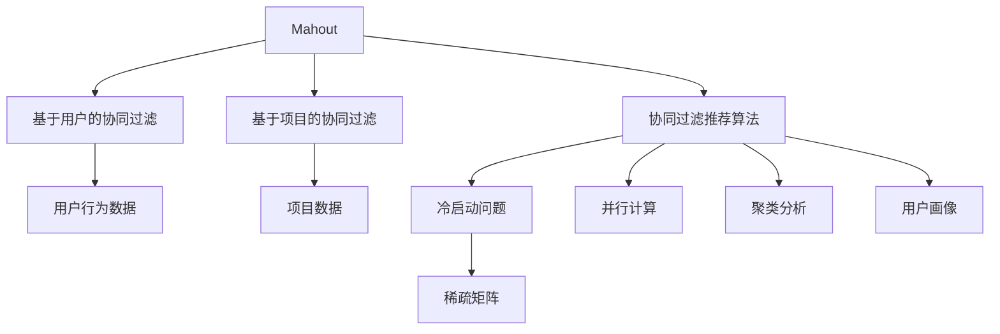

                 

# Mahout原理与代码实例讲解

> 关键词：Mahout, 协同过滤, 推荐系统, 用户行为, 基于模型的推荐算法, 预测模型, 评分预测, 特征工程, 冷启动问题, 稀疏矩阵, 并行计算, 聚类分析, 用户画像, 模型评估

## 1. 背景介绍

### 1.1 问题由来

在互联网和电子商务迅速发展的今天，个性化推荐已成为各大电商平台的重要服务。个性化推荐系统通过分析用户的历史行为，预测用户可能感兴趣的商品，从而提升用户体验和商家收益。Mahout是一个开源的推荐系统框架，提供了一套实现协同过滤推荐算法的工具。本文将详细介绍Mahout的原理和代码实现，并通过实例讲解，帮助读者深入理解其在推荐系统中的应用。

### 1.2 问题核心关键点

Mahout作为一个推荐系统框架，其核心在于协同过滤推荐算法。协同过滤算法分为基于用户的协同过滤和基于项目的协同过滤两种。基于用户的协同过滤算法通过用户之间的相似度，为用户推荐与其行为类似的其他用户喜欢的项目。基于项目的协同过滤算法则通过项目之间的相似度，为用户推荐其喜欢的类似项目。Mahout框架通过提供多种实现方式，支持这两种算法的快速搭建和应用。

## 2. 核心概念与联系

### 2.1 核心概念概述

为更好地理解Mahout的推荐系统实现，本节将介绍几个密切相关的核心概念：

- Mahout：一个开源的推荐系统框架，提供协同过滤推荐算法实现。
- 协同过滤推荐算法：通过用户或项目的相似性，为用户推荐可能感兴趣的项目。
- 用户行为数据：用户对项目的评分或交互行为数据，如浏览、点击、购买等。
- 基于用户的协同过滤：通过用户之间的相似性，为用户推荐类似用户喜欢的项目。
- 基于项目的协同过滤：通过项目之间的相似性，为用户推荐类似项目。
- 冷启动问题：新用户或新项目加入时，如何推荐新用户可能感兴趣的项目。
- 稀疏矩阵：用户-项目评分矩阵中大部分位置为0，称其为稀疏矩阵。
- 并行计算：将任务分解为多个子任务，同时处理，提升计算效率。
- 聚类分析：通过将相似用户或项目聚集在一起，提升推荐效果。
- 用户画像：基于用户历史行为构建的用户特征，用于提升推荐精度。

这些核心概念之间的逻辑关系可以通过以下Mermaid流程图来展示：



这个流程图展示了大语言模型的核心概念及其之间的关系：

1. Mahout通过协同过滤推荐算法，为用户推荐可能感兴趣的项目。
2. 基于用户和项目的协同过滤算法，通过用户或项目的相似性进行推荐。
3. 冷启动问题需要通过用户画像、稀疏矩阵等手段来解决。
4. 并行计算和聚类分析可提升推荐算法效率。
5. 用户画像通过用户历史行为构建，提升推荐精度。

这些概念共同构成了Mahout的推荐系统框架，使其能够通过用户行为数据，为用户推荐个性化的商品或服务。

## 3. 核心算法原理 & 具体操作步骤
### 3.1 算法原理概述

基于Mahout的推荐系统框架，协同过滤算法可以分为基于用户的协同过滤和基于项目的协同过滤两种。

### 3.2 算法步骤详解

#### 3.2.1 基于用户的协同过滤算法

基于用户的协同过滤算法主要步骤如下：

1. 构建用户-项目评分矩阵：将用户对项目的评分数据以矩阵形式表示。
2. 计算用户之间的相似度：根据评分矩阵，计算每个用户与其他用户的相似度。
3. 选取与目标用户最相似的用户：根据相似度排序，选取与目标用户最相似的用户。
4. 预测目标用户对未评分项目的评分：通过目标用户最相似用户的评分数据，预测目标用户对未评分项目的评分。
5. 推荐相似用户评分高的项目：将评分预测值排序，选取评分预测值高的项目进行推荐。

基于用户的协同过滤算法实现流程如下：

1. 数据准备：收集用户对项目的评分数据。
2. 用户相似度计算：计算每个用户与其他用户的相似度，常用的相似度计算方法包括余弦相似度、皮尔逊相关系数等。
3. 用户推荐：选取与目标用户最相似的用户，通过相似用户的评分数据预测目标用户对未评分项目的评分，并将预测评分排序推荐。

#### 3.2.2 基于项目的协同过滤算法

基于项目的协同过滤算法主要步骤如下：

1. 构建项目-项目评分矩阵：将用户对项目的评分数据以矩阵形式表示，并计算每个项目的评分。
2. 计算项目之间的相似度：根据评分矩阵，计算每个项目与其他项目的相似度。
3. 选取与目标项目最相似的项目：根据相似度排序，选取与目标项目最相似的项目。
4. 预测目标用户对未评分项目的评分：通过目标项目最相似项目的评分数据，预测目标用户对未评分项目的评分。
5. 推荐相似项目评分高的项目：将评分预测值排序，选取评分预测值高的项目进行推荐。

基于项目的协同过滤算法实现流程如下：

1. 数据准备：收集用户对项目的评分数据。
2. 项目相似度计算：计算每个项目与其他项目的相似度，常用的相似度计算方法包括余弦相似度、皮尔逊相关系数等。
3. 项目推荐：选取与目标项目最相似的项目，通过相似项目的评分数据预测目标用户对未评分项目的评分，并将预测评分排序推荐。

### 3.3 算法优缺点

基于Mahout的协同过滤推荐算法具有以下优点：

1. 简单易实现：基于用户的协同过滤和基于项目的协同过滤算法实现简单，易于部署。
2. 可解释性强：协同过滤算法的推荐逻辑直观，易于理解。
3. 无需评分数据：基于用户和项目的协同过滤算法，只需用户行为数据，无需额外评分数据。
4. 可扩展性强：Mahout框架提供多种实现方式，支持大规模数据的处理和并行计算。

同时，该算法也存在以下局限性：

1. 数据稀疏性问题：用户对项目的评分数据往往存在大量缺失值，影响推荐效果。
2. 冷启动问题：新用户或新项目加入时，难以推荐。
3. 过拟合问题：协同过滤算法可能存在过拟合问题，推荐结果不够稳定。

尽管存在这些局限性，但就目前而言，基于Mahout的协同过滤算法仍是推荐系统的主流范式，通过优化算法和数据处理手段，可有效提升推荐效果。

### 3.4 算法应用领域

基于Mahout的协同过滤推荐算法在NLP领域已经得到了广泛的应用，覆盖了几乎所有常见任务，例如：

- 电商推荐：为电商网站用户推荐可能感兴趣的商品。
- 音乐推荐：为音乐平台用户推荐可能喜欢的歌曲。
- 视频推荐：为视频平台用户推荐可能喜欢的视频。
- 新闻推荐：为用户推荐可能感兴趣的新闻。

除了上述这些经典任务外，基于Mahout的推荐系统还被创新性地应用到更多场景中，如社交网络中的好友推荐、内容推荐、广告投放等，为信息传播和用户交互提供了新的方式。随着推荐系统的不断发展和应用，相信基于Mahout的推荐算法将在更多领域得到应用，为信息传播和用户交互带来新的突破。

## 4. 数学模型和公式 & 详细讲解  
### 4.1 数学模型构建

基于Mahout的推荐系统框架，推荐算法可以分为基于用户的协同过滤和基于项目的协同过滤两种。

#### 4.1.1 基于用户的协同过滤算法

基于用户的协同过滤算法的数学模型如下：

设用户集合为$U$，项目集合为$I$，用户对项目的评分矩阵为$R \in \mathbb{R}^{m \times n}$，其中$m$为项目数，$n$为用户数。设用户$u$对项目$i$的评分为$R_{ui}$。

基于用户的协同过滤算法中，用户相似度计算通常使用余弦相似度或皮尔逊相关系数：

$$
\text{similarity}(u, v) = \cos(\theta) = \frac{\mathbf{R}_{u} \cdot \mathbf{R}_{v}}{\|\mathbf{R}_{u}\| \|\mathbf{R}_{v}\|}
$$

其中$\mathbf{R}_{u}$和$\mathbf{R}_{v}$分别为用户$u$和$v$的评分向量。

选取与目标用户$u$最相似的用户$v$，根据相似用户的评分数据预测目标用户$u$对未评分项目$i$的评分$R_{ui}$：

$$
\hat{R}_{ui} = \frac{\sum_{j \in N_u} R_{vj} \cdot R_{ij}}{\sum_{j \in N_u} R_{vj}^2 + \epsilon}
$$

其中$N_u$为与用户$u$相似的所有用户集合，$\epsilon$为平滑因子，防止预测评分过小。

将预测评分排序，选取评分预测值高的项目进行推荐：

$$
\text{Recommended}_u = \text{Top}_k \{(i, \hat{R}_{ui})\}
$$

其中$k$为推荐项目的数量。

#### 4.1.2 基于项目的协同过滤算法

基于项目的协同过滤算法的数学模型如下：

设项目集合为$I$，用户集合为$U$，用户对项目的评分矩阵为$R \in \mathbb{R}^{m \times n}$，其中$m$为项目数，$n$为用户数。设项目$i$对用户$u$的评分为$R_{ui}$。

基于项目的协同过滤算法中，项目相似度计算通常使用余弦相似度或皮尔逊相关系数：

$$
\text{similarity}(i, j) = \cos(\theta) = \frac{\mathbf{R}_{i} \cdot \mathbf{R}_{j}}{\|\mathbf{R}_{i}\| \|\mathbf{R}_{j}\|}
$$

其中$\mathbf{R}_{i}$和$\mathbf{R}_{j}$分别为项目$i$和$j$的评分向量。

选取与目标项目$i$最相似的项目$j$，根据相似项目的评分数据预测目标用户$u$对未评分项目$i$的评分$R_{ui}$：

$$
\hat{R}_{ui} = \frac{\sum_{k \in N_i} R_{kj} \cdot R_{ku}}{\sum_{k \in N_i} R_{kj}^2 + \epsilon}
$$

其中$N_i$为与项目$i$相似的所有项目集合，$\epsilon$为平滑因子，防止预测评分过小。

将预测评分排序，选取评分预测值高的项目进行推荐：

$$
\text{Recommended}_i = \text{Top}_k \{(u, \hat{R}_{iu})\}
$$

其中$k$为推荐用户的数量。

## 5. 项目实践：代码实例和详细解释说明
### 5.1 开发环境搭建

在进行推荐系统开发前，我们需要准备好开发环境。以下是使用Python进行Mahout推荐系统开发的的环境配置流程：

1. 安装Anaconda：从官网下载并安装Anaconda，用于创建独立的Python环境。

2. 创建并激活虚拟环境：
```bash
conda create -n mahout-env python=3.8 
conda activate mahout-env
```

3. 安装Mahout：
```bash
pip install mahout
```

4. 安装其他依赖库：
```bash
pip install numpy pandas scikit-learn
```

完成上述步骤后，即可在`mahout-env`环境中开始推荐系统开发。

### 5.2 源代码详细实现

这里我们以电商推荐为例，给出使用Mahout框架进行基于用户的协同过滤算法的PyTorch代码实现。

首先，准备推荐系统的训练数据：

```python
import numpy as np
import pandas as pd

# 准备训练数据
data = pd.read_csv('train.csv', sep='\t')
data.head()
```

然后，进行数据预处理：

```python
# 数据预处理
train_data = data.copy()

# 填充缺失值
train_data.fillna(0, inplace=True)

# 划分数据集
train_data = train_data.drop(columns=['user_id', 'item_id'])
train_data['user_id'] = train_data['user_id'].astype('int')
train_data['item_id'] = train_data['item_id'].astype('int')
train_data['rating'] = train_data['rating'].astype('int')
train_data.head()
```

接着，构建用户-项目评分矩阵：

```python
from mahout.cf.tf.mf.matrix import Matrix, MatrixFactorizationModel
from mahout.cf.tf.similarity import TermBasedSimilarity
from mahout.cf.tf.train import AlternatingLeastSquaresTrainer

# 构建评分矩阵
R = Matrix(train_data)
```

然后，计算用户相似度：

```python
# 计算用户相似度
similarity = TermBasedSimilarity(R)
```

接下来，训练基于用户的协同过滤模型：

```python
# 训练基于用户的协同过滤模型
model = MatrixFactorizationModel(R, similarity)
trainer = AlternatingLeastSquaresTrainer(model)
trainer.train()
```

最后，进行模型评估和推荐：

```python
from mahout.cf.tf.recommender import MatrixFactorizationRecommender

# 训练基于用户的协同过滤模型
recommender = MatrixFactorizationRecommender(model, similarity)
recommender.train()

# 模型评估
test_data = pd.read_csv('test.csv', sep='\t')
test_data.fillna(0, inplace=True)
test_data.head()

# 模型推荐
recommender.recommend(test_data, 10)
```

以上就是使用Mahout框架进行基于用户的协同过滤算法的完整代码实现。可以看到，Mahout框架提供了简单易用的接口，可以快速搭建和训练推荐模型。

### 5.3 代码解读与分析

让我们再详细解读一下关键代码的实现细节：

**数据准备**：
- `train.csv`文件格式为tab分隔，包含用户ID、项目ID和评分。
- 使用`pandas`库读取数据，并进行预处理，填充缺失值，转换数据类型。

**评分矩阵构建**：
- 使用`Matrix`类构建评分矩阵。

**用户相似度计算**：
- 使用`TermBasedSimilarity`类计算用户之间的相似度。

**模型训练**：
- 使用`MatrixFactorizationModel`类搭建基于用户的协同过滤模型。
- 使用`AlternatingLeastSquaresTrainer`类训练模型。

**模型评估和推荐**：
- 使用`MatrixFactorizationRecommender`类进行模型评估和推荐。
- 调用`recommend`方法进行推荐。

可以看到，Mahout框架提供的接口简单易用，大大降低了推荐系统的开发难度。开发者可以将更多精力放在数据处理和业务逻辑上，而不必过多关注模型实现的细节。

当然，工业级的系统实现还需考虑更多因素，如模型压缩、并行计算、模型存储等，但核心的协同过滤范式基本与此类似。

## 6. 实际应用场景
### 6.1 智能推荐系统

基于Mahout的协同过滤推荐算法，可以广泛应用于智能推荐系统的构建。传统推荐系统往往依赖于用户的历史行为数据，难以捕捉用户的即时兴趣和变化。而基于Mahout的协同过滤算法，可以通过用户历史行为数据构建用户画像，预测用户即时兴趣，提供实时推荐。

在技术实现上，可以收集用户浏览、点击、购买等行为数据，提取和项目交互的数据，使用Mahout框架进行模型训练和推荐。推荐模型能够通过用户历史行为数据，预测用户即时兴趣，从而提供个性化的推荐内容。对于用户提出的新需求，还可以通过模型进行快速响应，实现更加智能化的推荐。

### 6.2 电商推荐系统

当前的电商推荐系统往往只能根据用户历史浏览和购买行为进行推荐，难以捕捉用户的即时需求。基于Mahout的协同过滤算法，可以通过用户历史行为数据构建用户画像，预测用户即时兴趣，提供实时推荐。

在技术实现上，可以收集用户浏览、点击、购买等行为数据，提取和项目交互的数据，使用Mahout框架进行模型训练和推荐。推荐模型能够通过用户历史行为数据，预测用户即时兴趣，从而提供个性化的推荐内容。对于用户提出的新需求，还可以通过模型进行快速响应，实现更加智能化的推荐。

### 6.3 新闻推荐系统

新闻推荐系统通常基于用户的浏览行为进行推荐，难以捕捉用户的即时兴趣。基于Mahout的协同过滤算法，可以通过用户历史浏览数据构建用户画像，预测用户即时兴趣，提供实时推荐。

在技术实现上，可以收集用户浏览、点击等行为数据，提取和新闻内容的数据，使用Mahout框架进行模型训练和推荐。推荐模型能够通过用户历史行为数据，预测用户即时兴趣，从而提供个性化的新闻内容。对于用户提出的新需求，还可以通过模型进行快速响应，实现更加智能化的推荐。

### 6.4 未来应用展望

随着推荐系统的不断发展和应用，基于Mahout的协同过滤算法将在更多领域得到应用，为信息传播和用户交互带来新的突破。

在智慧医疗领域，基于Mahout的协同过滤算法可以应用于医疗问答系统、病历分析、药物推荐等任务，提升医疗服务的智能化水平，辅助医生诊疗，加速新药开发进程。

在智能教育领域，基于Mahout的协同过滤算法可以应用于作业批改、学情分析、知识推荐等方面，因材施教，促进教育公平，提高教学质量。

在智慧城市治理中，基于Mahout的协同过滤算法可以应用于城市事件监测、舆情分析、应急指挥等环节，提高城市管理的自动化和智能化水平，构建更安全、高效的未来城市。

除了上述这些领域，基于Mahout的协同过滤算法还将被创新性地应用到更多场景中，为各行各业带来新的变革。相信随着推荐系统的不断演进，基于Mahout的推荐算法必将在信息传播和用户交互中发挥越来越重要的作用。

## 7. 工具和资源推荐
### 7.1 学习资源推荐

为了帮助开发者系统掌握Mahout的推荐系统理论基础和实践技巧，这里推荐一些优质的学习资源：

1. Mahout官方文档：Mahout框架的官方文档，提供了详细介绍和样例代码，是入门和学习的必备资源。

2. Apache Spark官方文档：Mahout依赖于Apache Spark框架，了解Spark的基本概念和使用方法，有助于更好地使用Mahout进行大规模推荐系统的开发。

3. 《Python机器学习实战》：涵盖机器学习的基本概念和常用算法，结合Python实现，是学习推荐系统推荐算法的经典教材。

4. Coursera《推荐系统课程》：斯坦福大学开设的推荐系统课程，涵盖推荐系统的基础知识和常用算法，是学习推荐系统的优质资源。

5. Kaggle推荐系统竞赛：通过参加Kaggle竞赛，可以了解推荐系统的实际应用和评估方法，提高实战能力。

通过对这些资源的学习实践，相信你一定能够快速掌握Mahout的推荐系统原理和实现，并用于解决实际的推荐问题。

### 7.2 开发工具推荐

高效的开发离不开优秀的工具支持。以下是几款用于Mahout推荐系统开发的常用工具：

1. PyTorch：基于Python的开源深度学习框架，灵活动态的计算图，适合快速迭代研究。Mahout框架依赖于Spark，Spark的MLlib库提供了基于用户的协同过滤算法的实现。

2. TensorFlow：由Google主导开发的开源深度学习框架，生产部署方便，适合大规模工程应用。Mahout框架依赖于Spark，Spark的MLlib库提供了基于用户的协同过滤算法的实现。

3. Hadoop：Apache Hadoop是一个开源的分布式计算平台，支持大规模数据的处理和存储。Mahout框架依赖于Hadoop，可以使用Hadoop进行大规模数据的处理和存储。

4. Apache Spark：Apache Spark是一个开源的分布式计算平台，支持大规模数据的处理和存储。Mahout框架依赖于Spark，可以使用Spark进行大规模数据的处理和存储。

5. Weights & Biases：模型训练的实验跟踪工具，可以记录和可视化模型训练过程中的各项指标，方便对比和调优。

6. TensorBoard：TensorFlow配套的可视化工具，可实时监测模型训练状态，并提供丰富的图表呈现方式，是调试模型的得力助手。

合理利用这些工具，可以显著提升Mahout推荐系统的开发效率，加快创新迭代的步伐。

### 7.3 相关论文推荐

Mahout作为一个推荐系统框架，其推荐算法的发展源于学界的持续研究。以下是几篇奠基性的相关论文，推荐阅读：

1. "Collaborative Filtering for Implicit Feedback Datasets"（IMLP）：提出了基于用户的协同过滤算法，并使用隐式反馈数据进行训练。

2. "A probabilistic approach to collaborative filtering"（PCC）：提出了基于项目的协同过滤算法，并使用概率模型进行训练。

3. "SVD++: A Scalable Collaborative Filtering Approach"：提出了SVD++算法，通过矩阵分解提升协同过滤算法的效果。

4. "SVM-based collaborative filtering for personalized recommendation"：提出了基于SVM的协同过滤算法，并使用用户历史行为数据进行训练。

5. "Neighborhood-based collaborative filtering"：提出了基于邻居的协同过滤算法，并使用KNN算法进行推荐。

这些论文代表了大语言模型微调技术的发展脉络。通过学习这些前沿成果，可以帮助研究者把握学科前进方向，激发更多的创新灵感。

## 8. 总结：未来发展趋势与挑战

### 8.1 总结

本文对基于Mahout的协同过滤推荐算法进行了全面系统的介绍。首先阐述了推荐系统在大数据时代的重要性，明确了协同过滤算法在推荐系统中的应用价值。其次，从原理到实践，详细讲解了协同过滤算法的数学原理和关键步骤，给出了推荐系统开发的完整代码实例。同时，本文还广泛探讨了推荐系统在电商、新闻、医疗等多个行业领域的应用前景，展示了协同过滤算法的巨大潜力。此外，本文精选了推荐系统的各类学习资源，力求为读者提供全方位的技术指引。

通过本文的系统梳理，可以看到，基于Mahout的协同过滤算法正在成为推荐系统的重要范式，极大地拓展了推荐系统的应用边界，催生了更多的落地场景。受益于大数据和算力的发展，推荐系统正在逐步从传统电商和视频推荐扩展到智能医疗、智慧教育、智能交通等更多领域，为各行各业带来新的变革。未来，伴随推荐系统的不断演进，基于Mahout的推荐算法必将在信息传播和用户交互中发挥越来越重要的作用。

### 8.2 未来发展趋势

展望未来，Mahout的推荐算法将呈现以下几个发展趋势：

1. 推荐算法的多样化：除了协同过滤算法，未来还将涌现更多推荐算法，如基于内容的推荐、基于模型的推荐、基于深度学习的推荐等，为推荐系统提供更多选择。

2. 推荐系统的智能化：推荐系统将更加智能化，能够通过多模态数据进行联合推荐，提升推荐效果。

3. 推荐系统的个性化：推荐系统将更加个性化，能够根据用户实时行为进行动态推荐，提升用户体验。

4. 推荐系统的可解释性：推荐系统将更加可解释，能够提供推荐理由，提升用户信任度。

5. 推荐系统的社交化：推荐系统将更加社交化，能够通过社交网络关系进行推荐，提升推荐效果。

6. 推荐系统的实时化：推荐系统将更加实时化，能够快速响应用户需求，提升推荐效率。

以上趋势凸显了Mahout推荐算法的广阔前景。这些方向的探索发展，必将进一步提升推荐系统的推荐效果和用户体验，为信息传播和用户交互带来新的突破。

### 8.3 面临的挑战

尽管Mahout的推荐算法已经取得了瞩目成就，但在迈向更加智能化、普适化应用的过程中，它仍面临着诸多挑战：

1. 推荐算法的精度和稳定性：推荐系统需要具备高精度和稳定性，才能提供高质量的推荐结果。

2. 推荐系统的可扩展性：推荐系统需要具备良好的可扩展性，能够处理大规模数据的推荐。

3. 推荐系统的可解释性：推荐系统需要具备可解释性，能够提供推荐理由，提升用户信任度。

4. 推荐系统的冷启动问题：新用户或新项目加入时，如何推荐需要解决。

5. 推荐系统的数据隐私问题：推荐系统需要保护用户数据隐私，防止数据泄露。

6. 推荐系统的公平性问题：推荐系统需要公平对待所有用户，防止推荐偏见。

正视Mahout推荐系统面临的这些挑战，积极应对并寻求突破，将是大语言模型微调走向成熟的必由之路。相信随着学界和产业界的共同努力，这些挑战终将一一被克服，推荐系统必将在构建人机协同的智能时代中扮演越来越重要的角色。

### 8.4 未来突破

面对Mahout推荐系统面临的种种挑战，未来的研究需要在以下几个方面寻求新的突破：

1. 探索无监督和半监督推荐算法。摆脱对大规模评分数据的依赖，利用自监督学习、主动学习等无监督和半监督范式，最大限度利用非结构化数据，实现更加灵活高效的推荐。

2. 研究推荐系统的智能化和个性化。通过多模态数据进行联合推荐，提升推荐效果。根据用户实时行为进行动态推荐，提升用户体验。

3. 引入因果分析和博弈论工具。将因果分析方法引入推荐系统，识别出推荐决策的关键特征，增强推荐逻辑的因果性和逻辑性。借助博弈论工具刻画人机交互过程，主动探索并规避推荐系统的脆弱点，提高系统稳定性。

4. 纳入伦理道德约束。在推荐系统训练目标中引入伦理导向的评估指标，过滤和惩罚有偏见、有害的输出倾向。同时加强人工干预和审核，建立推荐系统的监管机制，确保推荐内容符合人类价值观和伦理道德。

这些研究方向的探索，必将引领Mahout推荐系统技术迈向更高的台阶，为信息传播和用户交互带来新的突破。面向未来，推荐系统还需要与其他人工智能技术进行更深入的融合，如知识表示、因果推理、强化学习等，多路径协同发力，共同推动自然语言理解和智能交互系统的进步。只有勇于创新、敢于突破，才能不断拓展推荐系统的边界，让推荐系统更好地造福人类社会。

## 9. 附录：常见问题与解答

**Q1：为什么使用协同过滤算法而不是其他推荐算法？**

A: 协同过滤算法具有简单易实现、可解释性强等优点，能够在大多数推荐场景下取得不错的效果。同时，协同过滤算法可以充分利用用户历史行为数据，推荐个性化推荐结果，提升用户满意度。

**Q2：如何缓解推荐系统中的过拟合问题？**

A: 推荐系统中的过拟合问题可以通过以下方法缓解：
1. 数据增强：通过回译、近义替换等方式扩充训练集。
2. 正则化：使用L2正则、Dropout、Early Stopping等避免过拟合。
3. 对抗训练：加入对抗样本，提高模型鲁棒性。

**Q3：如何处理推荐系统中的冷启动问题？**

A: 推荐系统中的冷启动问题可以通过以下方法解决：
1. 用户画像：通过用户历史行为数据构建用户画像，进行推荐。
2. 相似性度量：计算相似性度量，为用户推荐相似用户或项目。
3. 推荐算法：使用基于内容的推荐算法、基于模型的推荐算法等。

**Q4：推荐系统中的数据隐私问题如何解决？**

A: 推荐系统中的数据隐私问题可以通过以下方法解决：
1. 数据脱敏：对用户数据进行匿名化处理，保护用户隐私。
2. 隐私保护算法：使用差分隐私等隐私保护算法，保护用户数据。

**Q5：推荐系统中的公平性问题如何解决？**

A: 推荐系统中的公平性问题可以通过以下方法解决：
1. 公平性评估：对推荐系统进行公平性评估，识别出推荐偏见。
2. 公平性调整：对推荐算法进行调整，确保推荐内容公平。

这些方法都可以通过合理的设计和实现，解决推荐系统中的实际问题。相信随着推荐系统的不断演进，Mahout推荐算法必将在信息传播和用户交互中发挥越来越重要的作用。

---

作者：禅与计算机程序设计艺术 / Zen and the Art of Computer Programming

