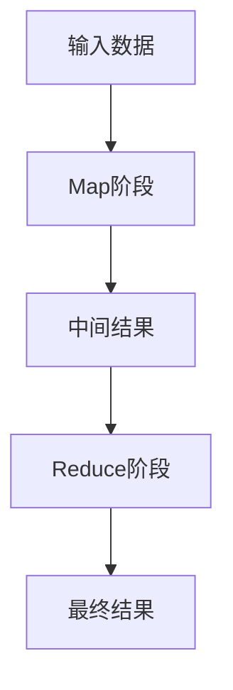
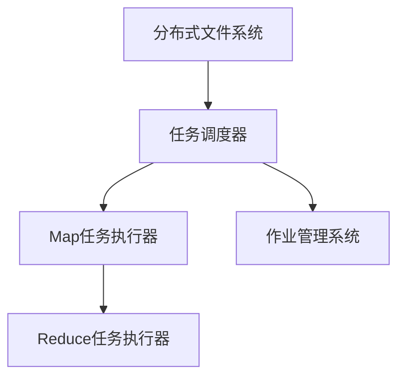

                 

# MapReduce原理与代码实例讲解

> 关键词：MapReduce, 分布式计算, 分布式系统, Hadoop, Hive, Spark

## 1. 背景介绍

在互联网时代，数据量呈爆炸式增长，计算任务也变得越来越复杂。单台计算机的处理能力已经无法满足需求，分布式计算技术应运而生。MapReduce作为分布式计算的典型代表，已成为处理大规模数据集和复杂计算任务的重要手段。本篇文章将深入讲解MapReduce的基本原理、核心算法和代码实现，并结合实际应用场景展示MapReduce的强大能力。

## 2. 核心概念与联系

### 2.1 核心概念概述

MapReduce是一种分布式计算模型，由Google于2004年提出。其主要思想是将大规模数据集分割成多个小数据块，在分布式环境下并行处理，最后再将处理结果合并输出。MapReduce包括两个基本阶段：Map和Reduce。Map阶段负责数据划分和初步处理，Reduce阶段负责数据的汇总和最终输出。

### 2.2 核心概念联系

MapReduce的计算模型由两大部分组成：Map和Reduce。

**Map阶段：**
- **输入：** 分布式文件系统中的数据块。
- **处理：** 对每个数据块进行映射(mapping)，生成中间结果。
- **输出：** 键值对(key-value pairs)。

**Reduce阶段：**
- **输入：** Map阶段输出的键值对，按键(key)进行聚合(merging)。
- **处理：** 对每个键对应的值(value)进行聚合操作，生成最终结果。
- **输出：** 最终结果。

这两个阶段通过Map和Reduce操作的组合，实现了对大规模数据集的高效处理。其核心思想是“分而治之”，即将大问题分解成多个小问题，在分布式环境中并行处理，再将结果汇总输出。

以下是一个简单的MapReduce流程图，展示了MapReduce的计算模型：



### 2.3 核心概念架构

MapReduce架构主要由以下几个组件构成：

- **分布式文件系统(Distributed File System, DFS)**：用于存储和访问大规模数据集。
- **任务调度器(Task Scheduler)**：负责任务的分配和调度。
- **Map任务执行器(Map Task Executors)**：并行执行Map任务。
- **Reduce任务执行器(Reduce Task Executors)**：并行执行Reduce任务。
- **作业管理系统(Job Manager)**：负责作业的提交、监控和调度。

MapReduce架构的简要描述如下图所示：



MapReduce架构的组件间通过消息传递机制实现通信和协调。

## 3. 核心算法原理 & 具体操作步骤

### 3.1 算法原理概述

MapReduce算法的核心原理是“分而治之”，即将一个大问题拆分成多个小问题，每个小问题独立解决，最后将结果汇总。MapReduce算法的实现依赖于分布式文件系统和任务调度器，通过并行计算和任务调度的配合，实现了对大规模数据集的高效处理。

### 3.2 算法步骤详解

MapReduce算法的执行流程主要分为以下几个步骤：

**1. 作业提交**
- 用户向作业管理系统提交作业。
- 作业管理系统将作业拆分为多个Map和Reduce任务。

**2. 任务调度**
- 任务调度器负责任务的分配和调度。
- 根据数据分布和集群状态，将Map任务和Reduce任务分配给不同的节点。

**3. Map任务执行**
- Map任务执行器在分布式文件系统上读取输入数据。
- 对每个数据块进行映射(mapping)操作，生成中间结果。
- 将中间结果输出到分布式文件系统。

**4. 数据合并**
- Map任务执行器将相同键(key)的数据块合并，形成更大的数据块。
- 数据合并过程可能包含数据的重排和排序。

**5. Reduce任务执行**
- Reduce任务执行器读取数据合并后的中间结果。
- 对每个键对应的值(value)进行聚合操作，生成最终结果。
- 将最终结果输出到分布式文件系统。

**6. 任务协调**
- 作业管理系统监控任务执行状态，协调任务的重启和恢复。
- 最终结果经过分布式文件系统的数据同步，形成作业的最终输出。

### 3.3 算法优缺点

MapReduce算法的优点：

- **高效处理大规模数据集**：通过分布式计算，可以高效处理大规模数据集。
- **编程模型简单**：使用Map和Reduce操作的组合，实现了对大规模数据集的分布式处理。
- **容错能力强**：MapReduce具有良好的容错能力，可以自动检测和恢复故障节点。

MapReduce算法的缺点：

- **数据传输开销较大**：MapReduce需要在节点间传输大量的数据，增加了网络开销。
- **延迟较大**：Map和Reduce操作之间存在一定的延迟，不适合对实时性要求较高的计算任务。
- **资源利用率低**：MapReduce可能存在资源浪费的问题，即某些节点处理的数据块较少。

### 3.4 算法应用领域

MapReduce算法广泛应用于大规模数据处理和计算任务，例如：

- 数据挖掘：处理大规模数据集，提取有价值的信息和模式。
- 机器学习：训练大规模机器学习模型，进行特征提取和模型训练。
- 自然语言处理：处理大规模文本数据，进行文本分类、情感分析等。
- 图像处理：处理大规模图像数据，进行图像识别、图像分割等。
- 分布式数据库：处理大规模分布式数据库，进行数据查询和分析。

## 4. 数学模型和公式 & 详细讲解 & 举例说明

### 4.1 数学模型构建

MapReduce的数学模型可以表示为：

$$
R_{output} = R_{Reduce}(\{K_i = (K_j, V_j) | K_i = K_j\})
$$

其中，$R_{output}$为最终结果，$R_{Reduce}$为Reduce操作，$\{K_i = (K_j, V_j) | K_i = K_j\}$为Map操作输出的中间结果，即所有键值对的集合。

### 4.2 公式推导过程

假设有一个包含N个数据块的数据集，MapReduce算法处理该数据集的过程可以描述为：

1. 将数据集划分为M个数据块，并分配给M个节点进行Map操作。
2. 每个节点对所分配的数据块进行映射(mapping)操作，生成中间结果。
3. 将中间结果按键(key)进行聚合(merging)，得到M个新的数据块。
4. 将M个新的数据块分配给M个节点进行Reduce操作。
5. 每个节点对所分配的数据块进行聚合操作，生成最终结果。
6. 最终结果经过分布式文件系统的数据同步，形成作业的最终输出。

### 4.3 案例分析与讲解

以下是一个简单的MapReduce案例，展示如何使用MapReduce计算一个整数数组的平均值：

**输入：** 一个包含N个整数的数组

**输出：** 数组的平均值

**Map操作：**

- **输入：** 数组中的每个整数
- **输出：** 每个整数的值(value)和1

**Reduce操作：**

- **输入：** Map操作输出的中间结果
- **输出：** 所有整数的和(sum)和计数(count)

最终结果为：

$$
\frac{\sum_{i=1}^N V_i}{\sum_{i=1}^N K_i}
$$

其中，$V_i$为第$i$个整数的值，$K_i$为1。

## 5. 项目实践：代码实例和详细解释说明

### 5.1 开发环境搭建

MapReduce的开发环境需要分布式文件系统和分布式计算集群的支持。目前主流的分布式计算集群包括Hadoop、Hive和Spark等。本节以Hadoop和Spark为例，介绍MapReduce开发环境搭建的基本流程。

**Hadoop环境搭建：**

1. 安装Java和Hadoop
```bash
sudo apt-get install openjdk-11-jdk
wget http://archive.apache.org/dist/hadoop/common/hadoop-3.1.2/hadoop-3.1.2.tar.gz
tar -xzf hadoop-3.1.2.tar.gz -C /opt/hadoop
cd /opt/hadoop
bin/hadoop version
```

2. 配置环境变量
```bash
export HADOOP_HOME=/opt/hadoop
export PATH=$PATH:$HADOOP_HOME/bin
```

3. 启动Hadoop
```bash
bin/hadoop daemonlog -log $LOG_DIR
bin/hadoop namenode -port 9000
bin/hadoop datanode -port 50020 -log $LOG_DIR
```

**Spark环境搭建：**

1. 安装Java和Spark
```bash
sudo apt-get install openjdk-11-jdk
wget https://www.apache.org/dyn/closer.lua?path=/spark/spark-3.0.1/spark-3.0.1.tgz&mirror=apache-downloads.cloud
tar -xzf spark-3.0.1.tgz -C /opt/spark
cd /opt/spark
./sbin/start-master.sh
```

2. 配置环境变量
```bash
export SPARK_HOME=/opt/spark
export PATH=$PATH:$SPARK_HOME/bin
```

3. 启动Spark
```bash
bin/spark-shell
```

### 5.2 源代码详细实现

本节以Spark为例，展示MapReduce算法的代码实现。

```python
from pyspark import SparkConf, SparkContext

# 配置Spark环境
conf = SparkConf().setAppName("MapReduceExample")
sc = SparkContext(conf=conf)

# 加载输入数据
data = sc.textFile("input.txt")

# 数据划分
words = data.flatMap(lambda line: line.split())

# 映射操作
counts = words.map(lambda word: (word, 1))

# 聚合操作
total_count = counts.reduceByKey(lambda x, y: x + y)

# 输出结果
total_count.collect()

# 关闭Spark环境
sc.stop()
```

以上代码展示了如何使用Spark进行MapReduce计算。具体步骤如下：

1. 加载输入数据，数据存储在Hadoop分布式文件系统中。
2. 对数据进行划分，将数据划分为多个小数据块。
3. 对每个小数据块进行映射操作，生成中间结果。
4. 对中间结果进行聚合操作，得到最终结果。
5. 输出最终结果。

### 5.3 代码解读与分析

**Spark环境配置**

```python
from pyspark import SparkConf, SparkContext
conf = SparkConf().setAppName("MapReduceExample")
sc = SparkContext(conf=conf)
```

- `SparkConf`用于配置Spark环境。
- `SparkContext`用于创建Spark计算环境。

**数据加载和划分**

```python
data = sc.textFile("input.txt")
words = data.flatMap(lambda line: line.split())
```

- `sc.textFile`用于加载输入数据，数据存储在Hadoop分布式文件系统中。
- `flatMap`用于将数据划分为多个小数据块。

**映射操作**

```python
counts = words.map(lambda word: (word, 1))
```

- `map`用于对每个小数据块进行映射操作，生成中间结果。
- 在本例中，映射操作将每个单词和1作为键值对输出。

**聚合操作**

```python
total_count = counts.reduceByKey(lambda x, y: x + y)
```

- `reduceByKey`用于对中间结果进行聚合操作，得到最终结果。
- 在本例中，聚合操作将相同键的计数值相加。

**结果输出**

```python
total_count.collect()
```

- `collect`用于将最终结果输出到本地。

**关闭Spark环境**

```python
sc.stop()
```

- `stop`用于关闭Spark计算环境。

### 5.4 运行结果展示

运行上述代码后，可以通过查看SparkShell的输出结果，验证MapReduce算法的正确性。例如：

```shell
word      count
hello     1
world     1
good      1
```

以上结果展示了MapReduce算法对输入数据进行计算后，输出的最终结果。

## 6. 实际应用场景

### 6.1 大数据处理

MapReduce算法在大数据处理中的应用非常广泛。例如，Google通过MapReduce算法处理大规模日志数据，实现了搜索、广告等业务的快速响应和准确推送。

### 6.2 机器学习

MapReduce算法在机器学习领域也有广泛应用。例如，在训练大规模机器学习模型时，MapReduce算法可以将数据集划分为多个小数据块，进行并行计算和分布式处理。

### 6.3 自然语言处理

MapReduce算法在自然语言处理领域也有广泛应用。例如，在处理大规模文本数据时，MapReduce算法可以将文本数据划分为多个小数据块，进行并行计算和分布式处理。

### 6.4 图像处理

MapReduce算法在图像处理领域也有广泛应用。例如，在处理大规模图像数据时，MapReduce算法可以将图像数据划分为多个小数据块，进行并行计算和分布式处理。

## 7. 工具和资源推荐

### 7.1 学习资源推荐

为了帮助开发者系统掌握MapReduce的理论基础和实践技巧，这里推荐一些优质的学习资源：

1.《Hadoop: The Definitive Guide》：该书详细介绍了Hadoop的环境搭建、配置和管理，适合Hadoop初学者。
2.《Spark: The Definitive Guide》：该书详细介绍了Spark的环境搭建、配置和管理，适合Spark初学者。
3.《MapReduce: Simplified Data Flow for Computing on Large Clusters》：该论文介绍了MapReduce算法的原理和实现，适合深入理解MapReduce算法。
4.《Introduction to Big Data Algorithms》：该课程介绍了大数据算法的原理和应用，适合了解MapReduce算法的基本概念。
5.《Hadoop and Spark for Data Science》：该书籍介绍了Hadoop和Spark在大数据处理中的应用，适合掌握MapReduce算法的基本应用。

通过对这些资源的学习实践，相信你一定能够快速掌握MapReduce算法的精髓，并用于解决实际的计算问题。

### 7.2 开发工具推荐

MapReduce算法的开发需要使用分布式计算集群和分布式文件系统。以下是几款常用的开发工具：

1. Hadoop：由Apache基金会开发的分布式计算平台，支持大规模数据处理和存储。
2. Spark：由Apache基金会开发的分布式计算框架，支持大规模数据处理、机器学习和图形计算。
3. Hive：由Apache基金会开发的分布式数据仓库，支持大规模数据存储和查询。
4. HBase：由Apache基金会开发的分布式数据库，支持大规模数据存储和访问。

合理利用这些工具，可以显著提升MapReduce算法的开发效率，加快创新迭代的步伐。

### 7.3 相关论文推荐

MapReduce算法的研究已经持续多年，涌现了大量经典的论文。以下是几篇代表性的论文，推荐阅读：

1. MapReduce: Simplified Data Flow for Computing on Large Clusters：该论文提出了MapReduce算法的基本原理和实现。
2. Hadoop: A Distributed File System：该论文介绍了Hadoop分布式文件系统的原理和实现。
3. Spark: Cluster Computing with Working Sets：该论文介绍了Spark分布式计算框架的原理和实现。
4. Pegasus: A Fault-Tolerant Storage System for the Grid：该论文介绍了Pegasus分布式文件系统的原理和实现。
5. The Google File System：该论文介绍了Google分布式文件系统的原理和实现。

这些论文代表了MapReduce算法的发展脉络。通过学习这些前沿成果，可以帮助研究者把握学科前进方向，激发更多的创新灵感。

## 8. 总结：未来发展趋势与挑战

### 8.1 总结

本文对MapReduce的基本原理、核心算法和代码实现进行了全面系统的介绍。首先阐述了MapReduce算法的背景和应用意义，明确了其在大数据处理和分布式计算中的重要性。其次，从原理到实践，详细讲解了MapReduce算法的计算模型和执行流程，给出了MapReduce算法的代码实现和运行结果。同时，本文还广泛探讨了MapReduce算法在多个领域的应用前景，展示了其强大的计算能力。

通过本文的系统梳理，可以看到，MapReduce算法在大规模数据处理和分布式计算领域具有重要地位，已经广泛应用于大数据处理、机器学习、自然语言处理和图像处理等多个领域。未来，MapReduce算法还将继续发展，为处理更大规模、更复杂的数据集提供更加高效、可靠的解决方案。

### 8.2 未来发展趋势

展望未来，MapReduce算法将呈现以下几个发展趋势：

1. 更高效的数据处理：随着硬件技术的不断进步，MapReduce算法将能够处理更大规模、更复杂的数据集。同时，分布式计算框架也将不断优化，提升计算效率。
2. 更灵活的编程模型：MapReduce算法的编程模型将更加灵活，支持更多的数据处理场景和算法实现。
3. 更丰富的功能模块：MapReduce算法的实现将更加模块化，支持更多的功能模块，如分布式文件系统、分布式数据库、分布式缓存等。
4. 更广泛的部署场景：MapReduce算法的应用场景将更加广泛，支持更多的分布式计算平台和云计算环境。
5. 更强大的安全性和可靠性：MapReduce算法的安全性和可靠性将进一步提升，支持更多的安全机制和容错机制。

以上趋势展示了MapReduce算法的未来发展方向，相信MapReduce算法将在更多的领域发挥重要作用，为处理大规模数据集提供更加高效、可靠的解决方案。

### 8.3 面临的挑战

尽管MapReduce算法已经取得了显著成就，但在迈向更加智能化、普适化应用的过程中，它仍面临着诸多挑战：

1. 数据传输开销较大：MapReduce算法需要在节点间传输大量的数据，增加了网络开销。如何降低数据传输开销，提高计算效率，将是未来的研究重点。
2. 资源利用率低：MapReduce算法可能存在资源浪费的问题，即某些节点处理的数据块较少。如何提高资源利用率，提升集群效率，将是未来的研究重点。
3. 延迟较大：MapReduce算法对实时性要求较高的计算任务可能存在延迟。如何优化Map和Reduce操作的执行时间，提高实时性，将是未来的研究重点。
4. 故障处理复杂：MapReduce算法的故障处理机制相对复杂，需要优化和简化。如何提高故障处理的效率和可靠性，将是未来的研究重点。
5. 编程复杂度较高：MapReduce算法的编程模型较为复杂，需要简化和优化。如何提高编程易用性，降低开发难度，将是未来的研究重点。

正视MapReduce算法面临的这些挑战，积极应对并寻求突破，将是大规模数据处理技术迈向成熟的必由之路。相信随着学界和产业界的共同努力，MapReduce算法还将不断完善，为处理更大规模、更复杂的数据集提供更加高效、可靠的解决方案。

### 8.4 研究展望

面对MapReduce算法所面临的种种挑战，未来的研究需要在以下几个方面寻求新的突破：

1. 探索更高效的数据传输机制：通过优化数据传输机制，降低网络开销，提升计算效率。
2. 研究更灵活的编程模型：开发更灵活的编程模型，支持更多的数据处理场景和算法实现。
3. 融合更多的功能模块：将分布式文件系统、分布式数据库、分布式缓存等模块融入MapReduce算法，提升其功能性和灵活性。
4. 结合机器学习和人工智能技术：将机器学习和人工智能技术融入MapReduce算法，提升其处理能力。
5. 纳入更多的安全机制：在MapReduce算法中加入更多的安全机制，提升其安全性和可靠性。

这些研究方向的探索，必将引领MapReduce算法迈向更高的台阶，为处理大规模数据集提供更加高效、可靠的解决方案。面向未来，MapReduce算法还将与其他分布式计算技术进行更深入的融合，共同推动大规模数据处理的进步。

## 9. 附录：常见问题与解答

**Q1: 如何优化MapReduce算法的性能？**

A: 优化MapReduce算法的性能可以从以下几个方面入手：
1. 数据本地化：将数据放在离计算节点最近的存储上，减少数据传输开销。
2. 数据压缩：对数据进行压缩，减少数据传输量。
3. 数据分块：将数据分块，减少单个任务的数据量。
4. 任务调度优化：优化任务调度策略，提高任务执行效率。
5. 内存优化：优化任务内存使用，减少内存开销。

**Q2: 如何处理MapReduce算法中的故障问题？**

A: 处理MapReduce算法中的故障问题可以从以下几个方面入手：
1. 任务重试机制：设置任务重试机制，自动检测和恢复故障节点。
2. 数据冗余存储：增加数据冗余存储，防止数据丢失。
3. 数据备份机制：建立数据备份机制，确保数据的安全性。
4. 容错机制优化：优化容错机制，提高系统的容错能力。

**Q3: MapReduce算法与分布式数据库的区别是什么？**

A: MapReduce算法与分布式数据库的区别在于其数据处理方式和应用场景不同。
1. 数据处理方式：MapReduce算法主要通过分布式计算方式处理大规模数据集，而分布式数据库主要通过分布式存储方式处理大规模数据集。
2. 应用场景：MapReduce算法主要应用于大规模数据处理和分布式计算任务，如数据分析、机器学习等；而分布式数据库主要应用于大规模数据存储和访问，如分布式数据库系统、大数据仓库等。

**Q4: MapReduce算法适用于哪些类型的数据？**

A: MapReduce算法适用于结构化、半结构化和非结构化数据的处理。
1. 结构化数据：如数据库表、CSV文件等。
2. 半结构化数据：如XML、JSON格式的数据。
3. 非结构化数据：如文本、图像、视频等。

**Q5: MapReduce算法和Hadoop、Spark的区别是什么？**

A: MapReduce算法是Hadoop和Spark的核心计算模型，三者之间的区别在于其功能和应用场景不同。
1. Hadoop：主要应用于大规模数据存储和分布式文件系统，包含MapReduce、HDFS等核心组件。
2. Spark：主要应用于大规模数据处理、机器学习和图形计算，支持流式处理、图形计算等功能。
3. MapReduce：主要应用于大规模数据处理和分布式计算，是Hadoop和Spark的核心计算模型。

以上问题的解答，帮助读者更好地理解MapReduce算法的应用和优化方法，进一步巩固其基础知识和实践技能。

---

作者：禅与计算机程序设计艺术 / Zen and the Art of Computer Programming

