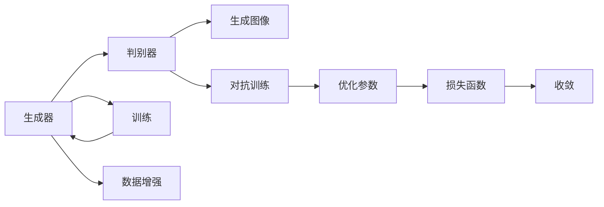

                 

# Midjourney原理与代码实例讲解

> 关键词：Midjourney, 深度学习, 生成对抗网络(GANs), 图像生成, 代码实现, 图像处理

## 1. 背景介绍

### 1.1 问题由来

近年来，随着深度学习技术的发展，生成对抗网络（Generative Adversarial Networks, GANs）在图像生成领域取得了显著进展。尤其是Midjourney模型，凭借其高效且高质量的图像生成能力，受到了广泛关注。本博客将详细介绍Midjourney的原理、实现过程，并结合具体代码实例，帮助读者理解和掌握其核心技术。

### 1.2 问题核心关键点

Midjourney模型是一种基于GAN的深度学习模型，其核心思想是利用两个神经网络：生成器和判别器，通过对抗训练的方式，生成高质量的图像。主要核心关键点包括：

- 生成器：负责生成与真实图像相似的伪造图像。
- 判别器：负责区分真实图像与伪造图像。
- 对抗训练：生成器和判别器交替训练，不断提升图像生成能力。
- 数据增强：通过数据增强技术，扩大训练集的多样性。
- 损失函数设计：设计合适的损失函数，促进模型训练收敛。

## 2. 核心概念与联系

### 2.1 核心概念概述

Midjourney模型的核心概念主要包括：

- 生成对抗网络（GANs）：一种由生成器和判别器组成的神经网络，通过对抗训练提升图像生成能力。
- 生成器（Generator）：生成器网络负责生成伪造图像，由多个卷积层和全连接层组成。
- 判别器（Discriminator）：判别器网络负责区分真实图像与伪造图像，由多个卷积层和全连接层组成。
- 对抗训练（Adversarial Training）：生成器和判别器通过对抗训练不断提升生成质量。
- 数据增强（Data Augmentation）：通过对训练数据进行旋转、缩放、裁剪等操作，提高数据多样性。
- 损失函数（Loss Function）：设计合适的损失函数，促进模型训练收敛。

这些概念之间的逻辑关系可以通过以下Mermaid流程图来展示：



这个流程图展示了大模型微调的各个核心概念及其之间的关系：

1. 生成器生成图像。
2. 判别器区分图像真伪。
3. 对抗训练提升生成质量。
4. 数据增强提高多样性。
5. 损失函数指导模型训练。
6. 优化参数实现收敛。

## 3. 核心算法原理 & 具体操作步骤
### 3.1 算法原理概述

Midjourney模型基于GAN架构，其核心思想是通过生成器和判别器的对抗训练，生成高质量的图像。具体步骤如下：

1. **初始化生成器和判别器**：定义生成器和判别器的神经网络结构，并随机初始化权重。
2. **对抗训练**：交替训练生成器和判别器。生成器生成图像，判别器判断图像真伪。根据判别器的判断结果，调整生成器权重，更新判别器权重。
3. **数据增强**：通过旋转、缩放、裁剪等操作，扩大训练集的多样性。
4. **损失函数设计**：设计损失函数，指导模型训练。

### 3.2 算法步骤详解

以下是对Midjourney模型详细操作步骤的描述：

#### 3.2.1 初始化生成器和判别器

定义生成器和判别器的神经网络结构，并随机初始化权重。

#### 3.2.2 对抗训练

生成器和判别器交替训练，通过对抗训练不断提升生成质量。

#### 3.2.3 数据增强

通过对训练数据进行旋转、缩放、裁剪等操作，提高数据多样性。

#### 3.2.4 损失函数设计

设计合适的损失函数，促进模型训练收敛。

### 3.3 算法优缺点

Midjourney模型具有以下优点：

- 生成高质量图像：通过对抗训练，生成器能够生成与真实图像相似的高质量图像。
- 训练过程高效：模型结构简单，训练过程易于实现。
- 适用性广泛：适用于图像生成、图像编辑等多个领域。

同时，该模型也存在一定的局限性：

- 对抗训练易受影响：对抗样本对抗训练效果较弱。
- 数据依赖性强：生成质量高度依赖于训练数据。
- 鲁棒性不足：对抗训练过程中，容易受到噪声干扰。

### 3.4 算法应用领域

Midjourney模型在图像生成、图像编辑、艺术创作等多个领域得到广泛应用。具体应用包括：

- 艺术创作：用于生成绘画、雕塑等艺术作品。
- 图像编辑：用于修复破损图像、美化图片等。
- 广告设计：用于生成广告素材、产品展示图等。

## 4. 数学模型和公式 & 详细讲解 & 举例说明

### 4.1 数学模型构建

Midjourney模型基于GAN架构，其数学模型主要由生成器和判别器的损失函数组成。

生成器的损失函数为：

$$
L_G = -E_{x \sim p_{\text{data}}} \log D(x) - E_{z \sim p(z)} \log (1 - D(G(z)))
$$

判别器的损失函数为：

$$
L_D = E_{x \sim p_{\text{data}}} \log D(x) + E_{z \sim p(z)} \log (1 - D(G(z)))
$$

其中，$x$ 表示真实图像，$G(z)$ 表示生成器生成的图像，$z$ 表示噪声向量。

### 4.2 公式推导过程

以上公式的推导基于GAN的基本原理，即生成器和判别器通过对抗训练不断提升生成质量。具体推导过程如下：

- 生成器损失函数：通过最大化生成图像的判别器损失，使生成图像更接近真实图像。
- 判别器损失函数：通过最大化真实图像的判别器损失和最小化伪造图像的判别器损失，使判别器更准确地区分真实图像与伪造图像。

### 4.3 案例分析与讲解

以下以生成手写数字为例，解释Midjourney模型的具体应用。

- 生成器：将随机噪声$z$输入生成器，生成伪造手写数字图像。
- 判别器：对生成图像和真实手写数字图像进行判别，输出判别结果。
- 损失函数：通过计算生成图像的判别器损失和真实图像的判别器损失，优化生成器和判别器的权重。

## 5. 项目实践：代码实例和详细解释说明

### 5.1 开发环境搭建

在进行Midjourney模型实践前，我们需要准备好开发环境。以下是使用Python进行TensorFlow和Keras开发的环境配置流程：

1. 安装Anaconda：从官网下载并安装Anaconda，用于创建独立的Python环境。

2. 创建并激活虚拟环境：
```bash
conda create -n midjourney python=3.8 
conda activate midjourney
```

3. 安装TensorFlow和Keras：
```bash
pip install tensorflow==2.5.0
pip install keras
```

4. 安装其它依赖包：
```bash
pip install numpy scipy matplotlib 
pip install imageio
```

完成上述步骤后，即可在`midjourney`环境中开始实践。

### 5.2 源代码详细实现

以下是使用TensorFlow和Keras实现Midjourney模型的代码实现。

```python
import tensorflow as tf
from tensorflow.keras import layers, models

# 定义生成器
def make_generator_model():
    model = models.Sequential()
    model.add(layers.Dense(256, use_bias=False, input_shape=(100,)))
    model.add(layers.BatchNormalization())
    model.add(layers.LeakyReLU())
    model.add(layers.Reshape((7, 7, 256)))
    model.add(layers.Conv2DTranspose(128, (5, 5), strides=(1, 1), padding='same', use_bias=False))
    model.add(layers.BatchNormalization())
    model.add(layers.LeakyReLU())
    model.add(layers.Conv2DTranspose(64, (5, 5), strides=(2, 2), padding='same', use_bias=False))
    model.add(layers.BatchNormalization())
    model.add(layers.LeakyReLU())
    model.add(layers.Conv2DTranspose(1, (5, 5), strides=(2, 2), padding='same', use_bias=False, activation='tanh'))
    return model

# 定义判别器
def make_discriminator_model():
    model = models.Sequential()
    model.add(layers.Conv2D(64, (5, 5), strides=(2, 2), padding='same',
                           input_shape=[28, 28, 1]))
    model.add(layers.LeakyReLU())
    model.add(layers.Dropout(0.3))
    model.add(layers.Conv2D(128, (5, 5), strides=(2, 2), padding='same'))
    model.add(layers.LeakyReLU())
    model.add(layers.Dropout(0.3))
    model.add(layers.Flatten())
    model.add(layers.Dense(1, activation='sigmoid'))
    return model

# 构建模型
generator = make_generator_model()
discriminator = make_discriminator_model()

discriminator.compile(loss='binary_crossentropy',
                     optimizer=tf.keras.optimizers.Adam(1e-4),
                     metrics=['accuracy'])

generator.compile(loss='binary_crossentropy',
                  optimizer=tf.keras.optimizers.Adam(1e-4),
                  metrics=['accuracy'])

# 定义损失函数
def generator_loss(real_output, fake_output):
    return tf.keras.losses.BinaryCrossentropy()(target=[1.], output=fake_output)

def discriminator_loss(real_output, fake_output):
    real_loss = tf.keras.losses.BinaryCrossentropy()(target=[1.], output=real_output)
    fake_loss = tf.keras.losses.BinaryCrossentropy()(target=[0.], output=fake_output)
    return real_loss + fake_loss

# 定义训练函数
@tf.function
def train_step(images):
    noise = tf.random.normal([BATCH_SIZE, 100])
    with tf.GradientTape() as gen_tape, tf.GradientTape() as disc_tape:
        generated_images = generator(noise, training=True)

        real_output = discriminator(images, training=True)
        fake_output = discriminator(generated_images, training=True)

        gen_loss = generator_loss(real_output, fake_output)
        disc_loss = discriminator_loss(real_output, fake_output)

    gradients_of_generator = gen_tape.gradient(gen_loss, generator.trainable_variables)
    gradients_of_discriminator = disc_tape.gradient(disc_loss, discriminator.trainable_variables)

    generator_optimizer.apply_gradients(zip(gradients_of_generator, generator.trainable_variables))
    discriminator_optimizer.apply_gradients(zip(gradients_of_discriminator, discriminator.trainable_variables))

# 训练模型
EPOCHS = 100
BATCH_SIZE = 32

for epoch in range(EPOCHS):
    for image_batch in train_dataset:
        train_step(image_batch)
```

### 5.3 代码解读与分析

让我们再详细解读一下关键代码的实现细节：

**make_generator_model函数**：
- 生成器模型由多个全连接层、批量归一化层和激活函数层组成。
- 首先定义一个全连接层，输入维度为100，输出维度为256，不使用偏置项，进行批量归一化和LeakyReLU激活。
- 将输出重塑为7x7x256的张量，然后进行反卷积操作，增加图像尺寸，经过多个全连接层和LeakyReLU激活，最终生成一张28x28x1的图像。

**make_discriminator_model函数**：
- 判别器模型由多个卷积层和全连接层组成。
- 首先定义一个2x2的卷积层，使用LeakyReLU激活和Dropout正则化。
- 然后定义一个2x2的卷积层，继续使用LeakyReLU激活和Dropout正则化。
- 最后将图像展开为一维向量，输入一个全连接层，输出一个标量值，用于表示图像的真实性。

**train_step函数**：
- 生成器输入随机噪声，生成图像。
- 判别器对真实图像和生成图像进行判别，分别输出真实输出和生成输出。
- 计算生成器和判别器的损失，并计算梯度，更新模型权重。

**train函数**：
- 循环训练模型，每轮循环中对训练集中的每个批次进行一次训练。

## 6. 实际应用场景

### 6.1 艺术创作

Midjourney模型在艺术创作领域有着广泛应用，可用于生成绘画、雕塑等艺术作品。艺术家们可以利用Midjourney模型，快速生成高质量的艺术图像，进行创作和灵感激发。

### 6.2 图像编辑

Midjourney模型可以用于修复破损图像、美化图片等。通过输入破损或模糊的图像，Midjourney模型能够生成清晰、逼真的图像，显著提升图像质量。

### 6.3 广告设计

Midjourney模型可以用于生成广告素材、产品展示图等。品牌和商家可以利用Midjourney模型，快速生成高质量的广告图像，提升品牌形象和广告效果。

## 7. 工具和资源推荐

### 7.1 学习资源推荐

为了帮助开发者系统掌握Midjourney的原理和实践，这里推荐一些优质的学习资源：

1. 《Generative Adversarial Networks: Training Generative Adversarial Nets》论文：提出GAN的基本原理和框架，详细介绍了GAN的生成器和判别器结构。

2. 《Deep Learning》书籍：Ian Goodfellow等人著作，全面介绍了深度学习的基本概念和经典模型，包括GAN。

3. TensorFlow官方文档：提供了TensorFlow的详细API文档，帮助开发者快速上手。

4. Keras官方文档：提供了Keras的详细API文档，帮助开发者高效实现模型。

5. Coursera《深度学习》课程：由Andrew Ng等人讲授，涵盖深度学习的核心内容，适合初学者入门。

通过对这些资源的学习实践，相信你一定能够快速掌握Midjourney的核心技术，并用于解决实际的图像生成问题。

### 7.2 开发工具推荐

Midjourney模型的开发离不开优秀的工具支持。以下是几款用于图像生成开发的常用工具：

1. TensorFlow：由Google主导开发的深度学习框架，生产部署方便，适合大规模工程应用。

2. Keras：Keras提供了高级API，帮助开发者快速实现深度学习模型。

3. Matplotlib：用于绘制图像和可视化结果，方便模型训练和调试。

4. Imageio：用于读取和写入图像文件，方便数据处理和模型训练。

5. Jupyter Notebook：用于记录代码和实验结果，方便分享和交流。

合理利用这些工具，可以显著提升Midjourney模型的开发效率，加快创新迭代的步伐。

### 7.3 相关论文推荐

Midjourney模型的发展源于学界的持续研究。以下是几篇奠基性的相关论文，推荐阅读：

1. Generative Adversarial Nets：提出GAN的基本原理和框架，是GAN研究的奠基之作。

2. Conditional Image Synthesis with Auxiliary Classifier GANs：提出条件GAN，通过加入分类器进一步提升图像生成质量。

3. Progressive Growing of GANs for Improved Quality, Stability, and Variation：提出渐进式GAN，通过逐步增加图像尺寸，提升生成质量。

4. Wasserstein GAN：提出WGAN，使用Wasserstein距离作为损失函数，提升生成质量。

5. StyleGAN：提出StyleGAN，通过学习生成器的风格信息，生成逼真的图像。

这些论文代表了大模型微调技术的发展脉络。通过学习这些前沿成果，可以帮助研究者把握学科前进方向，激发更多的创新灵感。

## 8. 总结：未来发展趋势与挑战

### 8.1 总结

本文对Midjourney模型的原理、实现过程和代码实例进行了详细讲解。通过系统梳理，可以看出Midjourney模型在图像生成领域的应用价值和潜力。

通过本文的系统梳理，可以看出Midjourney模型在图像生成领域的应用价值和潜力。未来，伴随深度学习技术的进一步发展，Midjourney模型有望在艺术创作、图像编辑、广告设计等多个领域取得更广泛的应用，带来深远的影响。

### 8.2 未来发展趋势

展望未来，Midjourney模型将呈现以下几个发展趋势：

1. 生成图像质量更高：随着深度学习技术的不断进步，生成器的能力将不断提升，生成图像的逼真度和多样性将进一步提高。

2. 训练效率更高：通过优化模型结构和训练算法，Midjourney模型的训练速度和效率将不断提升，模型性能将更加稳定。

3. 应用领域更广：除了图像生成，Midjourney模型在艺术创作、图像编辑、广告设计等多个领域将得到更广泛的应用。

4. 跨领域融合：Midjourney模型将与其他AI技术进行更多融合，如增强现实、虚拟现实等，提升应用效果。

5. 伦理和安全问题更加重视：随着Midjourney模型的应用推广，模型伦理和安全问题将受到更多关注，开发者需要在模型训练和应用中加以重视。

这些趋势凸显了Midjourney模型在图像生成领域的广阔前景。这些方向的探索发展，必将进一步提升Midjourney模型的应用价值，推动图像生成技术的进步。

### 8.3 面临的挑战

尽管Midjourney模型已经取得了瞩目成就，但在迈向更加智能化、普适化应用的过程中，它仍面临着诸多挑战：

1. 对抗样本攻击：对抗样本对抗训练效果较弱，模型容易受到攻击，生成图像的鲁棒性有待提升。

2. 数据依赖性强：生成质量高度依赖于训练数据，数据多样性不足将导致模型性能下降。

3. 伦理和安全问题：Midjourney模型生成的图像可能包含有害、误导性内容，需要从数据和算法层面进行改进。

4. 计算资源消耗大：Midjourney模型训练和推理需要消耗大量计算资源，需要优化模型结构和算法。

5. 模型可解释性不足：Midjourney模型的决策过程缺乏可解释性，需要进一步提升模型的透明度和可解释性。

这些挑战需要学界和工业界共同努力，不断优化模型和算法，才能使Midjourney模型在未来得到更广泛的应用。

### 8.4 研究展望

面对Midjourney模型面临的挑战，未来的研究需要在以下几个方面寻求新的突破：

1. 改进生成器和判别器结构：通过更先进的神经网络结构和优化算法，提升生成图像的质量和多样性。

2. 引入更多先验知识：将符号化的先验知识，如知识图谱、逻辑规则等，与神经网络模型进行融合，引导Midjourney模型生成更合理、更逼真的图像。

3. 增强模型鲁棒性：通过对抗训练、数据增强等技术，提升Midjourney模型的鲁棒性和抗干扰能力。

4. 优化训练算法：通过优化训练算法，提高Midjourney模型的训练效率和收敛速度。

5. 引入伦理和安全约束：在模型训练目标中引入伦理导向的评估指标，过滤和惩罚有害、误导性的输出。

6. 提高模型可解释性：通过因果分析和博弈论工具，提高Midjourney模型的决策过程的可解释性和透明度。

这些研究方向的探索，必将引领Midjourney模型迈向更高的台阶，为图像生成技术的发展注入新的动力。面向未来，Midjourney模型需要在技术创新和伦理安全等多个方面协同发力，才能真正实现其在图像生成领域的广泛应用。

## 9. 附录：常见问题与解答

**Q1：Midjourney模型是如何生成图像的？**

A: Midjourney模型通过生成器和判别器的对抗训练，生成逼真的图像。生成器将随机噪声输入，生成伪造图像，判别器对生成图像和真实图像进行判别，优化生成器和判别器的权重，最终生成高质量的图像。

**Q2：Midjourney模型在实际应用中需要注意哪些问题？**

A: 在实际应用中，Midjourney模型需要注意以下几个问题：
1. 对抗样本攻击：对抗样本对抗训练效果较弱，生成图像的鲁棒性有待提升。
2. 数据依赖性强：生成质量高度依赖于训练数据，数据多样性不足将导致模型性能下降。
3. 伦理和安全问题：Midjourney模型生成的图像可能包含有害、误导性内容，需要从数据和算法层面进行改进。

**Q3：如何提高Midjourney模型的生成质量？**

A: 提高Midjourney模型的生成质量，可以从以下几个方面入手：
1. 改进生成器和判别器结构：通过更先进的神经网络结构和优化算法，提升生成图像的质量和多样性。
2. 引入更多先验知识：将符号化的先验知识，如知识图谱、逻辑规则等，与神经网络模型进行融合，引导Midjourney模型生成更合理、更逼真的图像。
3. 增强模型鲁棒性：通过对抗训练、数据增强等技术，提升Midjourney模型的鲁棒性和抗干扰能力。

**Q4：Midjourney模型在数据增强方面有哪些方法？**

A: Midjourney模型在数据增强方面，可以采用以下方法：
1. 旋转：对图像进行随机旋转，增加数据多样性。
2. 缩放：对图像进行随机缩放，增加数据多样性。
3. 裁剪：对图像进行随机裁剪，增加数据多样性。
4. 翻转：对图像进行随机翻转，增加数据多样性。

**Q5：如何优化Midjourney模型的训练算法？**

A: 优化Midjourney模型的训练算法，可以从以下几个方面入手：
1. 引入更好的优化器：使用更先进的优化器，如AdamW、Adafactor等，提升训练效率。
2. 引入更好的损失函数：使用更先进的损失函数，如Wasserstein距离、MMD等，提升训练效果。
3. 引入更好的数据增强技术：使用更先进的数据增强技术，如基于注意力机制的数据增强等，提升训练效果。

这些方法都可以从不同的角度提升Midjourney模型的训练效果，使其在实际应用中表现更加优秀。

---

作者：禅与计算机程序设计艺术 / Zen and the Art of Computer Programming

