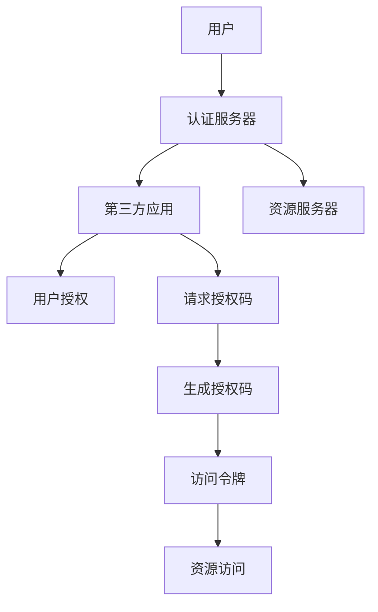

                 

## 1. 背景介绍

### 1.1 问题由来
在现代互联网应用中，用户往往需要在多个应用间进行身份认证和资源访问。例如，用户需要使用银行账户登录电商平台，或者使用社交账号访问企业内部系统。为了确保用户的身份安全和隐私，OAuth 2.0成为目前最广泛使用的身份认证和授权协议之一。OAuth 2.0通过授权第三方应用访问用户资源，而不是直接传递用户密码，从而实现了更安全和灵活的身份认证和授权方式。

### 1.2 问题核心关键点
OAuth 2.0的核心在于其授权流，主要包含以下步骤：
1. 用户授权：用户向认证服务器请求授权。
2. 授权码获取：认证服务器生成授权码，并向第三方应用提供该码。
3. 访问令牌获取：第三方应用使用授权码向认证服务器请求访问令牌。
4. 资源访问：第三方应用使用访问令牌访问用户资源。

OAuth 2.0的授权流虽然简洁，但实现复杂，涉及多个实体和环节。如何确保授权流的安全性和可靠性，如何在不同应用间集成OAuth 2.0，成为当前开发者面临的挑战。

## 2. 核心概念与联系

### 2.1 核心概念概述

为更好地理解OAuth 2.0的跨应用集成，本节将介绍几个密切相关的核心概念：

- OAuth 2.0：由IETF定义的身份认证和授权协议，主要通过授权码、访问令牌和刷新令牌等机制，实现用户资源的安全访问。
- 授权码模式（Authorization Code Flow）：OAuth 2.0最基本和常见的授权流，适用于Web和移动应用。
- 隐式模式（Implicit Flow）：适用于部分Web应用，允许第三方应用直接获取访问令牌，无需用户授权确认。
- 客户端模式（Client Credentials Flow）：适用于服务到服务之间的授权，无须用户直接参与。
- 刷新令牌（Refresh Token）：用于获取新的访问令牌，延长授权流的使用寿命。

这些核心概念之间的逻辑关系可以通过以下Mermaid流程图来展示：



这个流程图展示了一个典型的OAuth 2.0授权流程：

1. 用户向认证服务器请求授权。
2. 认证服务器生成授权码，并向第三方应用提供该码。
3. 第三方应用使用授权码向认证服务器请求访问令牌。
4. 认证服务器生成访问令牌，并返回给第三方应用。
5. 第三方应用使用访问令牌访问用户资源。

## 3. 核心算法原理 & 具体操作步骤
### 3.1 算法原理概述

OAuth 2.0的跨应用集成主要基于授权流和令牌机制，通过认证服务器和资源服务器之间的通信，完成授权请求和资源访问。

在OAuth 2.0的授权流中，用户授权、获取授权码、请求访问令牌和资源访问等步骤构成了完整的授权过程。认证服务器和资源服务器在授权过程中分别负责验证用户身份和提供用户资源，而第三方应用则通过认证服务器获取访问令牌，最终访问用户资源。

### 3.2 算法步骤详解

OAuth 2.0的授权流主要包含以下步骤：

**Step 1: 用户授权**

用户通过第三方应用访问资源服务器时，首先需要向认证服务器请求授权。用户授权请求通常包括以下参数：

- client_id：第三方应用的客户端ID。
- redirect_uri：第三方应用的重定向URI。
- scope：第三方应用请求访问的资源范围。

用户授权请求通过HTTP GET请求发送到认证服务器，认证服务器会展示一个授权页面，要求用户确认授权请求，并输入用户名和密码。用户授权请求的示例如下：

```http
GET /authorize?response_type=code&client_id=1234&redirect_uri=https%3A%2F%2Fexample.com%2Fcallback&scope=read%20write HTTP/1.1
Host: oauth.example.com
```

**Step 2: 授权码获取**

用户授权后，认证服务器会生成一个授权码，并通过重定向URI返回给第三方应用。授权码通常是随机生成的字符串，具有短暂有效性和单次使用性，一般有效期为10分钟。

授权码获取的流程如下：

1. 认证服务器生成一个随机的授权码。
2. 认证服务器向第三方应用返回授权码和重定向URI。
3. 第三方应用使用授权码向认证服务器请求访问令牌。

授权码获取的示例如下：

```http
HTTP/1.1 302 Found
Location: https://example.com/callback?code=abcd1234&state=123456
```

**Step 3: 访问令牌获取**

第三方应用使用授权码向认证服务器请求访问令牌。访问令牌是一个加密的字符串，用于在后续的资源访问中认证第三方应用。

访问令牌获取的流程如下：

1. 第三方应用使用授权码向认证服务器发送HTTP POST请求，请求访问令牌。
2. 认证服务器验证授权码，并向第三方应用返回访问令牌和刷新令牌。

访问令牌获取的示例如下：

```http
POST /oauth/token HTTP/1.1
Content-Type: application/x-www-form-urlencoded
Host: oauth.example.com

code=abcd1234&client_id=1234&client_secret=secret&redirect_uri=https%3A%2F%2Fexample.com%2Fcallback&grant_type=authorization_code
```

**Step 4: 资源访问**

第三方应用使用访问令牌访问用户资源。资源访问通常通过HTTP请求实现，请求头中包含访问令牌，用于验证第三方应用的身份和权限。

资源访问的示例如下：

```http
GET /api/resource HTTP/1.1
Host: resource.example.com
Authorization: Bearer <access_token>
```

### 3.3 算法优缺点

OAuth 2.0的授权流具有以下优点：

1. 安全性高：用户身份和资源访问独立于第三方应用，通过认证服务器验证，降低了身份泄露和资源滥用的风险。
2. 灵活性高：支持多种授权流和令牌机制，适用于不同场景的应用集成。
3. 可扩展性高：认证服务器和资源服务器可以独立部署，支持分布式和微服务架构。

OAuth 2.0的授权流也存在一些缺点：

1. 复杂度高：授权流涉及多个环节和实体，实现复杂，需要开发者具备一定的安全知识和编码能力。
2. 性能开销大：授权码和令牌的生成、验证和存储都需要消耗资源，可能影响系统性能。
3. 依赖认证服务器：第三方应用依赖认证服务器的稳定性和安全性，一旦认证服务器出现故障，授权流将无法正常进行。

### 3.4 算法应用领域

OAuth 2.0的授权流被广泛应用于各种身份认证和授权场景，如Web应用、移动应用、云服务、IoT设备等。以下列举几个典型的应用场景：

- 社交登录：用户使用社交账号登录第三方应用，例如Facebook、Google等。
- 企业身份管理：员工使用企业账号登录内部系统，例如Office 365、Salesforce等。
- 金融服务：用户使用银行账号登录电商平台，例如Amazon、Alipay等。
- 在线教育：学生使用学校账号登录在线教育平台，例如Coursera、edX等。

## 4. 数学模型和公式 & 详细讲解
### 4.1 数学模型构建

OAuth 2.0的授权流主要基于HTTP协议，通过HTTP请求和响应完成授权和资源访问。以下通过数学模型对授权流进行建模：

**授权码模式**：

假设用户请求第三方应用访问用户资源，第三方应用使用授权码获取访问令牌，具体流程如下：

1. 用户授权：用户向认证服务器请求授权，认证服务器展示授权页面，用户输入用户名和密码，认证服务器验证用户身份。
2. 授权码生成：认证服务器生成一个随机的授权码，并将该码返回给第三方应用。
3. 访问令牌请求：第三方应用使用授权码向认证服务器请求访问令牌，认证服务器验证授权码，并生成访问令牌。
4. 资源访问：第三方应用使用访问令牌访问用户资源。

**数学模型**：

令 $T$ 表示认证服务器，$A$ 表示第三方应用，$R$ 表示资源服务器。授权码模式可以表示为：

$$
(A, T) \rightarrow R \rightarrow T \rightarrow A
$$

其中，$(A, T) \rightarrow R$ 表示用户授权第三方应用访问资源，$T \rightarrow A$ 表示认证服务器生成授权码，$T \rightarrow R$ 表示认证服务器生成访问令牌，$A \rightarrow R$ 表示第三方应用访问用户资源。

### 4.2 公式推导过程

以下以授权码模式为例，推导OAuth 2.0授权流中的主要公式：

**授权码生成公式**：

授权码生成公式为：

$$
Code = random()
$$

其中 $Code$ 表示授权码，$random()$ 表示生成随机字符串函数。

**访问令牌请求公式**：

访问令牌请求公式为：

$$
Token = generateToken(Code)
$$

其中 $Token$ 表示访问令牌，$generateToken()$ 表示生成访问令牌的函数。

**资源访问公式**：

资源访问公式为：

$$
Access = useToken(Token)
$$

其中 $Access$ 表示访问用户资源，$useToken()$ 表示使用访问令牌访问资源的函数。

### 4.3 案例分析与讲解

假设某银行作为资源服务器，用户通过第三方应用访问银行账户。具体流程如下：

1. 用户授权：用户输入用户名和密码，向认证服务器请求授权，认证服务器展示授权页面。
2. 授权码生成：认证服务器生成一个随机的授权码，并将该码返回给第三方应用。
3. 访问令牌请求：第三方应用使用授权码向认证服务器请求访问令牌，认证服务器验证授权码，并生成访问令牌。
4. 资源访问：第三方应用使用访问令牌访问银行账户。

## 5. 项目实践：代码实例和详细解释说明
### 5.1 开发环境搭建

在进行OAuth 2.0授权流实践前，我们需要准备好开发环境。以下是使用Python进行OAuth 2.0授权流开发的环境配置流程：

1. 安装Flask：从官网下载并安装Flask，用于构建Web应用。

```bash
pip install flask
```

2. 安装requests：用于发送HTTP请求。

```bash
pip install requests
```

3. 安装requests-oauthlib：用于OAuth 2.0授权流实现。

```bash
pip install requests-oauthlib
```

完成上述步骤后，即可在本地搭建OAuth 2.0授权流开发环境。

### 5.2 源代码详细实现

以下是使用Python和requests-oauthlib实现OAuth 2.0授权流的代码示例：

```python
from flask import Flask, request, redirect, url_for
from requests_oauthlib import OAuth2Session

app = Flask(__name__)

# 认证服务器配置
CLIENT_ID = '1234'
CLIENT_SECRET = 'secret'
REDIRECT_URI = 'https://example.com/callback'

# 认证服务器访问令牌请求URL
AUTHORIZATION_URL = 'https://oauth.example.com/authorize'
TOKEN_URL = 'https://oauth.example.com/token'
RESOURCE_URL = 'https://resource.example.com/api/resource'

@app.route('/')
def index():
    # 构建OAuth2Session对象
    oauth = OAuth2Session(CLIENT_ID, redirect_uri=REDIRECT_URI)
    # 生成授权URL
    authorization_url, state = oauth.authorization_url(AUTHORIZATION_URL, scope='read write')
    # 重定向到授权页面
    return redirect(authorization_url)

@app.route('/callback')
def callback():
    # 获取授权码
    authorization_response = request.args.get('code')
    # 获取认证服务器授权码
    token = oauth.fetch_token(TOKEN_URL, client_secret=CLIENT_SECRET, authorization_response=authorization_response)
    # 使用访问令牌访问资源
    r = oauth.get(RESOURCE_URL, headers={'Authorization': 'Bearer ' + token['access_token']})
    return r.text

if __name__ == '__main__':
    app.run(debug=True)
```

### 5.3 代码解读与分析

让我们再详细解读一下关键代码的实现细节：

**Flask应用**：
- 创建一个Flask应用，设置路由和视图函数。
- 在路由函数中使用OAuth2Session对象，构建授权URL和回调函数。

**OAuth2Session对象**：
- 初始化OAuth2Session对象，设置客户端ID和重定向URI。
- 使用OAuth2Session对象的授权URL方法，生成授权请求URL，并重定向到该URL。
- 在回调函数中使用OAuth2Session对象的fetch_token方法，获取访问令牌。
- 使用OAuth2Session对象的get方法，访问用户资源。

### 5.4 运行结果展示

运行上述代码，访问以下URL：

```
http://localhost:5000/
```

会自动跳转到认证服务器授权页面，用户输入用户名和密码，授权第三方应用访问资源。授权后，跳转到回调函数，获取访问令牌，并使用该令牌访问用户资源。

## 6. 实际应用场景
### 6.1 社交登录

OAuth 2.0授权流在社交登录中得到了广泛应用。用户可以通过已有的社交账号登录第三方应用，例如使用Facebook账号登录Instagram、Twitter等。社交登录简化了用户注册流程，提高了用户体验和系统安全性。

在实际实现中，社交登录通常包括以下步骤：

1. 用户授权：用户向第三方应用请求访问Facebook账号。
2. 授权码生成：Facebook认证服务器生成授权码，并将该码返回给第三方应用。
3. 访问令牌请求：第三方应用使用授权码向Facebook认证服务器请求访问令牌。
4. 资源访问：第三方应用使用访问令牌访问用户资源，例如用户的朋友列表、消息等。

### 6.2 企业身份管理

企业内部系统通常需要使用员工的账号信息进行身份认证和授权。OAuth 2.0授权流为企业身份管理提供了便捷的方式。

在企业内部系统中，通常使用SAML或LDAP等协议进行身份认证，而使用OAuth 2.0授权流进行授权访问。员工使用企业账号登录企业内部系统，可以访问企业资源，例如文档、应用等。

### 6.3 金融服务

金融机构需要用户登录才能访问账户信息、进行交易等操作。OAuth 2.0授权流在金融服务中得到了广泛应用。

用户通过银行账号登录银行系统，可以访问银行账户信息、进行转账等操作。银行系统使用OAuth 2.0授权流，对用户身份进行验证，并授权第三方应用访问用户资源。

### 6.4 在线教育

在线教育平台通常需要用户登录才能访问课程、成绩等资源。OAuth 2.0授权流在在线教育中得到了广泛应用。

学生使用学校账号登录在线教育平台，可以访问课程、提交作业等资源。在线教育平台使用OAuth 2.0授权流，对学生身份进行验证，并授权第三方应用访问用户资源。

## 7. 工具和资源推荐
### 7.1 学习资源推荐

为了帮助开发者系统掌握OAuth 2.0授权流的理论基础和实践技巧，这里推荐一些优质的学习资源：

1. OAuth 2.0官方文档：OAuth 2.0的官方文档，详细介绍了OAuth 2.0的授权流、令牌机制和安全性等。

2. OAuth 2.0实战指南：由IETF专家撰写，深入浅出地介绍了OAuth 2.0的授权流和令牌机制，并提供了详细的代码实现。

3. Flask官方文档：Flask的官方文档，提供了Flask应用和OAuth 2.0授权流的开发指南和示例代码。

4. Requests-OAuthlib官方文档：Requests-OAuthlib的官方文档，提供了OAuth 2.0授权流的实现细节和API接口。

5. OAuth 2.0权威指南：由OAuth 2.0的专家撰写，全面介绍了OAuth 2.0的授权流、令牌机制和安全性等，适合深入学习。

通过对这些资源的学习实践，相信你一定能够快速掌握OAuth 2.0授权流的精髓，并用于解决实际的NLP问题。
###  7.2 开发工具推荐

高效的开发离不开优秀的工具支持。以下是几款用于OAuth 2.0授权流开发的常用工具：

1. Flask：基于Python的开源Web框架，灵活易用，适合快速迭代开发。

2. Requests：Python的HTTP请求库，支持发送HTTP请求和处理响应，适合OAuth 2.0授权流实现。

3. Requests-OAuthlib：OAuth 2.0授权流的Python库，支持多种授权流和令牌机制，适合OAuth 2.0授权流实现。

4. OAuthlib：Python的OAuth 2.0客户端库，支持多种授权流和令牌机制，适合OAuth 2.0授权流实现。

5. Swagger：API文档工具，用于生成OAuth 2.0授权流的API文档，方便开发者调试和测试。

6. Postman：API测试工具，用于发送HTTP请求和处理响应，适合OAuth 2.0授权流测试。

合理利用这些工具，可以显著提升OAuth 2.0授权流的开发效率，加快创新迭代的步伐。

### 7.3 相关论文推荐

OAuth 2.0授权流的核心在于授权流和令牌机制，其发展源于学界的持续研究。以下是几篇奠基性的相关论文，推荐阅读：

1. OAuth 2.0: The Authorisation Framework（RFC 6749）：OAuth 2.0的官方文档，详细介绍了OAuth 2.0的授权流、令牌机制和安全性等。

2. OAuth 2.0 for Browser-Based Applications（RFC 6819）：OAuth 2.0的浏览器应用标准，详细介绍了OAuth 2.0的授权流和令牌机制，并提供了安全建议。

3. OAuth 2.0授权流安全性研究：深入分析OAuth 2.0授权流的安全性和漏洞，提出了改进建议。

4. OAuth 2.0令牌机制安全性研究：深入分析OAuth 2.0令牌机制的安全性和漏洞，提出了改进建议。

5. OAuth 2.0新授权流研究：探讨OAuth 2.0新授权流，例如OAuth 2.1，提出改进建议。

这些论文代表了大语言模型微调技术的发展脉络。通过学习这些前沿成果，可以帮助研究者把握学科前进方向，激发更多的创新灵感。

## 8. 总结：未来发展趋势与挑战
### 8.1 总结

本文对OAuth 2.0的授权流进行了全面系统的介绍。首先阐述了OAuth 2.0的授权流及其核心概念，明确了OAuth 2.0授权流在身份认证和授权场景中的重要价值。其次，从原理到实践，详细讲解了OAuth 2.0授权流的数学模型和详细步骤，给出了OAuth 2.0授权流开发的完整代码实例。同时，本文还广泛探讨了OAuth 2.0授权流在社交登录、企业身份管理、金融服务、在线教育等多个场景中的应用前景，展示了OAuth 2.0授权流的广泛应用。

通过本文的系统梳理，可以看到，OAuth 2.0授权流已经成为现代互联网应用中的重要身份认证和授权协议，其简洁高效的授权流和灵活多样的令牌机制，使得开发者能够轻松构建安全、可靠的Web应用和移动应用。未来，随着OAuth 2.0授权流的不断演进，基于OAuth 2.0的身份认证和授权技术将继续发挥重要作用，为互联网应用带来新的突破。

### 8.2 未来发展趋势

展望未来，OAuth 2.0授权流将呈现以下几个发展趋势：

1. 安全性进一步提升。OAuth 2.0授权流将进一步加强安全性和隐私保护，如引入加密技术、增强认证机制等，确保用户身份和资源的安全性。

2. 授权流更加多样化。OAuth 2.0授权流将支持更多种类的授权流和令牌机制，如OAuth 2.1、SAML2等，满足不同场景的需求。

3. 身份认证更加灵活。OAuth 2.0授权流将支持多种身份认证方式，如多因素认证、生物识别等，提升身份认证的安全性和便捷性。

4. 授权机制更加智能。OAuth 2.0授权流将引入智能化的授权机制，如基于行为分析的授权决策、基于机器学习的授权策略等，提升授权流的智能化水平。

5. 认证和授权更加无缝。OAuth 2.0授权流将进一步整合认证和授权机制，实现单点登录、无缝认证等功能，提升用户体验。

以上趋势凸显了OAuth 2.0授权流的广阔前景。这些方向的探索发展，必将进一步提升OAuth 2.0授权流的安全性和便捷性，为互联网应用带来新的突破。

### 8.3 面临的挑战

尽管OAuth 2.0授权流已经取得了广泛的认可和应用，但在迈向更加智能化、普适化应用的过程中，它仍面临着诸多挑战：

1. 复杂度高：OAuth 2.0授权流涉及多个环节和实体，实现复杂，需要开发者具备一定的安全知识和编码能力。

2. 性能开销大：授权码和令牌的生成、验证和存储都需要消耗资源，可能影响系统性能。

3. 依赖认证服务器：第三方应用依赖认证服务器的稳定性和安全性，一旦认证服务器出现故障，授权流将无法正常进行。

4. 安全性不足：OAuth 2.0授权流可能面临各种安全威胁，如授权码篡改、令牌泄露等，需要开发者采取各种安全措施进行防范。

5. 隐私保护不足：OAuth 2.0授权流可能泄露用户隐私信息，需要开发者加强隐私保护，确保用户数据的安全性。

6. 授权机制不透明：OAuth 2.0授权流可能存在授权机制不透明的问题，需要开发者提高授权机制的透明度和可解释性。

以上挑战凸显了OAuth 2.0授权流的复杂性和安全性，需要开发者在实际应用中不断优化和改进。

### 8.4 研究展望

面对OAuth 2.0授权流所面临的挑战，未来的研究需要在以下几个方面寻求新的突破：

1. 引入智能化的授权决策。通过引入机器学习和行为分析技术，增强OAuth 2.0授权流的智能化水平，提高授权决策的准确性和安全性。

2. 优化授权码和令牌的生成、验证和存储。通过引入加密技术和分布式存储技术，优化OAuth 2.0授权流的性能和安全性。

3. 引入多种身份认证方式。通过引入多因素认证和生物识别等技术，提升OAuth 2.0授权流的身份认证安全性和便捷性。

4. 增强授权机制的透明度和可解释性。通过引入标准化和可解释性的授权机制，增强OAuth 2.0授权流的可解释性和可信度。

这些研究方向的探索，必将引领OAuth 2.0授权流技术迈向更高的台阶，为构建安全、可靠、可解释、可控的互联网应用提供新的思路。面向未来，OAuth 2.0授权流将继续发挥重要作用，为互联网应用带来新的突破。

## 9. 附录：常见问题与解答

**Q1：OAuth 2.0授权流是否适用于所有Web应用？**

A: OAuth 2.0授权流适用于大多数Web应用，特别是在需要跨应用身份认证和授权的场景中。但在一些特殊场景下，OAuth 2.0授权流可能不适合，如实时性要求极高的应用。

**Q2：OAuth 2.0授权流如何保证用户身份和资源的安全性？**

A: OAuth 2.0授权流通过认证服务器验证用户身份和授权请求，第三方应用使用访问令牌访问用户资源，从而确保用户身份和资源的安全性。此外，OAuth 2.0授权流还通过加密技术、授权码和令牌的单次使用性和短暂有效期等措施，进一步提升安全性和隐私保护。

**Q3：OAuth 2.0授权流在移动应用中如何使用？**

A: OAuth 2.0授权流在移动应用中可以通过调用OAuth 2.0授权库来实现。例如，可以使用OAuth 2.0授权库提供的授权流和令牌机制，实现用户在移动应用中的身份认证和授权。

**Q4：OAuth 2.0授权流如何避免重放攻击？**

A: OAuth 2.0授权流通过引入一次性授权码和令牌机制，避免重放攻击。授权码和令牌具有短暂有效期和单次使用性，一旦被使用，即无法再次使用。

**Q5：OAuth 2.0授权流在企业内部系统中的应用有哪些？**

A: OAuth 2.0授权流在企业内部系统中的应用包括单点登录、身份认证、授权访问等。员工使用企业账号登录企业内部系统，可以访问企业资源，例如文档、应用等。企业内部系统使用OAuth 2.0授权流，对用户身份进行验证，并授权第三方应用访问用户资源。

---

作者：禅与计算机程序设计艺术 / Zen and the Art of Computer Programming

