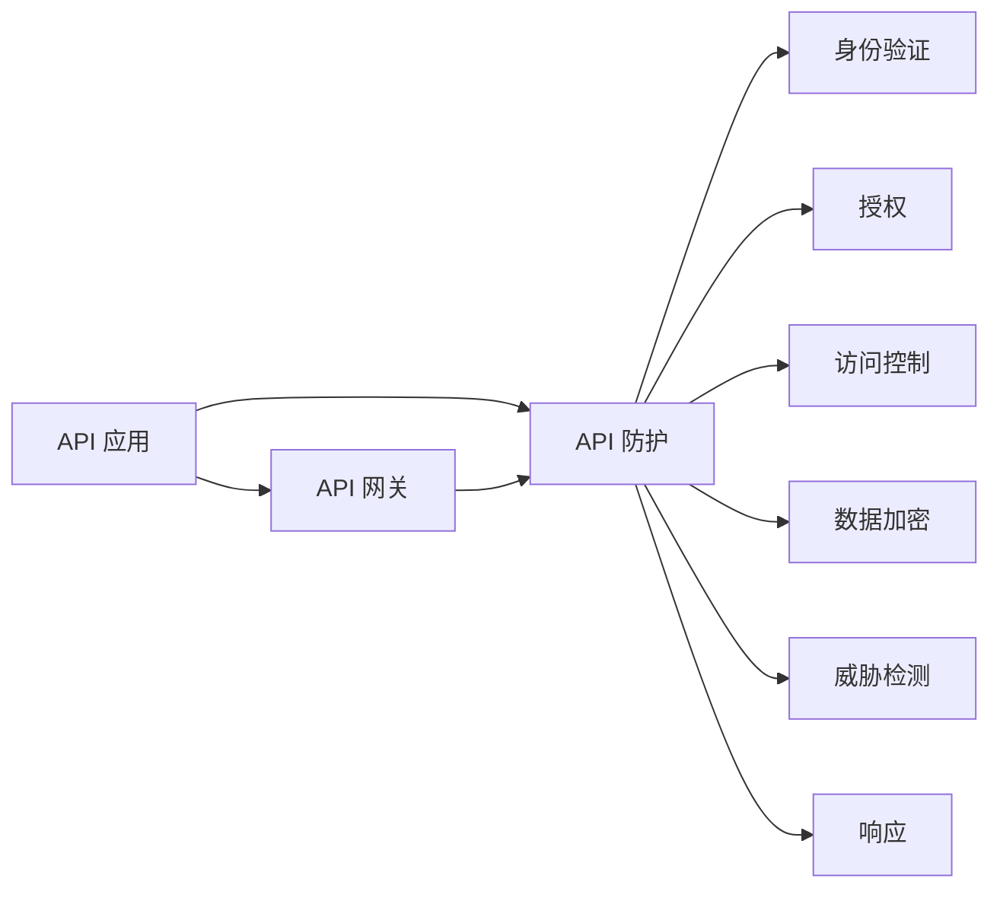

                 

## 1. 背景介绍

随着企业数字化转型的推进，API已成为连接企业内部和外部系统的关键桥梁。API安全问题一旦发生，将给企业带来巨大的经济损失和声誉损害。据报道，网络安全公司Rapid7的数据显示，平均每起API攻击造成的损失为140万美元。如何防范和应对API安全风险，成为当下企业面临的重要挑战。

### 1.1 问题由来

API安全风险主要来源于API的复杂性和多样性。API作为一种程序接口，暴露了企业内部系统的功能和数据，容易被黑客利用进行非法攻击。常见的API安全威胁包括SQL注入、跨站脚本(XSS)、代码注入(CSRF)、认证劫持等，这些威胁可能破坏数据的完整性和机密性，甚至导致系统瘫痪。

与此同时，由于API的广泛应用，其安全问题日益突出。API安全风险已经成为Web应用安全的重要组成部分。因此，了解API安全风险，采取有效的安全措施，是确保API安全的关键。

### 1.2 问题核心关键点

为了帮助开发者和企业更好地理解API安全风险，并采取有效的防范措施，本文将深入探讨API安全风险的分类和具体实现机制，以及如何构建安全的API环境。

## 2. 核心概念与联系

### 2.1 核心概念概述

为更好地理解API安全风险，本节将介绍几个密切相关的核心概念：

- **API（Application Programming Interface）**：指应用程序或系统之间的接口，通常以HTTP或RESTful形式实现。API通常提供对企业内部数据的访问和处理能力，因此其安全性至关重要。
- **API 安全**：指保护API免受未经授权的访问、恶意攻击和数据泄露等威胁的措施。API安全涉及身份验证、授权、访问控制、数据加密等技术。
- **API 威胁**：指可能对API造成损害的安全威胁，包括SQL注入、XSS、CSRF等常见攻击类型。
- **API 防护**：指采取技术和管理措施，减少或消除API威胁的过程。API防护措施包括API网关、安全配置、威胁检测和响应等。

### 2.2 核心概念原理和架构的 Mermaid 流程图



这个流程图展示了API防护的基本流程：

1. API请求首先通过API网关。
2. API网关负责初步的身份验证和授权，防止未经授权的访问。
3. 认证通过后，API网关将请求转发到具体的API应用。
4. API应用进行访问控制，确保请求的合法性。
5. 数据在传输过程中进行加密，确保数据的机密性。
6. 对可疑行为进行威胁检测，及时发现和阻止攻击。
7. 在检测到攻击时，立即响应并采取相应措施。

## 3. 核心算法原理 & 具体操作步骤

### 3.1 算法原理概述

API安全风险的防范涉及多个层面，包括身份验证、授权、访问控制、数据加密等。本文将介绍常见API安全风险的防范方法。

### 3.2 算法步骤详解

#### 3.2.1 身份验证

身份验证是API安全防护的基础。常见的身份验证方法包括：

- **基本认证（Basic Authentication）**：用户通过用户名和密码进行验证，安全性较低，易被截获。
- **令牌认证（Token Authentication）**：用户通过获取令牌进行验证，安全性较高，但需要额外的令牌管理系统。
- **OAuth2认证**：通过第三方服务提供商进行认证，安全性较高，但需要复杂的授权流程。
- **OAuth1认证**：与OAuth2类似，但使用更长的签名字符串进行验证，安全性较高，但实现复杂。

#### 3.2.2 授权

授权是指对用户请求的API访问进行控制，以确保其符合权限规定。常见的授权方法包括：

- **基于角色的访问控制（Role-Based Access Control, RBAC）**：根据用户角色进行权限控制。
- **基于属性的访问控制（Attribute-Based Access Control, ABAC）**：根据用户属性进行权限控制。
- **基于策略的访问控制（Policy-Based Access Control, PBAC）**：根据策略进行权限控制。

#### 3.2.3 访问控制

访问控制是指在API应用内部，对用户请求的资源进行限制。常见的访问控制方法包括：

- **IP白名单**：仅允许特定的IP地址访问API。
- **API密钥**：为每个API应用分配唯一的密钥，进行访问控制。
- **限流和熔断**：对API请求进行速率限制和熔断，防止系统过载。

#### 3.2.4 数据加密

数据加密是指在API请求和响应的传输过程中，对数据进行加密处理，确保数据的机密性。常见的数据加密方法包括：

- **SSL/TLS**：在HTTPS协议基础上，对数据进行加密传输。
- **AES加密**：对数据进行对称加密处理。
- **RSA加密**：对数据进行非对称加密处理。

#### 3.2.5 威胁检测

威胁检测是指对API请求和响应进行监控和分析，及时发现和阻止异常行为。常见的威胁检测方法包括：

- **入侵检测系统（Intrusion Detection System, IDS）**：实时监控API流量，检测可疑行为。
- **异常检测**：使用机器学习算法，对API请求进行行为分析，检测异常行为。

#### 3.2.6 响应

响应是指在检测到攻击时，立即采取措施，防止攻击进一步扩散。常见的响应措施包括：

- **封禁IP**：封禁攻击者的IP地址，防止其再次访问API。
- **返回错误码**：返回HTTP 403或404等错误码，通知攻击者请求失败。
- **记录日志**：记录攻击事件，便于事后分析和追踪。

### 3.3 算法优缺点

#### 3.3.1 身份验证

**优点**：
- 提供基本的访问控制。
- 实现简单，易于部署。

**缺点**：
- 安全性较低，容易被截获。
- 不支持复杂的授权流程。

#### 3.3.2 授权

**优点**：
- 提供细粒度的权限控制。
- 支持复杂的授权流程。

**缺点**：
- 实现复杂，需要额外的授权管理系统。
- 管理成本较高。

#### 3.3.3 访问控制

**优点**：
- 提供额外的访问限制。
- 实现简单，易于部署。

**缺点**：
- 限制过于严格，可能影响用户体验。
- 无法动态调整访问策略。

#### 3.3.4 数据加密

**优点**：
- 提供数据的机密性保护。
- 实现简单，易于部署。

**缺点**：
- 加密和解密过程增加计算开销。
- 需要额外的密钥管理机制。

#### 3.3.5 威胁检测

**优点**：
- 提供实时的威胁监控。
- 能够及时发现和阻止攻击。

**缺点**：
- 需要复杂的技术实现。
- 误报率较高，可能影响正常访问。

#### 3.3.6 响应

**优点**：
- 提供快速的攻击响应。
- 能够及时防止攻击扩散。

**缺点**：
- 限制过于严格，可能影响正常访问。
- 需要复杂的响应策略。

### 3.4 算法应用领域

API安全风险防范方法广泛应用于各种行业和领域，包括金融、医疗、政府、电子商务等。具体应用场景如下：

- **金融行业**：保护金融API免受欺诈、洗钱等攻击，确保资金安全。
- **医疗行业**：保护医疗API免受恶意访问和数据泄露，确保患者隐私。
- **政府行业**：保护政府API免受黑客攻击，确保政府信息安全。
- **电子商务行业**：保护电子商务API免受恶意攻击，确保交易安全。

## 4. 数学模型和公式 & 详细讲解 & 举例说明

### 4.1 数学模型构建

API安全风险的防范涉及多个数学模型，包括身份验证模型、授权模型、访问控制模型、数据加密模型等。

#### 4.1.1 身份验证模型

基本的身份验证模型可以表示为：

$$
I(A, U) = 
\begin{cases} 
1, & \text{如果用户U通过身份验证} \\
0, & \text{如果用户U未通过身份验证}
\end{cases}
$$

其中，$A$为身份验证算法，$U$为用户。

#### 4.1.2 授权模型

基于角色的访问控制模型可以表示为：

$$
P(A, R, P) = 
\begin{cases} 
1, & \text{如果用户A的角色R允许访问权限P} \\
0, & \text{如果用户A的角色R不允许访问权限P}
\end{cases}
$$

其中，$A$为用户，$R$为角色，$P$为访问权限。

#### 4.1.3 访问控制模型

基于IP地址的访问控制模型可以表示为：

$$
AC(A, I) = 
\begin{cases} 
1, & \text{如果IP地址I在白名单中} \\
0, & \text{如果IP地址I不在白名单中}
\end{cases}
$$

其中，$A$为访问控制算法，$I$为IP地址。

#### 4.1.4 数据加密模型

AES加密模型可以表示为：

$$
E(K, M) = C
$$

其中，$K$为密钥，$M$为明文，$C$为密文。

### 4.2 公式推导过程

#### 4.2.1 身份验证公式推导

假设用户U的密码为$P$，通过基本认证算法的公式可以表示为：

$$
I(U) = 
\begin{cases} 
1, & \text{如果} U的密码 = P \\
0, & \text{如果} U的密码 \neq P
\end{cases}
$$

#### 4.2.2 授权公式推导

基于角色的访问控制公式可以表示为：

$$
P(R) = 
\begin{cases} 
1, & \text{如果角色R具有访问权限} \\
0, & \text{如果角色R不具有访问权限}
\end{cases}
$$

其中，$P(R)$表示角色R的权限集合。

#### 4.2.3 访问控制公式推导

基于IP地址的访问控制公式可以表示为：

$$
AC(I) = 
\begin{cases} 
1, & \text{如果IP地址I在白名单中} \\
0, & \text{如果IP地址I不在白名单中}
\end{cases}
$$

#### 4.2.4 数据加密公式推导

AES加密公式可以表示为：

$$
E(K, M) = C = F(K, M)
$$

其中，$F(K, M)$表示加密算法，$C$为密文。

### 4.3 案例分析与讲解

#### 4.3.1 基本认证案例

假设某API应用使用基本认证，用户U的密码为$P$。当用户U发起请求时，API应用首先验证其密码是否为$P$，验证通过则允许访问，否则拒绝访问。

#### 4.3.2 基于角色的访问控制案例

假设某API应用使用基于角色的访问控制，角色R具有访问权限P。当用户U发起请求时，API应用首先验证其角色是否为R，验证通过则允许访问，否则拒绝访问。

#### 4.3.3 基于IP地址的访问控制案例

假设某API应用使用基于IP地址的访问控制，IP地址I在白名单中。当用户U发起请求时，API应用首先验证其IP地址是否在白名单中，验证通过则允许访问，否则拒绝访问。

#### 4.3.4 数据加密案例

假设某API应用使用AES加密算法，密钥为$K$，明文为$M$。当用户U发起请求时，API应用首先对明文$M$进行加密处理，生成密文$C$，然后发送给用户U。

## 5. 项目实践：代码实例和详细解释说明

### 5.1 开发环境搭建

#### 5.1.1 环境要求

- **操作系统**：Linux/Windows
- **开发语言**：Python 3.x
- **开发框架**：Flask/Django
- **数据库**：MySQL/PostgreSQL
- **依赖库**：requests, Flask, Flask-SQLAlchemy, PyJWT, PyCryptodome

### 5.2 源代码详细实现

#### 5.2.1 Flask环境搭建

```python
from flask import Flask, request, jsonify
from flask_sqlalchemy import SQLAlchemy
import jwt
import hashlib

app = Flask(__name__)
app.config['SQLALCHEMY_DATABASE_URI'] = 'sqlite:///example.db'
db = SQLAlchemy(app)

# 创建API表
class API(db.Model):
    id = db.Column(db.Integer, primary_key=True)
    name = db.Column(db.String(80), unique=True)
    url = db.Column(db.String(120), unique=True)
    method = db.Column(db.String(10), unique=True)
    path = db.Column(db.String(120), unique=True)
    description = db.Column(db.String(200))
    is_secure = db.Column(db.Boolean, default=False)

    def __repr__(self):
        return '<API %r>' % self.name

# 创建用户表
class User(db.Model):
    id = db.Column(db.Integer, primary_key=True)
    username = db.Column(db.String(80), unique=True)
    password = db.Column(db.String(120))
    role = db.Column(db.String(10), default='user')

    def __repr__(self):
        return '<User %r>' % self.username

# 添加API到数据库
@app.route('/api/add', methods=['POST'])
def add_api():
    data = request.get_json()
    api_name = data.get('name')
    api_url = data.get('url')
    api_method = data.get('method')
    api_path = data.get('path')
    api_description = data.get('description')
    api_secure = data.get('secure')

    api = API(name=api_name, url=api_url, method=api_method, path=api_path, description=api_description, is_secure=api_secure)
    db.session.add(api)
    db.session.commit()

    return jsonify({'message': 'API added successfully'})

# 获取API列表
@app.route('/api/list', methods=['GET'])
def get_api_list():
    apis = API.query.all()
    api_list = []
    for api in apis:
        api_dict = {
            'id': api.id,
            'name': api.name,
            'url': api.url,
            'method': api.method,
            'path': api.path,
            'description': api.description,
            'is_secure': api.is_secure
        }
        api_list.append(api_dict)

    return jsonify(api_list)

# 获取用户列表
@app.route('/user/list', methods=['GET'])
def get_user_list():
    users = User.query.all()
    user_list = []
    for user in users:
        user_dict = {
            'id': user.id,
            'username': user.username,
            'role': user.role
        }
        user_list.append(user_dict)

    return jsonify(user_list)

# 用户登录
@app.route('/user/login', methods=['POST'])
def login():
    data = request.get_json()
    username = data.get('username')
    password = data.get('password')

    user = User.query.filter_by(username=username).first()
    if user is None or hashlib.sha256(password.encode()).hexdigest() != user.password:
        return jsonify({'message': 'Invalid credentials'})

    token = jwt.encode({'username': username}, 'secret_key', algorithm='HS256')
    return jsonify({'token': token.decode('utf-8')})

# 验证API请求
@app.route('/api/validate', methods=['POST'])
def validate_api():
    data = request.get_json()
    api_id = data.get('api_id')
    token = data.get('token')
    api = API.query.filter_by(id=api_id).first()

    if not api.is_secure:
        return jsonify({'message': 'API not secured'})

    user = User.query.filter_by(username=jwt.decode(token, 'secret_key', algorithms=['HS256']).get('username').first()
    if user is None:
        return jsonify({'message': 'Invalid token'})

    return jsonify({'message': 'API request validated successfully'})

if __name__ == '__main__':
    app.run(debug=True)
```

### 5.3 代码解读与分析

#### 5.3.1 Flask框架

Flask是一个轻量级的Python Web框架，用于快速搭建API应用。

1. **环境搭建**：首先引入Flask和SQLAlchemy库，用于创建API和用户表。
2. **API表**：用于存储API信息，包括API的名称、URL、方法、路径、描述和安全标记。
3. **用户表**：用于存储用户信息，包括用户名、密码和角色。
4. **API添加**：通过POST请求向数据库中添加API信息。
5. **API列表获取**：通过GET请求获取API列表。
6. **用户列表获取**：通过GET请求获取用户列表。
7. **用户登录**：通过POST请求验证用户登录信息，生成JWT令牌。
8. **API请求验证**：通过POST请求验证API请求，生成JWT令牌。

#### 5.3.2 身份验证

Flask中的JWT身份验证功能可以保证API请求的安全性。具体实现如下：

1. **用户登录**：用户通过POST请求提交用户名和密码，Flask框架验证信息后，生成JWT令牌并返回。
2. **API请求验证**：API请求时，提交JWT令牌，Flask框架验证令牌有效性，并允许访问API。

### 5.4 运行结果展示

在运行上述代码后，可以通过以下命令启动API服务：

```bash
$ flask run
```

访问以下URL，可以测试API功能的实现：

- 添加API：
  ```bash
  $ curl -X POST http://localhost:5000/api/add -H 'Content-Type: application/json' -d '{"name": "get_user", "url": "http://example.com/user", "method": "GET", "path": "/user", "description": "获取用户信息", "secure": true}'
  ```

- 获取API列表：
  ```bash
  $ curl -X GET http://localhost:5000/api/list
  ```

- 获取用户列表：
  ```bash
  $ curl -X GET http://localhost:5000/user/list
  ```

- 用户登录：
  ```bash
  $ curl -X POST http://localhost:5000/user/login -H 'Content-Type: application/json' -d '{"username": "user1", "password": "password"}'
  ```

- 验证API请求：
  ```bash
  $ curl -X POST http://localhost:5000/api/validate -H 'Content-Type: application/json' -d '{"api_id": 1, "token": "token"}'
  ```

以上操作结果将返回JSON格式的响应，用于验证API功能的实现。

## 6. 实际应用场景

### 6.1 智能家居

智能家居系统通过API连接各种智能设备，实现语音助手、智能控制等高级功能。然而，智能家居系统涉及大量用户数据和设备操作，容易成为黑客攻击的目标。

API安全问题可能导致智能家居系统被远程控制、数据泄露等严重后果。为了防范API安全风险，可以采用以下措施：

1. **身份验证**：对用户进行身份验证，防止未经授权的访问。
2. **授权控制**：根据用户角色，控制其对智能设备的访问权限。
3. **数据加密**：在API请求和响应中对数据进行加密处理，防止数据泄露。
4. **威胁检测**：使用IDS等技术，实时监控智能家居系统的API流量，检测可疑行为。

### 6.2 医疗行业

医疗行业涉及大量敏感数据，如病历、诊断报告等。API安全问题可能导致数据泄露、系统瘫痪等严重后果。

API安全问题可能导致医疗数据被黑客窃取，从而威胁患者隐私。为了防范API安全风险，可以采用以下措施：

1. **身份验证**：对医疗从业人员进行身份验证，防止未经授权的访问。
2. **授权控制**：根据医疗从业人员的角色，控制其对敏感数据的访问权限。
3. **数据加密**：在API请求和响应中对数据进行加密处理，防止数据泄露。
4. **威胁检测**：使用IDS等技术，实时监控医疗系统的API流量，检测可疑行为。

### 6.3 电子商务

电子商务平台通过API连接各种业务系统，如订单管理、支付系统等。API安全问题可能导致数据泄露、欺诈等严重后果。

API安全问题可能导致订单数据被黑客窃取，从而影响平台正常运营。为了防范API安全风险，可以采用以下措施：

1. **身份验证**：对电商平台用户进行身份验证，防止未经授权的访问。
2. **授权控制**：根据用户角色，控制其对订单数据的访问权限。
3. **数据加密**：在API请求和响应中对数据进行加密处理，防止数据泄露。
4. **威胁检测**：使用IDS等技术，实时监控电商平台的API流量，检测可疑行为。

## 7. 工具和资源推荐

### 7.1 学习资源推荐

为了帮助开发者和企业更好地理解API安全风险，并采取有效的防范措施，这里推荐一些优质的学习资源：

1. **OWASP API Security Guide**：OWASP提供的API安全指南，详细介绍了API安全的基本概念和最佳实践。
2. **Flask官方文档**：Flask官方文档，介绍了如何使用Flask框架构建安全的API应用。
3. **JWT官方文档**：JWT官方文档，介绍了如何使用JWT进行身份验证和授权。
4. **PyJWT官方文档**：PyJWT官方文档，介绍了如何使用Python实现JWT身份验证。
5. **PyCryptodome官方文档**：PyCryptodome官方文档，介绍了如何使用Python实现数据加密。

通过这些资源的学习实践，相信你一定能够快速掌握API安全的精髓，并用于解决实际的API安全问题。

### 7.2 开发工具推荐

高效的开发离不开优秀的工具支持。以下是几款用于API安全开发的常用工具：

1. **Flask**：轻量级的Python Web框架，适合快速搭建API应用。
2. **JWT**：用于生成和验证JWT令牌的身份验证库。
3. **PyJWT**：Python实现的JWT身份验证库，支持多种算法。
4. **PyCryptodome**：Python实现的加密库，支持多种加密算法。
5. **IDS（入侵检测系统）**：用于实时监控API流量的入侵检测系统。

合理利用这些工具，可以显著提升API安全开发的效率，加速API安全研究的进展。

### 7.3 相关论文推荐

API安全问题已经引起了广泛关注。以下是几篇奠基性的相关论文，推荐阅读：

1. **OWASP API Security**：OWASP提供的API安全指南，详细介绍了API安全的基本概念和最佳实践。
2. **JWT: JSON Web Token Standard**：JWT的官方文档，详细介绍了JWT的身份验证和授权机制。
3. **Flask Security**：Flask官方文档，介绍了如何使用Flask框架构建安全的API应用。
4. **OWASP API Security Testing Guide**：OWASP提供的API安全测试指南，详细介绍了API安全测试的方法和工具。
5. **API Security in the Age of Microservices**：关于微服务架构中API安全的论文，介绍了API安全在微服务环境下的实现和优化。

这些论文代表了大语言模型微调技术的发展脉络。通过学习这些前沿成果，可以帮助研究者把握学科前进方向，激发更多的创新灵感。

## 8. 总结：未来发展趋势与挑战

### 8.1 总结

本文对API安全风险进行了全面系统的介绍。首先阐述了API安全风险的背景和重要性，明确了API安全防护的重要性和紧迫性。其次，从身份验证、授权、访问控制、数据加密等角度，详细讲解了API安全风险的防范方法。最后，给出了API安全风险防范的具体实现案例，并通过Python代码进行了实践展示。

通过本文的系统梳理，可以看到，API安全风险防范方法在各种行业和领域都得到了广泛应用，能够有效保障API的安全性，防止数据泄露、系统攻击等安全问题。未来，API安全研究还需要进一步探索新的技术和方法，以应对更加复杂多样的安全威胁。

### 8.2 未来发展趋势

展望未来，API安全防护技术将呈现以下几个发展趋势：

1. **自动化安全测试**：利用自动化工具进行API安全测试，减少人工干预，提高测试效率。
2. **人工智能防护**：利用机器学习算法，实时检测和预测API攻击行为，提高防护能力。
3. **区块链防护**：利用区块链技术，对API请求进行加密和验证，提高安全性和不可篡改性。
4. **云防护**：将API安全防护功能集成到云服务中，利用云端的强大计算和存储资源，提供更高级的安全防护。
5. **多层次防护**：采用多层次的防护措施，如身份验证、授权控制、数据加密、威胁检测等，全面保障API的安全性。

这些趋势表明，API安全防护技术将不断发展，结合自动化、人工智能、区块链等新技术，为API提供更强大、更全面的安全保障。

### 8.3 面临的挑战

尽管API安全防护技术已经取得了一定的进展，但在实际应用中仍面临诸多挑战：

1. **复杂多样的攻击**：API面临的攻击类型多种多样，如SQL注入、XSS、CSRF等，防护难度较大。
2. **攻击手段不断进化**：黑客不断探索新的攻击手段，使得API安全防护成为一项持续性的挑战。
3. **防护成本高**：API安全防护需要投入大量资源，如人力、技术、设备等，防护成本较高。
4. **系统复杂性高**：API系统复杂多样，涉及多个子系统，防护难度较大。
5. **数据隐私保护**：API涉及大量敏感数据，如何平衡安全性和数据隐私保护是一大挑战。

解决这些挑战需要技术和管理层面的多方协作，共同提升API安全防护水平。

### 8.4 研究展望

未来，API安全研究需要在以下几个方面进行深入探索：

1. **自动化安全测试**：进一步提升自动化安全测试的覆盖范围和准确性，减少人工干预。
2. **人工智能防护**：利用机器学习算法，实时检测和预测API攻击行为，提高防护能力。
3. **区块链防护**：利用区块链技术，对API请求进行加密和验证，提高安全性和不可篡改性。
4. **云防护**：将API安全防护功能集成到云服务中，利用云端的强大计算和存储资源，提供更高级的安全防护。
5. **多层次防护**：采用多层次的防护措施，如身份验证、授权控制、数据加密、威胁检测等，全面保障API的安全性。

这些研究方向将推动API安全防护技术不断进步，为API提供更强大、更全面的安全保障。

## 9. 附录：常见问题与解答

**Q1: 什么是API？**

A: API（Application Programming Interface），指应用程序或系统之间的接口，通常以HTTP或RESTful形式实现。API通常提供对企业内部数据的访问和处理能力，因此其安全性至关重要。

**Q2: 如何防范API安全风险？**

A: 防范API安全风险需要采取多层次的防护措施，包括身份验证、授权控制、数据加密、威胁检测等。具体措施包括：
1. 身份验证：通过用户名和密码、令牌等方式进行验证。
2. 授权控制：根据用户角色和权限进行访问控制。
3. 数据加密：在API请求和响应中对数据进行加密处理。
4. 威胁检测：使用入侵检测系统（IDS）等工具实时监控API流量，检测可疑行为。

**Q3: 如何实现API安全防护？**

A: 实现API安全防护需要利用多种技术手段，如Flask框架、JWT身份验证、数据加密库等。具体步骤如下：
1. 安装Flask、JWT、PyJWT、PyCryptodome等库。
2. 创建API表和用户表，用于存储API信息和用户信息。
3. 实现身份验证和授权控制逻辑。
4. 在API请求和响应中对数据进行加密处理。
5. 实时监控API流量，检测可疑行为。

**Q4: 如何进行API安全测试？**

A: API安全测试可以通过自动化工具进行，如OWASP ZAP、Burp Suite等。具体步骤如下：
1. 安装自动化测试工具。
2. 创建测试用例，模拟API请求和响应。
3. 测试API身份验证、授权控制、数据加密等安全措施。
4. 根据测试结果，调整API安全防护策略。

通过以上学习资源的推荐和开发工具的介绍，相信你对API安全风险有了更深入的了解，能够更好地应对API安全问题，确保API系统的安全性和稳定性。

---

作者：禅与计算机程序设计艺术 / Zen and the Art of Computer Programming

