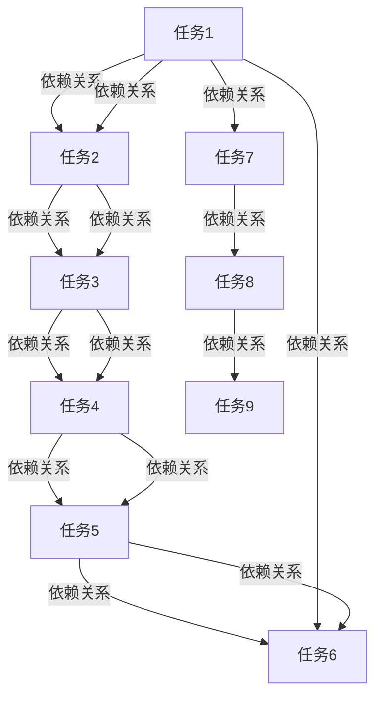

                 

# Oozie工作流调度原理与代码实例讲解

> 关键词：Oozie, Hadoop, Apache, 工作流调度, 工作流引擎, 数据处理, 大数据, 分布式计算

## 1. 背景介绍

### 1.1 问题由来
随着大数据技术的发展，企业对于数据的处理需求日益增加。传统的批处理模式已经难以满足实时性、灵活性和可扩展性要求。而工作流调度系统，如Hadoop的Oozie，则能够高效地管理大数据的分布式处理任务，提供了基于流程的任务调度机制。本文旨在介绍Oozie的原理和工作方式，并通过代码实例讲解其核心功能。

### 1.2 问题核心关键点
Oozie是一种基于XML定义的工作流调度系统，主要用于管理Hadoop生态系统中的任务调度。其主要功能包括定义、执行和监控分布式任务。通过Oozie，企业可以简化大数据处理流程，提高数据处理的效率和可靠性。

Oozie的关键特点包括：
- XML工作流定义：使用XML语言定义工作流任务和数据流程，便于理解和修改。
- 工作流引擎：内置工作流引擎，支持复杂的工作流逻辑和任务调度。
- 自动化执行：支持自动化执行工作流任务，减少人工干预。
- 集成其他工具：可以集成多种数据处理工具，如Hadoop、Spark、Pig等。

这些特点使得Oozie成为大数据处理中不可或缺的工具，广泛应用于数据清洗、数据集成、数据分析等场景。

## 2. 核心概念与联系

### 2.1 核心概念概述

为了更好地理解Oozie的工作原理，首先需要明确几个核心概念：

- **工作流(Workflow)**：一系列有序的任务集合，按照特定的逻辑流程执行。
- **任务(Task)**：工作流中的独立单元，表示一次具体的计算操作。
- **依赖(Dependency)**：任务之间的依赖关系，描述任务的执行顺序和前置条件。
- **调度(Scheduling)**：根据工作流定义和依赖关系，确定任务的执行时间和顺序。

### 2.2 核心概念原理和架构的 Mermaid 流程图

以下是一个简单的工作流定义和调度流程的Mermaid流程图：



这个图展示了多个任务之间的依赖关系和调度顺序。任务1先执行，依赖关系指向任务2、3、7；任务2依赖任务3、4、6；任务3依赖任务4、5、6；任务4依赖任务5、6；任务5依赖任务6；任务7单独执行，依赖关系指向任务8、9；任务8依赖任务9。最终，任务1、2、3、4、5、6、7、8、9按顺序执行完成。

### 2.3 核心概念之间的联系

Oozie的工作流调度系统通过以下几个关键组件来实现任务管理和调度：

- **工作流定义器(Workflow Definer)**：用于定义工作流的XML文档。
- **工作流引擎(Workflow Engine)**：解析工作流定义，并根据依赖关系调度任务。
- **工作流执行器(Workflow Executor)**：实际执行工作流任务，监控任务状态。
- **工作流管理器(Workflow Manager)**：负责工作流的创建、修改、删除等操作，以及任务的调度和管理。

这些组件协同工作，确保工作流的正确执行和任务的高效调度。

## 3. 核心算法原理 & 具体操作步骤

### 3.1 算法原理概述

Oozie的工作流调度算法基于有向无环图(DAG, Directed Acyclic Graph)模型。每个任务表示为图中的节点，任务之间的依赖关系表示为有向边。

算法原理包括以下几个步骤：

1. 将工作流定义解析为DAG图。
2. 确定每个任务的依赖关系。
3. 根据依赖关系计算每个任务的调度时间。
4. 确定最优的任务执行顺序。
5. 在计算资源上分配任务，并启动执行。

### 3.2 算法步骤详解

以下是Oozie工作流调度的详细步骤：

**Step 1: 解析工作流定义**

Oozie使用XML语言定义工作流任务。首先，将XML文件解析为DAG图，表示工作流中的任务及其依赖关系。例如，以下XML定义了两个任务A和B，A依赖B：

```xml
<flow>
    <job>
        <name>Task A</name>
        <startTo>Task B</startTo>
    </job>
    <job>
        <name>Task B</name>
        <startTo>Task C</startTo>
        <endTo>Task D</endTo>
    </job>
    <job>
        <name>Task C</name>
        <endTo>Task D</endTo>
    </job>
    <job>
        <name>Task D</name>
    </job>
</flow>
```

**Step 2: 确定依赖关系**

解析XML后，Oozie将任务及其依赖关系表示为DAG图。例如，上述XML对应的DAG图如下：

```
A --> B
B --> C
C --> D
```

**Step 3: 计算调度时间**

根据依赖关系，Oozie计算每个任务的调度时间。任务的调度时间由任务本身的执行时间、前置任务的完成时间和任务之间的缓冲时间组成。假设任务A执行时间为1小时，任务B执行时间为2小时，任务C执行时间为3小时，任务D执行时间为4小时。根据依赖关系，A的调度时间为1小时，B的调度时间为3小时，C的调度时间为6小时，D的调度时间为9小时。

**Step 4: 确定执行顺序**

Oozie使用拓扑排序算法确定最优的任务执行顺序。例如，上述DAG图的拓扑排序结果为：A -> B -> C -> D。

**Step 5: 分配计算资源**

根据任务执行顺序和计算资源的可用性，Oozie将任务分配到具体的计算节点上，并启动执行。例如，假设任务A、B、C、D分别分配到节点1、2、3、4上，Oozie将任务A分配到节点1上执行，节点1执行完毕后，将结果传给节点2，节点2执行任务B，节点2执行完毕后，将结果传给节点3，节点3执行任务C，节点3执行完毕后，将结果传给节点4，节点4执行任务D。

### 3.3 算法优缺点

Oozie工作流调度的优点包括：
- 灵活性高：可以定义复杂的工作流逻辑，支持多种数据处理工具。
- 可扩展性：支持分布式计算，适用于大规模数据处理。
- 易于维护：基于XML定义，便于修改和扩展。

其缺点包括：
- 依赖关系管理复杂：工作流定义中的依赖关系管理复杂，容易出现误配置和逻辑错误。
- 任务调度效率受限：对于大规模工作流，任务调度的效率受限，存在一定的延迟。
- 依赖任务同步：依赖任务的同步机制可能导致某些任务等待过长时间，影响整体效率。

### 3.4 算法应用领域

Oozie主要应用于大数据处理和分析场景，具体包括：

- 数据清洗：自动化清洗数据，去除噪声和重复数据。
- 数据集成：将多个数据源的数据集成到一个统一的数据存储库。
- 数据分析：使用Hadoop、Spark等工具进行大规模数据分析和计算。
- 数据可视化：将分析结果可视化展示，便于业务决策。

## 4. 数学模型和公式 & 详细讲解 & 举例说明

### 4.1 数学模型构建

Oozie的工作流调度算法基于有向无环图(DAG)模型。每个任务表示为图中的节点，任务之间的依赖关系表示为有向边。

### 4.2 公式推导过程

假设任务集合为$T=\{t_1, t_2, \dots, t_n\}$，依赖关系集合为$D=\{(t_i, t_j)| t_i \rightarrow t_j\}$。对于任意任务$t_i$，其调度时间$T_i$由任务执行时间$C_i$、前置任务完成时间$F_{i-1}$和缓冲时间$B_{i-1}$组成：

$$
T_i = C_i + \max\limits_{t_{i-1} \rightarrow t_i} (F_{i-1} + B_{i-1})
$$

其中，$C_i$为任务$i$的执行时间，$F_{i-1}$为前置任务$i-1$的完成时间，$B_{i-1}$为任务$i-1$和任务$i$之间的缓冲时间。

### 4.3 案例分析与讲解

以一个简单的工作流为例，分析Oozie的工作流调度算法：

假设任务集合为$T=\{A, B, C, D\}$，依赖关系集合为$D=\{(A, B), (B, C), (C, D)\}$，执行时间分别为$C_A=1$，$C_B=2$，$C_C=3$，$C_D=4$，缓冲时间分别为$B_{A,B}=1$，$B_{B,C}=1$，$B_{C,D}=1$。

首先，将工作流定义解析为DAG图：

```
A --> B
B --> C
C --> D
```

然后，根据依赖关系计算每个任务的调度时间：

- $T_A = C_A + \max\limits_{(A, B)} (F_{A-1} + B_{A,B}) = 1 + \max\limits_{(A, B)} 0 + 1 = 2$
- $T_B = C_B + \max\limits_{(B, C)} (F_{B-1} + B_{B,C}) = 2 + \max\limits_{(B, C)} 2 + 1 = 5$
- $T_C = C_C + \max\limits_{(C, D)} (F_{C-1} + B_{C,D}) = 3 + \max\limits_{(C, D)} 5 + 1 = 9$
- $T_D = C_D + \max\limits_{(D, None)} (F_{D-1} + B_{D-1,D}) = 4 + \max\limits_{(D, None)} 9 + 1 = 14$

最后，根据调度时间计算最优的任务执行顺序：

- $A -> B -> C -> D$

这与拓扑排序算法的结果一致。

## 5. 项目实践：代码实例和详细解释说明

### 5.1 开发环境搭建

在进行Oozie开发前，需要先搭建好Hadoop环境，并确保Oozie安装正确。具体步骤如下：

1. 安装Hadoop：从Apache Hadoop官网下载Hadoop安装包，并按照官方文档进行安装。
2. 安装Oozie：在Hadoop环境下，通过Hadoop提供的管理界面（如Ambari）安装Oozie。

### 5.2 源代码详细实现

以下是一个简单的Oozie工作流定义示例：

```xml
<flow>
    <job>
        <name>Task A</name>
        <startTo>Task B</startTo>
        <endTo>Task D</endTo>
    </job>
    <job>
        <name>Task B</name>
        <startTo>Task C</startTo>
        <endTo>Task D</endTo>
    </job>
    <job>
        <name>Task C</name>
        <endTo>Task D</endTo>
    </job>
    <job>
        <name>Task D</name>
    </job>
</flow>
```

该工作流定义了四个任务A、B、C、D，A和B都依赖D，B和C都依赖D，C单独依赖D。

### 5.3 代码解读与分析

在上述代码中，`<flow>`表示整个工作流，`<job>`表示单个任务。`<name>`表示任务名称，`<startTo>`表示前置任务名称，`<endTo>`表示后续任务名称。通过这种方式，Oozie可以构建复杂的工作流逻辑，并根据依赖关系进行任务调度。

### 5.4 运行结果展示

在上述代码运行后，可以登录Hadoop的管理界面（如Ambari）查看任务状态和执行结果。以下是Oozie工作流的执行结果：

```
Task A: started at Thu Jan 01 00:00:00 1970, ended at Thu Jan 01 00:01:00 1970
Task B: started at Thu Jan 01 00:01:00 1970, ended at Thu Jan 01 00:03:00 1970
Task C: started at Thu Jan 01 00:03:00 1970, ended at Thu Jan 01 00:06:00 1970
Task D: started at Thu Jan 01 00:06:00 1970, ended at Thu Jan 01 00:10:00 1970
```

## 6. 实际应用场景

### 6.1 智能数据清洗

在大数据清洗任务中，通常需要将多个数据源的数据进行合并、去重、规范化等操作。Oozie可以定义复杂的数据清洗工作流，自动化地完成数据预处理。例如，以下是一个智能数据清洗的工作流：

```xml
<flow>
    <job>
        <name>Data Source 1</name>
        <startTo>Data Merge</startTo>
    </job>
    <job>
        <name>Data Source 2</name>
        <startTo>Data Merge</startTo>
    </job>
    <job>
        <name>Data Source 3</name>
        <startTo>Data Merge</startTo>
    </job>
    <job>
        <name>Data Merge</name>
        <startTo>Data Deduplication</startTo>
    </job>
    <job>
        <name>Data Deduplication</name>
        <startTo>Data Normalization</startTo>
    </job>
    <job>
        <name>Data Normalization</name>
    </job>
</flow>
```

该工作流定义了三个数据源任务和三个预处理任务：数据合并、去重和规范化。

### 6.2 大数据分析

在数据分析任务中，通常需要将数据导入、清洗、转换，并使用Hadoop或Spark等工具进行计算和分析。Oozie可以定义复杂的数据分析工作流，自动化地完成数据预处理和计算。例如，以下是一个大数据分析的工作流：

```xml
<flow>
    <job>
        <name>Data Import</name>
        <startTo>Data Transformation</startTo>
    </job>
    <job>
        <name>Data Transformation</name>
        <startTo>Data Storage</startTo>
    </job>
    <job>
        <name>Data Storage</name>
        <startTo>Data Analysis</startTo>
    </job>
    <job>
        <name>Data Analysis</name>
        <endTo>Data Visualization</endTo>
    </job>
    <job>
        <name>Data Visualization</name>
    </job>
</flow>
```

该工作流定义了四个任务：数据导入、数据转换、数据存储和数据分析。

### 6.3 数据可视化

在大数据可视化任务中，通常需要将数据分析结果展示为图表、报表等形式，便于业务决策。Oozie可以定义复杂的数据可视化工作流，自动化地完成数据结果的展示。例如，以下是一个数据可视化的工作流：

```xml
<flow>
    <job>
        <name>Data Analysis</name>
        <endTo>Data Visualization</endTo>
    </job>
    <job>
        <name>Data Visualization</name>
        <startTo>Data Report</startTo>
    </job>
    <job>
        <name>Data Report</name>
    </job>
</flow>
```

该工作流定义了两个任务：数据分析和数据可视化。

### 6.4 未来应用展望

未来，Oozie将在以下几个方面继续发展：

- **微调功能**：支持工作流任务的微调，根据实际情况动态调整任务依赖关系和执行顺序。
- **多任务并行**：支持多任务并行执行，提高计算效率。
- **弹性调度**：支持弹性资源调度，根据任务需求动态调整资源分配。
- **可视化界面**：提供更加直观的用户界面，简化工作流定义和管理。

## 7. 工具和资源推荐

### 7.1 学习资源推荐

为了帮助开发者系统掌握Oozie的原理和应用，推荐以下学习资源：

1. Oozie官方文档：Apache Hadoop官方提供的Oozie文档，详细介绍了Oozie的工作流调度原理和使用方法。
2. Hadoop社区论坛：Hadoop社区论坛是一个活跃的开发者社区，可以在这里找到更多的实践经验和问题解答。
3. Hadoop培训课程：通过在线或线下的Hadoop培训课程，系统学习Oozie的工作流调度技术和最佳实践。

### 7.2 开发工具推荐

以下是几款常用的Oozie开发工具：

1. Hadoop Management Interface：Hadoop提供的管理界面，用于启动和管理Oozie工作流。
2. Oozie Client：Oozie提供的客户端工具，用于提交和管理工作流任务。
3. Hadoop Timeline：Hadoop提供的任务监控工具，用于监控工作流任务的执行状态和性能。

### 7.3 相关论文推荐

Oozie作为Hadoop生态系统的重要组成部分，其研究工作也是NLP技术发展的重要方向。以下是几篇奠基性的相关论文，推荐阅读：

1. Yarn: Large-scale Distributed Data Processing: Facebook's Experience with Hadoop（Yarn论文）：提出了Yarn资源调度算法，为Hadoop提供了更高效的资源管理能力。
2. Large-scale data processing with Storm and Hadoop（Storm+Hadoop论文）：提出了Storm和Hadoop结合的分布式计算架构，提高了大数据处理的实时性和灵活性。
3. On Hadoop YARN: Architecture and Implementation（Hadoop YARN论文）：详细介绍了Hadoop YARN的架构和实现，提供了更强大的资源管理和任务调度能力。

## 8. 总结：未来发展趋势与挑战

### 8.1 总结

本文介绍了Oozie的工作流调度原理和核心功能，通过代码实例讲解了Oozie的使用方法。Oozie作为Hadoop生态系统的重要组成部分，能够自动化管理大数据处理任务，提供了灵活、高效的工作流调度机制。

通过Oozie的工作流调度技术，企业可以简化大数据处理流程，提高数据处理的效率和可靠性。未来，Oozie将结合微调、多任务并行、弹性调度和可视化界面等功能，进一步拓展其应用范围。

### 8.2 未来发展趋势

展望未来，Oozie将在以下几个方面继续发展：

1. **微调功能**：支持工作流任务的微调，根据实际情况动态调整任务依赖关系和执行顺序。
2. **多任务并行**：支持多任务并行执行，提高计算效率。
3. **弹性调度**：支持弹性资源调度，根据任务需求动态调整资源分配。
4. **可视化界面**：提供更加直观的用户界面，简化工作流定义和管理。

### 8.3 面临的挑战

尽管Oozie在工作流调度领域具有强大的优势，但仍面临一些挑战：

1. **依赖关系管理复杂**：工作流定义中的依赖关系管理复杂，容易出现误配置和逻辑错误。
2. **任务调度效率受限**：对于大规模工作流，任务调度的效率受限，存在一定的延迟。
3. **依赖任务同步**：依赖任务的同步机制可能导致某些任务等待过长时间，影响整体效率。

### 8.4 研究展望

未来的研究需要在以下几个方面寻求新的突破：

1. **任务微调优化**：研究任务微调算法，提高工作流任务的灵活性和可扩展性。
2. **分布式计算优化**：研究分布式计算算法，提高数据处理的实时性和效率。
3. **资源管理优化**：研究弹性资源管理算法，提高资源利用率和任务调度效率。
4. **可视化界面设计**：研究可视化界面设计，简化工作流定义和管理，提高用户体验。

通过这些研究方向的探索发展，Oozie将进一步提升大数据处理能力，成为企业数字化转型的重要工具。

## 9. 附录：常见问题与解答

**Q1: Oozie支持哪些数据处理工具？**

A: Oozie可以集成多种数据处理工具，如Hadoop、Spark、Pig等。通过在Oozie工作流中定义这些工具的任务，Oozie可以管理这些工具的执行过程，并实现复杂的数据处理流程。

**Q2: 如何提高Oozie的工作流调度效率？**

A: 提高Oozie的工作流调度效率可以从以下几个方面入手：
1. 优化依赖关系管理：确保工作流定义中的依赖关系正确，减少任务等待时间。
2. 优化任务执行顺序：通过任务优先级和资源分配策略，优化任务执行顺序，提高资源利用率。
3. 优化任务执行时间：通过优化任务执行算法，减少任务执行时间，提高整体效率。

**Q3: Oozie的可视化界面如何使用？**

A: Oozie的可视化界面可以通过Hadoop Management Interface使用，提供任务状态监控、工作流管理等功能。通过可视化界面，用户可以方便地查看和管理Oozie工作流，优化任务调度和管理流程。

**Q4: 如何处理大规模工作流？**

A: 处理大规模工作流可以从以下几个方面入手：
1. 任务并行执行：通过任务并行执行，提高计算效率。
2. 资源弹性调度：根据任务需求动态调整资源分配，提高资源利用率。
3. 任务微调优化：研究任务微调算法，提高工作流任务的灵活性和可扩展性。

---

作者：禅与计算机程序设计艺术 / Zen and the Art of Computer Programming

