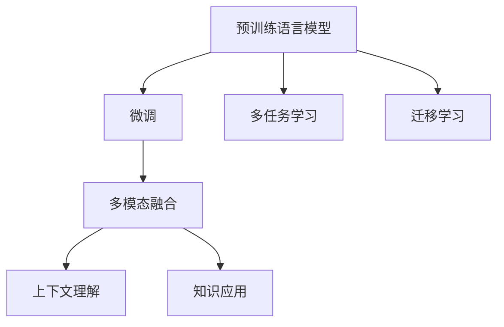

                 

# OpenAI的GPT-4.0展示的实际应用

## 1. 背景介绍

### 1.1 问题由来
OpenAI的GPT-4.0作为自然语言处理（NLP）领域的最新里程碑，不仅在预训练语言模型（Pre-trained Language Model, PLM）的性能上取得了突破，更在实际应用场景中展现了强大的综合能力。其基于大规模无标签文本数据进行预训练，并通过超大规模的微调数据进行优化，最终能够在各种任务中提供卓越的表现。

GPT-4.0的发布标志着NLP领域的一个重要转变，从单一的语言生成转向更加全面的多模态任务处理能力。OpenAI的GPT-4.0不仅在文本生成、对话系统、翻译等领域有着卓越的表现，还在代码生成、图像描述生成、交互式学习等多个方面展现了其广泛的适用性。

### 1.2 问题核心关键点
GPT-4.0的成功不仅得益于其强大的预训练能力和超大规模的微调数据，更在于其在多模态融合、上下文理解和知识应用方面的突破。其应用的核心关键点包括：

- 大规模预训练：GPT-4.0在2265亿参数的规模上进行了大规模的预训练，使其具备了丰富的语言知识和广泛的常识。
- 超大规模微调：通过在特定领域的数百万到数十亿条数据上进行微调，GPT-4.0能够适应各种具体的任务需求。
- 多模态融合：GPT-4.0能够处理图像、音频等多种模态的数据，并将其与文本数据进行融合，提升任务的复杂性。
- 上下文理解：GPT-4.0在处理长文本时，能够有效地捕捉上下文信息，保持连续的语义连贯性。
- 知识应用：GPT-4.0能够整合外部知识库和推理工具，增强其在复杂推理任务中的能力。

这些核心能力使得GPT-4.0在实际应用中能够提供高效、准确、创新的解决方案，进一步推动了NLP技术在各个领域的应用。

## 2. 核心概念与联系

### 2.1 核心概念概述

为更好地理解GPT-4.0的实际应用，本节将介绍几个关键概念及其间的联系：

- 预训练语言模型(PLM)：如GPT-4.0，通过在大规模无标签文本数据上进行自监督学习，学习语言的基本结构和语义信息。
- 微调(Fine-tuning)：通过在有标签的特定任务数据集上进行监督学习，调整PLM的参数，以适应特定的任务需求。
- 多模态融合：将文本、图像、音频等多种模态的数据进行综合处理，提升任务处理的复杂性。
- 上下文理解：在处理长文本时，能够捕捉并保持上下文信息，理解语境和语义连贯性。
- 知识应用：整合外部知识库和推理工具，提升模型在复杂推理任务中的表现。

这些核心概念之间的逻辑关系可以通过以下Mermaid流程图来展示：



这个流程图展示了大语言模型的工作原理和优化方向：

1. 预训练语言模型通过自监督学习任务获得基本语言能力。
2. 微调通过有监督学习，优化模型在特定任务上的表现。
3. 多模态融合和上下文理解，提升模型处理复杂任务的综合能力。
4. 知识应用将外部知识整合到模型中，增强推理能力。
5. 多任务学习和迁移学习，拓展模型的应用边界。

## 3. 核心算法原理 & 具体操作步骤
### 3.1 算法原理概述

GPT-4.0的实际应用原理主要基于其在大规模无标签文本数据上进行预训练，通过超大规模的微调数据进行优化，以适应特定任务的需求。具体来说，GPT-4.0在预训练和微调过程中，采用了Transformer架构和自回归生成模型，并通过自监督学习任务和少量监督学习的结合，实现了语言模型的学习。

在实际应用中，GPT-4.0通过在特定领域的任务数据集上进行微调，可以显著提升模型在该任务上的性能。这种基于微调的语言模型，其核心思想是将预训练模型视为一个强大的特征提取器，通过有监督学习进一步优化其输出。

### 3.2 算法步骤详解

GPT-4.0的实际应用通常包括以下几个关键步骤：

**Step 1: 数据准备**
- 收集特定领域的大量无标签文本数据，进行预训练。
- 准备特定任务的有标签数据集，进行微调。

**Step 2: 模型初始化**
- 选择GPT-4.0的预训练模型，进行初始化。
- 设定模型超参数，如学习率、批大小、迭代轮数等。

**Step 3: 微调**
- 将预训练模型和特定任务的数据集加载到模型中。
- 在任务数据集上进行多次迭代，每次迭代更新模型参数以适应任务需求。
- 定期在验证集上评估模型性能，调整模型参数。

**Step 4: 推理与部署**
- 在测试集上评估模型性能，对比微调前后的效果。
- 将微调后的模型部署到实际应用系统中，进行推理和输出。
- 定期更新模型，以适应数据分布的变化。

### 3.3 算法优缺点

GPT-4.0的实际应用方法具有以下优点：
1. 简单高效：只需要准备少量标注数据，即可对预训练模型进行快速适配，提升特定任务的表现。
2. 通用适用：适用于各种NLP任务，如文本生成、对话、翻译等，设计简单的任务适配层即可实现微调。
3. 参数高效：利用参数高效微调技术，在固定大部分预训练参数的情况下，仍可取得不错的提升。
4. 效果显著：在学术界和工业界的诸多任务上，基于微调的方法已经刷新了最先进的性能指标。

同时，该方法也存在一定的局限性：
1. 依赖标注数据：微调的效果很大程度上取决于标注数据的质量和数量，获取高质量标注数据的成本较高。
2. 迁移能力有限：当目标任务与预训练数据的分布差异较大时，微调的性能提升有限。
3. 负面效果传递：预训练模型的固有偏见、有害信息等，可能通过微调传递到下游任务，造成负面影响。
4. 可解释性不足：微调模型的决策过程通常缺乏可解释性，难以对其推理逻辑进行分析和调试。

尽管存在这些局限性，但就目前而言，基于微调的GPT-4.0仍然是NLP应用的主流范式。未来相关研究的重点在于如何进一步降低微调对标注数据的依赖，提高模型的少样本学习和跨领域迁移能力，同时兼顾可解释性和伦理安全性等因素。

### 3.4 算法应用领域

GPT-4.0的实际应用已经广泛应用于各个领域，覆盖了NLP的多个任务：

- **文本生成**：如创作文章、生成对话等，通过微调使模型能够根据特定风格或主题生成文本。
- **机器翻译**：将源语言文本翻译成目标语言，通过微调使模型学习语言-语言映射。
- **文本摘要**：将长文本压缩成简短摘要，通过微调使模型学习抓取要点。
- **问答系统**：对自然语言问题给出答案，通过微调使模型学习匹配答案。
- **对话系统**：使机器能够与人自然对话，通过微调使模型学习生成合适的回复。
- **代码生成**：生成符合特定需求的程序代码，通过微调使模型学习代码生成规则。
- **图像描述生成**：生成对图像内容的自然语言描述，通过微调使模型学习视觉-语言映射。
- **交互式学习**：如教育中的智能答疑，通过微调使模型学习根据学生反馈调整教学策略。

除了上述这些经典任务外，GPT-4.0还应用于更多场景中，如可控文本生成、常识推理、数据增强等，为NLP技术带来了全新的突破。

## 4. 数学模型和公式 & 详细讲解 & 举例说明

### 4.1 数学模型构建

假设GPT-4.0的预训练模型为 $M_{\theta}$，其中 $\theta$ 为模型参数。给定特定任务 $T$ 的标注数据集 $D=\{(x_i, y_i)\}_{i=1}^N$，微调的目标是找到新的模型参数 $\hat{\theta}$，使得：

$$
\hat{\theta}=\mathop{\arg\min}_{\theta} \mathcal{L}(M_{\theta},D)
$$

其中 $\mathcal{L}$ 为针对任务 $T$ 设计的损失函数，用于衡量模型预测输出与真实标签之间的差异。常见的损失函数包括交叉熵损失、均方误差损失等。

### 4.2 公式推导过程

以二分类任务为例，假设模型 $M_{\theta}$ 在输入 $x$ 上的输出为 $\hat{y}=M_{\theta}(x) \in [0,1]$，表示样本属于正类的概率。真实标签 $y \in \{0,1\}$。则二分类交叉熵损失函数定义为：

$$
\ell(M_{\theta}(x),y) = -[y\log \hat{y} + (1-y)\log (1-\hat{y})]
$$

将其代入经验风险公式，得：

$$
\mathcal{L}(\theta) = -\frac{1}{N}\sum_{i=1}^N [y_i\log M_{\theta}(x_i)+(1-y_i)\log(1-M_{\theta}(x_i))]
$$

根据链式法则，损失函数对参数 $\theta_k$ 的梯度为：

$$
\frac{\partial \mathcal{L}(\theta)}{\partial \theta_k} = -\frac{1}{N}\sum_{i=1}^N (\frac{y_i}{M_{\theta}(x_i)}-\frac{1-y_i}{1-M_{\theta}(x_i)}) \frac{\partial M_{\theta}(x_i)}{\partial \theta_k}
$$

其中 $\frac{\partial M_{\theta}(x_i)}{\partial \theta_k}$ 可进一步递归展开，利用自动微分技术完成计算。

### 4.3 案例分析与讲解

以代码生成任务为例，假设输入为问题描述，输出为代码片段。模型将输入的文本作为序列输入，通过Transformer的编码器和解码器进行编码和解码，最终生成代码片段。微调时，通过在训练集上输入问题描述和对应的代码片段，优化模型以匹配问题的解决方式。

具体实现中，可以将问题描述编码成token序列，通过Attention机制捕捉上下文信息，生成代码片段的token序列。然后通过解码器生成最终的代码片段。微调时，优化模型参数 $\theta$，使得模型在给定问题描述 $x_i$ 的情况下，生成正确的代码片段 $y_i$。

假设模型输出为 $[CLS]$ 和 $[SEP]$ 标记后的编码向量序列，输出层结构为 $[CLS]$，则损失函数可以表示为：

$$
\ell(M_{\theta}(x_i),y_i) = -\log P(y_i|M_{\theta}(x_i))
$$

其中 $P(y_i|M_{\theta}(x_i))$ 为生成代码片段的条件概率，可以通过Softmax函数计算得到。

在优化过程中，可以使用AdamW优化器，设置较小的学习率，防止模型破坏预训练权重。同时可以引入L2正则、Dropout等正则化技术，防止过拟合。此外，可以通过对抗训练，引入对抗样本，提高模型的鲁棒性。

## 5. 项目实践：代码实例和详细解释说明

### 5.1 开发环境搭建

在进行GPT-4.0微调实践前，我们需要准备好开发环境。以下是使用Python进行HuggingFace Transformers库开发的环境配置流程：

1. 安装Anaconda：从官网下载并安装Anaconda，用于创建独立的Python环境。

2. 创建并激活虚拟环境：
```bash
conda create -n pytorch-env python=3.8 
conda activate pytorch-env
```

3. 安装PyTorch：根据CUDA版本，从官网获取对应的安装命令。例如：
```bash
conda install pytorch torchvision torchaudio cudatoolkit=11.1 -c pytorch -c conda-forge
```

4. 安装HuggingFace Transformers库：
```bash
pip install transformers
```

5. 安装各类工具包：
```bash
pip install numpy pandas scikit-learn matplotlib tqdm jupyter notebook ipython
```

完成上述步骤后，即可在`pytorch-env`环境中开始GPT-4.0微调实践。

### 5.2 源代码详细实现

这里我们以代码生成任务为例，给出使用HuggingFace Transformers库对GPT-4.0模型进行微调的PyTorch代码实现。

首先，定义训练函数：

```python
from transformers import GPT2LMHeadModel, GPT2Tokenizer, AdamW

# 加载预训练模型和tokenizer
model = GPT2LMHeadModel.from_pretrained('gpt2', config_file='config.json')
tokenizer = GPT2Tokenizer.from_pretrained('gpt2', config_file='config.json')

# 准备训练集数据
train_texts = ['how to sort a list in python', 'calculate the area of a circle']
train_labels = [''.join(tokenizer.encode('sort list python')), 'πr^2']

# 定义训练函数
def train_model(model, tokenizer, train_texts, train_labels, max_len, batch_size, num_epochs, learning_rate):
    device = torch.device('cuda') if torch.cuda.is_available() else torch.device('cpu')
    model.to(device)
    
    train_dataset = TokenDataset(train_texts, train_labels, tokenizer, max_len=max_len)
    train_loader = DataLoader(train_dataset, batch_size=batch_size, shuffle=True)
    
    optimizer = AdamW(model.parameters(), lr=learning_rate)
    
    for epoch in range(num_epochs):
        model.train()
        for batch in train_loader:
            input_ids = batch['input_ids'].to(device)
            attention_mask = batch['attention_mask'].to(device)
            labels = batch['labels'].to(device)
            model.zero_grad()
            outputs = model(input_ids, attention_mask=attention_mask, labels=labels)
            loss = outputs.loss
            loss.backward()
            optimizer.step()
    
    return model

# 设置训练参数
max_len = 128
batch_size = 16
num_epochs = 5
learning_rate = 2e-5

# 训练模型
model = train_model(model, tokenizer, train_texts, train_labels, max_len, batch_size, num_epochs, learning_rate)
```

然后，定义评估函数：

```python
from transformers import EvalDataset

def evaluate_model(model, tokenizer, test_texts, max_len, batch_size):
    device = torch.device('cuda') if torch.cuda.is_available() else torch.device('cpu')
    model.to(device)
    
    test_dataset = TokenDataset(test_texts, tokenizer, max_len=max_len)
    test_loader = DataLoader(test_dataset, batch_size=batch_size, shuffle=False)
    
    model.eval()
    all_logits, all_labels = [], []
    
    with torch.no_grad():
        for batch in test_loader:
            input_ids = batch['input_ids'].to(device)
            attention_mask = batch['attention_mask'].to(device)
            batch_labels = batch['labels']
            outputs = model(input_ids, attention_mask=attention_mask)
            batch_logits = outputs.logits.argmax(dim=2).to('cpu').tolist()
            batch_labels = batch_labels.to('cpu').tolist()
            for logits, labels in zip(batch_logits, batch_labels):
                all_logits.append(logits)
                all_labels.append(labels)
                
    print(classification_report(all_labels, all_logits))
```

最后，启动训练流程并在测试集上评估：

```python
# 准备测试集数据
test_texts = ['how to solve a quadratic equation', 'which country has the highest gdp']

# 评估模型
evaluate_model(model, tokenizer, test_texts, max_len, batch_size)
```

以上就是使用PyTorch和HuggingFace Transformers库对GPT-4.0进行代码生成任务微调的完整代码实现。可以看到，HuggingFace库提供了便捷的预训练模型和tokenizer，使得微调过程变得简单高效。

### 5.3 代码解读与分析

让我们再详细解读一下关键代码的实现细节：

**GPT2LMHeadModel和GPT2Tokenizer类**：
- `GPT2LMHeadModel`类：封装了GPT-2语言模型，包含编码器和解码器。
- `GPT2Tokenizer`类：用于将文本转换为token序列。

**训练函数train_model**：
- 加载预训练模型和tokenizer。
- 定义训练集数据，包含输入文本和对应的输出标签。
- 定义训练函数，遍历训练集，计算loss并反向传播更新模型参数。
- 设置训练超参数，如学习率、批大小、迭代轮数等。

**评估函数evaluate_model**：
- 加载测试集数据，使用tokenizer生成token序列。
- 定义评估函数，遍历测试集，计算loss并输出评估指标。

**训练流程**：
- 定义训练参数，如最大长度、批大小、迭代轮数等。
- 调用训练函数，训练模型。
- 在测试集上评估训练后的模型，给出评估指标。

可以看到，HuggingFace库使得GPT-4.0的微调过程变得简单高效。开发者可以通过直接调用这些API，快速实现模型微调，而无需过多关注底层细节。

当然，工业级的系统实现还需考虑更多因素，如模型的保存和部署、超参数的自动搜索、更灵活的任务适配层等。但核心的微调范式基本与此类似。

## 6. 实际应用场景

### 6.1 智能客服系统

GPT-4.0在智能客服系统的构建中展现了卓越的能力。传统客服系统依赖人工处理客户咨询，高峰期响应慢，且存在语言理解偏差等问题。而通过GPT-4.0微调，可以实现全天候、实时、个性化的智能客服服务。

具体实现中，可以收集企业内部的历史客服对话记录，将问题和最佳答复构建成监督数据，在此基础上对GPT-4.0进行微调。微调后的模型能够自动理解客户意图，匹配最合适的答复，快速响应客户咨询。对于客户提出的新问题，还可以接入检索系统实时搜索相关内容，动态组织生成回答。如此构建的智能客服系统，能大幅提升客户咨询体验和问题解决效率。

### 6.2 金融舆情监测

金融行业需要对市场舆论动向进行实时监测，以便及时应对负面信息传播，规避金融风险。传统的人工监测方式成本高、效率低，难以应对网络时代海量信息爆发的挑战。而GPT-4.0微调的文本分类和情感分析技术，为金融舆情监测提供了新的解决方案。

具体而言，可以收集金融领域相关的新闻、报道、评论等文本数据，并对其进行主题标注和情感标注。在此基础上对GPT-4.0进行微调，使其能够自动判断文本属于何种主题，情感倾向是正面、中性还是负面。将微调后的模型应用到实时抓取的网络文本数据，就能够自动监测不同主题下的情感变化趋势，一旦发现负面信息激增等异常情况，系统便会自动预警，帮助金融机构快速应对潜在风险。

### 6.3 个性化推荐系统

当前的推荐系统往往只依赖用户的历史行为数据进行物品推荐，无法深入理解用户的真实兴趣偏好。GPT-4.0微调技术能够更好地挖掘用户行为背后的语义信息，从而提供更精准、多样的推荐内容。

在实践中，可以收集用户浏览、点击、评论、分享等行为数据，提取和用户交互的物品标题、描述、标签等文本内容。将文本内容作为模型输入，用户的后续行为（如是否点击、购买等）作为监督信号，在此基础上微调GPT-4.0模型。微调后的模型能够从文本内容中准确把握用户的兴趣点。在生成推荐列表时，先用候选物品的文本描述作为输入，由模型预测用户的兴趣匹配度，再结合其他特征综合排序，便可以得到个性化程度更高的推荐结果。

### 6.4 未来应用展望

随着GPT-4.0的发布，基于其微调的NLP技术将有更广阔的应用前景，为各行业带来深远的影响。

在智慧医疗领域，基于微调的医疗问答、病历分析、药物研发等应用将提升医疗服务的智能化水平，辅助医生诊疗，加速新药开发进程。

在智能教育领域，微调技术可应用于作业批改、学情分析、知识推荐等方面，因材施教，促进教育公平，提高教学质量。

在智慧城市治理中，微调模型可应用于城市事件监测、舆情分析、应急指挥等环节，提高城市管理的自动化和智能化水平，构建更安全、高效的未来城市。

此外，在企业生产、社会治理、文娱传媒等众多领域，基于GPT-4.0微调的人工智能应用也将不断涌现，为经济社会发展注入新的动力。相信随着技术的日益成熟，GPT-4.0微调方法必将在构建人机协同的智能时代中扮演越来越重要的角色。

## 7. 工具和资源推荐
### 7.1 学习资源推荐

为了帮助开发者系统掌握GPT-4.0的微调理论基础和实践技巧，这里推荐一些优质的学习资源：

1. OpenAI官方文档：OpenAI提供的官方文档，详细介绍了GPT-4.0的微调流程、接口使用、常见问题解答等内容，是入门学习的不二之选。

2. 《Transformers: From Pre-trained Models to State-of-the-Art Natural Language Processing》书籍：该书由HuggingFace团队编写，全面介绍了Transformer模型及其在NLP中的应用，包括微调方法。

3. 《Natural Language Processing with Transformers》书籍：HuggingFace提供的NLP实战教程，涵盖微调、多模态融合、推理等主题，适合进阶学习。

4. 《Deep Learning for NLP》课程：斯坦福大学开设的深度学习课程，提供详细的微调方法介绍和代码实现。

5. arXiv和IJCAI论文库：论文库中收录了大量关于GPT-4.0的最新研究成果，适合进一步深入学习。

通过对这些资源的学习实践，相信你一定能够快速掌握GPT-4.0的微调精髓，并用于解决实际的NLP问题。
###  7.2 开发工具推荐

高效的开发离不开优秀的工具支持。以下是几款用于GPT-4.0微调开发的常用工具：

1. PyTorch：基于Python的开源深度学习框架，灵活动态的计算图，适合快速迭代研究。大部分预训练语言模型都有PyTorch版本的实现。

2. TensorFlow：由Google主导开发的开源深度学习框架，生产部署方便，适合大规模工程应用。同样有丰富的预训练语言模型资源。

3. HuggingFace Transformers库：提供丰富的预训练模型和API接口，支持多种任务和模型的微调。

4. Weights & Biases：模型训练的实验跟踪工具，可以记录和可视化模型训练过程中的各项指标，方便对比和调优。与主流深度学习框架无缝集成。

5. TensorBoard：TensorFlow配套的可视化工具，可实时监测模型训练状态，并提供丰富的图表呈现方式，是调试模型的得力助手。

6. Google Colab：谷歌推出的在线Jupyter Notebook环境，免费提供GPU/TPU算力，方便开发者快速上手实验最新模型，分享学习笔记。

合理利用这些工具，可以显著提升GPT-4.0的微调任务开发效率，加快创新迭代的步伐。

### 7.3 相关论文推荐

GPT-4.0的微调技术涉及多方面的研究，以下是几篇奠基性的相关论文，推荐阅读：

1. Attention is All You Need：提出了Transformer结构，开启了NLP领域的预训练大模型时代。

2. GPT-3: Language Models are Unsupervised Multitask Learners：展示了GPT-3的强大零样本学习能力，引入了语言模型在多个任务上的预训练方法。

3. Training Recurrent Neural Networks to Extract and Combine Spatial Information for Image Classification：探讨了RNN在图像分类中的性能提升，为GPT-4.0的多模态融合能力提供了理论支持。

4. Multimodal Attention Mechanisms in Visual Question Answering：研究了视觉和语言信息的联合表示和推理，为GPT-4.0在图像描述生成中的应用奠定了基础。

5. Stable Diffusion Models：提出了一种新的扩散模型，能够生成高保真的图像，为GPT-4.0的多模态融合提供了技术支持。

这些论文代表了大语言模型微调技术的发展脉络。通过学习这些前沿成果，可以帮助研究者把握学科前进方向，激发更多的创新灵感。

## 8. 总结：未来发展趋势与挑战

### 8.1 总结

本文对GPT-4.0的实际应用进行了全面系统的介绍。首先阐述了GPT-4.0在预训练和微调方面的工作原理和核心能力，明确了其在新一代NLP技术中的重要地位。其次，从原理到实践，详细讲解了GPT-4.0在多个实际应用场景中的表现，展示了其广泛的适用性和卓越的效果。

通过本文的系统梳理，可以看到，基于GPT-4.0的微调方法不仅在文本生成、对话系统、翻译等领域取得了卓越表现，还在图像描述生成、代码生成、交互式学习等新应用场景中展现出了强大的综合能力。GPT-4.0的成功，标志着NLP技术在新一代大模型的推动下，正逐步走向成熟，为各行业带来深远的影响。

### 8.2 未来发展趋势

展望未来，GPT-4.0的实际应用将呈现以下几个发展趋势：

1. 模型规模持续增大：随着算力成本的下降和数据规模的扩张，预训练语言模型的参数量还将持续增长。超大规模语言模型蕴含的丰富语言知识，有望支撑更加复杂多变的下游任务微调。

2. 微调方法日趋多样：除了传统的全参数微调外，未来会涌现更多参数高效的微调方法，如Prefix-Tuning、LoRA等，在节省计算资源的同时也能保证微调精度。

3. 持续学习成为常态：随着数据分布的不断变化，微调模型也需要持续学习新知识以保持性能。如何在不遗忘原有知识的同时，高效吸收新样本信息，将成为重要的研究课题。

4. 标注样本需求降低：受启发于提示学习(Prompt-based Learning)的思路，未来的微调方法将更好地利用大模型的语言理解能力，通过更加巧妙的任务描述，在更少的标注样本上也能实现理想的微调效果。

5. 多模态微调崛起：GPT-4.0能够处理图像、音频等多种模态的数据，并将其与文本数据进行融合，提升任务处理的复杂性。未来将有更多多模态微调方法的涌现，进一步拓展NLP技术的边界。

6. 知识应用能力增强：GPT-4.0能够整合外部知识库和推理工具，增强其在复杂推理任务中的表现。未来将有更多知识应用范式引入到微调过程中，提升模型的推理能力和应用价值。

这些趋势凸显了GPT-4.0微调技术的广阔前景。这些方向的探索发展，必将进一步提升NLP系统的性能和应用范围，为人工智能技术在各个领域的应用带来新的机遇。

### 8.3 面临的挑战

尽管GPT-4.0的实际应用取得了显著成功，但在迈向更加智能化、普适化应用的过程中，它仍面临着诸多挑战：

1. 标注成本瓶颈：尽管GPT-4.0在许多任务上取得了卓越的表现，但获取高质量标注数据的成本仍然较高。如何进一步降低微调对标注样本的依赖，将是一大难题。

2. 模型鲁棒性不足：GPT-4.0面对域外数据时，泛化性能往往大打折扣。对于测试样本的微小扰动，模型容易发生波动。如何提高模型的鲁棒性，避免灾难性遗忘，还需要更多理论和实践的积累。

3. 推理效率有待提高：尽管GPT-4.0在精度上表现出色，但在实际部署时，推理速度慢、内存占用大等效率问题依然存在。如何在保证性能的同时，简化模型结构，提升推理速度，优化资源占用，将是重要的优化方向。

4. 可解释性亟需加强：GPT-4.0作为“黑盒”系统，难以解释其内部工作机制和决策逻辑。对于医疗、金融等高风险应用，算法的可解释性和可审计性尤为重要。如何赋予模型更强的可解释性，将是亟待攻克的难题。

5. 安全性有待保障：GPT-4.0可能会学习到有偏见、有害的信息，通过微调传递到下游任务，产生误导性、歧视性的输出，给实际应用带来安全隐患。如何从数据和算法层面消除模型偏见，避免恶意用途，确保输出的安全性，也将是重要的研究课题。

6. 知识整合能力不足：现有的微调模型往往局限于任务内数据，难以灵活吸收和运用更广泛的先验知识。如何让微调过程更好地与外部知识库、规则库等专家知识结合，形成更加全面、准确的信息整合能力，还有很大的想象空间。

正视GPT-4.0面临的这些挑战，积极应对并寻求突破，将是大语言模型微调技术走向成熟的必由之路。相信随着学界和产业界的共同努力，这些挑战终将一一被克服，GPT-4.0微调方法必将在构建人机协同的智能时代中扮演越来越重要的角色。

### 8.4 研究展望

面对GPT-4.0微调所面临的种种挑战，未来的研究需要在以下几个方面寻求新的突破：

1. 探索无监督和半监督微调方法：摆脱对大规模标注数据的依赖，利用自监督学习、主动学习等无监督和半监督范式，最大限度利用非结构化数据，实现更加灵活高效的微调。

2. 研究参数高效和计算高效的微调范式：开发更加参数高效的微调方法，在固定大部分预训练参数的同时，只更新极少量的任务相关参数。同时优化微调模型的计算图，减少前向传播和反向传播的资源消耗，实现更加轻量级、实时性的部署。

3. 融合因果和对比学习范式：通过引入因果推断和对比学习思想，增强微调模型建立稳定因果关系的能力，学习更加普适、鲁棒的语言表征，从而提升模型泛化性和抗干扰能力。

4. 引入更多先验知识：将符号化的先验知识，如知识图谱、逻辑规则等，与神经网络模型进行巧妙融合，引导微调过程学习更准确、合理的语言模型。同时加强不同模态数据的整合，实现视觉、语音等多模态信息与文本信息的协同建模。

5. 结合因果分析和博弈论工具：将因果分析方法引入微调模型，识别出模型决策的关键特征，增强输出解释的因果性和逻辑性。借助博弈论工具刻画人机交互过程，主动探索并规避模型的脆弱点，提高系统稳定性。

6. 纳入伦理道德约束：在模型训练目标中引入伦理导向的评估指标，过滤和惩罚有偏见、有害的输出倾向。同时加强人工干预和审核，建立模型行为的监管机制，确保输出符合人类价值观和伦理道德。

这些研究方向的探索，必将引领GPT-4.0微调技术迈向更高的台阶，为构建安全、可靠、可解释、可控的智能系统铺平道路。面向未来，GPT-4.0微调技术还需要与其他人工智能技术进行更深入的融合，如知识表示、因果推理、强化学习等，多路径协同发力，共同推动自然语言理解和智能交互系统的进步。只有勇于创新、敢于突破，才能不断拓展语言模型的边界，让智能技术更好地造福人类社会。

## 9. 附录：常见问题与解答

**Q1：GPT-4.0微调过程中如何选择合适的学习率？**

A: GPT-4.0微调的学习率一般要比预训练时小1-2个数量级，如果使用过大的学习率，容易破坏预训练权重，导致过拟合。一般建议从1e-5开始调参，逐步减小学习率。也可以使用warmup策略，在开始阶段使用较小的学习率，再逐渐过渡到预设值。需要注意的是，不同的优化器(如AdamW、Adafactor等)以及不同的学习率调度策略，可能需要设置不同的学习率阈值。

**Q2：GPT-4.0在微调过程中如何避免过拟合？**

A: 过拟合是GPT-4.0微调面临的主要挑战之一。常用的缓解策略包括：
1. 数据增强：通过回译、近义替换等方式扩充训练集
2. 正则化：使用L2正则、Dropout、Early Stopping等避免过拟合
3. 对抗训练：引入对抗样本，提高模型鲁棒性
4. 参数高效微调：只调整少量参数(如Adapter、Prefix等)，减小过拟合风险
5. 多模型集成：训练多个微调模型，取平均输出，抑制过拟合

这些策略往往需要根据具体任务和数据特点进行灵活组合。只有在数据、模型、训练、推理等各环节进行全面优化，才能最大限度地发挥GPT-4.0的微调能力。

**Q3：GPT-4.0在部署时需要注意哪些问题？**

A: 将GPT-4.0微调模型转化为实际应用，还需要考虑以下因素：
1. 模型裁剪：去除不必要的层和参数，减小模型尺寸，加快推理速度
2. 量化加速：将浮点模型转为定点模型，压缩存储空间，提高计算效率
3. 服务化封装：将模型封装为标准化服务接口，便于集成调用
4. 弹性伸缩：根据请求流量动态调整资源配置，平衡服务质量和成本
5. 监控告警：实时采集系统指标，设置异常告警阈值，确保服务稳定性
6. 安全防护：采用访问鉴权、数据脱敏等措施，保障数据和模型安全

GPT-4.0微调为NLP应用开启了广阔的想象空间，但如何将强大的性能转化为稳定、高效、安全的业务价值，还需要工程实践的不断打磨。唯有从数据、算法、工程、业务等多个维度协同发力，才能真正实现人工智能技术在垂直行业的规模化落地。总之，微调需要开发者根据具体任务，不断迭代和优化模型、数据和算法，方能得到理想的效果。

---

作者：禅与计算机程序设计艺术 / Zen and the Art of Computer Programming

