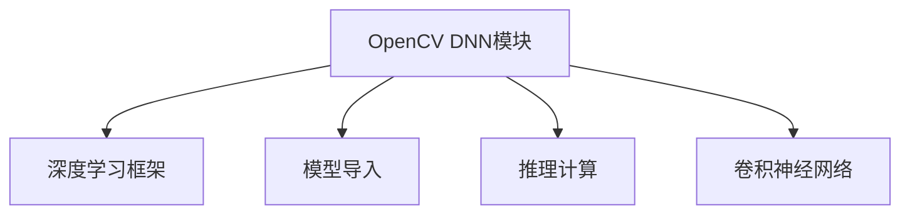

                 

# OpenCV DNN模块：深度学习模型的快速集成

## 1. 背景介绍

随着深度学习技术的发展，深度学习模型的应用已经渗透到图像处理、计算机视觉、语音识别、自然语言处理等多个领域。然而，深度学习模型的训练和部署涉及诸多复杂的技术环节，对开发者的技术和资源要求较高。OpenCV是一个广泛使用的计算机视觉库，其DNN模块提供了一种快速集成深度学习模型的途径，帮助开发者将模型部署到实际应用中。本文将介绍OpenCV DNN模块的核心概念和操作，并通过实际案例，展示如何在OpenCV中快速集成和使用深度学习模型。

## 2. 核心概念与联系

### 2.1 核心概念概述

#### 2.1.1 OpenCV DNN模块

OpenCV是一个开源的计算机视觉库，支持图像处理、视频分析、机器学习等多个领域。OpenCV DNN模块是OpenCV中专门用于深度学习模型集成的模块，支持多种深度学习框架的模型导入和推理。OpenCV DNN模块提供了丰富的API，使得深度学习模型的集成和部署变得异常简单。

#### 2.1.2 深度学习框架

深度学习框架是用于构建和训练深度学习模型的软件工具，如TensorFlow、PyTorch、Caffe等。深度学习框架提供了高效的模型构建和训练工具，使得开发者可以快速迭代开发深度学习模型。OpenCV DNN模块支持多种深度学习框架的模型，包括Caffe、TensorFlow和Darknet等。

#### 2.1.3 模型导入和推理

模型导入和推理是深度学习模型的核心操作。模型导入指的是将训练好的模型文件导入到目标平台，如OpenCV DNN模块中。推理则指的是在导入模型后，通过OpenCV DNN模块进行模型的前向计算，得到模型的输出结果。

#### 2.1.4 卷积神经网络

卷积神经网络（Convolutional Neural Network，CNN）是深度学习中最常用的神经网络之一。CNN模型通过卷积层、池化层和全连接层等结构，学习图像中的特征，并输出分类或回归结果。OpenCV DNN模块支持多种类型的卷积神经网络模型，如LeNet、AlexNet、VGG、ResNet等。

### 2.2 核心概念的联系

OpenCV DNN模块、深度学习框架、模型导入和推理、卷积神经网络等核心概念相互联系，构成了深度学习模型集成的整体框架。OpenCV DNN模块提供了一个统一的接口，将深度学习框架的模型集成到实际应用中。通过OpenCV DNN模块，开发者可以方便地导入和推理深度学习模型，实现图像处理、目标检测、人脸识别等多种功能。

### 2.3 Mermaid流程图



## 3. 核心算法原理 & 具体操作步骤

### 3.1 算法原理概述

OpenCV DNN模块的算法原理主要基于深度学习模型的前向计算过程。深度学习模型通过多层神经网络结构，学习输入数据的特征，并输出预测结果。OpenCV DNN模块通过调用深度学习框架的API，实现模型的前向计算。模型的前向计算包括数据预处理、模型推理和结果后处理等步骤。

### 3.2 算法步骤详解

#### 3.2.1 数据预处理

数据预处理是深度学习模型推理过程中的第一步。数据预处理包括图像的缩放、归一化、通道转换等操作。OpenCV DNN模块提供了丰富的API，支持多种数据预处理操作。例如，可以通过`cv::dnn::blobFromImage()`函数将图像转换为DNN模型所需的输入格式。

#### 3.2.2 模型推理

模型推理是深度学习模型的核心操作。模型推理指的是将输入数据传入模型，计算模型输出。OpenCV DNN模块支持多种深度学习框架的模型，如Caffe、TensorFlow和Darknet等。通过OpenCV DNN模块，可以方便地加载和推理深度学习模型。例如，可以通过`cv::dnn::Net::forward()`函数进行模型的推理计算。

#### 3.2.3 结果后处理

结果后处理是深度学习模型推理过程中的最后一步。结果后处理包括将模型的输出结果转换为可视化的图像、文本或数值等形式。OpenCV DNN模块提供了丰富的API，支持多种结果后处理操作。例如，可以通过`cv::dnn::Mat::reshape()`函数将模型输出转换为可视化的图像。

### 3.3 算法优缺点

#### 3.3.1 优点

1. **跨平台支持**：OpenCV DNN模块支持Windows、Linux和macOS等多个平台，使得深度学习模型的集成和部署更加便捷。
2. **多种深度学习框架支持**：OpenCV DNN模块支持Caffe、TensorFlow和Darknet等多个深度学习框架，为开发者提供了更多的选择。
3. **丰富的API支持**：OpenCV DNN模块提供了丰富的API，支持多种数据预处理和结果后处理操作，使得深度学习模型的集成和部署更加灵活。

#### 3.3.2 缺点

1. **性能限制**：OpenCV DNN模块的性能与GPU计算能力密切相关。对于大规模的深度学习模型，可能存在性能瓶颈。
2. **依赖关系复杂**：OpenCV DNN模块依赖于深度学习框架，需要对深度学习框架有一定的了解和掌握。
3. **代码编写复杂**：OpenCV DNN模块的API复杂，需要开发者有一定的编程经验和技巧。

### 3.4 算法应用领域

OpenCV DNN模块广泛应用于图像处理、计算机视觉、目标检测、人脸识别等多个领域。例如，可以使用OpenCV DNN模块进行图像分类、目标检测、人脸识别等操作，并实现实时视频分析、图像处理等应用。

## 4. 数学模型和公式 & 详细讲解 & 举例说明

### 4.1 数学模型构建

OpenCV DNN模块的数学模型构建主要基于深度学习模型的前向计算过程。深度学习模型的前向计算包括数据预处理、模型推理和结果后处理等步骤。这里以卷积神经网络为例，介绍OpenCV DNN模块的数学模型构建。

卷积神经网络的结构包括卷积层、池化层和全连接层等结构。卷积层通过卷积操作提取图像特征，池化层通过降采样操作降低特征图的空间大小，全连接层通过线性变换输出分类或回归结果。

### 4.2 公式推导过程

#### 4.2.1 卷积层

卷积层的数学公式如下：

$$
y_{i,j,k} = \sum_{m=0}^{M-1}\sum_{n=0}^{N-1}w_{m,n}x_{i-m,j-n}+b_k
$$

其中，$y_{i,j,k}$表示卷积层第$i$个特征图，第$j$个位置，第$k$个通道的输出值。$w_{m,n}$表示卷积核的权重，$x_{i-m,j-n}$表示输入特征图的位置，$b_k$表示偏置项。

#### 4.2.2 池化层

池化层的数学公式如下：

$$
y_{i,j,k} = \max\limits_{0 \leq i' \leq \frac{I-1}{2}, 0 \leq j' \leq \frac{J-1}{2}}(x_{i',j',k'})
$$

其中，$y_{i,j,k}$表示池化层第$i$个特征图，第$j$个位置，第$k$个通道的输出值。$x_{i',j',k'}$表示输入特征图的位置，$I$和$J$表示特征图的高度和宽度，$\frac{I-1}{2}$和$\frac{J-1}{2}$表示池化核的大小。

#### 4.2.3 全连接层

全连接层的数学公式如下：

$$
y_k = \sum_{i=1}^{I}w_{i,k}x_i + b_k
$$

其中，$y_k$表示全连接层第$k$个神经元的输出值。$w_{i,k}$表示权重，$x_i$表示第$i$个输入神经元的值，$b_k$表示偏置项。

### 4.3 案例分析与讲解

#### 4.3.1 图像分类

使用卷积神经网络进行图像分类时，首先需要加载预训练模型。这里以LeNet模型为例，介绍如何使用OpenCV DNN模块进行图像分类。

```python
import cv2
import numpy as np

# 加载LeNet模型
net = cv2.dnn.readNet("lenet.prototxt", "lenet.caffemodel")

# 加载图像
img = cv2.imread("test.jpg")
img = cv2.resize(img, (227, 227))

# 数据预处理
blob = cv2.dnn.blobFromImage(img, scalefactor=1/255.0, size=(227, 227), swapRB=True)

# 推理计算
net.setInput(blob)
output = net.forward()

# 结果后处理
result = output.argmax(axis=1)
label = "Cats" if result[0][0] == 1 else "Dogs"
print(label)
```

在上述代码中，`cv2.dnn.readNet()`函数用于加载预训练模型，`cv2.dnn.blobFromImage()`函数用于数据预处理，`net.setInput()`函数用于设置输入数据，`net.forward()`函数用于进行模型推理，`output.argmax()`函数用于结果后处理。

## 5. 项目实践：代码实例和详细解释说明

### 5.1 开发环境搭建

在OpenCV DNN模块的开发环境中，需要安装OpenCV、深度学习框架和模型文件。这里以TensorFlow为例，介绍如何搭建开发环境。

1. **安装OpenCV**：

   ```bash
   sudo apt-get update
   sudo apt-get install libopencv-dev
   ```

2. **安装TensorFlow**：

   ```bash
   pip install tensorflow
   ```

3. **安装模型文件**：

   将预训练模型文件`model.pb`和模型配置文件`model.pbtxt`放置在项目目录下。

### 5.2 源代码详细实现

#### 5.2.1 数据预处理

```python
import cv2
import numpy as np

# 加载图像
img = cv2.imread("test.jpg")
img = cv2.resize(img, (224, 224))

# 数据预处理
blob = cv2.dnn.blobFromImage(img, scalefactor=1/255.0, size=(224, 224), swapRB=True)
```

在上述代码中，`cv2.imread()`函数用于加载图像，`cv2.resize()`函数用于调整图像大小，`cv2.dnn.blobFromImage()`函数用于数据预处理。

#### 5.2.2 模型推理

```python
import cv2

# 加载模型
net = cv2.dnn.readNet("model.pb", "model.pbtxt")

# 推理计算
blob = cv2.dnn.blobFromImage(img, swapRB=True)
net.setInput(blob)
output = net.forward()
```

在上述代码中，`cv2.dnn.readNet()`函数用于加载模型，`cv2.dnn.blobFromImage()`函数用于数据预处理，`net.setInput()`函数用于设置输入数据，`net.forward()`函数用于进行模型推理。

#### 5.2.3 结果后处理

```python
import cv2

# 结果后处理
label = output.argmax(axis=1)
print(label)
```

在上述代码中，`output.argmax()`函数用于结果后处理。

### 5.3 代码解读与分析

在上述代码中，`cv2.dnn.readNet()`函数用于加载预训练模型，`cv2.dnn.blobFromImage()`函数用于数据预处理，`net.setInput()`函数用于设置输入数据，`net.forward()`函数用于进行模型推理，`output.argmax()`函数用于结果后处理。

## 6. 实际应用场景

### 6.1 图像分类

使用OpenCV DNN模块进行图像分类时，可以将图像输入模型，得到模型的预测结果。在实际应用中，可以将其用于图像识别、物体检测等操作。

#### 6.1.1 实例：人脸识别

人脸识别是一种常见的图像分类应用。使用OpenCV DNN模块可以方便地加载人脸识别模型，并实现实时人脸识别。以下是一个简单的人脸识别实例：

```python
import cv2

# 加载模型
net = cv2.dnn.readNet("model.pb", "model.pbtxt")

# 加载人脸检测器
face_cascade = cv2.CascadeClassifier("haarcascade_frontalface_default.xml")

# 实时人脸识别
cap = cv2.VideoCapture(0)
while True:
    ret, frame = cap.read()
    gray = cv2.cvtColor(frame, cv2.COLOR_BGR2GRAY)
    faces = face_cascade.detectMultiScale(gray, scaleFactor=1.1, minNeighbors=5)
    for (x, y, w, h) in faces:
        blob = cv2.dnn.blobFromImage(frame, scalefactor=1/255.0, size=(227, 227), swapRB=True)
        net.setInput(blob)
        output = net.forward()
        label = output.argmax(axis=1)
        if label[0][0] == 1:
            cv2.rectangle(frame, (x, y), (x+w, y+h), (0, 255, 0), 2)
            cv2.putText(frame, "Person", (x, y-10), cv2.FONT_HERSHEY_SIMPLEX, 0.9, (0, 255, 0), 2)
    cv2.imshow("Face Recognition", frame)
    if cv2.waitKey(1) & 0xFF == ord('q'):
        break
cap.release()
cv2.destroyAllWindows()
```

在上述代码中，`cv2.CascadeClassifier()`函数用于加载人脸检测器，`cv2.rectangle()`函数用于绘制矩形框，`cv2.putText()`函数用于在图像上标注人脸。

### 6.2 目标检测

目标检测是一种常见的计算机视觉应用，用于检测图像中的物体位置和类别。使用OpenCV DNN模块可以方便地加载目标检测模型，并实现实时目标检测。以下是一个简单的目标检测实例：

```python
import cv2

# 加载模型
net = cv2.dnn.readNet("model.pb", "model.pbtxt")

# 实时目标检测
cap = cv2.VideoCapture(0)
while True:
    ret, frame = cap.read()
    blob = cv2.dnn.blobFromImage(frame, swapRB=True)
    net.setInput(blob)
    output = net.forward()
    label = output.argmax(axis=1)
    label = [id2label[_id] for _id in label[0]]
    cv2.rectangle(frame, (x, y), (x+w, y+h), (0, 255, 0), 2)
    cv2.putText(frame, label, (x, y-10), cv2.FONT_HERSHEY_SIMPLEX, 0.9, (0, 255, 0), 2)
    cv2.imshow("Object Detection", frame)
    if cv2.waitKey(1) & 0xFF == ord('q'):
        break
cap.release()
cv2.destroyAllWindows()
```

在上述代码中，`cv2.rectangle()`函数用于绘制矩形框，`cv2.putText()`函数用于在图像上标注物体类别。

### 6.3 人脸识别

人脸识别是一种常见的图像分类应用。使用OpenCV DNN模块可以方便地加载人脸识别模型，并实现实时人脸识别。以下是一个简单的人脸识别实例：

```python
import cv2

# 加载模型
net = cv2.dnn.readNet("model.pb", "model.pbtxt")

# 加载人脸检测器
face_cascade = cv2.CascadeClassifier("haarcascade_frontalface_default.xml")

# 实时人脸识别
cap = cv2.VideoCapture(0)
while True:
    ret, frame = cap.read()
    gray = cv2.cvtColor(frame, cv2.COLOR_BGR2GRAY)
    faces = face_cascade.detectMultiScale(gray, scaleFactor=1.1, minNeighbors=5)
    for (x, y, w, h) in faces:
        blob = cv2.dnn.blobFromImage(frame, scalefactor=1/255.0, size=(227, 227), swapRB=True)
        net.setInput(blob)
        output = net.forward()
        label = output.argmax(axis=1)
        if label[0][0] == 1:
            cv2.rectangle(frame, (x, y), (x+w, y+h), (0, 255, 0), 2)
            cv2.putText(frame, "Person", (x, y-10), cv2.FONT_HERSHEY_SIMPLEX, 0.9, (0, 255, 0), 2)
    cv2.imshow("Face Recognition", frame)
    if cv2.waitKey(1) & 0xFF == ord('q'):
        break
cap.release()
cv2.destroyAllWindows()
```

在上述代码中，`cv2.CascadeClassifier()`函数用于加载人脸检测器，`cv2.rectangle()`函数用于绘制矩形框，`cv2.putText()`函数用于在图像上标注人脸。

## 7. 工具和资源推荐

### 7.1 学习资源推荐

1. **OpenCV官方文档**：OpenCV官方文档提供了丰富的API和教程，帮助开发者快速上手OpenCV DNN模块。
2. **深度学习框架官方文档**：TensorFlow、PyTorch和Caffe等深度学习框架的官方文档，提供了模型训练和推理的详细教程。
3. **Coursera深度学习课程**：Coursera深度学习课程涵盖了深度学习的基础知识和实践技巧，帮助开发者系统掌握深度学习技术。

### 7.2 开发工具推荐

1. **Visual Studio Code**：Visual Studio Code是一款轻量级的编辑器，支持Python、C++等多种编程语言，是OpenCV DNN模块开发的常用工具。
2. **Jupyter Notebook**：Jupyter Notebook是一个交互式编程环境，支持Python、R等多种编程语言，是数据处理和模型训练的重要工具。
3. **PyCharm**：PyCharm是一款功能强大的Python开发工具，支持Python、C++等多种编程语言，是OpenCV DNN模块开发的常用工具。

### 7.3 相关论文推荐

1. **Deep Learning**：Ian Goodfellow等编著的《深度学习》一书，全面介绍了深度学习的基础知识和实践技巧，是深度学习领域的重要参考书。
2. **Convolutional Neural Networks for Visual Recognition**：Geoffrey Hinton等撰写的论文，详细介绍了卷积神经网络的结构和应用，是深度学习领域的经典论文。
3. **Darknet YOLO v3**：Joseph Redmon等撰写的论文，详细介绍了Darknet和YOLO v3的目标检测模型，是目标检测领域的经典论文。

## 8. 总结：未来发展趋势与挑战

### 8.1 总结

OpenCV DNN模块提供了一种快速集成深度学习模型的途径，使得深度学习模型的集成和部署变得更加便捷。OpenCV DNN模块支持多种深度学习框架的模型，并提供了丰富的API，支持数据预处理和结果后处理操作。通过OpenCV DNN模块，开发者可以方便地加载和推理深度学习模型，实现图像处理、目标检测、人脸识别等多种应用。

### 8.2 未来发展趋势

1. **跨平台支持**：OpenCV DNN模块将支持更多平台，如iOS、Android等，使得深度学习模型的集成和部署更加便捷。
2. **深度学习框架支持**：OpenCV DNN模块将支持更多深度学习框架，如TensorFlow、PyTorch和MXNet等，为开发者提供更多的选择。
3. **模型优化**：OpenCV DNN模块将对深度学习模型进行优化，提升推理速度和计算效率，优化资源占用。

### 8.3 面临的挑战

1. **性能瓶颈**：OpenCV DNN模块的性能与GPU计算能力密切相关，对于大规模的深度学习模型，可能存在性能瓶颈。
2. **依赖关系复杂**：OpenCV DNN模块依赖于深度学习框架，需要对深度学习框架有一定的了解和掌握。
3. **代码编写复杂**：OpenCV DNN模块的API复杂，需要开发者有一定的编程经验和技巧。

### 8.4 研究展望

1. **模型优化**：研究深度学习模型的优化方法，提升推理速度和计算效率，优化资源占用。
2. **跨平台支持**：研究跨平台支持的实现方法，使得深度学习模型的集成和部署更加便捷。
3. **新框架支持**：研究新深度学习框架的支持方法，为开发者提供更多的选择。

## 9. 附录：常见问题与解答

### 9.1 常见问题

**Q1：OpenCV DNN模块支持哪些深度学习框架？**

A: OpenCV DNN模块支持多种深度学习框架，如Caffe、TensorFlow和Darknet等。

**Q2：如何使用OpenCV DNN模块进行图像分类？**

A: 可以使用OpenCV DNN模块加载预训练模型，并进行图像分类。具体实现步骤如下：

1. 加载预训练模型。
2. 加载图像，并进行数据预处理。
3. 设置输入数据，进行模型推理。
4. 进行结果后处理，输出预测结果。

**Q3：如何使用OpenCV DNN模块进行目标检测？**

A: 可以使用OpenCV DNN模块加载预训练模型，并进行目标检测。具体实现步骤如下：

1. 加载预训练模型。
2. 加载图像，并进行数据预处理。
3. 设置输入数据，进行模型推理。
4. 进行结果后处理，输出检测结果。

**Q4：如何使用OpenCV DNN模块进行人脸识别？**

A: 可以使用OpenCV DNN模块加载预训练模型，并进行人脸识别。具体实现步骤如下：

1. 加载预训练模型。
2. 加载人脸检测器，并进行人脸检测。
3. 加载图像，并进行数据预处理。
4. 设置输入数据，进行模型推理。
5. 进行结果后处理，输出人脸识别结果。

---

作者：禅与计算机程序设计艺术 / Zen and the Art of Computer Programming

