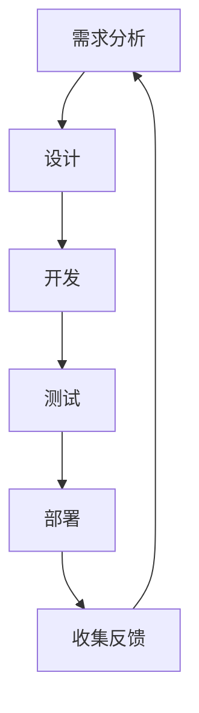

                 

# PDCA循环与管理持续改进的关系

## 1. 背景介绍

在现代企业的管理中，PDCA循环（Plan-Do-Check-Act）被广泛认为是提高效率和质量的重要工具。PDCA循环是由美国统计学家沃特·A·休哈特（Walter A. Shewhart）在1930年代首次提出的，并在1950年代由爱德华·戴明（W. Edwards Deming）在日本推广，从而被全球企业广泛采用。

PDCA循环不仅适用于制造业和工程领域，也逐渐在IT项目管理和软件工程中得到了应用。在IT领域，PDCA循环被认为是实现持续改进的最佳实践之一。在敏捷开发、DevOps、持续集成/持续交付（CI/CD）等实践中的使用，PDCA循环帮助企业实现更快的反馈、更快的迭代和更高的质量。

尽管PDCA循环已经应用于多个领域，但其在IT领域的应用常常被忽略。本文将详细探讨PDCA循环在IT项目管理和软件工程中的作用，并探讨其与管理持续改进的关系。

## 2. 核心概念与联系

### 2.1 核心概念概述

为更好地理解PDCA循环，首先介绍其核心概念：

- PDCA循环：一个持续改进的框架，通过四个步骤（计划、执行、检查、行动）来反复迭代，以实现目标的逐步优化。
- 计划（Plan）：定义目标、制定策略、分配资源、制定行动计划。
- 执行（Do）：根据计划执行行动，实施变革。
- 检查（Check）：评估实施效果，收集反馈信息。
- 行动（Act）：根据检查结果，采取必要的纠正措施，确认效果并巩固成功，规划下一步行动。

在IT项目管理和软件工程中，PDCA循环的四个步骤可以转化为软件开发周期的各个阶段，如需求分析、设计、开发、测试、部署等。通过PDCA循环，可以确保每个阶段的输出都符合预期，并在整个软件开发周期中持续优化。

### 2.2 核心概念原理和架构的 Mermaid 流程图



这个流程图展示了PDCA循环在IT项目管理中的应用。需求分析、设计、开发、测试、部署五个阶段构成了一个PDCA循环，而收集反馈作为行动阶段，又为下一个PDCA循环提供了数据支撑。

## 3. 核心算法原理 & 具体操作步骤

### 3.1 算法原理概述

PDCA循环的基本原理是持续反馈和不断改进。通过计划、执行、检查、行动四个步骤，企业可以及时发现问题并加以改进，从而逐步提升项目质量和效率。在IT项目管理和软件工程中，PDCA循环的核心思想是：

- **计划（Plan）**：明确项目目标和需求，制定详细的实施计划。
- **执行（Do）**：根据计划执行任务，确保代码实现符合预期。
- **检查（Check）**：评估代码质量，发现问题并进行调试。
- **行动（Act）**：根据检查结果，优化代码，总结经验教训，规划下一步行动。

通过这样的循环，每个阶段的目标和任务都得到了明确，问题得到了及时解决，从而确保项目的成功交付。

### 3.2 算法步骤详解

以下是PDCA循环在IT项目管理中的应用详细步骤：

**Step 1: 计划（Plan）**

- **目标设定**：明确项目目标和需求，确保团队对目标有共同的理解。
- **需求分析**：详细分析项目需求，定义功能需求和非功能需求。
- **设计方案**：根据需求设计软件架构、组件划分和接口定义。
- **制定计划**：制定详细的项目计划，包括时间表、资源分配和里程碑。
- **风险评估**：识别项目风险并制定应对策略。

**Step 2: 执行（Do）**

- **开发任务**：根据设计方案，进行编码实现。
- **测试任务**：编写单元测试、集成测试和系统测试用例。
- **代码评审**：通过代码评审发现和解决潜在问题。
- **版本控制**：使用版本控制系统记录代码变更。
- **自动化构建**：使用自动化工具构建和部署代码。

**Step 3: 检查（Check）**

- **代码审查**：对代码进行审查，确保代码质量。
- **测试结果**：执行测试用例，验证代码功能是否符合预期。
- **性能测试**：测试系统性能，确保满足性能要求。
- **安全审计**：进行安全审计，确保系统安全。
- **客户反馈**：收集客户反馈，确认需求是否满足。

**Step 4: 行动（Act）**

- **缺陷修复**：根据测试结果和代码审查，修复代码中的缺陷。
- **性能优化**：根据性能测试结果，优化系统性能。
- **安全加固**：根据安全审计结果，加固系统安全。
- **客户沟通**：根据客户反馈，调整需求或提供解决方案。
- **文档更新**：更新相关文档和知识库，为下一步项目积累经验。

通过这样的PDCA循环，项目团队可以不断优化项目质量，确保项目成功交付。

### 3.3 算法优缺点

PDCA循环在IT项目管理中的优点包括：

- **促进持续改进**：通过不断的计划、执行、检查和行动，逐步提升项目质量和效率。
- **增强团队协作**：明确的目标和详细的计划使得团队协作更加顺畅。
- **提高项目管理效率**：通过自动化工具和持续反馈，加快项目进度。
- **降低风险**：在每个阶段进行检查和评估，及早发现和解决问题，降低项目风险。

同时，PDCA循环也存在一些缺点：

- **流程繁琐**：每个阶段都需要详细的计划和检查，流程较为繁琐。
- **灵活性不足**：在执行阶段可能遇到意外情况，需要调整计划，增加灵活性。
- **资源消耗**：需要投入大量资源进行代码审查、测试等，成本较高。

尽管存在这些缺点，但PDCA循环的优点远大于缺点，特别是对于复杂的大型项目，PDCA循环是不可或缺的管理工具。

### 3.4 算法应用领域

PDCA循环不仅适用于传统的制造业和工程领域，在IT项目管理和软件工程中也得到了广泛应用。以下是PDCA循环在IT领域的具体应用：

- **敏捷开发**：敏捷开发方法本身就是一个PDCA循环的实例。每个迭代周期（Sprint）就是一个完整的PDCA循环，通过持续反馈和不断改进，逐步提升产品质量。
- **持续集成/持续交付（CI/CD）**：CI/CD通过自动化测试和部署，每个代码变更都是一个PDCA循环，通过持续反馈和不断改进，确保软件交付的高质量和高效能。
- **DevOps**：DevOps将开发和运维紧密结合，每个部署和监控周期都是一个PDCA循环，通过持续反馈和不断改进，提升系统的稳定性和可靠性。
- **项目管理**：项目管理中的每个阶段（如需求分析、设计、开发、测试、部署等）都可以通过PDCA循环进行优化，确保项目成功交付。
- **系统维护**：系统维护过程中，通过PDCA循环不断检查和优化系统性能和安全，确保系统的长期稳定运行。

## 4. 数学模型和公式 & 详细讲解 & 举例说明

### 4.1 数学模型构建

在IT项目管理中，PDCA循环的四个步骤可以用以下数学模型来描述：

设项目周期为 $T$，目标函数为 $F$，需求函数为 $D$，设计函数为 $D$，开发函数为 $D$，测试函数为 $T$，部署函数为 $D$，反馈函数为 $F$。则PDCA循环的数学模型可以表示为：

$$
F = \max_{D, D, T, D} F(D, D, T, D)
$$

其中 $F$ 为目标函数，$D$ 为需求函数，$T$ 为测试函数，$D$ 为设计函数，$D$ 为开发函数，$D$ 为部署函数。

### 4.2 公式推导过程

通过对目标函数 $F$ 进行优化，可以逐步提升项目的质量和效率。具体推导过程如下：

1. **目标设定**：根据客户需求，定义目标函数 $F$，即 $F = \sum_{i=1}^n w_i f_i$，其中 $w_i$ 为权值，$f_i$ 为功能点。
2. **需求分析**：通过市场调研和客户需求分析，定义需求函数 $D = \sum_{i=1}^m g_i d_i$，其中 $g_i$ 为需求项权重，$d_i$ 为需求项。
3. **设计方案**：根据需求函数 $D$，设计软件架构和组件划分，定义设计函数 $D = \sum_{i=1}^k h_i d_i$，其中 $h_i$ 为设计项权重，$d_i$ 为设计项。
4. **制定计划**：根据设计函数 $D$，制定详细项目计划，定义开发函数 $D = \sum_{i=1}^p j_i d_i$，其中 $j_i$ 为开发任务权重，$d_i$ 为开发任务。
5. **风险评估**：识别项目风险，定义风险函数 $R = \sum_{i=1}^q k_i r_i$，其中 $k_i$ 为风险项权重，$r_i$ 为风险项。
6. **执行**：根据计划执行任务，定义测试函数 $T = \sum_{i=1}^s l_i t_i$，其中 $l_i$ 为测试项权重，$t_i$ 为测试项。
7. **代码评审**：通过代码评审发现和解决潜在问题，定义评审函数 $C = \sum_{i=1}^u v_i c_i$，其中 $v_i$ 为评审项权重，$c_i$ 为评审项。
8. **自动化构建**：使用自动化工具构建和部署代码，定义构建函数 $B = \sum_{i=1}^w x_i b_i$，其中 $x_i$ 为构建任务权重，$b_i$ 为构建任务。
9. **检查**：评估代码质量，定义检查函数 $J = \sum_{i=1}^y z_i j_i$，其中 $z_i$ 为检查项权重，$j_i$ 为检查项。
10. **性能测试**：测试系统性能，定义性能函数 $P = \sum_{i=1}^a m_i p_i$，其中 $m_i$ 为性能项权重，$p_i$ 为性能项。
11. **安全审计**：进行安全审计，定义安全函数 $S = \sum_{i=1}^b n_i s_i$，其中 $n_i$ 为安全项权重，$s_i$ 为安全项。
12. **客户反馈**：收集客户反馈，定义反馈函数 $F = \sum_{i=1}^c o_i f_i$，其中 $o_i$ 为反馈项权重，$f_i$ 为反馈项。
13. **缺陷修复**：根据测试结果和代码审查，修复代码中的缺陷，定义修复函数 $R = \sum_{i=1}^d p_i r_i$，其中 $p_i$ 为修复项权重，$r_i$ 为修复项。
14. **性能优化**：根据性能测试结果，优化系统性能，定义优化函数 $O = \sum_{i=1}^e q_i o_i$，其中 $q_i$ 为优化项权重，$o_i$ 为优化项。
15. **安全加固**：根据安全审计结果，加固系统安全，定义加固函数 $G = \sum_{i=1}^f r_i g_i$，其中 $r_i$ 为加固项权重，$g_i$ 为加固项。
16. **客户沟通**：根据客户反馈，调整需求或提供解决方案，定义沟通函数 $C = \sum_{i=1}^h t_i c_i$，其中 $t_i$ 为沟通项权重，$c_i$ 为沟通项。
17. **文档更新**：更新相关文档和知识库，定义文档函数 $D = \sum_{i=1}^i u_i d_i$，其中 $u_i$ 为文档项权重，$d_i$ 为文档项。

通过上述数学模型和公式推导，可以清晰地看到PDCA循环在IT项目管理中的作用，通过不断的计划、执行、检查和行动，逐步提升项目质量和效率。

### 4.3 案例分析与讲解

以下是PDCA循环在IT项目管理中的一个实际案例：

**案例背景**：某公司开发一款在线教育平台，需要开发一个用户管理系统。项目周期为6个月，团队成员包括产品经理、UI/UX设计师、前端开发工程师、后端开发工程师、测试工程师和安全工程师。

**计划（Plan）阶段**：

1. **目标设定**：平台用户管理系统需要具备用户注册、登录、信息修改、权限控制等功能。
2. **需求分析**：定义功能需求和非功能需求，如高可用性、安全性、易用性等。
3. **设计方案**：设计软件架构，包括用户模块、权限模块、日志模块等。
4. **制定计划**：制定详细项目计划，包括时间表、资源分配和里程碑。
5. **风险评估**：识别项目风险，如技术风险、安全风险等。

**执行（Do）阶段**：

1. **开发任务**：根据设计方案，进行编码实现。
2. **测试任务**：编写单元测试、集成测试和系统测试用例。
3. **代码评审**：通过代码评审发现和解决潜在问题。
4. **版本控制**：使用版本控制系统记录代码变更。
5. **自动化构建**：使用自动化工具构建和部署代码。

**检查（Check）阶段**：

1. **代码审查**：对代码进行审查，确保代码质量。
2. **测试结果**：执行测试用例，验证代码功能是否符合预期。
3. **性能测试**：测试系统性能，确保满足性能要求。
4. **安全审计**：进行安全审计，确保系统安全。
5. **客户反馈**：收集客户反馈，确认需求是否满足。

**行动（Act）阶段**：

1. **缺陷修复**：根据测试结果和代码审查，修复代码中的缺陷。
2. **性能优化**：根据性能测试结果，优化系统性能。
3. **安全加固**：根据安全审计结果，加固系统安全。
4. **客户沟通**：根据客户反馈，调整需求或提供解决方案。
5. **文档更新**：更新相关文档和知识库，为下一步项目积累经验。

通过这样的PDCA循环，项目团队可以不断优化项目质量，确保项目成功交付。

## 5. 项目实践：代码实例和详细解释说明

### 5.1 开发环境搭建

在进行PDCA循环实践前，我们需要准备好开发环境。以下是使用Python进行项目管理的环境配置流程：

1. 安装Anaconda：从官网下载并安装Anaconda，用于创建独立的Python环境。

2. 创建并激活虚拟环境：
```bash
conda create -n pdca-env python=3.8 
conda activate pdca-env
```

3. 安装必要的Python包：
```bash
pip install pandas numpy matplotlib jupyter notebook scikit-learn requests
```

4. 安装相关的项目管理工具：
```bash
pip install flask
```

完成上述步骤后，即可在`pdca-env`环境中开始PDCA循环实践。

### 5.2 源代码详细实现

以下是使用Python实现PDCA循环的项目管理工具的代码实现：

```python
import pandas as pd
import numpy as np
import matplotlib.pyplot as plt

class Project:
    def __init__(self, name, period):
        self.name = name
        self.period = period
        self.project_data = {'plan': [], 'do': [], 'check': [], 'act': []}
    
    def plan(self, tasks, resources):
        self.project_data['plan'].append(tasks)
        self.project_data['resources'].append(resources)
    
    def do(self, tasks, resources):
        self.project_data['do'].append(tasks)
        self.project_data['resources'].append(resources)
    
    def check(self, tasks, resources):
        self.project_data['check'].append(tasks)
        self.project_data['resources'].append(resources)
    
    def act(self, tasks, resources):
        self.project_data['act'].append(tasks)
        self.project_data['resources'].append(resources)
    
    def visualize(self):
        plt.figure(figsize=(10, 6))
        plt.plot(self.project_data['plan'], label='Plan')
        plt.plot(self.project_data['do'], label='Do')
        plt.plot(self.project_data['check'], label='Check')
        plt.plot(self.project_data['act'], label='Act')
        plt.legend()
        plt.title('PDCA Cycle')
        plt.xlabel('Time')
        plt.ylabel('Tasks')
        plt.show()
```

在上述代码中，我们定义了一个Project类，用于表示一个项目的管理过程。该类包含了计划（plan）、执行（do）、检查（check）和行动（act）四个阶段的方法，以及可视化项目管理进度的方法。

### 5.3 代码解读与分析

让我们再详细解读一下关键代码的实现细节：

**Project类**：
- `__init__`方法：初始化项目名称和周期，以及空的项目数据字典。
- `plan`方法：记录计划阶段的任务和资源。
- `do`方法：记录执行阶段的任务和资源。
- `check`方法：记录检查阶段的任务和资源。
- `act`方法：记录行动阶段的任务和资源。
- `visualize`方法：绘制项目管理进度图，展示项目的计划、执行、检查和行动阶段的任务量变化。

通过上述代码，我们可以看到PDCA循环在项目管理中的应用，每个阶段的任务和资源都得到了记录和可视化展示，便于项目团队及时调整和优化。

## 6. 实际应用场景

### 6.1 敏捷开发

敏捷开发方法本身就是PDCA循环的一种体现，通过迭代开发、持续反馈和不断改进，逐步提升软件质量和开发效率。在敏捷开发中，PDCA循环的具体应用包括：

- **需求分析**：在每个迭代周期（Sprint）开始时，通过计划阶段明确需求和目标。
- **设计方案**：在计划阶段制定详细的设计方案，并在执行阶段逐步实现。
- **代码评审**：在每个迭代周期结束后，进行代码评审，发现和解决潜在问题。
- **自动化测试**：在每个迭代周期结束后，进行自动化测试，确保代码质量。
- **持续集成**：在每个迭代周期结束后，进行持续集成，确保代码变更的及时集成和部署。
- **用户反馈**：在每个迭代周期结束后，收集用户反馈，并根据反馈进行相应的调整和改进。

通过敏捷开发中的PDCA循环，团队可以不断优化开发过程，提升软件质量和开发效率。

### 6.2 持续集成/持续交付（CI/CD）

CI/CD通过自动化测试和部署，每个代码变更都是一个PDCA循环，通过持续反馈和不断改进，确保软件交付的高质量和高效能。在CI/CD中，PDCA循环的具体应用包括：

- **代码变更**：在每次代码变更时，通过计划阶段定义变更的目标和任务。
- **自动化测试**：在计划阶段定义测试任务，并在执行阶段自动执行测试用例。
- **持续集成**：在执行阶段进行代码集成和构建，确保代码变更的及时集成和部署。
- **持续部署**：在执行阶段进行持续部署，确保软件的高可用性和稳定性。
- **性能测试**：在检查阶段进行性能测试，确保软件的性能符合预期。
- **用户反馈**：在检查阶段收集用户反馈，并根据反馈进行相应的调整和改进。

通过CI/CD中的PDCA循环，企业可以不断优化软件交付过程，确保软件的高质量和高效能。

### 6.3 DevOps

DevOps将开发和运维紧密结合，每个部署和监控周期都是一个PDCA循环，通过持续反馈和不断改进，提升系统的稳定性和可靠性。在DevOps中，PDCA循环的具体应用包括：

- **开发任务**：在计划阶段制定开发任务，并在执行阶段逐步实现。
- **自动化构建**：在执行阶段进行自动化构建，确保代码变更的及时集成和部署。
- **自动化测试**：在执行阶段进行自动化测试，确保代码质量。
- **持续集成**：在执行阶段进行持续集成，确保代码变更的及时集成和部署。
- **持续部署**：在执行阶段进行持续部署，确保软件的高可用性和稳定性。
- **监控和反馈**：在检查阶段进行监控和反馈，确保系统的稳定性和可靠性。
- **性能优化**：在行动阶段进行性能优化，确保系统的性能符合预期。
- **安全加固**：在行动阶段进行安全加固，确保系统的安全性。

通过DevOps中的PDCA循环，企业可以不断优化系统交付过程，提升系统的稳定性和可靠性。

### 6.4 未来应用展望

随着技术的发展和应用场景的扩大，PDCA循环在IT项目管理中的应用将更加广泛。以下是一些未来的应用展望：

- **自动化和智能化**：未来，PDCA循环将更多地结合自动化和智能化工具，如机器学习、自然语言处理等，实现更加高效的项目管理和持续改进。
- **跨项目协同**：随着企业规模的扩大，跨项目协同将成为项目管理的重要挑战。未来，PDCA循环将更多地结合跨项目协同工具，实现项目之间的知识共享和经验传递。
- **多维度评估**：未来，PDCA循环将更多地结合多维度的评估指标，如质量、成本、时间、资源等，实现更加全面的项目管理。
- **持续学习**：未来，PDCA循环将更多地结合持续学习工具，如知识管理、持续反馈等，实现项目团队和组织的持续成长和改进。

通过上述应用展望，可以看到PDCA循环在IT项目管理中的应用将更加深入和广泛。未来，PDCA循环将成为企业实现持续改进的重要工具。

## 7. 工具和资源推荐

### 7.1 学习资源推荐

为帮助开发者系统掌握PDCA循环在IT项目管理和软件工程中的应用，这里推荐一些优质的学习资源：

1. 《敏捷软件开发：原则、模式与实践》：书籍详细介绍了敏捷开发方法，以及PDCA循环在敏捷开发中的应用。
2. 《持续集成：一种软件工程实践》：书籍介绍了持续集成和持续交付的方法，以及PDCA循环在CI/CD中的应用。
3. 《DevOps实践指南》：书籍介绍了DevOps方法论，以及PDCA循环在DevOps中的应用。
4. 《项目管理：Principle and Practices》：书籍介绍了项目管理方法，以及PDCA循环在项目管理中的应用。
5. Coursera上的项目管理课程：Coursera提供了许多关于项目管理、敏捷开发、CI/CD等课程，涵盖PDCA循环在IT项目中的应用。

通过对这些资源的学习实践，相信你一定能够全面掌握PDCA循环在IT项目管理和软件工程中的应用，并在实际工作中取得更好的效果。

### 7.2 开发工具推荐

为提高PDCA循环在IT项目管理和软件工程中的应用效率，以下是几款推荐的开发工具：

1. JIRA：用于项目管理和需求跟踪的工具，支持敏捷开发和PDCA循环的灵活应用。
2. Trello：用于团队协作和项目管理，支持敏捷开发和PDCA循环的任务管理。
3. Confluence：用于知识管理和文档共享的工具，支持敏捷开发和PDCA循环的经验积累。
4. GitHub：用于版本控制和代码协作的工具，支持敏捷开发和PDCA循环的持续集成和持续部署。
5. Jenkins：用于持续集成和持续部署的工具，支持PDCA循环的自动化构建和测试。
6. Kubernetes：用于容器编排和部署的工具，支持PDCA循环的持续集成和持续部署。

通过使用这些工具，可以显著提升PDCA循环在IT项目管理和软件工程中的应用效率，实现项目的高效管理和持续改进。

### 7.3 相关论文推荐

PDCA循环在IT项目管理和软件工程中的应用是一个广泛的研究领域，以下是几篇奠基性的相关论文，推荐阅读：

1. "The Agile Manifesto"：1900年代末由Agile联盟发布的敏捷宣言，奠定了敏捷开发的基础。
2. "Continuous Delivery: Reliable Software Releases through Build, Test, and Deployment Automation"：Martin Fowler 的书籍介绍了持续集成和持续交付的方法，以及PDCA循环在CI/CD中的应用。
3. "DevOps Handbook"：Andy Kimball 和 Gene Kim 的书籍介绍了DevOps方法论，以及PDCA循环在DevOps中的应用。
4. "Project Management Body of Knowledge"：PMI的《项目管理知识体系指南》提供了项目管理方法和PDCA循环在项目管理中的应用。
5. "Lean Software Development: An Agile Toolbox for Developers"：Robert Martin 的书籍介绍了精益软件开发方法，以及PDCA循环在软件开发中的应用。

这些论文代表了PDCA循环在IT项目管理和软件工程中的研究进展，通过学习这些前沿成果，可以帮助研究者更好地理解PDCA循环的应用，推动其在实际项目中的应用。

## 8. 总结：未来发展趋势与挑战

### 8.1 研究成果总结

本文对PDCA循环在IT项目管理和软件工程中的应用进行了全面系统的介绍。首先阐述了PDCA循环的基本原理和步骤，明确了PDCA循环在IT项目管理中的重要性和应用场景。其次，通过数学模型和实际案例，详细讲解了PDCA循环的具体实现方法和应用效果。最后，总结了PDCA循环在敏捷开发、持续集成/持续交付（CI/CD）、DevOps等IT实践中的应用，并探讨了其未来的发展趋势和应用展望。

通过本文的系统梳理，可以看到，PDCA循环在IT项目管理中的应用已经非常广泛，通过不断的计划、执行、检查和行动，企业可以不断优化项目质量，确保项目成功交付。未来，随着技术的不断发展和应用场景的扩展，PDCA循环将在更多的IT实践中得到应用，成为企业实现持续改进的重要工具。

### 8.2 未来发展趋势

展望未来，PDCA循环在IT项目管理和软件工程中的应用将呈现以下几个发展趋势：

1. **自动化和智能化**：未来，PDCA循环将更多地结合自动化和智能化工具，如机器学习、自然语言处理等，实现更加高效的项目管理和持续改进。
2. **跨项目协同**：随着企业规模的扩大，跨项目协同将成为项目管理的重要挑战。未来，PDCA循环将更多地结合跨项目协同工具，实现项目之间的知识共享和经验传递。
3. **多维度评估**：未来，PDCA循环将更多地结合多维度的评估指标，如质量、成本、时间、资源等，实现更加全面的项目管理。
4. **持续学习**：未来，PDCA循环将更多地结合持续学习工具，如知识管理、持续反馈等，实现项目团队和组织的持续成长和改进。

### 8.3 面临的挑战

尽管PDCA循环在IT项目管理中的应用已经相当广泛，但仍面临一些挑战：

1. **复杂性管理**：大型项目的复杂性管理是PDCA循环面临的主要挑战之一。如何在复杂多变的项目环境中，有效地应用PDCA循环，是一个重要问题。
2. **资源消耗**：每个PDCA循环都需要投入大量资源进行计划、执行、检查和行动，资源消耗较大。如何在有限的资源下高效地应用PDCA循环，是一个需要解决的问题。
3. **文化和组织障碍**：PDCA循环的成功实施需要企业文化的支持，但在一些企业中，PDCA循环的应用仍然面临组织障碍和员工抵触。
4. **技术工具的局限性**：现有的项目管理工具和开发工具在应用PDCA循环时，可能存在功能不足、操作复杂等问题，需要不断优化和改进。

### 8.4 研究展望

面对PDCA循环面临的挑战，未来的研究需要在以下几个方面寻求新的突破：

1. **复杂性管理**：开发更复杂项目的PDCA循环管理方法，提高项目的可管理性和可控性。
2. **资源优化**：通过优化PDCA循环的各个阶段，减少资源消耗，提高资源利用率。
3. **组织变革**：通过文化建设和组织变革，提升企业对PDCA循环的认可度和接受度。
4. **工具创新**：开发更高效、易用的项目管理工具和开发工具，支持PDCA循环的顺利实施。

这些研究方向将推动PDCA循环在IT项目管理和软件工程中的应用，提升项目的质量和效率，促进企业的持续发展。

## 9. 附录：常见问题与解答

**Q1：PDCA循环的四个步骤（计划、执行、检查、行动）分别是什么？**

A: PDCA循环的四个步骤分别为：

- **计划（Plan）**：定义目标、制定策略、分配资源、制定行动计划。
- **执行（Do）**：根据计划执行行动，实施变革。
- **检查（Check）**：评估实施效果，收集反馈信息。
- **行动（Act）**：根据检查结果，采取必要的纠正措施，确认效果并规划下一步行动。

**Q2：PDCA循环在IT项目管理中的应用有哪些？**

A: PDCA循环在IT项目管理中的应用包括：

- **敏捷开发**：通过迭代开发、持续反馈和不断改进，逐步提升软件质量和开发效率。
- **持续集成/持续交付（CI/CD）**：通过自动化测试和部署，每个代码变更都是一个PDCA循环，实现软件交付的高质量和高效能。
- **DevOps**：将开发和运维紧密结合，通过持续反馈和不断改进，提升系统的稳定性和可靠性。
- **项目管理**：每个阶段（如需求分析、设计、开发、测试、部署等）都可以通过PDCA循环进行优化，确保项目成功交付。
- **系统维护**：通过PDCA循环不断检查和优化系统性能和安全，确保系统的长期稳定运行。

**Q3：PDCA循环的优点和缺点是什么？**

A: PDCA循环的优点包括：

- **促进持续改进**：通过不断的计划、执行、检查和行动，逐步提升项目质量和效率。
- **增强团队协作**：明确的目标和详细的计划使得团队协作更加顺畅。
- **提高项目管理效率**：通过自动化工具和持续反馈，加快项目进度。
- **降低风险**：在每个阶段进行检查和评估，及早发现和解决问题，降低项目风险。

PDCA循环的缺点包括：

- **流程繁琐**：每个阶段都需要详细的计划和检查，流程较为繁琐。
- **灵活性不足**：在执行阶段可能遇到意外情况，需要调整计划，增加灵活性。
- **资源消耗**：需要投入大量资源进行代码审查、测试等，成本较高。

**Q4：如何在IT项目中应用PDCA循环？**

A: 在IT项目中应用PDCA循环，可以遵循以下步骤：

1. **计划（Plan）**：明确项目目标和需求，制定详细的实施计划，包括时间表、资源分配和里程碑。
2. **执行（Do）**：根据计划执行任务，确保代码实现符合预期。
3. **检查（Check）**：评估代码质量，发现和解决问题，进行自动化测试和安全审计。
4. **行动（Act）**：根据检查结果，采取必要的纠正措施，优化代码，收集客户反馈，更新文档和知识库。

通过这样的PDCA循环，可以不断优化项目质量，确保项目成功交付。

**Q5：PDCA循环在敏捷开发中的应用是什么？**

A: 在敏捷开发中，PDCA循环的应用包括：

- **需求分析**：在每个迭代周期（Sprint）开始时，通过计划阶段明确需求和目标。
- **设计方案**：在计划阶段制定详细的设计方案，并在执行阶段逐步实现。
- **代码评审**：在每个迭代周期结束后，进行代码评审，发现和解决潜在问题。
- **自动化测试**：在每个迭代周期结束后，进行自动化测试，确保代码质量。
- **持续集成**：在每个迭代周期结束后，进行持续集成，确保代码变更的及时集成和部署。
- **用户反馈**：在每个迭代周期结束后，收集用户反馈，并根据反馈进行相应的调整和改进。

通过敏捷开发中的PDCA循环，团队可以不断优化开发过程，提升软件质量和开发效率。

---

作者：禅与计算机程序设计艺术 / Zen and the Art of Computer Programming

