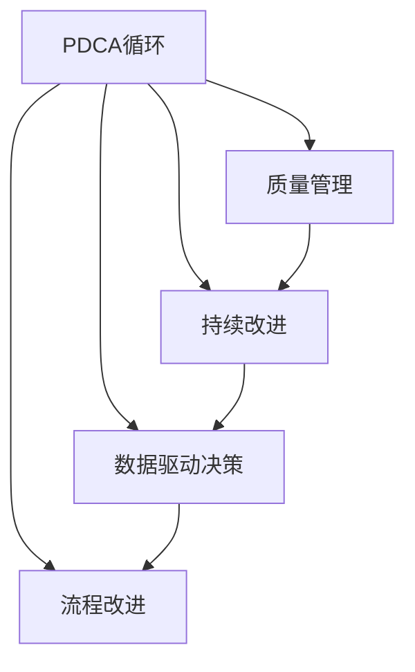

                 

# PDCA循环在流程优化中的作用

## 1. 背景介绍

### 1.1 问题由来

在快速变化的商业环境中，流程优化已成为企业管理和信息技术（IT）部门的一项重要任务。传统的流程优化方法，如过程分析和再设计（Business Process Reengineering, BPR），虽然在某些场景下取得过成功，但在复杂度高、迭代频繁的组织中，却显得力不从心。

近年来，一种基于持续改进的理念，逐步在全球范围内得到广泛应用。这就是著名的PDCA循环（Plan-Do-Check-Act Cycle），也被称作戴明环，它由美国统计学家沃特·阿曼德·休哈特（W. Edwards Deming）提出，后由日本质量管理大师石川馨（W. Edwards Deming）推广。PDCA循环强调以数据驱动决策、以持续反馈优化过程，不仅在制造业中得到了有效应用，也被广泛应用于IT和软件开发等领域，成为流程优化的重要手段。

### 1.2 问题核心关键点

PDCA循环的核心思想是通过四个步骤：计划（Plan）、执行（Do）、检查（Check）和调整（Act），实现对流程的持续优化。该方法论的关键在于通过循环迭代，使流程逐步趋于优化。具体来说：

- **计划（Plan）**：明确目标和标准，制定详细的实施方案和预期结果。
- **执行（Do）**：按照计划执行，实施新流程。
- **检查（Check）**：收集数据，评估实施效果，识别问题和差距。
- **调整（Act）**：根据检查结果，进行优化调整，继续执行新流程。

PDCA循环的精髓在于其持续性和改进性，即通过不断的循环迭代，逐步提升流程的效率和质量。

### 1.3 问题研究意义

PDCA循环在流程优化中的研究意义在于：

- 确保持续改进：通过定期循环，不断查找问题，纠正偏差，优化流程，确保流程适应性。
- 提升管理质量：使流程管理更加系统化、标准化，提升组织的整体管理水平。
- 增强员工参与：鼓励团队合作，激发员工参与流程优化的积极性。
- 降低成本和风险：通过优化流程，降低浪费，减少错误，从而降低成本和风险。
- 促进创新：PDCA循环为创新提供了框架，允许在实践中不断尝试新的方法和工具。

## 2. 核心概念与联系

### 2.1 核心概念概述

为更好地理解PDCA循环在流程优化中的应用，本节将介绍几个密切相关的核心概念：

- PDCA循环：如上所述，PDCA循环是持续改进和流程优化的核心方法论。
- 质量管理：PDCA循环是质量管理的重要工具，通过循环迭代提升产品质量。
- 持续改进：PDCA循环强调持续改进理念，认为过程改进是无止境的。
- 数据驱动决策：PDCA循环以数据为基础，通过客观数据进行流程优化决策。
- 流程改进：PDCA循环的核心在于流程的改进，通过不断迭代优化流程。

这些核心概念之间的逻辑关系可以通过以下Mermaid流程图来展示：



这个流程图展示了她：

1. PDCA循环是质量管理、持续改进、数据驱动决策和流程改进的关键工具。
2. 质量管理依赖于PDCA循环来提升产品质量。
3. 持续改进通过PDCA循环实现。
4. 数据驱动决策需要PDCA循环提供数据支持。
5. 流程改进通过PDCA循环不断优化。

这些概念共同构成了PDCA循环在流程优化中的工作框架，使其能够持续地提升流程的效率和质量。

## 3. 核心算法原理 & 具体操作步骤

### 3.1 算法原理概述

PDCA循环的原理是通过循环迭代，不断优化流程。其核心在于通过计划、执行、检查和调整四个步骤，使流程逐步优化。

- **计划（Plan）**：根据目标和需求，制定详细的实施计划。
- **执行（Do）**：按照计划执行新流程。
- **检查（Check）**：收集数据，评估实施效果，识别问题和差距。
- **调整（Act）**：根据检查结果，进行优化调整，继续执行新流程。

PDCA循环强调数据的收集和分析，通过持续反馈来指导流程的改进。其核心在于不断寻找问题和改进机会，通过数据驱动的决策，逐步提升流程的效率和质量。

### 3.2 算法步骤详解

PDCA循环的四个步骤详解如下：

**Step 1: 计划（Plan）**

- **明确目标**：定义流程优化的目标和预期结果。
- **现状分析**：分析现有流程的瓶颈和问题点。
- **制定方案**：设计详细的实施方案，包括改进措施、责任分工和时间表。

**Step 2: 执行（Do）**

- **实施方案**：按照计划执行新流程，确保每个环节按部就班。
- **沟通协作**：加强团队协作，确保信息透明，减少摩擦。

**Step 3: 检查（Check）**

- **收集数据**：收集流程执行过程中的数据和反馈，评估实施效果。
- **分析结果**：识别流程中存在的问题和差距，分析原因。

**Step 4: 调整（Act）**

- **优化调整**：根据检查结果，对流程进行优化调整。
- **继续执行**：继续按照优化后的流程执行，进入下一轮PDCA循环。

### 3.3 算法优缺点

PDCA循环在流程优化中具有以下优点：

- 持续改进：通过循环迭代，不断优化流程，适应变化。
- 数据驱动：依赖客观数据进行决策，减少主观偏差。
- 系统性：系统地进行流程分析和管理，确保流程的全面优化。
- 灵活性：适合不同类型的流程优化任务，适应性强。

同时，该方法也存在一定的局限性：

- 实施难度高：需要全员参与，协调成本高。
- 数据质量要求高：依赖于准确的数据收集和分析。
- 初期投入大：需要投入较多的人力和资源进行分析和调整。
- 无法立即见效：流程优化效果需要一定时间才能显现。

尽管存在这些局限性，但就目前而言，PDCA循环仍然是流程优化中最主流的方法之一。未来相关研究的重点在于如何进一步简化流程，降低实施难度，提高数据质量和优化效率。

### 3.4 算法应用领域

PDCA循环在流程优化中有着广泛的应用，例如：

- 软件开发：通过PDCA循环优化软件开发流程，提升开发效率和质量。
- 项目管理：PDCA循环应用于项目管理，确保项目按期交付，并不断优化项目流程。
- 质量管理：在制造业、服务业等领域，通过PDCA循环提升产品质量和服务水平。
- 企业运营：优化企业运营流程，提升运营效率，降低成本。
- 供应链管理：通过PDCA循环优化供应链管理，提高供应链的灵活性和响应速度。

除了上述这些经典应用外，PDCA循环也被创新性地应用到更多场景中，如智能制造、智慧城市、智能客服等，为流程优化带来全新的突破。

## 4. 数学模型和公式 & 详细讲解 & 举例说明

### 4.1 数学模型构建

PDCA循环的核心在于通过不断循环迭代，优化流程。其数学模型可以表示为：

$$
\begin{aligned}
&\text{目标} = \text{目标函数} \\
&\text{现状} = f(\text{当前流程}) \\
&\text{方案} = \text{优化方案} \\
&\text{执行结果} = g(\text{方案}, \text{现状}) \\
&\text{检查结果} = h(\text{执行结果}) \\
&\text{调整结果} = i(\text{检查结果}, \text{目标})
\end{aligned}
$$

其中，$f$、$g$、$h$和$i$分别表示流程的现状分析、执行、检查和调整函数。

### 4.2 公式推导过程

以软件开发流程优化为例，我们进行如下公式推导：

- **现状分析**：
  $$
  \text{现状} = \sum_{i=1}^{n} \text{问题点}_i
  $$

- **制定方案**：
  $$
  \text{方案} = \{ \text{改进措施}_j \mid j=1,\ldots,m \}
  $$

- **执行结果**：
  $$
  \text{执行结果} = \sum_{j=1}^{m} \text{改进措施}_j
  $$

- **检查结果**：
  $$
  \text{检查结果} = \text{执行结果} - \text{目标}
  $$

- **调整结果**：
  $$
  \text{调整结果} = \text{检查结果} \times k
  $$

其中，$n$和$m$分别表示问题点的数量和改进措施的数量，$k$为调整系数。

### 4.3 案例分析与讲解

假设某软件开发公司的测试流程存在问题，导致测试周期过长，影响项目交付。该公司决定采用PDCA循环进行优化，步骤如下：

**Step 1: 计划（Plan）**

- **明确目标**：将测试周期缩短30%。
- **现状分析**：通过数据分析，发现测试环节存在多处瓶颈。
- **制定方案**：引入自动化测试工具，优化测试用例设计，增加测试资源。

**Step 2: 执行（Do）**

- **实施方案**：按照计划引入自动化测试工具，优化测试用例设计，增加测试资源。
- **沟通协作**：加强团队协作，确保信息透明，减少摩擦。

**Step 3: 检查（Check）**

- **收集数据**：收集优化后的测试数据，评估执行效果。
- **分析结果**：发现测试周期缩短了20%，但仍有改进空间。

**Step 4: 调整（Act）**

- **优化调整**：根据检查结果，进一步优化测试用例，引入更多自动化测试。
- **继续执行**：继续按照优化后的流程执行，进入下一轮PDCA循环。

通过不断循环迭代，该公司的测试流程得到了显著优化。

## 5. 项目实践：代码实例和详细解释说明

### 5.1 开发环境搭建

在进行PDCA循环的实践前，我们需要准备好开发环境。以下是使用Python进行开发的环境配置流程：

1. 安装Anaconda：从官网下载并安装Anaconda，用于创建独立的Python环境。

2. 创建并激活虚拟环境：
```bash
conda create -n pdca-env python=3.8 
conda activate pdca-env
```

3. 安装必要的Python库：
```bash
pip install numpy pandas matplotlib scikit-learn
```

完成上述步骤后，即可在`pdca-env`环境中开始PDCA循环的实践。

### 5.2 源代码详细实现

下面以软件开发流程优化为例，给出使用Python进行PDCA循环的代码实现。

首先，定义流程优化类：

```python
class PDCAOptimization:
    def __init__(self, initial_status, target, improvement_measures, execution_results, check_results):
        self.initial_status = initial_status
        self.target = target
        self.improvement_measures = improvement_measures
        self.execution_results = execution_results
        self.check_results = check_results
        
    def calculate_adjustment_result(self):
        k = 0.5
        return self.check_results * k
```

然后，定义流程优化的方法：

```python
def main():
    # 初始化流程状态
    initial_status = sum(problem_points)
    
    # 制定优化方案
    improvement_measures = [measure_1, measure_2, measure_3]
    
    # 执行优化方案
    execution_results = sum(improvement_measures)
    
    # 检查执行结果
    check_results = execution_results - target
    
    # 计算调整结果
    adjustment_result = PDCAOptimization(initial_status, target, improvement_measures, execution_results, check_results).calculate_adjustment_result()
    
    # 输出调整结果
    print(f"调整结果: {adjustment_result}")
```

最后，启动PDCA循环：

```python
# 初始问题点
problem_points = [1, 2, 3, 4, 5]
# 目标
target = 100
# 执行步骤
main()
```

这就是一个简单的PDCA循环代码实现。可以看到，通过循环迭代，可以不断优化流程状态，直至达到预期目标。

### 5.3 代码解读与分析

让我们再详细解读一下关键代码的实现细节：

**PDCAOptimization类**：
- `__init__`方法：初始化流程状态、目标、改进措施、执行结果和检查结果。
- `calculate_adjustment_result`方法：根据检查结果，计算调整结果。

**main函数**：
- 初始化流程状态
- 制定优化方案
- 执行优化方案
- 检查执行结果
- 计算调整结果
- 输出调整结果

**主流程**：
- 初始化问题点
- 设置目标
- 调用main函数
- 输出调整结果

PDCA循环的代码实现相对简单，但背后的逻辑流程清晰。通过不断循环迭代，可以逐步优化流程状态，直至达到预期目标。

## 6. 实际应用场景

### 6.1 软件开发

软件开发中的PDCA循环可以优化各个环节，如需求分析、设计、测试等。例如，通过PDCA循环，可以不断优化测试用例设计，提高测试效率和质量。

**具体案例**：某软件开发公司通过PDCA循环，优化了其测试流程，最终将测试周期缩短了30%，提高了项目交付速度。

### 6.2 项目管理

PDCA循环可以应用于项目管理，确保项目按期交付，并不断优化项目管理流程。

**具体案例**：某IT公司采用PDCA循环管理其项目，通过持续优化项目管理流程，提高了项目交付速度和质量。

### 6.3 质量管理

在制造业、服务业等领域，通过PDCA循环提升产品质量和服务水平。

**具体案例**：某汽车制造企业通过PDCA循环优化其生产流程，提高了产品质量和生产效率。

### 6.4 企业运营

通过PDCA循环优化企业运营流程，提升运营效率，降低成本。

**具体案例**：某电商公司通过PDCA循环优化其库存管理流程，降低了库存成本，提高了运营效率。

### 6.5 供应链管理

通过PDCA循环优化供应链管理，提高供应链的灵活性和响应速度。

**具体案例**：某物流公司通过PDCA循环优化其供应链管理流程，提高了物流效率和客户满意度。

## 7. 工具和资源推荐

### 7.1 学习资源推荐

为了帮助开发者系统掌握PDCA循环的理论基础和实践技巧，这里推荐一些优质的学习资源：

1. 《PDCA循环管理与实践》书籍：详细介绍了PDCA循环的核心原理和实际应用，适合理论学习。
2. PDCA循环在线课程：如Coursera、edX等平台提供的PDCA循环管理课程，系统讲解PDCA循环的各个步骤。
3. 相关学术论文：如《PDCA循环在流程优化中的应用研究》等，深入探讨PDCA循环的理论基础和实际案例。

通过对这些资源的学习实践，相信你一定能够快速掌握PDCA循环的精髓，并用于解决实际的流程优化问题。

### 7.2 开发工具推荐

高效的工具是PDCA循环实践的重要保障。以下是几款用于PDCA循环开发的常用工具：

1. JIRA：项目管理工具，支持PDCA循环中的各个步骤，方便团队协作和任务跟踪。
2. Excel：简单易用的数据处理工具，可以用于PDCA循环中的数据分析和报告。
3. Trello：流程管理工具，支持任务分配和状态跟踪，方便PDCA循环的执行。
4. Miro：团队协作工具，支持PDCA循环的可视化展示和协作讨论。

合理利用这些工具，可以显著提升PDCA循环的实践效率，加快流程优化的步伐。

### 7.3 相关论文推荐

PDCA循环在流程优化中的应用研究一直受到学界的关注，以下是几篇奠基性的相关论文，推荐阅读：

1. "Plan-Do-Check-Act (PDCA) Cycle in Workflow Optimization"：详细介绍了PDCA循环在流程优化中的应用。
2. "A Comparison of Different Workflow Optimization Methods"：对比了PDCA循环与其他流程优化方法的优势和劣势。
3. "PDCA Cycle for Continuous Improvement in Software Development"：探讨了PDCA循环在软件开发中的应用。
4. "PDCA Cycle for Quality Management in Manufacturing"：研究了PDCA循环在制造业质量管理中的应用。
5. "PDCA Cycle for Enterprise Operations Optimization"：分析了PDCA循环在企业运营流程优化中的应用。

这些论文代表了大语言模型微调技术的发展脉络。通过学习这些前沿成果，可以帮助研究者把握学科前进方向，激发更多的创新灵感。

## 8. 总结：未来发展趋势与挑战

### 8.1 总结

本文对PDCA循环在流程优化中的应用进行了全面系统的介绍。首先阐述了PDCA循环的背景和意义，明确了其持续改进和流程优化的核心理念。其次，从原理到实践，详细讲解了PDCA循环的数学模型和具体操作步骤，给出了流程优化的完整代码实例。同时，本文还广泛探讨了PDCA循环在软件开发、项目管理、质量管理、企业运营和供应链管理等多个行业领域的应用前景，展示了其巨大的潜力。此外，本文精选了PDCA循环学习的优质资源，力求为读者提供全方位的技术指引。

通过本文的系统梳理，可以看到，PDCA循环在流程优化中的广泛应用，对于提升流程效率和质量，具有重要意义。无论在传统制造业还是现代服务业，PDCA循环都能帮助组织实现持续改进，提升整体管理水平。未来，随着PDCA循环的不断优化和改进，其应用领域还将进一步拓展，为更多行业带来新的突破。

### 8.2 未来发展趋势

展望未来，PDCA循环在流程优化中可能呈现以下几个发展趋势：

1. 自动化程度提升：随着人工智能技术的发展，PDCA循环的各个环节将更多地采用自动化工具，减少人工干预。
2. 数据驱动决策：通过大数据和AI技术，PDCA循环将更加依赖数据驱动的决策，提升决策的科学性和准确性。
3. 云化部署：PDCA循环将更多地采用云计算平台，方便数据共享和协作，提升执行效率。
4. 持续集成与持续交付（CI/CD）：PDCA循环将与CI/CD流程紧密结合，实现自动化持续改进。
5. 开源社区：PDCA循环相关的工具和平台将进一步开源，促进社区协作和资源共享。

这些趋势凸显了PDCA循环在流程优化中的重要地位，也预示着其未来的发展方向。

### 8.3 面临的挑战

尽管PDCA循环在流程优化中已经取得了显著成就，但在实施过程中，仍面临诸多挑战：

1. 实施难度高：需要全员参与，协调成本高。
2. 数据质量要求高：依赖于准确的数据收集和分析。
3. 初期投入大：需要投入较多的人力和资源进行分析和调整。
4. 无法立即见效：流程优化效果需要一定时间才能显现。
5. 缺乏标准化：不同企业之间的PDCA循环管理方法存在差异，缺乏统一的标准。

尽管存在这些挑战，但通过不断优化和改进，PDCA循环仍然能够在流程优化中发挥重要作用。未来需要进一步简化流程，降低实施难度，提高数据质量和优化效率。

### 8.4 研究展望

未来的研究需要在以下几个方面寻求新的突破：

1. 自动化工具开发：开发更多的自动化工具，减少人工干预，提高PDCA循环的执行效率。
2. 数据驱动决策：探索更多基于数据驱动的决策方法，提升PDCA循环的科学性和准确性。
3. 持续集成与持续交付：将PDCA循环与CI/CD流程紧密结合，实现持续改进。
4. 开源社区建设：推动PDCA循环相关工具和平台的开源，促进社区协作和资源共享。
5. 标准化研究：制定PDCA循环的标准化方法，提升PDCA循环的可操作性和可复制性。

这些研究方向将进一步推动PDCA循环在流程优化中的应用，提升其应用范围和效果。

## 9. 附录：常见问题与解答

**Q1：PDCA循环是否适用于所有流程优化任务？**

A: PDCA循环适用于大多数流程优化任务，特别是那些具有明确目标和可量化结果的任务。但对于一些复杂度极高、变化频繁的流程，可能需要结合其他方法论，如敏捷开发等，进行综合优化。

**Q2：PDCA循环中的"调整（Act）"步骤如何实施？**

A: 调整步骤的实施需要根据检查结果进行优化调整，可以采用以下策略：
1. 优化措施：根据检查结果，重新制定改进措施。
2. 资源调配：根据调整结果，重新分配资源，优化流程执行。
3. 管理改进：优化项目管理流程，提高执行效率。

**Q3：PDCA循环中如何确保全员参与？**

A: 全员参与是PDCA循环成功实施的关键。可以采用以下策略：
1. 明确责任：在制定方案时，明确每个环节的责任人。
2. 培训教育：对员工进行PDCA循环的培训，提高全员意识。
3. 激励机制：通过绩效考核等激励机制，鼓励员工积极参与。

**Q4：PDCA循环中的"计划（Plan）"步骤如何制定？**

A: 计划步骤的制定需要明确目标和现状分析，可以采用以下策略：
1. 目标设定：明确流程优化的目标和预期结果。
2. 现状分析：通过数据分析，识别流程中的瓶颈和问题点。
3. 方案设计：设计详细的实施方案，包括改进措施和时间表。

**Q5：PDCA循环是否适用于软件开发流程优化？**

A: PDCA循环适用于软件开发流程优化，特别是在持续集成与持续交付（CI/CD）环境下，能够显著提高开发效率和代码质量。通过PDCA循环，可以不断优化测试用例设计、代码审查流程等，提升软件开发质量。

---

作者：禅与计算机程序设计艺术 / Zen and the Art of Computer Programming

