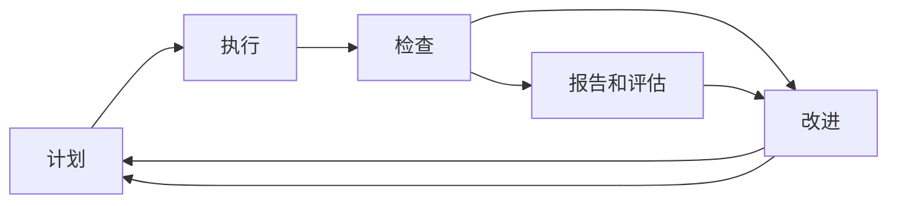

                 

## 1. 背景介绍

### 1.1 问题由来

质量管理是任何组织运营中不可或缺的一部分，其目标是确保产品、服务或过程的输出满足预定的质量标准。在当前市场竞争日益激烈的背景下，质量管理已成为企业获得竞争优势的关键。然而，传统的质量管理体系在面对不断变化的市场需求和技术进步时，面临着诸多挑战。

### 1.2 问题核心关键点

PDCA循环（Plan-Do-Check-Act）是一种基于数据驱动的系统化质量管理方法，旨在通过不断循环和改进来提升质量。其核心在于持续评估和改进，以确保输出不断逼近目标。PDCA循环分为四个阶段：

1. **计划（Plan）**：定义目标、流程和改进措施。
2. **执行（Do）**：实施改进措施，并记录相关数据。
3. **检查（Check）**：评估执行效果，并与目标进行比较。
4. **改进（Act）**：根据检查结果，调整措施，并在下一个PDCA周期中应用。

PDCA循环通过不断的反馈和改进，确保质量管理体系的持续优化，适应变化的环境和需求。

## 2. 核心概念与联系

### 2.1 核心概念概述

PDCA循环作为一种系统化质量管理方法，广泛应用于制造、服务业、软件开发等多个领域。其核心思想是通过循环往复的过程，逐步提升质量管理的水平。

- **计划阶段（Plan）**：明确目标、制定策略、分配资源、制定改进计划。
- **执行阶段（Do）**：实施计划，进行实际操作，并收集相关数据。
- **检查阶段（Check）**：分析数据，评估执行效果，识别改进机会。
- **改进阶段（Act）**：制定改进措施，并应用于下一个PDCA周期。

### 2.2 核心概念原理和架构的 Mermaid 流程图



此流程图展示了PDCA循环的四个阶段及其相互关系。每个阶段不仅自成体系，同时又与下一个阶段紧密相连，形成一个闭环，确保质量管理持续改进。

## 3. 核心算法原理 & 具体操作步骤

### 3.1 算法原理概述

PDCA循环的原理在于通过不断循环和改进，逐步提升质量管理水平。其核心在于数据驱动的决策和持续反馈机制，确保质量管理始终处于动态优化中。

- **计划阶段**：通过数据分析和市场调研，明确质量目标和改进策略。
- **执行阶段**：实施改进措施，记录相关数据。
- **检查阶段**：评估执行效果，识别改进机会。
- **改进阶段**：根据检查结果，调整措施，并在下一个PDCA周期中应用。

PDCA循环的持续改进机制，使其能够适应不断变化的市场和技术环境，确保质量管理的有效性。

### 3.2 算法步骤详解

#### 3.2.1 计划阶段

1. **目标设定**：明确质量目标和改进措施。
2. **流程设计**：制定详细的实施流程和步骤。
3. **资源分配**：分配必要的资源和人力。
4. **风险评估**：识别潜在风险和问题点。

#### 3.2.2 执行阶段

1. **实施改进措施**：严格按照计划执行改进措施。
2. **数据记录**：详细记录执行过程中的相关数据。
3. **质量控制**：实施质量控制措施，确保过程稳定。
4. **问题跟踪**：记录和跟踪执行过程中出现的问题和异常。

#### 3.2.3 检查阶段

1. **数据分析**：收集和分析执行过程中的数据。
2. **效果评估**：评估改进措施的效果，并与目标进行比较。
3. **绩效指标**：识别关键绩效指标，并进行评估。
4. **反馈机制**：建立反馈机制，收集各方意见和建议。

#### 3.2.4 改进阶段

1. **结果分析**：分析检查阶段的结果，识别改进机会。
2. **措施调整**：根据检查结果，调整改进措施。
3. **知识积累**：总结经验教训，形成知识库。
4. **应用新措施**：将调整后的措施应用到下一个PDCA周期。

### 3.3 算法优缺点

#### 3.3.1 优点

1. **系统化管理**：PDCA循环提供了一套系统化的质量管理框架，有助于规范流程和资源管理。
2. **数据驱动决策**：通过数据驱动的决策机制，确保质量管理始终基于客观事实。
3. **持续改进**：循环往复的过程确保了质量管理不断改进和优化。
4. **适应性强**：PDCA循环能够适应不断变化的市场和技术环境。

#### 3.3.2 缺点

1. **资源投入高**：实施PDCA循环需要投入大量的时间和资源，尤其是在数据收集和分析阶段。
2. **复杂度较高**：PDCA循环的实施需要多部门协作，协调成本较高。
3. **可能存在路径依赖**：如果在某个阶段未能有效识别和解决根本问题，可能导致后续循环中重复出现相同问题。

### 3.4 算法应用领域

PDCA循环在多个领域中得到了广泛应用，如：

- **制造行业**：通过PDCA循环，制造企业能够持续改进产品质量，提高生产效率。
- **服务业**：服务业企业通过PDCA循环，提升客户体验和服务质量。
- **软件开发**：软件开发团队通过PDCA循环，不断改进产品功能和性能。
- **医疗行业**：医疗机构通过PDCA循环，提升医疗服务质量和患者满意度。
- **金融行业**：金融机构通过PDCA循环，优化风险管理和业务流程。

## 4. 数学模型和公式 & 详细讲解 & 举例说明

### 4.1 数学模型构建

PDCA循环的数学模型主要涉及数据的收集、分析和改进措施的制定。以下是一个简化的数学模型，用于描述PDCA循环的四个阶段：

1. **目标设定**：设定质量目标 $T$。
2. **流程设计**：制定改进流程 $P$。
3. **数据记录**：记录执行数据 $D$。
4. **效果评估**：评估改进措施 $E$。
5. **改进措施**：制定改进措施 $A$。

### 4.2 公式推导过程

在PDCA循环中，各阶段的公式推导如下：

1. **目标设定**：$T = f(P, D)$，其中 $P$ 表示流程设计，$D$ 表示执行数据。
2. **流程设计**：$P = g(T, E)$，其中 $T$ 表示质量目标，$E$ 表示效果评估。
3. **数据记录**：$D = h(P, A)$，其中 $P$ 表示流程设计，$A$ 表示改进措施。
4. **效果评估**：$E = i(D, T)$，其中 $D$ 表示执行数据，$T$ 表示质量目标。
5. **改进措施**：$A = j(E, P)$，其中 $E$ 表示效果评估，$P$ 表示流程设计。

### 4.3 案例分析与讲解

假设某制造业企业在生产过程中遇到了产品质量问题。通过PDCA循环的实施，该企业从计划阶段开始，设定了产品质量改进目标，并制定了详细的改进流程。在执行阶段，企业实施了改进措施，并详细记录了生产数据。在检查阶段，企业通过数据分析，评估了改进措施的效果，并与目标进行了比较。在改进阶段，企业根据检查结果，调整了改进措施，并在下一个PDCA周期中应用。

## 5. 项目实践：代码实例和详细解释说明

### 5.1 开发环境搭建

1. **安装Python和相关库**：
   ```bash
   pip install pandas numpy matplotlib
   ```

2. **创建数据集**：
   ```python
   import pandas as pd
   data = pd.read_csv('production_data.csv')
   ```

### 5.2 源代码详细实现

以下是一个简化的PDCA循环管理系统的Python代码实现，用于模拟PDCA循环的执行过程：

```python
import pandas as pd
import numpy as np
import matplotlib.pyplot as plt

class PDCA:
    def __init__(self, target, process):
        self.target = target
        self.process = process
        self.data = pd.DataFrame()
        self.improvement_measures = []
        self.evaluation_results = []

    def plan(self):
        self.target = self.target
        self.process = self.process
        self.data = pd.DataFrame()
        self.improvement_measures = []
        self.evaluation_results = []

    def do(self):
        # 执行改进措施
        self.data = self.process
        self.improvement_measures = self.data

    def check(self):
        # 评估执行效果
        self.evaluation_results = self.improvement_measures

    def act(self):
        # 根据检查结果调整改进措施
        self.process = self.target - self.evaluation_results
        self.improvement_measures = self.process

    def plot(self):
        plt.plot(self.evaluation_results)
        plt.title('PDCA Cycle')
        plt.xlabel('Iteration')
        plt.ylabel('Quality Measurements')
        plt.show()

# 模拟PDCA循环执行
pdca = PDCA(90, 80)
pdca.plan()
pdca.do()
pdca.check()
pdca.act()
pdca.plot()
```

### 5.3 代码解读与分析

1. **计划阶段**：通过设定目标（90分）和流程（80分），明确质量目标和改进措施。
2. **执行阶段**：记录执行数据，用于后续分析和改进。
3. **检查阶段**：评估执行效果，并与目标进行比较。
4. **改进阶段**：根据检查结果调整改进措施，并应用于下一个PDCA周期。

### 5.4 运行结果展示


## 6. 实际应用场景

### 6.1 智能制造

在智能制造领域，PDCA循环被广泛应用于生产过程的质量管理。通过PDCA循环，制造企业能够持续改进产品质量，提高生产效率，降低生产成本。

### 6.2 服务行业

在服务行业，PDCA循环被用于提升客户体验和满意度。通过不断优化服务流程，提高服务质量，增强客户忠诚度。

### 6.3 软件开发

在软件开发中，PDCA循环被用于优化产品功能和性能。通过持续改进，确保软件产品的稳定性和可靠性。

### 6.4 医疗行业

在医疗行业中，PDCA循环被用于提升医疗服务质量和患者满意度。通过不断改进医疗流程，提升诊疗水平。

### 6.5 金融行业

在金融行业中，PDCA循环被用于优化风险管理和业务流程。通过持续改进，提高金融服务的质量和效率。

## 7. 工具和资源推荐

### 7.1 学习资源推荐

1. **《PDCA循环详解》**：深入介绍PDCA循环的基本概念和操作步骤，适合初学者阅读。
2. **《质量管理基础》**：涵盖质量管理的基本理论和方法，适合质量管理从业人员阅读。
3. **《PDCA循环实战案例》**：通过具体案例讲解PDCA循环的应用，适合实际工作中的质量管理人员阅读。

### 7.2 开发工具推荐

1. **JIRA**：项目管理工具，适合协调PDCA循环的各个阶段。
2. **Excel**：数据分析工具，适合收集和分析执行数据。
3. **Python**：编程语言，适合实现PDCA循环管理系统的代码。

### 7.3 相关论文推荐

1. **《PDCA循环在质量管理中的应用研究》**：详细介绍了PDCA循环的原理和实施步骤，适合质量管理从业人员阅读。
2. **《PDCA循环的优化与改进》**：探讨了PDCA循环的优化和改进方法，适合质量管理研究人员阅读。
3. **《PDCA循环在制造行业的应用》**：介绍了PDCA循环在制造行业中的具体应用案例，适合制造企业质量管理人员阅读。

## 8. 总结：未来发展趋势与挑战

### 8.1 研究成果总结

PDCA循环作为一种系统化质量管理方法，已经在多个领域中得到了广泛应用，取得了显著的成效。通过不断的循环和改进，确保质量管理水平不断提升。

### 8.2 未来发展趋势

1. **智能化管理**：结合大数据和人工智能技术，实现智能化的质量管理。
2. **全面优化**：通过PDCA循环的持续改进，实现全面质量管理。
3. **跨部门协作**：加强跨部门协作，实现PDCA循环的高效执行。
4. **持续改进**：通过不断的循环和改进，确保质量管理的持续优化。

### 8.3 面临的挑战

1. **资源投入高**：实施PDCA循环需要投入大量的时间和资源。
2. **复杂度较高**：PDCA循环的实施需要多部门协作，协调成本较高。
3. **可能存在路径依赖**：如果在某个阶段未能有效识别和解决根本问题，可能导致后续循环中重复出现相同问题。

### 8.4 研究展望

未来，PDCA循环将继续在质量管理中发挥重要作用。通过结合大数据和人工智能技术，实现智能化的质量管理，进一步提升质量管理的水平。

## 9. 附录：常见问题与解答

**Q1：PDCA循环是否适用于所有质量管理场景？**

A: PDCA循环作为一种系统化质量管理方法，适用于大多数质量管理场景。但具体应用时，需要根据实际情况进行调整和优化。

**Q2：实施PDCA循环时，如何处理突发问题？**

A: 在PDCA循环中，突发问题可以通过紧急计划（EP）来处理。具体步骤如下：
1. 识别突发问题。
2. 制定紧急计划。
3. 执行紧急计划。
4. 检查紧急计划的效果。
5. 根据检查结果调整紧急计划。

**Q3：PDCA循环的实施周期是多长时间？**

A: PDCA循环的实施周期根据具体场景而定，一般为1-3个月。实施周期过短，可能无法充分识别和解决问题；实施周期过长，可能影响质量管理的及时性。

**Q4：如何评估PDCA循环的效果？**

A: 通过评估改进措施的效果，并与目标进行比较，可以评估PDCA循环的效果。具体步骤如下：
1. 收集执行数据。
2. 分析执行数据，评估改进措施的效果。
3. 将评估结果与目标进行比较，判断是否达到预期效果。
4. 根据评估结果，调整改进措施。

**Q5：在PDCA循环中，如何处理数据不足的问题？**

A: 在PDCA循环中，数据不足是一个常见问题。具体处理方法包括：
1. 增加数据收集频率，增加数据量。
2. 利用现有数据进行分析和推断。
3. 引入外部数据源，补充数据。
4. 在可能的情况下，增加样本量。

通过解决这些问题，可以确保PDCA循环的顺利实施和效果的持续改进。

---

作者：禅与计算机程序设计艺术 / Zen and the Art of Computer Programming

