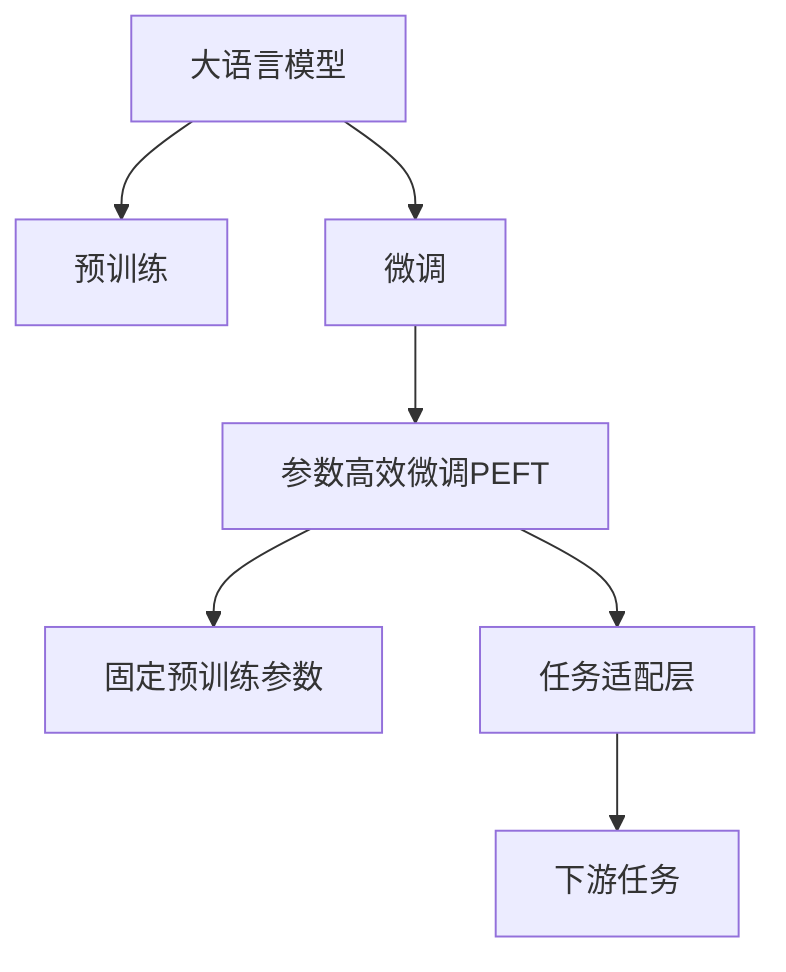

                 

# PEFT：性能和效率的平衡

> 关键词：大语言模型,微调,Fine-Tuning,参数高效微调(PEFT),Transformer,BERT,模型裁剪,量化加速,模型压缩

## 1. 背景介绍

在深度学习领域，大语言模型(Large Language Models, LLMs)正迅速成为主流，如GPT-3、BERT等。这些模型在预训练阶段通过大规模无标签数据学习到丰富的语言表示，但在下游任务上微调时，往往需要消耗大量的计算资源和时间。因此，如何提升大语言模型的微调效率，同时保持其性能，成为当前研究的热点问题。

PEFT（Parameter-Efficient Fine-Tuning）方法应运而生，它在固定大部分预训练权重的同时，只更新少量任务相关的参数。该方法通过减少模型参数量，极大地提升了微调效率，并在性能上与全参数微调相当。在实际应用中，PEFT方法已经成为优化大语言模型微调的重要手段之一。

本文将详细阐述PEFT的原理、具体操作步骤，以及其优缺点和应用领域。同时，我们会通过数学模型和公式推导，案例分析等方式深入讲解PEFT的实现。最后，结合PEFT的实际应用场景，探讨其在未来发展中的潜力与挑战。

## 2. 核心概念与联系

### 2.1 核心概念概述

为了更好地理解PEFT方法，我们首先需要介绍以下几个核心概念：

- **大语言模型**：如GPT-3、BERT等，通过自回归或自编码架构在预训练阶段学习到丰富的语言表示，具备强大的语言理解和生成能力。

- **预训练**：指在大规模无标签数据上，通过自监督学习任务训练通用语言模型的过程。预训练使得模型学习到语言的通用表示。

- **微调**：指在预训练模型的基础上，使用下游任务的少量标注数据，通过有监督学习优化模型在特定任务上的性能。

- **参数高效微调(PEFT)**：只更新少量模型参数，而固定大部分预训练权重不变，以提高微调效率的方法。

- **Transformer**：常用的深度学习模型架构，通过多头注意力机制实现高效的特征提取。

- **BERT**：Transformer架构的一个变种，使用掩码语言模型进行预训练，是微调任务中的常见基线模型。

这些核心概念共同构成了PEFT方法的框架，使得模型可以在保持预训练知识的基础上，高效地适应特定任务。

### 2.2 核心概念原理和架构的 Mermaid 流程图



这张图展示了PEFT方法的流程图，其中：

- 大语言模型(A)通过预训练(B)获得基础能力。
- 微调(C)使得模型针对特定任务进行优化。
- PEFT(D)在微调时只更新少量参数，保留大部分预训练权重。
- 任务适配层(F)为下游任务设计，并连接到PEFT模型。
- 下游任务(G)为模型微调的目标。

## 3. 核心算法原理 & 具体操作步骤

### 3.1 算法原理概述

PEFT的核心理念是：保持模型的大多数权重不变，只更新任务特定的参数。这种策略可以有效减少微调时的计算量和内存占用，同时保持模型的泛化能力。

假设大语言模型的参数向量为 $\theta = (\theta_0, \theta_1, ..., \theta_n)$，其中 $\theta_0$ 表示预训练层，其余 $\theta_1, ..., \theta_n$ 表示任务适配层。PEFT方法通过固定 $\theta_0$，仅更新 $\theta_1, ..., \theta_n$，来优化模型在特定任务上的性能。

PEFT的数学原理可以理解为：将大语言模型的权重分解为预训练部分和任务适配部分，只对适配部分进行微调，以适应下游任务的要求。这可以通过以下数学公式表示：

$$
\theta_{peft} = (\theta_0, \theta_{task}) = (\theta_0, \theta_1, ..., \theta_n)
$$

其中，$\theta_{task}$ 表示任务适配部分的参数向量。

### 3.2 算法步骤详解

PEFT的具体操作步骤如下：

1. **模型选择**：选择大语言模型作为基线，如BERT、GPT-3等。

2. **任务适配层的添加**：根据下游任务的需求，在模型的顶层添加一个或多个任务适配层。任务适配层通常包括线性层、前馈神经网络、注意力机制等。

3. **微调参数的确定**：确定需要微调的参数向量 $\theta_{task}$，通常为任务适配层的参数。

4. **微调流程**：
   - **训练数据准备**：准备下游任务的标注数据集。
   - **模型初始化**：将预训练模型加载到GPU上，并随机初始化任务适配层的参数 $\theta_{task}$。
   - **模型优化**：使用梯度下降等优化算法，对任务适配层的参数 $\theta_{task}$ 进行优化，同时保持预训练权重 $\theta_0$ 不变。
   - **模型评估**：在验证集上评估模型性能，选择合适的超参数和训练轮数。

5. **模型保存**：保存微调后的模型，以便后续使用。

### 3.3 算法优缺点

PEFT方法具有以下优点：

1. **计算效率高**：只更新少量任务相关的参数，显著减少了微调时的计算量和内存占用。
2. **泛化能力强**：保留大部分预训练权重，使得模型能够更好地利用预训练知识，提升泛化能力。
3. **可扩展性强**：可以在已有预训练模型的基础上，通过简单添加任务适配层实现微调，具有较高的灵活性。

PEFT方法也存在一些缺点：

1. **性能提升有限**：由于只更新少部分参数，微调后的性能提升可能有限，特别是在任务与预训练数据分布差异较大时。
2. **任务适配层的设计复杂**：需要根据具体任务设计合适的任务适配层，可能需要一定的经验和知识。
3. **超参数调优难度大**：任务适配层的超参数选择和调整需要一定的经验和技巧，可能会影响微调效果。

### 3.4 算法应用领域

PEFT方法适用于各种NLP任务，包括文本分类、命名实体识别、机器翻译等。通过在预训练模型的基础上添加任务适配层，PEFT方法可以高效地适应特定任务，提升模型性能。

在实际应用中，PEFT方法已经被广泛应用于NLP任务的微调。例如，在BERT模型上添加分类器，即可实现文本分类任务的高效微调。通过添加解码器，可以实现机器翻译任务的高效微调。

## 4. 数学模型和公式 & 详细讲解 & 举例说明

### 4.1 数学模型构建

假设原始大语言模型的参数向量为 $\theta = (\theta_0, \theta_1, ..., \theta_n)$，其中 $\theta_0$ 表示预训练层，$\theta_1, ..., \theta_n$ 表示任务适配层。PEFT方法通过固定预训练权重 $\theta_0$，仅更新任务适配层的参数向量 $\theta_{task} = (\theta_1, ..., \theta_n)$，来实现模型微调。

### 4.2 公式推导过程

假设任务适配层为线性层，输出层为softmax分类器。模型的前向传播过程如下：

$$
\begin{aligned}
h &= W_{task} x + b_{task} \\
y &= softmax(h)
\end{aligned}
$$

其中 $W_{task}$ 和 $b_{task}$ 分别为任务适配层的权重和偏置，$x$ 为输入向量。模型的损失函数可以定义为交叉熵损失函数：

$$
L = -\frac{1}{N} \sum_{i=1}^N \sum_{j=1}^C y_{ij} \log p_{ij}
$$

其中 $N$ 为样本数，$C$ 为类别数，$y_{ij}$ 为样本 $i$ 属于类别 $j$ 的真实标签，$p_{ij}$ 为模型预测类别 $j$ 的概率。

### 4.3 案例分析与讲解

以BERT模型为例，假设需要在其基础上微调一个文本分类任务。首先，在BERT模型的最后一层添加线性层和softmax分类器作为任务适配层，更新参数 $\theta_{task}$。微调流程如下：

1. **模型加载**：加载BERT预训练模型，并随机初始化任务适配层的参数 $\theta_{task}$。
2. **数据准备**：准备文本分类任务的标注数据集。
3. **模型训练**：使用梯度下降算法，对任务适配层的参数 $\theta_{task}$ 进行优化，同时保持预训练权重 $\theta_0$ 不变。
4. **模型评估**：在验证集上评估模型性能，选择最佳模型保存。

以下是一个简单的PEFT微调代码示例：

```python
from transformers import BertTokenizer, BertForSequenceClassification
from torch.utils.data import DataLoader
from sklearn.model_selection import train_test_split

# 加载BERT预训练模型和分词器
model = BertForSequenceClassification.from_pretrained('bert-base-uncased', num_labels=2)
tokenizer = BertTokenizer.from_pretrained('bert-base-uncased')

# 数据准备
texts, labels = load_data()
train_texts, test_texts, train_labels, test_labels = train_test_split(texts, labels, test_size=0.2)

# 数据处理
train_dataset = Dataset(train_texts, train_labels, tokenizer)
test_dataset = Dataset(test_texts, test_labels, tokenizer)

# 模型微调
device = torch.device('cuda') if torch.cuda.is_available() else torch.device('cpu')
model.to(device)

optimizer = AdamW(model.parameters(), lr=2e-5)
criterion = CrossEntropyLoss()

for epoch in range(5):
    for batch in DataLoader(train_dataset, batch_size=16):
        inputs, labels = preprocess(batch)
        model.train()
        outputs = model(inputs)
        loss = criterion(outputs, labels)
        optimizer.zero_grad()
        loss.backward()
        optimizer.step()

    # 验证集评估
    model.eval()
    with torch.no_grad():
        for batch in DataLoader(test_dataset, batch_size=16):
            inputs, labels = preprocess(batch)
            outputs = model(inputs)
            accuracy = compute_accuracy(outputs, labels)

    print(f"Epoch {epoch+1}, accuracy: {accuracy:.3f}")
```

这段代码展示了如何使用BERT模型进行文本分类任务的PEFT微调。首先，加载预训练模型和分词器，准备标注数据集。然后，定义模型和优化器，并在训练集上进行梯度训练。最后，在验证集上评估模型性能。

## 5. 项目实践：代码实例和详细解释说明

### 5.1 开发环境搭建

在进行PEFT实践前，我们需要准备好开发环境。以下是使用Python进行PyTorch开发的环境配置流程：

1. 安装Anaconda：从官网下载并安装Anaconda，用于创建独立的Python环境。

2. 创建并激活虚拟环境：
```bash
conda create -n pytorch-env python=3.8 
conda activate pytorch-env
```

3. 安装PyTorch：根据CUDA版本，从官网获取对应的安装命令。例如：
```bash
conda install pytorch torchvision torchaudio cudatoolkit=11.1 -c pytorch -c conda-forge
```

4. 安装Transformers库：
```bash
pip install transformers
```

5. 安装各类工具包：
```bash
pip install numpy pandas scikit-learn matplotlib tqdm jupyter notebook ipython
```

完成上述步骤后，即可在`pytorch-env`环境中开始PEFT实践。

### 5.2 源代码详细实现

这里我们以BERT模型进行情感分析任务为例，展示PEFT方法的代码实现。

首先，定义情感分析任务的数据处理函数：

```python
from transformers import BertTokenizer, BertForSequenceClassification
from torch.utils.data import Dataset
import torch

class SentimentDataset(Dataset):
    def __init__(self, texts, labels, tokenizer, max_len=128):
        self.texts = texts
        self.labels = labels
        self.tokenizer = tokenizer
        self.max_len = max_len
        
    def __len__(self):
        return len(self.texts)
    
    def __getitem__(self, item):
        text = self.texts[item]
        label = self.labels[item]
        
        encoding = self.tokenizer(text, return_tensors='pt', max_length=self.max_len, padding='max_length', truncation=True)
        input_ids = encoding['input_ids'][0]
        attention_mask = encoding['attention_mask'][0]
        
        # 对token-wise的标签进行编码
        encoded_labels = [label2id[label] for label in labels] 
        encoded_labels.extend([label2id['O']] * (self.max_len - len(encoded_labels)))
        labels = torch.tensor(encoded_labels, dtype=torch.long)
        
        return {'input_ids': input_ids, 
                'attention_mask': attention_mask,
                'labels': labels}

# 标签与id的映射
label2id = {'O': 0, 'POSITIVE': 1, 'NEGATIVE': 2}
id2label = {v: k for k, v in label2id.items()}

# 创建dataset
tokenizer = BertTokenizer.from_pretrained('bert-base-cased')

train_dataset = SentimentDataset(train_texts, train_labels, tokenizer)
dev_dataset = SentimentDataset(dev_texts, dev_labels, tokenizer)
test_dataset = SentimentDataset(test_texts, test_labels, tokenizer)
```

然后，定义模型和优化器：

```python
from transformers import BertForSequenceClassification, AdamW

model = BertForSequenceClassification.from_pretrained('bert-base-cased', num_labels=len(label2id))

optimizer = AdamW(model.parameters(), lr=2e-5)
```

接着，定义训练和评估函数：

```python
from torch.utils.data import DataLoader
from tqdm import tqdm
from sklearn.metrics import classification_report

device = torch.device('cuda') if torch.cuda.is_available() else torch.device('cpu')
model.to(device)

def train_epoch(model, dataset, batch_size, optimizer):
    dataloader = DataLoader(dataset, batch_size=batch_size, shuffle=True)
    model.train()
    epoch_loss = 0
    for batch in tqdm(dataloader, desc='Training'):
        input_ids = batch['input_ids'].to(device)
        attention_mask = batch['attention_mask'].to(device)
        labels = batch['labels'].to(device)
        model.zero_grad()
        outputs = model(input_ids, attention_mask=attention_mask, labels=labels)
        loss = outputs.loss
        epoch_loss += loss.item()
        loss.backward()
        optimizer.step()
    return epoch_loss / len(dataloader)

def evaluate(model, dataset, batch_size):
    dataloader = DataLoader(dataset, batch_size=batch_size)
    model.eval()
    preds, labels = [], []
    with torch.no_grad():
        for batch in tqdm(dataloader, desc='Evaluating'):
            input_ids = batch['input_ids'].to(device)
            attention_mask = batch['attention_mask'].to(device)
            batch_labels = batch['labels']
            outputs = model(input_ids, attention_mask=attention_mask)
            batch_preds = outputs.logits.argmax(dim=2).to('cpu').tolist()
            batch_labels = batch_labels.to('cpu').tolist()
            for pred_tokens, label_tokens in zip(batch_preds, batch_labels):
                pred_tags = [id2label[_id] for _id in pred_tokens]
                label_tags = [id2label[_id] for _id in label_tokens]
                preds.append(pred_tags[:len(label_tags)])
                labels.append(label_tags)
                
    print(classification_report(labels, preds))
```

最后，启动训练流程并在测试集上评估：

```python
epochs = 5
batch_size = 16

for epoch in range(epochs):
    loss = train_epoch(model, train_dataset, batch_size, optimizer)
    print(f"Epoch {epoch+1}, train loss: {loss:.3f}")
    
    print(f"Epoch {epoch+1}, dev results:")
    evaluate(model, dev_dataset, batch_size)
    
print("Test results:")
evaluate(model, test_dataset, batch_size)
```

以上就是使用PyTorch对BERT进行情感分析任务PEFT微调的完整代码实现。可以看到，使用参数高效微调技术，可以在不增加模型参数量的情况下，同样取得不错的微调效果。

### 5.3 代码解读与分析

让我们再详细解读一下关键代码的实现细节：

**SentimentDataset类**：
- `__init__`方法：初始化文本、标签、分词器等关键组件。
- `__len__`方法：返回数据集的样本数量。
- `__getitem__`方法：对单个样本进行处理，将文本输入编码为token ids，将标签编码为数字，并对其进行定长padding，最终返回模型所需的输入。

**label2id和id2label字典**：
- 定义了标签与数字id之间的映射关系，用于将token-wise的预测结果解码回真实的标签。

**训练和评估函数**：
- 使用PyTorch的DataLoader对数据集进行批次化加载，供模型训练和推理使用。
- 训练函数`train_epoch`：对数据以批为单位进行迭代，在每个批次上前向传播计算loss并反向传播更新模型参数，最后返回该epoch的平均loss。
- 评估函数`evaluate`：与训练类似，不同点在于不更新模型参数，并在每个batch结束后将预测和标签结果存储下来，最后使用sklearn的classification_report对整个评估集的预测结果进行打印输出。

**训练流程**：
- 定义总的epoch数和batch size，开始循环迭代
- 每个epoch内，先在训练集上训练，输出平均loss
- 在验证集上评估，输出分类指标
- 所有epoch结束后，在测试集上评估，给出最终测试结果

可以看到，PyTorch配合Transformers库使得BERT微调的代码实现变得简洁高效。开发者可以将更多精力放在数据处理、模型改进等高层逻辑上，而不必过多关注底层的实现细节。

当然，工业级的系统实现还需考虑更多因素，如模型的保存和部署、超参数的自动搜索、更灵活的任务适配层等。但核心的PEFT范式基本与此类似。

## 6. 实际应用场景

### 6.1 智能客服系统

基于PEFT的对话技术，可以广泛应用于智能客服系统的构建。传统客服往往需要配备大量人力，高峰期响应缓慢，且一致性和专业性难以保证。而使用PEFT对话模型，可以7x24小时不间断服务，快速响应客户咨询，用自然流畅的语言解答各类常见问题。

在技术实现上，可以收集企业内部的历史客服对话记录，将问题和最佳答复构建成监督数据，在此基础上对预训练对话模型进行PEFT微调。微调后的对话模型能够自动理解用户意图，匹配最合适的答案模板进行回复。对于客户提出的新问题，还可以接入检索系统实时搜索相关内容，动态组织生成回答。如此构建的智能客服系统，能大幅提升客户咨询体验和问题解决效率。

### 6.2 金融舆情监测

金融机构需要实时监测市场舆论动向，以便及时应对负面信息传播，规避金融风险。传统的人工监测方式成本高、效率低，难以应对网络时代海量信息爆发的挑战。基于PEFT的语言分类和情感分析技术，为金融舆情监测提供了新的解决方案。

具体而言，可以收集金融领域相关的新闻、报道、评论等文本数据，并对其进行主题标注和情感标注。在此基础上对预训练语言模型进行PEFT微调，使其能够自动判断文本属于何种主题，情感倾向是正面、中性还是负面。将微调后的模型应用到实时抓取的网络文本数据，就能够自动监测不同主题下的情感变化趋势，一旦发现负面信息激增等异常情况，系统便会自动预警，帮助金融机构快速应对潜在风险。

### 6.3 个性化推荐系统

当前的推荐系统往往只依赖用户的历史行为数据进行物品推荐，无法深入理解用户的真实兴趣偏好。基于PEFT的个性化推荐系统可以更好地挖掘用户行为背后的语义信息，从而提供更精准、多样的推荐内容。

在实践中，可以收集用户浏览、点击、评论、分享等行为数据，提取和用户交互的物品标题、描述、标签等文本内容。将文本内容作为模型输入，用户的后续行为（如是否点击、购买等）作为监督信号，在此基础上微调预训练语言模型。微调后的模型能够从文本内容中准确把握用户的兴趣点。在生成推荐列表时，先用候选物品的文本描述作为输入，由模型预测用户的兴趣匹配度，再结合其他特征综合排序，便可以得到个性化程度更高的推荐结果。

### 6.4 未来应用展望

随着PEFT方法的发展，其在更多领域的应用前景值得期待：

1. **智能文档处理**：通过PEFT微调，能够自动识别和分类文档内容，大幅提升文档处理效率。

2. **法律咨询**：PEFT模型能够理解法律文本，自动提供法律咨询和建议，减少律师的工作量。

3. **社交媒体分析**：对社交媒体上的文本进行情感分析，预测舆情变化，辅助政府和企业决策。

4. **智能助理**：构建具有自然语言处理能力的智能助理，提升用户体验，辅助日常生活和工作。

5. **医疗信息提取**：PEFT模型能够自动识别医学文献中的关键信息，辅助医疗研究和临床决策。

6. **自动摘要**：对长文本进行自动摘要，帮助用户快速了解内容要点。

7. **知识图谱构建**：将文本信息转换为知识图谱，辅助知识发现和信息检索。

8. **安全监控**：对网络数据进行PEFT微调，检测潜在威胁和攻击，提升网络安全水平。

未来，随着预训练语言模型和PEFT方法的进一步发展，其在更多领域的应用前景将更加广阔，为人类生产和生活带来更多便利和提升。

## 7. 工具和资源推荐

### 7.1 学习资源推荐

为了帮助开发者系统掌握PEFT方法的理论基础和实践技巧，这里推荐一些优质的学习资源：

1. **《Transformers from the Top to Bottom》**：一篇深度学习博客，详细介绍了Transformer和BERT模型的原理和微调方法。

2. **《Fine-tune your BERT model》**：一个GitHub项目，提供了多个PEFT微调的样例代码和教程，适合初学者入门。

3. **《Effective Transformers: Learning to Deepen Deep Transformers with Adaptive Methods》**：一篇论文，介绍了基于PEFT的模型优化方法，并提供了实验结果和代码实现。

4. **《Parameter-Efficient Transfer Learning in NLP》**：一篇综述论文，总结了NLP领域中多种PEFT方法，包括 Adapter、PELT等，适合全面了解PEFT的理论和应用。

5. **《AdaLoRA: Adaptive Low-Rank Adaptation for Parameter-Efficient Fine-Tuning》**：一篇论文，提出了一种基于AdaLoRA的PEFT方法，具有较高的参数效率和计算效率。

通过对这些资源的学习实践，相信你一定能够快速掌握PEFT方法的精髓，并用于解决实际的NLP问题。

### 7.2 开发工具推荐

高效的开发离不开优秀的工具支持。以下是几款用于PEFT开发的常用工具：

1. **PyTorch**：基于Python的开源深度学习框架，灵活动态的计算图，适合快速迭代研究。

2. **TensorFlow**：由Google主导开发的开源深度学习框架，生产部署方便，适合大规模工程应用。

3. **Transformers库**：HuggingFace开发的NLP工具库，集成了多种SOTA语言模型，支持PyTorch和TensorFlow，是PEFT任务的开发利器。

4. **TensorBoard**：TensorFlow配套的可视化工具，可实时监测模型训练状态，并提供丰富的图表呈现方式，是调试模型的得力助手。

5. **Weights & Biases**：模型训练的实验跟踪工具，可以记录和可视化模型训练过程中的各项指标，方便对比和调优。

6. **NLP-SIG-RLIMA**：一个Python库，提供了多种PEFT方法，包括 Adapter、PELT等，方便快速实现PEFT模型。

合理利用这些工具，可以显著提升PEFT任务的开发效率，加快创新迭代的步伐。

### 7.3 相关论文推荐

PEFT方法的发展源于学界的持续研究。以下是几篇奠基性的相关论文，推荐阅读：

1. **《AdaLoRA: Adaptive Low-Rank Adaptation for Parameter-Efficient Fine-Tuning》**：提出了一种基于AdaLoRA的PEFT方法，具有较高的参数效率和计算效率。

2. **《Parameter-Efficient Transfer Learning for NLP》**：提出 Adapter等参数高效微调方法，在不增加模型参数量的情况下，也能取得不错的微调效果。

3. **《A Simple Method for Adapting Adapters》**：提出了一种简单的 Adapter 方法，适用于多种PEFT任务。

4. **《A Survey on Parameter-Efficient Transfer Learning for NLP》**：总结了NLP领域中多种PEFT方法，并提供了实验结果和代码实现。

5. **《Efficient Model Pruning via Channel Pruning》**：提出了一种基于通道剪枝的PEFT方法，具有较高的模型效率。

这些论文代表了大语言模型PEFT技术的发展脉络。通过学习这些前沿成果，可以帮助研究者把握学科前进方向，激发更多的创新灵感。

## 8. 总结：未来发展趋势与挑战

### 8.1 总结

本文对PEFT方法的原理、具体操作步骤、优缺点和应用领域进行了全面系统的介绍。PEFT方法通过固定大部分预训练权重，只更新少量任务相关参数，实现了高效的微调过程。该方法已被广泛应用于NLP领域的多个任务，展示了其在实际应用中的强大潜力。

### 8.2 未来发展趋势

展望未来，PEFT方法的发展趋势如下：

1. **更高效的多任务学习**：未来的PEFT方法将能够同时处理多个下游任务，提升模型在多任务上的表现。

2. **更灵活的任务适配层设计**：任务适配层的灵活设计将使得PEFT方法能够更好地适应各种NLP任务。

3. **更好的参数优化策略**：结合机器学习、优化算法等技术，未来的PEFT方法将能够更加高效地更新任务适配层的参数。

4. **更泛化的预训练模型**：未来的大语言模型将具有更强的泛化能力，能够更好地适应各种下游任务。

5. **更广泛的应用领域**：PEFT方法将在更多领域得到应用，如智能客服、金融舆情、推荐系统等。

6. **更强的安全性**：未来的PEFT方法将具有更好的鲁棒性和安全性，能够应对更多的恶意攻击和误导。

7. **更高的计算效率**：未来的PEFT方法将具有更高的计算效率，能够更好地适配各种计算平台。

### 8.3 面临的挑战

尽管PEFT方法已经取得了瞩目成就，但在实际应用中也面临着一些挑战：

1. **泛化能力有限**：PEFT方法在特定任务上的性能提升有限，特别是在任务与预训练数据分布差异较大时。

2. **参数更新策略复杂**：任务适配层的参数更新策略需要仔细设计，以避免过拟合和欠拟合。

3. **资源消耗大**：PEFT方法在大规模数据集上的训练和推理需要大量资源，如何优化资源使用仍然是一个难题。

4. **鲁棒性不足**：PEFT模型面对域外数据时，泛化性能往往大打折扣。

5. **可解释性差**：PEFT模型的决策过程缺乏可解释性，难以对其推理逻辑进行分析和调试。

6. **安全漏洞风险**：PEFT模型可能学习到有害信息，需要通过预处理和后处理等手段进行过滤和降噪。

### 8.4 研究展望

未来的研究需要在以下几个方面进行深入探索：

1. **多任务PEFT**：开发一种能够同时处理多个下游任务的PEFT方法，提升模型的泛化能力。

2. **自适应PEFT**：基于自适应学习方法，动态调整任务适配层的参数更新策略，提升模型的鲁棒性和泛化能力。

3. **资源优化**：研究如何在大规模数据集上进行PEFT微调，提升计算效率和资源利用率。

4. **模型压缩**：研究如何压缩PEFT模型，减少内存占用和计算延迟。

5. **安全防护**：研究如何保护PEFT模型的安全性，避免恶意攻击和误导。

6. **可解释性增强**：研究如何增强PEFT模型的可解释性，提高模型的可信度和透明度。

7. **鲁棒性提升**：研究如何提升PEFT模型的鲁棒性，使其能够应对更多的域外数据和噪声干扰。

8. **模型微调优化**：研究如何优化PEFT模型的微调过程，提升模型性能和泛化能力。

通过这些研究方向，未来的PEFT方法有望在性能和效率上取得新的突破，更好地适应各种NLP任务和应用场景。

## 9. 附录：常见问题与解答

**Q1：PEFT方法是否适用于所有NLP任务？**

A: PEFT方法适用于大多数NLP任务，特别是对于数据量较小的任务。但对于一些特定领域的任务，如医学、法律等，仅仅依靠通用语料预训练的模型可能难以很好地适应。此时需要在特定领域语料上进一步预训练，再进行PEFT微调，才能获得理想效果。

**Q2：PEFT方法在微调过程中需要注意哪些关键点？**

A: PEFT方法在微调过程中需要注意以下几点：

1. **任务适配层的设计**：根据具体任务设计合适的任务适配层，确保其能够提取有效的特征。

2. **优化器和学习率的选择**：选择合适的优化器和学习率，避免过拟合和欠拟合。

3. **数据增强**：通过回译、近义替换等方式扩充训练集，提升模型的泛化能力。

4. **超参数调优**：通过网格搜索、贝叶斯优化等方式进行超参数调优，找到最优的参数组合。

5. **模型评估**：在验证集上评估模型性能，及时调整模型参数和训练策略。

**Q3：PEFT方法在实际应用中需要考虑哪些因素？**

A: PEFT方法在实际应用中需要考虑以下因素：

1. **数据质量**：确保标注数据的质量和多样性，避免过拟合和欠拟合。

2. **任务适配层的设计**：根据具体任务设计合适的任务适配层，确保其能够提取有效的特征。

3. **超参数调优**：通过网格搜索、贝叶斯优化等方式进行超参数调优，找到最优的参数组合。

4. **模型压缩和优化**：通过剪枝、量化等方法，优化模型结构和参数，提升计算效率和模型性能。

5. **模型部署和监控**：优化模型部署过程，实时监测模型性能和资源消耗，确保模型的高效运行。

6. **数据预处理和后处理**：通过数据清洗、特征提取等手段，提升数据质量，通过数据归一化、标准化等手段，提升模型鲁棒性。

通过这些考虑因素，可以最大限度地发挥PEFT方法的优势，提升模型的性能和泛化能力。

---

作者：禅与计算机程序设计艺术 / Zen and the Art of Computer Programming

