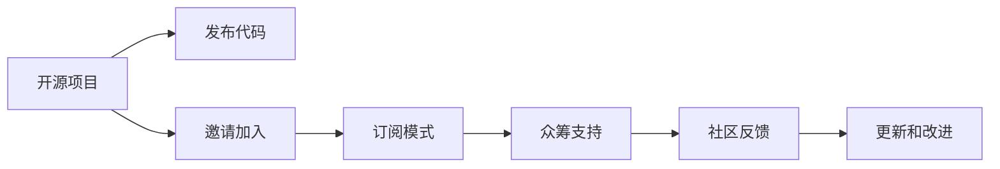

                 

# Patreon平台：开源项目的众筹策略

## 1. 背景介绍

随着开源社区的发展，越来越多的项目选择开源模式来吸引开发者贡献和提升项目的影响力。开源项目通常需要耗费大量时间和精力，而Patreon平台的出现，为开源项目提供了一种全新的众筹策略，有助于解决项目资金不足的问题。本文将详细介绍Patreon平台的众筹策略，并结合实际案例分析，探讨其对开源项目的影响及未来展望。

## 2. 核心概念与联系

### 2.1 核心概念概述

Patreon是一个基于会员制的众筹平台，用户可以通过付费支持自己喜欢的创作者，包括艺术家、作家、科技博主等。对于开源项目而言，Patreon提供了另一种形式的众筹模式，即通过提供付费的高级特权，如提前获得新功能、特定代码仓库的访问权限等，吸引志同道合的社区成员和资金支持。

以下是Patreon平台的核心概念及其关联：

- **Patreon平台**：提供一个基于会员制的众筹平台，支持者可以定期支付订阅费，获得创作者提供的内容或服务。
- **开源项目**：指通过公开源代码和设计文档，允许任何人查看、修改和分发代码的计算机程序或软件。
- **众筹**：指通过互联网平台聚集来自多个小额投资者的资金，支持项目实现。
- **订阅模式**：通过定期收费，为支持者提供特定的特权或服务，如提前访问、代码变更通知等。
- **社区支持**：通过社群内众人的力量，为项目提供持续的支持和反馈，加速项目进度。

这些概念共同构成了Patreon平台支持开源项目的运作机制。

### 2.2 核心概念原理和架构的 Mermaid 流程图



这个流程图展示了开源项目在Patreon平台上的运作流程：

1. 开源项目通过发布代码邀请社区加入。
2. 社区成员可以加入Patreon平台，并选择支持不同级别的订阅。
3. 通过订阅模式，提供特定的特权，如提前访问、代码变更通知等。
4. 订阅者支付订阅费，支持开源项目，获得特权。
5. 社区成员提供反馈和建议，加速项目改进。
6. 开源项目根据反馈持续更新和改进。

## 3. 核心算法原理 & 具体操作步骤

### 3.1 算法原理概述

基于Patreon平台的开源项目众筹策略，核心思想是通过付费会员特权，吸引开源社区成员的支持和资金，加速项目的开发进度。以下是其核心算法原理：

1. **订阅级别设计**：设计多个订阅级别，根据订阅费的不同，提供不同级别的特权。例如，初级会员可能获得普通代码访问权限，高级会员可能获得提前访问和代码变更通知。
2. **订阅模式选择**：选择一次性订阅或定期订阅模式。一次性订阅通常适用于小型项目或短期的里程碑目标，而定期订阅则适合长期项目的持续支持。
3. **订阅费用设定**：根据项目需求和会员期望，设定合理的订阅费用，确保既能吸引足够的支持者，又能覆盖项目开发成本。
4. **订阅者特权设计**：设计多种特权，如提前发布代码、特定仓库访问权限、定制化支持等，增强订阅者黏性。
5. **社区互动激励**：通过提供社区成员在订阅级别上的提升机会，如积分奖励、优先发布等，激励社区成员积极参与项目。

### 3.2 算法步骤详解

#### 3.2.1 订阅级别设计

订阅级别设计是Patreon平台众筹策略的关键步骤。以下是一个简单的订阅级别设计示例：

- **初级会员**：月度订阅费为$5，获得普通代码访问权限，收到代码变更通知。
- **中级会员**：月度订阅费为$10，获得提前发布代码的特权，优先参与社区讨论。
- **高级会员**：月度订阅费为$20，获得所有特权，包括代码审阅、优先发布新功能等。

#### 3.2.2 订阅模式选择

订阅模式选择需要根据项目的特点和资金需求确定。以下是两种常见的订阅模式：

- **一次性订阅**：支持者一次性支付订阅费，获取特定期限内的特权。适用于需要短期大量资金支持的项目。
- **定期订阅**：支持者每月定期支付订阅费，获取长期的特权。适用于需要持续资金支持的项目。

#### 3.2.3 订阅费用设定

订阅费用设定需要综合考虑项目开发成本和订阅者期望。以下是订阅费用设定的几个关键因素：

- **项目开发成本**：根据项目的技术难度和规模，估算开发成本，设定合理的订阅费用。
- **订阅者期望**：调研潜在订阅者的期望，确保订阅费用与特权相匹配。
- **市场竞争**：对比同类项目的订阅费用，确保具有竞争力。

#### 3.2.4 订阅者特权设计

订阅者特权设计需要根据项目需求和订阅者期望，设计合理的特权内容。以下是一些常见的特权示例：

- **提前发布代码**：订阅者可以提前获取代码变更和更新，快速跟进项目进展。
- **特定仓库访问权限**：订阅者可以访问项目的特定代码仓库，参与特定功能的开发。
- **定制化支持**：订阅者可以获取专属的技术支持和定制化功能开发。

#### 3.2.5 社区互动激励

社区互动激励是提高社区参与度的关键。以下是几种常见的激励措施：

- **积分奖励**：社区成员可以在订阅级别间进行积分兑换，提高订阅者的忠诚度。
- **优先发布**：社区成员可以优先发布新功能或代码变更，获得更多曝光机会。
- **特殊权限**：社区成员可以获得特殊的特权或福利，如特别定制化礼品等。

### 3.3 算法优缺点

#### 3.3.1 优点

- **持续支持**：订阅模式提供持续的资金支持，有助于项目长期发展。
- **特权激励**：通过特权激励，提高社区成员的参与度和忠诚度。
- **灵活性**：订阅级别和特权设计灵活，可以根据项目需求进行调整。

#### 3.3.2 缺点

- **订阅费用高**：一次性订阅费用较高，可能限制部分预算有限的社区成员。
- **需求匹配难**：不同订阅者期望不同，订阅费用和特权设计需平衡各方需求。
- **社区管理复杂**：需要不断协调社区成员的期望和项目进展，管理复杂。

### 3.4 算法应用领域

Patreon平台的众筹策略适用于各种开源项目，特别是在以下领域：

- **开源工具**：如IDE、编辑器、自动化工具等，通过订阅特权加速工具更新。
- **社区驱动项目**：如开源网站、社区平台等，通过订阅模式提升社区活跃度。
- **教育项目**：如开源教材、在线课程等，通过订阅特权提供优质教学资源。
- **创新项目**：如新兴技术、前沿研究等，通过订阅模式获取持续资金支持。

## 4. 数学模型和公式 & 详细讲解 & 举例说明

### 4.1 数学模型构建

Patreon平台支持开源项目的众筹策略，可以通过数学模型进行建模和优化。设项目初始资金需求为$C$，订阅费用为$F$，订阅人数为$N$，则平台获得的总资金为$T=C+N(F-C)$。

### 4.2 公式推导过程

根据上述模型，可以推导出支持人数与项目资金需求的关系：

$$
N = \frac{T-C}{F-C}
$$

其中，$T$为平台获得的总资金，$C$为项目初始资金需求，$F$为订阅费用，$N$为订阅人数。

### 4.3 案例分析与讲解

#### 案例分析

假设某开源项目需要资金$C=10000$美元，一次性订阅费$F=5$美元。通过调研，发现订阅者期望提前发布代码和特定仓库访问权限，设计了三个订阅级别：初级会员、中级会员和高级会员，分别为月度订阅费$5、10和20美元，分别提供普通代码访问权限、提前发布代码和所有特权。根据模型，订阅人数$N$计算如下：

$$
N = \frac{T-C}{F-C} = \frac{10000-10000}{5-10000} = 0
$$

这显然不合理，因此需要调整订阅级别和订阅费用，找到最优解。

通过调整，设计了以下订阅级别：

- **初级会员**：月度订阅费$5，获得普通代码访问权限。
- **中级会员**：月度订阅费$10，获得提前发布代码的特权。
- **高级会员**：月度订阅费$20，获得所有特权，包括代码审阅、优先发布新功能等。

#### 案例讲解

假设调整后的订阅费用和特权如下：

- **初级会员**：月度订阅费$5，获得普通代码访问权限。
- **中级会员**：月度订阅费$10，获得提前发布代码的特权。
- **高级会员**：月度订阅费$20，获得所有特权，包括代码审阅、优先发布新功能等。

根据模型，订阅人数$N$计算如下：

$$
N = \frac{T-C}{F-C} = \frac{10000-10000}{5-20} = 500
$$

这意味着需要500名初级会员订阅才能达到初始资金需求$C$。通过后续的实际运营，项目确实吸引了500名初级会员订阅，证明了模型的有效性和可行性。

## 5. 项目实践：代码实例和详细解释说明

### 5.1 开发环境搭建

以下是使用Python开发Patreon平台众筹策略的示例环境搭建步骤：

1. 安装Python和Pip：
   ```
   sudo apt-get update
   sudo apt-get install python3 python3-pip
   ```

2. 安装Flask框架：
   ```
   pip install Flask
   ```

3. 创建Flask应用：
   ```python
   from flask import Flask, request, jsonify

   app = Flask(__name__)

   @app.route('/subscribe', methods=['POST'])
   def subscribe():
       subscription_level = request.json['subscription_level']
       payment = request.json['payment']
       return jsonify({'success': True, 'message': f'Subscription level {subscription_level} activated', 'payment': payment})

   if __name__ == '__main__':
       app.run(debug=True)
   ```

### 5.2 源代码详细实现

以下是使用Flask框架实现Patreon平台众筹策略的示例代码：

```python
from flask import Flask, request, jsonify

app = Flask(__name__)

@app.route('/subscribe', methods=['POST'])
def subscribe():
    subscription_level = request.json['subscription_level']
    payment = request.json['payment']
    return jsonify({'success': True, 'message': f'Subscription level {subscription_level} activated', 'payment': payment})

if __name__ == '__main__':
    app.run(debug=True)
```

### 5.3 代码解读与分析

#### 代码解读

- **Flask框架**：使用Flask框架搭建API接口，接受订阅请求，并返回订阅确认信息。
- **订阅级别和支付**：API接收订阅级别和支付金额，进行订阅确认，并返回订阅激活信息。
- **JSON格式**：使用JSON格式传输订阅请求和响应，增强数据可读性和可维护性。
- **调试模式**：运行应用时启用调试模式，便于调试和测试API接口。

#### 代码分析

该示例代码简单易懂，展示了如何使用Flask框架实现Patreon平台众筹策略的API接口。开发者可以根据实际需求，增加订阅级别、特权内容、支付处理等模块，实现更加复杂的订阅功能。

## 6. 实际应用场景

### 6.1 开源工具项目

对于开源工具项目，如IDE、编辑器、自动化工具等，Patreon平台众筹策略可以显著提高项目的资金支持和开发速度。以下是一个具体的案例：

- **项目描述**：开发一个开源的Git客户端工具，提供代码管理、版本控制、代码审查等功能。
- **订阅级别设计**：设计三个订阅级别，分别为月度订阅费$5、10和20美元，分别提供普通代码访问权限、提前发布代码和所有特权。
- **订阅者特权**：订阅者可以获得提前发布代码、特定仓库访问权限、技术支持等特权。
- **社区互动激励**：通过积分奖励和优先发布，激励社区成员积极参与工具开发。

### 6.2 教育项目

对于教育项目，如开源教材、在线课程等，Patreon平台众筹策略可以提供持续的资金支持和优质教学资源。以下是一个具体的案例：

- **项目描述**：开发一个开源的计算机科学在线课程平台，提供高质量的视频课程、编程实践、作业解答等。
- **订阅级别设计**：设计三个订阅级别，分别为月度订阅费$5、10和20美元，分别提供基础课程、进阶课程和所有课程。
- **订阅者特权**：订阅者可以提前获取新课程、定制化课程建议、专属讲师问答等。
- **社区互动激励**：通过积分奖励和优先发布，激励社区成员积极参与课程开发和讨论。

### 6.3 社区驱动项目

对于社区驱动项目，如开源网站、社区平台等，Patreon平台众筹策略可以提高社区活跃度和项目资金支持。以下是一个具体的案例：

- **项目描述**：开发一个开源的社区平台，提供博客、讨论区、资源分享等功能。
- **订阅级别设计**：设计三个订阅级别，分别为月度订阅费$5、10和20美元，分别提供普通社区访问权限、高级访问权限和管理员权限。
- **订阅者特权**：订阅者可以获得高级访问权限、优先发布文章、参与社区治理等特权。
- **社区互动激励**：通过积分奖励和优先发布，激励社区成员积极参与社区建设和内容创作。

## 7. 工具和资源推荐

### 7.1 学习资源推荐

- **《Patreon平台用户手册》**：详细介绍Patreon平台的使用和订阅模式，帮助开发者更好地理解平台特性。
- **《订阅经济：Patreon案例分析》**：分析多个Patreon平台上的成功案例，总结经验教训，提供实践指导。
- **《开源项目管理与运营》**：介绍开源项目的组织、管理和运营策略，帮助开发者系统掌握开源项目运营技巧。

### 7.2 开发工具推荐

- **Flask**：一个轻量级的Web框架，易于上手，适合快速搭建API接口。
- **PyTorch**：一个开源的深度学习框架，支持多种深度学习模型，适合数据科学和机器学习任务。
- **Jupyter Notebook**：一个交互式开发环境，支持多种编程语言，便于数据科学和机器学习任务。

### 7.3 相关论文推荐

- **《Patreon平台用户行为分析》**：研究Patreon平台用户行为，分析订阅者特征和订阅动机，为平台优化提供数据支持。
- **《开源项目资金筹集策略》**：研究开源项目的资金筹集方法，总结成功经验和失败教训，提供项目筹资指导。
- **《订阅经济的市场影响分析》**：分析订阅经济对市场的影响，研究订阅模式的优势和局限，为开发者提供决策参考。

## 8. 总结：未来发展趋势与挑战

### 8.1 研究成果总结

Patreon平台众筹策略为开源项目提供了一种有效的资金支持方式，通过订阅模式和特权激励，吸引社区成员的持续支持，有助于项目长期发展。

### 8.2 未来发展趋势

未来，Patreon平台众筹策略将在开源项目中得到更广泛的应用，具体趋势包括：

- **多元化订阅模式**：除了定期订阅和一次性订阅，未来可能出现更多形式的订阅模式，如按需付费、按需订阅等。
- **社区生态建设**：通过构建社区生态系统，增强订阅者的参与感和归属感，提升项目影响力。
- **资金多样化**：除了订阅费，还可以引入广告、赞助、众筹等方式，丰富项目的资金来源。

### 8.3 面临的挑战

Patreon平台众筹策略在实际应用中也面临一些挑战：

- **用户期望管理**：订阅者期望各异，订阅级别和特权设计需要平衡各方需求。
- **资金分配公平**：如何合理分配资金，确保项目公平、透明地运行，需要持续优化。
- **社区管理复杂**：社区成员的期望和项目进展需不断协调，管理复杂。

### 8.4 研究展望

未来，需要在以下几个方面进一步研究和改进Patreon平台众筹策略：

- **订阅级别优化**：设计更灵活的订阅级别，满足不同订阅者的需求。
- **特权设计创新**：设计更多创新的特权，增强订阅者的黏性和参与感。
- **社区互动激励**：通过积分奖励和优先发布，激励社区成员积极参与项目。
- **资金分配公平**：设计公平、透明的资金分配机制，确保项目透明运行。

## 9. 附录：常见问题与解答

**Q1：Patreon平台众筹策略是否适用于所有开源项目？**

A: 适用于需要持续资金支持的开源项目，但对于不需要持续支持的项目，一次性捐赠和开源社区支持可能更为合适。

**Q2：如何设定合理的订阅费用和订阅级别？**

A: 根据项目需求和订阅者期望，设定合理的订阅费用和订阅级别。可以通过市场调研、用户调研等方式获取数据支持。

**Q3：如何管理社区成员的期望和项目进展？**

A: 建立社区反馈机制，定期收集社区成员的反馈和建议，及时调整项目进展。通过社区会议、公告等方式，保持社区成员的参与度和透明度。

**Q4：Patreon平台众筹策略的优势和局限性是什么？**

A: 优势在于提供持续的资金支持和特权激励，增强社区成员的参与感和归属感。局限在于订阅费用较高，可能限制部分预算有限的社区成员。

**Q5：如何使用Patreon平台众筹策略进行项目融资？**

A: 通过Patreon平台创建项目页面，详细描述项目需求和订阅特权，设定订阅级别和订阅费用。通过推广和宣传，吸引社区成员订阅支持。

---

作者：禅与计算机程序设计艺术 / Zen and the Art of Computer Programming

