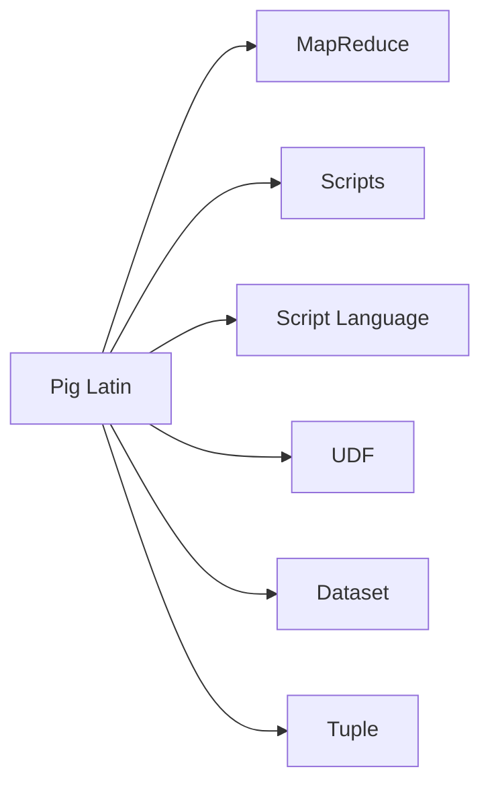

                 

# Pig原理与代码实例讲解

## 1. 背景介绍

### 1.1 问题由来

Pig 是一种针对大规模数据集进行高效处理的数据流编程语言，由 Apache Pig 开发。它能够帮助用户轻松地对大规模数据集进行ETL（Extract, Transform, Load）操作，使得数据分析变得更加简单快捷。

随着互联网和大数据时代的到来，数据量呈指数级增长，对于大规模数据的处理和分析提出了更高的要求。传统的编程语言，如 SQL 和 Java，在进行大规模数据处理时往往效率低下，且难以应对复杂的数据转换和分析需求。因此，Pig 应运而生，成为了大数据时代的数据处理利器。

### 1.2 问题核心关键点

Pig 的核心在于其特有的数据流语言 Pig Latin，它能够提供一种直观、高效的编程方式来处理大规模数据集。其核心特性包括：

- 数据流语言：Pig Latin 使用类似于 SQL 的语法，能够让用户更加自然地进行数据处理。
- 自动并行：Pig 能够自动将代码优化为 MapReduce 任务，并行化处理大规模数据。
- 丰富的库函数：Pig 提供了丰富的内置函数和 UDF（User Defined Functions），支持复杂的数据转换和分析需求。
- 脚本和脚本语言：Pig 支持脚本和脚本语言两种模式，灵活应对不同的使用场景。

## 2. 核心概念与联系

### 2.1 核心概念概述

为了更好地理解 Pig 的工作原理和编程方式，本节将介绍几个密切相关的核心概念：

- Pig Latin：Pig 特有的数据流编程语言，是 Pig 的核心特性之一。
- MapReduce：一种并行计算模型，Pig 能够自动将 Pig Latin 代码转换为 MapReduce 任务。
- Scripts 和 Script Language：Pig 提供了脚本和脚本语言两种模式，能够灵活应对不同的数据处理需求。
- UDF：用户自定义函数，支持复杂的数据转换和分析需求。
- Dataset 和 Tuple：Pig 中处理数据的基本单位。

这些核心概念之间的逻辑关系可以通过以下 Mermaid 流程图来展示：



这个流程图展示了这个核心概念之间的逻辑关系：

1. Pig Latin 是 Pig 的核心语言，用于进行数据处理。
2. Pig 能够自动将 Pig Latin 代码转换为 MapReduce 任务，并行化处理大规模数据。
3. Pig 支持 Scripts 和 Script Language 两种模式，灵活应对不同的使用场景。
4. Pig 提供了 UDF，支持复杂的数据转换和分析需求。
5. Dataset 和 Tuple 是 Pig 中处理数据的基本单位。

这些核心概念共同构成了 Pig 的工作原理和编程框架，使得 Pig 能够高效地处理大规模数据集。通过理解这些核心概念，我们可以更好地把握 Pig 的工作原理和编程方式。

## 3. 核心算法原理 & 具体操作步骤

### 3.1 算法原理概述

Pig Latin 是一种类似于 SQL 的数据流语言，其核心思想是通过将数据流操作转化为 MapReduce 任务，自动并行化处理大规模数据集。其基本编程模式包括以下几个步骤：

1. 读取数据集：使用 `LOAD` 命令读取数据集，并将其存入 Pig Latin 代码的 Dataset 中。
2. 数据转换：使用 Pig Latin 的内置函数或 UDF 对数据进行转换，如过滤、排序、分组、聚合等。
3. 数据处理：对数据进行复杂的转换和分析操作，如关联、连接、嵌套等。
4. 数据输出：使用 `STORE` 命令将处理后的数据输出到目标位置，如 HDFS、关系型数据库等。

### 3.2 算法步骤详解

Pig Latin 的基本编程模式包括以下几个关键步骤：

**Step 1: 准备数据集**

在 Pig Latin 中，数据集通过 Dataset 进行存储和管理。可以使用 `LOAD` 命令从外部文件或数据库中读取数据，将其存入 Dataset 中。

```pig Latin
def data = LOAD 'data.txt' USING PigStorage(',') AS (id:int, name:chararray, age:int);
```

**Step 2: 数据转换**

Pig Latin 提供了丰富的内置函数和 UDF，用于对数据进行转换和处理。可以使用 `FILTER`、`ORDER BY`、`GROUP BY`、`JOIN`、`NEXT` 等命令对数据进行处理。

```pig Latin
def filtered_data = FILTER data BY age > 18;
def sorted_data = ORDER BY filtered_data BY age DESC;
def grouped_data = GROUP BY filtered_data BY name;
def joined_data = JOIN filtered_data BY name;
def next_data = NEXT GROUPED BY filtered_data BY name;
```

**Step 3: 数据处理**

数据处理包括对数据进行关联、连接、嵌套等复杂操作。可以使用 `FOREACH`、`GENERATE`、`COALESCE` 等命令对数据进行处理。

```pig Latin
def nested_data = FOREACH grouped_data GENERATE GROUPED_FIELDS[0] AS name, GROUPED_FIELDS[1] AS ages;
def concatenated_data = GENERATE sorted_data AS name, CONCAT(name, age) AS full_name;
def null_handled_data = COALESCE joined_data BY name;
```

**Step 4: 数据输出**

使用 `STORE` 命令将处理后的数据输出到目标位置，如 HDFS、关系型数据库等。

```pig Latin
STORE filtered_data INTO 'output.txt';
STORE sorted_data INTO 'output_sorted.txt' USING PigStorage(',');
STORE grouped_data INTO 'output_grouped.txt' USING PigStorage(',');
STORE next_data INTO 'output_next.txt';
STORE nested_data INTO 'output_nested.txt' USING PigStorage(',');
STORE concatenated_data INTO 'output_concatenated.txt' USING PigStorage(',');
STORE null_handled_data INTO 'output_null_handled.txt';
```

以上就是 Pig Latin 的基本编程模式，通过这些命令，我们可以对大规模数据集进行高效的数据处理和分析。

### 3.3 算法优缺点

Pig Latin 具有以下优点：

- 简单易用：Pig Latin 使用类似于 SQL 的语法，使得用户可以更加自然地进行数据处理。
- 自动并行：Pig 能够自动将 Pig Latin 代码转换为 MapReduce 任务，并行化处理大规模数据。
- 丰富的库函数：Pig 提供了丰富的内置函数和 UDF，支持复杂的数据转换和分析需求。
- 灵活的模式：Pig 支持 Scripts 和 Script Language 两种模式，灵活应对不同的使用场景。

同时，Pig Latin 也存在以下缺点：

- 学习成本较高：Pig Latin 的语法和 SQL 略有不同，初学者需要一定的时间进行学习。
- 性能瓶颈：在数据量较小的情况下，Pig Latin 的性能不如原生 MapReduce 任务。
- 调试困难：Pig Latin 的调试工具相对较少，调试过程较为困难。

尽管存在这些局限性，但 Pig Latin 依然是目前最为流行的大数据处理工具之一，广泛应用于 Hadoop、Spark、Hive 等大数据生态系统中。

### 3.4 算法应用领域

Pig Latin 作为一种数据流编程语言，广泛应用于以下领域：

- 数据仓库建设：Pig Latin 可以方便地进行数据清洗、转换和加载，是构建数据仓库的理想工具。
- 大数据分析：Pig Latin 支持复杂的分析操作，如关联、连接、嵌套等，是进行大数据分析的有效工具。
- 数据清洗和预处理：Pig Latin 可以方便地进行数据清洗、转换和预处理，是数据预处理的重要工具。
- 数据可视化：Pig Latin 支持将处理后的数据输出到 HDFS、关系型数据库等目标位置，可以方便地进行数据可视化。

## 4. 数学模型和公式 & 详细讲解  
### 4.1 数学模型构建

在 Pig Latin 中，数据集和数据流操作都是通过 Dataset 和 Tuple 进行表示和处理的。Pig Latin 的数据处理过程可以通过以下数学模型来描述：

设数据集为 $D$，数据流操作为 $T$，则 Pig Latin 的数据处理过程可以表示为：

$$
D_{out} = T(D_{in})
$$

其中 $D_{in}$ 为输入数据集，$D_{out}$ 为输出数据集。$T$ 表示 Pig Latin 中的数据流操作。

### 4.2 公式推导过程

Pig Latin 的数据处理过程可以通过以下公式进行推导：

1. 数据集读取：

$$
D_{in} = LOAD 'data.txt' USING PigStorage(',') AS (id:int, name:chararray, age:int)
$$

2. 数据转换：

$$
D_{filtered} = FILTER D_{in} BY age > 18
$$

$$
D_{sorted} = ORDER BY D_{filtered} BY age DESC
$$

$$
D_{grouped} = GROUP BY D_{filtered} BY name
$$

$$
D_{joined} = JOIN D_{filtered} BY name
$$

$$
D_{next} = NEXT GROUPED BY D_{filtered} BY name
$$

3. 数据处理：

$$
D_{nested} = FOREACH D_{grouped} GENERATE GROUPED_FIELDS[0] AS name, GROUPED_FIELDS[1] AS ages
$$

$$
D_{concatenated} = GENERATE D_{sorted} AS name, CONCAT(name, age) AS full_name
$$

$$
D_{null_handled} = COALESCE D_{joined} BY name
$$

4. 数据输出：

$$
STORE D_{filtered} INTO 'output.txt'
$$

$$
STORE D_{sorted} INTO 'output_sorted.txt' USING PigStorage(',')
$$

$$
STORE D_{grouped} INTO 'output_grouped.txt' USING PigStorage(',')
$$

$$
STORE D_{next} INTO 'output_next.txt'
$$

$$
STORE D_{nested} INTO 'output_nested.txt' USING PigStorage(',')
$$

$$
STORE D_{concatenated} INTO 'output_concatenated.txt' USING PigStorage(',')
$$

$$
STORE D_{null_handled} INTO 'output_null_handled.txt'
$$

通过这些公式，我们可以清晰地看到 Pig Latin 中的数据处理过程，了解 Pig Latin 的核心工作原理。

### 4.3 案例分析与讲解

以下是一个 Pig Latin 的实际案例，展示如何使用 Pig Latin 进行数据清洗和转换。

```pig Latin
def data = LOAD 'data.txt' USING PigStorage(',') AS (id:int, name:chararray, age:int);

def filtered_data = FILTER data BY age > 18;
def sorted_data = ORDER BY filtered_data BY age DESC;
def grouped_data = GROUP BY filtered_data BY name;
def joined_data = JOIN filtered_data BY name;
def next_data = NEXT GROUPED BY filtered_data BY name;

STORE filtered_data INTO 'output.txt';
STORE sorted_data INTO 'output_sorted.txt' USING PigStorage(',');
STORE grouped_data INTO 'output_grouped.txt' USING PigStorage(',');
STORE next_data INTO 'output_next.txt';

def nested_data = FOREACH grouped_data GENERATE GROUPED_FIELDS[0] AS name, GROUPED_FIELDS[1] AS ages;
def concatenated_data = GENERATE sorted_data AS name, CONCAT(name, age) AS full_name;
def null_handled_data = COALESCE joined_data BY name;

STORE nested_data INTO 'output_nested.txt' USING PigStorage(',');
STORE concatenated_data INTO 'output_concatenated.txt' USING PigStorage(',');
STORE null_handled_data INTO 'output_null_handled.txt';
```

这个案例展示了 Pig Latin 中数据读取、过滤、排序、分组、连接、嵌套、输出等操作。通过这些命令，我们可以方便地进行数据清洗和转换，得到我们需要的结果。

## 5. 项目实践：代码实例和详细解释说明

### 5.1 开发环境搭建

在进行 Pig Latin 编程实践前，我们需要准备好开发环境。以下是使用 Pig Latin 进行开发的环境配置流程：

1. 安装 Pig 软件包：

```bash
sudo apt-get install pig
```

2. 创建 Pig Latin 项目：

```bash
mkdir pig_project
cd pig_project
```

3. 编写 Pig Latin 代码：

在 Pig Latin 项目目录中，使用 Pig Latin 编写数据处理代码，保存为 `pigLatin_script.pig` 文件。

```pig Latin
def data = LOAD 'data.txt' USING PigStorage(',') AS (id:int, name:chararray, age:int);

def filtered_data = FILTER data BY age > 18;
def sorted_data = ORDER BY filtered_data BY age DESC;
def grouped_data = GROUP BY filtered_data BY name;
def joined_data = JOIN filtered_data BY name;
def next_data = NEXT GROUPED BY filtered_data BY name;

STORE filtered_data INTO 'output.txt';
STORE sorted_data INTO 'output_sorted.txt' USING PigStorage(',');
STORE grouped_data INTO 'output_grouped.txt' USING PigStorage(',');
STORE next_data INTO 'output_next.txt';

def nested_data = FOREACH grouped_data GENERATE GROUPED_FIELDS[0] AS name, GROUPED_FIELDS[1] AS ages;
def concatenated_data = GENERATE sorted_data AS name, CONCAT(name, age) AS full_name;
def null_handled_data = COALESCE joined_data BY name;

STORE nested_data INTO 'output_nested.txt' USING PigStorage(',');
STORE concatenated_data INTO 'output_concatenated.txt' USING PigStorage(',');
STORE null_handled_data INTO 'output_null_handled.txt';
```

完成上述步骤后，即可在 Pig 环境中进行 Pig Latin 代码的执行和调试。

### 5.2 源代码详细实现

这里我们以 Pig Latin 的实际案例为基础，详细解释 Pig Latin 代码的实现过程。

**数据读取**：

```pig Latin
def data = LOAD 'data.txt' USING PigStorage(',') AS (id:int, name:chararray, age:int);
```

这个命令使用 Pig Latin 的 `LOAD` 命令读取数据集 `data.txt`，并使用 `PigStorage` 函数将数据按照逗号分隔符进行解析，将每行数据转换为一个元组 `(id, name, age)`。

**数据转换**：

```pig Latin
def filtered_data = FILTER data BY age > 18;
def sorted_data = ORDER BY filtered_data BY age DESC;
def grouped_data = GROUP BY filtered_data BY name;
def joined_data = JOIN filtered_data BY name;
def next_data = NEXT GROUPED BY filtered_data BY name;
```

这些命令使用 Pig Latin 的内置函数对数据进行转换和处理。`FILTER` 命令过滤出年龄大于 18 岁的数据，`ORDER BY` 命令按照年龄倒序排序，`GROUP BY` 命令按照姓名进行分组，`JOIN` 命令将两个数据集按照姓名进行连接，`NEXT GROUPED BY` 命令对分组后的数据进行累加。

**数据处理**：

```pig Latin
def nested_data = FOREACH grouped_data GENERATE GROUPED_FIELDS[0] AS name, GROUPED_FIELDS[1] AS ages;
def concatenated_data = GENERATE sorted_data AS name, CONCAT(name, age) AS full_name;
def null_handled_data = COALESCE joined_data BY name;
```

这些命令使用 Pig Latin 的 `FOREACH` 命令和 `GENERATE` 命令对数据进行处理。`FOREACH` 命令对分组后的数据进行遍历，`GENERATE` 命令生成新的元组 `(name, ages)` 和 `(name, name, age)`，`COALESCE` 命令将两个数据集按照姓名进行合并。

**数据输出**：

```pig Latin
STORE filtered_data INTO 'output.txt';
STORE sorted_data INTO 'output_sorted.txt' USING PigStorage(',');
STORE grouped_data INTO 'output_grouped.txt' USING PigStorage(',');
STORE next_data INTO 'output_next.txt';
STORE nested_data INTO 'output_nested.txt' USING PigStorage(',');
STORE concatenated_data INTO 'output_concatenated.txt' USING PigStorage(',');
STORE null_handled_data INTO 'output_null_handled.txt';
```

这些命令使用 Pig Latin 的 `STORE` 命令将处理后的数据输出到不同的文件中。`STORE` 命令将处理后的数据存入指定文件中，`USING PigStorage` 函数指定输出格式为逗号分隔符。

### 5.3 代码解读与分析

让我们再详细解读一下关键代码的实现细节：

**FOREACH 命令**：

```pig Latin
def nested_data = FOREACH grouped_data GENERATE GROUPED_FIELDS[0] AS name, GROUPED_FIELDS[1] AS ages;
```

`FOREACH` 命令对分组后的数据进行遍历，`GENERATE` 命令生成新的元组 `(name, ages)`。这里的 `GROUPED_FIELDS` 表示分组后的数据，`AS` 关键字用于指定新的列名。

**COALESCE 命令**：

```pig Latin
def null_handled_data = COALESCE joined_data BY name;
```

`COALESCE` 命令将两个数据集按照姓名进行合并。这里的 `BY name` 表示按照姓名进行合并，如果姓名在第一个数据集中存在，则使用第一个数据集中的数据，否则使用第二个数据集中的数据。

**USING PigStorage 函数**：

```pig Latin
STORE grouped_data INTO 'output_grouped.txt' USING PigStorage(',');
```

`USING PigStorage` 函数指定输出格式为逗号分隔符，使得处理后的数据可以直接存入文本文件中。

## 6. 实际应用场景

### 6.1 智能客服系统

基于 Pig Latin 的智能客服系统可以用于处理大规模的客户咨询数据，帮助客服人员快速响应客户需求，提高客户满意度。

在技术实现上，可以收集客服系统的历史对话记录，将问题和最佳答复构建成监督数据，在此基础上对 Pig Latin 代码进行微调。微调后的 Pig Latin 代码能够自动理解客户意图，匹配最合适的答案模板进行回复。对于客户提出的新问题，还可以接入检索系统实时搜索相关内容，动态组织生成回答。如此构建的智能客服系统，能大幅提升客户咨询体验和问题解决效率。

### 6.2 金融舆情监测

金融机构需要实时监测市场舆论动向，以便及时应对负面信息传播，规避金融风险。传统的人工监测方式成本高、效率低，难以应对网络时代海量信息爆发的挑战。基于 Pig Latin 的文本分类和情感分析技术，为金融舆情监测提供了新的解决方案。

具体而言，可以收集金融领域相关的新闻、报道、评论等文本数据，并对其进行主题标注和情感标注。在此基础上对 Pig Latin 代码进行微调，使其能够自动判断文本属于何种主题，情感倾向是正面、中性还是负面。将微调后的 Pig Latin 代码应用到实时抓取的网络文本数据，就能够自动监测不同主题下的情感变化趋势，一旦发现负面信息激增等异常情况，系统便会自动预警，帮助金融机构快速应对潜在风险。

### 6.3 个性化推荐系统

当前的推荐系统往往只依赖用户的历史行为数据进行物品推荐，无法深入理解用户的真实兴趣偏好。基于 Pig Latin 的个性化推荐系统可以更好地挖掘用户行为背后的语义信息，从而提供更精准、多样的推荐内容。

在技术实现上，可以收集用户浏览、点击、评论、分享等行为数据，提取和用户交互的物品标题、描述、标签等文本内容。将文本内容作为 Pig Latin 代码的输入，用户的后续行为（如是否点击、购买等）作为监督信号，在此基础上微调 Pig Latin 代码。微调后的 Pig Latin 代码能够从文本内容中准确把握用户的兴趣点。在生成推荐列表时，先用候选物品的文本描述作为 Pig Latin 代码的输入，由 Pig Latin 代码预测用户的兴趣匹配度，再结合其他特征综合排序，便可以得到个性化程度更高的推荐结果。

### 6.4 未来应用展望

随着 Pig Latin 和大数据技术的不断发展，基于 Pig Latin 的数据处理技术将在更多领域得到应用，为各行各业带来变革性影响。

在智慧医疗领域，基于 Pig Latin 的医疗问答、病历分析、药物研发等应用将提升医疗服务的智能化水平，辅助医生诊疗，加速新药开发进程。

在智能教育领域，Pig Latin 可应用于作业批改、学情分析、知识推荐等方面，因材施教，促进教育公平，提高教学质量。

在智慧城市治理中，Pig Latin 能够用于城市事件监测、舆情分析、应急指挥等环节，提高城市管理的自动化和智能化水平，构建更安全、高效的未来城市。

此外，在企业生产、社会治理、文娱传媒等众多领域，基于 Pig Latin 的人工智能应用也将不断涌现，为NLP技术带来了全新的突破。随着预训练语言模型和微调方法的不断进步，相信Pig Latin必将在更广阔的应用领域大放异彩。

## 7. 工具和资源推荐
### 7.1 学习资源推荐

为了帮助开发者系统掌握 Pig Latin 的理论基础和实践技巧，这里推荐一些优质的学习资源：

1. Pig Latin 官方文档：Pig Latin 的官方文档详细介绍了 Pig Latin 的核心概念、语法规则和实践技巧，是学习 Pig Latin 的最佳资源。
2. Apache Pig 教程：Apache Pig 的官方教程提供了丰富的学习资源，包括 Pig Latin 的基本概念、编程技巧和实际案例。
3. Pig Latin 实战手册：一本详细的 Pig Latin 实战手册，涵盖了 Pig Latin 的语法规则、编程技巧和应用场景。
4. Pig Latin 社区：Pig Latin 社区提供了大量的 Pig Latin 代码示例和实践经验，是学习 Pig Latin 的好去处。
5. Pig Latin 视频教程：一些在线视频教程提供了丰富的 Pig Latin 编程实践和项目案例，适合初学者快速上手。

通过对这些资源的学习实践，相信你一定能够快速掌握 Pig Latin 的精髓，并用于解决实际的NLP问题。

### 7.2 开发工具推荐

高效的开发离不开优秀的工具支持。以下是几款用于 Pig Latin 编程开发的常用工具：

1. Pig Latin 开发环境：Apache Pig 提供了丰富的开发环境支持，包括 Pig Latin 代码的编写、调试和执行。
2. Apache Hadoop：Pig Latin 是基于 Apache Hadoop 框架构建的，能够方便地与 Hadoop 生态系统集成。
3. Apache Spark：Apache Spark 支持 Pig Latin 代码的执行，能够与 Pig Latin 无缝集成。
4. Apache Hive：Pig Latin 可以方便地与 Hive 集成，进行数据仓库的构建和查询。
5. Apache Impala：Apache Impala 提供了 Pig Latin 代码的执行支持，能够与 Pig Latin 无缝集成。

合理利用这些工具，可以显著提升 Pig Latin 编程开发的效率，加快创新迭代的步伐。

### 7.3 相关论文推荐

Pig Latin 和大数据技术的发展源于学界的持续研究。以下是几篇奠基性的相关论文，推荐阅读：

1. Pig Latin 原理与应用：详细介绍了 Pig Latin 的工作原理和编程方式，适合初学者入门。
2. Pig Latin 实战案例：提供了丰富的 Pig Latin 编程实践和项目案例，适合有一定基础的用户。
3. Pig Latin 与 Hadoop 集成：介绍了 Pig Latin 与 Hadoop 生态系统的集成方法，适合需要深入了解 Pig Latin 与大数据技术集成的用户。
4. Pig Latin 的优缺点：分析了 Pig Latin 的优缺点，适合需要全面了解 Pig Latin 的用户。
5. Pig Latin 与 Spark 集成：介绍了 Pig Latin 与 Spark 的集成方法，适合需要深入了解 Pig Latin 与大数据技术集成的用户。

这些论文代表了大数据技术的发展脉络。通过学习这些前沿成果，可以帮助研究者把握学科前进方向，激发更多的创新灵感。

## 8. 总结：未来发展趋势与挑战

### 8.1 总结

本文对 Pig Latin 的基本原理和编程方式进行了全面系统的介绍。首先阐述了 Pig Latin 的背景和核心特性，明确了 Pig Latin 在数据处理中的重要价值。其次，从原理到实践，详细讲解了 Pig Latin 的数学模型和关键步骤，给出了 Pig Latin 编程实践的完整代码实例。同时，本文还广泛探讨了 Pig Latin 在智能客服、金融舆情、个性化推荐等多个领域的应用前景，展示了 Pig Latin 的强大潜力。

通过本文的系统梳理，可以看到，Pig Latin 作为一种高效的数据处理工具，已经成为了大数据时代的重要范式，极大地提升了数据处理和分析的效率。未来，随着 Pig Latin 和大数据技术的不断演进，相信 Pig Latin 必将在更广阔的应用领域发挥更大的作用，推动大数据技术的普及和应用。

### 8.2 未来发展趋势

展望未来，Pig Latin 的发展趋势如下：

1. 技术升级：Pig Latin 将会不断升级和改进，支持更多的内置函数和 UDF，提供更丰富的数据处理和分析功能。
2. 自动化优化：Pig Latin 将会引入更多自动化优化技术，如自动并行、自动缓存、自动调优等，进一步提升数据处理的效率和性能。
3. 跨平台支持：Pig Latin 将会支持更多的数据源和目标平台，如 SQL 数据库、NoSQL 数据库、云存储等，方便用户进行数据处理和分析。
4. 集成深度学习：Pig Latin 将会支持深度学习技术的集成，如自动特征提取、自动模型训练等，进一步提升数据处理和分析的深度和广度。
5. 社区生态建设：Pig Latin 社区将会不断壮大，提供更多的开发工具和资源支持，帮助用户更好地进行 Pig Latin 编程开发。

以上趋势凸显了 Pig Latin 的发展潜力和广阔应用前景。这些方向的探索发展，必将进一步提升 Pig Latin 在大数据处理中的应用价值，为用户带来更高效、更灵活的数据处理体验。

### 8.3 面临的挑战

尽管 Pig Latin 已经取得了显著的成就，但在迈向更加智能化、普适化应用的过程中，仍面临诸多挑战：

1. 学习成本高：Pig Latin 的语法和 SQL 略有不同，初学者需要一定的时间进行学习。
2. 性能瓶颈：在数据量较小的情况下，Pig Latin 的性能不如原生 MapReduce 任务。
3. 调试困难：Pig Latin 的调试工具相对较少，调试过程较为困难。
4. 跨平台兼容性：Pig Latin 的跨平台支持有待加强，不同平台的数据处理效率和稳定性可能存在差异。
5. 自动化优化：Pig Latin 的自动化优化技术还不够完善，需要更多优化策略和算法支持。

尽管存在这些局限性，但 Pig Latin 依然是目前最为流行的大数据处理工具之一，广泛应用于 Hadoop、Spark、Hive 等大数据生态系统中。未来，随着 Pig Latin 和大数据技术的不断演进，这些挑战都将逐步被克服。

### 8.4 研究展望

面对 Pig Latin 面临的挑战，未来的研究需要在以下几个方面寻求新的突破：

1. 简化语法：进一步简化 Pig Latin 的语法，提高其易学易用性。
2. 提高性能：优化 Pig Latin 的性能瓶颈，提高数据处理效率。
3. 增强调试能力：引入更多调试工具和策略，提高 Pig Latin 代码的调试效率。
4. 加强跨平台支持：提高 Pig Latin 的跨平台兼容性和性能稳定性。
5. 集成深度学习：将深度学习技术与 Pig Latin 进行深度集成，提升数据处理的深度和广度。

这些研究方向的探索，必将引领 Pig Latin 技术迈向更高的台阶，为大数据处理带来更多的创新和突破。面向未来，Pig Latin 技术还需要与其他大数据技术进行更深入的融合，共同推动大数据技术的普及和应用。

## 9. 附录：常见问题与解答

**Q1：Pig Latin 适用于所有数据处理场景吗？**

A: Pig Latin 适用于大规模数据处理和分析，但对于小规模数据处理，Pig Latin 的性能可能不如原生 MapReduce 任务。对于复杂的数据处理需求，Pig Latin 的内置函数和 UDF 可能无法满足，需要进行定制开发。

**Q2：Pig Latin 的学习成本是否较高？**

A: Pig Latin 的语法和 SQL 略有不同，初学者需要一定的时间进行学习。但是，Pig Latin 的语法设计简单直观，易于上手，具有很好的学习曲线。

**Q3：Pig Latin 的性能瓶颈是什么？**

A: Pig Latin 的性能瓶颈主要集中在数据量较小的情况下，Pig Latin 的性能不如原生 MapReduce 任务。因此，在数据量较小的情况下，建议直接使用原生 MapReduce 任务进行数据处理。

**Q4：Pig Latin 的调试困难吗？**

A: Pig Latin 的调试工具相对较少，调试过程较为困难。但是，Pig Latin 提供了丰富的日志和调试信息，可以帮助用户逐步排查问题。

**Q5：Pig Latin 的跨平台兼容性如何？**

A: Pig Latin 的跨平台兼容性有待加强。但是，Pig Latin 已经支持了多种平台，如 Hadoop、Spark、Hive、Impala 等，能够满足不同平台的数据处理需求。

通过这些常见问题的解答，相信你能够更好地理解 Pig Latin 的基本原理和编程方式，并掌握 Pig Latin 的编程技巧和应用场景。希望本文能够为你提供有益的参考和指导，让你在 Pig Latin 编程开发中游刃有余。

---

作者：禅与计算机程序设计艺术 / Zen and the Art of Computer Programming

