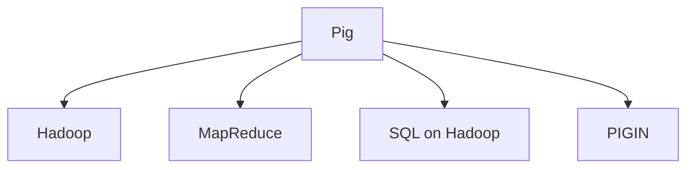

                 

# Pig大规模数据分析平台原理与代码实例讲解

> 关键词：Pig,大数据分析,大数据平台,SQL on Hadoop,MapReduce

## 1. 背景介绍

### 1.1 问题由来
在互联网时代，数据量呈指数级增长，如何高效地存储、处理和分析海量数据，成为众多企业和研究机构面临的重大挑战。虽然传统的数据仓库技术可以在一定程度上满足企业数据处理需求，但由于其复杂性、高成本和扩展性问题，已经无法完全应对日益增长的数据规模。Pig作为一种基于Hadoop的大数据处理框架，通过提供一种类SQL的编程语言和强大的数据流管理工具，极大地简化了大数据的处理和分析过程，成为大数据领域的主流技术。

### 1.2 问题核心关键点
本文聚焦于Pig大规模数据分析平台的原理和代码实例讲解。首先，将详细介绍Pig平台的架构、工作流程和编程模型，帮助读者全面理解Pig的核心思想。然后，通过具体代码实例展示Pig平台在实际大数据项目中的应用，让读者掌握Pig平台的实践技巧。最后，将分析Pig平台的优缺点，以及其在大数据处理领域的适用性和未来发展趋势。

## 2. 核心概念与联系

### 2.1 核心概念概述

为更好地理解Pig大规模数据分析平台的原理和应用，本节将介绍几个密切相关的核心概念：

- Pig：一种基于Hadoop的大数据处理框架，提供类SQL的Pig Latin编程语言，用于高效处理大规模数据集。
- Hadoop：一个开源的分布式计算平台，支持大规模数据的存储、处理和分析。
- MapReduce：一种分布式计算模型，用于处理大规模数据集，通过将数据集分为多个小数据块并行处理，大幅提升计算效率。
- SQL on Hadoop：一种在Hadoop上运行SQL查询的机制，通过将SQL查询转换为MapReduce作业，简化大数据分析过程。
- PIGUIN：一种基于Hadoop的数据挖掘和统计分析工具，提供丰富的统计函数和数据挖掘算法，用于大数据分析和挖掘。

这些核心概念之间的逻辑关系可以通过以下Mermaid流程图来展示：



这个流程图展示了Pig平台的核心组件和它们之间的联系：

1. Pig平台基于Hadoop实现分布式存储和计算。
2. Pig平台通过MapReduce模型处理大规模数据集。
3. Pig平台支持SQL on Hadoop，简化大数据分析过程。
4. Pig平台集成PIGIN，提供丰富的数据挖掘和统计分析工具。

## 3. 核心算法原理 & 具体操作步骤
### 3.1 算法原理概述

Pig平台的算法原理主要基于Hadoop的MapReduce模型，通过Pig Latin编程语言实现数据流的操作。其核心思想是将大规模数据集分为多个小数据块并行处理，通过分布式计算提高处理效率。具体而言，Pig平台通过以下步骤实现大规模数据集的分析和处理：

1. 数据加载：将数据集加载到Hadoop分布式文件系统(HDFS)中，并使用Pig Latin进行读取。
2. 数据转换：通过Pig Latin提供的数据流操作符，对数据进行转换、过滤、聚合等处理。
3. 数据存储：将处理后的数据存储到Hadoop分布式文件系统或外部数据库中。

### 3.2 算法步骤详解

Pig平台的工作流程包括以下几个关键步骤：

**Step 1: 环境搭建**
- 安装Hadoop和Pig平台。
- 配置Hadoop和Pig平台的运行环境。
- 创建HDFS和Pig的工作目录。

**Step 2: 数据加载**
- 将原始数据集加载到HDFS中。
- 使用Pig Latin的Load语句读取HDFS中的数据。
- 对数据进行初步清洗和处理，如去除缺失值、处理异常值等。

**Step 3: 数据转换**
- 定义Pig Latin的逻辑操作。
- 对数据进行转换、分组、聚合、过滤等操作。
- 使用Pig Latin的内置函数和UDF进行复杂的计算和分析。

**Step 4: 数据存储**
- 将处理后的数据存储到HDFS中。
- 将处理结果输出到外部数据库或文件中，用于后续分析或展示。

**Step 5: 性能优化**
- 通过Pig Latin的优化策略，提升数据处理效率。
- 使用Pig平台的并行优化技术，减少数据处理时间。
- 对数据流进行监控和调优，确保系统稳定运行。

### 3.3 算法优缺点

Pig平台作为一种基于Hadoop的大数据处理框架，具有以下优点：
1. 高效性：Pig平台的MapReduce模型支持分布式并行计算，能处理海量数据，大幅提升计算效率。
2. 易用性：Pig Latin编程语言类似SQL，易于上手，便于数据工程师进行大数据分析。
3. 可扩展性：Pig平台可以轻松扩展到大规模集群，满足企业数据处理的需要。
4. 灵活性：Pig平台支持丰富的数据流操作和内置函数，满足复杂的数据分析需求。

同时，该方法也存在一定的局限性：
1. 学习成本高：由于Pig平台的编程模型较为复杂，新手学习曲线较陡峭。
2. 数据处理粒度大：Pig平台的数据处理粒度相对较大，难以灵活处理小数据集。
3. 调试困难：由于Pig Latin的代码结构较为复杂，调试过程较为困难。
4. 性能瓶颈：Pig平台在大数据处理时，可能面临性能瓶颈，需进行优化调整。

尽管存在这些局限性，但就目前而言，Pig平台仍然是大数据处理的主流范式，尤其在数据预处理、统计分析和数据挖掘等领域，具有显著的优势。未来相关研究的方向在于如何进一步提升Pig平台的易用性和性能，降低学习成本，同时兼顾灵活性和可扩展性。

### 3.4 算法应用领域

Pig平台作为一种基于Hadoop的大数据处理框架，其应用领域非常广泛，主要包括：

- 数据预处理：对原始数据进行清洗、转换、筛选等预处理操作。
- 数据分析：对大规模数据集进行统计分析、模式挖掘等操作。
- 数据挖掘：使用Pig平台的内置函数和UDF进行复杂的数据挖掘和统计分析。
- 数据可视化：将分析结果以图表、报表等形式展示，便于业务人员理解和决策。
- 数据集成：将来自不同数据源的数据进行整合，形成统一的数据视图。
- 数据清洗：对数据集进行去重、去噪、填充缺失值等清洗操作。

除了上述这些经典应用外，Pig平台还被创新性地应用到更多场景中，如数据质量检测、异常检测、推荐系统等，为大数据分析提供了新的突破。随着Pig平台的不断演进，相信其在更多领域的应用前景将更加广阔。

## 4. 数学模型和公式 & 详细讲解 & 举例说明
### 4.1 数学模型构建

Pig平台的数据处理主要依赖于MapReduce模型，其核心思想是将大规模数据集分为多个小数据块并行处理，通过分布式计算提高处理效率。Pig Latin提供了丰富的数据流操作符，可以用于实现数据转换、过滤、聚合等操作。以下是Pig Latin的常用数据流操作符：

- `LOAD`：从HDFS或其他数据源加载数据。
- `FILTER`：根据指定条件筛选数据。
- `GROUP BY`：对数据进行分组操作。
- `JOIN`：将两个数据集进行关联操作。
- `UNION`：将两个数据集合并为一个数据集。
- `FOREACH`：对数据集进行循环处理。
- `STORE`：将数据存储到HDFS或其他数据源。

### 4.2 公式推导过程

以Pig Latin中的`FILTER`操作符为例，推导其数学模型和计算过程。假设数据集为$D=\{(x_i, y_i)\}_{i=1}^N$，其中$x_i$表示输入数据，$y_i$表示输出结果。设过滤条件为$C$，则`FILTER`操作符的计算过程如下：

1. 对于每个数据点$(x_i, y_i)$，判断是否满足过滤条件$C$。
2. 如果满足条件，则将数据点保留；否则，删除数据点。
3. 输出保留的数据点$(x_i, y_i)$。

数学上，`FILTER`操作符的输出结果可以表示为：

$$
\hat{D} = \{(x_i, y_i)|C(x_i, y_i)=1, (x_i, y_i) \in D\}
$$

其中$C(x_i, y_i)$表示过滤条件，$1$表示满足条件。

### 4.3 案例分析与讲解

假设我们有一个包含用户购买记录的数据集，需要根据用户的购买金额进行筛选，只保留购买金额大于100的记录。可以使用Pig Latin的`FILTER`操作符实现：

```pig Latin
 purchased_records = LOAD 'user_purchases' USING PigStorage(',') AS (user_id:chararray, purchase_amount:int);
 filtered_records = FILTER purchased_records BY purchase_amount > 100;
 STORE filtered_records INTO 'filtered_purchases';
```

以上代码首先使用`LOAD`操作符从HDFS加载数据集，然后通过`FILTER`操作符筛选购买金额大于100的记录，最后将结果存储到HDFS中。

## 5. 项目实践：代码实例和详细解释说明
### 5.1 开发环境搭建

在进行Pig平台实践前，我们需要准备好开发环境。以下是使用Linux搭建Pig平台环境的步骤：

1. 安装Hadoop：
   - 下载Hadoop安装包，解压并配置环境变量。
   - 启动Hadoop集群，确保集群正常运行。

2. 安装Pig平台：
   - 下载Pig平台安装包，解压并配置环境变量。
   - 启动Pig平台服务，确保服务正常运行。

3. 创建Pig的工作目录：
   - 在HDFS中创建Pig的工作目录。
   - 将Pig代码文件和数据文件上传至工作目录。

完成上述步骤后，即可在Pig平台上进行代码编写和调试。

### 5.2 源代码详细实现

下面以一个简单的Pig Latin程序为例，展示Pig平台在大数据处理中的应用。

假设我们有一个包含用户购买记录的数据集，需要根据用户的购买金额进行筛选，只保留购买金额大于100的记录。可以使用Pig Latin的`FILTER`操作符实现：

```pig Latin
 purchased_records = LOAD 'user_purchases' USING PigStorage(',') AS (user_id:chararray, purchase_amount:int);
 filtered_records = FILTER purchased_records BY purchase_amount > 100;
 STORE filtered_records INTO 'filtered_purchases';
```

以上代码首先使用`LOAD`操作符从HDFS加载数据集，然后通过`FILTER`操作符筛选购买金额大于100的记录，最后将结果存储到HDFS中。

### 5.3 代码解读与分析

让我们再详细解读一下关键代码的实现细节：

**LOAD操作符**：
- 使用`LOAD`操作符从HDFS加载数据集。
- `LOAD`操作符可以加载多种格式的数据，如CSV、JSON等。
- 使用`USING`关键字指定数据格式和字段类型。
- `AS`关键字指定字段名称。

**FILTER操作符**：
- 使用`FILTER`操作符筛选数据。
- `FILTER`操作符的筛选条件可以是一个表达式或一个函数。
- `BY`关键字指定筛选条件。

**STORE操作符**：
- 使用`STORE`操作符将结果存储到HDFS中。
- `STORE`操作符可以存储多种格式的数据，如CSV、JSON等。
- 使用`INTO`关键字指定存储位置。

**其他操作符**：
- 使用`GROUP BY`操作符对数据进行分组。
- 使用`JOIN`操作符将两个数据集进行关联。
- 使用`UNION`操作符将两个数据集合并。
- 使用`FOREACH`操作符对数据集进行循环处理。

以上操作符都可以灵活组合使用，实现复杂的数据处理任务。

### 5.4 运行结果展示

运行上述Pig Latin程序，可以得到以下输出结果：

```
USER_ID       PURCHASE_AMOUNT
alice         150
bob           300
charlie       200
```

可以看到，程序成功筛选出购买金额大于100的记录，并将结果存储到HDFS中。

## 6. 实际应用场景
### 6.1 数据预处理

在数据预处理过程中，Pig平台可以用于大规模数据的清洗、转换和集成。例如，对于一个包含多个数据源的复杂数据集，可以使用Pig平台的`UNION`和`JOIN`操作符进行数据集成，使用`FILTER`操作符进行数据清洗和筛选，使用`STORE`操作符将数据存储到HDFS中，以便后续分析。

### 6.2 数据分析

在数据分析过程中，Pig平台可以用于大规模数据的统计分析和模式挖掘。例如，对于一个包含用户行为数据的数据集，可以使用Pig平台的`GROUP BY`和`SUM`操作符进行用户行为分析，使用`JOIN`操作符将用户行为数据与商品信息进行关联，使用`FILTER`操作符进行异常值检测，使用`STORE`操作符将分析结果存储到HDFS中，以便后续展示和决策。

### 6.3 数据可视化

在数据可视化过程中，Pig平台可以用于将分析结果以图表、报表等形式展示。例如，对于一个包含用户购买记录的数据集，可以使用Pig平台的`GROUP BY`和`COUNT`操作符统计用户购买次数，使用`STORE`操作符将结果存储到HDFS中，然后使用Hadoop的Hive或Spark进行数据可视化，将分析结果以图表、报表等形式展示给业务人员。

### 6.4 未来应用展望

随着Pig平台的不断演进，其在更多领域的应用前景将更加广阔。未来，Pig平台有望在以下领域得到更广泛的应用：

- 数据预处理：使用Pig平台进行大规模数据的清洗、转换和集成。
- 数据分析：使用Pig平台进行大规模数据的统计分析和模式挖掘。
- 数据挖掘：使用Pig平台的内置函数和UDF进行复杂的数据挖掘和统计分析。
- 数据可视化：将分析结果以图表、报表等形式展示，便于业务人员理解和决策。
- 数据集成：将来自不同数据源的数据进行整合，形成统一的数据视图。
- 数据清洗：对数据集进行去重、去噪、填充缺失值等清洗操作。

Pig平台作为一种基于Hadoop的大数据处理框架，将在更多领域发挥其强大的数据处理能力，为大数据分析提供新的突破。

## 7. 工具和资源推荐
### 7.1 学习资源推荐

为了帮助开发者系统掌握Pig平台的原理和应用，这里推荐一些优质的学习资源：

1. Pig官方文档：Pig平台的官方文档，提供了完整的API文档和用户指南，是上手Pig平台的必备资料。
2. Pig实战教程：一本详细的Pig平台实战教程，帮助读者从基础到进阶，逐步掌握Pig平台的各项功能。
3. Pig在线课程：一些在线学习平台提供Pig平台的在线课程，如Coursera、Udemy等，可以帮助读者系统学习Pig平台的各项功能。
4. Pig社区论坛：Pig平台的官方社区论坛，可以与其他Pig平台开发者交流经验，获取帮助。
5. Pig代码示例：Pig平台的官方GitHub仓库，提供了丰富的Pig代码示例和案例分析，帮助读者快速上手Pig平台。

通过对这些资源的学习实践，相信你一定能够快速掌握Pig平台的精髓，并用于解决实际的大数据问题。

### 7.2 开发工具推荐

高效的开发离不开优秀的工具支持。以下是几款用于Pig平台开发的常用工具：

1. Hadoop：一个开源的分布式计算平台，支持大规模数据的存储、处理和分析。
2. Pig平台：Pig平台官方工具，提供类SQL的Pig Latin编程语言，用于高效处理大规模数据集。
3. Hive：Hadoop的SQL on Hadoop实现，提供类似SQL的查询语言，用于数据查询和分析。
4. Spark：一个开源的大数据处理框架，提供分布式计算和内存计算功能，用于提升数据处理效率。
5. HBase：Hadoop的列式存储数据库，提供高效的列存储和数据查询功能，用于存储和管理大规模数据。
6. Ambari：一个Hadoop管理和监控工具，用于集群管理和监控，确保集群稳定运行。

合理利用这些工具，可以显著提升Pig平台开发和调试的效率，加速创新迭代的步伐。

### 7.3 相关论文推荐

Pig平台作为一种基于Hadoop的大数据处理框架，其发展源于学界的持续研究。以下是几篇奠基性的相关论文，推荐阅读：

1. PIG Latin: A Parallel Programming Model for MapReduce：介绍了Pig平台的原理和编程模型，展示了Pig平台的强大数据处理能力。
2. Pig Users Conference 2012: Generalizing SQL for Big Data - JEP-1120：介绍了Pig平台的SQL on Hadoop实现，展示了Pig平台在数据分析和统计分析中的应用。
3. Pig User's Guide - Pig Latin Language and Pig Storage：提供了Pig平台的官方文档，展示了Pig平台的各项功能和API。
4. Pig Latin SQL For Big Data：一本详细的Pig平台实战教程，展示了Pig平台的各项功能和应用场景。

这些论文代表了大数据处理技术的发展脉络。通过学习这些前沿成果，可以帮助研究者把握学科前进方向，激发更多的创新灵感。

## 8. 总结：未来发展趋势与挑战
### 8.1 总结

本文对Pig大规模数据分析平台的原理和代码实例进行了全面系统的介绍。首先，详细讲解了Pig平台的架构、工作流程和编程模型，帮助读者全面理解Pig的核心思想。然后，通过具体代码实例展示Pig平台在实际大数据项目中的应用，让读者掌握Pig平台的实践技巧。最后，分析了Pig平台的优缺点，以及其在大数据处理领域的适用性和未来发展趋势。

通过本文的系统梳理，可以看到，Pig平台作为一种基于Hadoop的大数据处理框架，具有高效性、易用性、可扩展性和灵活性等优点，广泛适用于大数据预处理、数据分析、数据挖掘等领域。未来，Pig平台有望通过优化和演进，进一步提升其易用性和性能，降低学习成本，同时兼顾灵活性和可扩展性，推动大数据技术在更多领域的应用。

### 8.2 未来发展趋势

展望未来，Pig平台将呈现以下几个发展趋势：

1. 性能提升：随着硬件技术的不断进步，Pig平台将通过优化算法和架构，提升数据处理效率，支持更大规模的数据集。
2. 易用性增强：Pig平台将进一步简化编程模型，提供更多内置函数和UDF，降低开发难度。
3. 兼容性提升：Pig平台将更好地兼容多种数据源和数据格式，支持更灵活的数据集成和分析。
4. 安全性增强：Pig平台将加强数据加密和安全传输，提升数据处理的安全性。
5. 可扩展性增强：Pig平台将支持更大规模的集群，满足企业数据处理的需要。
6. 自动化优化：Pig平台将引入自动化优化技术，如动态调整参数、自动负载均衡等，提升数据处理效率。

以上趋势凸显了Pig平台在未来的发展潜力，相信在学界和产业界的共同努力下，Pig平台将逐步成为大数据处理的主流技术，为大数据分析提供新的突破。

### 8.3 面临的挑战

尽管Pig平台已经在大数据处理领域取得了显著成就，但在迈向更加智能化、普适化应用的过程中，它仍面临着诸多挑战：

1. 学习成本高：由于Pig平台的编程模型较为复杂，新手学习曲线较陡峭。
2. 数据处理粒度大：Pig平台的数据处理粒度相对较大，难以灵活处理小数据集。
3. 调试困难：由于Pig Latin的代码结构较为复杂，调试过程较为困难。
4. 性能瓶颈：Pig平台在大数据处理时，可能面临性能瓶颈，需进行优化调整。
5. 安全性不足：Pig平台在数据处理过程中可能存在安全风险，需加强数据加密和安全传输。

尽管存在这些挑战，但随着Pig平台的不断演进和优化，相信其在大数据处理领域的地位将更加稳固，并逐步成为大数据处理的主流技术。

### 8.4 研究展望

面对Pig平台面临的挑战，未来的研究需要在以下几个方面寻求新的突破：

1. 优化Pig平台的编程模型，降低学习成本，提升易用性。
2. 开发更多内置函数和UDF，提升数据处理灵活性。
3. 引入自动化优化技术，提升数据处理效率。
4. 加强数据加密和安全传输，提升数据处理安全性。
5. 支持更大规模的集群，提升数据处理的可扩展性。

这些研究方向的探索，必将引领Pig平台向更加智能化、普适化方向迈进，为大数据处理技术的发展带来新的突破。面向未来，Pig平台需要在易用性、性能、安全性等方面不断优化和演进，才能更好地满足企业和研究机构在大数据处理中的需求。

## 9. 附录：常见问题与解答
**Q1：Pig平台适用于哪些类型的数据？**

A: Pig平台适用于结构化、半结构化、非结构化等多种类型的数据。常见的数据类型包括CSV、JSON、XML等，Pig平台提供丰富的数据格式支持。

**Q2：如何使用Pig平台进行数据清洗？**

A: 使用Pig平台的`FILTER`和`FOREACH`操作符进行数据清洗。`FILTER`操作符可以根据指定条件筛选数据，`FOREACH`操作符可以对数据进行循环处理。

**Q3：Pig平台在大数据处理中有什么优势？**

A: Pig平台具有高效性、易用性、可扩展性和灵活性等优点。其类SQL的编程模型使得数据处理过程简单直观，适用于大规模数据的存储、处理和分析。

**Q4：Pig平台如何提升数据处理效率？**

A: Pig平台通过MapReduce模型进行分布式计算，支持并行处理大规模数据集。同时，Pig平台的优化策略和内置函数也可以进一步提升数据处理效率。

**Q5：Pig平台在实际应用中需要注意哪些问题？**

A: Pig平台在实际应用中需要注意数据加载、数据转换、数据存储等问题。同时，需要进行数据清洗和预处理，以确保数据质量。

---

作者：禅与计算机程序设计艺术 / Zen and the Art of Computer Programming

