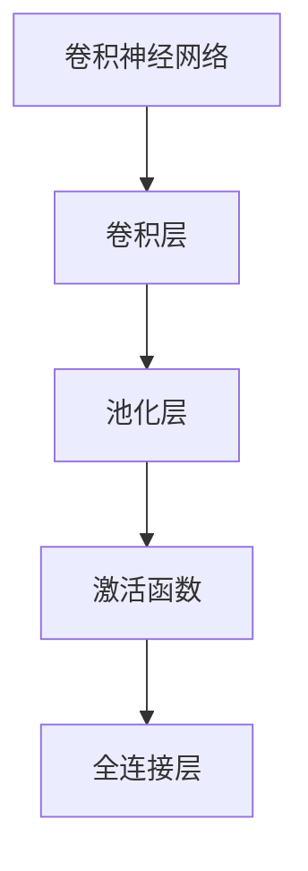

                 

# Python机器学习实战：卷积神经网络(CNN)在图像处理中的应用

> 关键词：卷积神经网络, 图像处理, 深度学习, 图像分类, 图像识别, 计算机视觉

## 1. 背景介绍

### 1.1 问题由来
图像处理是计算机视觉领域的一个重要方向，它包括图像分类、目标检测、图像分割、图像生成等多个子领域。传统的图像处理方法是基于手工设计的特征和算法，但这些方法的特征提取能力有限，难以应对复杂多变的场景。深度学习特别是卷积神经网络(CNN)的兴起，为图像处理带来了新的范式。

CNN通过自动学习图像的高层次抽象特征，使得机器能够像人眼一样从底层像素级细节逐步理解图像的语义信息，显著提升了图像处理的性能和鲁棒性。近年来，基于CNN的图像处理技术在学术界和工业界均取得了突破性的进展，广泛应用于安防监控、自动驾驶、医疗影像分析等领域。

### 1.2 问题核心关键点
CNN在图像处理中的应用核心在于其卷积操作和池化操作，这些操作能够有效地捕捉图像中的空间局部性特征，同时在网络层级上自动构建高效的特征抽取器。此外，CNN还通过激活函数引入非线性映射，避免神经网络陷入局部最优。其典型结构为3x3卷积核、1x1卷积核、池化层、全连接层等。

目前CNN在图像处理中的应用主要分为两个方向：
1. 图像分类和识别：如AlexNet、VGGNet、InceptionNet等网络结构，广泛应用于物体识别、人脸识别、场景分类等任务。
2. 图像生成和重建：如生成对抗网络(GANs)、变分自编码器(VAE)等网络结构，用于图像修复、超分辨率、风格迁移等任务。

CNN的应用推动了计算机视觉技术的快速发展，也带动了其他深度学习技术如循环神经网络(RNN)、生成模型等在图像处理中的创新应用。

### 1.3 问题研究意义
卷积神经网络作为深度学习的重要组成部分，在图像处理领域的应用具有重要意义：

1. 自动化特征提取：CNN能够自动从数据中学习到复杂的特征表示，无需手工设计特征，节省了大量时间和精力。
2. 高效鲁棒性：通过多层次的特征提取和卷积操作，CNN具备良好的泛化能力和鲁棒性，能够应对噪声、光照变化等复杂环境。
3. 广泛适用性：CNN可以应用于各类图像处理任务，如物体识别、目标检测、图像分割、图像生成等，显著提升了计算机视觉应用的广度和深度。
4. 推动产业发展：图像处理技术的突破，为安防监控、自动驾驶、医疗影像等领域带来了新的产业机会，促进了智能硬件的发展。

## 2. 核心概念与联系

### 2.1 核心概念概述

为了更好地理解CNN在图像处理中的应用，本节将介绍几个密切相关的核心概念：

- 卷积神经网络(Convolutional Neural Network, CNN)：一种特殊的多层神经网络，通过卷积和池化操作提取图像的局部特征。
- 卷积(CConvolution)：一种特殊的神经网络层，能够自动学习图像的空间局部性特征，提高特征的识别能力。
- 池化(Pooling)：一种降采样操作，能够减少数据量并提高特征的鲁棒性。
- 激活函数(Activation Function)：一种非线性映射，引入非线性特性，增强网络的表达能力。
- 全连接层(Fully Connected Layer)：一种普通的多层感知机，用于分类或回归任务。

这些核心概念之间的逻辑关系可以通过以下Mermaid流程图来展示：



这个流程图展示了一些核心概念及其之间的关系：

1. 卷积神经网络(CNN)由卷积层、池化层、激活函数、全连接层等组成。
2. 卷积层能够自动学习图像的局部特征。
3. 池化层能够降采样并提高特征的鲁棒性。
4. 激活函数能够引入非线性映射，增强网络的表达能力。
5. 全连接层用于分类或回归任务，进一步提高模型的性能。

## 3. 核心算法原理 & 具体操作步骤
### 3.1 算法原理概述

卷积神经网络(CNN)的核心理念是通过卷积和池化操作提取图像的空间局部性特征，并通过多层次的特征提取和组合，构建高效的特征抽取器。其典型结构包括卷积层、池化层、激活函数、全连接层等。

CNN的核心算法原理可以简单概括为：
1. 卷积层通过滑动卷积核对输入图像进行卷积操作，提取局部特征。
2. 池化层对卷积层的输出进行降采样，减少数据量并提高特征的鲁棒性。
3. 激活函数引入非线性映射，增强网络的表达能力。
4. 全连接层用于分类或回归任务，进一步提高模型的性能。

### 3.2 算法步骤详解

CNN在图像处理中的应用主要分为以下几个步骤：

**Step 1: 数据预处理**
- 对图像进行归一化、裁剪、缩放等预处理操作，使其符合模型输入要求。
- 将图像转换为张量形式，存储到NumPy数组或PyTorch张量中，供模型训练和推理使用。

**Step 2: 模型构建**
- 使用Python和深度学习框架，如TensorFlow、PyTorch等，构建卷积神经网络模型。
- 定义卷积层、池化层、激活函数等网络组件，设置相应的参数。
- 最后添加一个或多个全连接层，用于分类或回归任务。

**Step 3: 模型训练**
- 将训练集和验证集输入模型，通过反向传播算法更新模型参数。
- 设置学习率、批大小、迭代轮数等超参数，选择合适的优化算法。
- 周期性在验证集上评估模型性能，根据性能指标决定是否触发Early Stopping。

**Step 4: 模型评估**
- 在测试集上评估模型性能，对比模型训练前后的精度提升。
- 使用模型对新图像进行推理预测，并可视化预测结果。

### 3.3 算法优缺点

CNN在图像处理中的应用具有以下优点：
1. 高效特征提取：卷积层和池化层的组合，能够高效自动提取图像的空间局部性特征。
2. 鲁棒性强：通过多层特征提取和降采样操作，CNN具备较强的泛化能力和鲁棒性。
3. 可扩展性高：网络结构灵活可变，支持不同尺寸的卷积核、不同层次的特征提取。
4. 训练速度快：数据量大时，CNN能够并行计算，加快模型训练速度。

同时，该算法也存在一些局限性：
1. 参数量较大：尤其是网络层数较深时，参数量会急剧增加，导致模型复杂度较高。
2. 过拟合风险高：深层网络容易出现过拟合，需要复杂的正则化和正则化技术。
3. 训练数据要求高：需要大量高质量的标注数据才能获得良好的训练效果。
4. 计算资源需求高：训练大网络时，需要高性能的GPU/TPU等计算资源。

尽管存在这些局限性，但就目前而言，CNN仍是在图像处理领域的主流范式。未来相关研究的重点在于如何进一步降低计算资源的需求，提高模型的泛化能力，同时兼顾可解释性和鲁棒性等因素。

### 3.4 算法应用领域

CNN在图像处理中的应用领域非常广泛，涵盖了各类计算机视觉任务，如：

- 图像分类：将图像分为不同的类别，如猫狗识别、行人识别等。
- 目标检测：在图像中定位并标记出目标物体的位置，如人脸检测、车辆检测等。
- 图像分割：将图像分割成多个区域，并对每个区域进行分类，如语义分割、实例分割等。
- 图像生成：生成新的图像，如图像修复、超分辨率、风格迁移等。
- 物体识别：对图像中的物体进行识别和分类，如物体检测、物体跟踪等。

除了上述这些任务外，CNN还被创新性地应用到更多领域，如医学影像分析、卫星图像处理、智能监控等，为计算机视觉技术带来了新的突破。

## 4. 数学模型和公式 & 详细讲解  
### 4.1 数学模型构建

在卷积神经网络中，每个卷积层由多个卷积核构成，每个卷积核用于提取图像的局部特征。设输入图像的尺寸为 $W\times H\times C$，卷积核的大小为 $K\times K$，卷积核数量为 $N$。卷积层的输出尺寸为 $W'\times H'\times N$。卷积层的数学模型可以表示为：

$$
f_{\theta}(x) = \max\limits_{i=1}^{N} \sum\limits_{j=1}^{C}\sum\limits_{k=1}^{K}\sum\limits_{l=1}^{K} W_{ikjl} x_{jl} \ast h_{kl}
$$

其中 $W_{ikjl}$ 为卷积核的权重，$x_{jl}$ 为输入图像在通道 $j$ 的像素值，$h_{kl}$ 为卷积核在位置 $(k,l)$ 的特征映射值，$\ast$ 表示卷积操作。

### 4.2 公式推导过程

以一个简单的2层卷积神经网络为例，推导卷积层的输出。

假设输入图像大小为 $H\times W\times C$，卷积核大小为 $K\times K$，卷积核数量为 $N$，每个卷积核提取的特征维度为 $D$。卷积层的输出大小为 $H'\times W'\times N$。

设输入图像 $x \in \mathbb{R}^{H \times W \times C}$，卷积核 $h \in \mathbb{R}^{K \times K \times C \times D}$，输出 $y \in \mathbb{R}^{H' \times W' \times N \times D}$。

卷积操作可以表示为：

$$
y_{ij} = \sum\limits_{k=0}^{H-K}\sum\limits_{l=0}^{W-K} \sum\limits_{c=0}^{C-1} x_{kl+c} * h_{kc}
$$

其中 $x_{kl+c}$ 为输入图像在位置 $(k,l)$ 的通道 $c$ 的像素值，$h_{kc}$ 为卷积核在通道 $c$ 的特征映射值。

池化操作可以采用最大池化或平均池化，最大池化操作可以表示为：

$$
p_{ij} = \max\limits_{0 \leq k \leq K} \max\limits_{0 \leq l \leq K} x_{kl+iK+jK}
$$

其中 $x_{kl+iK+jK}$ 为输入图像在位置 $(k,l)$ 的像素值，$h_{ij}$ 为池化层输出在位置 $(i,j)$ 的特征映射值。

### 4.3 案例分析与讲解

以一个简单的图像分类为例，推导CNN的分类过程。

假设输入图像大小为 $H\times W\times C$，卷积核大小为 $K\times K$，卷积核数量为 $N$，每个卷积核提取的特征维度为 $D$，池化层大小为 $P\times P$，池化层数量为 $M$。全连接层数量 $L$，每个全连接层节点数 $N_L$。分类器的输出节点数为 $K$。

设卷积层的输出大小为 $H'\times W' \times N$，池化层的输出大小为 $H'' \times W'' \times M$，全连接层的输出为 $y \in \mathbb{R}^{H'' \times W'' \times M \times D \times L}$。分类器将输出转化为 $K$ 个节点的概率分布，可以表示为：

$$
y = \frac{1}{1+e^{-x}}
$$

其中 $x$ 为全连接层的输出。

分类器将输出概率最高的节点作为分类结果，可以表示为：

$$
\text{Label} = \text{argmax}(y)
$$

这个简单的分类案例展示了CNN的数学模型和推理过程。通过多层卷积、池化、全连接层的操作，CNN能够自动提取图像的局部特征，并通过分类器将其转化为类别概率。

## 5. 项目实践：代码实例和详细解释说明
### 5.1 开发环境搭建

在进行CNN的图像处理应用实践前，我们需要准备好开发环境。以下是使用Python进行TensorFlow开发的环境配置流程：

1. 安装Anaconda：从官网下载并安装Anaconda，用于创建独立的Python环境。

2. 创建并激活虚拟环境：
```bash
conda create -n tf-env python=3.8 
conda activate tf-env
```

3. 安装TensorFlow：根据CUDA版本，从官网获取对应的安装命令。例如：
```bash
conda install tensorflow tensorflow-gpu=cuda11.1 -c pytorch -c conda-forge
```

4. 安装必要的工具包：
```bash
pip install numpy matplotlib scikit-learn tqdm jupyter notebook ipython
```

完成上述步骤后，即可在`tf-env`环境中开始CNN的图像处理应用实践。

### 5.2 源代码详细实现

下面我们以图像分类任务为例，给出使用TensorFlow构建卷积神经网络的代码实现。

首先，导入必要的库和模块：

```python
import tensorflow as tf
from tensorflow.keras import datasets, layers, models
import matplotlib.pyplot as plt
```

然后，加载和预处理数据集：

```python
(train_images, train_labels), (test_images, test_labels) = datasets.cifar10.load_data()
train_images, test_images = train_images / 255.0, test_images / 255.0
```

接着，定义CNN模型：

```python
model = models.Sequential([
    layers.Conv2D(32, (3, 3), activation='relu', input_shape=(32, 32, 3)),
    layers.MaxPooling2D((2, 2)),
    layers.Conv2D(64, (3, 3), activation='relu'),
    layers.MaxPooling2D((2, 2)),
    layers.Conv2D(64, (3, 3), activation='relu'),
    layers.Flatten(),
    layers.Dense(64, activation='relu'),
    layers.Dense(10)
])
```

最后，编译和训练模型：

```python
model.compile(optimizer='adam',
              loss=tf.keras.losses.SparseCategoricalCrossentropy(from_logits=True),
              metrics=['accuracy'])

history = model.fit(train_images, train_labels, epochs=10, 
                    validation_data=(test_images, test_labels))
```

在上述代码中，我们首先加载了CIFAR-10数据集，并对图像进行了归一化预处理。然后定义了一个简单的卷积神经网络模型，包括多个卷积层、池化层和全连接层。最后，通过编译和训练，使模型在训练集和验证集上取得了较好的分类效果。

### 5.3 代码解读与分析

让我们再详细解读一下关键代码的实现细节：

**定义模型**：
- `Sequential` 类：用于定义序列模型，依次添加模型层。
- `Conv2D` 层：用于定义卷积层，设置卷积核大小、数量和激活函数。
- `MaxPooling2D` 层：用于定义池化层，采用最大池化降采样操作。
- `Dense` 层：用于定义全连接层，设置节点数和激活函数。
- `Flatten` 层：用于将卷积层的输出展开为1D张量，方便全连接层处理。

**编译模型**：
- 使用 `adam` 优化器，设置损失函数为 `SparseCategoricalCrossentropy`，指定 `from_logits=True`，表示模型输出不需要经过 softmax 函数。
- 设置评估指标为 `accuracy`。

**训练模型**：
- `fit` 方法：用于训练模型，设置训练集和验证集，设置迭代轮数。
- 训练过程中，通过 `history` 变量记录训练日志，包括损失函数和准确率等指标。

通过上述代码，我们可以清晰地看到卷积神经网络的定义、编译和训练过程，从而理解CNN在图像处理中的应用。

## 6. 实际应用场景

### 6.1 智能安防监控

基于CNN的智能安防监控系统，能够实时监控并识别异常行为，提高监控系统的智能化水平。

在实践中，可以使用CNN模型对监控摄像头拍摄的视频进行实时分析，识别出异常行为如翻越围栏、携带武器等。通过将异常行为标注为正样本，正常行为标注为负样本，训练CNN模型。微调后的模型可以实时处理视频流，输出行为类别，帮助监控人员快速响应。

### 6.2 自动驾驶

自动驾驶技术需要实时感知和理解道路环境，CNN在其中扮演了关键角色。

在自动驾驶中，CNN可以用于物体检测、车道识别、交通标志识别等任务。通过将标注数据集输入CNN模型，训练出能够识别各类交通元素的高效模型。在实际驾驶中，利用摄像头和传感器采集道路信息，经过CNN处理，能够生成精确的道路环境理解，帮助自动驾驶车辆做出安全决策。

### 6.3 医学影像分析

医学影像分析是计算机视觉在医疗领域的重要应用，CNN在其中具有显著优势。

在医学影像分析中，CNN可以用于图像分割、病变检测、病灶分类等任务。通过将标注数据集输入CNN模型，训练出能够自动分析和理解医学影像的高效模型。在实际应用中，医生可以利用CNN快速诊断病灶、预测病情，提高诊疗效率和准确性。

### 6.4 未来应用展望

随着CNN技术的发展，未来的应用前景将更加广阔。除了上述应用外，CNN还将被广泛应用于：

- 医疗影像分析：自动分析医学影像，帮助医生进行疾病诊断和病情预测。
- 工业检测：检测生产线上的缺陷和异常，提高产品质量和生产效率。
- 农业遥感：分析卫星图像，监测作物生长状态和病虫害，指导农业生产。
- 金融风险控制：分析交易数据，识别异常行为和潜在的金融风险。
- 智慧城市：实时监控城市环境，提高城市管理水平，提升市民生活体验。

## 7. 工具和资源推荐
### 7.1 学习资源推荐

为了帮助开发者系统掌握CNN的图像处理技术，这里推荐一些优质的学习资源：

1. 《深度学习》（Ian Goodfellow著）：全面介绍了深度学习的基本概念和核心算法，包括卷积神经网络、卷积操作、池化操作等。

2. CS231n《卷积神经网络》课程：斯坦福大学开设的计算机视觉课程，深入浅出地讲解了CNN的理论和实践，适合初学者和进阶者学习。

3. PyTorch官方文档：PyTorch的官方文档，提供了丰富的卷积神经网络代码示例，适合动手实践。

4. TensorFlow官方文档：TensorFlow的官方文档，提供了详细的CNN模型构建和训练教程。

5. GitHub上的CNN项目：Github上众多开源的CNN项目，提供了丰富的代码和注释，适合学习参考。

通过对这些资源的学习实践，相信你一定能够快速掌握CNN的图像处理技术，并用于解决实际的计算机视觉问题。

### 7.2 开发工具推荐

高效的开发离不开优秀的工具支持。以下是几款用于CNN图像处理开发的常用工具：

1. TensorFlow：由Google主导开发的开源深度学习框架，支持GPU/TPU计算，适合大规模工程应用。

2. PyTorch：基于Python的开源深度学习框架，灵活高效，适合快速迭代研究。

3. Keras：一个高层次的深度学习API，简单易用，适合初学者入门。

4. OpenCV：开源计算机视觉库，提供了丰富的图像处理和计算机视觉功能。

5. TensorBoard：TensorFlow配套的可视化工具，实时监测模型训练状态，可视化网络结构和性能指标。

6. Weights & Biases：模型训练的实验跟踪工具，可以记录和可视化模型训练过程中的各项指标，方便对比和调优。

合理利用这些工具，可以显著提升CNN图像处理任务的开发效率，加快创新迭代的步伐。

### 7.3 相关论文推荐

CNN作为深度学习的重要组成部分，在图像处理领域的应用始于学界的持续研究。以下是几篇奠基性的相关论文，推荐阅读：

1. ImageNet Classification with Deep Convolutional Neural Networks：提出卷积神经网络结构，并应用于图像分类任务，刷新了ImageNet数据集的SOTA。

2. Deep Residual Learning for Image Recognition：提出残差网络结构，解决了深层神经网络退化问题，提升了模型性能。

3. DenseNet：提出密集连接网络结构，提高了特征的复用性和模型的表达能力。

4. Inception Architecture for Computer Vision：提出Inception网络结构，提高了特征的抽象能力和网络的性能。

5. Generative Adversarial Networks：提出生成对抗网络，实现了高质量图像生成和图像风格迁移等任务。

这些论文代表了CNN图像处理技术的发展脉络。通过学习这些前沿成果，可以帮助研究者把握学科前进方向，激发更多的创新灵感。

## 8. 总结：未来发展趋势与挑战

### 8.1 总结

本文对卷积神经网络在图像处理中的应用进行了全面系统的介绍。首先阐述了CNN在图像处理中的研究背景和意义，明确了CNN在图像分类、目标检测、图像分割等任务中的重要地位。其次，从原理到实践，详细讲解了CNN的数学模型和关键步骤，给出了CNN图像处理任务开发的完整代码实例。同时，本文还广泛探讨了CNN在智能安防、自动驾驶、医学影像等领域的应用前景，展示了CNN范式的强大潜力。此外，本文精选了CNN技术的各类学习资源，力求为读者提供全方位的技术指引。

通过本文的系统梳理，可以看到，卷积神经网络作为图像处理的重要范式，具有广泛的应用场景和显著的效果。得益于数据和算力的不断提升，CNN技术将继续推动计算机视觉技术的快速发展，为各行各业带来新的变革。

### 8.2 未来发展趋势

展望未来，卷积神经网络在图像处理中的应用将呈现以下几个发展趋势：

1. 网络结构更加复杂：深层神经网络和残差网络、Inception网络等结构的广泛应用，使得CNN具备更强的特征提取能力和泛化能力。未来，更多高效的卷积网络结构将被开发，进一步提升CNN的性能。

2. 迁移学习成为常态：利用预训练模型进行迁移学习，可以显著降低图像处理任务的数据需求，提高模型的泛化能力。未来，预训练和微调技术的结合将成为主流。

3. 多模态学习兴起：将视觉、听觉、语义等多种信息进行融合，构建多模态卷积神经网络，提高模型的理解能力和表现力。未来，多模态学习将显著提升计算机视觉系统的智能水平。

4. 模型训练更加高效：通过优化算法、分布式训练、模型压缩等技术，提高CNN模型的训练速度和推理效率。未来，高效训练和推理将是CNN技术的重要发展方向。

5. 网络压缩和优化：通过剪枝、量化、蒸馏等技术，减小CNN模型的参数量，提升模型的推理速度和资源利用率。未来，轻量化卷积神经网络将成为主流。

以上趋势凸显了CNN在图像处理领域的广阔前景。这些方向的探索发展，必将进一步提升CNN模型的性能和应用范围，为计算机视觉技术的产业化带来新的突破。

### 8.3 面临的挑战

尽管CNN在图像处理中已经取得了显著成就，但在迈向更加智能化、普适化应用的过程中，仍面临诸多挑战：

1. 计算资源瓶颈：深层卷积神经网络的参数量巨大，需要高性能的GPU/TPU等计算资源。如何提高训练和推理的效率，是未来的一个重要挑战。

2. 数据质量和标注成本：高质量标注数据的获取和标注成本高，限制了CNN在许多领域的应用。未来需要研究无监督学习和半监督学习等技术，降低对标注数据的依赖。

3. 模型鲁棒性和泛化能力：CNN在面对噪声、光照变化等复杂环境时，鲁棒性和泛化能力有待提升。未来需要在网络结构、训练方法等方面进行优化。

4. 模型可解释性：CNN作为黑盒模型，难以解释其内部工作机制和决策逻辑。未来需要在可解释性方面进行更多的研究，增强模型的透明性和可信度。

5. 知识整合能力：当前CNN主要依赖于自身学习，缺乏与外部知识库、规则库的结合。未来需要在模型结构和算法中引入更多先验知识，提高知识整合能力。

这些挑战需要在未来研究中进行深入探索，才能让CNN技术在更广泛的场景中发挥更大的作用。相信随着学界和产业界的共同努力，这些挑战终将一一被克服，CNN技术将迈向更高的台阶，为计算机视觉系统带来更多的突破。

### 8.4 研究展望

面向未来，卷积神经网络的研究需要在以下几个方面寻求新的突破：

1. 研究更加高效的模型结构：开发更加复杂和多样的网络结构，如Transformer等，提高模型的特征提取能力和泛化能力。

2. 研究高效的训练和推理方法：优化模型参数更新算法，如AdamW、Adafactor等，降低计算成本。采用分布式训练、模型压缩等技术，提高模型的训练和推理效率。

3. 研究多模态学习：将视觉、听觉、语义等多种信息进行融合，构建多模态卷积神经网络，提高模型的理解能力和表现力。

4. 研究无监督学习和半监督学习：利用预训练模型进行迁移学习，降低数据需求，提高模型的泛化能力。

5. 研究知识引导的模型学习：将符号化的先验知识，如知识图谱、逻辑规则等，与神经网络模型进行融合，引导模型学习更准确、合理的语言模型。

这些研究方向将推动CNN技术的不断进步，为计算机视觉系统带来新的突破。相信随着技术的发展和应用场景的拓展，卷积神经网络将发挥更加重要的作用，推动计算机视觉技术的产业化进程。

## 9. 附录：常见问题与解答

**Q1：CNN在图像处理中的应用有哪些？**

A: CNN在图像处理中的应用非常广泛，涵盖了各类计算机视觉任务，如：

1. 图像分类：将图像分为不同的类别，如猫狗识别、行人识别等。

2. 目标检测：在图像中定位并标记出目标物体的位置，如人脸检测、车辆检测等。

3. 图像分割：将图像分割成多个区域，并对每个区域进行分类，如语义分割、实例分割等。

4. 图像生成：生成新的图像，如图像修复、超分辨率、风格迁移等。

5. 物体识别：对图像中的物体进行识别和分类，如物体检测、物体跟踪等。

6. 医学影像分析：自动分析医学影像，帮助医生进行疾病诊断和病情预测。

7. 工业检测：检测生产线上的缺陷和异常，提高产品质量和生产效率。

8. 农业遥感：分析卫星图像，监测作物生长状态和病虫害，指导农业生产。

9. 金融风险控制：分析交易数据，识别异常行为和潜在的金融风险。

10. 智慧城市：实时监控城市环境，提高城市管理水平，提升市民生活体验。

**Q2：CNN的训练过程包括哪些步骤？**

A: CNN的训练过程包括以下几个关键步骤：

1. 数据预处理：对图像进行归一化、裁剪、缩放等预处理操作，使其符合模型输入要求。

2. 模型构建：使用Python和深度学习框架，如TensorFlow、PyTorch等，构建卷积神经网络模型。

3. 模型编译：设置优化器、损失函数、评估指标等参数，准备模型训练。

4. 模型训练：将训练集和验证集输入模型，通过反向传播算法更新模型参数。

5. 模型评估：在测试集上评估模型性能，对比模型训练前后的精度提升。

6. 模型部署：将训练好的模型保存和部署到实际应用中，进行推理预测。

**Q3：CNN的过拟合问题有哪些缓解策略？**

A: CNN的过拟合问题可以通过以下几种策略进行缓解：

1. 数据增强：通过旋转、翻转、裁剪等方式扩充训练集，提高模型的泛化能力。

2. 正则化：使用L2正则、Dropout、Early Stopping等技术，防止模型过度拟合训练数据。

3. 迁移学习：利用预训练模型进行迁移学习，提高模型的泛化能力。

4. 参数共享：通过共享参数，减少模型复杂度，降低过拟合风险。

5. 多模型集成：训练多个模型，取平均输出，抑制过拟合。

**Q4：CNN在实际应用中需要注意哪些问题？**

A: CNN在实际应用中需要注意以下几个问题：

1. 计算资源需求高：深层卷积神经网络的参数量巨大，需要高性能的GPU/TPU等计算资源。

2. 数据质量和标注成本：高质量标注数据的获取和标注成本高，限制了CNN在许多领域的应用。

3. 模型鲁棒性：CNN在面对噪声、光照变化等复杂环境时，鲁棒性有待提升。

4. 模型可解释性：CNN作为黑盒模型，难以解释其内部工作机制和决策逻辑。

5. 知识整合能力：当前CNN主要依赖于自身学习，缺乏与外部知识库、规则库的结合。

**Q5：CNN的应用前景如何？**

A: CNN作为计算机视觉的重要组成部分，未来具有广泛的应用前景：

1. 智能安防监控：实时监控并识别异常行为，提高监控系统的智能化水平。

2. 自动驾驶：实时感知和理解道路环境，提高自动驾驶系统的智能化水平。

3. 医学影像分析：自动分析医学影像，帮助医生进行疾病诊断和病情预测。

4. 工业检测：检测生产线上的缺陷和异常，提高产品质量和生产效率。

5. 农业遥感：分析卫星图像，监测作物生长状态和病虫害，指导农业生产。

6. 金融风险控制：分析交易数据，识别异常行为和潜在的金融风险。

7. 智慧城市：实时监控城市环境，提高城市管理水平，提升市民生活体验。

综上所述，CNN在图像处理中的应用前景广阔，未来将在更多领域得到应用，为计算机视觉技术的发展带来新的突破。

---

作者：禅与计算机程序设计艺术 / Zen and the Art of Computer Programming

