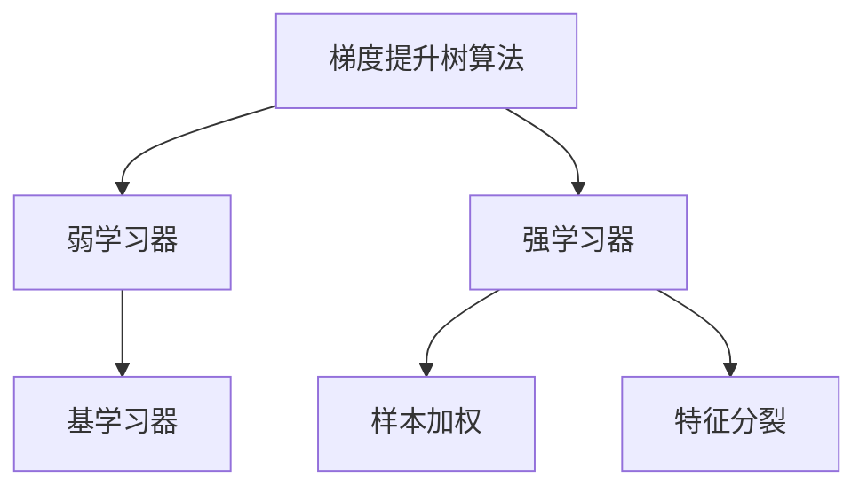

                 

## 1. 背景介绍

### 1.1 问题由来
近年来，随着机器学习技术的发展，特别是深度学习在各种领域的应用，传统统计学习算法逐渐被边缘化。然而，随着数据规模的不断增大和模型复杂度的提升，传统的梯度下降优化算法（如随机梯度下降）在训练大规模模型时效率低下，同时模型容易过拟合。

为了解决这些问题，梯度提升树（Gradient Boosting, GB）算法应运而生。梯度提升树算法通过逐步构建弱学习器（决策树），融合为强学习器，从而克服了深度学习算法的不足，在实际应用中表现优异。

### 1.2 问题核心关键点
梯度提升树算法的核心在于通过迭代优化过程，逐步提升模型预测性能。其基本思路是：
1. 初始化模型为常数函数，即对所有样本预测一个相同的值。
2. 计算当前模型的预测误差。
3. 针对预测误差，构建一个弱学习器，以尽量减小误差。
4. 将弱学习器加到当前模型上，得到一个新的强模型。
5. 重复2-4步骤，直至达到预设的迭代次数或误差阈值。

梯度提升树算法具有以下优点：
- 模型易于理解：每个决策树都能直观解释。
- 高预测精度：逐步提升模型复杂度，最终达到较高预测精度。
- 可解释性：每个弱学习器（决策树）可以单独解释。

同时，梯度提升树算法也存在一些局限性：
- 高计算复杂度：需要迭代计算多个决策树，计算复杂度高。
- 容易过拟合：需要合理设计决策树的参数，以避免过拟合。
- 难以处理连续特征：需要事先进行离散化处理。

尽管如此，梯度提升树算法仍然被广泛应用于各种预测任务，如回归、分类、排序等。

### 1.3 问题研究意义
梯度提升树算法不仅在理论上有突破性，还在实际应用中表现优异，具有重要的研究价值。其对提升预测精度、降低过拟合风险、提高模型可解释性等方面都具有重要意义：

1. 提升预测精度：通过逐步提升模型复杂度，梯度提升树算法在预测精度上具有显著优势。
2. 降低过拟合风险：通过逐步构建弱学习器，可以有效地降低模型的过拟合风险。
3. 提高模型可解释性：每个决策树都可以单独解释，从而提高模型的可解释性。
4. 适应性强：梯度提升树算法适用于各种预测任务，包括连续型、离散型、非线性特征等。

因此，掌握梯度提升树算法对于理解机器学习原理、提高预测精度、降低模型复杂度、提高模型可解释性等方面都具有重要意义。

## 2. 核心概念与联系

### 2.1 核心概念概述

为更好地理解梯度提升树算法，本节将介绍几个密切相关的核心概念：

- 梯度提升树算法（Gradient Boosting, GB）：一种通过迭代构建弱学习器（决策树），逐步提升预测精度的模型。每个决策树都是一个弱学习器，对之前的预测结果进行修正。

- 弱学习器（Weak Learner）：能够对训练数据进行有效预测，但容易过拟合的模型。在梯度提升树算法中，通常使用决策树作为弱学习器。

- 强学习器（Strong Learner）：由多个弱学习器组成，能够对训练数据进行高精度预测的模型。

- 损失函数（Loss Function）：用于衡量模型预测误差。在梯度提升树算法中，通常使用均方误差（MSE）或交叉熵（CE）作为损失函数。

- 样本加权（Sample Weighting）：根据样本的残差（预测误差），对样本进行加权处理，以减少过拟合风险。

- 特征分裂（Feature Splitting）：通过分裂特征值，构建决策树。在每次迭代中，根据特征值将样本分为两个子集。

- 基学习器（Base Learner）：在梯度提升树算法中，通常使用决策树作为基学习器。

这些核心概念之间的逻辑关系可以通过以下Mermaid流程图来展示：



这个流程图展示了大语言模型的核心概念及其之间的关系：

1. 梯度提升树算法通过迭代构建弱学习器，逐步提升预测性能。
2. 每个弱学习器由决策树构成，具有高预测精度和可解释性。
3. 强学习器由多个弱学习器组成，进一步提升预测精度。
4. 样本加权和特征分裂是决策树构建的关键步骤。
5. 基学习器通常使用决策树。

这些概念共同构成了梯度提升树算法的学习和应用框架，使得其能够在各种预测任务中发挥重要作用。通过理解这些核心概念，我们可以更好地把握梯度提升树算法的原理和应用方向。

## 3. 核心算法原理 & 具体操作步骤
### 3.1 算法原理概述

梯度提升树算法的基本原理是通过逐步构建弱学习器，融合为强学习器，从而提升模型的预测性能。其核心思想是：通过每次迭代，构建一个弱学习器，对之前的预测结果进行修正，逐步提升预测精度。

形式化地，假设模型 $M$ 在训练集 $D$ 上的预测误差为 $L(M, D)$，则梯度提升树算法的目标是最小化预测误差，即：

$$
\min_M L(M, D) = \min_{M_1, M_2, ..., M_k} \sum_{i=1}^k L(M_i, D)
$$

其中 $M_i$ 表示第 $i$ 次迭代的弱学习器。每次迭代的优化目标为：

$$
\min_{M_i} L(M_{i-1} + M_i, D)
$$

其中 $M_{i-1}$ 表示前 $i-1$ 次迭代后的强学习器，$M_i$ 表示第 $i$ 次迭代的弱学习器。

### 3.2 算法步骤详解

梯度提升树算法的一般步骤如下：

**Step 1: 初始化模型**
- 初始化强学习器 $M_0$，通常为一个常数函数。
- 初始化残差 $r_0 = y_i - M_0(x_i)$，其中 $(x_i, y_i)$ 表示第 $i$ 个样本。

**Step 2: 计算预测误差**
- 对每个样本，计算预测误差 $r_i = y_i - M(x_i)$。

**Step 3: 构建弱学习器**
- 根据当前模型的预测误差，选择最有利于降低误差的特征进行分裂。
- 对每个特征，根据特征值将样本分成两个子集，计算子集中的残差。
- 根据子集残差，拟合一棵决策树，作为当前迭代的弱学习器 $M_i$。

**Step 4: 更新强学习器**
- 将当前迭代的弱学习器 $M_i$ 加到前 $i-1$ 次迭代后的强学习器 $M_{i-1}$ 上，得到新的强学习器 $M_i = M_{i-1} + M_i$。
- 计算新的残差 $r_i = y_i - M_i(x_i)$。

**Step 5: 迭代计算**
- 重复Step 2-4步骤，直至达到预设的迭代次数或误差阈值。

以上就是梯度提升树算法的基本流程。在实际应用中，为了提高算法效率，通常会对算法进行优化，如使用随机梯度提升（Random Gradient Boosting, RBO）、自适应梯度提升（Adaptive Gradient Boosting, AGB）等改进方法。

### 3.3 算法优缺点

梯度提升树算法具有以下优点：
1. 高预测精度：通过逐步构建弱学习器，可以有效提升模型的预测精度。
2. 可解释性强：每个弱学习器都是一颗决策树，易于理解和解释。
3. 适应性强：适用于各种预测任务，包括连续型、离散型、非线性特征等。
4. 可并行计算：多个弱学习器可以并行计算，提高计算效率。

同时，梯度提升树算法也存在一些局限性：
1. 计算复杂度高：需要迭代构建多个弱学习器，计算复杂度高。
2. 容易过拟合：需要合理设计决策树的参数，以避免过拟合。
3. 难以处理连续特征：需要事先进行离散化处理。

尽管如此，梯度提升树算法仍然被广泛应用于各种预测任务，如回归、分类、排序等。

### 3.4 算法应用领域

梯度提升树算法在实际应用中表现优异，覆盖了多种预测任务，包括：

- 金融风险评估：利用历史贷款数据，预测借款人的违约概率。
- 电商商品推荐：根据用户历史行为，预测用户对商品的兴趣。
- 医疗诊断预测：利用患者历史数据，预测疾病的发生概率。
- 自然灾害预警：利用气象数据，预测自然灾害的发生概率。
- 股票价格预测：利用历史股价数据，预测未来的股价走势。

除了上述这些经典任务外，梯度提升树算法还被创新性地应用到更多场景中，如文本分类、图像识别、音频处理等，为不同领域带来了新的突破。

## 4. 数学模型和公式 & 详细讲解  
### 4.1 数学模型构建

本节将使用数学语言对梯度提升树算法进行更加严格的刻画。

假设训练集 $D=\{(x_i, y_i)\}_{i=1}^N$，其中 $x_i \in \mathbb{R}^d$ 表示特征向量，$y_i \in \mathbb{R}$ 表示目标值。设 $M_i$ 表示第 $i$ 次迭代的弱学习器，$M(x_i)$ 表示模型对样本 $x_i$ 的预测值。

定义模型 $M_i$ 在样本 $x_i$ 上的预测误差为 $r_i = y_i - M_i(x_i)$。则梯度提升树算法的目标是最小化预测误差，即：

$$
\min_M \sum_{i=1}^N r_i^2
$$

在每次迭代中，选择最佳特征 $j$ 和分裂点 $t_j$，构建决策树 $M_i$。设决策树 $M_i$ 对样本 $x_i$ 的预测值为 $M_i(x_i)$，则梯度提升树算法可以表示为：

$$
M(x) = \sum_{i=1}^k M_i(x)
$$

其中 $k$ 表示迭代次数。

### 4.2 公式推导过程

以下我们以回归任务为例，推导梯度提升树算法的核心公式。

假设当前模型 $M_{i-1}$ 对样本 $(x_i, y_i)$ 的预测值为 $\hat{y}_{i-1}$，则当前模型的预测误差为 $r_i = y_i - \hat{y}_{i-1}$。设当前模型的弱学习器为决策树 $M_i$，则：

$$
\min_{M_i} \sum_{i=1}^N (y_i - M_i(x_i) - r_i)^2
$$

对 $M_i$ 求导，得到梯度表达式：

$$
\frac{\partial}{\partial M_i} \sum_{i=1}^N (y_i - M_i(x_i) - r_i)^2 = -2 \sum_{i=1}^N (y_i - M_i(x_i) - r_i) \cdot M_i(x_i)
$$

其中 $M_i(x_i)$ 表示模型对样本 $x_i$ 的预测值。通过反向传播算法，可以计算出决策树 $M_i$ 的分裂点 $t_j$ 和特征 $j$。

最终，将 $M_i$ 加到前 $i-1$ 次迭代后的强学习器 $M_{i-1}$ 上，得到新的强学习器 $M_i = M_{i-1} + M_i$。

通过上述推导，可以看出梯度提升树算法的基本思想是通过逐步构建弱学习器，修正预测误差，提升预测精度。

### 4.3 案例分析与讲解

下面以一个简单的案例，详细讲解梯度提升树算法的具体应用。

假设有一个金融贷款数据集，包含 $1000$ 个样本，每个样本包含 $5$ 个特征和 $1$ 个目标值（是否违约）。使用梯度提升树算法进行预测，迭代次数为 $10$。

**Step 1: 初始化模型**
- 初始化强学习器 $M_0$ 为一个常数函数，假设为 $0$。
- 计算初始残差 $r_0 = y_i - M_0(x_i)$，其中 $(x_i, y_i)$ 表示第 $i$ 个样本。

**Step 2: 计算预测误差**
- 对每个样本，计算预测误差 $r_i = y_i - M_i(x_i)$。

**Step 3: 构建弱学习器**
- 选择最有利于降低误差的特征 $j$ 和分裂点 $t_j$，构建决策树 $M_i$。
- 假设选择特征 $j=2$，分裂点 $t_j=0.5$，构建决策树 $M_i$。

**Step 4: 更新强学习器**
- 将当前迭代的弱学习器 $M_i$ 加到前 $i-1$ 次迭代后的强学习器 $M_{i-1}$ 上，得到新的强学习器 $M_i = M_{i-1} + M_i$。
- 计算新的残差 $r_i = y_i - M_i(x_i)$。

**Step 5: 迭代计算**
- 重复Step 2-4步骤，直至达到预设的迭代次数或误差阈值。

通过上述过程，梯度提升树算法逐步提升模型的预测精度，直至达到预设的迭代次数或误差阈值。

## 5. 项目实践：代码实例和详细解释说明
### 5.1 开发环境搭建

在进行梯度提升树算法实践前，我们需要准备好开发环境。以下是使用Python进行Scikit-learn开发的环境配置流程：

1. 安装Anaconda：从官网下载并安装Anaconda，用于创建独立的Python环境。

2. 创建并激活虚拟环境：
```bash
conda create -n gb-env python=3.8 
conda activate gb-env
```

3. 安装Scikit-learn：
```bash
pip install scikit-learn
```

4. 安装各类工具包：
```bash
pip install numpy pandas scikit-learn matplotlib tqdm jupyter notebook ipython
```

完成上述步骤后，即可在`gb-env`环境中开始梯度提升树算法的实践。

### 5.2 源代码详细实现

下面我们以波士顿房价预测为例，给出使用Scikit-learn库对梯度提升树模型进行训练的PyTorch代码实现。

首先，定义波士顿房价数据集和模型：

```python
from sklearn.datasets import load_boston
from sklearn.ensemble import GradientBoostingRegressor
from sklearn.model_selection import train_test_split

# 加载波士顿房价数据集
boston = load_boston()

# 划分训练集和测试集
X_train, X_test, y_train, y_test = train_test_split(boston.data, boston.target, test_size=0.2, random_state=42)

# 定义模型
model = GradientBoostingRegressor(n_estimators=100, learning_rate=0.1, max_depth=3, random_state=42)
```

然后，训练模型并评估结果：

```python
from sklearn.metrics import mean_squared_error
from sklearn.model_selection import cross_val_score

# 训练模型
model.fit(X_train, y_train)

# 评估模型
mse = mean_squared_error(y_test, model.predict(X_test))
print(f"MSE: {mse:.3f}")

# 交叉验证
scores = cross_val_score(model, X_train, y_train, cv=5)
print(f"CV Score: {scores.mean():.3f}")
```

以上就是使用Scikit-learn库对波士顿房价数据集进行梯度提升树模型训练和评估的完整代码实现。可以看到，得益于Scikit-learn库的强大封装，我们可以用相对简洁的代码完成模型的训练和评估。

### 5.3 代码解读与分析

让我们再详细解读一下关键代码的实现细节：

**加载波士顿房价数据集**：
- 使用`load_boston`函数加载波士顿房价数据集，包含 $506$ 个样本，每个样本包含 $13$ 个特征和一个目标值。

**模型定义**：
- 定义一个梯度提升树回归器，设置迭代次数为 $100$，学习率为 $0.1$，最大深度为 $3$。

**模型训练**：
- 使用`fit`函数对训练集进行模型训练。
- `model.fit(X_train, y_train)`中，`X_train`表示训练集的特征，`y_train`表示训练集的目标值。

**模型评估**：
- 使用`mean_squared_error`函数计算测试集上的均方误差。
- `model.predict(X_test)`中，`X_test`表示测试集的特征。

**交叉验证**：
- 使用`cross_val_score`函数对模型进行交叉验证，评估模型的平均得分。

通过上述过程，我们完成了梯度提升树模型的训练和评估。可以看到，Scikit-learn库的强大封装使得梯度提升树算法的实践变得简洁高效。开发者可以将更多精力放在数据处理、模型改进等高层逻辑上，而不必过多关注底层的实现细节。

当然，工业级的系统实现还需考虑更多因素，如超参数的自动搜索、模型的保存和部署等。但核心的梯度提升树算法基本与此类似。

## 6. 实际应用场景
### 6.1 金融风险评估

梯度提升树算法在金融风险评估中表现优异。金融机构需要实时评估借款人的违约风险，从而决定是否发放贷款。传统的统计模型容易受到数据偏差的影响，难以适应复杂多变的市场情况。

使用梯度提升树算法，可以构建一个高效、鲁棒的违约风险预测模型。该模型通过对历史贷款数据进行训练，逐步提升预测精度，从而对借款人的违约概率进行准确评估。通过设定合理的阈值，系统可以筛选出高风险借款人，降低金融机构的违约率。

### 6.2 电商商品推荐

电商企业需要根据用户的历史行为数据，推荐用户可能感兴趣的商品。传统的推荐系统往往只依赖用户的历史行为数据进行物品推荐，难以充分挖掘用户的多样化需求。

使用梯度提升树算法，可以构建一个高效、可解释的商品推荐系统。该系统通过对用户的历史行为和商品属性进行建模，逐步提升预测精度，从而对用户的兴趣进行准确预测。通过推荐系统推荐的商品，用户更容易满足自身需求，提高购物体验和满意度。

### 6.3 医疗诊断预测

医疗机构需要根据患者的病历数据，预测疾病的发病概率。传统的统计模型容易受到数据偏差的影响，难以适应复杂多变的医疗环境。

使用梯度提升树算法，可以构建一个高效、鲁棒的疾病预测模型。该模型通过对患者的病历数据进行建模，逐步提升预测精度，从而对疾病的发生概率进行准确预测。通过预测系统输出的疾病概率，医疗机构可以提前制定治疗方案，提高治疗效果。

### 6.4 自然灾害预警

气象部门需要根据历史气象数据，预测自然灾害的发生概率。传统的统计模型容易受到数据偏差的影响，难以适应复杂多变的气象环境。

使用梯度提升树算法，可以构建一个高效、鲁棒的自然灾害预警系统。该系统通过对历史气象数据进行建模，逐步提升预测精度，从而对自然灾害的发生概率进行准确预测。通过预警系统输出的预测结果，气象部门可以提前采取防范措施，减少自然灾害带来的损失。

### 6.5 股票价格预测

证券公司需要根据历史股价数据，预测未来的股价走势。传统的统计模型容易受到数据偏差的影响，难以适应复杂多变的市场情况。

使用梯度提升树算法，可以构建一个高效、鲁棒的股票价格预测模型。该模型通过对历史股价数据进行建模，逐步提升预测精度，从而对未来的股价走势进行准确预测。通过预测系统输出的价格走势，证券公司可以制定合理的投资策略，提高投资回报率。

## 7. 工具和资源推荐
### 7.1 学习资源推荐

为了帮助开发者系统掌握梯度提升树算法的理论基础和实践技巧，这里推荐一些优质的学习资源：

1. 《Python机器学习实战》系列博文：由机器学习专家撰写，详细讲解了梯度提升树算法的基本原理和应用实例，适合初学者入门。

2. CS229《机器学习》课程：斯坦福大学开设的机器学习经典课程，有Lecture视频和配套作业，带你系统掌握机器学习的基本概念和算法。

3. 《机器学习实战》书籍：开源项目《机器学习实战》的官方文档，详细介绍了各种机器学习算法的实现，包括梯度提升树算法。

4. Scikit-learn官方文档：Scikit-learn库的官方文档，提供了详细的梯度提升树算法实现和案例分析，是上手实践的必备资料。

5. Kaggle竞赛：Kaggle平台上有大量的梯度提升树算法竞赛，提供了丰富的数据集和评估指标，适合实践和竞赛选手。

通过对这些资源的学习实践，相信你一定能够快速掌握梯度提升树算法的精髓，并用于解决实际的预测问题。

### 7.2 开发工具推荐

高效的开发离不开优秀的工具支持。以下是几款用于梯度提升树算法开发的常用工具：

1. Scikit-learn：开源机器学习库，提供了丰富的机器学习算法和模型，包括梯度提升树算法。

2. XGBoost：一种高效的梯度提升树算法实现，支持并行计算和多种优化策略，适合大规模数据集。

3. LightGBM：一种高效的梯度提升树算法实现，支持GPU加速和多种优化策略，适合大规模数据集。

4. Scikit-optimize：Scikit-learn库的优化模块，用于优化模型超参数，提高模型的预测精度。

5. XGBoost教程：XGBoost官方提供的详细教程，适合进阶学习。

6. LightGBM教程：LightGBM官方提供的详细教程，适合进阶学习。

合理利用这些工具，可以显著提升梯度提升树算法的开发效率，加快创新迭代的步伐。

### 7.3 相关论文推荐

梯度提升树算法在理论上有突破性，在实际应用中表现优异，相关论文不断涌现，以下是几篇奠基性的相关论文，推荐阅读：

1. Gradient Boosting Machines（Hastie等，2001）：梯度提升树算法的开创性论文，详细介绍了梯度提升树算法的原理和实现。

2. Boosting Algorithms as Gradient Descent（Freund，1999）：详细介绍了梯度提升树算法的数学原理和优化过程。

3. Gradient Boosting Machines：A Guide for Practitioners（Chen等，2018）：详细介绍了梯度提升树算法的应用实例和优化策略，适合实践和竞赛选手。

4. Random Forests（Breiman，2001）：介绍了随机森林算法的原理和实现，与梯度提升树算法密切相关。

5. XGBoost：A Scalable Tree Boosting System（Chen等，2016）：介绍了XGBoost算法的原理和实现，适合大规模数据集。

6. LightGBM：A Highly Efficient Gradient Boosting Decision Tree（Ke等，2017）：介绍了LightGBM算法的原理和实现，适合大规模数据集。

这些论文代表了大语言模型微调技术的发展脉络。通过学习这些前沿成果，可以帮助研究者把握学科前进方向，激发更多的创新灵感。

## 8. 总结：未来发展趋势与挑战

### 8.1 总结

本文对梯度提升树算法进行了全面系统的介绍。首先阐述了梯度提升树算法的研究背景和意义，明确了算法在预测精度、模型可解释性、适应性等方面的优势。其次，从原理到实践，详细讲解了梯度提升树算法的数学原理和关键步骤，给出了梯度提升树算法训练的完整代码实例。同时，本文还广泛探讨了梯度提升树算法在金融风险评估、电商商品推荐、医疗诊断预测等众多领域的应用前景，展示了算法的广阔应用场景。此外，本文精选了梯度提升树算法的各类学习资源，力求为读者提供全方位的技术指引。

通过本文的系统梳理，可以看到，梯度提升树算法不仅在理论上有突破性，在实际应用中表现也极为优异，具有重要的研究价值。其对提升预测精度、降低过拟合风险、提高模型可解释性等方面都具有重要意义。

### 8.2 未来发展趋势

展望未来，梯度提升树算法将呈现以下几个发展趋势：

1. 模型规模持续增大。随着算力成本的下降和数据规模的扩张，梯度提升树模型的参数量还将持续增长。超大规模梯度提升树模型蕴含的丰富语言知识，有望支撑更加复杂多变的预测任务。

2. 优化策略日趋多样。未来会涌现更多高效的梯度提升树优化策略，如随机梯度提升（RBO）、自适应梯度提升（AGB）等，在提高预测精度的同时，降低计算复杂度。

3. 多模态融合增强。当前梯度提升树算法通常只适用于单个模态数据，未来会进一步拓展到图像、视频、音频等多模态数据融合。多模态信息的融合，将显著提升模型对现实世界的理解和建模能力。

4. 模型迁移学习增强。当前梯度提升树算法通常在单领域数据上进行训练，未来会进一步拓展到多领域数据迁移学习。多领域数据的迁移学习，将显著提高模型的泛化能力和鲁棒性。

5. 参数高效优化策略增强。开发更加参数高效的梯度提升树算法，如使用LightGBM等，以提高模型训练效率和优化精度。

以上趋势凸显了梯度提升树算法的广阔前景。这些方向的探索发展，必将进一步提升梯度提升树算法的预测精度和模型可解释性，为各个领域带来新的突破。

### 8.3 面临的挑战

尽管梯度提升树算法在理论和实际应用中表现优异，但在迈向更加智能化、普适化应用的过程中，它仍面临一些挑战：

1. 高计算复杂度：需要迭代构建多个弱学习器，计算复杂度高。未来需要进一步优化算法，提高计算效率。

2. 数据处理难度高：需要事先进行特征工程和数据预处理，处理难度高。未来需要开发更多高效的特征工程工具，简化数据预处理过程。

3. 过拟合风险高：需要合理设计决策树的参数，以避免过拟合。未来需要更多高效的正则化方法，降低过拟合风险。

4. 模型解释性不足：梯度提升树算法通常被视为"黑盒"模型，难以解释模型的内部机制。未来需要开发更多可解释性强的模型，提高模型的透明度。

5. 泛化能力不足：梯度提升树算法通常在单领域数据上进行训练，泛化能力有限。未来需要拓展到多领域数据迁移学习，提高模型的泛化能力。

6. 实时计算难度高：梯度提升树算法通常需要大规模计算，实时计算难度高。未来需要开发更多高效的实时计算工具，支持实时计算应用。

7. 鲁棒性不足：梯度提升树算法面对噪声和异常值较为敏感，鲁棒性不足。未来需要开发更多鲁棒性强的模型，提高模型的稳定性。

这些挑战需要学界和产业界的共同努力，逐步克服，才能真正实现梯度提升树算法的广泛应用。

### 8.4 研究展望

面对梯度提升树算法所面临的种种挑战，未来的研究需要在以下几个方面寻求新的突破：

1. 开发高效计算模型：提高梯度提升树算法的计算效率，降低计算复杂度。如使用GPU加速、并行计算等方法，提高模型训练速度。

2. 优化数据预处理过程：简化数据预处理和特征工程过程，提高数据处理的自动化水平。如使用自动特征工程工具，自动化数据处理流程。

3. 增强模型可解释性：开发更多可解释性强的模型，提高模型的透明度。如使用模型可视化工具，可视化模型内部机制。

4. 拓展多领域数据迁移学习：拓展梯度提升树算法在多领域数据的迁移学习能力，提高模型的泛化能力和鲁棒性。

5. 开发鲁棒性强的模型：增强梯度提升树算法的鲁棒性，使其面对噪声和异常值时仍能保持稳定。如使用自适应学习率和正则化方法，提高模型的鲁棒性。

6. 支持实时计算应用：开发更多高效的实时计算工具，支持梯度提升树算法的实时计算应用。如使用流式计算框架，支持实时数据处理。

7. 探索新优化方法：开发更多高效的梯度提升树优化方法，提高模型的预测精度和训练效率。如使用随机梯度提升、自适应梯度提升等方法，提高模型训练速度和优化精度。

8. 应用新数据源：拓展梯度提升树算法在多种数据源上的应用，提高模型的泛化能力和鲁棒性。如使用多源异构数据源，提高模型的数据融合能力。

通过以上研究方向的探索，梯度提升树算法必将在各个领域中发挥更大的作用，为社会带来新的变革。只有勇于创新、敢于突破，才能不断拓展梯度提升树算法的边界，让梯度提升树算法更好地服务人类社会。

## 9. 附录：常见问题与解答

**Q1：如何选择合适的梯度提升树算法？**

A: 梯度提升树算法在实际应用中表现优异，但不同场景下需要选择不同的算法实现。以下是几个常见的算法选择建议：

1. Scikit-learn库的GradientBoostingRegressor：适合中小规模数据集，易于实现和调试。
2. XGBoost：适合大规模数据集，支持GPU加速和多种优化策略，性能表现优异。
3. LightGBM：适合大规模数据集，支持GPU加速和多种优化策略，性能表现优异。
4. CatBoost：适合分类任务，支持稀疏特征和高维特征处理。
5. H2O：适合分布式计算环境，支持多种优化策略，性能表现优异。

通过选择不同的算法实现，可以适应不同规模和场景的数据集，最大化梯度提升树算法的预测精度和计算效率。

**Q2：梯度提升树算法如何处理连续型和离散型特征？**

A: 梯度提升树算法通常需要将特征离散化，才能进行特征分裂。离散化方法包括等宽分割、等频分割、信息增益等。

对于连续型特征，可以通过等宽分割或等频分割进行离散化。例如，将连续型特征划分为若干区间，每个区间作为一个离散型特征。

对于离散型特征，可以将其直接用作决策树的特征，无需进行离散化处理。

**Q3：如何选择合适的模型超参数？**

A: 梯度提升树算法中的超参数包括迭代次数、学习率、最大深度、最小样本数等。选择超参数的常用方法包括：

1. 网格搜索（Grid Search）：在预定的超参数范围内，通过遍历所有组合，选择性能最好的模型。

2. 随机搜索（Random Search）：在预定的超参数范围内，随机选择一组超参数进行训练，选择性能最好的模型。

3. 贝叶斯优化（Bayesian Optimization）：通过高斯过程模型，选择性能最好的超参数组合。

4. 自适应优化（Adaptive Optimization）：根据模型性能动态调整超参数，提高模型的泛化能力。

通过合理选择超参数，可以最大化梯度提升树算法的预测精度和泛化能力。

**Q4：如何避免梯度提升树算法的过拟合？**

A: 梯度提升树算法容易过拟合，需要合理设计决策树的参数，以避免过拟合。以下是几个常见的方法：

1. 最小样本数（Min Samples Split）：限制每个决策树节点分裂的最小样本数，避免过拟合。

2. 最大深度（Max Depth）：限制每个决策树的最大深度，避免过拟合。

3. 学习率（Learning Rate）：通过设置较小的学习率，逐步提升模型复杂度，避免过拟合。

4. 正则化（Regularization）：通过L2正则、Dropout等正则化方法，避免过拟合。

5. 交叉验证（Cross Validation）：通过交叉验证，评估模型的泛化能力，避免过拟合。

通过合理选择模型参数和进行正则化处理，可以有效地避免梯度提升树算法的过拟合风险。

**Q5：如何优化梯度提升树算法的计算效率？**

A: 梯度提升树算法通常需要迭代构建多个决策树，计算复杂度高。以下是几个优化计算效率的方法：

1. 并行计算（Parallel Computing）：通过并行计算，提高梯度提升树算法的计算效率。

2. 随机梯度提升（Random Gradient Boosting）：通过随机选择样本，减少计算复杂度。

3. 自适应梯度提升（Adaptive Gradient Boosting）：通过自适应学习率，逐步提升模型复杂度，避免过拟合。

4. 特征选择（Feature Selection）：通过特征选择方法，减少特征维度，提高计算效率。

5. 模型压缩（Model Compression）：通过模型压缩方法，减少模型参数量，提高计算效率。

通过合理选择优化方法，可以有效地提高梯度提升树算法的计算效率，满足实际应用需求。

**Q6：如何处理梯度提升树算法的过拟合？**

A: 梯度提升树算法容易过拟合，需要合理设计决策树的参数，以避免过拟合。以下是几个常见的方法：

1. 最小样本数（Min Samples Split）：限制每个决策树节点分裂的最小样本数，避免过拟合。

2. 最大深度（Max Depth）：限制每个决策树的最大深度，避免过拟合。

3. 学习率（Learning Rate）：通过设置较小的学习率，逐步提升模型复杂度，避免过拟合。

4. 正则化（Regularization）：通过L2正则、Dropout等正则化方法，避免过拟合。

5. 交叉验证（Cross Validation）：通过交叉验证，评估模型的泛化能力，避免过拟合。

通过合理选择模型参数和进行正则化处理，可以有效地避免梯度提升树算法的过拟合风险。

**Q7：如何处理梯度提升树算法的计算复杂度？**

A: 梯度提升树算法通常需要迭代构建多个决策树，计算复杂度高。以下是几个优化计算效率的方法：

1. 并行计算（Parallel Computing）：通过并行计算，提高梯度提升树算法的计算效率。

2. 随机梯度提升（Random Gradient Boosting）：通过随机选择样本，减少计算复杂度。

3. 自适应梯度提升（Adaptive Gradient Boosting）：通过自适应学习率，逐步提升模型复杂度，避免过拟合。

4. 特征选择（Feature Selection）：通过特征选择方法，减少特征维度，提高计算效率。

5. 模型压缩（Model Compression）：通过模型压缩方法，减少模型参数量，提高计算效率。

通过合理选择优化方法，可以有效地提高梯度提升树算法的计算效率，满足实际应用需求。

通过这些常见问题的解答，可以更好地理解和应用梯度提升树算法，避免常见的错误和问题，提升模型的预测精度和计算效率。

