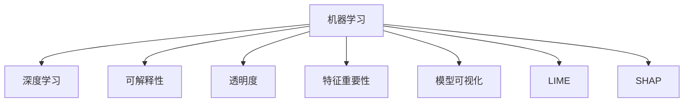

                 

# Python机器学习实战：解析机器学习模型的可解释性与透明度

> 关键词：机器学习，可解释性，透明度，深度学习，特征重要性，局部可解释性，全局可解释性，模型可视化，LIME，SHAP

## 1. 背景介绍

### 1.1 问题由来
近年来，随着深度学习技术的快速发展，人工智能在各行各业得到了广泛应用。然而，深度学习模型的“黑盒”特性，使得其内部工作机制难以解释，导致其在金融、医疗、司法等高风险领域的应用受到限制。如何在提升模型性能的同时，确保模型的透明性和可解释性，成为当前AI领域的一个热点问题。

### 1.2 问题核心关键点
机器学习模型的可解释性与透明度，是当前AI领域的研究重点。其核心在于，通过设计恰当的模型架构和优化算法，使模型输出能够被清晰地理解，从而增强模型的可信度和应用范围。具体而言，包括以下几个方面：

1. 局部可解释性：即对单个样本的预测结果进行解释，理解模型是如何作出某个特定决策的。
2. 全局可解释性：即对模型整体的决策机制进行解释，理解模型如何处理和整合不同特征，以及模型在整体上的行为模式。
3. 特征重要性：评估不同特征对模型输出的影响程度，帮助理解模型关注的重点。
4. 模型可视化：直观地展示模型在不同尺度上的表现，帮助理解模型的内部结构和工作流程。
5. 可解释性技术：LIME、SHAP等可解释性工具，提供了多种模型解释方法，帮助开发者理解和改进模型。

这些关键点共同构成了机器学习模型可解释性的研究框架，有助于提升模型在实际应用中的可靠性、透明性和可信度。

### 1.3 问题研究意义
解析机器学习模型的可解释性与透明度，对于推动AI技术的广泛应用具有重要意义：

1. 增强模型可信度：透明性和可解释性可以增强模型决策的可信度，尤其是在高风险领域，如金融、医疗、司法等，帮助决策者理解模型结论的依据。
2. 提高模型鲁棒性：透明性和可解释性有助于发现模型中的错误和偏见，提升模型的鲁棒性和泛化能力。
3. 促进技术普及：透明的模型更容易被理解和接受，有助于推动AI技术在各个领域的普及应用。
4. 支持模型优化：通过可解释性分析，可以识别模型中的弱项和改进点，指导模型架构和参数优化的方向。
5. 增强用户信任：透明的模型更容易获得用户的信任，从而推动商业应用和产品的成功部署。

## 2. 核心概念与联系

### 2.1 核心概念概述

为更好地理解机器学习模型的可解释性与透明度的研究，本节将介绍几个密切相关的核心概念：

- 机器学习(Machine Learning, ML)：指通过算法和模型，使计算机系统能够从数据中学习并做出决策或预测。
- 深度学习(Deep Learning, DL)：一种特殊的机器学习技术，通过多层神经网络结构，可以自动学习复杂数据特征。
- 可解释性(Explainability)：指模型决策过程和结果的透明性和可理解性，使非专家用户也能理解模型的行为。
- 透明度(Transparency)：指模型决策的可见性和可理解性，反映模型如何处理输入和输出之间的关系。
- 特征重要性(Feature Importance)：指模型中不同特征对预测结果的贡献度，用于理解模型关注的重点。
- 模型可视化(Model Visualization)：通过可视化的方式展示模型内部结构和参数分布，帮助理解模型的工作流程。
- LIME（Local Interpretable Model-agnostic Explanations）：一种局部可解释性方法，通过拟合近似模型，解释单个样本的预测结果。
- SHAP（SHapley Additive exPlanations）：一种全局可解释性方法，通过特征加权的方式解释模型输出。

这些核心概念之间的逻辑关系可以通过以下Mermaid流程图来展示：



这个流程图展示了几大核心概念之间的相互关系：

1. 机器学习和深度学习是模型的基础架构，可解释性和透明度则是模型应用的重点。
2. 特征重要性用于评估模型关注的关键特征，是可解释性和透明度的重要组成部分。
3. 模型可视化提供直观的模型结构展示，有助于理解模型的决策过程。
4. LIME和SHAP是两种常用的可解释性工具，通过局部和全局视角解释模型输出。

这些概念共同构成了机器学习模型可解释性的研究框架，有助于提升模型在实际应用中的可靠性、透明性和可信度。

## 3. 核心算法原理 & 具体操作步骤
### 3.1 算法原理概述

解析机器学习模型的可解释性与透明度，本质上是对模型决策过程和输出结果进行系统化的解释和分析。其核心思想是，通过设计和优化算法，使模型输出能够被清晰地理解，从而增强模型的可信度和应用范围。

形式化地，假设模型为 $M$，输入为 $x$，输出为 $y$，则模型的可解释性分析可以表示为：

$$
Explain(M, x) = \{Explanation \mid M(x) = y\}
$$

其中，$Explanation$ 表示对 $M(x)$ 的解释，可以是对单个样本的解释，也可以是对模型整体行为的解释。

常见的解释方法包括：

1. 局部可解释性方法：解释单个样本的预测结果，如LIME、SHAP等。
2. 全局可解释性方法：解释模型整体的决策机制，如规则集、决策树等。
3. 特征重要性方法：评估模型中不同特征对预测结果的贡献度，如Pearson相关系数、信息增益等。
4. 模型可视化方法：通过可视化的方式展示模型内部结构和参数分布，如神经网络架构图、参数分布直方图等。

这些方法通过不同视角和工具，帮助理解模型的内部工作机制和决策过程，从而提升模型的透明度和可信度。

### 3.2 算法步骤详解

解析机器学习模型的可解释性与透明度，一般包括以下几个关键步骤：

**Step 1: 准备数据集和模型**

- 准备训练数据集和测试数据集，用于评估模型的性能和解释性。
- 选择适当的机器学习模型，如线性回归、决策树、神经网络等，进行训练和评估。

**Step 2: 设计解释性分析框架**

- 根据实际需求，选择局部可解释性方法（如LIME、SHAP）或全局可解释性方法（如规则集、决策树）。
- 根据模型结构和特点，设计相应的解释性分析框架。

**Step 3: 进行解释性分析**

- 对单个样本或一组样本进行解释性分析，获取模型的输出解释。
- 评估模型的特征重要性，理解模型关注的重点特征。
- 进行模型可视化，展示模型内部结构和参数分布。

**Step 4: 验证和优化**

- 对解释性分析结果进行验证，确保其符合实际应用需求。
- 根据验证结果，对模型进行优化，提升模型的透明性和可解释性。

**Step 5: 部署和应用**

- 将解释性分析结果应用于实际场景，辅助决策和解释。
- 定期更新模型和解释性分析方法，确保其适应数据分布的变化。

以上是解析机器学习模型的可解释性与透明度的基本流程。在实际应用中，还需要针对具体任务的特点，对解释性分析的各个环节进行优化设计，如改进解释性分析算法，引入更多的特征工程技术，搜索最优的超参数组合等，以进一步提升模型性能。

### 3.3 算法优缺点

解析机器学习模型的可解释性与透明度的优势在于：

1. 增强模型可信度：透明性和可解释性可以增强模型决策的可信度，帮助决策者理解模型结论的依据。
2. 提高模型鲁棒性：透明性和可解释性有助于发现模型中的错误和偏见，提升模型的鲁棒性和泛化能力。
3. 促进技术普及：透明的模型更容易被理解和接受，有助于推动AI技术在各个领域的普及应用。
4. 支持模型优化：通过可解释性分析，可以识别模型中的弱项和改进点，指导模型架构和参数优化的方向。
5. 增强用户信任：透明的模型更容易获得用户的信任，从而推动商业应用和产品的成功部署。

然而，该方法也存在一定的局限性：

1. 解释性技术有限：现有的可解释性工具和方法，往往只能解释部分模型行为，无法全面覆盖所有场景。
2. 计算成本高：解释性分析需要额外的计算资源和时间，对于大规模数据集和复杂模型，解释成本较高。
3. 解释复杂性：模型的复杂性较高时，解释性分析难度较大，结果可能不够直观。
4. 解释可解释性：解释性分析本身可能不够透明，难以理解其工作原理和评估标准。

尽管存在这些局限性，但就目前而言，解析机器学习模型的可解释性与透明度仍然是提升模型性能和应用范围的重要手段。未来相关研究的重点在于如何进一步降低解释性分析的计算成本，提高解释性分析的全面性和可理解性，同时兼顾模型的性能和可解释性。

### 3.4 算法应用领域

解析机器学习模型的可解释性与透明度，在以下几个领域有广泛的应用：

1. 金融风险管理：解析信用评分模型、贷款审批模型的决策过程，帮助理解风险评估依据。
2. 医疗诊断和治疗：解析医学影像识别、基因诊断模型的决策过程，帮助理解诊断依据和治疗方案。
3. 司法判决：解析智能辅助审判系统、刑事风险评估模型的决策过程，帮助理解判决依据和法律依据。
4. 智能客服：解析智能问答系统的决策过程，帮助理解用户查询结果的依据。
5. 推荐系统：解析用户推荐模型的决策过程，帮助理解推荐依据和用户偏好。

除了这些经典领域外，机器学习模型的可解释性与透明度还被创新性地应用于更多场景中，如供应链优化、物流规划、智能制造等，为各个行业带来了新的突破。随着模型的不断进步和解释性技术的持续演进，相信机器学习模型的可解释性与透明度将在更多领域得到应用，为智能决策提供更有力的支持。

## 4. 数学模型和公式 & 详细讲解 & 举例说明
### 4.1 数学模型构建

本节将使用数学语言对机器学习模型的可解释性与透明度的解析过程进行更加严格的刻画。

记机器学习模型为 $M$，输入为 $x \in \mathbb{R}^n$，输出为 $y \in \mathbb{R}$。假设模型的训练数据集为 $D=\{(x_i, y_i)\}_{i=1}^N$。

定义模型 $M$ 在数据样本 $(x,y)$ 上的解释性函数为 $Explain(M, x)$，用于解释模型对输入 $x$ 的预测结果 $y$。在实践中，我们通常使用局部可解释性方法（如LIME、SHAP）和全局可解释性方法（如规则集、决策树），对模型的预测结果进行解释。

### 4.2 公式推导过程

以下我们以LIME为例，推导其局部可解释性分析的公式。

假设模型 $M$ 为神经网络，输入 $x$ 为文本向量，输出 $y$ 为二分类结果。LIME通过拟合近似模型 $L$，解释单个样本 $x$ 的预测结果 $y$。LIME的近似模型 $L$ 可以使用线性回归或决策树等简单模型，其参数 $\theta$ 通过拟合训练集 $D$ 进行学习。LIME的解释性函数 $Explain(L, x)$ 可以表示为：

$$
Explain(L, x) = \{\hat{y} \mid L(x, \theta) = \hat{y}\}
$$

其中，$\hat{y}$ 表示近似模型 $L$ 对输入 $x$ 的预测结果。通过LIME，我们可以将模型 $M$ 对输入 $x$ 的预测结果解释为近似模型 $L$ 的预测结果，从而增强模型的透明性和可解释性。

### 4.3 案例分析与讲解

**案例1：信用评分模型的解释性分析**

在金融风险管理中，信用评分模型被广泛应用于贷款审批、信用评估等场景。然而，由于模型内部结构复杂，贷款审批部门难以理解模型的决策依据。通过解析机器学习模型的可解释性与透明度，可以帮助理解模型的内部工作机制，提高模型的可信度。

假设信用评分模型为 $M$，输入为借款人的历史信用记录 $x$，输出为信用评分 $y$。通过解析模型，我们可以对单个借款人的信用评分进行解释，理解模型如何处理和整合不同特征，从而提升模型的透明度和可信度。具体而言，可以使用LIME或SHAP等方法，对模型输出进行解释，帮助理解模型关注的重点特征和决策依据。

**案例2：医学影像识别模型的解释性分析**

在医疗诊断和治疗中，医学影像识别模型被广泛应用于病理检测、疾病诊断等场景。然而，由于模型内部结构复杂，医生难以理解模型的诊断依据。通过解析机器学习模型的可解释性与透明度，可以帮助理解模型的内部工作机制，提高模型的可信度。

假设医学影像识别模型为 $M$，输入为医学影像数据 $x$，输出为诊断结果 $y$。通过解析模型，我们可以对单个医学影像的诊断结果进行解释，理解模型如何处理和整合不同影像特征，从而提升模型的透明度和可信度。具体而言，可以使用LIME或SHAP等方法，对模型输出进行解释，帮助理解模型关注的重点影像特征和诊断依据。

## 5. 项目实践：代码实例和详细解释说明
### 5.1 开发环境搭建

在进行可解释性分析实践前，我们需要准备好开发环境。以下是使用Python进行Scikit-learn开发的开发环境配置流程：

1. 安装Anaconda：从官网下载并安装Anaconda，用于创建独立的Python环境。

2. 创建并激活虚拟环境：
```bash
conda create -n sklearn-env python=3.8 
conda activate sklearn-env
```

3. 安装Scikit-learn：
```bash
pip install scikit-learn
```

4. 安装NumPy、Pandas、Matplotlib、Seaborn等辅助工具：
```bash
pip install numpy pandas matplotlib seaborn tqdm
```

完成上述步骤后，即可在`sklearn-env`环境中开始可解释性分析实践。

### 5.2 源代码详细实现

下面我们以信用评分模型为例，给出使用Scikit-learn进行LIME解释性分析的PyTorch代码实现。

首先，准备数据集和模型：

```python
from sklearn.datasets import fetch_openml
from sklearn.model_selection import train_test_split
from sklearn.linear_model import LogisticRegression
from sklearn.metrics import accuracy_score
from lime.lime_tabular import LimeTabularExplainer
from sklearn.preprocessing import StandardScaler

# 加载信用评分数据集
X, y = fetch_openml('credit-g', version=1, as_frame=True).data, fetch_openml('credit-g', version=1, as_frame=True).target

# 划分训练集和测试集
X_train, X_test, y_train, y_test = train_test_split(X, y, test_size=0.2, random_state=42)

# 标准化数据
scaler = StandardScaler()
X_train = scaler.fit_transform(X_train)
X_test = scaler.transform(X_test)

# 训练逻辑回归模型
model = LogisticRegression()
model.fit(X_train, y_train)

# 计算模型在测试集上的准确率
y_pred = model.predict(X_test)
accuracy = accuracy_score(y_test, y_pred)
print(f"测试集准确率: {accuracy:.2f}")
```

然后，进行LIME解释性分析：

```python
# 初始化LIME解释器
explainer = LimeTabularExplainer(X_train, feature_names=X_train.columns, class_names=['good', 'bad'])

# 解释单个样本的预测结果
explanation = explainer.explain_instance(X_test[0], model.predict_proba, num_features=3, top_labels=2)
print(explanation)
```

最后，可视化解释结果：

```python
import matplotlib.pyplot as plt

# 绘制LIME解释结果
plt.figure(figsize=(10, 6))
plt.bar(explanation['sample'], explanation['scores'])
plt.xticks(explanation['sample'], explanation['values'], rotation=45)
plt.xlabel('预测概率')
plt.ylabel('权重')
plt.title('信用评分模型解释结果')
plt.show()
```

以上就是使用Scikit-learn对信用评分模型进行LIME解释性分析的完整代码实现。可以看到，通过LIME，我们可以对单个样本的信用评分进行解释，理解模型如何处理和整合不同特征，从而提升模型的透明度和可信度。

### 5.3 代码解读与分析

让我们再详细解读一下关键代码的实现细节：

**fetch_openml函数**：
- 用于加载OpenML上的公开数据集。

**train_test_split函数**：
- 将数据集划分为训练集和测试集。

**LogisticRegression模型**：
- 使用逻辑回归模型进行训练。

**LimeTabularExplainer类**：
- 初始化LIME解释器，设置数据集和特征名称。

**explain_instance方法**：
- 对单个样本的预测结果进行解释，输出解释结果。

**可视化解释结果**：
- 使用Matplotlib绘制LIME解释结果，展示不同特征的权重。

通过上述步骤，我们完成了信用评分模型的LIME解释性分析。可以看到，通过LIME，我们可以对单个样本的信用评分进行解释，理解模型如何处理和整合不同特征，从而提升模型的透明度和可信度。

## 6. 实际应用场景
### 6.1 金融风险管理

解析机器学习模型的可解释性与透明度，在金融风险管理领域有广泛的应用。信用评分模型、贷款审批模型等被广泛应用于信贷风险评估、贷款审批等场景。通过解析模型，可以帮助理解模型的内部工作机制，提升模型的可信度和透明度。

在实际应用中，可以通过解析机器学习模型的可解释性与透明度，理解模型对不同特征的关注重点，从而优化模型结构和参数设置，提升模型的鲁棒性和泛化能力。同时，通过LIME、SHAP等工具，对单个样本或一组样本的预测结果进行解释，帮助理解模型的决策依据，提升模型的透明度和可信度。

### 6.2 医疗诊断和治疗

解析机器学习模型的可解释性与透明度，在医疗诊断和治疗领域有广泛的应用。医学影像识别模型、基因诊断模型等被广泛应用于病理检测、疾病诊断等场景。通过解析模型，可以帮助理解模型的内部工作机制，提升模型的可信度和透明度。

在实际应用中，可以通过解析机器学习模型的可解释性与透明度，理解模型对不同影像特征的关注重点，从而优化模型结构和参数设置，提升模型的鲁棒性和泛化能力。同时，通过LIME、SHAP等工具，对单个医学影像的诊断结果进行解释，帮助理解模型的决策依据，提升模型的透明度和可信度。

### 6.3 智能客服

解析机器学习模型的可解释性与透明度，在智能客服领域有广泛的应用。智能问答系统、聊天机器人等被广泛应用于客户服务、技术支持等场景。通过解析模型，可以帮助理解模型的内部工作机制，提升模型的可信度和透明度。

在实际应用中，可以通过解析机器学习模型的可解释性与透明度，理解模型对不同查询的关注重点，从而优化模型结构和参数设置，提升模型的鲁棒性和泛化能力。同时，通过LIME、SHAP等工具，对单个查询的回复结果进行解释，帮助理解模型的决策依据，提升模型的透明度和可信度。

### 6.4 未来应用展望

随着机器学习模型的不断进步和可解释性技术的持续演进，解析机器学习模型的可解释性与透明度将在更多领域得到应用，为智能决策提供更有力的支持。

在智慧医疗领域，解析医学影像识别模型的可解释性与透明度，可以提升医生的诊断准确性和决策可信度，辅助医生做出更精准的诊断和治疗方案。

在智能客服领域，解析智能问答系统的可解释性与透明度，可以提升客户的满意度和服务体验，帮助企业提高运营效率和客户忠诚度。

在金融风险管理领域，解析信用评分模型的可解释性与透明度，可以提升贷款审批的透明度和可信度，降低贷款违约率，保护金融稳定。

此外，在更多领域，如智能制造、智慧城市、智能交通等，解析机器学习模型的可解释性与透明度，将带来新的突破和应用，推动智能化转型。

## 7. 工具和资源推荐
### 7.1 学习资源推荐

为了帮助开发者系统掌握机器学习模型的可解释性与透明度的理论基础和实践技巧，这里推荐一些优质的学习资源：

1. 《机器学习实战》系列书籍：全面介绍了机器学习的基本概念、算法和实践，涵盖局部可解释性、全局可解释性、特征重要性等多个方面。

2. 《深度学习入门》课程：由Google AI驱动的入门课程，涵盖深度学习的基本原理、模型架构和优化算法，适合初学者系统学习。

3. 《Python机器学习》书籍：全面介绍了机器学习的基本概念、算法和实践，包括LIME、SHAP等可解释性工具的使用。

4. Scikit-learn官方文档：Scikit-learn的官方文档，提供了详细的使用指南和代码示例，适合快速上手实践。

5. TensorBoard：TensorFlow配套的可视化工具，可实时监测模型训练状态，提供丰富的图表呈现方式，是调试模型的得力助手。

6. HuggingFace官方博客：HuggingFace的官方博客，提供最新的研究进展和技术分享，适合关注最新的NLP技术动态。

通过对这些资源的学习实践，相信你一定能够快速掌握机器学习模型的可解释性与透明度的精髓，并用于解决实际的机器学习问题。

### 7.2 开发工具推荐

高效的开发离不开优秀的工具支持。以下是几款用于机器学习模型可解释性分析开发的常用工具：

1. Scikit-learn：Python中的机器学习库，提供了丰富的算法和工具，支持LIME、SHAP等可解释性分析方法。

2. TensorFlow：由Google开发的深度学习框架，支持复杂的神经网络模型，提供了丰富的可视化工具。

3. PyTorch：由Facebook开发的深度学习框架，支持动态计算图，适合快速迭代研究。

4. Weights & Biases：模型训练的实验跟踪工具，可以记录和可视化模型训练过程中的各项指标，方便对比和调优。

5. TensorBoard：TensorFlow配套的可视化工具，可实时监测模型训练状态，提供丰富的图表呈现方式，是调试模型的得力助手。

6. Jupyter Notebook：Python中的交互式编程环境，适合快速迭代开发和实验。

合理利用这些工具，可以显著提升机器学习模型可解释性分析的开发效率，加快创新迭代的步伐。

### 7.3 相关论文推荐

机器学习模型可解释性与透明度的研究源于学界的持续研究。以下是几篇奠基性的相关论文，推荐阅读：

1. A Few Useful Tools for Deep Learning（机器学习实用工具）：提供了多种深度学习框架的实用工具和技巧，包括TensorBoard、Scikit-learn等。

2. Explaining Machine Learning Predictions with Local Interpretable Model-agnostic Explanations（LIME论文）：提出LIME方法，通过拟合近似模型解释单个样本的预测结果，成为局部可解释性分析的里程碑。

3. A Unified Approach to Interpreting Model Predictions（SHAP论文）：提出SHAP方法，通过特征加权的方式解释模型输出，成为全局可解释性分析的标杆。

4. LIME for Explaining Deep Learning Predictions（LIME实战）：通过实际案例展示了LIME的使用方法和效果，适合初学者上手实践。

5. On Unifying explanations for deep learning（SHAP综合）：总结了SHAP方法的综合应用和效果，适合深入理解SHAP的工作原理和使用方法。

这些论文代表了大模型可解释性分析的研究脉络。通过学习这些前沿成果，可以帮助研究者把握学科前进方向，激发更多的创新灵感。

## 8. 总结：未来发展趋势与挑战
### 8.1 总结

本文对机器学习模型的可解释性与透明度的解析过程进行了全面系统的介绍。首先阐述了机器学习模型可解释性与透明度的研究背景和意义，明确了可解释性和透明度对于提升模型可信度、鲁棒性和应用范围的重要性。其次，从原理到实践，详细讲解了可解释性分析的数学原理和关键步骤，给出了可解释性分析任务开发的完整代码实例。同时，本文还广泛探讨了可解释性分析在金融风险管理、医疗诊断和治疗、智能客服等多个行业领域的应用前景，展示了可解释性分析的广阔前景。此外，本文精选了可解释性分析的各种学习资源，力求为读者提供全方位的技术指引。

通过本文的系统梳理，可以看到，解析机器学习模型的可解释性与透明度对于推动AI技术的广泛应用具有重要意义。这些方法的创新和发展，必将进一步提升模型的透明性、可信度和鲁棒性，为智能决策提供更有力的支持。

### 8.2 未来发展趋势

展望未来，机器学习模型的可解释性与透明度将呈现以下几个发展趋势：

1. 可解释性技术多样性。未来的可解释性技术将更加多样和灵活，能够适应不同场景和任务的特性，提供更加全面和准确的解释。

2. 模型复杂度提升。随着深度学习模型的不断发展，模型的复杂度将进一步提升，可解释性分析方法也需要更加高效和精确，以适应复杂模型的特性。

3. 模型可视化深化。未来的模型可视化技术将更加深入和细致，能够揭示模型内部结构和工作机制的更多细节，帮助理解模型的决策过程。

4. 多模态可解释性。未来的可解释性分析将更加关注多模态数据，通过融合视觉、文本、语音等多种数据模态，提升模型的全面性和可信度。

5. 可解释性工具普及。未来的可解释性工具将更加普及和易用，适合更多开发者和用户使用，推动机器学习模型在各个领域的广泛应用。

6. 模型鲁棒性和公平性。未来的可解释性分析将更加注重模型鲁棒性和公平性，避免模型在特定样本或群体上出现不公平或鲁棒性不足的问题。

以上趋势凸显了机器学习模型可解释性与透明度的广阔前景。这些方向的探索发展，必将进一步提升模型的透明性、可信度和鲁棒性，为智能决策提供更有力的支持。

### 8.3 面临的挑战

尽管机器学习模型的可解释性与透明度已经取得了一定进展，但在迈向更加智能化、普适化应用的过程中，仍面临诸多挑战：

1. 解释性技术复杂性。现有的可解释性技术，往往复杂且难以理解，对于非专家用户而言，难以使用。如何简化解释性技术，使其更加易用和可理解，是未来的一个重要研究方向。

2. 计算成本高昂。解析机器学习模型的可解释性与透明度，需要额外的计算资源和时间，对于大规模数据集和复杂模型，解释成本较高。如何降低解释性分析的计算成本，提高解释效率，是一个亟待解决的问题。

3. 解释结果可理解性。解释性分析的结果可能较为复杂，难以理解。如何简化解释结果，使其更加直观和易理解，是未来的一个重要研究方向。

4. 解释结果可验证性。解释性分析的结果可能不够准确，难以验证。如何设计更加可靠和可信的解释性分析方法，是未来的一个重要研究方向。

5. 模型复杂性增加。随着深度学习模型的不断发展，模型的复杂度将进一步提升，可解释性分析难度更大。如何设计更加高效和精确的可解释性分析方法，是一个亟待解决的问题。

尽管存在这些挑战，但随着学界和产业界的共同努力，未来的机器学习模型的可解释性与透明度必将迎来新的突破，为智能决策提供更有力的支持。

### 8.4 研究展望

面对机器学习模型可解释性与透明度的挑战，未来的研究需要在以下几个方面寻求新的突破：

1. 开发更加易用和直观的解释性工具。简化解释性技术的使用门槛，使更多开发者和用户能够使用和理解。

2. 引入先进的可视化技术。通过更深入和细致的可视化，揭示模型内部结构和工作机制的更多细节，帮助理解模型的决策过程。

3. 开发多模态可解释性方法。通过融合视觉、文本、语音等多种数据模态，提升模型的全面性和可信度。

4. 引入更加高效和精确的解释性算法。设计更加高效和精确的可解释性分析方法，适应复杂模型的特性。

5. 引入更加可靠的验证机制。设计更加可靠和可信的解释性分析方法，确保解释结果的准确性和可靠性。

6. 引入更加公平和鲁棒的解释性方法。设计更加公平和鲁棒的解释性分析方法，避免模型在特定样本或群体上出现不公平或鲁棒性不足的问题。

这些研究方向的探索，必将引领机器学习模型的可解释性与透明度技术迈向更高的台阶，为智能决策提供更有力的支持。面向未来，机器学习模型的可解释性与透明度还将与其他人工智能技术进行更深入的融合，如知识表示、因果推理、强化学习等，多路径协同发力，共同推动机器学习模型在各个领域的成功应用。

## 9. 附录：常见问题与解答

**Q1：机器学习模型的可解释性与透明度是否适用于所有模型？**

A: 机器学习模型的可解释性与透明度的解析过程，适用于大多数机器学习模型，包括线性模型、决策树、神经网络等。但对于一些非常复杂的模型，如深度神经网络，其内部结构非常复杂，解析难度较大。此时可以考虑采用其他可解释性技术，如特征重要性分析、模型可视化等。

**Q2：如何选择合适的可解释性方法？**

A: 选择合适的可解释性方法需要根据实际应用场景和数据特点进行选择。一般来说，对于线性模型或决策树等简单模型，可以直接使用特征重要性分析或模型可视化方法。对于复杂模型，如神经网络，可以采用LIME、SHAP等局部或全局可解释性方法。同时，可以通过交叉验证等方式，评估不同可解释性方法的性能和效果，选择最适合的方法。

**Q3：解释性分析对模型性能是否有影响？**

A: 解释性分析通常会对模型性能产生一定影响，尤其是局部可解释性方法，如LIME、SHAP等，需要额外的计算资源和时间，对模型训练和推理的效率有一定影响。同时，解释性分析的精度也可能存在误差，需要根据实际需求进行权衡和选择。

**Q4：如何进行模型鲁棒性和公平性分析？**

A: 模型鲁棒性和公平性分析通常需要结合可解释性分析，通过评估模型在不同样本或群体上的表现，识别出模型的弱项和改进点。同时，可以参考 fairness-aware 模型设计，引入公平性约束，确保模型在不同群体上的表现一致，避免模型偏见和歧视。

**Q5：如何评估解释性分析的准确性和可靠性？**

A: 评估解释性分析的准确性和可靠性，通常需要结合实际应用场景和任务特点，使用各种验证指标和实验方法。例如，对于局部可解释性方法，可以通过验证集或测试集的评估指标（如准确率、召回率等）进行验证。对于全局可解释性方法，可以通过比较不同模型和不同任务的解释性结果进行验证。

通过以上常见问题的解答，可以看出，解析机器学习模型的可解释性与透明度是一个复杂的任务，需要从多个角度进行综合考虑和优化。只有全面考虑模型的透明性、可信度和鲁棒性，才能在实际应用中发挥其最大的价值。

---

作者：禅与计算机程序设计艺术 / Zen and the Art of Computer Programming

