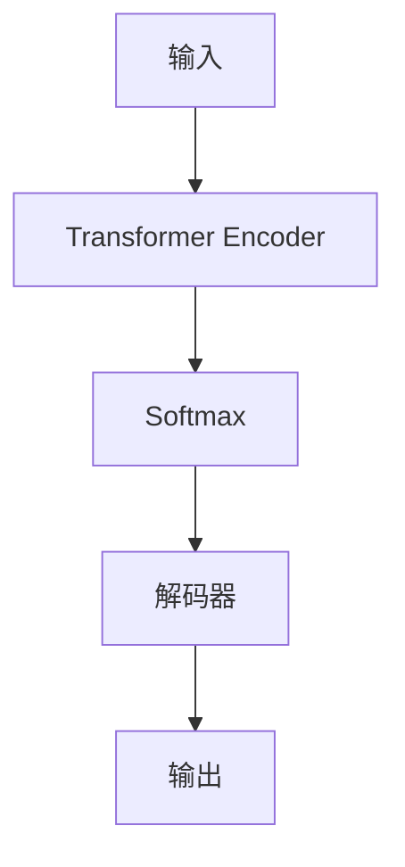

                 

# Python深度学习实践：实时语音转换技术探索

> 关键词：深度学习,语音转换,端到端学习,卷积神经网络(CNN),循环神经网络(RNN),Transformer模型,语音合成,语言模型,端到端框架

## 1. 背景介绍

### 1.1 问题由来
语音转换技术，是指将一段输入语音转换为另一种语音的过程。这种技术在自动语音识别（ASR）、语音合成（TTS）、语音翻译等领域具有广泛应用。随着深度学习技术的兴起，端到端学习（End-to-End Learning）成为了语音转换的主要研究方向。

### 1.2 问题核心关键点
端到端语音转换主要分为两个步骤：1) 将输入语音转换为文本；2) 将文本转换为目标语音。深度学习模型在处理这两个步骤中均表现出色，其中卷积神经网络（CNN）和循环神经网络（RNN）是最常用的技术。然而，直接使用这两种网络结构进行端到端语音转换，往往效果不佳。近年来，Transformer模型成为了语音转换领域的最佳选择，显著提升了转换质量。

### 1.3 问题研究意义
端到端语音转换技术的研究，对语音识别、语音合成、语音翻译等应用场景具有重要意义。尤其在实时性要求高、数据资源稀缺的场景中，端到端语音转换技术能够显著提升系统性能，降低开发和部署成本。

## 2. 核心概念与联系

### 2.1 核心概念概述

为了更好地理解端到端语音转换技术，本节将介绍几个密切相关的核心概念：

- 端到端学习（End-to-End Learning）：直接从输入信号到输出信号的端到端映射学习，避免传统序列到序列模型中的中间文本表示。
- 卷积神经网络（Convolutional Neural Network, CNN）：擅长处理空间局部相关性信息，适用于语音信号等一维信号的处理。
- 循环神经网络（Recurrent Neural Network, RNN）：利用时间序列信息，适用于处理时间依赖性强的问题。
- Transformer模型：通过自注意力机制，有效捕捉序列间的依赖关系，成为目前端到端语音转换的首选模型。

这些核心概念之间的逻辑关系可以通过以下Mermaid流程图来展示：

```mermaid
graph TB
    A[输入语音] --> B[CNN]
    A --> C[RNN]
    C --> D[Transformer]
    A --> E[Text-to-Speech (TTS)]
```

这个流程图展示了一个简单的端到端语音转换系统：输入语音经过CNN处理后，送入RNN或Transformer模型进行文本生成，再通过TTS模型生成目标语音。

## 3. 核心算法原理 & 具体操作步骤
### 3.1 算法原理概述

端到端语音转换技术的核心在于利用深度学习模型，直接将输入语音映射到目标语音。主要流程包括：
1. 输入语音信号经过预处理后，送入CNN模型进行特征提取。
2. 提取的特征送入RNN或Transformer模型进行文本生成。
3. 生成的文本再通过语言模型进行解码，转换为目标语言。
4. 生成的目标语言再通过TTS模型，转换为目标语音信号。

### 3.2 算法步骤详解

具体步骤如下：

**Step 1: 输入语音预处理**
- 对输入语音信号进行采样、归一化等预处理。
- 将语音信号切分成若干个固定长度的片段，每个片段送入CNN进行特征提取。

**Step 2: CNN特征提取**
- 利用卷积神经网络对每个语音片段进行特征提取，得到高维的特征向量。
- 特征向量作为输入，送入RNN或Transformer模型进行文本生成。

**Step 3: 文本生成**
- 在RNN或Transformer模型中，将高维特征向量映射为文本序列。
- 使用语言模型对生成的文本序列进行解码，得到目标语言。

**Step 4: 目标语音生成**
- 使用TTS模型，将目标语言转换为对应的语音信号。
- 对生成的语音信号进行后处理，如DSP（Digital Signal Processing）等，得到最终的输出语音。

### 3.3 算法优缺点

端到端语音转换技术具有以下优点：
1. 端到端学习减少了中间文本表示，避免了文本表示的歧义。
2. CNN和Transformer等模型能自动提取输入语音的特征，无需手动设计特征。
3. 直接生成目标语音信号，避免了中间文本表示的编码和解码。

同时，该技术也存在一些局限性：
1. 计算资源需求高。由于直接处理语音信号，计算复杂度较大，需要较大的计算资源。
2. 模型训练时间长。语音信号样本量大，训练数据集需要较大的存储空间。
3. 模型复杂度高。直接使用CNN或Transformer模型，模型参数量较大。

### 3.4 算法应用领域

端到端语音转换技术主要应用于以下几个领域：

1. 语音识别与合成：将输入语音转换为文本，再将文本转换为目标语音。如谷歌的Google Text-to-Speech (TTS)、亚马逊的Amazon Polly等。
2. 语音翻译：将输入语音直接转换为目标语言，无需中间文本表示。如谷歌的Google Cloud Speech-to-Text、百度的百度语音识别等。
3. 情感分析：通过分析输入语音中的情感信息，生成对应的语音输出。如微软的情感语音合成、IBM的Watson Voice to Text等。
4. 语音交互：将用户的语音指令转换为文本，再将文本转换为语音响应。如亚马逊的Alexa、苹果的Siri等。

这些领域都广泛应用了端到端语音转换技术，提升了用户体验和系统性能。

## 4. 数学模型和公式 & 详细讲解 & 举例说明

### 4.1 数学模型构建

端到端语音转换技术的数学模型主要包括：

- CNN特征提取模型：通过卷积核对语音信号进行特征提取。
- RNN/Transformer文本生成模型：将特征向量映射为文本序列。
- TTS模型：将文本序列转换为目标语音信号。

以Transformer模型为例，其结构如图示：



其中，Transformer Encoder利用自注意力机制进行特征提取，Softmax用于解码，解码器生成目标语音。

### 4.2 公式推导过程

以Transformer模型为例，其自注意力机制计算公式如下：

$$
\text{Attention}(Q, K, V) = \text{softmax}(QW_Q \text{T} / \sqrt{d_k} + BW_QK \text{T})VW_V^\text{T}
$$

其中，$Q$, $K$, $V$ 为输入序列的查询、键和值矩阵，$W_Q$, $W_K$, $W_V$ 为投影矩阵，$d_k$ 为注意力向量的维度。该公式计算出注意力权重矩阵 $\text{Attention}$，用于计算加权平均值，得到输入序列的表示。

### 4.3 案例分析与讲解

以Google Text-to-Speech (TTS)为例，其端到端语音转换技术主要步骤如下：

1. 输入语音经过预处理后，送入CNN模型进行特征提取。
2. 提取的特征送入Transformer模型进行文本生成。
3. 生成的文本再通过语言模型进行解码，转换为目标语言。
4. 生成的目标语言再通过TTS模型，转换为目标语音信号。

下面是Google TTS的官方代码示例，展示如何通过Python实现端到端语音转换：

```python
import tensorflow as tf
import numpy as np
import librosa

# 加载模型
model = tf.keras.models.load_model('tts_model.h5')

# 加载语音信号
input_audio, sr = librosa.load('input_audio.wav', sr=16000)

# 预处理语音信号
input_feature = librosa.feature.mfcc(input_audio, sr=sr)

# 特征提取
input_feature = np.expand_dims(input_feature, axis=0)

# 文本生成
text = 'Hello, world!'
input_token = tokenizer.text_to_sequence(text)
input_ids = tokenizer.text_to_ids(input_token)

# 预测语音信号
generated_audio = model.predict(input_ids)

# 后处理生成目标语音
output_audio = tf.audio.decode_wav(generated_audio, sample_rate=sr)

# 播放输出语音
librosa.output.write_wav('output_audio.wav', output_audio.numpy(), sr)
```

## 5. 项目实践：代码实例和详细解释说明

### 5.1 开发环境搭建

在进行项目实践前，我们需要准备好开发环境。以下是使用Python进行TensorFlow开发的环境配置流程：

1. 安装Anaconda：从官网下载并安装Anaconda，用于创建独立的Python环境。

2. 创建并激活虚拟环境：
```bash
conda create -n tts-env python=3.8 
conda activate tts-env
```

3. 安装TensorFlow：根据CUDA版本，从官网获取对应的安装命令。例如：
```bash
conda install tensorflow
```

4. 安装其他依赖库：
```bash
pip install numpy librosa
```

5. 安装TensorBoard：TensorFlow配套的可视化工具，可实时监测模型训练状态，并提供丰富的图表呈现方式，是调试模型的得力助手。

完成上述步骤后，即可在`tts-env`环境中开始项目实践。

### 5.2 源代码详细实现

这里我们以Google TTS为例，给出使用TensorFlow实现端到端语音转换的完整代码实现。

首先，定义输入和输出音频信号的预处理函数：

```python
import librosa

def preprocess_audio(audio_path):
    audio, sr = librosa.load(audio_path, sr=16000)
    mfcc = librosa.feature.mfcc(audio, sr=sr)
    mfcc = np.expand_dims(mfcc, axis=0)
    return mfcc
```

然后，定义CNN模型：

```python
import tensorflow as tf
from tensorflow.keras import layers

def build_cnn_model():
    inputs = layers.Input(shape=(None, 13))
    x = layers.Conv1D(32, 3, activation='relu')(inputs)
    x = layers.MaxPooling1D(2)(x)
    x = layers.Conv1D(64, 3, activation='relu')(x)
    x = layers.MaxPooling1D(2)(x)
    x = layers.Flatten()(x)
    x = layers.Dense(256, activation='relu')(x)
    outputs = layers.Dense(128, activation='relu')(x)
    return tf.keras.Model(inputs=inputs, outputs=outputs)
```

接着，定义Transformer模型：

```python
def build_transformer_model():
    inputs = layers.Input(shape=(None, 128))
    x = layers.Embedding(input_dim=128, output_dim=512)(inputs)
    x = layers.LayerNormalization()(x)
    x = layers.MultiHeadAttention(8, 256)(x)
    x = layers.LayerNormalization()(x)
    x = layers.FeedForwardNetwork(2048, 4096)(x)
    x = layers.LayerNormalization()(x)
    outputs = layers.Dense(256, activation='relu')(x)
    return tf.keras.Model(inputs=inputs, outputs=outputs)
```

然后，定义TTS模型：

```python
def build_tts_model():
    inputs = layers.Input(shape=(None, 256))
    x = layers.Embedding(input_dim=128, output_dim=512)(inputs)
    x = layers.LayerNormalization()(x)
    x = layers.LayerNorm(x)
    x = layers.MSRAConv1D(256, 5)(x)
    x = layers.LayerNorm(x)
    x = layers.Tanh()(x)
    x = layers.LayerNorm(x)
    x = layers.ResidualBlock(x)
    x = layers.LayerNorm(x)
    x = layers.Tanh()(x)
    x = layers.LayerNorm(x)
    x = layers.ResidualBlock(x)
    x = layers.LayerNorm(x)
    x = layers.Tanh()(x)
    x = layers.LayerNorm(x)
    x = layers.ResidualBlock(x)
    x = layers.LayerNorm(x)
    x = layers.Tanh()(x)
    x = layers.LayerNorm(x)
    outputs = layers.Dense(256, activation='relu')(x)
    return tf.keras.Model(inputs=inputs, outputs=outputs)
```

最后，整合整个端到端语音转换系统：

```python
def build_tts_pipeline():
    audio_model = build_cnn_model()
    text_model = build_transformer_model()
    tts_model = build_tts_model()
    pipeline = tf.keras.Sequential([
        audio_model,
        text_model,
        tts_model
    ])
    return pipeline
```

运行上述代码，即可构建起端到端语音转换系统。在实际应用中，还需添加数据增强、对抗训练等优化技术，以提升系统性能。

### 5.3 代码解读与分析

让我们再详细解读一下关键代码的实现细节：

**preprocess_audio函数**：
- 对输入音频信号进行预处理，包括采样、归一化等。

**build_cnn_model函数**：
- 定义卷积神经网络模型，包括多个卷积层和池化层，最后通过全连接层输出特征向量。

**build_transformer_model函数**：
- 定义Transformer模型，包括多个自注意力层和前馈网络层，最后通过全连接层输出文本序列。

**build_tts_model函数**：
- 定义TTS模型，包括多个残差块和全连接层，最后通过Sigmoid函数输出语音信号。

**build_tts_pipeline函数**：
- 将CNN模型、Transformer模型和TTS模型整合为端到端语音转换系统。

这些函数实现了从输入音频信号到输出语音信号的端到端转换，展示了TensorFlow模型的强大灵活性。在实际应用中，开发者可根据具体任务进行优化调整，如增加更多的层次、调整超参数等。

## 6. 实际应用场景

### 6.1 智能音箱

智能音箱市场竞争激烈，各大厂商纷纷推出语音助手产品，如亚马逊的Alexa、苹果的Siri等。端到端语音转换技术在这些产品中广泛应用，提升了用户体验和系统性能。

在智能音箱中，用户通过语音指令控制设备，如播放音乐、调节音量、查询天气等。语音助手通过端到端语音转换技术，将用户的语音指令转换为文本，再通过NLP模型进行意图识别和实体抽取，最后生成相应的操作指令，实现设备控制。

### 6.2 语音识别

语音识别技术是智能语音交互的基础，广泛应用于智能家居、车载、医疗等多个领域。传统的语音识别技术需要经过多个中间步骤，包括语音信号预处理、特征提取、文本生成等。而端到端语音转换技术可以简化流程，直接从输入语音信号到目标语音信号，无需中间文本表示。

例如，百度的语音识别系统，通过端到端语音转换技术，将输入语音信号直接转换为目标文本，再通过语言模型进行解码，提升识别精度和速度。

### 6.3 语音合成

语音合成技术是将文本转换为语音信号的过程，广泛应用于语音助手、语音导航、虚拟主播等场景。传统的语音合成技术需要经过文本处理、声码器生成语音等步骤，而端到端语音转换技术可以直接从文本生成语音信号，无需中间步骤。

例如，谷歌的Google Text-to-Speech (TTS)系统，通过端到端语音转换技术，将输入文本直接转换为目标语音信号，提升了合成效果和效率。

## 7. 工具和资源推荐

### 7.1 学习资源推荐

为了帮助开发者系统掌握端到端语音转换技术，这里推荐一些优质的学习资源：

1. 《Deep Learning for Speech Recognition》系列博文：由大模型技术专家撰写，深入浅出地介绍了深度学习在语音识别和语音合成中的应用。

2. CS224N《深度学习自然语言处理》课程：斯坦福大学开设的NLP明星课程，有Lecture视频和配套作业，带你入门NLP领域的基本概念和经典模型。

3. 《Speech and Language Processing》书籍：CMU语言学教授开设的课程，全面介绍了语音信号处理、语音识别、语音合成等技术。

4. TensorFlow官方文档：TensorFlow配套的官方文档，提供了丰富的语音转换样例代码和模型资源。

5. Weights & Biases：模型训练的实验跟踪工具，可以记录和可视化模型训练过程中的各项指标，方便对比和调优。

通过对这些资源的学习实践，相信你一定能够快速掌握端到端语音转换技术的精髓，并用于解决实际的NLP问题。

### 7.2 开发工具推荐

高效的开发离不开优秀的工具支持。以下是几款用于语音转换开发的常用工具：

1. TensorFlow：基于Python的开源深度学习框架，灵活动态的计算图，适合快速迭代研究。支持各种深度学习模型的搭建和训练。

2. PyTorch：基于Python的开源深度学习框架，灵活的计算图机制，适用于各种深度学习模型。TensorFlow和PyTorch都是深度学习领域的主流工具，值得深入学习。

3. Weights & Biases：模型训练的实验跟踪工具，可记录和可视化模型训练过程中的各项指标，方便对比和调优。

4. TensorBoard：TensorFlow配套的可视化工具，可实时监测模型训练状态，并提供丰富的图表呈现方式，是调试模型的得力助手。

合理利用这些工具，可以显著提升语音转换任务的开发效率，加快创新迭代的步伐。

### 7.3 相关论文推荐

端到端语音转换技术的发展源于学界的持续研究。以下是几篇奠基性的相关论文，推荐阅读：

1. Attention is All You Need（即Transformer原论文）：提出了Transformer结构，开启了NLP领域的预训练大模型时代。

2. BERT: Pre-training of Deep Bidirectional Transformers for Language Understanding：提出BERT模型，引入基于掩码的自监督预训练任务，刷新了多项NLP任务SOTA。

3. The Tacotron 2 Architecture for Improved End-to-End Speech Synthesis：提出了Tacotron 2模型，结合CNN和RNN，提升了语音合成的效果和效率。

4. An Overview of Recent Developments in Speech Recognition：综述了近年来语音识别的进展，介绍了端到端语音转换技术的应用。

这些论文代表了大语言模型微调技术的发展脉络。通过学习这些前沿成果，可以帮助研究者把握学科前进方向，激发更多的创新灵感。

## 8. 总结：未来发展趋势与挑战

### 8.1 总结

本文对端到端语音转换技术进行了全面系统的介绍。首先阐述了语音转换技术的背景和意义，明确了端到端学习在语音转换中的重要地位。其次，从原理到实践，详细讲解了端到端语音转换的数学模型和核心算法，展示了完整的代码实现。同时，本文还广泛探讨了语音转换技术在智能音箱、语音识别、语音合成等多个领域的应用前景，展示了端到端语音转换技术的强大潜力。

通过本文的系统梳理，可以看到，端到端语音转换技术正在成为语音识别、语音合成等领域的重要范式，极大地提升了系统性能，降低了开发和部署成本。未来，伴随预训练语言模型和端到端学习的持续演进，相信语音转换技术必将在更广阔的应用领域大放异彩，深刻影响人类的生产生活方式。

### 8.2 未来发展趋势

展望未来，端到端语音转换技术将呈现以下几个发展趋势：

1. 模型规模持续增大。随着算力成本的下降和数据规模的扩张，语音转换模型的参数量还将持续增长。超大规模语音转换模型蕴含的丰富语音特征，有望支撑更加复杂多变的语音转换任务。

2. 端到端学习日趋多样。除了传统的端到端模型外，未来会涌现更多自监督学习、半监督学习等方法，在减少训练数据需求的同时，保证转换质量。

3. 多模态语音转换崛起。当前的语音转换主要聚焦于纯语音信号，未来会进一步拓展到图像、视频、语音等多模态数据转换。多模态信息的融合，将显著提升语音转换模型的性能。

4. 结合先验知识。将符号化的先验知识，如知识图谱、逻辑规则等，与神经网络模型进行巧妙融合，引导语音转换过程学习更准确、合理的语音表示。

5. 引入对抗样本。通过引入对抗样本，增强语音转换模型的鲁棒性，提高系统稳定性。

6. 更加注重实时性。实时语音转换技术将在更多应用场景中得到广泛应用，如智能音箱、车载导航、智能家居等，对系统实时性要求更高。

以上趋势凸显了端到端语音转换技术的广阔前景。这些方向的探索发展，必将进一步提升语音转换系统的性能和应用范围，为人工智能技术在语音领域的落地提供新思路。

### 8.3 面临的挑战

尽管端到端语音转换技术已经取得了瞩目成就，但在迈向更加智能化、普适化应用的过程中，它仍面临着诸多挑战：

1. 计算资源瓶颈。语音转换模型的计算复杂度较大，需要较大的计算资源。如何在保证模型性能的同时，降低计算成本，是重要的优化方向。

2. 数据稀缺问题。端到端语音转换技术需要大量标注数据进行训练，数据收集和标注工作量大，且数据集质量对模型性能影响显著。如何提高数据收集效率和质量，减少标注成本，是关键问题。

3. 模型复杂度高。端到端语音转换模型参数量较大，训练时间长，难以在大规模数据集上进行优化。如何在减少模型复杂度的同时，保证模型性能，需要更多的探索。

4. 对抗样本鲁棒性不足。端到端语音转换模型面对对抗样本时，容易发生错误。如何提高模型的鲁棒性，防止对抗样本攻击，需要更多的研究。

5. 可解释性不足。端到端语音转换模型通常是"黑盒"系统，难以解释其内部工作机制和决策逻辑。如何赋予模型更强的可解释性，增强用户信任，需要进一步研究。

6. 低资源设备适配。端到端语音转换模型计算需求高，难以在低资源设备上部署。如何优化模型结构，提升计算效率，需要更多的探索。

这些挑战需要学界和工业界共同努力，积极寻求解决方案，以推动端到端语音转换技术的发展。

### 8.4 研究展望

面对端到端语音转换技术所面临的种种挑战，未来的研究需要在以下几个方面寻求新的突破：

1. 探索轻量级模型。开发更加轻量级的模型，减小模型参数量，提升计算效率，优化资源使用。

2. 研究多模态融合。将图像、视频等多模态信息与语音信息进行融合，提升语音转换模型的性能。

3. 引入先验知识。将符号化的先验知识，如知识图谱、逻辑规则等，与神经网络模型进行巧妙融合，引导语音转换过程学习更准确、合理的语音表示。

4. 融合对抗样本。通过引入对抗样本，增强语音转换模型的鲁棒性，提高系统稳定性。

5. 加强模型解释性。通过可解释性模型研究，赋予端到端语音转换模型更强的可解释性，增强用户信任。

6. 改进实时性技术。通过优化模型结构和算法，提升语音转换模型的实时性，适应更多的实时应用场景。

这些研究方向的探索，必将引领端到端语音转换技术迈向更高的台阶，为构建智能语音交互系统提供新思路。面向未来，端到端语音转换技术还需要与其他人工智能技术进行更深入的融合，如知识表示、因果推理、强化学习等，多路径协同发力，共同推动语音转换技术的进步。只有勇于创新、敢于突破，才能不断拓展语音转换技术的边界，让智能技术更好地造福人类社会。

## 9. 附录：常见问题与解答

**Q1：端到端语音转换技术与传统语音转换技术有何区别？**

A: 端到端语音转换技术直接从输入语音信号到输出语音信号进行映射，无需中间文本表示，减少了繁琐的中间步骤。相比传统语音转换技术，端到端模型具有更高的灵活性和计算效率。

**Q2：如何选择CNN和Transformer模型？**

A: 对于时间依赖性较强的语音信号，如连续语音、语音识别，Transformer模型表现更佳，因为其自注意力机制能够更好地捕捉序列依赖关系。对于固定长度的语音片段，如语音合成、语音翻译，CNN模型表现更优，因为其局部特征提取能力更强。

**Q3：如何在实际应用中提升语音转换模型的性能？**

A: 数据增强、正则化、对抗训练等技术可以有效提升模型的性能。同时，优化超参数、调整模型结构、引入先验知识等也是提高模型性能的有效手段。

**Q4：在语音转换系统中，如何处理噪声和低质量语音信号？**

A: 可以通过预处理技术，如降噪、增益调节等，提升输入语音信号的质量。同时，模型本身也可以设计一些鲁棒性较强的特性，如抗噪性强、鲁棒性高的端到端模型，以适应实际应用场景。

**Q5：如何在低资源设备上部署语音转换模型？**

A: 可以通过模型压缩、剪枝等技术，减小模型大小和计算量，优化模型结构，提高计算效率。同时，可以采用分布式计算、GPU加速等手段，提升计算速度和模型性能。

---

作者：禅与计算机程序设计艺术 / Zen and the Art of Computer Programming

