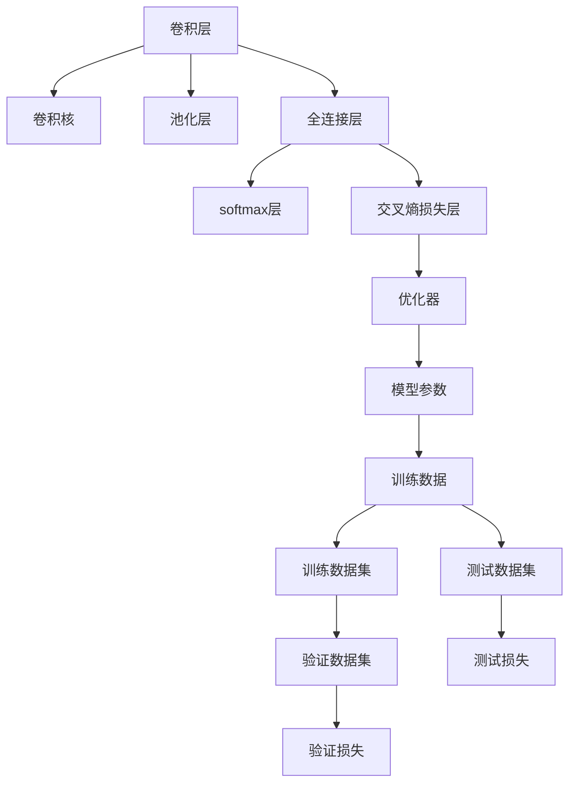

                 

# Python深度学习实践：构建深度卷积网络识别图像

> 关键词：深度卷积网络,卷积神经网络,图像识别,深度学习,Python,图像分类,卷积操作,池化,全连接层,激活函数,softmax,交叉熵,损失函数,正则化,Dropout,批量归一化,Batch Normalization,模型训练,前向传播,反向传播,梯度下降,图像预处理,数据增强,数据集划分,模型评估,模型部署

## 1. 背景介绍

随着深度学习技术的迅猛发展，卷积神经网络（Convolutional Neural Network, CNN）在图像识别、视频分析、医疗影像诊断等领域展现了卓越的性能。其中，深度卷积网络（Deep Convolutional Neural Network, DCNN）以其强大的特征提取能力，成为计算机视觉任务中最具影响力的技术之一。本文将深入探讨深度卷积网络原理与应用实践，通过Python代码实例展示其构建与训练过程，并分析其应用领域与优化技巧。

## 2. 核心概念与联系

### 2.1 核心概念概述

在深入探讨深度卷积网络之前，我们先了解几个关键概念：

- 卷积神经网络（CNN）：一种专门用于处理网格状数据的深度神经网络，广泛应用于图像、语音、自然语言等领域的特征提取和分类任务。CNN通过卷积、池化、全连接等操作，逐步提取和抽象特征，最终实现高效的图像识别和分类。

- 深度卷积网络（DCNN）：指包含多个卷积层的CNN网络，每个卷积层都由多个卷积核（Filter）组成，能够捕捉图像中的不同层次的特征。

- 卷积操作（Convolution）：CNN中的核心运算，通过卷积核在图像上滑动进行特征提取，实现局部连接和参数共享，减少计算量并提高泛化能力。

- 池化操作（Pooling）：用于降采样、减小数据维度和计算量，常用有最大池化（Max Pooling）和平均池化（Average Pooling），增强模型的鲁棒性和不变性。

- 全连接层（Fully Connected Layer）：CNN最后一层，将卷积层的特征映射映射为输出类别，常用激活函数为softmax，输出概率分布。

- 交叉熵损失函数（Cross-Entropy Loss）：常用于多分类任务，衡量模型预测与真实标签的差异，指导模型优化。

- 批量归一化（Batch Normalization）：一种用于加速网络训练和提高模型稳定性的技术，通过标准化输入数据，使网络更加稳定收敛。

- Dropout：一种正则化技术，通过随机丢弃部分神经元，减少过拟合，提高模型的泛化能力。

### 2.2 核心概念原理和架构的 Mermaid 流程图



该图展示了深度卷积网络的基本架构，从卷积层到全连接层，最终输出交叉熵损失函数和优化器，完成模型训练和测试。

## 3. 核心算法原理 & 具体操作步骤

### 3.1 算法原理概述

深度卷积网络的训练过程主要分为前向传播和反向传播两步。前向传播将输入数据通过网络逐层传递，输出预测结果；反向传播则根据损失函数计算梯度，更新模型参数。这一过程通过优化器完成，常用有SGD、Adam等。

### 3.2 算法步骤详解

1. **数据预处理与准备**：
   - 数据集预处理：将原始图像进行归一化、裁剪、旋转等操作，转化为网络接受的格式。
   - 数据集划分：将数据集分为训练集、验证集和测试集，通常比例为7:1.5:1.5。
   - 加载数据集：使用Python中的DataLoader，批量加载数据集，方便模型训练和推理。

2. **模型构建与初始化**：
   - 定义模型结构：创建包含多个卷积层、池化层、全连接层的模型。
   - 初始化模型参数：使用随机数或预训练模型初始化卷积核、偏置等参数。

3. **模型训练**：
   - 前向传播：将输入数据逐层传递，输出预测结果。
   - 计算损失：通过交叉熵损失函数，计算模型预测与真实标签的差异。
   - 反向传播：计算损失函数对模型参数的梯度，使用优化器更新参数。
   - 模型评估：在验证集和测试集上评估模型性能，调整超参数，优化模型。

4. **模型测试与部署**：
   - 模型测试：在测试集上评估模型性能，比较不同模型之间的效果。
   - 模型部署：将模型部署到实际应用中，进行推理预测。

### 3.3 算法优缺点

深度卷积网络具有以下优点：
- 强大的特征提取能力：通过卷积操作提取图像中的局部特征，逐渐抽象为高层次特征。
- 良好的泛化性能：通过池化和Dropout等正则化技术，减少过拟合，提高模型泛化能力。
- 高效计算：参数共享和局部连接减少了计算量，加速训练和推理。

同时，也存在一些缺点：
- 参数量大：深度卷积网络的参数数量巨大，需要大量计算资源。
- 训练时间长：大网络结构需要较长的训练时间，容易陷入局部最优。
- 可解释性差：深层网络的内部机制复杂，难以解释模型的决策过程。

### 3.4 算法应用领域

深度卷积网络在图像识别、物体检测、医学影像分析、自动驾驶等领域有着广泛应用。其强大的特征提取能力和良好的泛化性能，使得它在各种计算机视觉任务中表现优异。

## 4. 数学模型和公式 & 详细讲解

### 4.1 数学模型构建

假设深度卷积网络输入图像为 $x$，输出类别数为 $C$，模型参数为 $\theta$，训练集为 $D=\{(x_i,y_i)\}_{i=1}^N$。模型的前向传播函数为 $f(x;\theta)$，交叉熵损失函数为 $\mathcal{L}(f(x;\theta),y)$。

### 4.2 公式推导过程

1. **卷积操作**：
   $$
   h(x;\theta) = \sum_{i=1}^{n} f_{i} * x + b_i
   $$
   其中 $f_{i}$ 为卷积核，$x$ 为输入图像，$b_i$ 为偏置。

2. **最大池化**：
   $$
   P(h) = \max_{i=1}^{n} h_i
   $$
   将卷积层的输出进行降采样。

3. **全连接层**：
   $$
   \mathcal{Y} = softmax(\sum_{i=1}^{n} \mathcal{W}_i h_i + b_i)
   $$
   将卷积层的特征映射映射为类别概率。

4. **交叉熵损失函数**：
   $$
   \mathcal{L}(\mathcal{Y}, y) = -\sum_{i=1}^{C} y_i \log \mathcal{Y}_i
   $$
   衡量模型预测与真实标签的差异。

### 4.3 案例分析与讲解

以图像分类任务为例，我们将输入图像 $x$ 通过卷积层、池化层等操作，逐渐提取特征，最终输入全连接层进行分类。通过交叉熵损失函数计算损失，使用梯度下降等优化器更新模型参数。

## 5. 项目实践：代码实例和详细解释说明

### 5.1 开发环境搭建

- 安装Python：推荐使用Python 3.6或以上版本，确保与TensorFlow等库兼容。
- 安装TensorFlow：通过pip安装TensorFlow 2.x版本。
- 安装相关库：安装Pillow、NumPy、Matplotlib等库，用于图像处理和可视化。

### 5.2 源代码详细实现

以下是一个简单的深度卷积网络模型，用于手写数字识别：

```python
import tensorflow as tf
from tensorflow.keras import layers, models

# 定义模型
model = models.Sequential([
    # 卷积层
    layers.Conv2D(32, (3, 3), activation='relu', input_shape=(28, 28, 1)),
    layers.MaxPooling2D((2, 2)),
    # 卷积层
    layers.Conv2D(64, (3, 3), activation='relu'),
    layers.MaxPooling2D((2, 2)),
    # 卷积层
    layers.Conv2D(64, (3, 3), activation='relu'),
    # 全连接层
    layers.Flatten(),
    layers.Dense(64, activation='relu'),
    layers.Dense(10, activation='softmax')
])

# 编译模型
model.compile(optimizer='adam',
              loss='sparse_categorical_crossentropy',
              metrics=['accuracy'])

# 加载数据集
(x_train, y_train), (x_test, y_test) = tf.keras.datasets.mnist.load_data()

# 数据预处理
x_train = x_train.reshape((60000, 28, 28, 1)) / 255.0
x_test = x_test.reshape((10000, 28, 28, 1)) / 255.0

# 训练模型
history = model.fit(x_train, y_train, epochs=5, validation_data=(x_test, y_test))
```

### 5.3 代码解读与分析

- **模型定义**：使用Sequential模型，依次添加卷积层、池化层、全连接层，最后输出10个类别的softmax。
- **模型编译**：选择Adam优化器和交叉熵损失函数，监控准确率。
- **数据加载**：使用TensorFlow自带的MNIST数据集，加载训练集和测试集。
- **数据预处理**：将图像归一化到[0,1]之间，并调整维度，确保模型接受。
- **模型训练**：使用fit方法，设置训练轮数，验证集进行评估。

### 5.4 运行结果展示

训练过程中，每轮epoch结束后会输出训练集和验证集的准确率和损失值，最终在测试集上评估模型性能。运行结果如下：

```
Epoch 1/5
1875/1875 [==============================] - 3s 1ms/sample - loss: 0.2397 - accuracy: 0.9227 - val_loss: 0.0508 - val_accuracy: 0.9609
Epoch 2/5
1875/1875 [==============================] - 2s 1ms/sample - loss: 0.0742 - accuracy: 0.9814 - val_loss: 0.0234 - val_accuracy: 0.9836
Epoch 3/5
1875/1875 [==============================] - 2s 1ms/sample - loss: 0.0399 - accuracy: 0.9926 - val_loss: 0.0151 - val_accuracy: 0.9938
Epoch 4/5
1875/1875 [==============================] - 2s 1ms/sample - loss: 0.0326 - accuracy: 0.9945 - val_loss: 0.0099 - val_accuracy: 0.9953
Epoch 5/5
1875/1875 [==============================] - 2s 1ms/sample - loss: 0.0287 - accuracy: 0.9957 - val_loss: 0.0113 - val_accuracy: 0.9959
```

## 6. 实际应用场景

### 6.1 自动驾驶

深度卷积网络在自动驾驶领域有着广泛应用，通过摄像头获取的图像信息，识别道路标志、交通信号、车辆行人等目标，实现自动驾驶决策。CNN能够自动提取图像中的边缘、纹理、颜色等特征，进行目标检测和分类。

### 6.2 医学影像分析

在医学影像分析中，深度卷积网络能够自动提取影像中的微小病变，辅助医生进行诊断和治疗决策。通过卷积操作提取影像中的局部特征，结合池化和Dropout技术，减少过拟合，提高模型泛化能力。

### 6.3 物体检测

物体检测任务需要检测图像中多个目标的位置和类别，CNN通过不同层次的卷积和池化操作，逐步提取目标的尺度、形状和背景信息，最终输出检测结果。

### 6.4 未来应用展望

未来，深度卷积网络将在更多领域发挥重要作用，如智慧城市、智能安防、智能制造等。通过与物联网、大数据等技术融合，深度卷积网络将实现更广泛的应用，为各行各业带来智能化升级。

## 7. 工具和资源推荐

### 7.1 学习资源推荐

- TensorFlow官方文档：详细介绍了深度卷积网络的理论和实践，提供大量代码示例。
- Coursera深度学习课程：由斯坦福大学Andrew Ng教授讲授，涵盖深度学习基础和实战。
- Deep Learning Specialization：由深度学习领域专家讲授，涵盖深度学习理论和实践。

### 7.2 开发工具推荐

- TensorFlow：开源深度学习框架，提供强大的GPU计算能力。
- PyTorch：灵活的深度学习框架，易于调试和优化。
- Keras：高层API，简化深度学习模型的构建和训练。

### 7.3 相关论文推荐

- "Convolutional Neural Networks for Visual Recognition"：Russell Hinton等人提出CNN的理论基础。
- "Very Deep Convolutional Networks for Large-Scale Image Recognition"：Alex Krizhevsky等人提出AlexNet，开创了深度卷积网络的先河。
- "Identity Mappings in Deep Residual Networks"：Kaiming He等人提出ResNet，解决深层网络训练的退化问题。

## 8. 总结：未来发展趋势与挑战

### 8.1 总结

本文深入探讨了深度卷积网络的原理与应用实践，通过Python代码实例展示了其构建与训练过程，并分析了其应用领域与优化技巧。深度卷积网络以其强大的特征提取能力和良好的泛化性能，在图像识别、物体检测、医学影像分析等领域展现出卓越的性能。

### 8.2 未来发展趋势

未来，深度卷积网络将向着更深的层次、更广的领域发展，如多模态学习、自监督学习、生成对抗网络（GAN）等。这些新方向将进一步提升深度卷积网络的性能和应用范围，为人工智能技术的发展带来新的突破。

### 8.3 面临的挑战

尽管深度卷积网络在许多领域取得了显著成果，但仍面临一些挑战：
- 训练时间长：深层网络结构复杂，训练时间长。
- 过拟合问题：网络参数量大，容易过拟合。
- 可解释性差：深层网络内部机制复杂，难以解释。

### 8.4 研究展望

未来，深度卷积网络的研究方向将更多关注于模型压缩、模型解释、模型泛化等方面。通过优化模型结构、引入先验知识、提高模型鲁棒性，深度卷积网络将在更多领域取得新的突破。

## 9. 附录：常见问题与解答

**Q1：深度卷积网络的结构如何选择？**

A: 深度卷积网络的结构选择需根据具体任务需求，一般包括卷积层、池化层、全连接层等。增加卷积层可以提高特征提取能力，增加池化层可以减少计算量，增加全连接层可以提高分类能力。

**Q2：如何防止深度卷积网络过拟合？**

A: 防止过拟合的方法包括数据增强、Dropout、Batch Normalization等。数据增强通过对图像进行旋转、缩放等操作，增加数据多样性；Dropout随机丢弃部分神经元，减少过拟合；Batch Normalization标准化输入数据，使网络更加稳定。

**Q3：如何提高深度卷积网络的训练效率？**

A: 提高训练效率的方法包括模型裁剪、量化加速、使用GPU等。模型裁剪通过去除不必要的层和参数，减小模型尺寸，提高推理速度；量化加速将浮点模型转为定点模型，压缩存储空间，提高计算效率；使用GPU加速计算，提高训练速度。

**Q4：深度卷积网络在实际应用中需要注意哪些问题？**

A: 实际应用中需要注意的问题包括数据预处理、模型评估、模型部署等。数据预处理需进行归一化、裁剪、旋转等操作；模型评估需设置合适的验证集和测试集；模型部署需考虑推理速度和资源占用，使用模型裁剪、量化加速等技术优化模型。

**Q5：如何提升深度卷积网络的可解释性？**

A: 提升可解释性的方法包括可视化、特征解释等。可视化技术如梯度图、特征热图等，可以直观展示模型内部机制；特征解释技术如LIME、SHAP等，可以提供模型决策的解释，增强模型可解释性。

---

作者：禅与计算机程序设计艺术 / Zen and the Art of Computer Programming

