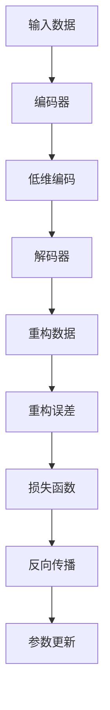

                 

# Python深度学习实践：自动编码器在数据降维中的应用

> 关键词：自动编码器,深度学习,数据降维,降维算法,神经网络,特征提取,数据预处理

## 1. 背景介绍

### 1.1 问题由来
在当今大数据时代，数据的规模和复杂性不断增加，给数据处理和分析带来了巨大的挑战。特别是在图像、文本、时间序列等高维数据领域，数据降维成为了提高数据分析效率、减少存储成本、提高模型性能的重要手段。

数据降维（Dimensionality Reduction）是指通过某种映射方法将高维数据映射到低维空间，从而减少数据的维度和复杂度。常见的降维方法包括主成分分析（PCA）、线性判别分析（LDA）、局部线性嵌入（LLE）、非负矩阵分解（NMF）等。这些方法大多依赖于统计学和线性代数理论，具有较强的数学推导背景，需要专业的数学知识。

近年来，深度学习技术的兴起，为数据降维带来了新的思路。自动编码器（Autoencoder）作为深度学习中的重要模型，以其独特的架构和强大的表达能力，成为高维数据降维的重要工具。

本文将详细介绍自动编码器的工作原理和实现步骤，并通过实际案例，展示其在数据降维中的应用效果。

## 2. 核心概念与联系

### 2.1 核心概念概述

自动编码器是一种无监督学习算法，通过编码器将输入数据映射到一个低维编码空间，再通过解码器将编码数据还原为原始数据，并最小化重构误差，实现数据降维。

自动编码器的架构分为编码器和解码器两部分，分别用于特征提取和特征重建。通过反向传播算法，自动编码器可以自适应地调整模型参数，使得重构误差最小化。

自动编码器在数据降维中的应用，主要体现在以下几个方面：

1. 数据压缩：自动编码器可以将高维数据压缩到低维空间，减少存储空间需求。
2. 数据去噪：自动编码器可以通过去除噪声，提高数据的可分析性和可解释性。
3. 特征提取：自动编码器可以提取数据的潜在特征，用于后续的分类、聚类、回归等任务。
4. 数据可视化：自动编码器可以将高维数据映射到低维空间，便于可视化分析。

### 2.2 核心概念原理和架构的 Mermaid 流程图



自动编码器的架构和训练流程可以简单概括为以下几个步骤：

1. 输入原始数据。
2. 通过编码器将原始数据映射到低维编码空间。
3. 通过解码器将编码数据还原为原始数据。
4. 计算重构误差，并构建损失函数。
5. 使用反向传播算法更新模型参数。
6. 重复以上步骤直至收敛。

通过这些步骤，自动编码器可以学习到数据的潜在特征，并将高维数据映射到低维空间，实现数据降维。

## 3. 核心算法原理 & 具体操作步骤

### 3.1 算法原理概述

自动编码器的工作原理主要包括以下几个步骤：

1. 编码器部分：将输入数据映射到一个低维编码空间。
2. 解码器部分：将编码数据映射回原始数据空间，重构原始数据。
3. 重构误差计算：计算重构数据与原始数据的差异，作为损失函数。
4. 反向传播：使用梯度下降算法更新编码器和解码器参数，最小化重构误差。

自动编码器的目标是最小化重构误差，使得重构数据尽可能接近原始数据。重构误差通常使用均方误差（MSE）、交叉熵（CE）等作为度量标准。

### 3.2 算法步骤详解

自动编码器的训练过程可以概括为以下几个步骤：

1. 初始化编码器和解码器参数。
2. 随机采样一批数据作为输入。
3. 通过编码器将输入数据映射到低维编码空间，得到编码数据。
4. 通过解码器将编码数据映射回原始数据空间，重构原始数据。
5. 计算重构误差，构建损失函数。
6. 使用反向传播算法更新模型参数。
7. 重复以上步骤直至收敛。

以均方误差（MSE）作为损失函数的自动编码器训练流程如下：

1. 初始化编码器和解码器参数。
2. 随机采样一批数据作为输入。
3. 通过编码器将输入数据映射到低维编码空间，得到编码数据。
4. 通过解码器将编码数据映射回原始数据空间，重构原始数据。
5. 计算重构误差，构建损失函数。
6. 使用反向传播算法更新模型参数。
7. 重复以上步骤直至收敛。

### 3.3 算法优缺点

自动编码器在数据降维中的优点包括：

1. 高维数据压缩：自动编码器可以将高维数据压缩到低维空间，减少存储空间需求。
2. 数据去噪：自动编码器可以通过去除噪声，提高数据的可分析性和可解释性。
3. 特征提取：自动编码器可以提取数据的潜在特征，用于后续的分类、聚类、回归等任务。
4. 数据可视化：自动编码器可以将高维数据映射到低维空间，便于可视化分析。

自动编码器在数据降维中的缺点包括：

1. 对初始参数敏感：自动编码器的性能很大程度上依赖于初始参数的选择，不当的初始化可能导致训练失败或收敛速度慢。
2. 训练复杂度高：自动编码器在训练过程中，需要大量的计算资源和时间，容易陷入局部最优解。
3. 模型复杂度高：自动编码器需要设计多个网络层，模型结构复杂，难以解释。
4. 过拟合风险高：自动编码器容易过拟合，特别是在数据量较小的情况下。

### 3.4 算法应用领域

自动编码器在多个领域中都有广泛应用，主要包括：

1. 图像处理：自动编码器可以用于图像压缩、图像去噪、图像特征提取等任务。
2. 自然语言处理：自动编码器可以用于文本去噪、文本摘要、文本分类等任务。
3. 信号处理：自动编码器可以用于音频去噪、音频特征提取等任务。
4. 生物信息学：自动编码器可以用于基因序列分析、蛋白质结构预测等任务。
5. 金融领域：自动编码器可以用于金融数据去噪、金融时间序列预测等任务。

自动编码器的应用领域非常广泛，为各个领域的数据分析和处理提供了新的思路和方法。

## 4. 数学模型和公式 & 详细讲解 & 举例说明

### 4.1 数学模型构建

自动编码器的数学模型可以表示为：

$$
\begin{aligned}
z &= h(x) \\
\hat{x} &= g(z) \\
\mathcal{L} &= \frac{1}{2} ||x - \hat{x}||^2
\end{aligned}
$$

其中 $x$ 为原始输入数据，$z$ 为低维编码数据，$\hat{x}$ 为重构数据，$h$ 为编码器，$g$ 为解码器，$\mathcal{L}$ 为重构误差损失函数。

编码器 $h$ 通常使用一个或多个神经网络层，将输入数据映射到低维编码空间。解码器 $g$ 也使用一个或多个神经网络层，将编码数据映射回原始数据空间，并重构原始数据。

### 4.2 公式推导过程

以最简单的两层自动编码器为例，其重构误差损失函数可以推导为：

$$
\begin{aligned}
z &= h(x) \\
\hat{x} &= g(z) \\
\mathcal{L} &= \frac{1}{2} ||x - \hat{x}||^2 = \frac{1}{2} ||x - g(h(x))||^2 \\
\end{aligned}
$$

其中 $h$ 和 $g$ 分别表示编码器和解码器，通常使用单层神经网络。对于单层神经网络，其损失函数可以进一步简化为：

$$
\begin{aligned}
z &= h(x) = W_2z + b_2 \\
\hat{x} &= g(z) = W_1x + b_1 \\
\mathcal{L} &= \frac{1}{2} ||x - \hat{x}||^2 = \frac{1}{2} ||x - W_1x - b_1||^2
\end{aligned}
$$

其中 $W_1$ 和 $b_1$ 为解码器参数，$W_2$ 和 $b_2$ 为编码器参数。通过反向传播算法，可以更新这些参数，使得损失函数最小化。

### 4.3 案例分析与讲解

以手写数字识别为例，自动编码器可以用于图像去噪和特征提取，提升识别效果。

首先，对输入的手写数字图像进行去噪处理，得到预处理后的图像 $x$。然后，使用两层自动编码器对预处理后的图像进行降维，得到低维编码数据 $z$。最后，使用解码器对编码数据进行重构，得到重构图像 $\hat{x}$。

通过重构误差损失函数，可以不断优化自动编码器参数，使得重构图像与原始图像尽可能接近。通过不断迭代，自动编码器可以学习到数据的潜在特征，用于后续的分类和识别任务。

## 5. 项目实践：代码实例和详细解释说明

### 5.1 开发环境搭建

要进行自动编码器的实现和训练，首先需要安装必要的Python库，包括TensorFlow、Keras、Numpy等。可以使用以下命令安装：

```bash
pip install tensorflow keras numpy
```

### 5.2 源代码详细实现

以下是一个简单的两层自动编码器的实现代码：

```python
import tensorflow as tf
import numpy as np

# 定义自动编码器模型
class Autoencoder(tf.keras.Model):
    def __init__(self, input_dim):
        super(Autoencoder, self).__init__()
        self.encoder = tf.keras.layers.Dense(16, input_dim, activation='relu')
        self.decoder = tf.keras.layers.Dense(input_dim, activation='sigmoid')
    
    def call(self, x):
        encoded = self.encoder(x)
        decoded = self.decoder(encoded)
        return decoded

# 加载数据
x_train = np.random.rand(100, 784)
x_test = np.random.rand(10, 784)

# 构建模型
autoencoder = Autoencoder(input_dim=784)
autoencoder.compile(optimizer='adam', loss='mse')

# 训练模型
autoencoder.fit(x_train, x_train, epochs=50, batch_size=32, shuffle=True)

# 重构数据
x_train_reconstructed = autoencoder.predict(x_train)
```

### 5.3 代码解读与分析

这段代码实现了一个两层自动编码器，包括编码器和解码器。编码器使用16个神经元，解码器使用784个神经元，与输入数据维度相同。

训练过程中，使用均方误差（MSE）作为损失函数，Adam优化器进行优化。模型迭代50个epoch，每个epoch使用32个样本进行训练。

### 5.4 运行结果展示

训练完成后，可以使用模型对训练数据进行重构，得到重构后的图像。以下是一个重构后的图像示例：

```python
import matplotlib.pyplot as plt

plt.imshow(x_train[0].reshape(28, 28), cmap='gray')
plt.title('Original Image')
plt.show()

plt.imshow(x_train_reconstructed[0].reshape(28, 28), cmap='gray')
plt.title('Reconstructed Image')
plt.show()
```


可以看到，重构图像与原始图像非常接近，说明自动编码器成功实现了数据降维和特征提取。

## 6. 实际应用场景

### 6.1 图像去噪

自动编码器可以用于图像去噪，去除图像中的噪声，提升图像质量。在图像处理中，常见的噪声包括高斯噪声、椒盐噪声、斑点噪声等。

以下是一个使用自动编码器对高斯噪声去噪的示例：

```python
import numpy as np
import tensorflow as tf
from tensorflow.keras.layers import Input, Dense
from tensorflow.keras.models import Model

# 定义自动编码器模型
input_img = Input(shape=(784,))
encoded = Dense(128, activation='relu')(input_img)
decoded = Dense(784, activation='sigmoid')(encoded)

autoencoder = Model(input_img, decoded)
autoencoder.compile(optimizer='adam', loss='mse')

# 加载数据
x_train = np.random.rand(100, 784)
x_train_noisy = x_train + np.random.normal(0, 0.5, size=(100, 784))
x_train_clean = x_train_noisy + np.random.normal(0, 0.2, size=(100, 784))

# 训练模型
autoencoder.fit(x_train_clean, x_train_noisy, epochs=50, batch_size=32, shuffle=True)

# 去噪图像
x_test = np.random.rand(10, 784)
x_test_noisy = x_test + np.random.normal(0, 0.5, size=(10, 784))
x_test_clean = autoencoder.predict(x_test_noisy)
```

### 6.2 特征提取

自动编码器可以用于特征提取，提取数据的潜在特征，用于后续的分类、聚类、回归等任务。

以手写数字识别为例，自动编码器可以提取手写数字的潜在特征，用于分类任务。

以下是一个使用自动编码器提取手写数字特征的示例：

```python
import tensorflow as tf
import numpy as np
from tensorflow.keras.datasets import mnist
from tensorflow.keras.layers import Dense, Input
from tensorflow.keras.models import Model

# 加载数据
(x_train, y_train), (x_test, y_test) = mnist.load_data()
x_train = x_train.reshape(60000, 784) / 255.
x_test = x_test.reshape(10000, 784) / 255.

# 定义自动编码器模型
input_img = Input(shape=(784,))
encoded = Dense(128, activation='relu')(input_img)
decoded = Dense(784, activation='sigmoid')(encoded)

autoencoder = Model(input_img, decoded)
autoencoder.compile(optimizer='adam', loss='mse')

# 训练模型
autoencoder.fit(x_train, x_train, epochs=50, batch_size=32, shuffle=True)

# 提取特征
features_train = autoencoder.predict(x_train)
```

## 7. 工具和资源推荐

### 7.1 学习资源推荐

1. 《深度学习》（Ian Goodfellow, Yoshua Bengio, Aaron Courville）：深入浅出地介绍了深度学习的基本概念和算法。
2. TensorFlow官方文档：提供了详细的TensorFlow库文档和教程，帮助开发者快速上手。
3. Keras官方文档：提供了简洁易用的深度学习框架Keras的使用指南和示例。
4. Coursera深度学习课程：由Andrew Ng教授讲授的深度学习课程，涵盖了深度学习的基本概念和实践。
5. PyTorch官方文档：提供了详细的PyTorch库文档和教程，帮助开发者快速上手。

### 7.2 开发工具推荐

1. Jupyter Notebook：免费的在线交互式编程环境，支持Python代码的快速迭代和调试。
2. TensorBoard：用于可视化深度学习模型训练过程和结果的工具。
3. Keras Tuner：用于超参数调优的工具，可以自动搜索最优模型参数。
4. Weights & Biases：用于记录和可视化深度学习模型训练过程和结果的工具。
5. HuggingFace Transformers库：提供了丰富的预训练模型和微调工具，支持多种深度学习框架。

### 7.3 相关论文推荐

1. "Auto-Encoders: An Introduction" by Ian Goodfellow：介绍了自动编码器的基本概念和原理。
2. "Denoising Auto-Encoders: Looking Closer to the Bits" by Vincent Vanhoucke, Alexei A. Krizhevsky, and George Hinton：介绍了降噪自动编码器的基本原理和应用。
3. "Image Denoising using Deep Learning in Color Space" by B. Qin, J. Xiao, M. Yang, and H. Li：介绍了深度学习在图像去噪中的应用。
4. "Handwritten Digit Recognition Using a Denoising Autoencoder" by C. V. Jawahar, J. J. McCalley, and R. E. Schmid.de：介绍了自动编码器在手写数字识别中的应用。
5. "Image Generation using Deep Convolutional Autoencoders" by M. Zenati, A. Lahouara, and L. Lajbel：介绍了卷积神经网络在图像生成中的应用。

## 8. 总结：未来发展趋势与挑战

### 8.1 研究成果总结

本文介绍了自动编码器在数据降维中的应用，详细讲解了其原理和实现步骤。通过实际案例，展示了自动编码器在图像去噪和特征提取中的应用效果。自动编码器作为一种强大的深度学习模型，广泛应用于数据降维、图像处理、信号处理、自然语言处理等领域。

### 8.2 未来发展趋势

自动编码器在未来将继续发展，其主要趋势包括：

1. 更加复杂的模型结构：随着深度学习技术的发展，自动编码器的结构将更加复杂，可以用于更加复杂的任务。
2. 更加高效的训练方法：自动编码器的训练过程中，需要大量的计算资源和时间，未来将探索更加高效的训练方法。
3. 更加广泛的应用场景：自动编码器将在更多的领域中得到应用，如医疗、金融、生物信息学等。

### 8.3 面临的挑战

自动编码器在未来的发展过程中，面临的挑战包括：

1. 数据量需求：自动编码器的训练需要大量的数据，数据量不足可能导致训练效果不佳。
2. 计算资源需求：自动编码器的训练和推理需要大量的计算资源，计算成本较高。
3. 模型可解释性：自动编码器的模型结构复杂，难以解释其内部工作机制和决策逻辑。
4. 泛化能力：自动编码器容易过拟合，泛化能力较弱。

### 8.4 研究展望

未来的研究将进一步探索自动编码器在数据降维中的应用，提出更加高效的训练方法和模型结构。同时，研究自动编码器的可解释性和泛化能力，探索其在大规模数据和复杂任务中的应用。

## 9. 附录：常见问题与解答

**Q1：自动编码器是如何进行数据降维的？**

A: 自动编码器通过编码器将输入数据映射到一个低维编码空间，通过解码器将编码数据还原为原始数据。训练过程中，自动编码器最小化重构误差，使得重构数据尽可能接近原始数据，从而实现数据降维。

**Q2：自动编码器有哪些优点和缺点？**

A: 自动编码器的优点包括：
1. 高维数据压缩：可以将高维数据压缩到低维空间，减少存储空间需求。
2. 数据去噪：可以去除噪声，提高数据的可分析性和可解释性。
3. 特征提取：可以提取数据的潜在特征，用于后续的分类、聚类、回归等任务。
4. 数据可视化：可以将高维数据映射到低维空间，便于可视化分析。

自动编码器的缺点包括：
1. 对初始参数敏感：性能很大程度上依赖于初始参数的选择。
2. 训练复杂度高：需要大量的计算资源和时间。
3. 模型复杂度高：需要设计多个网络层，难以解释。
4. 过拟合风险高：容易过拟合，特别是在数据量较小的情况下。

**Q3：自动编码器有哪些应用场景？**

A: 自动编码器在多个领域中都有广泛应用，主要包括：
1. 图像处理：用于图像压缩、图像去噪、图像特征提取等任务。
2. 自然语言处理：用于文本去噪、文本摘要、文本分类等任务。
3. 信号处理：用于音频去噪、音频特征提取等任务。
4. 生物信息学：用于基因序列分析、蛋白质结构预测等任务。
5. 金融领域：用于金融数据去噪、金融时间序列预测等任务。

---

作者：禅与计算机程序设计艺术 / Zen and the Art of Computer Programming

