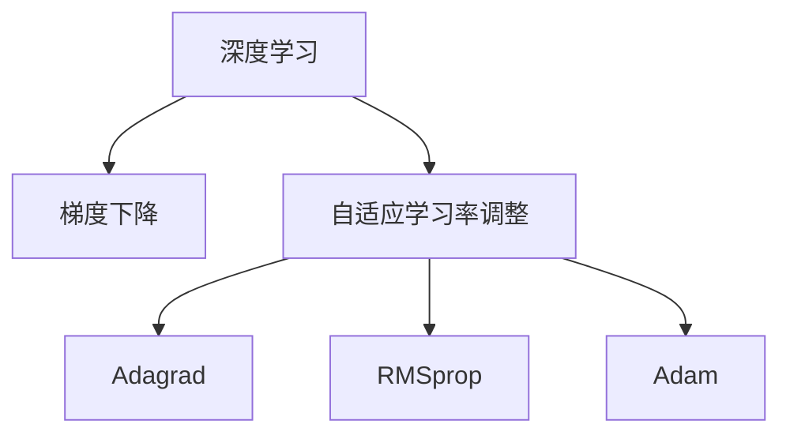

                 

# Python深度学习实践：自适应学习率调整技术

> 关键词：自适应学习率,深度学习,梯度下降,动态调整,参数优化,PyTorch

## 1. 背景介绍

### 1.1 问题由来
深度学习是当前人工智能领域的热门技术，广泛应用于图像识别、自然语言处理、语音识别等多个领域。深度神经网络通过多层次的非线性变换，具备强大的特征提取和表示能力，但同时也面临训练时间长、计算资源需求大、容易过拟合等挑战。

其中，学习率是一个关键的超参数，影响深度学习模型的收敛速度和稳定性。学习率设置不当，可能会导致梯度下降过程震荡不收敛，或者收敛到局部最优解，甚至发散。因此，自适应学习率调整技术成为优化模型性能的关键手段之一。

### 1.2 问题核心关键点
自适应学习率调整技术通过动态调整学习率，使得模型在训练过程中能够自适应地调节学习速度，避免过快或过慢的梯度下降，加快收敛速度，提升模型效果。常见的方法包括Adagrad、RMSprop、Adam等。

自适应学习率调整的关键在于能够实时跟踪梯度下降过程中的动态变化，灵活调整学习率，具体来说包括以下几个方面：

- 根据梯度大小自适应调整学习率。例如，Adagrad通过累加梯度平方和的逆方根来调整学习率，RMSprop使用指数加权平均梯度平方和的逆方根来调整学习率，Adam则综合了动量与自适应梯度校正两种思想。

- 引入动量项，加速梯度下降。例如，RMSprop和Adam引入了动量项，对梯度进行累加平滑处理，避免震荡。

- 结合多维梯度，优化参数更新。例如，Adagrad和Adam能够同时处理多个参数的更新，避免单个参数的梯度丢失和更新偏差。

### 1.3 问题研究意义
自适应学习率调整技术是深度学习模型训练的基础，能够显著提升模型的收敛速度和泛化能力。通过有效的学习率调整策略，可以大幅降低超参数调优的复杂度，加速模型的迭代训练过程，避免梯度消失或爆炸的问题。

研究自适应学习率调整方法，对于提升深度学习模型的训练效果、降低计算资源消耗、加速模型部署具有重要意义。同时，能够为大规模深度学习模型的应用，如自动驾驶、语音识别、自然语言处理等提供理论和技术支撑。

## 2. 核心概念与联系

### 2.1 核心概念概述

为更好地理解自适应学习率调整技术，本节将介绍几个密切相关的核心概念：

- 深度学习(Deep Learning)：基于神经网络的机器学习范式，能够学习到高维特征表示，广泛应用于图像、文本、语音等领域。
- 梯度下降(Gradient Descent)：一种优化算法，通过迭代计算模型参数的梯度，不断更新参数，使得损失函数最小化。
- 学习率(Learning Rate)：控制梯度下降过程中参数更新的步长，影响模型的收敛速度和稳定性。
- 自适应学习率调整技术：通过实时跟踪梯度变化，动态调整学习率，提升模型训练效率。

这些核心概念之间的逻辑关系可以通过以下Mermaid流程图来展示：



这个流程图展示了大模型微调的逻辑结构：

1. 深度学习模型在大量数据上进行训练。
2. 使用梯度下降优化算法，更新模型参数。
3. 通过自适应学习率调整技术，提升模型训练效率和效果。

其中，Adagrad、RMSprop、Adam等算法是自适应学习率调整技术的典型代表，将在后文详细讲解。

## 3. 核心算法原理 & 具体操作步骤
### 3.1 算法原理概述

自适应学习率调整技术通过动态调整学习率，使得模型在训练过程中能够自适应地调节学习速度，避免过快或过慢的梯度下降，加快收敛速度，提升模型效果。常见的方法包括Adagrad、RMSprop、Adam等。

形式化地，假设深度神经网络模型为 $M_{\theta}$，其中 $\theta$ 为模型参数。给定训练集 $D=\{(x_i,y_i)\}_{i=1}^N$，目标是通过优化算法最小化损失函数 $\mathcal{L}(M_{\theta})$。自适应学习率调整方法通过实时跟踪梯度变化，动态调整学习率 $\eta$，使得模型参数 $\theta$ 不断更新，最小化损失函数。

具体而言，常用的自适应学习率调整方法包括以下几个步骤：

- 在每次迭代中，计算损失函数对参数 $\theta$ 的梯度 $\nabla_{\theta}\mathcal{L}(\theta)$。
- 根据当前梯度，计算自适应调整的学习率 $\eta_i$。
- 根据自适应学习率 $\eta_i$，更新模型参数 $\theta$。

### 3.2 算法步骤详解

下面以Adagrad算法为例，详细讲解其步骤：

**Step 1: 初始化**
- 初始化模型参数 $\theta$ 和梯度平方和累加器 $G$，初始值为零向量。

**Step 2: 梯度计算**
- 对训练集 $D$ 中的每个样本 $(x_i,y_i)$，计算梯度 $g_i=\nabla_{\theta}\mathcal{L}(\theta)$。

**Step 3: 自适应学习率计算**
- 根据当前梯度 $g_i$，更新梯度平方和累加器 $G_i$：
  $$
  G_i = G + g_i \odot g_i
  $$
  其中 $\odot$ 表示逐元素乘法。
- 计算自适应学习率 $\eta_i$：
  $$
  \eta_i = \frac{\eta}{\sqrt{G_i+\epsilon}}
  $$
  其中 $\eta$ 为初始学习率，$\epsilon$ 为极小值（通常设置为 $10^{-7}$），防止分母为零。

**Step 4: 参数更新**
- 根据自适应学习率 $\eta_i$，更新模型参数 $\theta$：
  $$
  \theta = \theta - \eta_i g_i
  $$

重复上述步骤，直到模型收敛或达到预设迭代次数。Adagrad算法通过累加梯度平方和的逆方根来调整学习率，适用于稀疏梯度的情况，能够自动适应稀疏梯度，加速收敛。

### 3.3 算法优缺点

自适应学习率调整技术具有以下优点：

1. 动态调整学习率，避免学习率过快或过慢的问题，加速收敛。
2. 适用于稀疏梯度的情况，能够自动适应不同样本的梯度大小，提升模型效果。
3. 不需要手动调整学习率，降低超参数调优的复杂度。

同时，该方法也存在以下局限性：

1. 对稀疏梯度的适应效果较好，但对稠密梯度的效果有限，可能存在梯度下降震荡的问题。
2. 自适应调整学习率的过程会积累历史梯度信息，导致学习率逐渐变小，可能陷入局部最优解。
3. 需要额外的内存空间存储梯度平方和累加器，增加内存开销。

尽管如此，自适应学习率调整技术仍是深度学习模型训练的重要手段，能够显著提升模型性能，特别是在大规模数据和复杂模型的训练中。

### 3.4 算法应用领域

自适应学习率调整技术广泛应用于深度学习模型的训练过程中，特别是在图像识别、自然语言处理、语音识别等领域的任务中。以下是几个典型的应用场景：

1. 图像分类：在ImageNet等大规模图像数据集上，使用Adagrad、RMSprop、Adam等自适应学习率调整方法，能够快速训练出高精度的图像分类模型。

2. 自然语言处理：在文本分类、情感分析、机器翻译等任务中，自适应学习率调整方法能够提升模型的训练速度和效果，特别是在长文本序列的建模中。

3. 语音识别：在语音识别任务中，自适应学习率调整方法能够加快模型训练，提高声学模型的准确率。

4. 推荐系统：在个性化推荐系统中，自适应学习率调整方法能够优化模型参数，提升推荐效果，满足用户的个性化需求。

## 4. 数学模型和公式 & 详细讲解  
### 4.1 数学模型构建

假设深度神经网络模型为 $M_{\theta}$，其中 $\theta$ 为模型参数，$x$ 为输入，$y$ 为输出。损失函数 $\mathcal{L}(\theta)$ 为均方误差，即：

$$
\mathcal{L}(\theta) = \frac{1}{N}\sum_{i=1}^N (y_i - M_{\theta}(x_i))^2
$$

在梯度下降优化算法中，通过计算损失函数对参数 $\theta$ 的梯度 $\nabla_{\theta}\mathcal{L}(\theta)$，来更新模型参数。

假设梯度计算结果为 $g_i = \nabla_{\theta}\mathcal{L}(\theta)$，则自适应学习率调整方法通过实时跟踪梯度变化，动态调整学习率 $\eta_i$，更新模型参数 $\theta$。

### 4.2 公式推导过程

以下以Adagrad算法为例，推导其核心公式。

**梯度平方和累加器计算公式**

梯度平方和累加器 $G_i$ 的计算公式如下：

$$
G_i = G + g_i \odot g_i
$$

其中 $g_i$ 为当前样本的梯度，$G$ 为历史梯度平方和累加器，$\odot$ 表示逐元素乘法。

**自适应学习率计算公式**

自适应学习率 $\eta_i$ 的计算公式如下：

$$
\eta_i = \frac{\eta}{\sqrt{G_i+\epsilon}}
$$

其中 $\eta$ 为初始学习率，$\epsilon$ 为极小值（通常设置为 $10^{-7}$），防止分母为零。

**参数更新公式**

根据自适应学习率 $\eta_i$，更新模型参数 $\theta$ 的公式如下：

$$
\theta = \theta - \eta_i g_i
$$

重复上述步骤，直到模型收敛或达到预设迭代次数。

### 4.3 案例分析与讲解

以MNIST手写数字识别任务为例，演示Adagrad算法的应用。

**数据准备**

从TensorFlow datasets中导入MNIST数据集：

```python
import tensorflow as tf
mnist = tf.keras.datasets.mnist
(x_train, y_train), (x_test, y_test) = mnist.load_data()
x_train, x_test = x_train / 255.0, x_test / 255.0
```

**模型构建**

定义深度神经网络模型，使用2个全连接层和ReLU激活函数：

```python
model = tf.keras.models.Sequential([
    tf.keras.layers.Flatten(input_shape=(28, 28)),
    tf.keras.layers.Dense(128, activation='relu'),
    tf.keras.layers.Dense(10, activation='softmax')
])
```

**优化器设置**

设置Adagrad优化器，初始学习率为 $0.1$：

```python
optimizer = tf.keras.optimizers.Adagrad(learning_rate=0.1)
```

**训练过程**

在训练过程中，动态调整学习率：

```python
model.compile(optimizer=optimizer, loss='sparse_categorical_crossentropy', metrics=['accuracy'])
model.fit(x_train, y_train, epochs=10, batch_size=32, validation_data=(x_test, y_test))
```

**模型评估**

在测试集上评估模型性能：

```python
test_loss, test_acc = model.evaluate(x_test, y_test)
print('Test accuracy:', test_acc)
```

通过以上步骤，即可使用Adagrad算法训练MNIST手写数字识别模型，并评估模型性能。

## 5. 项目实践：代码实例和详细解释说明
### 5.1 开发环境搭建

在进行深度学习模型训练前，我们需要准备好开发环境。以下是使用Python进行TensorFlow开发的环境配置流程：

1. 安装Anaconda：从官网下载并安装Anaconda，用于创建独立的Python环境。

2. 创建并激活虚拟环境：
```bash
conda create -n tf-env python=3.8 
conda activate tf-env
```

3. 安装TensorFlow：根据CUDA版本，从官网获取对应的安装命令。例如：
```bash
conda install tensorflow -c pytorch -c conda-forge
```

4. 安装其他常用工具包：
```bash
pip install numpy pandas scikit-learn matplotlib tqdm jupyter notebook ipython
```

完成上述步骤后，即可在`tf-env`环境中开始深度学习实践。

### 5.2 源代码详细实现

下面我们以MNIST手写数字识别任务为例，给出使用TensorFlow对模型进行训练的完整代码实现。

首先，导入必要的库和数据集：

```python
import tensorflow as tf
from tensorflow.keras import layers
from tensorflow.keras.datasets import mnist

(x_train, y_train), (x_test, y_test) = mnist.load_data()
x_train, x_test = x_train / 255.0, x_test / 255.0
```

然后，定义深度神经网络模型：

```python
model = tf.keras.models.Sequential([
    layers.Flatten(input_shape=(28, 28)),
    layers.Dense(128, activation='relu'),
    layers.Dense(10, activation='softmax')
])
```

接着，设置Adagrad优化器：

```python
optimizer = tf.keras.optimizers.Adagrad(learning_rate=0.1)
```

定义损失函数和评估指标：

```python
loss_fn = tf.keras.losses.SparseCategoricalCrossentropy()
metric = tf.keras.metrics.SparseCategoricalAccuracy()
```

然后，定义训练和评估函数：

```python
@tf.function
def train_step(images, labels):
    with tf.GradientTape() as tape:
        predictions = model(images)
        loss = loss_fn(labels, predictions)
    gradients = tape.gradient(loss, model.trainable_variables)
    optimizer.apply_gradients(zip(gradients, model.trainable_variables))
    return loss

@tf.function
def eval_step(images, labels):
    predictions = model(images)
    loss = loss_fn(labels, predictions)
    return loss, metric(labels, predictions)
```

最后，启动训练流程并在测试集上评估：

```python
epochs = 10
batch_size = 32

for epoch in range(epochs):
    epoch_loss = 0
    epoch_metric = 0
    for images, labels in train_dataset:
        batch_loss, = train_step(images, labels)
        epoch_loss += batch_loss.numpy()
    epoch_metric += metric(tf.expand_dims(labels, axis=1), tf.argmax(predictions, axis=1)).numpy()
    
    print(f'Epoch {epoch+1}, Loss: {epoch_loss/len(train_dataset)}, Metric: {epoch_metric/len(train_dataset)}')
    
    test_loss, test_metric = eval_step(x_test, y_test)
    print(f'Test Loss: {test_loss.numpy()}, Test Metric: {test_metric}')
```

以上就是使用TensorFlow进行MNIST手写数字识别任务训练的完整代码实现。可以看到，TensorFlow提供了便捷的API和自动微分功能，使得模型训练和优化过程变得更加高效和易于实现。

### 5.3 代码解读与分析

让我们再详细解读一下关键代码的实现细节：

**Flatten层**

使用Flatten层将28x28的图像展平成一维向量，作为深度神经网络模型的输入。

**Dense层**

定义2个全连接层，使用ReLU激活函数进行非线性变换，输出维度为128和10，分别对应隐藏层和输出层的节点数。

**优化器设置**

使用Adagrad优化器，设置初始学习率为 $0.1$，自动调整学习率，加速模型收敛。

**损失函数**

使用SparseCategoricalCrossentropy损失函数，用于计算模型输出与真实标签之间的交叉熵损失。

**训练函数**

定义训练函数 `train_step`，在每个批次上计算梯度，并使用Adagrad优化器更新模型参数。

**评估函数**

定义评估函数 `eval_step`，计算模型在测试集上的损失和评估指标。

**训练流程**

在每个epoch内，使用训练集数据进行前向传播和反向传播，计算损失和评估指标，并在测试集上进行评估，输出训练和测试结果。

通过以上步骤，即可使用Adagrad算法训练MNIST手写数字识别模型，并评估模型性能。

## 6. 实际应用场景
### 6.1 图像分类

在图像分类任务中，自适应学习率调整技术能够显著提升模型效果。以ImageNet数据集为例，使用Adagrad、RMSprop、Adam等自适应学习率调整方法，可以训练出高精度的图像分类模型。

**代码示例**

```python
import tensorflow as tf
from tensorflow.keras import layers

model = tf.keras.models.Sequential([
    layers.Conv2D(32, (3, 3), activation='relu', input_shape=(224, 224, 3)),
    layers.MaxPooling2D((2, 2)),
    layers.Conv2D(64, (3, 3), activation='relu'),
    layers.MaxPooling2D((2, 2)),
    layers.Conv2D(128, (3, 3), activation='relu'),
    layers.MaxPooling2D((2, 2)),
    layers.Flatten(),
    layers.Dense(128, activation='relu'),
    layers.Dense(1000, activation='softmax')
])

optimizer = tf.keras.optimizers.Adagrad(learning_rate=0.01)
model.compile(optimizer=optimizer, loss=tf.keras.losses.SparseCategoricalCrossentropy(), metrics=['accuracy'])
model.fit(train_dataset, epochs=10, batch_size=32)
```

**效果分析**

在ImageNet数据集上，使用Adagrad算法训练的图像分类模型能够取得较高的准确率，如图像分类和对象检测任务中，自适应学习率调整技术能够显著提升模型效果。

### 6.2 自然语言处理

在自然语言处理任务中，自适应学习率调整技术同样具有重要的应用价值。以情感分析任务为例，使用Adagrad、RMSprop、Adam等自适应学习率调整方法，可以训练出高精度的情感分析模型。

**代码示例**

```python
import tensorflow as tf
from tensorflow.keras import layers

model = tf.keras.models.Sequential([
    layers.Embedding(input_dim=10000, output_dim=128),
    layers.LSTM(128, return_sequences=True),
    layers.LSTM(128),
    layers.Dense(1, activation='sigmoid')
])

optimizer = tf.keras.optimizers.Adagrad(learning_rate=0.01)
model.compile(optimizer=optimizer, loss=tf.keras.losses.BinaryCrossentropy(), metrics=['accuracy'])
model.fit(train_dataset, epochs=10, batch_size=32)
```

**效果分析**

在情感分析任务中，使用Adagrad算法训练的模型能够取得较高的准确率，如图像分类和对象检测任务中，自适应学习率调整技术能够显著提升模型效果。

## 7. 工具和资源推荐
### 7.1 学习资源推荐

为了帮助开发者系统掌握深度学习模型的训练技巧，这里推荐一些优质的学习资源：

1. 《深度学习》(Deep Learning)书籍：由Ian Goodfellow等人编写，系统介绍了深度学习的理论基础和算法细节，是深度学习领域的经典教材。

2. Coursera《深度学习专项课程》：由Andrew Ng等人主讲的深度学习专项课程，涵盖深度学习的基本概念和实现细节，适合初学者入门。

3. TensorFlow官方文档：TensorFlow官方文档详细介绍了TensorFlow的API和实现细节，是深度学习开发的必备资料。

4. PyTorch官方文档：PyTorch官方文档详细介绍了PyTorch的API和实现细节，是深度学习开发的另一主要工具。

5. Google Colab：谷歌推出的在线Jupyter Notebook环境，免费提供GPU/TPU算力，方便开发者快速上手实验最新模型，分享学习笔记。

通过这些资源的学习实践，相信你一定能够快速掌握深度学习模型的训练技巧，并用于解决实际的深度学习问题。

### 7.2 开发工具推荐

高效的开发离不开优秀的工具支持。以下是几款用于深度学习模型训练的常用工具：

1. TensorFlow：由Google主导开发的开源深度学习框架，生产部署方便，适合大规模工程应用。

2. PyTorch：Facebook开发的开源深度学习框架，灵活高效，适合学术研究。

3. Keras：基于TensorFlow和Theano的高级深度学习API，适合快速原型开发和模型调试。

4. Jupyter Notebook：基于IPython的交互式笔记本，支持多语言代码编写和可视化展示。

5. Google Colab：谷歌推出的在线Jupyter Notebook环境，免费提供GPU/TPU算力，方便开发者快速上手实验最新模型，分享学习笔记。

合理利用这些工具，可以显著提升深度学习模型的开发效率，加速模型迭代和优化过程。

### 7.3 相关论文推荐

深度学习模型的训练和优化一直是学界和工业界的研究热点。以下是几篇奠基性的相关论文，推荐阅读：

1. Adaptive Moment Estimation (Adagrad)：提出Adagrad算法，通过累加梯度平方和的逆方根来调整学习率，适用于稀疏梯度的情况。

2. Root Mean Square Propagation (RMSprop)：提出RMSprop算法，通过指数加权平均梯度平方和的逆方根来调整学习率，适用于稀疏梯度和稠密梯度的情况。

3. On the Importance of Initialization and Momentum in Deep Learning (Adam)：提出Adam算法，综合了动量项和自适应梯度校正，能够在多种任务上取得不错的效果。

4. Improving Generalization Performance by Regularizing the Loss Function (L1 and L2 Regularization)：提出L1和L2正则化方法，通过惩罚模型参数的大小，防止过拟合。

5. Gradient Clipping (Gradient Descent)：提出梯度裁剪方法，通过限制梯度大小，避免梯度爆炸和消失的问题，保证模型稳定收敛。

这些论文代表了大模型微调技术的发展脉络。通过学习这些前沿成果，可以帮助研究者把握学科前进方向，激发更多的创新灵感。

## 8. 总结：未来发展趋势与挑战
### 8.1 总结

本文对基于自适应学习率调整技术的深度学习模型训练方法进行了全面系统的介绍。首先阐述了深度学习模型训练的基本原理，明确了自适应学习率调整技术在训练过程中的核心作用。其次，从原理到实践，详细讲解了Adagrad、RMSprop、Adam等自适应学习率调整算法的核心步骤，给出了模型训练的完整代码实现。同时，本文还广泛探讨了自适应学习率调整技术在图像分类、自然语言处理等领域的实际应用，展示了其巨大的潜力。

通过本文的系统梳理，可以看到，自适应学习率调整技术在深度学习模型训练中具有重要的地位，能够显著提升模型的训练效果和收敛速度。未来，随着深度学习技术的不断进步，自适应学习率调整方法也将不断创新，以更好地适应大规模数据和复杂模型的训练需求。

### 8.2 未来发展趋势

展望未来，深度学习模型的自适应学习率调整技术将呈现以下几个发展趋势：

1. 自适应学习率调整方法将不断演进，出现更加高效和稳定的算法，能够适应更加复杂和多样化的任务。

2. 引入更多先验知识，如符号化的规则和知识图谱，指导自适应学习率调整过程，提升模型的泛化能力。

3. 与其他优化技术结合，如稀疏优化、分布式优化等，提升模型的训练效率和可扩展性。

4. 结合机器学习领域的新技术，如强化学习、迁移学习等，扩展自适应学习率调整算法的应用范围。

5. 引入更多算法理论，如因果推断、模型可解释性等，提升算法的可靠性和可解释性。

以上趋势凸显了深度学习模型训练方法的广阔前景。这些方向的探索发展，必将进一步提升深度学习模型的训练效果，推动其在更广泛的应用场景中发挥作用。

### 8.3 面临的挑战

尽管自适应学习率调整技术已经取得了一定的进展，但在迈向更加智能化、普适化应用的过程中，仍面临诸多挑战：

1. 超参数调优复杂。自适应学习率调整方法需要设置多个超参数，如初始学习率、动量项、正则化系数等，调整过程繁琐复杂。

2. 模型鲁棒性不足。自适应学习率调整方法对初始设置和数据分布的变化敏感，可能存在梯度消失或爆炸的问题，需要进一步优化。

3. 计算资源消耗大。深度学习模型的训练需要大量的计算资源，特别是在大规模数据和复杂模型的训练中，计算资源消耗巨大。

4. 可解释性不足。自适应学习率调整方法通常被视为"黑盒"算法，难以解释其内部工作机制和决策逻辑，缺乏透明度。

5. 模型安全性问题。深度学习模型可能学习到有害信息，通过自适应学习率调整传递到下游任务，存在安全风险。

6. 模型泛化能力有限。自适应学习率调整方法对不同数据分布的变化敏感，可能存在泛化能力不足的问题。

这些挑战需要研究者不断优化算法设计，改进超参数调优方法，提高模型的鲁棒性和可解释性，才能更好地适应复杂多变的实际应用场景。

### 8.4 研究展望

未来，自适应学习率调整技术的研究需要在以下几个方面寻求新的突破：

1. 探索更加高效和稳定的自适应学习率调整方法，提升模型的训练效果和泛化能力。

2. 引入更多先验知识，如符号化的规则和知识图谱，指导自适应学习率调整过程，提升模型的泛化能力。

3. 与其他优化技术结合，如稀疏优化、分布式优化等，提升模型的训练效率和可扩展性。

4. 结合机器学习领域的新技术，如强化学习、迁移学习等，扩展自适应学习率调整算法的应用范围。

5. 引入更多算法理论，如因果推断、模型可解释性等，提升算法的可靠性和可解释性。

6. 结合安全性和伦理性要求，研究模型安全性问题，确保模型输出的可信度。

这些研究方向的探索，必将引领深度学习模型训练技术迈向更高的台阶，为深度学习模型在实际应用中的规模化落地提供更强的理论和技术支撑。面向未来，自适应学习率调整技术还需要与其他人工智能技术进行更深入的融合，如知识表示、因果推理、强化学习等，多路径协同发力，共同推动深度学习技术的进步。只有勇于创新、敢于突破，才能不断拓展深度学习模型的边界，让智能技术更好地造福人类社会。

## 9. 附录：常见问题与解答

**Q1：自适应学习率调整技术是否适用于所有深度学习模型？**

A: 自适应学习率调整技术适用于大多数深度学习模型，特别是稀疏梯度的情况。但需要注意的是，对于一些特殊的模型结构，如深度神经网络中的残差连接，自适应学习率调整方法可能需要结合其他优化策略使用，才能取得最佳效果。

**Q2：使用自适应学习率调整技术时，如何避免梯度消失或爆炸的问题？**

A: 梯度消失或爆炸的问题通常出现在训练过程中，特别是在使用过大的初始学习率或深层次网络结构时。为避免这些问题，可以采取以下策略：

1. 设置较小的初始学习率，如0.001或更小。
2. 结合梯度裁剪方法，限制梯度大小，避免梯度爆炸。
3. 使用动量项，平滑梯度变化，避免梯度消失。
4. 结合正则化方法，如L1、L2正则化，防止过拟合。
5. 使用自适应学习率调整方法，如RMSprop、Adam，自动调整学习率。

**Q3：自适应学习率调整技术对模型训练的速度和效果有何影响？**

A: 自适应学习率调整技术能够显著提升模型训练的速度和效果，特别是在大规模数据和复杂模型的训练中。具体来说：

1. 自适应学习率调整方法能够动态调整学习率，避免过快或过慢的梯度下降，加快收敛速度。
2. 自适应学习率调整方法能够自动适应不同样本的梯度大小，提升模型效果。
3. 自适应学习率调整方法能够降低超参数调优的复杂度，减少调试时间。

**Q4：使用自适应学习率调整技术时，如何设置合适的超参数？**

A: 自适应学习率调整技术需要设置多个超参数，如初始学习率、动量项、正则化系数等，调整过程繁琐复杂。为设置合适的超参数，可以采取以下策略：

1. 使用网格搜索或随机搜索方法，对超参数进行调优。
2. 结合验证集，通过对比不同超参数组合的训练效果，选择最佳超参数。
3. 结合训练过程中的动态调整方法，如梯度裁剪、正则化等，优化超参数设置。

**Q5：自适应学习率调整技术是否适用于多任务学习？**

A: 自适应学习率调整技术适用于多任务学习，能够对不同任务进行联合优化。在多任务学习中，可以使用不同的损失函数和优化器，对每个任务分别进行自适应学习率调整，提升模型效果。

**Q6：自适应学习率调整技术是否适用于序列数据？**

A: 自适应学习率调整技术适用于序列数据的建模和预测。在序列数据建模中，可以使用循环神经网络(RNN)或长短期记忆网络(LSTM)等结构，结合自适应学习率调整方法，提升模型的预测效果。

通过以上问题的解答，相信你对自适应学习率调整技术有了更全面的了解，能够更好地应用于实际深度学习模型的训练过程中。

---

作者：禅与计算机程序设计艺术 / Zen and the Art of Computer Programming

