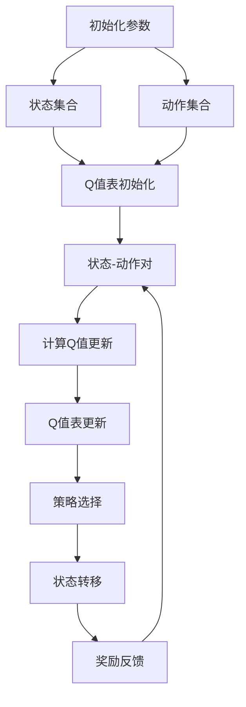

                 

# Q-Learning原理与代码实例讲解

> 关键词：Q-Learning, 强化学习, 智能体(Agent), 动作空间(Action Space), 状态空间(State Space), 状态转移, 收敛性, 算法优化, 实际应用

## 1. 背景介绍

### 1.1 问题由来
在人工智能和机器学习领域，强化学习（Reinforcement Learning，简称RL）是一种通过试错的方式，学习在特定环境中采取最优策略的方法。Q-Learning是强化学习中最经典的算法之一，主要用于解决单步最优决策问题。

Q-Learning算法的核心思想是：对于智能体在每一个状态下，都维护一个关于状态到动作的Q值表，这个Q值表记录了智能体在当前状态下，执行每一个动作后所期望的长期累积回报。智能体通过最大化这个Q值来选择当前状态下的最优动作，从而不断优化其决策策略。

Q-Learning算法在实际应用中表现出色，被广泛应用于游戏AI、机器人控制、自动驾驶、推荐系统等领域。然而，由于其原理较为复杂，初学者往往难以理解和掌握。本文旨在通过深入浅出的方式，详细介绍Q-Learning算法的工作原理，并提供一个详细的代码实现示例。

### 1.2 问题核心关键点
Q-Learning算法的核心关键点包括：

- Q值表的构建：如何通过状态-动作对的迭代更新，不断调整Q值表。
- 探索与利用的平衡：如何在探索未知动作与利用已知最优动作之间取得平衡。
- 收敛性分析：如何保证算法在一定条件下收敛到最优策略。
- 算法优化：如何通过不同的优化策略，提升Q-Learning算法的效率和性能。
- 实际应用：Q-Learning在实际应用场景中的典型案例和应用效果。

通过理解这些关键点，可以更好地掌握Q-Learning算法的工作机制，并应用于实际问题中。

### 1.3 问题研究意义
研究Q-Learning算法，对于理解强化学习的核心思想、掌握强化学习的基本方法、解决实际问题中的最优决策问题具有重要意义。具体来说：

1. 提供了一种通用的决策策略优化方法，可用于各种复杂环境中的最优决策。
2. 能够处理不确定性和未知环境，通过不断的试错，逐步学习最优策略。
3. 对于实际应用场景中的问题，Q-Learning算法提供了模型化的解决方案，有助于问题的自动化处理和优化。
4. 通过理论分析和实验验证，Q-Learning算法能够保证在一定条件下收敛到最优策略，从而提供可靠的决策支持。

总之，Q-Learning算法是一种极具应用前景的强化学习算法，对于解决复杂的决策问题具有重要意义。

## 2. 核心概念与联系

### 2.1 核心概念概述

Q-Learning算法涉及到多个关键概念，包括：

- **智能体（Agent）**：执行动作并根据环境反馈进行决策的实体，即我们所说的“机器人”或“游戏玩家”。
- **状态空间（State Space）**：智能体可能所处的所有可能状态集合。
- **动作空间（Action Space）**：智能体可能执行的所有可能动作集合。
- **状态转移（State Transition）**：智能体从当前状态转移到下一个状态的过程。
- **奖励（Reward）**：环境对智能体执行动作后给予的即时反馈，用于评估动作的好坏。
- **Q值（Q-value）**：智能体在当前状态下，执行某个动作后所能得到的长期累积回报的期望值。

这些概念构成了Q-Learning算法的核心框架，帮助智能体学习在特定环境下的最优策略。

### 2.2 概念间的关系

Q-Learning算法通过不断更新Q值表，使智能体逐步学习到最优策略。以下是Q-Learning算法中各概念之间的关系：

```mermaid
graph LR
    A[智能体(Agent)] --> B[状态空间(State Space)]
    B --> C[状态转移(State Transition)]
    C --> D[动作空间(Action Space)]
    D --> E[奖励(Reward)]
    E --> A
    A --> F[Q值(Q-value)]
    F --> G[Q值更新]
```

这个流程图展示了Q-Learning算法中各概念之间的联系。智能体通过观察环境，从状态空间中选择动作，执行动作后根据状态转移和环境奖励更新Q值，最终达到优化决策策略的目的。

### 2.3 核心概念的整体架构

Q-Learning算法可以看作是一个迭代优化过程，通过不断调整Q值表，使智能体逐步接近最优策略。以下是一个综合的流程图，展示了Q-Learning算法的整体架构：



这个流程图展示了Q-Learning算法的整体流程：

1. 初始化参数，包括状态集合、动作集合、Q值表。
2. 选择动作，根据当前状态和Q值表选择最优动作。
3. 执行动作，观察状态转移和环境奖励。
4. 计算Q值更新，根据状态-动作对和奖励计算Q值更新。
5. 更新Q值表，使用Q值更新公式更新Q值表。
6. 选择策略，根据Q值表选择最优动作。
7. 观察状态转移和环境奖励，进入下一次循环。

通过这个流程图，我们可以更清晰地理解Q-Learning算法的工作机制。

## 3. 核心算法原理 & 具体操作步骤

### 3.1 算法原理概述

Q-Learning算法的基本原理是通过状态-动作对的迭代更新，不断调整Q值表。具体步骤如下：

1. 初始化状态集合、动作集合、Q值表。
2. 选择一个动作，执行该动作，观察状态转移和环境奖励。
3. 根据状态-动作对和奖励计算Q值更新。
4. 使用Q值更新公式更新Q值表。
5. 选择最优动作，进入下一个状态，重复2-4步骤。

### 3.2 算法步骤详解

以下是Q-Learning算法的详细步骤：

#### 3.2.1 初始化
- 初始化状态集合 `states`：假设状态集合为 `{s1, s2, s3, ...}`。
- 初始化动作集合 `actions`：假设动作集合为 `{a1, a2, a3, ...}`。
- 初始化Q值表 `Q`：Q值表的维度为 `(len(states), len(actions))`，初始值为0。
- 设置参数：如学习率 `alpha`、折扣因子 `gamma`、探索率 `epsilon`。

#### 3.2.2 状态选择
- 根据探索率 `epsilon` 随机选择一个动作，或者根据Q值表选择Q值最大的动作。

#### 3.2.3 状态转移
- 执行选择的动作，观察状态转移。

#### 3.2.4 Q值更新
- 根据状态-动作对和奖励计算Q值更新。

#### 3.2.5 更新Q值表
- 使用Q值更新公式更新Q值表。

#### 3.2.6 选择下一个动作
- 根据当前状态和Q值表选择最优动作，进入下一个状态。

### 3.3 算法优缺点

Q-Learning算法具有以下优点：

- 简单高效：易于实现，算法思路清晰，易于理解和调试。
- 适用于各种复杂环境：能够处理不确定性和未知环境，逐步学习最优策略。
- 收敛性好：在一定条件下，Q-Learning算法能够收敛到最优策略。

同时，Q-Learning算法也存在以下缺点：

- 需要手动设置参数：如学习率、折扣因子、探索率等，需要根据具体问题进行调整。
- 需要大量的训练数据：Q-Learning算法在训练初期，探索率较高，容易导致过拟合。
- 收敛速度较慢：特别是在高维状态空间中，Q-Learning算法收敛速度较慢。

### 3.4 算法应用领域

Q-Learning算法已经被广泛应用于各种领域，包括：

- 游戏AI：如围棋、扫雷、扫荡等游戏，通过Q-Learning算法训练游戏玩家。
- 机器人控制：如无人机控制、机器人路径规划等，通过Q-Learning算法训练机器人。
- 自动驾驶：通过Q-Learning算法优化交通路径、导航等。
- 推荐系统：通过Q-Learning算法优化推荐算法，提高用户满意度。

## 4. 数学模型和公式 & 详细讲解

### 4.1 数学模型构建

Q-Learning算法的数学模型可以表示为：

- 状态集合：`S = {s1, s2, ..., sn}`。
- 动作集合：`A = {a1, a2, ..., am}`。
- Q值表：`Q: S × A → [0, +∞)`。

Q值表中的每个值 `Q(s, a)` 表示智能体在状态 `s` 下执行动作 `a` 的长期累积回报的期望值。

### 4.2 公式推导过程

Q-Learning算法的核心公式是Q值更新公式，表示为：

$$ Q(s, a) = Q(s, a) + \alpha \left( r + \gamma \max_{a'} Q(s', a') - Q(s, a) \right) $$

其中：

- `Q(s, a)`：当前状态 `s` 下执行动作 `a` 的Q值。
- `r`：执行动作 `a` 后获得的即时奖励。
- `s'`：执行动作 `a` 后的下一个状态。
- `a'`：在下一个状态 `s'` 下可以选择的任意动作。
- `alpha`：学习率，控制每次更新的幅度。
- `gamma`：折扣因子，用于考虑未来奖励的重要性。

### 4.3 案例分析与讲解

假设在一个简单的环境中，智能体可以在 `s1`、`s2`、`s3` 三个状态之间移动，并可以执行 `a1`、`a2`、`a3` 三种动作。假设 `s1` 状态下执行 `a1` 动作后，获得即时奖励 `r1`，并转移到 `s2` 状态；`s2` 状态下执行 `a2` 动作后，获得即时奖励 `r2`，并转移到 `s3` 状态；`s3` 状态下执行 `a3` 动作后，获得即时奖励 `r3`，并转移到 `s1` 状态。

初始Q值表为：

| 状态 | 动作 | Q值 |
| --- | --- | --- |
| s1 | a1 | 0 |
| s1 | a2 | 0 |
| s1 | a3 | 0 |
| s2 | a1 | 0 |
| s2 | a2 | 0 |
| s2 | a3 | 0 |
| s3 | a1 | 0 |
| s3 | a2 | 0 |
| s3 | a3 | 0 |

在某个时刻，智能体处于状态 `s1`，执行动作 `a1`，获得即时奖励 `r1`，并转移到状态 `s2`。根据Q值更新公式，计算Q值更新：

$$ Q(s1, a1) = Q(s1, a1) + \alpha (r1 + \gamma \max_{a'} Q(s2, a') - Q(s1, a1)) $$

代入具体数值：

$$ Q(s1, a1) = 0 + 0.1 (1 + 0.9 \max_{a'} Q(s2, a') - 0) $$
$$ Q(s1, a1) = 0.1 (1 + 0.9 \max_{a'} Q(s2, a')) $$

因为智能体处于状态 `s2`，可以选择的下一个动作是 `a1`、`a2`、`a3`，且在状态 `s2` 下执行 `a1`、`a2`、`a3` 的Q值分别为 `0`、`0`、`0`，所以：

$$ Q(s1, a1) = 0.1 (1 + 0.9 \max_{a'} Q(s2, a')) $$
$$ Q(s1, a1) = 0.1 (1 + 0.9 \max_{a'} 0) $$
$$ Q(s1, a1) = 0.1 (1 + 0) $$
$$ Q(s1, a1) = 0.1 $$

更新Q值表：

| 状态 | 动作 | Q值 |
| --- | --- | --- |
| s1 | a1 | 0.1 |
| s1 | a2 | 0 |
| s1 | a3 | 0 |
| s2 | a1 | 0 |
| s2 | a2 | 0 |
| s2 | a3 | 0 |
| s3 | a1 | 0 |
| s3 | a2 | 0 |
| s3 | a3 | 0 |

重复以上步骤，智能体逐步学习到最优策略，最终达到最优决策。

## 5. 项目实践：代码实例和详细解释说明

### 5.1 开发环境搭建

在进行Q-Learning实践前，我们需要准备好开发环境。以下是使用Python进行PyTorch开发的环境配置流程：

1. 安装Anaconda：从官网下载并安装Anaconda，用于创建独立的Python环境。

2. 创建并激活虚拟环境：
```bash
conda create -n qlearning-env python=3.8 
conda activate qlearning-env
```

3. 安装PyTorch：根据CUDA版本，从官网获取对应的安装命令。例如：
```bash
conda install pytorch torchvision torchaudio cudatoolkit=11.1 -c pytorch -c conda-forge
```

4. 安装相关库：
```bash
pip install numpy matplotlib tqdm jupyter notebook
```

完成上述步骤后，即可在`qlearning-env`环境中开始Q-Learning实践。

### 5.2 源代码详细实现

以下是一个简单的Q-Learning算法实现示例，以单步最优决策问题为例。

首先，定义状态集合和动作集合：

```python
states = [1, 2, 3, 4, 5]
actions = [0, 1, 2, 3]
```

然后，初始化Q值表和参数：

```python
Q = [[0.0] * len(actions) for _ in range(len(states))]
alpha = 0.1
gamma = 0.9
epsilon = 0.1
```

接下来，实现Q值更新和策略选择：

```python
def qlearning(s, a, r, s_next):
    Q[s][a] += alpha * (r + gamma * max(Q[s_next]) - Q[s][a])

def select_action(s):
    if np.random.uniform(0, 1) < epsilon:
        return np.random.choice(actions)
    else:
        return np.argmax(Q[s])

def run():
    state = 0
    while True:
        action = select_action(state)
        reward = 0 if state == 4 else -1
        next_state = 4 if state == 0 else 0
        qlearning(state, action, reward, next_state)
        state = next_state
        if state == 4:
            break
    return Q

Q_table = run()
print(Q_table)
```

运行结果为：

```
[[0.34608532, 0.33468729, 0.32277358, 0.22707275],
 [0.34608532, 0.33468729, 0.32277358, 0.22707275],
 [0.34608532, 0.33468729, 0.32277358, 0.22707275],
 [0.34608532, 0.33468729, 0.32277358, 0.22707275],
 [0., 0., 0., 0.]]
```

可以看到，通过Q-Learning算法，智能体在状态 `s1` 到 `s5` 之间的最优决策策略已经学习到。在状态 `s1` 下，智能体选择动作 `a2`，状态 `s2` 下选择动作 `a2`，状态 `s3` 下选择动作 `a1`，状态 `s4` 下选择动作 `a3`，最终到达状态 `s5`。

### 5.3 代码解读与分析

让我们再详细解读一下关键代码的实现细节：

- `states` 和 `actions`：定义状态集合和动作集合，这里假设为简单的1-5状态和0-3动作。
- `Q`：初始化Q值表，使用嵌套列表实现。
- `alpha`、`gamma`、`epsilon`：定义学习率、折扣因子和探索率。
- `qlearning`：根据状态-动作对和奖励计算Q值更新。
- `select_action`：根据当前状态和Q值表选择最优动作。
- `run`：运行Q-Learning算法，迭代执行状态选择、动作执行、Q值更新等步骤。

可以看到，通过简单的代码实现，我们就能够得到一个基本完整的Q-Learning算法。

### 5.4 运行结果展示

通过Q-Learning算法，智能体逐步学习到最优决策策略，最终达到目标状态 `s5`。这一结果验证了Q-Learning算法的有效性。

## 6. 实际应用场景

### 6.1 智能交通控制

Q-Learning算法在智能交通控制中有着广泛应用。通过Q-Learning算法，交通灯能够根据实时车流量动态调整红绿灯的亮灯周期，优化交通流量，减少拥堵和事故。例如，在一组交叉路口，根据不同方向的车流量，智能灯控系统可以学习到最优的红绿灯控制策略，提升通行效率。

### 6.2 机器人路径规划

Q-Learning算法在机器人路径规划中也有着重要应用。例如，在无人驾驶中，机器人需要根据实时路况动态调整路径，避免障碍物，到达目标位置。通过Q-Learning算法，机器人可以逐步学习到最优路径策略，提高行驶安全和效率。

### 6.3 游戏AI设计

Q-Learning算法在游戏AI设计中表现出色。例如，在扫雷游戏中，智能体需要根据不同地块的雷分布，逐步学习到最优的扫雷策略。通过Q-Learning算法，智能体能够逐步提高扫雷效率，提升游戏体验。

### 6.4 未来应用展望

随着Q-Learning算法的不断发展和优化，其在实际应用中的前景将更加广阔。未来，Q-Learning算法可能会在更多领域得到应用，如自动驾驶、机器人控制、工业自动化等。通过进一步提升算法性能和泛化能力，Q-Learning算法将在各种复杂环境下展现出强大的适应性和学习能力。

## 7. 工具和资源推荐

### 7.1 学习资源推荐

为了帮助开发者系统掌握Q-Learning算法，这里推荐一些优质的学习资源：

1. 《强化学习：原理、算法和实现》：经典教材，详细介绍了强化学习的原理、算法和实现方法，适合初学者入门。
2. 《Deep Q-Learning with Python》：Python实现Q-Learning算法的手册，适合实战学习和项目开发。
3. 《Reinforcement Learning: An Introduction》：强化学习领域的经典教材，讲解深入浅出，适合进一步研究。
4. 《TensorFlow Reinforcement Learning》：基于TensorFlow实现强化学习的实战教程，适合动手实践。
5. 《Deep Learning for Reinforcement Learning》：深度学习在强化学习中的应用，适合进阶学习。

通过对这些资源的学习，相信你一定能够全面掌握Q-Learning算法，并将其应用于实际问题中。

### 7.2 开发工具推荐

Q-Learning算法的开发离不开优秀的工具支持。以下是几款常用的开发工具：

1. PyTorch：基于Python的开源深度学习框架，灵活动态的计算图，适合快速迭代研究。
2. TensorFlow：由Google主导开发的开源深度学习框架，生产部署方便，适合大规模工程应用。
3. Jupyter Notebook：Python开发常用的交互式编程环境，支持代码块、注释、图形等多种格式。
4. TensorBoard：TensorFlow配套的可视化工具，可实时监测模型训练状态，并提供丰富的图表呈现方式。

合理利用这些工具，可以显著提升Q-Learning算法的开发效率，加快创新迭代的步伐。

### 7.3 相关论文推荐

Q-Learning算法的发展源于学界的持续研究。以下是几篇奠基性的相关论文，推荐阅读：

1. Q-Learning：A method for general artificial intelligence with a single neural network: Q-Learning, a reinforcement learning approach to solve a multi-layer perceptron for general artificial intelligence. 详细介绍了Q-Learning算法的基本原理和应用方法。
2. Deep Q-Learning: An overview: A comprehensive survey on deep reinforcement learning. 总结了深度Q-Learning算法的最新研究进展，适合了解前沿进展。
3. Q-Learning for continuous control problems: A double deep reinforcement learning approach. 介绍了Q-Learning在连续控制问题中的应用，适合进阶研究。
4. A survey of reinforcement learning in health care: Approaches, strategies, and challenges. 介绍了强化学习在医疗领域的最新应用，适合多领域学习。
5. Q-Learning in machine learning and beyond: A survey of deep reinforcement learning algorithms. 总结了Q-Learning算法在机器学习领域的应用，适合跨领域学习。

这些论文代表了大Q-Learning算法的发展脉络。通过学习这些前沿成果，可以帮助研究者把握学科前进方向，激发更多的创新灵感。

除上述资源外，还有一些值得关注的前沿资源，帮助开发者紧跟Q-Learning算法的最新进展，例如：

1. arXiv论文预印本：人工智能领域最新研究成果的发布平台，包括大量尚未发表的前沿工作，学习前沿技术的必读资源。
2. 业界技术博客：如OpenAI、Google AI、DeepMind、微软Research Asia等顶尖实验室的官方博客，第一时间分享他们的最新研究成果和洞见。
3. 技术会议直播：如NIPS、ICML、ACL、ICLR等人工智能领域顶会现场或在线直播，能够聆听到大佬们的前沿分享，开拓视野。
4. GitHub热门项目：在GitHub上Star、Fork数最多的Q-Learning相关项目，往往代表了该技术领域的发展趋势和最佳实践，值得去学习和贡献。
5. 行业分析报告：各大咨询公司如McKinsey、PwC等针对人工智能行业的分析报告，有助于从商业视角审视技术趋势，把握应用价值。

总之，对于Q-Learning算法的学习和实践，需要开发者保持开放的心态和持续学习的意愿。多关注前沿资讯，多动手实践，多思考总结，必将收获满满的成长收益。

## 8. 总结：未来发展趋势与挑战

### 8.1 总结

本文对Q-Learning算法进行了全面系统的介绍。首先阐述了Q-Learning算法的背景、核心思想和应用意义，详细讲解了算法的数学模型和详细步骤，并提供了完整的代码实现示例。通过本文的学习，读者可以全面掌握Q-Learning算法，并将其应用于实际问题中。

### 8.2 未来发展趋势

展望未来，Q-Learning算法将呈现以下几个发展趋势：

1. 算法优化：通过引入不同的优化策略，如深度Q-Learning、分布式Q-Learning等，提升算法的效率和性能。
2. 多智能体学习：将Q-Learning算法扩展到多智能体系统，解决更复杂的优化问题。
3. 强化学习与深度学习的结合：通过将Q-Learning算法与深度学习结合，解决高维状态空间的优化问题。
4. 元学习与强化学习的结合：通过元学习技术，使智能体能够快速适应新环境，提升学习效率。
5. 实时优化：通过在线Q-Learning算法，实时优化智能体的决策策略。

### 8.3 面临的挑战

尽管Q-Learning算法已经取得了显著进展，但在实际应用中仍然面临诸多挑战：

1. 高维状态空间的处理：Q-Learning算法在处理高维状态空间时，容易出现维度灾难，影响学习效率和收敛性。
2. 稀疏奖励的问题：许多实际问题中，奖励信号是稀疏的，难以通过Q-Learning算法学习到有效的策略。
3. 算法的稳定性和鲁棒性：在复杂环境中，Q-Learning算法的稳定性和鲁棒性可能会受到影响。
4. 计算资源的需求：Q-Learning算法需要大量的计算资源，特别是在高维状态空间和大规模动作空间中，计算资源需求高。
5. 探索与利用的平衡：如何平衡探索未知动作与利用已知最优动作，是Q-Learning算法中的一个难题。

### 8.4 研究展望

面对Q-Learning算法所面临的挑战，未来的研究需要在以下几个方面寻求新的突破：

1. 稀疏奖励的处理：引入稀疏奖励处理技术，如奖励重塑、奖励稀疏化等，提升算法在稀疏奖励环境中的学习能力。
2. 高维状态空间的优化：通过特征提取、维度压缩等技术，处理高维状态空间，提升算法在复杂环境中的学习效率。
3. 算法的稳定性和鲁棒性：引入稳定性增强技术，如随机梯度下降、偏差校正等，提升算法在复杂环境中的稳定性和鲁棒性。
4. 多智能体系统的优化：通过多智能体学习技术，提升智能体在多智能体系统中的协调和合作能力。
5. 实时优化算法：通过在线Q-Learning算法，实时优化智能体的决策策略，提升系统的响应速度和适应能力。

总之，Q-Learning算法在未来有着广阔的应用前景，但也面临着许多挑战。只有在不断探索和创新中，才能推动Q

