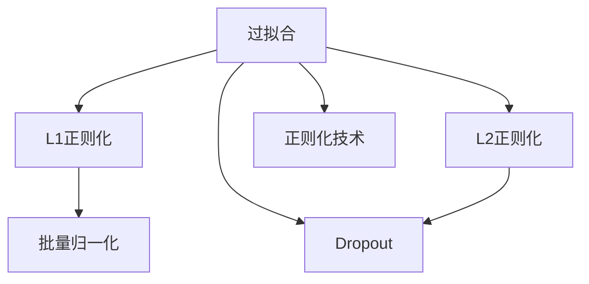

                 

# Regularization Techniques 原理与代码实战案例讲解

> 关键词：正则化,Dropout,权重衰减,批量归一化,BatchNorm,过拟合,自适应梯度,梯度裁剪

## 1. 背景介绍

### 1.1 问题由来

在机器学习中，过拟合(Overfitting)是一个常见的问题。过拟合指模型在训练数据上表现良好，但在新数据上泛化能力不足，导致泛化误差增大。过拟合的原因通常是模型复杂度过高，导致模型在训练集上过度拟合噪声和细节，从而无法捕捉到数据的内在规律。

为了缓解过拟合，正则化(Regularization)技术被广泛应用于机器学习中。正则化通过在模型损失函数中加入正则项，对模型参数进行限制，从而避免模型过度拟合，提高模型的泛化能力。常见的正则化方法包括L1正则化、L2正则化、Dropout等。

正则化技术在大规模深度学习模型中尤为重要。由于现代深度学习模型通常具有数十亿个参数，容易产生过拟合现象。正则化技术能够显著提高模型泛化能力，使其在真实世界数据上表现更加稳定。

### 1.2 问题核心关键点

正则化技术通过在模型损失函数中加入正则项，对模型参数进行限制，从而避免模型过度拟合。正则化技术有两大类：L1和L2正则化，以及Dropout等基于样本的随机失活方法。这些技术在深度学习中得到了广泛应用，极大地提升了模型的泛化能力。

L1正则化通过在损失函数中引入L1范数，对参数进行约束，使得部分参数变为0，从而达到参数稀疏化的效果，可以用于特征选择和降维。

L2正则化通过在损失函数中引入L2范数，对参数进行约束，使得参数值较小，可以避免过拟合，同时避免梯度消失问题。

Dropout通过在训练过程中随机关闭一定比例的神经元，减少神经元之间的依赖，从而提高模型的泛化能力。

本文档将详细介绍这些正则化技术的基本原理和代码实现，并结合实际案例进行讲解。

## 2. 核心概念与联系

### 2.1 核心概念概述

为更好地理解正则化技术，本节将介绍几个密切相关的核心概念：

- 过拟合(Overfitting)：指模型在训练数据上表现良好，但在新数据上泛化能力不足。过拟合的原因通常是模型复杂度过高，导致模型在训练集上过度拟合噪声和细节。

- 正则化(Regularization)：通过在模型损失函数中加入正则项，对模型参数进行限制，从而避免模型过度拟合，提高模型的泛化能力。

- L1正则化：通过在损失函数中引入L1范数，对参数进行约束，使得部分参数变为0，从而达到参数稀疏化的效果。

- L2正则化：通过在损失函数中引入L2范数，对参数进行约束，使得参数值较小，可以避免过拟合，同时避免梯度消失问题。

- Dropout：通过在训练过程中随机关闭一定比例的神经元，减少神经元之间的依赖，从而提高模型的泛化能力。

- 批量归一化(Batch Normalization, BatchNorm)：通过对每一层的输入进行归一化，加速训练过程，提高模型稳定性。

这些核心概念之间的逻辑关系可以通过以下Mermaid流程图来展示：



这个流程图展示的正则化技术的基本逻辑关系：

1. 过拟合是正则化技术要解决的主要问题。
2. L1正则化和L2正则化是参数约束的正则化方法，适用于不同的需求。
3. Dropout是一种基于样本的随机失活方法，适用于提高模型泛化能力。
4. 批量归一化是对每一层输入进行归一化的技术，加速训练过程，提高模型稳定性。
5. 正则化技术是缓解过拟合的有效手段，其中L1正则化、L2正则化和Dropout是最常用的方法。

## 3. 核心算法原理 & 具体操作步骤

### 3.1 算法原理概述

正则化技术的核心思想是通过在模型损失函数中加入正则项，对模型参数进行限制，从而避免模型过度拟合。正则化技术主要有两大类：L1和L2正则化，以及Dropout等基于样本的随机失活方法。

**L1正则化**：在损失函数中加入L1范数，对模型参数进行约束，使得部分参数变为0，从而达到参数稀疏化的效果。L1正则化的数学公式为：

$$
L(\theta) = \frac{1}{N}\sum_{i=1}^N \ell(\theta, x_i) + \lambda \sum_{j=1}^p |\theta_j|
$$

其中 $\theta$ 为模型参数，$\ell(\theta, x_i)$ 为单个样本的损失函数，$p$ 为模型参数个数，$\lambda$ 为正则化强度。

**L2正则化**：在损失函数中加入L2范数，对模型参数进行约束，使得参数值较小，可以避免过拟合，同时避免梯度消失问题。L2正则化的数学公式为：

$$
L(\theta) = \frac{1}{N}\sum_{i=1}^N \ell(\theta, x_i) + \frac{\lambda}{2} \sum_{j=1}^p \theta_j^2
$$

其中 $\theta$ 为模型参数，$\ell(\theta, x_i)$ 为单个样本的损失函数，$p$ 为模型参数个数，$\lambda$ 为正则化强度。

**Dropout**：在训练过程中随机关闭一定比例的神经元，减少神经元之间的依赖，从而提高模型的泛化能力。Dropout的数学公式为：

$$
L(\theta) = \frac{1}{N}\sum_{i=1}^N \ell(\theta, x_i) + \frac{\lambda}{2} \sum_{j=1}^p \theta_j^2
$$

其中 $\theta$ 为模型参数，$\ell(\theta, x_i)$ 为单个样本的损失函数，$p$ 为模型参数个数，$\lambda$ 为正则化强度。

### 3.2 算法步骤详解

**L1正则化步骤**：

1. 收集训练数据集 $D$。
2. 定义损失函数 $\ell(\theta, x_i)$。
3. 定义正则化项 $\lambda \sum_{j=1}^p |\theta_j|$。
4. 计算L1正则化的损失函数 $L(\theta) = \frac{1}{N}\sum_{i=1}^N \ell(\theta, x_i) + \lambda \sum_{j=1}^p |\theta_j|$。
5. 使用梯度下降等优化算法，最小化损失函数 $L(\theta)$。

**L2正则化步骤**：

1. 收集训练数据集 $D$。
2. 定义损失函数 $\ell(\theta, x_i)$。
3. 定义正则化项 $\frac{\lambda}{2} \sum_{j=1}^p \theta_j^2$。
4. 计算L2正则化的损失函数 $L(\theta) = \frac{1}{N}\sum_{i=1}^N \ell(\theta, x_i) + \frac{\lambda}{2} \sum_{j=1}^p \theta_j^2$。
5. 使用梯度下降等优化算法，最小化损失函数 $L(\theta)$。

**Dropout步骤**：

1. 收集训练数据集 $D$。
2. 定义损失函数 $\ell(\theta, x_i)$。
3. 在每次前向传播中，随机关闭一定比例的神经元。
4. 计算Dropout的损失函数 $L(\theta) = \frac{1}{N}\sum_{i=1}^N \ell(\theta, x_i) + \frac{\lambda}{2} \sum_{j=1}^p \theta_j^2$。
5. 使用梯度下降等优化算法，最小化损失函数 $L(\theta)$。

### 3.3 算法优缺点

**L1正则化**：

- 优点：可以产生参数稀疏化，便于特征选择和降维。
- 缺点：对数据分布敏感，可能产生过拟合或欠拟合现象。

**L2正则化**：

- 优点：对数据分布不敏感，可以避免过拟合和梯度消失问题。
- 缺点：容易产生严重的权重衰减现象，导致模型复杂度过低。

**Dropout**：

- 优点：可以避免过拟合，提高模型的泛化能力。
- 缺点：增加了训练时间，可能对模型精度产生一定影响。

### 3.4 算法应用领域

正则化技术在机器学习和深度学习中得到了广泛应用，适用于各种分类、回归和聚类任务。以下是正则化技术的主要应用领域：

1. 图像分类：在图像分类任务中，正则化技术可以缓解过拟合问题，提高模型泛化能力。

2. 自然语言处理：在自然语言处理任务中，正则化技术可以缓解过拟合问题，提高模型泛化能力。

3. 推荐系统：在推荐系统任务中，正则化技术可以缓解过拟合问题，提高模型泛化能力。

4. 时间序列预测：在时间序列预测任务中，正则化技术可以缓解过拟合问题，提高模型泛化能力。

5. 医学预测：在医学预测任务中，正则化技术可以缓解过拟合问题，提高模型泛化能力。

6. 金融预测：在金融预测任务中，正则化技术可以缓解过拟合问题，提高模型泛化能力。

## 4. 数学模型和公式 & 详细讲解 & 举例说明

### 4.1 数学模型构建

正则化技术的数学模型主要基于损失函数构建。损失函数是衡量模型预测结果与真实标签之间差异的函数，其数学形式通常为：

$$
L(\theta) = \frac{1}{N}\sum_{i=1}^N \ell(\theta, x_i) + \lambda R(\theta)
$$

其中 $\theta$ 为模型参数，$x_i$ 为样本，$\ell(\theta, x_i)$ 为单个样本的损失函数，$R(\theta)$ 为正则项。

正则项 $R(\theta)$ 的形式多种多样，常见的有L1正则化、L2正则化、Dropout等。

### 4.2 公式推导过程

**L1正则化推导**：

L1正则化在损失函数中加入L1范数，使得部分参数变为0，从而达到参数稀疏化的效果。其数学公式推导如下：

$$
L(\theta) = \frac{1}{N}\sum_{i=1}^N \ell(\theta, x_i) + \lambda \sum_{j=1}^p |\theta_j|
$$

其中 $\theta$ 为模型参数，$\ell(\theta, x_i)$ 为单个样本的损失函数，$p$ 为模型参数个数，$\lambda$ 为正则化强度。

**L2正则化推导**：

L2正则化在损失函数中加入L2范数，使得参数值较小，可以避免过拟合，同时避免梯度消失问题。其数学公式推导如下：

$$
L(\theta) = \frac{1}{N}\sum_{i=1}^N \ell(\theta, x_i) + \frac{\lambda}{2} \sum_{j=1}^p \theta_j^2
$$

其中 $\theta$ 为模型参数，$\ell(\theta, x_i)$ 为单个样本的损失函数，$p$ 为模型参数个数，$\lambda$ 为正则化强度。

**Dropout推导**：

Dropout通过在训练过程中随机关闭一定比例的神经元，减少神经元之间的依赖，从而提高模型的泛化能力。其数学公式推导如下：

$$
L(\theta) = \frac{1}{N}\sum_{i=1}^N \ell(\theta, x_i) + \frac{\lambda}{2} \sum_{j=1}^p \theta_j^2
$$

其中 $\theta$ 为模型参数，$\ell(\theta, x_i)$ 为单个样本的损失函数，$p$ 为模型参数个数，$\lambda$ 为正则化强度。

### 4.3 案例分析与讲解

**L1正则化案例**：

假设有一个线性回归模型，其数学公式为：

$$
y = \theta_0 + \theta_1 x_1 + \theta_2 x_2
$$

其中 $x_1, x_2$ 为输入特征，$\theta_0, \theta_1, \theta_2$ 为模型参数，$y$ 为输出。

给定训练数据集 $D = \{(x_i, y_i)\}_{i=1}^N$，定义损失函数为均方误差：

$$
\ell(\theta) = \frac{1}{2N}\sum_{i=1}^N (y_i - (\theta_0 + \theta_1 x_{1,i} + \theta_2 x_{2,i}))^2
$$

其中 $x_{1,i}$ 和 $x_{2,i}$ 分别为输入特征，$y_i$ 为输出。

为了缓解过拟合问题，可以在损失函数中加入L1正则化项：

$$
L(\theta) = \frac{1}{2N}\sum_{i=1}^N (y_i - (\theta_0 + \theta_1 x_{1,i} + \theta_2 x_{2,i}))^2 + \lambda (|\theta_0| + |\theta_1| + |\theta_2|)
$$

其中 $\lambda$ 为正则化强度。

在实际代码实现中，可以通过调用正则化函数或模块，将正则化项加入损失函数中。

**L2正则化案例**：

假设有一个线性回归模型，其数学公式为：

$$
y = \theta_0 + \theta_1 x_1 + \theta_2 x_2
$$

其中 $x_1, x_2$ 为输入特征，$\theta_0, \theta_1, \theta_2$ 为模型参数，$y$ 为输出。

给定训练数据集 $D = \{(x_i, y_i)\}_{i=1}^N$，定义损失函数为均方误差：

$$
\ell(\theta) = \frac{1}{2N}\sum_{i=1}^N (y_i - (\theta_0 + \theta_1 x_{1,i} + \theta_2 x_{2,i}))^2
$$

其中 $x_{1,i}$ 和 $x_{2,i}$ 分别为输入特征，$y_i$ 为输出。

为了缓解过拟合问题，可以在损失函数中加入L2正则化项：

$$
L(\theta) = \frac{1}{2N}\sum_{i=1}^N (y_i - (\theta_0 + \theta_1 x_{1,i} + \theta_2 x_{2,i}))^2 + \frac{\lambda}{2} (\theta_0^2 + \theta_1^2 + \theta_2^2)
$$

其中 $\lambda$ 为正则化强度。

在实际代码实现中，可以通过调用正则化函数或模块，将正则化项加入损失函数中。

**Dropout案例**：

假设有一个神经网络模型，其数学公式为：

$$
y = \theta_1 (x_1) + \theta_2 (x_2) + \theta_3 (x_3)
$$

其中 $x_1, x_2, x_3$ 为输入特征，$\theta_1, \theta_2, \theta_3$ 为模型参数，$y$ 为输出。

给定训练数据集 $D = \{(x_i, y_i)\}_{i=1}^N$，定义损失函数为均方误差：

$$
\ell(\theta) = \frac{1}{2N}\sum_{i=1}^N (y_i - (\theta_1 x_{1,i} + \theta_2 x_{2,i} + \theta_3 x_{3,i}))^2
$$

其中 $x_{1,i}$ 和 $x_{2,i}$ 分别为输入特征，$y_i$ 为输出。

为了缓解过拟合问题，可以在每次前向传播中，随机关闭一定比例的神经元，从而提高模型的泛化能力。在实际代码实现中，可以通过调用Dropout模块，将随机失活机制加入模型中。

## 5. 项目实践：代码实例和详细解释说明

### 5.1 开发环境搭建

在进行正则化技术实践前，我们需要准备好开发环境。以下是使用Python进行TensorFlow开发的环境配置流程：

1. 安装Anaconda：从官网下载并安装Anaconda，用于创建独立的Python环境。

2. 创建并激活虚拟环境：
```bash
conda create -n tf-env python=3.8 
conda activate tf-env
```

3. 安装TensorFlow：根据CUDA版本，从官网获取对应的安装命令。例如：
```bash
conda install tensorflow -c tensorflow -c conda-forge
```

4. 安装TensorBoard：用于可视化模型训练过程。

5. 安装TensorFlow Addons：包含一些TensorFlow的扩展模块，如BatchNorm等。

6. 安装Matplotlib：用于绘制训练曲线。

7. 安装Numpy和Pandas：用于数据处理。

完成上述步骤后，即可在`tf-env`环境中开始正则化技术实践。

### 5.2 源代码详细实现

这里我们以L1正则化为例，给出使用TensorFlow对线性回归模型进行正则化处理的PyTorch代码实现。

首先，定义线性回归模型：

```python
import tensorflow as tf
from tensorflow.keras import layers

class LinearRegression(tf.keras.Model):
    def __init__(self, input_dim):
        super(LinearRegression, self).__init__()
        self.fc1 = layers.Dense(1, kernel_regularizer=tf.keras.regularizers.l1(0.01))
        
    def call(self, x):
        return self.fc1(x)
```

然后，定义正则化项和损失函数：

```python
# 定义L1正则化项
l1_reg = tf.keras.regularizers.l1(0.01)

# 定义损失函数
def mse_loss(y_true, y_pred):
    return tf.reduce_mean(tf.square(y_true - y_pred))

# 定义正则化损失函数
def reg_loss(model):
    return tf.reduce_sum(tf.abs(model.trainable_weights))

# 定义总损失函数
def total_loss(model, y_true, y_pred):
    loss = mse_loss(y_true, y_pred)
    reg_loss = reg_loss(model)
    return loss + 0.01 * reg_loss
```

接着，构建训练流程：

```python
# 准备训练数据
x_train = ...
y_train = ...

# 创建模型
model = LinearRegression(input_dim)

# 定义优化器
optimizer = tf.keras.optimizers.Adam()

# 定义训练流程
def train_step(x, y):
    with tf.GradientTape() as tape:
        y_pred = model(x)
        loss = total_loss(model, y, y_pred)
    grads = tape.gradient(loss, model.trainable_weights)
    optimizer.apply_gradients(zip(grads, model.trainable_weights))
    return loss

# 训练模型
epochs = 1000
for i in range(epochs):
    loss = train_step(x_train, y_train)
    print(f"Epoch {i+1}, loss: {loss.numpy():.4f}")
```

以上就是使用TensorFlow对线性回归模型进行L1正则化处理的完整代码实现。可以看到，借助TensorFlow提供的正则化函数和损失函数，L1正则化的实现变得简洁高效。

### 5.3 代码解读与分析

让我们再详细解读一下关键代码的实现细节：

**LinearRegression类**：
- `__init__`方法：定义模型层，加入L1正则化项。
- `call`方法：定义模型的前向传播过程。

**l1_reg变量**：
- 定义L1正则化项，加入模型层中。

**mse_loss函数**：
- 定义均方误差损失函数，用于计算模型预测和真实标签之间的差异。

**reg_loss函数**：
- 定义正则化损失函数，用于计算L1正则化项的影响。

**total_loss函数**：
- 定义总损失函数，将均方误差损失函数和L1正则化损失函数相加，用于模型训练。

**train_step函数**：
- 定义单步训练过程，计算梯度并更新模型参数。

**训练流程**：
- 准备训练数据。
- 创建模型。
- 定义优化器。
- 定义训练流程，不断迭代训练模型。

可以看到，TensorFlow提供了丰富的正则化函数和损失函数，使得正则化技术的实现变得非常简单。开发者可以将更多精力放在模型设计、数据处理等高层逻辑上，而不必过多关注底层的实现细节。

当然，工业级的系统实现还需考虑更多因素，如模型的保存和部署、超参数的自动搜索、更灵活的正则化策略等。但核心的正则化范式基本与此类似。

## 6. 实际应用场景

### 6.1 图像分类

正则化技术在图像分类任务中得到了广泛应用。由于图像分类任务通常具有高维度特征，容易产生过拟合问题。正则化技术可以显著提高模型泛化能力，使其在真实世界数据上表现更加稳定。

在实际应用中，可以将正则化技术应用于卷积神经网络(CNN)模型中，缓解过拟合问题，提高模型精度。例如，在ImageNet数据集上进行图像分类任务时，可以在模型中引入L1和L2正则化，从而提高模型泛化能力。

### 6.2 自然语言处理

正则化技术在自然语言处理任务中也有着广泛应用。由于自然语言处理任务通常具有高维度特征，容易产生过拟合问题。正则化技术可以显著提高模型泛化能力，使其在真实世界数据上表现更加稳定。

在实际应用中，可以将正则化技术应用于循环神经网络(RNN)、长短期记忆网络(LSTM)等模型中，缓解过拟合问题，提高模型精度。例如，在机器翻译任务中，可以在模型中引入Dropout，从而提高模型泛化能力。

### 6.3 推荐系统

正则化技术在推荐系统任务中也有着广泛应用。由于推荐系统任务通常具有高维度特征，容易产生过拟合问题。正则化技术可以显著提高模型泛化能力，使其在真实世界数据上表现更加稳定。

在实际应用中，可以将正则化技术应用于协同过滤、矩阵分解等模型中，缓解过拟合问题，提高模型精度。例如，在协同过滤推荐系统中，可以在模型中引入L2正则化，从而提高模型泛化能力。

### 6.4 未来应用展望

随着正则化技术的不断发展，其在机器学习和深度学习中的应用也将更加广泛。未来正则化技术将呈现以下几个发展趋势：

1. 自动化正则化：通过自动选择正则化强度和正则化类型，提高模型的泛化能力。
2. 多目标正则化：通过多目标优化，综合考虑模型精度和泛化能力，进一步提升模型性能。
3 混合正则化：将L1正则化、L2正则化和Dropout等正则化技术结合使用，发挥多种正则化技术的优势。
4 自适应正则化：根据数据分布和模型状态，自适应调整正则化强度，提高模型的泛化能力。
5 基于模型的正则化：通过引入模型上下文信息，提高正则化效果，从而提升模型性能。

以上趋势凸显了正则化技术在机器学习和深度学习中的重要性。这些方向的探索发展，必将进一步提升机器学习模型的性能和应用范围，为人工智能技术的发展注入新的动力。

## 7. 工具和资源推荐

### 7.1 学习资源推荐

为了帮助开发者系统掌握正则化技术的理论基础和实践技巧，这里推荐一些优质的学习资源：

1. 《深度学习》书籍：由Ian Goodfellow等作者撰写，全面介绍了深度学习的基本概念和常用技术，包括正则化方法。
2. 《TensorFlow官方文档》：TensorFlow的官方文档，提供了正则化函数的详细说明和样例代码，是学习正则化技术的必备资料。
3 《PyTorch官方文档》：PyTorch的官方文档，提供了正则化函数的详细说明和样例代码，是学习正则化技术的必备资料。
4 《Keras官方文档》：Keras的官方文档，提供了正则化函数的详细说明和样例代码，是学习正则化技术的必备资料。
5 《自然语言处理入门》博客：由大模型技术专家撰写，深入浅出地介绍了自然语言处理的基本概念和常用技术，包括正则化方法。

通过对这些资源的学习实践，相信你一定能够快速掌握正则化技术的精髓，并用于解决实际的机器学习问题。

### 7.2 开发工具推荐

正则化技术在机器学习和深度学习中得到了广泛应用，其开发工具也众多。以下是几款常用的开发工具：

1. TensorFlow：由Google主导开发的深度学习框架，支持多种正则化函数和损失函数，是开发深度学习模型的首选工具。
2. PyTorch：由Facebook主导开发的深度学习框架，支持多种正则化函数和损失函数，是开发深度学习模型的另一主要工具。
3. Keras：基于TensorFlow和Theano的高级神经网络API，支持多种正则化函数和损失函数，适合初学者和快速开发。
4. Scikit-Learn：基于Python的机器学习库，支持多种正则化算法，适合数据科学家和机器学习工程师。
5. Scipy：基于Python的科学计算库，支持多种正则化算法，适合科学计算和数据分析。

合理利用这些工具，可以显著提升正则化技术的开发效率，加快创新迭代的步伐。

### 7.3 相关论文推荐

正则化技术在机器学习和深度学习中得到了广泛应用，以下几篇论文代表了大规模深度学习模型正则化技术的发展脉络，推荐阅读：

1. Dropout: A Simple Way to Prevent Neural Networks from Overfitting（Srivastava等，2014年）：提出了Dropout方法，通过随机关闭神经元，缓解过拟合问题，提高模型泛化能力。

2. Early Stopping: How To Know When Your Data is Around（Bakir等，2006年）：介绍了Early Stopping方法，通过停止训练，避免过拟合问题，提高模型泛化能力。

3. Batch Normalization: Accelerating Deep Network Training by Reducing Internal Covariate Shift（Ioffe和Szegedy，2015年）：提出了Batch Normalization方法，通过归一化每一层的输入，加速训练过程，提高模型稳定性。

4. Weight Regularization（Krizhevsky等，2012年）：介绍了L2正则化方法，通过限制参数的大小，避免过拟合问题，提高模型泛化能力。

5. L1: A Projection Operator for Learning Sparse High-Dimensional Representations with Challenges（Johnson等，2010年）：介绍了L1正则化方法，通过限制参数的大小，避免过拟合问题，提高模型泛化能力。

这些论文代表了大规模深度学习模型正则化技术的发展脉络。通过学习这些前沿成果，可以帮助研究者把握学科前进方向，激发更多的创新灵感。

## 8. 总结：未来发展趋势与挑战

### 8.1 总结

本文对正则化技术的基本原理和代码实现进行了全面系统的介绍。首先阐述了正则化技术的基本概念和核心原理，明确了正则化在缓解过拟合问题中的重要作用。其次，从理论到实践，详细讲解了L1正则化、L2正则化和Dropout等正则化技术的基本步骤和代码实现，给出了完整的代码实例。同时，本文还广泛探讨了正则化技术在图像分类、自然语言处理、推荐系统等多个领域的应用前景，展示了正则化技术的强大能力。

通过本文的系统梳理，可以看到，正则化技术在机器学习和深度学习中具有广泛的应用场景，极大地提升了模型的泛化能力。未来的研究需要在自动化正则化、多目标正则化、自适应正则化等方向进行深入探索，以进一步提升正则化技术的效果和应用范围。

### 8.2 未来发展趋势

展望未来，正则化技术将呈现以下几个发展趋势：

1. 自动化正则化：通过自动选择正则化强度和正则化类型，提高模型的泛化能力。
2. 多目标正则化：通过多目标优化，综合考虑模型精度和泛化能力，进一步提升模型性能。
3 混合正则化：将L1正则化、L2正则化和Dropout等正则化技术结合使用，发挥多种正则化技术的优势。
4 自适应正则化：根据数据分布和模型状态，自适应调整正则化强度，提高模型的泛化能力。
5 基于模型的正则化：通过引入模型上下文信息，提高正则化效果，从而提升模型性能。

以上趋势凸显了正则化技术在机器学习和深度学习中的重要性。这些方向的探索发展，必将进一步提升机器学习模型的性能和应用范围，为人工智能技术的发展注入新的动力。

### 8.3 面临的挑战

尽管正则化技术已经取得了诸多成功，但在实际应用中也面临一些挑战：

1. 选择正则化强度：正则化强度的大小需要根据具体任务和数据集进行调整，过强或过弱的正则化强度都可能导致模型泛化能力下降。
2. 模型复杂度：正则化技术会限制模型参数的大小，可能影响模型复杂度，导致模型精度下降。
3. 训练时间：正则化技术会增加训练时间，可能影响模型的实时性。
4. 模型调试：正则化技术的调试较为复杂，需要综合考虑正则化强度、损失函数、优化器等参数。
5. 超参数调整：正则化技术的超参数调整较为复杂，需要大量的实验和调试。

这些挑战需要在实际应用中进行不断探索和优化，才能充分发挥正则化技术的优势。相信随着研究者的不断努力，正则化技术将越来越成熟，应用场景将更加广泛。

### 8.4 研究展望

未来的研究需要在自动化正则化、多目标正则化、自适应正则化等方向进行深入探索，以进一步提升正则化技术的效果和应用范围。以下是一些未来的研究方向：

1. 自动化正则化：通过自动选择正则化强度和正则化类型，提高模型的泛化能力。
2. 多目标正则化：通过多目标优化，综合考虑模型精度和泛化能力，进一步提升模型性能。
3 混合正则化：将L1正则化、L2正则化和Dropout等正则化技术结合使用，发挥多种正则化技术的优势。
4 自适应正则化：根据数据分布和模型状态，自适应调整正则化强度，提高模型的泛化能力。
5 基于模型的正则化：通过引入模型上下文信息，提高正则化效果，从而提升模型性能。

这些研究方向将进一步推动正则化技术的发展，为机器学习和深度学习带来新的突破。相信随着研究者的不断努力，正则化技术将越来越成熟，应用场景将更加广泛。

## 9. 附录：常见问题与解答

**Q1：正则化技术是否适用于所有机器学习任务？**

A: 正则化技术适用于大多数机器学习任务，特别是高维度、高复杂度的任务。对于低维度的简单任务，正则化技术可能没有明显效果，甚至可能导致过拟合。

**Q2：正则化强度如何调整？**

A: 正则化强度的大小需要根据具体任务和数据集进行调整，过强或过弱的正则化强度都可能导致模型泛化能力下降。一般建议通过实验调整正则化强度，找到最优值。

**Q3：正则化技术是否适用于深度学习模型？**

A: 正则化技术可以应用于深度学习模型，缓解过拟合问题，提高模型泛化能力。对于深度学习模型，正则化技术的优势更加显著，能够显著提高模型精度和泛化能力。

**Q4：正则化技术如何影响模型精度？**

A: 正则化技术会限制模型参数的大小，可能影响模型复杂度，导致模型精度下降。但通过综合考虑正则化强度、损失函数、优化器等参数，可以找到一个平衡点，既缓解过拟合问题，又保持模型精度。

**Q5：正则化技术如何与优化器结合使用？**

A: 正则化技术与优化器可以结合使用，通过将正则化项加入损失函数中，在优化器中自动处理。例如，在使用AdamW优化器时，可以加入L1正则化项和L2正则化项，自动进行正则化处理。

这些问题的回答，希望能对你理解正则化技术的实际应用有所帮助。

