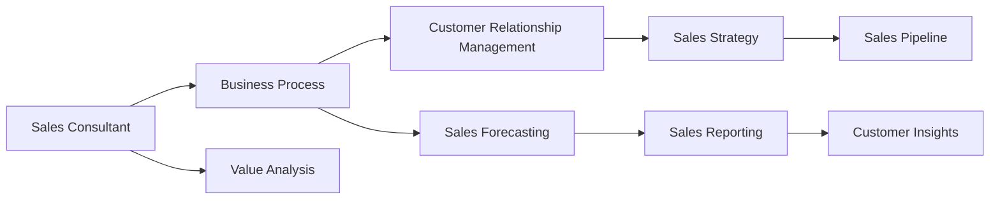

                 

# Sales-Consultant 业务流程与价值分析

> 关键词：Sales-Consultant, 业务流程, 价值分析, CRM, 客户关系管理, 销售策略, 客户满意度

## 1. 背景介绍

在现代商业环境中，销售顾问(Sales Consultant)的角色至关重要。他们不仅是公司与客户之间的桥梁，更是推动公司业务增长和市场扩展的关键力量。然而，要成为一名优秀的销售顾问，仅仅依靠天赋和经验是远远不够的。系统的业务流程和价值分析能力是支撑其工作的重要基础。本文将从业务流程与价值分析的视角，全面剖析销售顾问的角色和职责，并为读者提供一套实用的方法论。

### 1.1 问题由来

随着市场竞争的加剧和客户需求的日益多样化，销售顾问面临的挑战也日益复杂。客户期望的个性化和快速响应，要求销售顾问具备更强的信息处理能力和市场洞察力。与此同时，数据驱动决策的盛行，使得销售顾问需要利用先进的技术手段，对客户信息进行深入挖掘和分析，从而制定更有效的销售策略。然而，传统销售顾问往往缺乏系统的流程和分析方法，无法在数据海洋中迅速找到有效的洞察和决策依据。

本文旨在填补这一空白，通过深入剖析销售顾问的业务流程和价值分析能力，提供一套系统的实践指南。这不仅有助于提升销售顾问的个人能力，更能促进企业销售效率的提升和客户满意度的增加。

## 2. 核心概念与联系

### 2.1 核心概念概述

要全面理解销售顾问的业务流程与价值分析，首先需要明确几个关键概念：

- **Sales Consultant**：即销售顾问，负责挖掘客户需求，制定销售策略，达成销售目标，并对客户关系进行长期维护。

- **Business Process**：即业务流程，指将一系列工作活动或任务以特定顺序组织起来，形成规范化、高效化的工作流程。

- **Value Analysis**：即价值分析，指对业务流程中各项活动进行成本和收益分析，以优化流程，提升效率和效益。

- **CRM (Customer Relationship Management)**：即客户关系管理，指利用信息技术手段，系统化管理客户信息，提升客户满意度和忠诚度。

这些概念之间相互关联，共同构成了销售顾问工作的基础框架。理解这些概念的原理和联系，有助于我们系统化地分析销售顾问的工作流程和价值。

### 2.2 核心概念原理和架构的 Mermaid 流程图



## 3. 核心算法原理 & 具体操作步骤

### 3.1 算法原理概述

销售顾问的业务流程与价值分析，本质上是一种基于数据驱动的流程优化和管理优化。其核心思想是：通过收集、处理和分析销售活动中的各种数据，发现潜在的价值创造点，并通过系统化的方法对业务流程进行优化，提升销售效率和客户满意度。

在具体操作上，可以将销售顾问的业务流程划分为几个关键环节：客户获取、客户维护、客户转化和客户关系管理。每个环节都有其独特的价值创造点，需要通过数据驱动的方法进行分析和管理。

### 3.2 算法步骤详解

销售顾问的业务流程与价值分析，主要包括以下几个步骤：

**Step 1: 数据收集与整理**
- 利用CRM系统，收集客户的基本信息、历史购买记录、沟通记录等数据。
- 对数据进行清洗和整合，确保数据的质量和一致性。

**Step 2: 数据分析与挖掘**
- 对收集到的数据进行统计分析和趋势预测，识别客户行为模式。
- 利用机器学习等高级分析技术，挖掘客户需求和潜在商机。

**Step 3: 业务流程优化**
- 根据分析结果，优化销售顾问的日常工作流程，如客户跟进频率、沟通方式、销售策略等。
- 引入自动化工具，提升销售效率，减少人为错误。

**Step 4: 价值评估与决策**
- 对优化后的流程进行评估，计算各项活动的成本和收益。
- 根据评估结果，制定更加有效的销售策略和目标，提升整体销售业绩。

### 3.3 算法优缺点

销售顾问的业务流程与价值分析方法，具有以下优点：

1. **数据驱动**：通过系统的数据收集和分析，基于数据做出决策，提升决策的科学性和准确性。
2. **流程优化**：识别流程中的瓶颈和优化点，通过系统化的方法提升销售效率。
3. **客户洞察**：利用数据挖掘技术，深入理解客户需求和行为，制定更加个性化的销售策略。

同时，该方法也存在一定的局限性：

1. **数据质量依赖**：数据的质量和完整性直接影响分析结果，数据收集和清洗工作量大。
2. **技术门槛**：高级分析技术的应用需要较强的技术基础，对销售顾问的技术水平要求较高。
3. **复杂度高**：系统化的方法可能增加工作量，短期内可能难以看到明显效果。

尽管存在这些局限性，但该方法在提升销售顾问的业务水平和整体销售业绩方面，具有显著的优势。

### 3.4 算法应用领域

销售顾问的业务流程与价值分析方法，适用于各类企业和行业，包括但不限于：

- 快速消费品行业：通过分析客户购买记录，制定精准的促销策略。
- 金融服务行业：利用客户行为数据，优化贷款审批流程，提升客户满意度。
- 信息技术行业：通过客户需求分析，制定更符合客户需求的产品方案。
- 医疗健康行业：利用患者数据，优化就医流程，提升医疗服务质量。

## 4. 数学模型和公式 & 详细讲解 & 举例说明

### 4.1 数学模型构建

销售顾问的业务流程与价值分析，可以通过数学模型来描述和量化。以下是一个简单的数学模型构建示例：

- **输入变量**：客户基本信息、历史购买记录、沟通记录、市场环境等。
- **输出变量**：客户转化率、销售业绩、客户满意度等。
- **中间变量**：客户需求、销售策略、流程效率等。

数学模型的构建，通常需要以下几个步骤：

1. **定义变量**：明确输入变量、输出变量和中间变量的含义。
2. **建立方程**：根据业务逻辑，建立数学模型，通常为线性回归、逻辑回归等。
3. **求解模型**：利用统计学或机器学习方法，求解模型参数。
4. **模型评估**：利用测试数据，评估模型的准确性和鲁棒性。

### 4.2 公式推导过程

以客户转化率为目标变量，历史购买记录和沟通记录为输入变量，构建一个简单的回归模型：

$$ y = \beta_0 + \beta_1 x_1 + \beta_2 x_2 + \epsilon $$

其中，$y$ 表示客户转化率，$x_1$ 表示历史购买记录，$x_2$ 表示沟通记录，$\beta_0$ 和 $\beta_1$ 是回归系数，$\epsilon$ 是误差项。

根据最小二乘法，求解模型参数：

$$ \hat{\beta} = (X^TX)^{-1}X^Ty $$

其中，$X$ 是自变量矩阵，$y$ 是因变量向量。

### 4.3 案例分析与讲解

假设我们收集到一组客户的购买记录和沟通记录数据，利用上述模型进行预测。以客户的最终购买行为作为因变量，收集的历史购买记录和沟通记录作为自变量，构建回归模型。通过求解模型参数，可以预测新客户的转化率，从而制定更有效的销售策略。

## 5. 项目实践：代码实例和详细解释说明

### 5.1 开发环境搭建

为了进行销售顾问的业务流程与价值分析，我们需要搭建一个包含数据收集、数据分析和业务优化等功能的开发环境。以下是搭建环境的基本步骤：

1. **数据收集**：利用CRM系统或第三方数据接口，收集客户数据。
2. **数据存储**：将收集到的数据存储在数据库中，如MySQL、PostgreSQL等。
3. **数据分析**：使用Python的数据分析库，如Pandas、NumPy等，进行数据清洗和初步分析。
4. **模型训练**：使用Python的机器学习库，如Scikit-learn、TensorFlow等，训练和优化回归模型。
5. **业务优化**：根据模型预测结果，优化销售顾问的日常工作流程。

### 5.2 源代码详细实现

以下是一个简单的Python代码示例，展示如何利用Pandas和Scikit-learn进行数据收集、数据分析和模型训练：

```python
import pandas as pd
from sklearn.linear_model import LinearRegression

# 数据收集
data = pd.read_csv('customer_data.csv')

# 数据清洗
data = data.dropna()

# 数据划分
X = data[['purchase_history', 'communication_record']]
y = data['customer_conversion']

# 模型训练
model = LinearRegression()
model.fit(X, y)

# 模型评估
y_pred = model.predict(X_test)
print('R^2:', model.score(X_test, y_test))
```

### 5.3 代码解读与分析

**数据收集**：使用Pandas库的read_csv函数，读取存储在CSV格式文件中的客户数据。

**数据清洗**：使用Pandas库的dropna函数，去除数据中的缺失值，确保数据质量。

**数据划分**：将数据划分为自变量$X$和因变量$y$，为模型训练做准备。

**模型训练**：使用Scikit-learn库的LinearRegression函数，训练线性回归模型。

**模型评估**：使用模型score函数，评估模型在新数据上的预测性能。

### 5.4 运行结果展示

通过上述代码，可以训练一个线性回归模型，预测客户的转化率。具体结果取决于数据集和模型参数的设置，但总体趋势是，优化后的销售顾问可以更准确地预测客户行为，制定更有效的销售策略。

## 6. 实际应用场景

销售顾问的业务流程与价值分析方法，已经广泛应用于各种实际场景中。以下是几个典型的应用案例：

### 6.1 客户关系管理

在客户关系管理中，销售顾问可以通过系统化的数据收集和分析，了解客户的需求和行为模式，制定个性化的维护策略。例如，对于购买频率较高的客户，可以定期进行回访，提供专属优惠，提升客户忠诚度。

### 6.2 销售策略优化

通过数据分析，销售顾问可以识别出对销售业绩贡献最大的客户群体，有针对性地进行销售投入。例如，对于潜在客户，可以设计针对性的营销活动，提升转化率。

### 6.3 客户满意度提升

通过价值分析，销售顾问可以发现客户满意度低的环节，进行流程优化。例如，对于客户投诉较多的环节，可以优化流程，提升客户体验。

## 7. 工具和资源推荐

### 7.1 学习资源推荐

为了帮助销售顾问系统掌握业务流程与价值分析的方法，以下是一些优质的学习资源：

1. **《销售顾问实战手册》**：详细讲解销售顾问的业务流程和价值分析方法，结合实际案例进行深入分析。
2. **《数据驱动的销售策略》**：介绍利用数据分析技术制定销售策略的方法和工具。
3. **《客户关系管理最佳实践》**：涵盖CRM系统的搭建和管理，提供丰富的实践案例。
4. **Coursera《数据分析与商业智能》课程**：系统讲解数据分析和商业智能的基本概念和工具，提升数据分析能力。
5. **Udemy《机器学习在销售中的应用》课程**：介绍机器学习在销售策略和客户关系管理中的应用，提供实际操作指导。

### 7.2 开发工具推荐

在销售顾问的业务流程与价值分析中，使用合适的开发工具可以显著提升工作效率。以下是几款推荐的开发工具：

1. **Python**：功能强大的编程语言，适合数据分析和机器学习。
2. **Pandas**：数据处理和分析的必备工具，支持数据清洗和预处理。
3. **Scikit-learn**：机器学习库，支持多种回归和分类算法。
4. **Jupyter Notebook**：交互式的开发环境，支持代码编写和数据分析。
5. **Tableau**：数据可视化工具，支持复杂的数据分析和报告生成。

### 7.3 相关论文推荐

销售顾问的业务流程与价值分析方法，得益于多个领域的研究和实践。以下是几篇具有代表性的论文，推荐阅读：

1. **《基于机器学习的客户关系管理研究》**：介绍机器学习在客户关系管理中的应用，提供了丰富的理论支持。
2. **《销售策略优化：数据驱动的决策支持》**：讨论利用数据分析技术优化销售策略的方法和工具。
3. **《客户满意度提升：流程优化的经验分享》**：结合实际案例，分享如何通过流程优化提升客户满意度。
4. **《从数据分析到商业决策：案例分析》**：提供多个案例，展示如何利用数据分析提升商业决策的科学性和准确性。

## 8. 总结：未来发展趋势与挑战

### 8.1 总结

本文对销售顾问的业务流程与价值分析方法进行了全面的介绍。从背景、核心概念、算法原理到实际操作，系统化地剖析了销售顾问的工作流程和价值创造点。通过实例演示和工具推荐，为读者提供了实用的实践指导。

### 8.2 未来发展趋势

展望未来，销售顾问的业务流程与价值分析方法将呈现以下几个发展趋势：

1. **数据驱动的决策将成为主流**：随着数据技术和人工智能的发展，数据驱动的决策将成为企业决策的重要手段。销售顾问将更多依赖数据进行决策，提升决策的科学性和准确性。
2. **智能化工具的普及**：各种智能分析工具和自动化流程将进一步普及，提升销售顾问的工作效率和质量。例如，智能客户关系管理系统将支持更精准的客户需求分析。
3. **多渠道协同营销**：销售顾问将更多利用多渠道营销手段，如社交媒体、电子邮件、移动应用等，提升客户覆盖面和营销效果。
4. **个性化服务定制**：利用数据和分析技术，提供更加个性化的销售服务，满足不同客户的需求。例如，基于客户行为数据，定制个性化推荐。

### 8.3 面临的挑战

尽管销售顾问的业务流程与价值分析方法在实践中有显著的优势，但在实施过程中也面临一些挑战：

1. **数据获取与隐私保护**：获取高质量的数据是一个挑战，同时还需要严格保护客户隐私。如何在保证数据质量的前提下，满足隐私保护的要求，是一大难题。
2. **技术门槛高**：高级数据分析和机器学习技术的应用，对销售顾问的技术水平提出了较高的要求。缺乏技术背景的销售顾问，可能难以有效使用这些工具。
3. **数据复杂性**：现实中的数据往往复杂且异构，如何有效整合和处理多种数据源，是一大挑战。
4. **模型解释性**：高级模型的黑盒特性，使得解释和调试变得更加困难。销售顾问需要具备一定的模型解释能力，以便更好地理解模型预测。

### 8.4 研究展望

面对这些挑战，未来的研究需要在以下几个方面寻求新的突破：

1. **数据治理与隐私保护**：建立数据治理框架，确保数据质量和隐私保护，为数据分析提供可靠的基础。
2. **智能分析工具的简化**：开发更加友好的智能分析工具，降低技术门槛，提升使用便捷性。
3. **多源数据整合技术**：研究有效的数据整合和处理技术，支持多种数据源的统一管理和分析。
4. **模型解释性增强**：开发具有良好解释性的模型，提升模型的可解释性和可调试性，便于销售顾问理解和应用。

这些研究方向将推动销售顾问的业务流程与价值分析方法更加成熟，为销售顾问提供更加科学、高效的决策支持，推动企业销售业绩的持续增长。

## 9. 附录：常见问题与解答

### Q1: 如何有效地进行数据收集和清洗？

A: 数据收集和清洗是业务流程与价值分析的基础。有效的方法包括：
1. **自动化工具**：利用ETL工具（如Apache Nifi）进行数据采集和转换，提高效率。
2. **数据清洗策略**：制定详细的数据清洗策略，处理缺失值、异常值等数据问题。
3. **定期更新**：定期更新数据，保持数据的时效性。

### Q2: 如何选择适合的机器学习算法？

A: 选择适合的机器学习算法需要考虑多个因素：
1. **问题类型**：根据问题类型选择回归、分类、聚类等算法。
2. **数据量**：数据量较小，使用简单的算法；数据量较大，使用复杂算法。
3. **模型复杂度**：复杂问题使用复杂的模型，简单问题使用简单的模型。
4. **可解释性需求**：需要解释的模型，选择具有良好解释性的算法，如线性回归、决策树等。

### Q3: 如何评估模型的预测性能？

A: 评估模型性能的关键指标包括：
1. **准确率**：预测正确率，反映模型预测的准确性。
2. **召回率**：预测正例占实际正例的比例，反映模型对正例的覆盖率。
3. **F1分数**：综合考虑准确率和召回率，反映模型的综合性能。
4. **ROC曲线**：绘制ROC曲线，评估模型的预测性能。

### Q4: 如何提升销售顾问的业务流程与价值分析能力？

A: 提升销售顾问的业务流程与价值分析能力需要多方面的努力：
1. **持续学习**：定期参加培训课程，学习最新的数据分析和销售策略。
2. **经验分享**：参与行业交流会议，分享成功经验和最佳实践。
3. **工具熟练度**：熟练掌握常用的数据分析和销售管理工具，提升工作效率。
4. **数据驱动决策**：培养数据驱动的决策思维方式，提升决策的科学性和准确性。

### Q5: 如何在销售流程中引入人工智能技术？

A: 在销售流程中引入人工智能技术可以提升整体效率和效果：
1. **智能客户关系管理系统**：利用智能客户关系管理系统，进行客户数据分析和维护。
2. **智能推荐系统**：基于客户行为数据，利用机器学习算法进行个性化推荐。
3. **智能决策支持**：利用机器学习模型进行销售预测和策略优化。

---

作者：禅与计算机程序设计艺术 / Zen and the Art of Computer Programming

