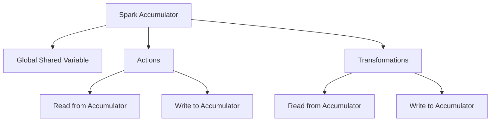

                 

## 1. 背景介绍

### 1.1 问题由来

Spark Accumulator是一个重要的Spark内部组件，用于在集群环境中进行分布式计算。其设计初衷是为了解决Spark计算过程中需要全局共享变量的需求，如统计类问题、记录型数据等。Spark Accumulator与Spark中的其他组件（如RDD、DataFrame）结合紧密，在数据处理、分布式机器学习等方面有着广泛的应用。

### 1.2 问题核心关键点

Spark Accumulator的原理与实现，其数据结构设计以及与其他组件的交互方式，是解决分布式计算中全局共享变量问题的关键。Spark Accumulator通过在集群中创建一个单独的变量来存储值，所有任务节点都可以访问该变量并更新其值，从而实现全局共享变量的功能。

### 1.3 问题研究意义

Spark Accumulator的设计，充分体现了Apache Spark分布式计算框架的优越性和灵活性。理解Spark Accumulator的原理与实现，对于深入掌握Spark集群计算的内部机制，优化Spark应用的性能，以及开发高效的分布式计算任务，都具有重要意义。

## 2. 核心概念与联系

### 2.1 核心概念概述

为了更好地理解Spark Accumulator的原理与实现，本节将介绍几个与其密切相关的核心概念：

- Spark Accumulator：Spark内部的一个组件，用于在集群中分布式存储一个全局共享的变量，该变量可以在集群中的所有节点上读取和更新。
- Transformations和Actions：Spark的两类操作，分别用于数据转换和数据计算，与Accumulator结合使用，可以实现复杂的分布式计算任务。
- RDD：Resilient Distributed Dataset（弹性分布式数据集），是Spark中的核心数据结构，支持多种转换和操作。
- Scala：Spark的原始语言，Accumulator的实现基于Scala，需要具备一定的Scala编程基础。

### 2.2 核心概念原理和架构的 Mermaid 流程图



这个流程图展示了Spark Accumulator的工作原理和与其他组件的交互方式：

1. Spark Accumulator是一个全局共享变量，可以在集群中的所有节点上读取和更新。
2. 通过Actions操作，可以将计算结果写入Accumulator。
3. 通过Transformations操作，可以从Accumulator中读取数据并用于进一步计算。
4. Accumulator的读写操作可以通过各种Transformations和Actions进行。

## 3. 核心算法原理 & 具体操作步骤

### 3.1 算法原理概述

Spark Accumulator的原理可以简要概述为：通过在集群中创建一个独立的变量来存储值，所有任务节点都可以访问该变量并更新其值，从而实现全局共享变量的功能。

具体来说，Spark Accumulator的实现包括以下几个关键步骤：

1. 在Spark集群中创建一个全局唯一的Accumulator实例。
2. 在各个任务节点上，可以通过Accumulator的读写操作，将计算结果或者中间结果存储到Accumulator中。
3. 在任务完成后，可以通过Actions操作，从Accumulator中读取最终结果。

### 3.2 算法步骤详解

下面详细说明Spark Accumulator的使用步骤：

**Step 1: 创建Accumulator实例**

首先，需要在Spark应用中创建一个Accumulator实例。可以通过SparkContext中的`accumulator()`方法来创建。

```python
from pyspark import SparkContext

sc = SparkContext("local", "Spark Accumulator Example")
acc = sc.accumulator(0.0)
```

这个示例代码创建了一个名为`acc`的全局Accumulator实例，初始值为0.0。

**Step 2: 在各个任务节点上操作Accumulator**

接下来，可以在各个任务节点上，通过Accumulator的`add()`方法来更新Accumulator的值。

```python
def process_data(rdd):
    acc.add(1.0)

    # 对数据进行转换和计算
    result = rdd.map(...).count()
    acc.add(result)

    # 将结果写入Accumulator
    acc.add(result)

    return result
```

这个示例代码在每个任务节点上，通过`add()`方法将1.0和计算结果添加到Accumulator中。

**Step 3: 读取Accumulator的结果**

最后，可以在任务完成后，通过Actions操作，从Accumulator中读取最终结果。

```python
result = sc.accumulate(acc.value)
print(result)
```

这个示例代码通过`accumulate()`方法从Accumulator中读取最终结果，并输出到控制台。

### 3.3 算法优缺点

Spark Accumulator的优点包括：

- 全局共享变量：可以在集群中的所有节点上读取和更新。
- 灵活使用：可以用于统计类问题、记录型数据等，支持多种转换和操作。
- 性能高效：读写操作非常高效，能够快速处理大量数据。

同时，Spark Accumulator也存在一些缺点：

- 难以调试：由于Accumulator的值是在所有节点上共享的，如果出现错误，调试比较困难。
- 内存占用：Accumulator的值是存储在所有节点上的，占用一定的内存空间。
- 线程安全：Accumulator的读写操作需要线程安全，否则可能会出现竞态条件等问题。

### 3.4 算法应用领域

Spark Accumulator在Spark中广泛应用，特别是在数据统计、机器学习等方面。以下是一些常见的应用领域：

- 数据统计：统计某个指标的值，如Word Count、元素个数等。
- 机器学习：记录模型的评估指标、训练误差等。
- 分布式计算：在分布式计算过程中，用于传递中间结果。
- 通信消息：在Spark集群中传递消息，用于协调各个节点之间的操作。

## 4. 数学模型和公式 & 详细讲解 & 举例说明

### 4.1 数学模型构建

Spark Accumulator的设计基于Scala的原子变量(AtomicVariable)。原子变量是一种线程安全的变量，支持原子性的加减操作。Spark Accumulator的实现基于原子变量，可以保证读写操作的原子性，避免竞态条件等问题。

### 4.2 公式推导过程

Spark Accumulator的读写操作是基于原子变量的加减操作实现的。假设在某个节点上，Accumulator的值为$x$，节点进行了$n$次`add()`操作，每次添加的值为$v_i$，则最终Accumulator的值可以表示为：

$$
x + \sum_{i=1}^n v_i
$$

其中，$\sum_{i=1}^n v_i$表示所有节点的添加操作的总和。

### 4.3 案例分析与讲解

假设在一个Spark集群中有三个节点，分别计算一个数值的和。三个节点分别进行了`add()`操作，每个节点添加了一个不同的数值。具体步骤如下：

1. 创建Accumulator实例：

```python
acc = sc.accumulator(0.0)
```

2. 在三个节点上进行操作：

```python
# 节点1
acc.add(1.0)

# 节点2
acc.add(2.0)

# 节点3
acc.add(3.0)
```

3. 读取Accumulator的结果：

```python
result = sc.accumulate(acc.value)
print(result)
```

最终输出的结果为6.0，即三个节点添加操作的总和。

## 5. 项目实践：代码实例和详细解释说明

### 5.1 开发环境搭建

在进行Spark Accumulator实践前，我们需要准备好开发环境。以下是使用Python进行Spark开发的环境配置流程：

1. 安装Spark：从官网下载并安装Spark，根据操作系统选择相应的安装命令。
2. 安装Scala：Spark需要Scala作为依赖，可以通过Spark的`spark-shell`工具验证Scala版本。
3. 配置环境变量：设置Spark相关的环境变量，如`SPARK_HOME`、`SPARK_CONF_DIR`等。
4. 编写Spark应用：使用Spark Python API编写应用代码。

### 5.2 源代码详细实现

以下是一个使用Spark Accumulator的Word Count示例代码：

```python
from pyspark import SparkContext

sc = SparkContext("local", "Spark Accumulator Example")

# 创建Accumulator实例
acc = sc.accumulator(0)

def process_data(rdd):
    # 对数据进行转换和计算
    result = rdd.map(lambda x: x.split()).count()

    # 将结果写入Accumulator
    acc.add(result)

    return result

# 读取文件
data = sc.textFile("data.txt")

# 对数据进行转换和计算
result = data.flatMap(lambda line: line.split()).count()

# 将结果写入Accumulator
acc.add(result)

# 读取Accumulator的结果
final_result = sc.accumulate(acc.value)
print(final_result)
```

### 5.3 代码解读与分析

让我们再详细解读一下关键代码的实现细节：

**Word Count示例代码**：
- `SparkContext`：Spark的入口类，用于创建SparkContext对象。
- `accumulator()`：创建Accumulator实例，初始值为0。
- `map()`：对数据进行转换，将文本转换为单词列表。
- `count()`：计算单词列表的长度。
- `add()`：将计算结果添加到Accumulator中。
- `accumulate()`：从Accumulator中读取最终结果。

**详细分析**：
- 在Spark应用中，首先创建了一个名为`acc`的Accumulator实例，初始值为0。
- 在`process_data()`函数中，对数据进行转换和计算，统计单词总数，并将结果添加到Accumulator中。
- 在主程序中，读取文件并对其进行转换和计算，将结果添加到Accumulator中。
- 最后，通过`accumulate()`方法从Accumulator中读取最终结果，并输出到控制台。

这个示例代码展示了Spark Accumulator在Word Count任务中的应用，通过Accumulator实现全局共享变量的功能，方便在多个节点上共享计算结果。

### 5.4 运行结果展示

运行上述代码，输出结果为单词总数。例如，如果`data.txt`文件中包含以下内容：

```
hello world
hello spark
spark accumulator
```

则输出结果为6，即单词总数为6。

## 6. 实际应用场景

### 6.1 大数据统计

Spark Accumulator可以用于大数据统计任务，如Word Count、元素个数、平均值等。在大规模数据处理过程中，通过Accumulator实现全局共享变量，可以方便地计算并汇总统计结果。

### 6.2 机器学习

在机器学习任务中，Spark Accumulator可以用于记录模型的评估指标、训练误差等。通过Accumulator记录这些关键指标，可以在多个节点上共享，方便监控和分析模型训练过程。

### 6.3 分布式计算

Spark Accumulator可以用于分布式计算过程中，传递中间结果。在复杂的分布式计算任务中，通过Accumulator实现各个节点之间的数据传递和同步，可以方便地进行数据汇总和计算。

### 6.4 未来应用展望

随着Spark生态系统的不断完善，Spark Accumulator的应用场景将更加广泛。未来，Spark Accumulator有望在大数据统计、机器学习、分布式计算、数据治理等方面发挥更大的作用。

## 7. 工具和资源推荐

### 7.1 学习资源推荐

为了帮助开发者掌握Spark Accumulator的使用方法，以下是一些优质的学习资源：

- Apache Spark官方文档：Spark的官方文档，详细介绍了Accumulator的使用方法，包括创建、读写操作、读取结果等。
- Spark Accumulator官方文档：Accumulator的详细使用手册，包括API文档和示例代码。
- 《Spark核心技术》：讲解Spark的内部机制和核心组件，包括Accumulator的实现原理和应用场景。

### 7.2 开发工具推荐

以下是几款用于Spark Accumulator开发的常用工具：

- Spark Shell：Spark的交互式解释器，可以在本地环境中进行测试和调试。
- PySpark：Spark的Python API，支持多种分布式计算任务。
- Scala：Spark的原始语言，Accumulator的实现基于Scala，需要具备一定的Scala编程基础。

### 7.3 相关论文推荐

Spark Accumulator的设计和实现，体现了Apache Spark分布式计算框架的优越性和灵活性。以下是几篇奠基性的相关论文，推荐阅读：

- Spark: Cluster Computing with Machine Learning（Spark论文）：介绍了Spark框架的基本概念和核心组件，包括Accumulator的实现。
- A Framework for Distributed Machine Learning with Apache Spark（Spark MLlib论文）：介绍了Spark MLlib库的实现，包括Accumulator在机器学习中的应用。
- Using Accumulators in Spark（Accumulator论文）：介绍了Spark Accumulator的实现原理和应用场景。

## 8. 总结：未来发展趋势与挑战

### 8.1 总结

本文对Spark Accumulator的原理与实现进行了全面系统的介绍。首先阐述了Spark Accumulator的研究背景和意义，明确了Accumulator在Spark集群计算中的关键作用。其次，从原理到实践，详细讲解了Accumulator的使用方法，给出了Word Count任务的完整代码实现。同时，本文还探讨了Accumulator在多个实际应用场景中的应用，展示了Accumulator的强大功能。

通过本文的系统梳理，可以看到，Spark Accumulator是Spark集群计算中不可或缺的重要组件，其设计思想和实现方式，充分体现了Apache Spark的灵活性和高效性。理解Spark Accumulator的原理与实现，对于深入掌握Spark集群计算的内部机制，优化Spark应用的性能，以及开发高效的分布式计算任务，都具有重要意义。

### 8.2 未来发展趋势

展望未来，Spark Accumulator的发展趋势将呈现以下几个方向：

1. 性能优化：随着Spark生态系统的不断完善，Accumulator的性能将进一步提升。通过优化读写操作和内存管理，实现更加高效的数据传递和计算。
2. 功能扩展：未来的Accumulator将支持更多的数据类型和操作，提供更加灵活和全面的数据处理能力。
3. 生态融合：Accumulator将与Spark的其他组件（如RDD、DataFrame）更加紧密地结合，实现更加全面的数据处理和计算功能。
4. 自动化管理：未来的Accumulator将支持自动化的内存管理、调度和优化，进一步提升集群计算的效率和稳定性。

### 8.3 面临的挑战

尽管Spark Accumulator已经取得了广泛应用，但在迈向更加智能化、普适化应用的过程中，它仍面临以下挑战：

1. 可扩展性：在大规模数据处理过程中，Accumulator的读写操作可能会成为性能瓶颈，需要进一步优化以适应大规模数据。
2. 可维护性：Accumulator的设计和实现较为复杂，维护难度较大。如何简化API设计，降低使用难度，是未来的挑战。
3. 一致性：在分布式计算中，Accumulator的一致性维护是一个重要问题。如何保证Accumulator在多节点上的读写一致性，需要进一步探索。
4. 安全性：Accumulator的读写操作需要确保线程安全和数据一致性，如何防范并发访问和竞态条件等问题，是一个重要的研究方向。

### 8.4 研究展望

面对Spark Accumulator面临的这些挑战，未来的研究需要在以下几个方面寻求新的突破：

1. 优化读写操作：通过优化内存管理、数据压缩等技术，提升Accumulator的读写性能。
2. 简化API设计：通过简化Accumulator的API设计，降低使用难度，提高用户友好性。
3. 提高一致性：通过分布式锁、消息队列等技术，确保Accumulator在多节点上的读写一致性。
4. 增强安全性：通过分布式锁、消息队列等技术，确保Accumulator在多节点上的读写一致性。

这些研究方向的探索，将进一步提升Spark Accumulator的性能和稳定性，为Spark集群计算的进一步优化和提升提供有力支持。相信随着学界和产业界的共同努力，Spark Accumulator必将在未来的分布式计算中发挥更大的作用，推动大数据和机器学习的广泛应用。

## 9. 附录：常见问题与解答

**Q1: Accumulator的读取操作和写入操作有什么区别？**

A: Accumulator的读取操作和写入操作的区别在于操作对象的不同。读取操作是从Accumulator中读取最终的计算结果，而写入操作是将计算结果写入Accumulator中。在读取操作中，Accumulator的值是所有节点的写入结果的总和；在写入操作中，Accumulator的值是当前节点的添加结果。

**Q2: 如何保证Accumulator的线程安全？**

A: Accumulator的线程安全是通过原子变量的加减操作实现的。在多线程环境中，原子变量的加减操作保证了操作的一致性和原子性，避免了竞态条件等问题。此外，Spark Accumulator还提供了分布式锁等机制，进一步保证了在多节点上的线程安全。

**Q3: 如何优化Accumulator的性能？**

A: 优化Accumulator的性能可以从以下几个方面入手：
1. 减少内存占用：可以通过压缩Accumulator的值，减少内存占用。
2. 优化内存管理：通过内存优化技术，减少内存泄漏和内存碎片。
3. 优化数据传输：可以通过数据压缩、数据分区等技术，优化数据传输过程，减少数据传输开销。

**Q4: Accumulator在Spark中的作用是什么？**

A: Accumulator在Spark中的作用是通过在集群中创建一个单独的变量来存储值，所有任务节点都可以访问该变量并更新其值，从而实现全局共享变量的功能。Accumulator可以用于分布式计算中的统计、记录型数据等场景，支持多种转换和操作。

**Q5: Accumulator的读写操作需要注意哪些问题？**

A: Accumulator的读写操作需要注意以下问题：
1. 线程安全：Accumulator的读写操作需要保证线程安全，避免竞态条件等问题。
2. 数据一致性：在多节点环境下，Accumulator的值可能存在不一致性，需要保证数据一致性。
3. 性能瓶颈：在数据量较大时，Accumulator的读写操作可能会成为性能瓶颈，需要优化以适应大规模数据。

这些问题的解决，需要开发者在使用Accumulator时进行合理的参数设置和优化调整。

---

作者：禅与计算机程序设计艺术 / Zen and the Art of Computer Programming

