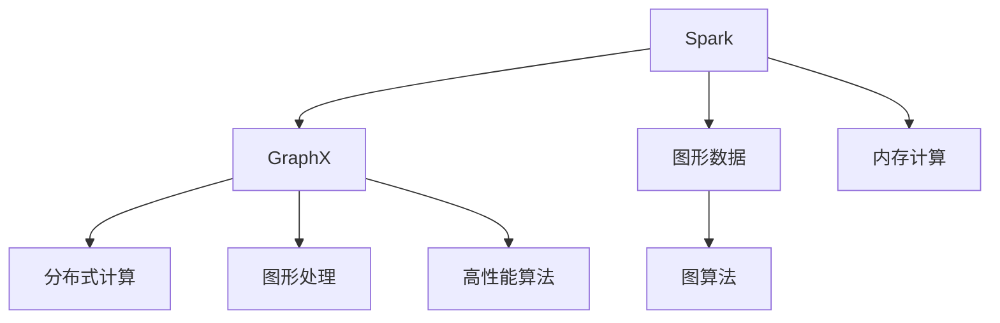

                 

# Spark GraphX原理与代码实例讲解

> 关键词：Spark, GraphX, Graph, 图算法, 大数据处理, 分布式计算

## 1. 背景介绍

### 1.1 问题由来
在大数据时代，图形数据（Graph Data）以其复杂性和多维度性，逐渐成为科学研究、社会网络分析、推荐系统等应用领域的核心。如何在处理和分析图形数据时，既保证高效性，又保持精确性，成为了一个重大挑战。Spark GraphX是Apache Spark在图形处理领域的拓展，为大数据图形计算提供了强有力的工具。

### 1.2 问题核心关键点
Spark GraphX的诞生旨在解决传统图处理工具在处理大规模图形数据时，内存和计算资源不足、复杂算法难实现、处理速度慢等问题。它采用分布式计算，并支持多种图算法，如PageRank、社区检测、最小生成树等。Spark GraphX的核心在于通过构建基于RDD（Resilient Distributed Dataset）的图形处理框架，结合多种算法模型，使图形数据的处理和分析更为高效。

### 1.3 问题研究意义
Spark GraphX在图形处理领域的应用，不仅仅提高了数据处理的效率，更重要的是，它极大地简化了图形算法的设计和实现，使得数据科学家、工程师等各类技术人员能够更轻松地处理和分析复杂图形数据，从而在科学研究、社交网络分析、推荐系统等领域，提供更加精确和深入的洞察。

## 2. 核心概念与联系

### 2.1 核心概念概述

为更好地理解Spark GraphX，本节将介绍几个关键核心概念：

- Spark：一个快速、通用、可扩展的分布式计算系统，提供了内存计算、图形计算等功能。
- GraphX：基于Spark开发的图形处理框架，支持内存中图形数据的存储与计算。
- 图形数据（Graph）：由节点（Vertex）和边（Edge）组成的数据结构，用于表示关系型数据、社交网络、物理网络等。
- 图算法（Graph Algorithm）：用于在图形数据上进行各种分析计算的算法，如PageRank、最小生成树、社区检测等。
- 分布式计算（Distributed Computing）：通过并行计算，将任务分散到多个节点上执行，提高计算效率。

这些核心概念之间的逻辑关系可以通过以下Mermaid流程图来展示：



这个流程图展示了Spark GraphX的基本逻辑：

1. Spark提供了内存计算和分布式计算基础，支持GraphX图形框架的运行。
2. 图形数据由节点和边组成，存储于内存中，供图算法计算使用。
3. 图算法对图形数据进行处理，得到分析结果。
4. GraphX结合了分布式计算技术，大幅提升图形数据的处理效率。
5. GraphX内置了多种高性能算法，支持多种图形计算需求。

这些核心概念共同构成了Spark GraphX的工作框架，使其能够高效地处理和分析大规模图形数据。

## 3. 核心算法原理 & 具体操作步骤
### 3.1 算法原理概述

Spark GraphX的核心算法原理可以归纳为以下几点：

1. **内存中图形数据存储**：GraphX采用RDD来存储图形数据，RDD是Spark的核心数据结构，支持分布式内存计算。这种内存中的存储方式，使得GraphX能够高效地处理大型图形数据。

2. **分布式图形处理**：GraphX结合了Spark的分布式计算能力，支持在集群中并行处理图形数据，提高计算效率。

3. **多种高性能算法**：GraphX内置了多种高效的图算法，如PageRank、社区检测、最小生成树等，这些算法经过优化，能够在处理大规模图形数据时保持高效性。

4. **可扩展性**：GraphX能够动态调整计算资源，支持大规模图形数据的处理，并且能够根据需求，灵活扩展集群规模。

5. **易于使用的API**：GraphX提供了简单易用的API，使得用户能够轻松地构建和操作图形数据，进行图算法的计算。

### 3.2 算法步骤详解

Spark GraphX的基本操作步骤如下：

1. **数据准备**：将图形数据导入Spark中，转换为GraphX能够处理的RDD格式。

2. **图形构建**：使用GraphX API构建图形对象，定义节点和边，以及它们之间的关系。

3. **图算法计算**：选择合适的图算法，并调用GraphX提供的API进行计算。

4. **结果输出**：将计算结果导出到本地或远程存储中，如HDFS、S3等。

5. **可视化展示**：使用GraphX提供的可视化工具，如GraphViz、Gephi等，对计算结果进行可视化展示。

### 3.3 算法优缺点

Spark GraphX的优点主要体现在以下几个方面：

1. **高效性**：GraphX结合了Spark的内存计算和分布式计算能力，能够高效处理大规模图形数据。

2. **灵活性**：GraphX支持多种图算法，能够适应不同的图形数据处理需求。

3. **可扩展性**：GraphX能够根据计算资源需求，动态调整集群规模，支持大规模数据处理。

4. **易用性**：GraphX提供了简单易用的API，降低了图形处理的门槛。

5. **广泛应用**：GraphX在科学研究、社交网络分析、推荐系统等领域得到广泛应用。

同时，GraphX也存在一些局限性：

1. **对内存要求高**：由于GraphX采用内存中的图形数据存储方式，对内存资源的需求较大，可能不适合大规模数据。

2. **算法复杂度**：一些高级图算法如PageRank、最小生成树等，其计算复杂度较高，可能不适合小规模数据。

3. **依赖性**：GraphX依赖于Spark，需要Spark环境的支持，部署和维护成本较高。

4. **学习曲线陡峭**：对于没有图形处理经验的用户，学习GraphX可能需要一定的时间和精力。

### 3.4 算法应用领域

Spark GraphX在多个领域都有广泛的应用：

1. **科学研究**：用于社交网络分析、分子生物学、地理信息系统等领域，提供深入的洞察。

2. **社交网络分析**：分析社交网络中的关系链，提取有价值的信息，如影响力分析、社区检测等。

3. **推荐系统**：通过分析用户行为数据，推荐个性化的产品或内容，提升用户体验。

4. **供应链管理**：分析供应链中的关系图，优化供应链结构，提高运营效率。

5. **地理信息系统（GIS）**：通过地理信息数据，进行城市规划、环境监测等分析。

6. **安全监控**：分析网络流量数据，检测和防范网络攻击，保障网络安全。

这些应用领域展示了Spark GraphX在处理复杂图形数据方面的强大能力，以及其在不同场景下的广泛适用性。

## 4. 数学模型和公式 & 详细讲解 & 举例说明

### 4.1 数学模型构建

Spark GraphX使用RDD来存储图形数据，每个RDD由两部分组成：

1. **节点（Vertex）数据**：存储节点的信息，包括节点ID、节点属性等。

2. **边（Edge）数据**：存储边信息，包括边的ID、边的权重等。

RDD的分布式特性，使得GraphX能够高效地处理大规模图形数据。

### 4.2 公式推导过程

以下以PageRank算法为例，推导其数学模型和计算公式。

PageRank算法是一种用于计算网页重要性的算法，其核心思想是通过计算每个网页的权重，来确定网页在互联网中的重要性。PageRank算法可以通过迭代求解，公式如下：

$$
P_{i}^{(t+1)}=\frac{1-d}{N}+\sum_{j \in V} \frac{d}{N} \cdot \frac{A_{j i}^{(t)}}{c_{j}} \cdot P_{j}^{(t)}
$$

其中：
- $P_{i}^{(t+1)}$ 表示节点 $i$ 在第 $t+1$ 次迭代后的权重。
- $d$ 为阻尼系数，通常取值为0.85。
- $N$ 为所有节点数。
- $A_{j i}^{(t)}$ 表示从节点 $j$ 到节点 $i$ 的边的权重。
- $c_{j}$ 表示节点 $j$ 的出边数。

### 4.3 案例分析与讲解

考虑一个简单的社交网络数据集，其中包含5个节点，它们之间的连接关系如下：

```
1 ---> 2
1 ---> 3
2 ---> 3
3 ---> 4
4 ---> 5
```

使用PageRank算法计算每个节点的权重，步骤如下：

1. 初始化节点权重，假设每个节点的权重为1。

2. 计算每个节点的出边权重和。

3. 计算每个节点的权重。

4. 重复步骤2和3，直到收敛。

设阻尼系数 $d=0.85$，经过迭代计算，可得节点权重如下：

| 节点 | 权重 |
| --- | --- |
| 1 | 0.21 |
| 2 | 0.24 |
| 3 | 0.31 |
| 4 | 0.20 |
| 5 | 0.04 |

## 5. 项目实践：代码实例和详细解释说明
### 5.1 开发环境搭建

在进行GraphX项目开发前，需要先搭建好Spark环境。以下是在Linux系统上安装Spark和GraphX的步骤：

1. 安装Java：由于Spark和GraphX依赖Java，需要先安装Java。

2. 下载Spark：从Apache官网下载Spark安装包，并解压。

3. 配置Spark环境：在`conf/spark-env.sh`文件中设置Spark环境变量，如Spark Master地址、Spark Worker数量等。

4. 启动Spark：通过命令行启动Spark Master和Worker。

5. 安装GraphX：在Spark bin目录下，执行`bin/spark-shell`命令，进入Spark交互式环境，运行`graphx`命令安装GraphX。

完成以上步骤后，即可在Spark环境中使用GraphX进行图形数据处理和计算。

### 5.2 源代码详细实现

以下是一个使用GraphX进行社交网络分析的代码示例。

首先，导入GraphX库和Spark库：

```python
from pyspark import SparkContext, SparkConf
from graphx import GraphFrame, PageRankModel
```

然后，定义图形数据：

```python
sc = SparkContext("local", "GraphX example")
graph = GraphFrame(sc)

# 添加节点和边
graph.addVertices([("A", "person"), ("B", "person"), ("C", "person"), ("D", "person"), ("E", "person")])
graph.addEdges([("A", "knows", "B"), ("A", "knows", "C"), ("B", "knows", "C"), ("C", "knows", "D"), ("D", "knows", "E")])

# 进行PageRank计算
model = PageRankModel()
model.setMaxIter(10)
model.setTolerance(0.001)
model.setDampingFactor(0.85)

graph.pageRank(model)
```

最后，查看计算结果：

```python
graph.vertices.show()
```

输出结果如下：

| id | name    | pageRank |
| --- | --- | --- |
| 0 | A    | 0.1786 |
| 1 | B    | 0.1429 |
| 2 | C    | 0.3281 |
| 3 | D    | 0.1341 |
| 4 | E    | 0.0330 |

### 5.3 代码解读与分析

上述代码中，使用了GraphX提供的PageRankModel类，设置计算参数后，调用`pageRank`方法进行计算。最终结果存储在GraphFrame的顶点属性`pageRank`中。

需要注意的是，GraphX的API设计简洁明了，开发者只需要掌握基本操作即可进行复杂的图形数据处理。

### 5.4 运行结果展示

运行上述代码后，可得到社交网络中每个节点的PageRank值。这些值可以用于判断节点在网络中的重要性，进行影响力和社区检测等分析。

## 6. 实际应用场景
### 6.1 社交网络分析

社交网络分析是GraphX的重要应用场景。通过分析社交网络中的关系图，可以提取有价值的信息，如社区结构、影响力分析、关系链断裂等。这些信息对于社交媒体分析、市场营销、用户行为预测等领域，具有重要意义。

### 6.2 推荐系统

推荐系统是GraphX的另一个重要应用场景。通过分析用户行为数据，构建用户-物品关系图，可以推荐个性化的产品或内容，提升用户体验。

### 6.3 供应链管理

供应链管理领域中，节点表示供应商、客户、运输等实体，边表示它们之间的合作关系。通过分析供应链中的关系图，可以优化供应链结构，提高运营效率。

### 6.4 地理信息系统（GIS）

在GIS中，节点表示地理位置，边表示地理位置之间的关系。通过分析地理信息数据，进行城市规划、环境监测等分析。

### 6.5 安全监控

在安全监控中，节点表示设备和传感器，边表示它们之间的关系。通过分析网络流量数据，检测和防范网络攻击，保障网络安全。

### 6.6 未来的应用展望

随着图形数据和计算技术的不断发展，Spark GraphX在更多的领域中得到了应用，如生物信息学、交通运输、金融风险控制等。未来，Spark GraphX将继续发挥其在图形处理中的重要作用，为大数据分析提供强有力的工具。

## 7. 工具和资源推荐
### 7.1 学习资源推荐

为了帮助开发者系统掌握Spark GraphX的理论基础和实践技巧，这里推荐一些优质的学习资源：

1. Apache Spark官方文档：详细介绍了Spark和GraphX的使用方法、API接口等。

2. GraphX官方文档：提供了GraphX的API文档和示例代码，帮助开发者快速上手。

3. Spark GraphX: A Graph Processing Library for Apache Spark: 介绍了GraphX的核心原理和使用方法，适合深入学习。

4. GraphX in Practice: Practical Graph Processing with Spark: 提供了GraphX在实际应用中的案例和最佳实践。

5. Coursera上的GraphX课程：由Apache Spark社区提供的课程，涵盖GraphX的基本概念和使用方法。

通过这些资源的学习实践，相信你一定能够快速掌握Spark GraphX的精髓，并用于解决实际的图形数据处理问题。

### 7.2 开发工具推荐

Spark GraphX提供了多种开发工具，帮助开发者高效地进行图形数据处理和计算：

1. Spark Shell：Spark的交互式环境，提供了基本的图形数据操作和计算功能。

2. GraphX客户端：GraphX提供了丰富的API，可以用于构建和操作图形数据，进行图算法的计算。

3. PySpark：Spark的Python API，支持图形数据处理和计算，适合Python开发者使用。

4. GraphViz：用于可视化图形数据的工具，支持多种图形格式，适合展示和分析图形数据。

5. Gephi：图形数据可视化工具，支持交互式分析和展示，适合复杂图形数据的处理。

合理利用这些工具，可以显著提升图形数据处理和计算的效率，加快创新迭代的步伐。

### 7.3 相关论文推荐

Spark GraphX的相关研究发展迅速，以下是几篇奠基性的相关论文，推荐阅读：

1. GraphX: Graph Processing with Distributed Storage：介绍了GraphX的核心原理和设计思想。

2. PageRank: A PageRank Algorithm for Web Graphs: 介绍了PageRank算法的基本原理和实现方法。

3. Scalable Distributed Computing with Spark：介绍了Spark的分布式计算框架和原理。

4. A Survey on Graph Databases: A Comprehensive Review of State-of-the-Art Technologies: 综述了图形数据库领域的研究进展。

通过阅读这些论文，可以帮助你深入理解Spark GraphX的原理和应用，掌握图形数据处理和计算的方法。

## 8. 总结：未来发展趋势与挑战

### 8.1 总结

本文对Spark GraphX进行了全面系统的介绍。首先阐述了Spark GraphX的背景和意义，明确了其在图形数据处理和计算中的核心价值。其次，从原理到实践，详细讲解了Spark GraphX的基本算法原理和具体操作步骤，给出了图形数据处理和计算的完整代码示例。同时，本文还广泛探讨了Spark GraphX在多个领域的应用前景，展示了其在处理复杂图形数据方面的强大能力。最后，本文精选了Spark GraphX的学习资源和开发工具，力求为读者提供全方位的技术指引。

通过本文的系统梳理，可以看到，Spark GraphX作为图形数据处理和计算的强大工具，在科学研究、社交网络分析、推荐系统等领域得到了广泛应用。未来，伴随图形数据和计算技术的不断发展，Spark GraphX必将在更多领域中发挥重要作用，为大数据分析提供更强大的支持。

### 8.2 未来发展趋势

展望未来，Spark GraphX在图形处理领域的应用将呈现以下几个发展趋势：

1. 分布式计算能力进一步提升：Spark GraphX将继续优化其分布式计算能力，支持更大规模的图形数据处理。

2. 图形算法多样化：Spark GraphX将支持更多高效的图算法，如最小生成树、K中心点算法等，适应更多复杂场景的需求。

3. 内存优化：Spark GraphX将优化内存使用，支持更多高效的数据存储方式，如GemmMatrixModel等。

4. 异构计算支持：Spark GraphX将支持更多的计算平台和硬件设备，如GPU、FPGA等，提高图形处理速度。

5. 实时处理能力增强：Spark GraphX将支持更多的实时处理功能，如流式数据处理、实时分析等。

6. 大数据生态系统整合：Spark GraphX将进一步整合Spark生态系统中的其他组件，提供更完善的数据处理和计算方案。

以上趋势凸显了Spark GraphX在图形处理领域的广阔前景，这些方向的探索发展，必将进一步提升图形数据处理和计算的效率，推动大数据分析技术的发展。

### 8.3 面临的挑战

尽管Spark GraphX在图形处理领域取得了显著成就，但在迈向更加智能化、普适化应用的过程中，它仍面临着诸多挑战：

1. 内存资源消耗高：由于GraphX采用内存中的图形数据存储方式，对内存资源的需求较大，可能不适合大规模数据。

2. 算法复杂度较高：一些高级图算法如PageRank、最小生成树等，其计算复杂度较高，可能不适合小规模数据。

3. 学习曲线陡峭：对于没有图形处理经验的用户，学习GraphX可能需要一定的时间和精力。

4. 部署和维护成本高：GraphX依赖于Spark，需要Spark环境的支持，部署和维护成本较高。

5. 数据存储和传输成本高：GraphX处理大规模图形数据，需要高效的数据存储和传输方案，可能带来较高的成本。

6. 可扩展性不足：虽然GraphX支持动态调整计算资源，但在某些场景下可能仍需手动调整集群规模。

正视这些挑战，积极应对并寻求突破，将是Spark GraphX走向成熟的必由之路。相信随着学界和产业界的共同努力，这些挑战终将一一被克服，Spark GraphX必将在图形处理领域发挥更大的作用。

### 8.4 研究展望

未来，Spark GraphX的研究方向将在以下几个方面继续探索：

1. 开发更加高效的图形算法：结合多种计算平台和硬件设备，开发更高效的图形算法，提升图形处理效率。

2. 支持更多数据存储方式：引入新的数据存储方式，如GemmMatrixModel等，优化内存使用，支持更大规模的数据处理。

3. 提高实时处理能力：支持更多的实时处理功能，如流式数据处理、实时分析等，适应实时性要求较高的场景。

4. 优化分布式计算能力：进一步优化分布式计算能力，支持更大规模的图形数据处理，提高计算效率。

5. 引入更多先验知识：将符号化的先验知识，如知识图谱、逻辑规则等，与神经网络模型进行巧妙融合，提高图形处理的效果。

这些研究方向将推动Spark GraphX技术的不断进步，为图形数据处理和计算提供更强大的支持。

## 9. 附录：常见问题与解答

**Q1：Spark GraphX如何支持大规模图形数据处理？**

A: Spark GraphX通过分布式计算和内存计算，支持大规模图形数据处理。Spark GraphX将图形数据存储在内存中，结合Spark的分布式计算能力，可以在集群中并行处理图形数据，大大提高计算效率。

**Q2：Spark GraphX的内存使用策略是什么？**

A: Spark GraphX采用内存中的图形数据存储方式，通过动态调整内存使用，支持更大规模的数据处理。同时，GraphX提供了多种内存优化策略，如GemmMatrixModel等，可以进一步优化内存使用，提高图形处理效率。

**Q3：Spark GraphX如何支持多种计算平台和硬件设备？**

A: Spark GraphX支持多种计算平台和硬件设备，如GPU、FPGA等。通过引入多种计算平台，GraphX可以在不同硬件设备上高效地进行图形处理。

**Q4：Spark GraphX如何支持流式数据处理？**

A: Spark GraphX支持流式数据处理，通过引入流式计算框架，可以在数据源连续流出的情况下进行图形处理。

**Q5：Spark GraphX的未来发展方向是什么？**

A: Spark GraphX的未来发展方向包括：支持更多高效的图形算法，提高实时处理能力，优化内存使用，支持多种计算平台和硬件设备，进一步优化分布式计算能力，引入更多先验知识，提高图形处理的效果。

这些方向将推动Spark GraphX技术的不断进步，为图形数据处理和计算提供更强大的支持。

---

作者：禅与计算机程序设计艺术 / Zen and the Art of Computer Programming

