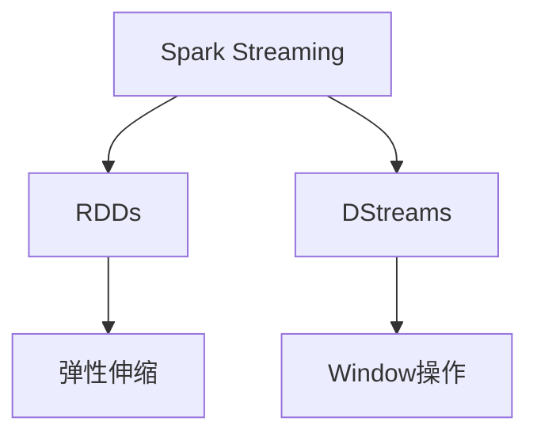

                 

# Spark Streaming原理与代码实例讲解

> 关键词：Spark Streaming, 实时数据处理, 流式计算, RDDs, Window操作, 弹性伸缩, Apache Spark

## 1. 背景介绍

### 1.1 问题由来
随着互联网和物联网的快速发展，数据生产量呈爆炸性增长，如何高效地存储、处理和分析实时数据，成为数据工程领域的重要课题。传统的批处理系统，如Hadoop MapReduce，已经无法满足实时数据处理的需求。因此，实时数据处理技术应运而生，并逐渐成为数据工程的主流技术之一。

Spark Streaming作为Apache Spark的一个子项目，是处理实时数据的高性能计算框架。通过Spark Streaming，我们可以方便地处理来自各种数据源的实时数据流，并支持多种数据处理和分析算法，包括窗口操作、滑动窗口、时间戳操作等。

### 1.2 问题核心关键点
Spark Streaming的核心思想是将实时数据流作为RDDs的序列进行处理。通过RDDs，Spark Streaming实现了弹性的批处理和实时处理相结合的数据处理模型。其关键点包括：
- 流式数据处理：通过DStreams将实时数据流作为RDDs的序列，实现流式计算。
- 窗口操作：通过滑动窗口和滚动窗口，实现数据聚合和统计分析。
- 弹性伸缩：支持动态调整Spark集群，实现高效的资源利用。
- 高吞吐量和高延迟：通过优化数据处理和存储机制，实现高吞吐量和低延迟。

## 2. 核心概念与联系

### 2.1 核心概念概述

为更好地理解Spark Streaming的核心概念，本节将介绍几个密切相关的核心概念：

- Spark Streaming: Apache Spark的一个子项目，用于实时数据处理。通过Spark Streaming，我们可以方便地处理来自各种数据源的实时数据流，并支持多种数据处理和分析算法，包括窗口操作、滑动窗口、时间戳操作等。
- RDDs: 弹性分布式数据集，是Spark的基本数据结构。RDDs提供了弹性的批处理和流式计算相结合的数据处理模型，是Spark Streaming的核心。
- DStreams: 实时数据流，通过DStreams将实时数据流作为RDDs的序列进行处理，实现流式计算。
- Window操作: 通过滑动窗口和滚动窗口，实现数据聚合和统计分析。Spark Streaming提供多种Window操作，如滑动窗口、滚动窗口、会话窗口等。
- 弹性伸缩: 支持动态调整Spark集群，实现高效的资源利用。Spark Streaming可以根据实时数据流的变化，动态调整Spark集群，优化资源利用。

这些核心概念之间的逻辑关系可以通过以下Mermaid流程图来展示：



这个流程图展示了一个典型的Spark Streaming处理流程：

1. 数据流进入Spark Streaming系统，被转换为RDDs。
2. 使用DStreams对RDDs进行流式处理。
3. 通过Window操作进行数据聚合和统计分析。
4. 弹性伸缩优化资源利用。

## 3. 核心算法原理 & 具体操作步骤
### 3.1 算法原理概述

Spark Streaming的核心算法原理是流式计算和批处理相结合的数据处理模型。其核心思想是将实时数据流作为RDDs的序列进行处理，通过RDDs提供弹性的批处理和流式计算相结合的数据处理模型。Spark Streaming还支持多种数据处理和分析算法，包括窗口操作、滑动窗口、时间戳操作等。

Spark Streaming的主要算法步骤如下：

1. 数据流进入Spark Streaming系统，被转换为RDDs。
2. 使用DStreams对RDDs进行流式处理。
3. 通过Window操作进行数据聚合和统计分析。
4. 弹性伸缩优化资源利用。

### 3.2 算法步骤详解

以下是Spark Streaming的主要算法步骤：

**Step 1: 数据源集成**

Spark Streaming支持多种数据源，包括Kafka、Flume、HDFS、Hive等。首先需要集成数据源，将实时数据流作为DStreams输入。

**Step 2: 数据预处理**

Spark Streaming支持多种数据预处理操作，包括去重、过滤、映射、聚合等。预处理操作通常包括数据清洗、特征提取、数据格式转换等。

**Step 3: 窗口操作**

Spark Streaming支持多种Window操作，包括滑动窗口、滚动窗口、会话窗口等。通过Window操作，可以实现数据聚合和统计分析，如计算平均值、计数、求和等。

**Step 4: 数据存储和可视化**

处理完数据后，Spark Streaming可以将结果存储到文件系统或数据库中，或进行可视化展示。

**Step 5: 弹性伸缩**

Spark Streaming支持动态调整Spark集群，优化资源利用。根据实时数据流的变化，可以动态调整Spark集群，实现高效的资源利用。

### 3.3 算法优缺点

Spark Streaming具有以下优点：

1. 高效流式处理：通过RDDs提供弹性的批处理和流式计算相结合的数据处理模型，支持高效的数据处理和分析。
2. 支持多种数据源：支持多种数据源，包括Kafka、Flume、HDFS、Hive等，支持不同类型的数据源。
3. 支持多种Window操作：支持多种Window操作，包括滑动窗口、滚动窗口、会话窗口等，支持不同类型的数据聚合和统计分析。
4. 弹性伸缩：支持动态调整Spark集群，优化资源利用，适应实时数据流的变化。

同时，Spark Streaming也存在一些缺点：

1. 数据延迟：Spark Streaming采用批处理的方式进行数据处理，存在一定的数据延迟。
2. 内存使用：Spark Streaming需要较多的内存，对于内存资源较小的系统，可能无法有效处理大规模数据流。
3. 数据量限制：Spark Streaming适用于大规模数据流的处理，对于小规模数据流，可能存在性能瓶颈。

## 4. 数学模型和公式 & 详细讲解 & 举例说明

### 4.1 数学模型构建

Spark Streaming的数学模型主要由RDDs和DStreams构成。其中，RDDs是一个弹性分布式数据集，支持多种数据处理和分析操作。DStreams是一个流式数据流，通过DStreams将实时数据流作为RDDs的序列进行处理，实现流式计算。

### 4.2 公式推导过程

以下是Spark Streaming的主要数学模型和公式推导过程：

**公式1: RDDs定义**

$$ RDDs = (RDD, partitioner) $$

其中，RDD是一个弹性分布式数据集，partitioner是分区器，用于将数据划分为多个分区。

**公式2: DStreams定义**

$$ DStreams = (DStream, batch_interval) $$

其中，DStreams是一个流式数据流，batch_interval是批处理间隔时间。

**公式3: 滑动窗口**

$$ window = sliding_window(data, window_size, slide_size) $$

其中，data是原始数据，window_size是滑动窗口大小，slide_size是滑动窗口步长。

**公式4: 滚动窗口**

$$ window = rolling_window(data, window_size) $$

其中，data是原始数据，window_size是滚动窗口大小。

**公式5: 会话窗口**

$$ window = session_window(data, session_length, session_gap) $$

其中，data是原始数据，session_length是会话窗口长度，session_gap是会话窗口间隔时间。

## 5. 项目实践：代码实例和详细解释说明
### 5.1 开发环境搭建

在进行Spark Streaming项目实践前，我们需要准备好开发环境。以下是使用Python进行Spark Streaming开发的环境配置流程：

1. 安装Apache Spark：从官网下载并安装Apache Spark，选择Scala版本为2.11.8。

2. 安装Python依赖：在Python环境中安装Spark Streaming和PySpark依赖包，例如：

```python
pip install pyspark streaming
```

3. 配置环境变量：设置SPARK_HOME和PYSPARK_PYTHON等环境变量，指向安装目录。

完成上述步骤后，即可在本地运行Spark Streaming程序。

### 5.2 源代码详细实现

这里我们以实时计算股票价格为例，给出使用PySpark进行Spark Streaming的代码实现。

首先，我们需要定义一个滑动窗口函数，用于计算股票价格的平均值：

```python
from pyspark.streaming import StreamingContext
from pyspark import SparkContext
import numpy as np

sc = SparkContext("local", "Streaming App")
ssc = StreamingContext(sc, 2) # 2s的批处理间隔时间

# 定义滑动窗口函数
def sliding_window(rdd, window_size):
    def sliding_window_inner(rdd):
        def window_partition(rdd):
            return rdd.mapPartitions(lambda x: (x, np.mean(rdd[x].values)))
        return rdd.map(window_partition)
    return sliding_window_inner(rdd)

# 读取股票数据流
stock_data = sc.textFile("stock_data.csv").map(lambda line: (line[0], float(line[1]))).toStream()

# 应用滑动窗口函数
sliding_window_result = stock_data.map(sliding_window, window_size=10).updateOrCompute(0, sliding_window)

# 输出滑动窗口结果
sliding_window_result.foreachRDD(lambda rdd: rdd.foreach(lambda x: print(x[0], x[1])))

ssc.start()
ssc.awaitTermination()
```

在这个例子中，我们首先定义了一个滑动窗口函数，用于计算股票价格的平均值。然后，我们使用PySpark读取股票数据流，并应用滑动窗口函数进行计算。最后，我们在Spark Streaming集群上运行程序，并在每个滑动窗口结束时输出计算结果。

### 5.3 代码解读与分析

让我们再详细解读一下关键代码的实现细节：

**StreamingContext**: 
- 创建Spark Streaming上下文对象，设置批处理间隔时间为2s。

**Sliding Window**:
- 定义滑动窗口函数，计算每10秒滑动窗口内的平均值。
- 应用滑动窗口函数到股票数据流上。
- 通过updateOrCompute方法，在滑动窗口结束时计算平均值并输出结果。

**foreachRDD**:
- 在Spark Streaming集群上运行程序，并在每个滑动窗口结束时输出计算结果。

可以看到，通过Spark Streaming，我们可以方便地实现流式数据处理和实时计算。在实际应用中，还需要根据具体需求进行更复杂的流式计算和数据聚合操作。

## 6. 实际应用场景
### 6.1 实时日志分析

Spark Streaming可以用于实时日志分析，例如对网站访问日志进行实时统计和分析。通过对日志进行流式处理，我们可以实时了解网站的访问情况，发现异常流量和潜在问题，优化网站性能。

在技术实现上，我们可以收集网站的实时日志数据流，并使用Spark Streaming进行流式处理。通过滑动窗口和滚动窗口，统计访问次数、访问IP、访问路径等指标，并生成可视化图表展示实时数据。

### 6.2 实时数据监控

Spark Streaming可以用于实时数据监控，例如对机器运行状态进行实时监控和分析。通过对系统日志和运行数据进行流式处理，我们可以实时了解系统状态，发现异常情况和潜在问题，及时采取措施，保障系统稳定运行。

在技术实现上，我们可以收集系统的实时日志和运行数据流，并使用Spark Streaming进行流式处理。通过滑动窗口和滚动窗口，统计CPU、内存、磁盘等指标，并生成可视化图表展示实时数据。

### 6.3 实时推荐系统

Spark Streaming可以用于实时推荐系统，例如对用户的浏览和点击行为进行实时分析，推荐相关商品或内容。通过对用户行为进行流式处理，我们可以实时发现用户的兴趣点，生成个性化推荐结果，提高用户满意度和转化率。

在技术实现上，我们可以收集用户的实时浏览和点击数据流，并使用Spark Streaming进行流式处理。通过滑动窗口和滚动窗口，统计用户行为和兴趣点，并生成个性化推荐结果。

### 6.4 未来应用展望

随着Spark Streaming技术的不断演进，未来的应用场景将更加广泛。

在智慧城市治理中，Spark Streaming可以用于实时监控和分析城市交通、环境、安全等数据，提升城市管理智能化水平，构建更安全、高效的未来城市。

在智能制造中，Spark Streaming可以用于实时监控和分析生产数据，优化生产流程，提升生产效率，降低生产成本。

在社交媒体分析中，Spark Streaming可以用于实时分析和处理社交媒体数据，发现用户兴趣点，生成个性化推荐结果，提升用户满意度和转化率。

未来，Spark Streaming将在更多领域得到应用，为各行各业提供智能化的数据处理和分析服务。

## 7. 工具和资源推荐
### 7.1 学习资源推荐

为了帮助开发者系统掌握Spark Streaming的理论基础和实践技巧，这里推荐一些优质的学习资源：

1. Apache Spark官方文档：提供了Spark Streaming的详细文档，包括概念介绍、API参考和案例示例。

2. Spark Streaming实战教程：作者详细介绍了Spark Streaming的架构、数据处理和分析算法，并提供了丰富的代码实例。

3. Spark Streaming微服务架构：介绍了Spark Streaming在微服务架构中的部署和优化策略，帮助开发者更好地应用Spark Streaming。

4. Spark Streaming优化技巧：提供了Spark Streaming的优化技巧，包括数据分片、批处理间隔时间、资源分配等，帮助开发者提高Spark Streaming的性能。

通过对这些资源的学习实践，相信你一定能够快速掌握Spark Streaming的精髓，并用于解决实际的实时数据处理问题。

### 7.2 开发工具推荐

Spark Streaming的开发需要配合Apache Spark进行，因此需要选择合适的开发工具。以下是几款常用的开发工具：

1. PySpark：Python版本的Spark，提供了方便易用的API，适合快速迭代开发。

2. Scala：Apache Spark的原生语言，提供了高效的开发和优化能力，适合大规模数据处理。

3. Spark UI：提供了友好的界面，可以实时监控Spark Streaming的运行状态，帮助开发者调试和优化程序。

4. Spark Streaming Web UI：提供了Web界面，可以实时查看数据处理和分析结果，帮助开发者更好地理解数据流。

合理利用这些工具，可以显著提升Spark Streaming开发和优化的效率，加快创新迭代的步伐。

### 7.3 相关论文推荐

Spark Streaming作为Apache Spark的一个子项目，其研究热点也逐渐成为数据工程领域的前沿话题。以下是几篇奠基性的相关论文，推荐阅读：

1. Streaming Apache Spark: Big Data Analytics with Fault-Tolerant Processing: 介绍了Spark Streaming的基本概念和架构，探讨了Spark Streaming的容错机制和数据处理算法。

2. Massive-Scale Streaming Data Processing: A Practical Guide to Spark Streaming: 介绍了Spark Streaming的实际应用场景和优化技巧，提供了丰富的代码实例。

3. Optimizing Spark Streaming in Practice: 介绍了Spark Streaming的优化策略，包括数据分片、批处理间隔时间、资源分配等，帮助开发者提高Spark Streaming的性能。

这些论文代表了大数据流处理技术的发展脉络，通过学习这些前沿成果，可以帮助研究者把握学科前进方向，激发更多的创新灵感。

## 8. 总结：未来发展趋势与挑战

### 8.1 总结

本文对Spark Streaming的核心概念、算法原理和具体操作步骤进行了详细讲解，并给出了实际应用场景和代码实例。通过本文的系统梳理，可以看到，Spark Streaming是一个高效、灵活的实时数据处理框架，适合处理各种类型的数据源和数据流。

Spark Streaming在实时数据处理、大数据分析等领域具有广泛的应用前景，成为数据工程的主流技术之一。未来，随着技术的不断演进，Spark Streaming将进一步拓展其应用边界，提升数据处理和分析的效率和精度。

### 8.2 未来发展趋势

展望未来，Spark Streaming技术将呈现以下几个发展趋势：

1. 性能提升：Spark Streaming将不断优化数据处理和分析算法，提升数据处理的效率和精度。

2. 资源优化：Spark Streaming将进一步优化资源分配和调度机制，实现高效的资源利用和成本控制。

3. 数据集成：Spark Streaming将与其他大数据技术进行更深入的融合，实现数据集成和一站式数据分析。

4. 自动化优化：Spark Streaming将引入自动化优化机制，自动调整批处理间隔时间和资源分配，提升系统性能。

5. 异构计算：Spark Streaming将支持异构计算，实现不同类型硬件设备的协同计算。

这些趋势凸显了Spark Streaming技术的广阔前景，为实时数据处理和大数据分析提供了强大的技术支撑。

### 8.3 面临的挑战

尽管Spark Streaming技术已经取得了瞩目成就，但在迈向更加智能化、普适化应用的过程中，它仍面临诸多挑战：

1. 数据延迟：Spark Streaming采用批处理的方式进行数据处理，存在一定的数据延迟。

2. 内存使用：Spark Streaming需要较多的内存，对于内存资源较小的系统，可能无法有效处理大规模数据流。

3. 数据量限制：Spark Streaming适用于大规模数据流的处理，对于小规模数据流，可能存在性能瓶颈。

4. 资源优化：Spark Streaming需要动态调整Spark集群，优化资源利用，适应实时数据流的变化。

5. 性能调优：Spark Streaming需要优化数据处理和存储机制，提高系统性能和稳定性。

这些挑战需要开发者在实践中不断探索和优化，才能充分发挥Spark Streaming的潜力，实现高效的数据处理和分析。

### 8.4 未来突破

面向未来，Spark Streaming技术还需要在以下几个方面寻求新的突破：

1. 流式计算：进一步提升流式计算的性能和精度，支持实时数据处理和分析。

2. 资源优化：优化数据处理和存储机制，提高系统性能和稳定性，实现高效的资源利用和成本控制。

3. 数据集成：与其他大数据技术进行更深入的融合，实现数据集成和一站式数据分析。

4. 自动化优化：引入自动化优化机制，自动调整批处理间隔时间和资源分配，提升系统性能。

5. 异构计算：支持异构计算，实现不同类型硬件设备的协同计算。

这些研究方向将推动Spark Streaming技术的不断演进，为实时数据处理和大数据分析提供更加强大的技术支撑。只有勇于创新、敢于突破，才能不断拓展Spark Streaming的边界，让实时数据处理技术更好地服务于各行各业。

## 9. 附录：常见问题与解答

**Q1：Spark Streaming是否适用于所有实时数据流？**

A: Spark Streaming适用于大多数实时数据流，包括Kafka、Flume、HDFS、Hive等。对于特定类型的数据流，可能需要进行一些特定的数据处理和转换操作。

**Q2：Spark Streaming的批处理间隔时间如何设定？**

A: Spark Streaming的批处理间隔时间通常设置为1-10秒。批处理间隔时间越短，数据处理越及时，但也越容易发生数据延迟。批处理间隔时间过长，数据处理效率可能降低。

**Q3：Spark Streaming的内存使用如何优化？**

A: Spark Streaming的内存使用需要根据数据流的大小和复杂度进行优化。可以采用数据分片、批处理间隔时间调整、内存优化等措施，降低内存使用。

**Q4：Spark Streaming的性能瓶颈如何优化？**

A: Spark Streaming的性能瓶颈通常出现在数据分片和批处理间隔时间调整上。可以通过数据分片优化、批处理间隔时间调整、数据存储优化等措施，降低性能瓶颈。

**Q5：Spark Streaming的数据分片如何优化？**

A: Spark Streaming的数据分片需要根据数据流的大小和复杂度进行优化。可以采用数据分片优化、批处理间隔时间调整、内存优化等措施，降低内存使用和性能瓶颈。

这些常见问题及解答，可以帮助开发者更好地理解和应用Spark Streaming技术，在实际项目中实现高效的数据处理和分析。

---

作者：禅与计算机程序设计艺术 / Zen and the Art of Computer Programming

