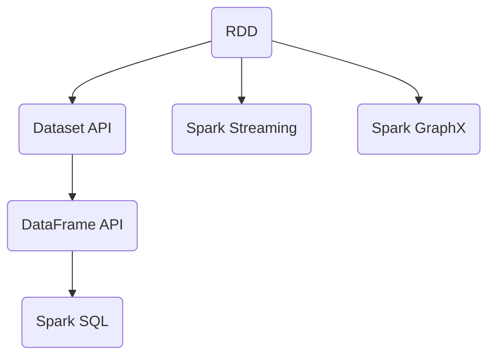

                 

## 1. 背景介绍

### 1.1 问题由来

在分布式计算领域，Spark（Spark Project）是一个快速发展的开源数据处理框架，旨在提供比Hadoop更快的数据处理能力。Spark提供了高级APIs，用于在内存中高效地处理大规模数据集。它支持多种编程语言，包括Java、Scala、Python等，并提供了RDD、DataFrame和Dataset等抽象，简化数据处理过程。Spark被广泛应用于数据挖掘、机器学习、流处理和大数据分析等场景中。

### 1.2 问题核心关键点

Spark的核心包括以下几个方面：

- **内存计算**：Spark引入了内存中的弹性分布式数据集（RDD），使得数据处理可以在内存中快速执行，从而避免了Hadoop中频繁的磁盘I/O操作，大幅提升了数据处理速度。
- **容错机制**：Spark使用弹性分布式数据集（RDD）的容错机制，确保数据处理过程中任何节点的失败都不会导致整个任务的失败。
- **高效的数据处理**：Spark提供了多种高效的数据处理操作，如MapReduce、SQL查询、机器学习算法等，适用于多种数据处理场景。
- **实时数据处理**：Spark Streaming模块提供了实时数据流处理的支持，能够处理高速数据流。
- **图处理**：Spark GraphX模块提供了图形处理的API，能够处理大规模图数据。

这些关键点构成了Spark的核心，使得它成为大数据处理领域的领导者。

## 2. 核心概念与联系

### 2.1 核心概念概述

为了深入理解Spark的工作原理，本节将介绍一些关键概念：

- **弹性分布式数据集（RDD）**：RDD是Spark中最基本的数据抽象，它是弹性分布式数据集，即在内存中的分布式集合，具有可弹性伸缩和容错的特性。
- **Spark SQL**：Spark SQL是Spark的一个模块，提供SQL查询API，用于从结构化数据中提取信息。
- **DataFrame**：DataFrame是Spark SQL中的另一个核心概念，它是基于RDD的高级数据抽象，提供了一种更加结构化、更易于使用的API。
- **Dataset API**：Dataset API是Spark中的另一个数据抽象，类似于DataFrame，但它使用了更底层的RDD，提供了更高的性能。
- **Spark Streaming**：Spark Streaming是Spark的流处理模块，提供了一种实时数据流处理的机制。
- **Spark GraphX**：Spark GraphX是Spark的图处理模块，提供了一种处理大规模图数据的API。

这些概念通过Spark的核心架构——弹性分布式数据集（RDD）连接起来，形成一个完整的Spark生态系统。

### 2.2 核心概念原理和架构的 Mermaid 流程图



这个流程图展示了Spark的核心架构，其中RDD是基础，通过不同的API进行扩展和增强，最终形成一个完整的Spark生态系统。

## 3. 核心算法原理 & 具体操作步骤

### 3.1 算法原理概述

Spark的核心算法原理基于内存计算和弹性分布式数据集（RDD）。Spark使用RDD作为数据处理的基本抽象，RDD是不可变的、可并行化的、弹性分布的，可以在多个节点上并行处理大规模数据集。Spark通过RDD的转换操作（Transformations）和动作操作（Actions）来处理数据，其中转换操作不会触发数据的持久化，而动作操作则会触发数据的持久化。

### 3.2 算法步骤详解

#### 3.2.1 RDD的创建和持久化

RDD是Spark中的核心概念，它是一个不可变的、可并行化的、弹性分布的分布式集合。RDD的创建可以通过以下方式：

```python
from pyspark import SparkContext

sc = SparkContext("local", "hello")
rdd = sc.parallelize([1, 2, 3, 4, 5])
```

RDD的持久化操作可以将RDD缓存在内存中，以提高后续操作的性能。可以使用以下方式进行持久化：

```python
rdd.persist()
```

#### 3.2.2 RDD的转换操作

Spark提供了多种转换操作，用于对数据进行转换和处理，包括Map、Filter、ReduceByKey、Join等。例如：

```python
# Map操作
rdd.map(lambda x: x*2)

# Filter操作
rdd.filter(lambda x: x % 2 == 0)

# ReduceByKey操作
rdd.reduceByKey(lambda x, y: x+y)

# Join操作
rdd1.join(rdd2)
```

#### 3.2.3 RDD的动作操作

动作操作会触发数据的持久化，并将结果返回给Spark应用程序。常用的动作操作包括Count、Collect、SaveAsTextFile等。例如：

```python
# Count操作
rdd.count()

# Collect操作
rdd.collect()

# SaveAsTextFile操作
rdd.saveAsTextFile("file:///path/to/file")
```

### 3.3 算法优缺点

Spark的优势在于：

- **内存计算**：Spark使用内存中的RDD进行计算，避免了Hadoop中频繁的磁盘I/O操作，从而大幅提升了数据处理速度。
- **弹性分布式数据集（RDD）**：Spark的RDD具有弹性分布的特性，可以在多个节点上并行处理大规模数据集。
- **多种API支持**：Spark提供了多种API，包括RDD、Dataset和DataFrame等，适应不同的数据处理场景。

Spark的缺点在于：

- **资源占用**：Spark需要较多的内存和CPU资源，对于小规模的数据处理可能不够经济。
- **学习曲线**：Spark的学习曲线较陡峭，对于初学者来说可能需要一定时间来学习。
- **分布式调度和容错机制**：Spark的分布式调度和容错机制相对复杂，需要一定的运维经验。

### 3.4 算法应用领域

Spark可以应用于多种数据处理场景，包括：

- **大数据处理**：Spark可以处理大规模数据集，适用于数据分析、数据挖掘等场景。
- **机器学习**：Spark提供了多种机器学习算法，包括分类、回归、聚类等，适用于机器学习建模。
- **流处理**：Spark Streaming模块提供了实时数据流处理的支持，适用于实时数据分析和处理。
- **图处理**：Spark GraphX模块提供了图形处理的API，适用于大规模图数据处理。
- **SQL查询**：Spark SQL提供了SQL查询API，适用于结构化数据的查询和分析。

## 4. 数学模型和公式 & 详细讲解 & 举例说明

### 4.1 数学模型构建

Spark的数学模型基于弹性分布式数据集（RDD）和分布式计算模型，可以使用Spark提供的多种API进行数据处理。

### 4.2 公式推导过程

以Spark的RDD的转换操作为例，可以使用以下公式进行推导：

$$
RDD(\{(x_1, v_1), (x_2, v_2), ..., (x_n, v_n)\}) = RDD(\{(v_1, (x_1)), (v_2, (x_2)), ..., (v_n, (x_n))\})
$$

其中，$x_i$ 是第$i$个元素，$v_i$ 是$x_i$的值，$RDD$表示弹性分布式数据集。

### 4.3 案例分析与讲解

以下是一个Spark中的RDD转换操作的例子：

```python
# 创建RDD
rdd = sc.parallelize([("apple", 3), ("banana", 2), ("orange", 4), ("grape", 1)])

# Map操作
rdd_mapped = rdd.map(lambda x: (x[1], x[0]))

# 查看结果
rdd_mapped.collect()
```

该例子中，首先将一个列表转换为RDD，然后对RDD进行Map操作，将原RDD中的元素值和键交换，最后输出结果。

## 5. 项目实践：代码实例和详细解释说明

### 5.1 开发环境搭建

为了在本地开发Spark应用程序，需要搭建一个Spark开发环境。以下是一些基本步骤：

1. 安装Java和Scala：Spark需要Java和Scala的支持，可以从Oracle官网下载Java和Scala的最新版本。
2. 安装Spark：可以从Apache Spark官网下载Spark的最新版本，并按照官方文档进行安装。
3. 配置环境变量：在环境变量中设置Spark和Scala的路径。
4. 编写Spark应用程序：使用Scala或Python编写Spark应用程序，可以使用IDE如IntelliJ IDEA或PyCharm进行开发。

### 5.2 源代码详细实现

以下是一个使用Spark进行数据处理的示例代码：

```python
from pyspark import SparkContext
from pyspark.sql import SQLContext

sc = SparkContext("local", "hello")
sqlContext = SQLContext(sc)

# 创建RDD
rdd = sc.parallelize([1, 2, 3, 4, 5])

# 转换为DataFrame
df = sqlContext.createDataFrame(rdd, ["id"])

# 查询数据
df.show()

# 保存数据
df.write.csv("file:///path/to/file.csv")
```

### 5.3 代码解读与分析

该示例代码中，首先创建了一个SparkContext和一个SQLContext，然后创建了一个RDD，并将其转换为DataFrame。接着使用DataFrame的show方法输出数据，并使用write方法将数据保存到本地文件中。

## 6. 实际应用场景

### 6.1 智能推荐系统

Spark可以应用于智能推荐系统，通过分析用户行为数据，为用户推荐个性化的商品或服务。例如，可以使用Spark对用户的历史行为数据进行分析，提取出用户的兴趣点和偏好，然后使用机器学习算法对数据进行建模，最终实现智能推荐。

### 6.2 实时数据处理

Spark Streaming模块可以应用于实时数据处理，例如在电子商务平台中，实时处理用户访问数据，分析用户的购买行为和消费习惯，从而提供个性化的推荐和广告服务。

### 6.3 大数据分析

Spark可以应用于大数据分析，例如在金融领域中，对大规模交易数据进行分析，提取市场趋势和风险因素，从而帮助企业做出更加明智的决策。

### 6.4 图处理

Spark GraphX模块可以应用于图处理，例如在社交网络中，分析用户之间的关系和互动，提取社交网络的结构和特征，从而发现潜在的社交关系和社区。

## 7. 工具和资源推荐

### 7.1 学习资源推荐

以下是一些学习Spark的优质资源：

- **《大数据技术与应用》（第二版）**：该书详细介绍了Spark的基本概念和使用方法，适合初学者入门。
- **《Spark精解》**：该书深入探讨了Spark的核心原理和高级用法，适合有一定Spark基础的读者。
- **Spark官方网站**：Spark官方网站提供了丰富的文档和教程，是学习Spark的重要资源。
- **Coursera上的《Spark for Data Engineers》课程**：该课程由Coursera和Spark提供，介绍了Spark的基本概念和使用方法。

### 7.2 开发工具推荐

以下是一些用于Spark开发的常用工具：

- **PySpark**：PySpark是Python语言的Spark API，适合Python开发者使用。
- **Scala**：Scala是Spark的官方编程语言，适合Scala开发者使用。
- **Spark Shell**：Spark Shell是Spark的交互式命令行工具，适合快速开发和调试Spark应用程序。
- **Spark UI**：Spark UI是Spark的可视化界面，可以实时监控Spark应用程序的状态和性能。

### 7.3 相关论文推荐

以下是一些Spark相关的经典论文：

- **《Spark: Cluster Computing with Fault Tolerance》**：该论文介绍了Spark的基本架构和设计思想，是Spark的奠基之作。
- **《Spark SQL: SQL Query Optimization on Distributed Data》**：该论文介绍了Spark SQL的设计思想和优化方法，是Spark SQL的奠基之作。
- **《Spark Streaming: Unified Framework for Stream Processing》**：该论文介绍了Spark Streaming的设计思想和实现方法，是Spark Streaming的奠基之作。
- **《Spark GraphX: Graph Processing in Spark》**：该论文介绍了Spark GraphX的设计思想和实现方法，是Spark GraphX的奠基之作。

## 8. 总结：未来发展趋势与挑战

### 8.1 研究成果总结

Spark作为大数据处理领域的领导者，已经在多个领域取得了广泛的应用。Spark的优势在于内存计算和弹性分布式数据集（RDD），使得数据处理速度大幅提升。

### 8.2 未来发展趋势

未来，Spark将继续保持其在数据处理领域的领导地位，有望在以下方面进行发展：

- **AI和机器学习**：Spark将与AI和机器学习深度融合，提供更加智能化、自动化的大数据处理能力。
- **流处理和实时数据处理**：Spark Streaming和Spark SQL将进一步优化，提供更加高效、稳定的实时数据处理能力。
- **图处理**：Spark GraphX将进一步发展，提供更加强大、灵活的图处理能力。
- **多云支持**：Spark将支持更多的云平台，提供更加便捷、高效的数据处理能力。

### 8.3 面临的挑战

尽管Spark已经取得了巨大的成功，但在未来发展过程中仍面临一些挑战：

- **资源消耗**：Spark需要较多的内存和CPU资源，对于小规模的数据处理可能不够经济。
- **学习曲线**：Spark的学习曲线较陡峭，对于初学者来说可能需要一定时间来学习。
- **分布式调度和容错机制**：Spark的分布式调度和容错机制相对复杂，需要一定的运维经验。
- **生态系统**：Spark需要与更多的第三方工具和框架进行集成，才能更好地支持不同场景下的数据处理需求。

### 8.4 研究展望

未来，Spark需要从以下几个方面进行研究：

- **AI和机器学习**：Spark将与AI和机器学习深度融合，提供更加智能化、自动化的大数据处理能力。
- **实时数据处理**：Spark Streaming和Spark SQL将进一步优化，提供更加高效、稳定的实时数据处理能力。
- **图处理**：Spark GraphX将进一步发展，提供更加强大、灵活的图处理能力。
- **多云支持**：Spark将支持更多的云平台，提供更加便捷、高效的数据处理能力。

## 9. 附录：常见问题与解答

**Q1: Spark和Hadoop有何区别？**

A: Spark和Hadoop都是大数据处理框架，但它们有着本质的区别：

- **内存计算**：Spark使用内存中的弹性分布式数据集（RDD）进行计算，而Hadoop依赖磁盘I/O操作，速度较慢。
- **并行计算**：Spark使用弹性分布式数据集（RDD）进行并行计算，而Hadoop使用MapReduce进行并行计算。
- **实时处理**：Spark Streaming提供了实时数据流处理的支持，而Hadoop不提供实时处理能力。
- **API支持**：Spark提供了多种API，包括RDD、Dataset和DataFrame等，而Hadoop只有MapReduce一种API。

**Q2: Spark和Flink有何区别？**

A: Spark和Flink都是分布式计算框架，但它们有着本质的区别：

- **内存计算**：Spark使用内存中的弹性分布式数据集（RDD）进行计算，而Flink使用内存中的数据流进行计算。
- **状态管理**：Spark的状态管理相对简单，而Flink的状态管理复杂，支持更多的状态存储和查询方式。
- **API支持**：Spark提供了多种API，包括RDD、Dataset和DataFrame等，而Flink提供了流处理API和批处理API。
- **容错机制**：Spark的容错机制相对简单，而Flink的容错机制复杂，支持更高级的容错策略。

**Q3: Spark和Storm有何区别？**

A: Spark和Storm都是分布式计算框架，但它们有着本质的区别：

- **内存计算**：Spark使用内存中的弹性分布式数据集（RDD）进行计算，而Storm使用内存中的数据流进行计算。
- **状态管理**：Spark的状态管理相对简单，而Storm的状态管理复杂，支持更多的状态存储和查询方式。
- **API支持**：Spark提供了多种API，包括RDD、Dataset和DataFrame等，而Storm只提供了实时数据流处理的API。
- **容错机制**：Spark的容错机制相对简单，而Storm的容错机制复杂，支持更高级的容错策略。

总之，Spark是一个功能强大的分布式计算框架，适用于大数据处理和实时数据流处理等场景。未来，Spark将在AI和机器学习、实时数据处理、图处理等多方面进行发展，提供更加高效、智能的大数据处理能力。

