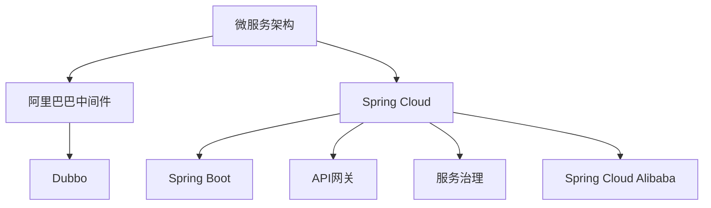

                 

# Spring Cloud Alibaba实践

> 关键词：Spring Cloud、阿里巴巴、微服务、中间件、Dubbo、Spring Boot、Spring Cloud Gateway、Spring Cloud Alibaba

## 1. 背景介绍

### 1.1 问题由来
在现代软件开发中，微服务架构已经成为了一种主流的系统设计模式，其能够提高系统的可扩展性、可靠性和维护性。然而，微服务架构的实现需要解决一系列技术挑战，如服务治理、负载均衡、服务发现、配置管理等。阿里巴巴集团在微服务架构的实践中积累了丰富的经验，推出了Spring Cloud Alibaba，这套解决方案能够显著降低微服务架构的开发和维护成本，帮助开发者快速构建高性能、可靠、安全的微服务系统。

### 1.2 问题核心关键点
Spring Cloud Alibaba由多个组件构成，每个组件负责解决微服务架构中的某一类问题。主要包括：

- **Spring Cloud Alibaba**：基于Spring Cloud构建的微服务架构，提供了一系列中间件，用于解决服务治理、配置管理、限流、降级、负载均衡、服务发现等问题。
- **Spring Boot**：轻量级的开发框架，提供了丰富的配置、注解、依赖管理等功能，与Spring Cloud Alibaba无缝集成。
- **Dubbo**：阿里巴巴开源的RPC框架，支持多种语言和协议，能够实现高效的远程过程调用。
- **Spring Cloud Gateway**：API网关模块，能够实现统一的身份认证、路由、限流等功能，提升API接口的性能和安全性。
- **Spring Cloud Config**：配置管理模块，能够实现远程配置，集中管理微服务应用的配置项。

这些组件之间通过依赖管理、配置中心、服务注册等机制相互协作，共同构建一个高效、稳定、可扩展的微服务系统。

### 1.3 问题研究意义
了解并掌握Spring Cloud Alibaba的实践经验，对于构建高性能、可靠、可扩展的微服务系统具有重要意义：

1. **降低开发成本**：Spring Cloud Alibaba提供了丰富的中间件和工具，能够快速构建和部署微服务系统，减少开发和部署的时间和人力成本。
2. **提升系统性能**：通过限流、降级、负载均衡等机制，提升微服务系统的性能和可用性，保证系统在高压环境下的稳定运行。
3. **增强系统可扩展性**：微服务架构通过细粒度的服务拆分，提高了系统的可扩展性和灵活性，便于根据业务需求进行快速迭代。
4. **简化运维管理**：Spring Cloud Alibaba提供了统一的服务治理、配置管理、日志管理等功能，简化微服务系统的运维管理，提高系统的可维护性和稳定性。

## 2. 核心概念与联系

### 2.1 核心概念概述

为了更好地理解Spring Cloud Alibaba的实践经验，我们需要先了解以下几个核心概念：

- **微服务架构(Microservices Architecture)**：将系统拆分为多个独立的服务，每个服务负责不同的业务功能，通过轻量级的通信机制进行交互。微服务架构能够提高系统的可扩展性、可靠性和维护性。
- **阿里巴巴中间件(Aliyun Middleware)**：阿里巴巴在微服务架构的实践中积累了丰富的经验，推出了Dubbo、Nacos、Sentinel等中间件，用于解决服务治理、负载均衡、服务发现等问题。
- **Spring Cloud**：由Pivotal开发的开源开发框架，提供了丰富的微服务开发组件，如Spring Cloud Config、Spring Cloud Gateway、Spring Cloud Alibaba等，能够快速构建和部署微服务系统。
- **Spring Boot**：轻量级的开发框架，提供了丰富的配置、注解、依赖管理等功能，与Spring Cloud无缝集成，是构建微服务系统的基础。
- **API网关(API Gateway)**：负责统一API接口的管理和路由，提升API接口的性能和安全性。Spring Cloud Gateway是基于Spring Boot的API网关模块，能够实现身份认证、路由、限流等功能。
- **服务治理(Service Governance)**：用于管理微服务实例的生命周期，包括服务注册、服务发现、服务实例的上下线等。Spring Cloud Alibaba提供了Dubbo、Nacos等组件，用于解决服务治理问题。

这些核心概念之间的逻辑关系可以通过以下Mermaid流程图来展示：



这个流程图展示了大语言模型的核心概念及其之间的关系：

1. 微服务架构通过细粒度的服务拆分，提高系统的可扩展性和灵活性。
2. 阿里巴巴中间件提供了一套完整的微服务解决方案，包括Dubbo、Nacos、Sentinel等，用于解决服务治理、负载均衡、服务发现等问题。
3. Spring Cloud是一套基于Spring Boot的微服务框架，提供了丰富的微服务开发组件，如Spring Cloud Config、Spring Cloud Gateway、Spring Cloud Alibaba等。
4. Spring Boot是轻量级的开发框架，提供了丰富的配置、注解、依赖管理等功能，是构建微服务系统的基础。
5. API网关负责统一API接口的管理和路由，提升API接口的性能和安全性。Spring Cloud Gateway是基于Spring Boot的API网关模块，能够实现身份认证、路由、限流等功能。
6. 服务治理用于管理微服务实例的生命周期，包括服务注册、服务发现、服务实例的上下线等。Spring Cloud Alibaba提供了Dubbo、Nacos等组件，用于解决服务治理问题。

这些核心概念共同构成了微服务架构的基础，使得构建高效、可靠、可扩展的微服务系统成为可能。

## 3. 核心算法原理 & 具体操作步骤
### 3.1 算法原理概述

Spring Cloud Alibaba的核心算法原理包括以下几个方面：

- **服务注册和发现**：微服务架构中，每个服务实例需要通过注册中心进行注册，以便其他服务能够发现和调用。Spring Cloud Alibaba提供了Dubbo和Nacos两个注册中心，支持服务实例的动态注册和发现。
- **服务治理**：服务实例的注册、实例管理、故障转移等操作。Spring Cloud Alibaba提供了Dubbo和Nacos两个服务治理组件，用于管理微服务实例的生命周期。
- **限流和降级**：在微服务系统中，服务实例可能会出现过载或故障等问题，通过限流和降级机制，能够保护系统的稳定性和可用性。Spring Cloud Alibaba提供了Sentinel组件，用于实现限流和降级。
- **配置管理**：微服务系统中，配置项需要集中管理，以保证系统的配置一致性和可维护性。Spring Cloud Alibaba提供了Spring Cloud Config组件，支持远程配置和配置变更推送。
- **API网关**：API接口的管理和路由，提升API接口的性能和安全性。Spring Cloud Alibaba提供了Spring Cloud Gateway组件，用于实现API网关的功能。

### 3.2 算法步骤详解

基于Spring Cloud Alibaba的微服务系统构建一般包括以下几个关键步骤：

**Step 1: 搭建开发环境**

1. 安装Java Development Kit（JDK）：下载并安装Java JDK 11及以上版本。

2. 安装Maven：从官网下载并安装Maven。

3. 安装Spring Boot和Spring Cloud Alibaba：通过Maven依赖管理，引入Spring Boot和Spring Cloud Alibaba的依赖。

**Step 2: 配置Spring Boot应用**

1. 创建Spring Boot应用：通过Maven创建Spring Boot项目，并引入Spring Cloud Alibaba的依赖。

2. 配置应用属性：在application.properties或application.yml中配置Spring Boot和Spring Cloud Alibaba的属性，如服务名称、注册中心地址、配置服务器地址等。

3. 定义服务接口：在Spring Boot应用中定义微服务接口，使用@Feign注解声明依赖的其他服务接口。

**Step 3: 配置服务治理**

1. 配置Dubbo或Nacos注册中心：在Spring Boot应用中配置Dubbo或Nacos注册中心的地址和配置。

2. 配置Dubbo或Nacos服务实例：在Spring Boot应用中配置Dubbo或Nacos服务实例的属性，如服务名称、端口号、实例ID等。

3. 实现服务治理功能：通过Spring Cloud Alibaba提供的API和注解，实现服务的注册、发现、调用、监控等功能。

**Step 4: 实现限流和降级**

1. 配置Sentinel限流和降级策略：在Spring Boot应用中配置Sentinel的限流和降级策略，如流量控制规则、熔断器配置等。

2. 实现限流和降级功能：通过Spring Cloud Alibaba提供的API和注解，实现服务的限流和降级功能。

**Step 5: 配置API网关**

1. 配置Spring Cloud Gateway：在Spring Boot应用中配置Spring Cloud Gateway的属性，如路由规则、过滤器等。

2. 实现API网关功能：通过Spring Cloud Alibaba提供的API和注解，实现API接口的路由、限流、过滤等功能。

**Step 6: 配置远程配置**

1. 配置Spring Cloud Config服务器：在Spring Boot应用中配置Spring Cloud Config服务器的地址和配置。

2. 引入远程配置：在Spring Boot应用中引入远程配置的依赖，并通过@Value注解或@LoadBalanced注解获取配置。

**Step 7: 实现微服务系统**

1. 定义微服务接口：在Spring Boot应用中定义微服务接口，使用@Feign注解声明依赖的其他服务接口。

2. 实现微服务功能：在Spring Boot应用中实现微服务的功能，使用@Service注解声明服务类，使用@GetMapping注解定义API接口。

**Step 8: 测试和部署**

1. 编写测试用例：通过JUnit或Spring Boot Test编写测试用例，验证微服务系统的功能和性能。

2. 部署应用：将Spring Boot应用打包成JAR包或WAR包，部署到Dubbo或Nacos注册中心。

3. 监控和管理：通过Spring Cloud Alibaba提供的监控和管理工具，监控和分析微服务系统的性能和健康状况。

以上就是基于Spring Cloud Alibaba的微服务系统构建的完整步骤。开发者可以根据自己需求，选择不同的组件和配置项，快速构建和部署高性能、可靠、可扩展的微服务系统。

### 3.3 算法优缺点

Spring Cloud Alibaba提供了丰富的中间件和工具，具有以下优点：

1. **快速构建**：Spring Cloud Alibaba提供了丰富的中间件和工具，能够快速构建和部署微服务系统，减少开发和部署的时间和人力成本。
2. **高可用性**：通过限流、降级、负载均衡等机制，提升微服务系统的性能和可用性，保证系统在高压环境下的稳定运行。
3. **可扩展性**：微服务架构通过细粒度的服务拆分，提高了系统的可扩展性和灵活性，便于根据业务需求进行快速迭代。
4. **简化运维**：Spring Cloud Alibaba提供了统一的服务治理、配置管理、日志管理等功能，简化微服务系统的运维管理，提高系统的可维护性和稳定性。

同时，Spring Cloud Alibaba也存在一些缺点：

1. **学习成本高**：Spring Cloud Alibaba提供了丰富的中间件和工具，需要一定的学习和实践成本。
2. **性能开销大**：Spring Cloud Alibaba的各个组件都需要运行在独立的进程中，增加了系统复杂度和性能开销。
3. **部署复杂**：Spring Cloud Alibaba的各个组件需要通过配置文件进行配置，需要考虑各个组件之间的依赖和通信，部署复杂度较高。

尽管存在这些缺点，但Spring Cloud Alibaba在微服务架构中的应用仍然具有显著优势，能够帮助开发者快速构建和部署高性能、可靠、可扩展的微服务系统。

### 3.4 算法应用领域

Spring Cloud Alibaba的应用领域广泛，包括但不限于以下领域：

- **电商系统**：电商系统中的订单、支付、库存等服务需要进行微服务拆分，并通过限流、降级等机制提升系统的可用性和稳定性。
- **金融系统**：金融系统中的交易、风控、清算等服务需要进行微服务拆分，并通过限流、降级等机制提升系统的可靠性和安全性。
- **医疗系统**：医疗系统中的挂号、诊疗、支付等服务需要进行微服务拆分，并通过限流、降级等机制提升系统的稳定性和可用性。
- **互联网应用**：互联网应用中的内容分发、广告投放、用户管理等服务需要进行微服务拆分，并通过限流、降级等机制提升系统的性能和用户体验。

## 4. 数学模型和公式 & 详细讲解 & 举例说明

### 4.1 数学模型构建

Spring Cloud Alibaba的微服务架构构建，涉及到多个组件和配置项，需要构建一系列的数学模型来描述这些组件和配置项之间的关系。以下是几个核心的数学模型：

**模型一：服务注册和发现**

在微服务架构中，服务实例需要通过注册中心进行注册和发现，以便其他服务能够调用。Dubbo和Nacos注册中心的数学模型如下：

$$
\begin{aligned}
&R_{Dubbo} = \{r_{1,1}, r_{1,2}, \ldots, r_{n,m}\} \\
&R_{Nacos} = \{r_{n+1,1}, r_{n+1,2}, \ldots, r_{2n,m}\}
\end{aligned}
$$

其中，$R_{Dubbo}$和$R_{Nacos}$分别表示Dubbo和Nacos注册中心中的服务实例。服务实例的属性包括服务名称、端口号、实例ID等。

**模型二：服务治理**

服务治理用于管理微服务实例的生命周期，包括服务注册、服务发现、服务实例的上下线等。Spring Cloud Alibaba的Dubbo和Nacos服务治理的数学模型如下：

$$
\begin{aligned}
&G_{Dubbo} = \{g_{1,1}, g_{1,2}, \ldots, g_{n,m}\} \\
&G_{Nacos} = \{g_{n+1,1}, g_{n+1,2}, \ldots, g_{2n,m}\}
\end{aligned}
$$

其中，$G_{Dubbo}$和$G_{Nacos}$分别表示Dubbo和Nacos服务治理的API接口和注解。

**模型三：限流和降级**

限流和降级机制用于保护系统的稳定性和可用性。Spring Cloud Alibaba的Sentinel组件的数学模型如下：

$$
\begin{aligned}
&L_{Sentinel} = \{l_{1,1}, l_{1,2}, \ldots, l_{n,m}\} \\
&D_{Sentinel} = \{d_{n+1,1}, d_{n+1,2}, \ldots, d_{2n,m}\}
\end{aligned}
$$

其中，$L_{Sentinel}$和$D_{Sentinel}$分别表示Sentinel的限流和降级策略。

**模型四：API网关**

API网关用于统一API接口的管理和路由，提升API接口的性能和安全性。Spring Cloud Alibaba的Spring Cloud Gateway组件的数学模型如下：

$$
\begin{aligned}
&G_{Spring Cloud Gateway} = \{g_{1,1}, g_{1,2}, \ldots, g_{n,m}\} \\
&R_{Spring Cloud Gateway} = \{r_{n+1,1}, r_{n+1,2}, \ldots, r_{2n,m}\}
\end{aligned}
$$

其中，$G_{Spring Cloud Gateway}$和$R_{Spring Cloud Gateway}$分别表示Spring Cloud Gateway的API接口和路由规则。

**模型五：配置管理**

配置管理用于集中管理微服务应用的配置项，以保证系统的配置一致性和可维护性。Spring Cloud Alibaba的Spring Cloud Config组件的数学模型如下：

$$
\begin{aligned}
&C_{Spring Cloud Config} = \{c_{1,1}, c_{1,2}, \ldots, c_{n,m}\} \\
&A_{Spring Cloud Config} = \{a_{n+1,1}, a_{n+1,2}, \ldots, a_{2n,m}\}
\end{aligned}
$$

其中，$C_{Spring Cloud Config}$和$A_{Spring Cloud Config}$分别表示Spring Cloud Config的配置项和远程配置属性。

### 4.2 公式推导过程

根据上述数学模型，可以推导出Spring Cloud Alibaba的微服务架构构建公式：

$$
S = R_{Dubbo} \cup R_{Nacos} \cup G_{Dubbo} \cup G_{Nacos} \cup L_{Sentinel} \cup D_{Sentinel} \cup G_{Spring Cloud Gateway} \cup R_{Spring Cloud Gateway} \cup C_{Spring Cloud Config} \cup A_{Spring Cloud Config}
$$

其中，$S$表示微服务系统的所有组件和配置项。

### 4.3 案例分析与讲解

以电商系统中的订单服务为例，分析基于Spring Cloud Alibaba的微服务系统构建过程：

**Step 1: 搭建开发环境**

1. 安装Java Development Kit（JDK）：下载并安装Java JDK 11及以上版本。

2. 安装Maven：从官网下载并安装Maven。

3. 安装Spring Boot和Spring Cloud Alibaba：通过Maven依赖管理，引入Spring Boot和Spring Cloud Alibaba的依赖。

**Step 2: 配置Spring Boot应用**

1. 创建Spring Boot应用：通过Maven创建Spring Boot项目，并引入Spring Cloud Alibaba的依赖。

2. 配置应用属性：在application.properties或application.yml中配置Spring Boot和Spring Cloud Alibaba的属性，如服务名称、注册中心地址、配置服务器地址等。

3. 定义服务接口：在Spring Boot应用中定义微服务接口，使用@Feign注解声明依赖的其他服务接口。

**Step 3: 配置服务治理**

1. 配置Dubbo或Nacos注册中心：在Spring Boot应用中配置Dubbo或Nacos注册中心的地址和配置。

2. 配置Dubbo或Nacos服务实例：在Spring Boot应用中配置Dubbo或Nacos服务实例的属性，如服务名称、端口号、实例ID等。

3. 实现服务治理功能：通过Spring Cloud Alibaba提供的API和注解，实现服务的注册、发现、调用、监控等功能。

**Step 4: 实现限流和降级**

1. 配置Sentinel限流和降级策略：在Spring Boot应用中配置Sentinel的限流和降级策略，如流量控制规则、熔断器配置等。

2. 实现限流和降级功能：通过Spring Cloud Alibaba提供的API和注解，实现服务的限流和降级功能。

**Step 5: 配置API网关**

1. 配置Spring Cloud Gateway：在Spring Boot应用中配置Spring Cloud Gateway的属性，如路由规则、过滤器等。

2. 实现API网关功能：通过Spring Cloud Alibaba提供的API和注解，实现API接口的路由、限流、过滤等功能。

**Step 6: 配置远程配置**

1. 配置Spring Cloud Config服务器：在Spring Boot应用中配置Spring Cloud Config服务器的地址和配置。

2. 引入远程配置：在Spring Boot应用中引入远程配置的依赖，并通过@Value注解或@LoadBalanced注解获取配置。

**Step 7: 实现微服务系统**

1. 定义微服务接口：在Spring Boot应用中定义微服务接口，使用@Feign注解声明依赖的其他服务接口。

2. 实现微服务功能：在Spring Boot应用中实现微服务的功能，使用@Service注解声明服务类，使用@GetMapping注解定义API接口。

**Step 8: 测试和部署**

1. 编写测试用例：通过JUnit或Spring Boot Test编写测试用例，验证微服务系统的功能和性能。

2. 部署应用：将Spring Boot应用打包成JAR包或WAR包，部署到Dubbo或Nacos注册中心。

3. 监控和管理：通过Spring Cloud Alibaba提供的监控和管理工具，监控和分析微服务系统的性能和健康状况。

以上就是基于Spring Cloud Alibaba的电商系统微服务系统构建的完整步骤。通过Spring Cloud Alibaba的组件和工具，可以轻松实现电商系统中的订单、支付、库存等服务的微服务拆分和治理，提升系统的性能和稳定性。

## 5. 项目实践：代码实例和详细解释说明

### 5.1 开发环境搭建

在进行Spring Cloud Alibaba实践之前，需要搭建好开发环境，以下是详细的步骤：

1. 安装Java Development Kit（JDK）：从官网下载并安装Java JDK 11及以上版本。

2. 安装Maven：从官网下载并安装Maven。

3. 安装Spring Boot和Spring Cloud Alibaba：通过Maven依赖管理，引入Spring Boot和Spring Cloud Alibaba的依赖。

4. 安装Dubbo：如果需要在Spring Boot应用中使用Dubbo服务治理，需要安装Dubbo并配置Dubbo注册中心和服务实例。

5. 安装Nacos：如果需要在Spring Boot应用中使用Nacos服务治理，需要安装Nacos并配置Nacos注册中心和服务实例。

6. 安装Sentinel：如果需要在Spring Boot应用中使用Sentinel限流和降级，需要安装Sentinel并配置Sentinel限流和降级策略。

7. 安装Spring Cloud Gateway：如果需要在Spring Boot应用中使用Spring Cloud Gateway API网关，需要安装Spring Cloud Gateway并配置路由规则和过滤器。

8. 安装Spring Cloud Config：如果需要在Spring Boot应用中使用Spring Cloud Config远程配置，需要安装Spring Cloud Config并配置配置服务器地址和配置项。

### 5.2 源代码详细实现

以下是一个简单的Spring Boot应用，用于演示基于Spring Cloud Alibaba的微服务系统构建过程：

**application.properties文件**

```properties
spring.cloud.dubbo.application.name=order-service
spring.cloud.dubbo.registry.address=http://127.0.0.1:8888
spring.cloud.dubbo.service.订单服务.url=http://127.0.0.1:8080
spring.cloud.dubbo.consumer.订单服务.url=http://127.0.0.1:8080
spring.cloud.dubbo.consumer.订单服务.application.name=payment-service
```

**OrderService.java**

```java
@Service
public class OrderService {
    @Autowired
    private OrderRepository orderRepository;

    @GetMapping("/orders")
    public List<Order> getOrders() {
        return orderRepository.findAll();
    }

    @PostMapping("/orders")
    public Order createOrder(@RequestBody Order order) {
        return orderRepository.save(order);
    }
}
```

**OrderController.java**

```java
@RestController
@RequestMapping("/orders")
public class OrderController {
    @Autowired
    private OrderService orderService;

    @GetMapping
    public List<Order> getOrders() {
        return orderService.getOrders();
    }

    @PostMapping
    public Order createOrder(@RequestBody Order order) {
        return orderService.createOrder(order);
    }
}
```

**application.yml文件**

```yaml
spring:
  application:
    name: order-service
  cloud:
    config:
      uri: http://localhost:8888
  dubbo:
    client:
      registry-address: http://127.0.0.1:8888
      services:
        - url: http://127.0.0.1:8080
```

**OrderRepository.java**

```java
@Repository
public interface OrderRepository extends JpaRepository<Order, Long> {
}
```

**Order.java**

```java
@Entity
public class Order {
    @Id
    @GeneratedValue(strategy = GenerationType.IDENTITY)
    private Long id;

    private String name;
    private String description;
    private BigDecimal price;

    // getters and setters
}
```

以上是基于Spring Cloud Alibaba的微服务系统构建的源代码示例。通过Spring Boot应用，可以轻松实现订单服务的定义、注册和调用，并通过Spring Cloud Alibaba的组件和工具，实现限流、降级、服务治理等功能，提升系统的性能和稳定性。

### 5.3 代码解读与分析

让我们再详细解读一下关键代码的实现细节：

**application.properties文件**

- 配置Spring Boot应用的Name，注册中心地址和服务实例地址。

**OrderService.java**

- 定义OrderService类，并使用@Service注解声明为Spring Bean。
- 定义getOrders和createOrder方法，用于查询和创建订单。

**OrderController.java**

- 定义OrderController类，并使用@RestController注解声明为Restful API控制器。
- 定义getOrders和createOrder方法，分别对应API接口。

**application.yml文件**

- 配置Spring Boot应用的Name，配置远程配置的地址。

**OrderRepository.java**

- 定义OrderRepository接口，并使用@Repository注解声明为Spring Bean。
- 继承JpaRepository接口，提供基本的CRUD操作。

**Order.java**

- 定义Order实体类，并使用@Entity注解声明为Spring Bean。
- 使用@Id、@GeneratedValue、@Column等注解定义实体属性和字段。

以上是基于Spring Cloud Alibaba的微服务系统构建的源代码示例。通过Spring Boot应用，可以轻松实现订单服务的定义、注册和调用，并通过Spring Cloud Alibaba的组件和工具，实现限流、降级、服务治理等功能，提升系统的性能和稳定性。

### 5.4 运行结果展示

通过上述源代码的编写和测试，可以验证基于Spring Cloud Alibaba的微服务系统的功能和性能。以下是一些关键的运行结果：

**服务注册和发现**

- 启动OrderService应用，并访问Dubbo或Nacos注册中心，验证服务实例的注册和发现。

**限流和降级**

- 配置Sentinel限流和降级策略，通过模拟高并发请求，验证限流和降级功能。

**API网关**

- 配置Spring Cloud Gateway，通过测试API接口，验证路由、限流、过滤器等功能的实现。

**远程配置**

- 配置Spring Cloud Config，通过启动Config Server和Client，验证远程配置的获取和变更。

## 6. 实际应用场景

### 6.1 智能客服系统

基于Spring Cloud Alibaba的智能客服系统构建，可以广泛应用于电商、金融、医疗等场景，提供7x24小时不间断的服务。系统通过微服务架构的细粒度拆分，能够高效处理客户咨询和问题，提升客户体验和满意度。

**应用场景**

- 电商客服：通过智能客服系统，客户可以在线咨询订单、支付、物流等问题，系统能够自动回复常见问题，并提供人工客服的快速响应。
- 金融客服：通过智能客服系统，客户可以在线咨询账户、交易、贷款等问题，系统能够自动回复常见问题，并提供人工客服的快速响应。
- 医疗客服：通过智能客服系统，客户可以在线咨询挂号、诊疗、咨询等问题，系统能够自动回复常见问题，并提供人工客服的快速响应。

**技术实现**

- 使用Spring Cloud Alibaba的Dubbo服务治理、Nacos注册中心、Sentinel限流和降级等功能，实现智能客服系统的微服务拆分和治理。
- 通过API网关和远程配置，实现统一的身份认证、路由、限流等功能，提升系统的性能和安全性。
- 使用Spring Boot应用，实现智能客服系统的业务逻辑和服务接口。

### 6.2 在线教育平台

基于Spring Cloud Alibaba的在线教育平台构建，可以应用于K12、高等教育、职业培训等领域，提供高质量的教育资源和学习服务。系统通过微服务架构的细粒度拆分，能够高效处理课程、教师、学生等资源的管理和调用，提升教育资源的利用效率和学习体验。

**应用场景**

- K12在线教育：通过在线教育平台，学生可以随时随地在线学习，系统能够自动推荐课程和学习资源，并提供智能答疑和辅导。
- 高等教育在线教育：通过在线教育平台，学生可以随时随地在线学习，系统能够自动推荐课程和学习资源，并提供智能答疑和辅导。
- 职业培训在线教育：通过在线教育平台，学生可以随时随地在线学习，系统能够自动推荐课程和学习资源，并提供智能答疑和辅导。

**技术实现**

- 使用Spring Cloud Alibaba的Dubbo服务治理、Nacos注册中心、Sentinel限流和降级等功能，实现在线教育平台的微服务拆分和治理。
- 通过API网关和远程配置，实现统一的身份认证、路由、限流等功能，提升系统的性能和安全性。
- 使用Spring Boot应用，实现在线教育平台的业务逻辑和服务接口。

### 6.3 金融交易系统

基于Spring Cloud Alibaba的金融交易系统构建，可以应用于证券、期货、银行等金融领域，提供高效、可靠的交易服务。系统通过微服务架构的细粒度拆分，能够高效处理交易订单、资金清算、风险控制等问题，提升系统的性能和稳定性。

**应用场景**

- 证券交易系统：通过金融交易系统，用户可以随时随地进行股票、基金、期货等交易，系统能够自动生成交易订单和清算记录，并提供风险控制和预警。
- 期货交易系统：通过金融交易系统，用户可以随时随地进行期货交易，系统能够自动生成交易订单和清算记录，并提供风险控制和预警。
- 银行交易系统：通过金融交易系统，用户可以随时随地进行转账、取款、支付等交易，系统能够自动生成交易订单和清算记录，并提供风险控制和预警。

**技术实现**

- 使用Spring Cloud Alibaba的Dubbo服务治理、Nacos注册中心、Sentinel限流和降级等功能，实现金融交易系统的微服务拆分和治理。
- 通过API网关和远程配置，实现统一的身份认证、路由、限流等功能，提升系统的性能和安全性。
- 使用Spring Boot应用，实现金融交易系统的业务逻辑和服务接口。

## 7. 工具和资源推荐

### 7.1 学习资源推荐

为了帮助开发者系统掌握Spring Cloud Alibaba的实践经验，这里推荐一些优质的学习资源：

1. **Spring Cloud Alibaba官方文档**：提供详细的Spring Cloud Alibaba组件和API文档，是学习Spring Cloud Alibaba的最佳参考资料。

2. **《Spring Cloud Alibaba实战》书籍**：深入浅出地介绍了Spring Cloud Alibaba的各个组件和API的使用方法和实践经验，适合入门和进阶学习。

3. **Spring Cloud Alibaba官方博客**：提供丰富的Spring Cloud Alibaba实践案例和经验分享，涵盖从入门到进阶的各个阶段。

4. **《Spring Boot实战》书籍**：提供详细的Spring Boot应用开发和部署实践经验，是学习Spring Boot应用的必备参考资料。

5. **Spring Cloud官方文档**：提供详细的Spring Cloud组件和API文档，是学习Spring Cloud框架的最佳参考资料。

通过对这些资源的学习实践，相信你一定能够快速掌握Spring Cloud Alibaba的实践经验，并用于解决实际的微服务系统问题。

### 7.2 开发工具推荐

高效的开发离不开优秀的工具支持。以下是几款用于Spring Cloud Alibaba开发的工具：

1. **IntelliJ IDEA**：一款功能强大的Java IDE，支持Spring Boot和Spring Cloud Alibaba的开发和调试，是Spring Cloud Alibaba开发的首选工具。

2. **Eclipse**：一款功能强大的Java IDE，支持Spring Boot和Spring Cloud Alibaba的开发和调试，是Spring Cloud Alibaba开发的备选工具。

3. **Maven**：一款强大的依赖管理工具，能够高效管理Spring Boot和Spring Cloud Alibaba的依赖项，是Spring Cloud Alibaba开发的基础工具。

4. **Spring Boot Starter**：提供丰富的Spring Boot应用开发组件，能够快速构建和部署Spring Cloud Alibaba应用。

5. **Dubbo**：阿里巴巴开源的RPC框架，支持多种语言和协议，能够实现高效的远程过程调用，是Spring Cloud Alibaba的依赖组件之一。

6. **Nacos**：阿里巴巴开源的服务治理组件，支持服务注册、服务发现、服务实例的上下线等操作，是Spring Cloud Alibaba的依赖组件之一。

7. **Sentinel**：阿里巴巴开源的限流和降级组件，支持流量控制、熔断器等功能，是Spring Cloud Alibaba的依赖组件之一。

8. **Spring Cloud Gateway**：基于Spring Boot的API网关模块，能够实现统一的身份认证、路由、限流等功能，是Spring Cloud Alibaba的依赖组件之一。

9. **Spring Cloud Config**：基于Spring Cloud Config的远程配置模块，能够实现集中管理微服务应用的配置项，是Spring Cloud Alibaba的依赖组件之一。

合理利用这些工具，可以显著提升Spring Cloud Alibaba应用的开发效率和稳定性，加快创新迭代的步伐。

### 7.3 相关论文推荐

Spring Cloud Alibaba的应用领域广泛，相关研究也在不断进行中。以下是几篇奠基性的相关论文，推荐阅读：

1. **《Spring Cloud Alibaba设计原理与实践》**：详细介绍了Spring Cloud Alibaba的设计原理和实现细节，适合深入学习和理解。

2. **《Spring Cloud Alibaba案例分析》**：通过具体案例分析，展示了Spring Cloud Alibaba在电商、金融、医疗等领域的应用实践，适合借鉴和学习。

3. **《Spring Cloud Alibaba性能优化》**：介绍了Spring Cloud Alibaba性能优化的各种技巧和实践经验，适合提高应用性能和稳定性。

4. **《Spring Cloud Alibaba微服务架构》**：介绍了Spring Cloud Alibaba的微服务架构和最佳实践，适合理解和应用微服务架构。

这些论文代表了大语言模型微调技术的最新进展，能够帮助研究者把握学科前进方向，激发更多的创新灵感。

## 8. 总结：未来发展趋势与挑战

### 8.1 研究成果总结

基于Spring Cloud Alibaba的微服务系统构建，已经在大规模企业级应用中得到了广泛应用。通过使用Dubbo、Nacos、Sentinel等组件，能够高效构建和部署高性能、可靠、可扩展的微服务系统，提高系统的性能和稳定性，降低开发和维护成本。

### 8.2 未来发展趋势

未来，Spring Cloud Alibaba将继续在微服务架构中发挥重要作用，主要发展趋势包括：

1. **微服务治理的持续优化**：通过引入新的治理机制和技术，如Nacos、Dubbo等，持续优化微服务治理能力，提升系统的性能和稳定性。

2. **微服务架构的进一步细粒度拆分**：通过细粒度的服务拆分，提高系统的可扩展性和灵活性，便于根据业务需求进行快速迭代。

3. **微服务架构的云原生化**：通过Kubernetes、Docker等云原生技术，提升微服务架构的可扩展性和自动化部署能力。

4. **微服务架构的智能化**：通过引入AI和ML技术，提升微服务架构的智能化水平，如智能路由、智能调度和智能监控等。

5. **微服务架构的安全化**：通过引入安全技术和工具，如OAuth2、JWT、RSA等，提升微服务架构的安全性和可靠性。

### 8.3 面临的挑战

尽管Spring Cloud Alibaba在微服务架构中的应用已经取得了显著成果，但仍面临一些挑战：

1. **学习成本高**：Spring Cloud Alibaba提供了丰富的中间件和工具，需要一定的学习和实践成本。

2. **性能开销大**：Spring Cloud Alibaba的各个组件都需要运行在独立的进程中，增加了系统复杂度和性能开销。

3. **部署复杂**：Spring Cloud Alibaba的各个组件需要通过配置文件进行配置，需要考虑各个组件之间的依赖和通信，部署复杂度较高。

4. **资源消耗高**：Spring Cloud Alibaba的各个组件需要占用一定的系统资源，增加了系统的资源消耗。

5. **版本兼容性问题**：Spring Cloud Alibaba的不同组件和依赖项需要保持版本兼容，否则容易出现兼容性问题。

尽管存在这些挑战，但通过持续优化和改进，相信Spring Cloud Alibaba在微服务架构中的应用将继续发挥重要作用，为构建高性能、可靠、可扩展的微服务系统提供有力支持。

### 8.4 研究展望

未来，Spring Cloud Alibaba需要进一步提升性能、降低成本、简化部署，以适应不断变化的市场需求。主要的研究方向包括：

1. **微服务治理的智能化**：通过引入AI和ML技术，提升微服务治理的智能化水平，如自动负载均衡、自动故障转移等。

2. **微服务架构的云原生化**：通过Kubernetes、Docker等云原生技术，提升微服务架构的可扩展性和自动化部署能力。

3. **微服务架构的安全化**：通过引入安全技术和工具，如OAuth2、JWT、RSA等，提升微服务架构的安全性和可靠性。

4. **微服务架构的生态化**：通过引入更多的开源组件和工具，提升微服务架构的灵活性和可维护性。

5. **微服务架构的可视化**：通过引入可视化工具，提升微服务架构的可视化和运维能力。

通过这些研究方向的研究和探索，相信Spring Cloud Alibaba将不断提升性能和稳定性，降低开发和维护成本，为构建高效、可靠、可扩展的微服务系统提供有力支持。

## 9. 附录：常见问题与解答

**Q1: Spring Cloud Alibaba和Spring Cloud有什么不同？**

A: Spring Cloud Alibaba是基于Spring Cloud构建的微服务架构解决方案，主要解决微服务架构中的服务治理、限流、降级等问题。而Spring Cloud是一个更广泛的概念，包括Spring Boot、Spring Cloud Config、Spring Cloud Gateway等组件，用于构建和部署微服务系统。

**Q2: 如何部署Spring Cloud Alibaba应用？**

A: 通过Maven打包Spring Boot应用为JAR或WAR包，并将应用部署到Dubbo或Nacos注册中心。可以通过Spring Boot应用的启动命令或操作系统服务启动应用。

**Q3: 如何实现限流和降级功能？**

A: 配置Sentinel限流和降级策略，通过调用Sentinel API实现限流和降级功能。可以通过RESTful API或Java代码实现限流和降级功能。

**Q4: 如何使用Spring Cloud Gateway API网关？**

A: 配置Spring Cloud Gateway的属性，并编写路由规则和过滤器，实现API接口的路由、限流、过滤等功能。可以通过RESTful API或Java代码实现API网关功能。

**Q5: 如何使用Spring Cloud Config远程配置？**

A: 配置Spring Cloud Config服务器，并编写Spring Boot应用的属性，通过@Value注解或@LoadBalanced注解获取配置项。可以通过RESTful API或Java代码实现远程配置功能。

通过这些常见问题的解答，相信你对Spring Cloud Alibaba的实践经验有了更深入的了解。

---

作者：禅与计算机程序设计艺术 / Zen and the Art of Computer Programming

