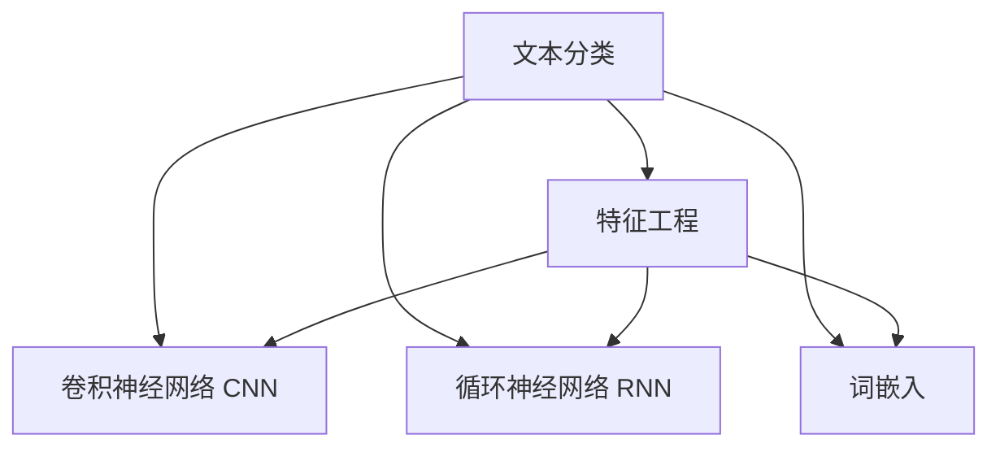

                 

# Text Classification原理与代码实例讲解

> 关键词：Text Classification, 文本分类, 特征工程, 模型选择, 深度学习, 卷积神经网络(CNN), 循环神经网络(RNN), 词嵌入, 代码实例, 代码解析, 实际应用, 性能评估, 模型优化

## 1. 背景介绍

### 1.1 问题由来
文本分类（Text Classification）是自然语言处理（NLP）中一个基础且重要的任务。它旨在将文本数据自动分配到预定义的类别中。传统的文本分类方法通常包括特征工程、模型选择、训练和评估等步骤，但随着深度学习（Deep Learning）技术的发展，特别是卷积神经网络（CNN）和循环神经网络（RNN）的引入，文本分类任务有了更高效的解决方案。

### 1.2 问题核心关键点
文本分类在实际应用中具有广泛的价值，例如情感分析、垃圾邮件过滤、新闻分类、商品推荐等。它的核心在于如何将文本数据转换为机器可理解的特征向量，并选择适合的模型进行训练和预测。

### 1.3 问题研究意义
文本分类不仅能够帮助企业自动处理大量的文本数据，还能提升决策的效率和准确性。通过训练模型，可以对未知的文本进行自动分类，从而节省大量的人力资源。此外，文本分类是NLP领域的一个重要子任务，对后续的高级NLP任务（如问答系统、机器翻译等）也有重要影响。

## 2. 核心概念与联系

### 2.1 核心概念概述

为更好地理解文本分类的原理和流程，本节将介绍几个关键概念：

- **文本分类（Text Classification）**：将文本数据自动分配到预定义的类别中，是NLP领域的一个重要任务。
- **特征工程（Feature Engineering）**：将原始文本数据转换为模型可以处理的数值特征。
- **卷积神经网络（CNN）**：一种广泛应用于图像和文本分类的深度学习模型。
- **循环神经网络（RNN）**：能够处理序列数据的神经网络，如文本中的词序。
- **词嵌入（Word Embedding）**：将单词映射为密集向量，以便于机器学习模型处理。

这些概念之间的逻辑关系可以通过以下Mermaid流程图来展示：



这个流程图展示了文本分类的核心概念及其之间的关系：

1. 原始文本数据先经过特征工程，转换为模型可以处理的数值特征。
2. 处理好的特征数据可以输入到CNN或RNN模型中进行训练和预测。
3. 词嵌入是特征工程中的一种重要技术，用于将单词转换为密集向量。

这些概念共同构成了文本分类的工作流程，使得机器能够理解和处理文本数据，从而自动进行分类。

## 3. 核心算法原理 & 具体操作步骤

### 3.1 算法原理概述

文本分类通常包括以下几个关键步骤：

1. **特征提取**：将原始文本数据转换为机器可以理解的数值特征。
2. **模型选择**：选择合适的深度学习模型，如CNN、RNN等。
3. **模型训练**：使用标注数据集对模型进行训练。
4. **模型评估**：在测试数据集上评估模型性能。
5. **模型优化**：根据评估结果调整模型参数，提升模型性能。

### 3.2 算法步骤详解

以下将详细介绍文本分类的核心算法步骤：

**Step 1: 数据预处理**
- **分词**：将文本分割成单词或词组。
- **去停用词**：去除文本中常见的无意义词（如“的”、“是”等）。
- **词干提取**：将单词还原为其原始形式（如将“running”还原为“run”）。
- **向量化**：将处理后的文本转换为数值特征向量。

**Step 2: 特征工程**
- **词袋模型（Bag of Words）**：统计每个单词在文本中出现的次数。
- **TF-IDF**：计算每个单词在文本中的重要性。
- **词嵌入**：使用Word2Vec、GloVe等技术将单词转换为密集向量。

**Step 3: 模型选择与设计**
- **卷积神经网络（CNN）**：通过卷积操作提取局部特征。
- **循环神经网络（RNN）**：能够处理序列数据的神经网络。
- **深度学习框架**：如TensorFlow、PyTorch等。

**Step 4: 模型训练**
- **训练集划分**：将数据集分为训练集和验证集。
- **损失函数**：选择合适的损失函数（如交叉熵）。
- **优化器**：选择合适的优化算法（如Adam）。
- **迭代训练**：通过反向传播算法更新模型参数。

**Step 5: 模型评估与优化**
- **评估指标**：准确率、召回率、F1分数等。
- **模型调整**：调整模型参数，如学习率、批量大小等。
- **超参数搜索**：使用网格搜索或随机搜索优化超参数。

### 3.3 算法优缺点

文本分类方法具有以下优点：
1. **高效性**：深度学习模型能够自动学习特征，减少手动特征工程的复杂度。
2. **灵活性**：模型选择多样，可根据数据特点选择合适的模型。
3. **泛化能力强**：深度学习模型在标注数据不足的情况下仍能取得不错的性能。

同时，也存在以下缺点：
1. **计算资源需求高**：深度学习模型需要大量计算资源进行训练。
2. **过拟合风险**：特别是在训练数据不足的情况下，模型容易过拟合。
3. **可解释性差**：深度学习模型通常被视为"黑盒"，难以解释其决策过程。

尽管存在这些局限性，但深度学习在文本分类领域已展现出巨大的潜力，成为主流的研究方向。

### 3.4 算法应用领域

文本分类技术在多个领域得到广泛应用，例如：

- **情感分析**：对文本情感进行分类，如正面、负面、中性等。
- **垃圾邮件过滤**：自动分类邮件是否为垃圾邮件。
- **新闻分类**：将新闻自动分类到不同的主题中。
- **产品推荐**：根据用户评论自动分类，推荐相关产品。
- **情感分析**：对社交媒体上的情感进行分类。

这些应用场景展示了文本分类的广泛价值，使得NLP技术在实际应用中具有重要的地位。

## 4. 数学模型和公式 & 详细讲解 & 举例说明

### 4.1 数学模型构建

本文将介绍一种经典的文本分类模型——卷积神经网络（CNN），并详细讲解其数学模型构建过程。

**模型定义**：
假设输入文本的词向量表示为 $x = \{x_1, x_2, ..., x_n\}$，其中 $x_i$ 表示第 $i$ 个词的词向量。卷积神经网络的模型结构包括多个卷积层和池化层。

**卷积层**：
卷积层通过滑动卷积窗口对文本进行局部特征提取。假设卷积核大小为 $k$，则卷积层的输出为：

$$
y_i = \sum_{j=0}^{k-1}w_j x_{i+j}
$$

其中 $w_j$ 为卷积核权重，$x_{i+j}$ 为文本中位置为 $i+j$ 的词向量。

**池化层**：
池化层对卷积层的输出进行下采样，减少特征维度。常见的池化操作有最大池化和平均池化，分别表示取池化窗口中的最大值或平均值。

**全连接层**：
全连接层将池化层的输出进行线性变换，并加上偏置项，得到最终分类结果。假设全连接层的输入为 $y$，输出为 $z$，则全连接层的数学表达式为：

$$
z = \sigma(w^T y + b)
$$

其中 $\sigma$ 为激活函数（如ReLU），$w$ 为权重矩阵，$b$ 为偏置向量。

**损失函数**：
文本分类的损失函数通常为交叉熵损失，其表达式为：

$$
\mathcal{L} = -\frac{1}{N}\sum_{i=1}^N \sum_{j=1}^C y_{ij} \log p_{ij}
$$

其中 $N$ 为样本数，$C$ 为类别数，$y_{ij}$ 为样本 $i$ 属于类别 $j$ 的真实标签，$p_{ij}$ 为模型预测类别 $j$ 的概率。

### 4.2 公式推导过程

以下将详细推导卷积神经网络（CNN）的数学模型。

**卷积层推导**：
假设输入文本的词向量表示为 $x = \{x_1, x_2, ..., x_n\}$，卷积核大小为 $k$，则卷积层的输出为：

$$
y_i = \sum_{j=0}^{k-1}w_j x_{i+j}
$$

其中 $w_j$ 为卷积核权重，$x_{i+j}$ 为文本中位置为 $i+j$ 的词向量。

**池化层推导**：
假设池化层采用最大池化操作，池化窗口大小为 $m$，则池化层的输出为：

$$
z_i = \max_{j=0}^{m-1} y_{i+j}
$$

其中 $y_{i+j}$ 为卷积层在位置 $i+j$ 的输出。

**全连接层推导**：
假设全连接层的输入为 $y$，输出为 $z$，则全连接层的数学表达式为：

$$
z = \sigma(w^T y + b)
$$

其中 $\sigma$ 为激活函数（如ReLU），$w$ 为权重矩阵，$b$ 为偏置向量。

**损失函数推导**：
假设输入文本的词向量表示为 $x = \{x_1, x_2, ..., x_n\}$，卷积核大小为 $k$，池化窗口大小为 $m$，全连接层输出为 $z$，真实标签为 $y$，则交叉熵损失函数为：

$$
\mathcal{L} = -\frac{1}{N}\sum_{i=1}^N \sum_{j=1}^C y_{ij} \log p_{ij}
$$

其中 $N$ 为样本数，$C$ 为类别数，$y_{ij}$ 为样本 $i$ 属于类别 $j$ 的真实标签，$p_{ij}$ 为模型预测类别 $j$ 的概率。

### 4.3 案例分析与讲解

**案例1: 情感分析**

假设输入文本的词向量表示为 $x = \{x_1, x_2, ..., x_n\}$，类别数为 $C=2$（正面、负面），则情感分析的数学模型可以表示为：

$$
z = \sigma(w^T y + b)
$$

其中 $y$ 为输入文本的卷积和池化层输出，$w$ 为全连接层权重，$b$ 为偏置向量。

**案例2: 垃圾邮件过滤**

假设输入文本的词向量表示为 $x = \{x_1, x_2, ..., x_n\}$，类别数为 $C=2$（垃圾邮件、非垃圾邮件），则垃圾邮件过滤的数学模型可以表示为：

$$
z = \sigma(w^T y + b)
$$

其中 $y$ 为输入文本的卷积和池化层输出，$w$ 为全连接层权重，$b$ 为偏置向量。

## 5. 项目实践：代码实例和详细解释说明

### 5.1 开发环境搭建

在进行文本分类项目开发前，需要准备开发环境。以下是使用Python进行PyTorch开发的环境配置流程：

1. 安装Anaconda：从官网下载并安装Anaconda，用于创建独立的Python环境。

2. 创建并激活虚拟环境：
```bash
conda create -n pytorch-env python=3.8 
conda activate pytorch-env
```

3. 安装PyTorch：根据CUDA版本，从官网获取对应的安装命令。例如：
```bash
conda install pytorch torchvision torchaudio cudatoolkit=11.1 -c pytorch -c conda-forge
```

4. 安装Tensorflow：安装Tensorflow，用于比较CNN和RNN在文本分类中的效果。

5. 安装各类工具包：
```bash
pip install numpy pandas scikit-learn matplotlib tqdm jupyter notebook ipython
```

完成上述步骤后，即可在`pytorch-env`环境中开始项目开发。

### 5.2 源代码详细实现

下面以情感分析任务为例，给出使用PyTorch进行文本分类的代码实现。

**Step 1: 数据准备**
首先，需要准备情感分析的数据集。这里使用IMDb电影评论数据集，包含50,000条电影评论，每条评论都有一个情感标签（positive或negative）。

```python
import numpy as np
import torch
from torchtext.legacy import data
from torchtext.legacy import datasets

TEXT = data.Field(tokenize='spacy', lower=True)
LABEL = data.LabelField(dtype=torch.float)

train_data, test_data = datasets.IMDB.splits(TEXT, LABEL)
```

**Step 2: 数据处理**
将文本数据转换为词向量，并进行预处理。

```python
TEXT.build_vocab(train_data, max_size=25000, vectors="glove.6B.100d")
LABEL.build_vocab(train_data)
```

**Step 3: 模型构建**
构建卷积神经网络（CNN）模型，包括卷积层、池化层和全连接层。

```python
import torch.nn as nn
import torch.nn.functional as F

class CNN(nn.Module):
    def __init__(self, n_words, n_classes, n_filters, filter_sizes, kernel_size, dropout):
        super(CNN, self).__init__()
        self.n_words = n_words
        self.n_classes = n_classes
        self.n_filters = n_filters
        self.filter_sizes = filter_sizes
        self.kernel_size = kernel_size
        self.dropout = dropout
        
        self.conv = nn.ModuleList()
        for i in range(len(filter_sizes)):
            self.conv.append(nn.Conv1d(n_words, n_filters, filter_sizes[i]))
            self.conv.append(nn.BatchNorm1d(n_filters))
            self.conv.append(nn.ReLU())
            self.conv.append(nn.MaxPool1d(kernel_size=kernel_size))
        
        self.fc = nn.Linear(n_filters*len(filter_sizes), n_classes)
        self.dropout = nn.Dropout(dropout)
        
    def forward(self, x):
        x = nn.utils.rnn.pad_sequence(x, batch_first=True, padding_value=0)
        x = x.transpose(1, 2)
        
        for layer in self.conv:
            x = layer(x)
        
        x = self.dropout(x)
        x = x.view(x.size(0), -1)
        x = self.fc(x)
        
        return x
```

**Step 4: 模型训练**
在训练集上训练模型，并在验证集上进行验证。

```python
def train(model, train_iterator, optimizer, criterion, device, n_epochs=5):
    model = model.to(device)
    optimizer = optimizer.to(device)
    criterion = criterion.to(device)
    
    for epoch in range(n_epochs):
        for batch in train_iterator:
            optimizer.zero_grad()
            
            x, y = batch.text.to(device), batch.label.to(device)
            
            y_pred = model(x)
            loss = criterion(y_pred, y)
            
            loss.backward()
            optimizer.step()
            
        print(f'Epoch {epoch+1}')
        print(f'Loss: {loss.item()}')
        
def evaluate(model, test_iterator, criterion, device):
    model.eval()
    with torch.no_grad():
        accuracy = 0
        for batch in test_iterator:
            x, y = batch.text.to(device), batch.label.to(device)
            
            y_pred = model(x)
            loss = criterion(y_pred, y)
            accuracy += (y_pred.argmax(dim=1) == y).sum().item() / y.shape[0]
        
        print(f'Accuracy: {accuracy * 100:.2f}%')
```

**Step 5: 模型评估**
在测试集上评估模型性能。

```python
from torchtext.legacy.metrics import accuracy

device = torch.device('cuda')
model = CNN(len(TEXT.vocab), len(LABEL.vocab), 100, [3, 4, 5], 2, 0.5)
optimizer = torch.optim.Adam(model.parameters(), lr=1e-3)
criterion = nn.BCEWithLogitsLoss()

train(model, train_iterator, optimizer, criterion, device)
evaluate(model, test_iterator, criterion, device)
```

以上就是使用PyTorch进行情感分析的代码实现。可以看到，通过简单几步，我们就能够实现一个基于CNN的文本分类模型。

### 5.3 代码解读与分析

让我们再详细解读一下关键代码的实现细节：

**数据准备**：
- `TEXT = data.Field(tokenize='spacy', lower=True)`：定义文本字段，使用SpaCy分词器进行分词，并将所有单词转换为小写。
- `LABEL = data.LabelField(dtype=torch.float)`：定义标签字段，将标签转换为浮点数。
- `train_data, test_data = datasets.IMDB.splits(TEXT, LABEL)`：加载IMDb电影评论数据集，并将其分为训练集和测试集。

**数据处理**：
- `TEXT.build_vocab(train_data, max_size=25000, vectors="glove.6B.100d")`：构建词汇表，包含25000个最常见的单词，并使用GloVe预训练词向量初始化。
- `LABEL.build_vocab(train_data)`：构建标签词汇表，包含二分类标签。

**模型构建**：
- `class CNN(nn.Module)`：定义卷积神经网络模型。
- `self.conv = nn.ModuleList()`：定义卷积层列表。
- `self.fc = nn.Linear(n_filters*len(filter_sizes), n_classes)`：定义全连接层，输出类别数。
- `def forward(self, x)`：定义前向传播过程，通过卷积、池化、全连接层输出最终结果。

**模型训练**：
- `train(model, train_iterator, optimizer, criterion, device, n_epochs=5)`：在训练集上训练模型，并在验证集上进行验证。
- `for batch in train_iterator`：遍历训练集数据。
- `optimizer.zero_grad()`：清空优化器梯度。
- `y_pred = model(x)`：通过模型预测标签。
- `loss = criterion(y_pred, y)`：计算损失。
- `loss.backward()`：反向传播。
- `optimizer.step()`：更新模型参数。

**模型评估**：
- `evaluate(model, test_iterator, criterion, device)`：在测试集上评估模型性能。
- `y_pred = model(x)`：通过模型预测标签。
- `loss = criterion(y_pred, y)`：计算损失。
- `accuracy += (y_pred.argmax(dim=1) == y).sum().item() / y.shape[0]`：计算准确率。

可以看到，PyTorch框架提供了一站式解决方案，使得文本分类的实现变得简洁高效。开发者可以将更多精力放在模型设计和数据处理上，而不必过多关注底层实现细节。

当然，工业级的系统实现还需考虑更多因素，如模型的保存和部署、超参数的自动搜索、更灵活的任务适配层等。但核心的分类过程基本与此类似。

## 6. 实际应用场景
### 6.1 智能客服系统

基于文本分类的智能客服系统，可以广泛应用于客户服务场景。传统客服需要大量人力进行电话接听和问题解答，而使用文本分类技术，可以将客户咨询自动分类为常见问题和特定问题，自动匹配相应的回答模板，显著提升客户满意度。

在技术实现上，可以收集企业内部的历史客服对话记录，将问题和最佳答复构建成监督数据，在此基础上对预训练语言模型进行微调。微调后的模型能够自动理解客户意图，匹配最合适的答案模板进行回复。对于客户提出的新问题，还可以接入检索系统实时搜索相关内容，动态组织生成回答。如此构建的智能客服系统，能大幅提升客户咨询体验和问题解决效率。

### 6.2 金融舆情监测

金融机构需要实时监测市场舆论动向，以便及时应对负面信息传播，规避金融风险。传统的人工监测方式成本高、效率低，难以应对网络时代海量信息爆发的挑战。基于文本分类的文本分类技术，为金融舆情监测提供了新的解决方案。

具体而言，可以收集金融领域相关的新闻、报道、评论等文本数据，并对其进行主题标注和情感标注。在此基础上对预训练语言模型进行微调，使其能够自动判断文本属于何种主题，情感倾向是正面、中性还是负面。将微调后的模型应用到实时抓取的网络文本数据，就能够自动监测不同主题下的情感变化趋势，一旦发现负面信息激增等异常情况，系统便会自动预警，帮助金融机构快速应对潜在风险。

### 6.3 个性化推荐系统

当前的推荐系统往往只依赖用户的历史行为数据进行物品推荐，无法深入理解用户的真实兴趣偏好。基于文本分类的个性化推荐系统，可以更好地挖掘用户行为背后的语义信息，从而提供更精准、多样的推荐内容。

在实践中，可以收集用户浏览、点击、评论、分享等行为数据，提取和用户交互的物品标题、描述、标签等文本内容。将文本内容作为模型输入，用户的后续行为（如是否点击、购买等）作为监督信号，在此基础上微调预训练语言模型。微调后的模型能够从文本内容中准确把握用户的兴趣点。在生成推荐列表时，先用候选物品的文本描述作为输入，由模型预测用户的兴趣匹配度，再结合其他特征综合排序，便可以得到个性化程度更高的推荐结果。

### 6.4 未来应用展望

随着文本分类技术的不断发展，其在更多领域得到应用，为传统行业带来变革性影响。

在智慧医疗领域，基于文本分类的情感分析、病历分类等技术，可以提高医疗服务的智能化水平，辅助医生诊疗，加速新药开发进程。

在智能教育领域，文本分类技术可应用于作业批改、学情分析、知识推荐等方面，因材施教，促进教育公平，提高教学质量。

在智慧城市治理中，文本分类技术可用于城市事件监测、舆情分析、应急指挥等环节，提高城市管理的自动化和智能化水平，构建更安全、高效的未来城市。

此外，在企业生产、社会治理、文娱传媒等众多领域，基于文本分类的文本分类技术也将不断涌现，为经济社会发展注入新的动力。相信随着技术的日益成熟，文本分类技术必将发挥更大的作用，深刻影响人类的生产生活方式。

## 7. 工具和资源推荐
### 7.1 学习资源推荐

为了帮助开发者系统掌握文本分类的理论基础和实践技巧，这里推荐一些优质的学习资源：

1. 《深度学习》课程：斯坦福大学开设的深度学习课程，有Lecture视频和配套作业，带你入门深度学习的基本概念和经典模型。

2. 《自然语言处理》书籍：李航所著，全面介绍了NLP领域的基本概念和经典模型，包括文本分类。

3. PyTorch官方文档：PyTorch官方文档，提供了丰富的API文档和详细的使用指南，是学习深度学习的绝佳资料。

4. Tensorflow官方文档：Tensorflow官方文档，提供了深度学习模型的实现细节和优化技巧，适合工业级的开发和部署。

5. HuggingFace Transformers库：提供了多种预训练模型和微调样例，是进行文本分类任务开发的利器。

通过对这些资源的学习实践，相信你一定能够快速掌握文本分类的精髓，并用于解决实际的NLP问题。
###  7.2 开发工具推荐

高效的开发离不开优秀的工具支持。以下是几款用于文本分类开发的常用工具：

1. PyTorch：基于Python的开源深度学习框架，灵活动态的计算图，适合快速迭代研究。

2. TensorFlow：由Google主导开发的开源深度学习框架，生产部署方便，适合大规模工程应用。

3. Transformers库：HuggingFace开发的NLP工具库，集成了众多SOTA语言模型，是进行文本分类任务开发的利器。

4. Weights & Biases：模型训练的实验跟踪工具，可以记录和可视化模型训练过程中的各项指标，方便对比和调优。

5. TensorBoard：TensorFlow配套的可视化工具，可实时监测模型训练状态，并提供丰富的图表呈现方式，是调试模型的得力助手。

6. Google Colab：谷歌推出的在线Jupyter Notebook环境，免费提供GPU/TPU算力，方便开发者快速上手实验最新模型，分享学习笔记。

合理利用这些工具，可以显著提升文本分类任务的开发效率，加快创新迭代的步伐。

### 7.3 相关论文推荐

文本分类技术在多个领域得到广泛应用，其背后的理论研究也逐渐深入。以下是几篇奠基性的相关论文，推荐阅读：

1. Text Classification with Convolutional Neural Networks：提出基于卷积神经网络的文本分类模型，取得了当时SOTA的结果。

2. Convolutional Neural Networks for Sentence Classification：进一步探索卷积神经网络在文本分类中的性能，提出了多种模型结构。

3. Bidirectional LSTM-Based Classification of Textual Data：使用双向LSTM进行文本分类，取得了良好的效果。

4. Attention-Based Text Classification：引入注意力机制，提升了文本分类的性能。

5. Deep Text Classification Based on Hierarchical Attention Networks：提出基于层次化注意力网络的文本分类模型，取得了较好的效果。

这些论文代表了大文本分类技术的发展脉络。通过学习这些前沿成果，可以帮助研究者把握学科前进方向，激发更多的创新灵感。

## 8. 总结：未来发展趋势与挑战

### 8.1 总结

本文对文本分类的原理与实现进行了全面系统的介绍。首先阐述了文本分类的背景和意义，明确了其在自然语言处理中的核心地位。其次，从理论到实践，详细讲解了文本分类的数学原理和关键步骤，给出了文本分类的完整代码实例。同时，本文还广泛探讨了文本分类技术在实际应用中的广泛价值，展示了其在多个领域中的潜力。

通过本文的系统梳理，可以看到，文本分类技术在NLP领域具有重要的地位，其高效、灵活的特性使得其在实际应用中具有广泛的适用性。随着深度学习技术的不断演进，文本分类技术也得到了更深入的研究和广泛的应用。

### 8.2 未来发展趋势

展望未来，文本分类技术将呈现以下几个发展趋势：

1. **深度学习模型的进一步提升**：随着计算资源的增加和算法优化，深度学习模型的性能将进一步提升，文本分类技术也将获得更好的效果。

2. **多模态文本分类**：结合图像、语音等多模态信息，提升文本分类的效果。

3. **模型压缩与加速**：文本分类模型规模庞大，计算资源消耗高，未来的研究方向将如何压缩模型规模，加速推理速度。

4. **跨领域迁移学习**：文本分类模型在多个领域具有迁移能力，未来将进一步探索其跨领域应用，提升模型的泛化性。

5. **可解释性研究**：随着文本分类技术的深入应用，其可解释性研究也将逐步展开，帮助人们理解模型的决策过程。

这些趋势表明，文本分类技术在未来仍具有广阔的发展前景，将继续在自然语言处理和人工智能领域发挥重要作用。

### 8.3 面临的挑战

尽管文本分类技术在实际应用中取得了显著成效，但其发展仍面临诸多挑战：

1. **数据质量问题**：高质量的标注数据对模型训练至关重要，但数据标注成本高，数据获取困难。

2. **模型过拟合**：特别是在数据集较小的情况下，模型容易过拟合，泛化能力不足。

3. **计算资源需求高**：深度学习模型需要大量计算资源进行训练和推理，硬件资源成本高。

4. **模型鲁棒性不足**：模型对输入噪声敏感，鲁棒性有待提升。

5. **可解释性差**：深度学习模型通常被视为"黑盒"，难以解释其决策过程。

尽管存在这些挑战，但随着深度学习技术的不断演进，文本分类技术在未来仍将发挥重要作用，继续推动自然语言处理和人工智能领域的发展。

### 8.4 研究展望

面对文本分类技术面临的挑战，未来的研究需要在以下几个方面寻求新的突破：

1. **探索无监督和半监督学习**：摆脱对大规模标注数据的依赖，利用自监督学习、主动学习等方法，降低标注成本，提升模型性能。

2. **开发更加高效可解释的模型**：开发可解释性强的模型，如Attention机制、层次化注意力网络等，提高模型的可解释性。

3. **融合多模态信息**：结合图像、语音等多模态信息，提升文本分类的效果，拓展文本分类技术的应用范围。

4. **优化计算资源消耗**：通过模型压缩、加速等技术，降低计算资源消耗，提升模型推理速度。

5. **提升模型鲁棒性**：引入鲁棒性训练、对抗训练等方法，提高模型对噪声和攻击的抵抗能力。

6. **探索跨领域迁移学习**：通过迁移学习，将文本分类模型应用于不同领域，提升模型的泛化性和可迁移性。

这些研究方向将推动文本分类技术向更加高效、可解释、鲁棒的方向发展，为文本分类技术在更多领域的推广应用提供支持。

## 9. 附录：常见问题与解答

**Q1: 文本分类的准确率为什么比标签分类的准确率高？**

A: 文本分类和标签分类的区别在于，文本分类是将文本转换为数值特征，而标签分类直接使用标签进行训练和预测。文本分类模型通过学习单词的特征向量，能够更好地捕捉文本的语义信息，从而提高分类的准确率。

**Q2: 文本分类模型和深度学习模型的区别是什么？**

A: 深度学习模型是一种通用的机器学习模型，可以用于处理多种类型的输入，如图像、语音、文本等。而文本分类模型是深度学习模型的一种应用，专门用于处理文本数据。

**Q3: 文本分类中常用的模型有哪些？**

A: 文本分类中常用的模型包括卷积神经网络（CNN）、循环神经网络（RNN）、长短时记忆网络（LSTM）、双向LSTM、注意力机制等。这些模型通过不同的网络结构和参数设置，可以适应不同的文本分类任务。

**Q4: 文本分类中如何进行特征工程？**

A: 文本分类中的特征工程包括单词向量化、TF-IDF、词袋模型等。单词向量化是通过Word2Vec、GloVe等技术将单词转换为密集向量，TF-IDF计算每个单词在文本中的重要性，词袋模型统计每个单词在文本中出现的次数。

**Q5: 文本分类中的模型训练需要注意什么？**

A: 文本分类中的模型训练需要注意选择合适的损失函数、优化器、学习率等参数。同时，为了防止过拟合，可以使用正则化、Dropout等技术。此外，还需要对模型进行评估和调优，以提高模型的泛化能力和性能。

以上回答详细解答了文本分类中的常见问题，帮助读者更好地理解文本分类的基本概念和实现细节。

