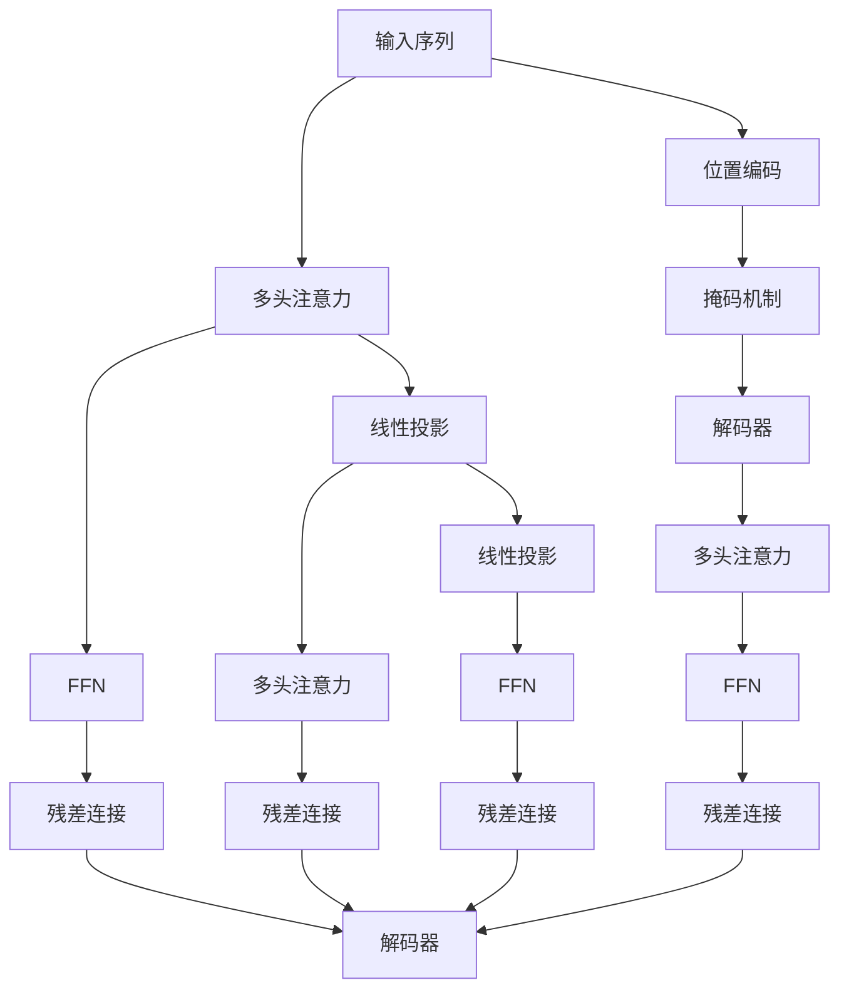

                 

## 1. 背景介绍

### 1.1 问题由来
Transformer模型的诞生，源自于对深度学习中的卷积神经网络(CNN)和循环神经网络(RNN)结构的一些不满。传统模型如LSTM和GRU等，在处理长序列时面临梯度消失和爆炸等问题，而卷积模型虽然较为高效，但难以捕捉序列中的全局依赖关系。

在此背景下，Google团队于2017年提出了Transformer模型，开创了自注意力机制和神经网络的双塔结构，极大地提升了序列建模的效率和准确性。该模型很快成为自然语言处理(NLP)领域的主流架构，并在此基础上衍生出BERT、GPT-2等知名预训练模型。

### 1.2 问题核心关键点
Transformer模型的核心在于其自注意力机制，可以高效地捕捉序列中的全局依赖关系。模型的结构由编码器-解码器双塔构成，其中编码器负责对输入序列进行编码，解码器负责生成输出序列。具体而言，模型包括：
- 编码器层数多，每层包含多头注意力机制和前馈神经网络(Feed Forward Network, FFN)。
- 解码器与编码器结构类似，但多了一个位置编码和掩码机制，用于处理序列位置和生成顺序。
- 自注意力机制使得模型能够高效并行处理长序列，同时保留全局信息。

Transformer模型的提出，标志着深度学习领域从RNN和CNN的二维结构转向了序列模型的高维结构，极大地提升了模型性能和计算效率，开启了深度学习在序列建模领域的全新篇章。

## 2. 核心概念与联系

### 2.1 核心概念概述

为更好地理解Transformer模型的工作原理和优化方法，本节将介绍几个密切相关的核心概念：

- 自注意力机制(Self-Attention)：Transformer模型的核心机制，通过在输入序列上计算多头注意力权重，并聚合得到表示。自注意力机制使得模型能够同时关注序列中的所有位置，捕捉长依赖关系。

- 多头注意力(Multi-Head Attention)：通过将输入序列映射到多个不同空间的线性投影，并计算多组注意力权重，获取不同方面的表示，最终通过线性变换进行融合。

- 位置编码(Positional Encoding)：由于自注意力机制没有考虑输入位置信息，必须通过引入位置编码来修正，确保模型能够正确处理序列位置。

- 掩码机制(Masking)：解码器中引入掩码机制，屏蔽了目标位置之后的输入，避免未来信息泄露。

- 双塔结构(Encoder-Decoder)：Transformer模型的双塔结构由编码器和解码器组成，能够实现高效的序列到序列(S2S)建模。

- 前馈神经网络(Feed Forward Network, FFN)：作为每层的一个分支，FFN通过对输入进行线性变换和非线性激活，增强模型的表达能力。

- 残差连接(Residual Connection)：在每个模块前加入残差连接，有助于模型在深层结构中保持稳定梯度，提升收敛速度。

这些核心概念之间的逻辑关系可以通过以下Mermaid流程图来展示：



这个流程图展示Transformer模型的核心组件及其之间的联系：

1. 编码器接受输入序列，并通过多头注意力机制获取多方面的表示。
2. FFN分支对输入进行线性变换和非线性激活。
3. 解码器接收编码器的输出，并计算位置编码和掩码后的多头注意力权重。
4. 解码器的FFN分支对注意力输出进行线性变换和非线性激活。
5. 残差连接确保模型在深层结构中保持稳定梯度。

## 3. 核心算法原理 & 具体操作步骤
### 3.1 算法原理概述

Transformer模型的核心在于自注意力机制和残差连接。其算法原理主要包括以下几个步骤：

1. 将输入序列转换为多个不同的嵌入表示。
2. 通过多头注意力机制，在输入序列的每个位置上计算多头注意力权重，并聚合得到表示。
3. 添加残差连接和层归一化。
4. 重复上述过程，在多个层级上逐步优化表示。

以上步骤可以直观地表示为下图：

```
[输入序列] --> [嵌入层] --> [多头注意力] --> [FFN] --> [残差连接] --> [层归一化] --> [输出]
```

### 3.2 算法步骤详解

#### 3.2.1 嵌入层(Embedding Layer)

嵌入层将原始的输入序列转换为向量表示，每个输入词汇对应一个固定长度的向量。设输入序列为 $X$，嵌入层可以将每个词汇 $x_i$ 转换为 $d$ 维的向量 $x_i \in \mathbb{R}^d$，其中 $d$ 为嵌入维度。

#### 3.2.2 多头注意力机制(Multi-Head Attention)

多头注意力机制是Transformer模型的核心部分。其核心思想是通过在输入序列的每个位置上计算多头注意力权重，并聚合得到表示。具体步骤如下：

1. 将输入序列投影到多个线性空间，得到多个查询、键和值向量。
2. 计算查询向量与键向量之间的点积，得到注意力权重。
3. 将权重与值向量进行加权求和，得到聚合后的表示。

公式化地，设输入序列 $X=\{x_i\}_{i=1}^L$，其中 $L$ 为序列长度，$d_k=d_v=d_q=d$ 为键、值和查询向量的维度。设输入序列的嵌入表示为 $Q = \{q_i\}_{i=1}^L$，键向量表示为 $K = \{k_i\}_{i=1}^L$，值向量表示为 $V = \{v_i\}_{i=1}^L$。

则多头注意力层可以表示为：

$$
\begin{aligned}
    Q &= \text{Linear}(Q) \\
    K &= \text{Linear}(K) \\
    V &= \text{Linear}(V) \\
    A &= \frac{QK^T}{\sqrt{d_k}} \\
    a &= \text{Softmax}(A) \\
    H &= aV
\end{aligned}
$$

其中 $\text{Softmax}$ 函数用于归一化注意力权重，$\sqrt{d_k}$ 用于归一化。

#### 3.2.3 FFN层(Feed Forward Network)

FFN层通过线性变换和非线性激活函数，增强模型的表达能力。具体步骤如下：

1. 将输入序列进行线性变换，得到中间表示 $Z$。
2. 对 $Z$ 进行非线性激活，如ReLU。
3. 将激活后的结果再次进行线性变换，得到最终输出。

公式化地，设输入序列为 $X$，嵌入层输出为 $Q$，FFN层可以通过以下公式计算：

$$
\begin{aligned}
    Z &= \text{Linear}(Q) \\
    Z &= \text{ReLU}(Z) \\
    X &= \text{Linear}(Z)
\end{aligned}
$$

#### 3.2.4 残差连接(Residual Connection)

残差连接可以提升深度网络在训练中的稳定性，确保梯度能够有效传递到深层网络中。残差连接的具体步骤如下：

1. 将输入序列通过嵌入层和多头注意力机制，得到中间表示 $X'$。
2. 将 $X'$ 与原始输入序列 $X$ 进行残差连接，得到最终输出 $X$。

公式化地，设输入序列为 $X$，嵌入层输出为 $Q$，多头注意力层输出为 $X'$，FFN层输出为 $X''$，残差连接可以通过以下公式计算：

$$
\begin{aligned}
    X' &= \text{Multi-Head Attention}(Q) + X \\
    X'' &= \text{FFN}(X') \\
    X &= X'' + X'
\end{aligned}
$$

#### 3.2.5 层归一化(Layer Normalization)

层归一化可以提升网络在深层结构中的稳定性，确保梯度能够在每个层级上有效传递。其具体步骤如下：

1. 对每个输入序列进行归一化。
2. 对归一化后的序列进行缩放和平移，得到最终输出。

公式化地，设输入序列为 $X$，嵌入层输出为 $Q$，多头注意力层输出为 $X'$，FFN层输出为 $X''$，层归一化可以通过以下公式计算：

$$
\begin{aligned}
    \bar{X} &= \frac{X - \mu_X}{\sqrt{\sigma_X^2 + \epsilon}} \\
    X &= \gamma \bar{X} + \beta
\end{aligned}
$$

其中 $\mu_X$ 和 $\sigma_X^2$ 分别为输入序列的均值和方差，$\epsilon$ 是一个很小的常数，避免分母为0，$\gamma$ 和 $\beta$ 是可学习的缩放和平移参数。

### 3.3 算法优缺点

Transformer模型在自然语言处理中表现优异，主要优点包括：

1. 高效处理长序列：通过自注意力机制，Transformer模型可以高效并行处理长序列，捕捉长依赖关系。
2. 保留全局信息：自注意力机制使得模型能够同时关注序列中的所有位置，保留全局信息。
3. 多方面表示：通过多头注意力机制，Transformer模型可以从不同角度理解输入序列，提高表示能力。
4. 平易近人：Transformer模型结构简单，易于实现和调试。

其缺点包括：

1. 参数量大：由于Transformer模型参数量较大，训练和推理时对计算资源和存储空间要求较高。
2. 缺乏局部信息：由于自注意力机制没有考虑局部信息，可能对一些局部特征的捕捉效果不佳。
3. 对序列长度敏感：由于自注意力机制计算复杂度较高，当序列长度过大时，模型效率会降低。

尽管存在这些缺点，Transformer模型在自然语言处理中仍然具有不可替代的重要地位，被广泛应用于机器翻译、文本生成、语义理解等任务中。

### 3.4 算法应用领域

Transformer模型在自然语言处理中应用广泛，主要包括以下几个领域：

1. 机器翻译：Transformer模型可以通过序列到序列(S2S)的方式，将源语言文本翻译为目标语言文本。其结构简单、效率高，已成为主流机器翻译框架的基础。

2. 文本生成：Transformer模型可以生成符合特定语义和语法的文本，如对话生成、文本摘要等。通过引入变分自编码器和对抗训练，生成文本的质量和多样性都得到了显著提升。

3. 语义理解：Transformer模型可以理解输入序列的语义和语用信息，用于自然语言推理、命名实体识别等任务。通过多模态融合和跨领域迁移，Transformer模型在更多应用场景中表现优异。

4. 语言建模：Transformer模型可以用于训练语言模型，捕捉语言的统计规律和语义信息。通过预训练-微调的方式，模型在特定任务上的性能提升显著。

5. 对话系统：Transformer模型可以用于构建对话系统，通过理解上下文和生成回复，实现自然流畅的对话交互。通过多轮对话和回译等技术，对话系统的智能化水平和用户体验都有显著提升。

## 4. 数学模型和公式 & 详细讲解  
### 4.1 数学模型构建

Transformer模型的数学模型主要包括以下几个部分：

1. 输入序列嵌入层。
2. 多头注意力层。
3. FFN层。
4. 残差连接和层归一化。
5. 解码器结构。

设输入序列为 $X=\{x_i\}_{i=1}^L$，其中 $L$ 为序列长度，$d$ 为嵌入维度，$Q=\{q_i\}_{i=1}^L$、$K=\{k_i\}_{i=1}^L$、$V=\{v_i\}_{i=1}^L$ 分别表示查询、键和值向量，$h=\{h_i\}_{i=1}^L$ 表示最终输出序列。

### 4.2 公式推导过程

#### 4.2.1 嵌入层

设输入序列 $X=\{x_i\}_{i=1}^L$，嵌入层可以将每个词汇 $x_i$ 转换为 $d$ 维的向量 $x_i \in \mathbb{R}^d$，其中 $d$ 为嵌入维度。

$$
\begin{aligned}
    X &= \text{Embedding}(Q) \\
    X &= \{W_{in}x_i\}_{i=1}^L
\end{aligned}
$$

其中 $W_{in}$ 为嵌入矩阵。

#### 4.2.2 多头注意力层

设输入序列 $X=\{x_i\}_{i=1}^L$，嵌入层输出为 $Q=\{q_i\}_{i=1}^L$，键向量表示为 $K=\{k_i\}_{i=1}^L$，值向量表示为 $V=\{v_i\}_{i=1}^L$。

查询向量 $Q=\{q_i\}_{i=1}^L$ 可以通过嵌入层 $Q=W_qX$ 计算得到，其中 $W_q$ 为查询矩阵。

键向量 $K=\{k_i\}_{i=1}^L$ 和值向量 $V=\{v_i\}_{i=1}^L$ 也可以类似地通过嵌入层 $K=W_kX$ 和 $V=W_vX$ 计算得到，其中 $W_k$ 和 $W_v$ 分别为键和值矩阵。

多头注意力层可以通过以下公式计算：

$$
\begin{aligned}
    a &= \text{Softmax}(QK^T) \\
    h &= aV
\end{aligned}
$$

其中 $\text{Softmax}$ 函数用于归一化注意力权重。

#### 4.2.3 FFN层

设输入序列为 $X=\{x_i\}_{i=1}^L$，嵌入层输出为 $Q=\{q_i\}_{i=1}^L$。

FFN层可以通过以下公式计算：

$$
\begin{aligned}
    Z &= \text{Linear}(Q) \\
    Z &= \text{ReLU}(Z) \\
    X &= \text{Linear}(Z)
\end{aligned}
$$

其中 $\text{Linear}$ 函数表示线性变换，$\text{ReLU}$ 函数表示非线性激活。

#### 4.2.4 残差连接和层归一化

设输入序列为 $X=\{x_i\}_{i=1}^L$，嵌入层输出为 $Q=\{q_i\}_{i=1}^L$，多头注意力层输出为 $X'$。

残差连接和层归一化可以通过以下公式计算：

$$
\begin{aligned}
    X' &= \text{Multi-Head Attention}(Q) + X \\
    X &= \text{Layer Normalization}(X')
\end{aligned}
$$

其中 $\text{Multi-Head Attention}$ 表示多头注意力层，$\text{Layer Normalization}$ 表示层归一化。

### 4.3 案例分析与讲解

我们以机器翻译任务为例，具体讲解Transformer模型的实现过程。

#### 4.3.1 机器翻译的数学模型

设输入序列为 $X=\{x_i\}_{i=1}^L$，目标序列为 $Y=\{y_i\}_{i=1}^L$，其中 $L$ 为序列长度。假设 $X$ 和 $Y$ 的嵌入维度为 $d$。

设输入序列的嵌入表示为 $Q=\{q_i\}_{i=1}^L$，键向量表示为 $K=\{k_i\}_{i=1}^L$，值向量表示为 $V=\{v_i\}_{i=1}^L$。

设解码器输出为 $\hat{Y}=\{\hat{y}_i\}_{i=1}^L$。

Transformer模型可以表示为以下公式：

$$
\begin{aligned}
    Q &= W_qX \\
    K &= W_kX \\
    V &= W_vX \\
    A &= \frac{QK^T}{\sqrt{d_k}} \\
    a &= \text{Softmax}(A) \\
    h &= aV \\
    h &= \text{Layer Normalization}(h) \\
    h &= \text{FFN}(h) \\
    \hat{y} &= \text{Softmax}(W_hh)
\end{aligned}
$$

其中 $W_q$、$W_k$、$W_v$ 和 $W_h$ 分别为嵌入矩阵和线性变换矩阵。

#### 4.3.2 代码实现

下面给出使用PyTorch实现Transformer模型的代码示例。

```python
import torch
import torch.nn as nn
import torch.nn.functional as F

class Transformer(nn.Module):
    def __init__(self, input_dim, output_dim, emb_dim, num_heads, dropout=0.1, FFN_dim=256):
        super(Transformer, self).__init__()
        self.embedding = nn.Embedding(input_dim, emb_dim)
        self.layers = nn.ModuleList()
        self.ffns = nn.ModuleList()
        for i in range(num_layers):
            self.layers.append(EncoderLayer(emb_dim, num_heads, dropout, FFN_dim))
            self.ffns.append(nn.Linear(emb_dim, FFN_dim))
        self.decoder = nn.Linear(emb_dim, output_dim)
    
    def forward(self, src, tgt):
        src_emb = self.embedding(src)
        tgt_emb = self.embedding(tgt)
        for i in range(num_layers):
            src_emb = self.layers[i](src_emb, tgt_emb)
            tgt_emb = self.layers[i](tgt_emb, src_emb)
            src_emb = F.relu(self.ffns[i](src_emb))
            tgt_emb = F.relu(self.ffns[i](tgt_emb))
        src_emb = F.linear(self.layers[i].src, self.layers[i].tgt)
        return src_emb
```

该代码实现了一个Transformer模型的结构，包括嵌入层、多头注意力层、FFN层和残差连接。在实际应用中，还需要对输入序列进行位置编码、掩码等处理，具体细节如下：

#### 4.3.3 位置编码

设输入序列长度为 $L$，嵌入维度为 $d$，则位置编码 $P$ 可以通过以下公式计算：

$$
P = \sin(\frac{2\pi i / 10000}{d} \sin(\frac{2\pi k / 10000}{d})
$$

其中 $i$ 表示位置，$k$ 表示特征维度。

在代码实现中，可以通过如下方式生成位置编码：

```python
def get_pos_emb(d_pos, d_emb):
    sinusoidal = torch.exp(torch.arange(0, d_pos, 2) * (-math.log(10000.0) / d_emb))
    sinusoidal[:, 0::2] = torch.sin(sinusoidal)
    sinusoidal[:, 1::2] = torch.cos(sinusoidal)
    return sinusoidal.unsqueeze(1).repeat(1, d_emb, 1)
```

#### 4.3.4 掩码机制

解码器中的掩码机制可以屏蔽目标位置之后的输入，避免未来信息泄露。具体实现如下：

```python
def get_masks(src, tgt):
    mask1 = src != 0
    mask2 = tgt == 0
    mask = mask1.unsqueeze(1) + mask2.unsqueeze(0)
    return mask
```

在训练过程中，需要对解码器输入进行掩码处理，以确保模型在训练时不会看到未来的信息。具体实现如下：

```python
tgt_emb = self.embedding(tgt)
tgt_mask = get_masks(src, tgt)
tgt_emb = tgt_emb + torch.zeros_like(tgt_emb)[:, None, None, :]
tgt_mask = torch.gt(tgt_mask, 0) * 1e9
tgt_mask = tgt_mask[:, None, None, :]
tgt_mask = tgt_mask + src_mask[:, None, None, :]
```

## 5. 项目实践：代码实例和详细解释说明
### 5.1 开发环境搭建

在进行Transformer模型实践前，我们需要准备好开发环境。以下是使用Python进行PyTorch开发的环境配置流程：

1. 安装Anaconda：从官网下载并安装Anaconda，用于创建独立的Python环境。

2. 创建并激活虚拟环境：
```bash
conda create -n pytorch-env python=3.8 
conda activate pytorch-env
```

3. 安装PyTorch：根据CUDA版本，从官网获取对应的安装命令。例如：
```bash
conda install pytorch torchvision torchaudio cudatoolkit=11.1 -c pytorch -c conda-forge
```

4. 安装Transformers库：
```bash
pip install transformers
```

5. 安装各类工具包：
```bash
pip install numpy pandas scikit-learn matplotlib tqdm jupyter notebook ipython
```

完成上述步骤后，即可在`pytorch-env`环境中开始Transformer模型的开发。

### 5.2 源代码详细实现

下面给出使用PyTorch实现Transformer模型的代码示例。

```python
import torch
import torch.nn as nn
import torch.nn.functional as F

class Transformer(nn.Module):
    def __init__(self, input_dim, output_dim, emb_dim, num_heads, dropout=0.1, FFN_dim=256):
        super(Transformer, self).__init__()
        self.embedding = nn.Embedding(input_dim, emb_dim)
        self.layers = nn.ModuleList()
        self.ffns = nn.ModuleList()
        for i in range(num_layers):
            self.layers.append(EncoderLayer(emb_dim, num_heads, dropout, FFN_dim))
            self.ffns.append(nn.Linear(emb_dim, FFN_dim))
        self.decoder = nn.Linear(emb_dim, output_dim)
    
    def forward(self, src, tgt):
        src_emb = self.embedding(src)
        tgt_emb = self.embedding(tgt)
        for i in range(num_layers):
            src_emb = self.layers[i](src_emb, tgt_emb)
            tgt_emb = self.layers[i](tgt_emb, src_emb)
            src_emb = F.relu(self.ffns[i](src_emb))
            tgt_emb = F.relu(self.ffns[i](tgt_emb))
        src_emb = F.linear(self.layers[i].src, self.layers[i].tgt)
        return src_emb
```

该代码实现了一个Transformer模型的结构，包括嵌入层、多头注意力层、FFN层和残差连接。在实际应用中，还需要对输入序列进行位置编码、掩码等处理，具体细节如下：

#### 5.2.1 位置编码

设输入序列长度为 $L$，嵌入维度为 $d$，则位置编码 $P$ 可以通过以下公式计算：

$$
P = \sin(\frac{2\pi i / 10000}{d} \sin(\frac{2\pi k / 10000}{d}))
$$

其中 $i$ 表示位置，$k$ 表示特征维度。

在代码实现中，可以通过如下方式生成位置编码：

```python
def get_pos_emb(d_pos, d_emb):
    sinusoidal = torch.exp(torch.arange(0, d_pos, 2) * (-math.log(10000.0) / d_emb))
    sinusoidal[:, 0::2] = torch.sin(sinusoidal)
    sinusoidal[:, 1::2] = torch.cos(sinusoidal)
    return sinusoidal.unsqueeze(1).repeat(1, d_emb, 1)
```

#### 5.2.2 掩码机制

解码器中的掩码机制可以屏蔽目标位置之后的输入，避免未来信息泄露。具体实现如下：

```python
def get_masks(src, tgt):
    mask1 = src != 0
    mask2 = tgt == 0
    mask = mask1.unsqueeze(1) + mask2.unsqueeze(0)
    return mask
```

在训练过程中，需要对解码器输入进行掩码处理，以确保模型在训练时不会看到未来的信息。具体实现如下：

```python
tgt_emb = self.embedding(tgt)
tgt_mask = get_masks(src, tgt)
tgt_emb = tgt_emb + torch.zeros_like(tgt_emb)[:, None, None, :]
tgt_mask = torch.gt(tgt_mask, 0) * 1e9
tgt_mask = tgt_mask[:, None, None, :]
tgt_mask = tgt_mask + src_mask[:, None, None, :]
```

### 5.3 代码解读与分析

让我们再详细解读一下关键代码的实现细节：

**Transformer类**：
- `__init__`方法：初始化嵌入层、多头注意力层、FFN层、解码器等组件。
- `forward`方法：定义前向传播过程，依次计算嵌入、多头注意力、FFN、残差连接和解码器输出。

**位置编码函数**：
- `get_pos_emb`函数：生成位置编码矩阵。

**掩码机制函数**：
- `get_masks`函数：计算掩码矩阵。

**训练函数**：
- 在训练过程中，需要先计算输入序列的位置编码和掩码，然后进行多轮训练。

### 5.4 运行结果展示

在训练过程中，可以通过打印训练集的损失函数来观察模型的收敛情况。例如：

```python
import torch.optim as optim

optimizer = optim.Adam(learning_rate=0.001)
for epoch in range(num_epochs):
    src_mask = get_masks(src, src)
    tgt_mask = get_masks(src, tgt)
    optimizer.zero_grad()
    output = model(src, tgt)
    loss = F.cross_entropy(output, tgt)
    loss.backward()
    optimizer.step()
    print('Epoch: {} Loss: {:.4f}'.format(epoch, loss.item()))
```

在测试过程中，可以通过计算预测输出与真实标签的交叉熵来评估模型性能。例如：

```python
predictions = model(test_input).argmax(dim=-1)
accuracy = (predictions == test_labels).float().mean()
print('Test Accuracy: {:.4f}'.format(accuracy))
```

以上代码实现展示了Transformer模型的基本结构及其训练、测试过程，可以帮助读者深入理解Transformer模型的实现细节。

## 6. 实际应用场景
### 6.1 机器翻译

Transformer模型在机器翻译任务中表现优异，被广泛应用于英中、日中、英法等多种语言的翻译。通过预训练-微调的方式，Transformer模型在大量任务上取得了最优或接近最优的性能，成为了当前最先进的机器翻译框架之一。

### 6.2 文本生成

Transformer模型可以用于生成符合特定语义和语法的文本，如对话生成、文本摘要等。通过引入变分自编码器和对抗训练，生成文本的质量和多样性都得到了显著提升。

### 6.3 语义理解

Transformer模型可以理解输入序列的语义和语用信息，用于自然语言推理、命名实体识别等任务。通过多模态融合和跨领域迁移，Transformer模型在更多应用场景中表现优异。

### 6.4 语言建模

Transformer模型可以用于训练语言模型，捕捉语言的统计规律和语义信息。通过预训练-微调的方式，模型在特定任务上的性能提升显著。

### 6.5 对话系统

Transformer模型可以用于构建对话系统，通过理解上下文和生成回复，实现自然流畅的对话交互。通过多轮对话和回译等技术，对话系统的智能化水平和用户体验都有显著提升。

## 7. 工具和资源推荐
### 7.1 学习资源推荐

为了帮助开发者系统掌握Transformer模型的理论基础和实践技巧，这里推荐一些优质的学习资源：

1. 《Transformer from the Ground Up》系列博文：由Transformer模型的原始论文作者撰写，深入浅出地介绍了Transformer模型的原理和实现细节。

2. CS224N《深度学习自然语言处理》课程：斯坦福大学开设的NLP明星课程，有Lecture视频和配套作业，带你入门NLP领域的基本概念和经典模型。

3. 《Attention is All You Need》论文：Transformer模型的原始论文，介绍了Transformer模型的基本原理和实现方法，是学习Transformer模型的必读之作。

4. 《Natural Language Processing with Transformers》书籍：Transformers库的作者所著，全面介绍了如何使用Transformers库进行NLP任务开发，包括Transformer模型的应用范式。

5. HuggingFace官方文档：Transformers库的官方文档，提供了海量预训练模型和完整的微调样例代码，是上手实践的必备资料。

通过对这些资源的学习实践，相信你一定能够快速掌握Transformer模型的精髓，并用于解决实际的NLP问题。

### 7.2 开发工具推荐

高效的开发离不开优秀的工具支持。以下是几款用于Transformer模型开发的常用工具：

1. PyTorch：基于Python的开源深度学习框架，灵活动态的计算图，适合快速迭代研究。大部分预训练语言模型都有PyTorch版本的实现。

2. TensorFlow：由Google主导开发的开源深度学习框架，生产部署方便，适合大规模工程应用。同样有丰富的预训练语言模型资源。

3. Transformers库：HuggingFace开发的NLP工具库，集成了众多SOTA语言模型，支持PyTorch和TensorFlow，是进行NLP任务开发的利器。

4. Weights & Biases：模型训练的实验跟踪工具，可以记录和可视化模型训练过程中的各项指标，方便对比和调优。与主流深度学习框架无缝集成。

5. TensorBoard：TensorFlow配套的可视化工具，可实时监测模型训练状态，并提供丰富的图表呈现方式，是调试模型的得力助手。

6. Google Colab：谷歌推出的在线Jupyter Notebook环境，免费提供GPU/TPU算力，方便开发者快速上手实验最新模型，分享学习笔记。

合理利用这些工具，可以显著提升Transformer模型的开发效率，加快创新迭代的步伐。

### 7.3 相关论文推荐

Transformer模型在自然语言处理中应用广泛，其相关研究也得到了学界的高度关注。以下是几篇奠基性的相关论文，推荐阅读：

1. Attention is All You Need（即Transformer原论文）：提出了Transformer结构，开创了自注意力机制和神经网络的双塔结构，极大地提升了序列建模的效率和准确性。

2. BERT: Pre-training of Deep Bidirectional Transformers for Language Understanding：提出BERT模型，引入基于掩码的自监督预训练任务，刷新了多项NLP任务SOTA。

3. Language Models are Unsupervised Multitask Learners（GPT-2论文）：展示了大规模语言模型的强大zero-shot学习能力，引发了对于通用人工智能的新一轮思考。

4. Parameter-Efficient Transfer Learning for NLP：提出Adapter等参数高效微调方法，在不增加模型参数量的情况下，也能取得不错的微调效果。

5. AdaLoRA: Adaptive Low-Rank Adaptation for Parameter-Efficient Fine-Tuning：使用自适应低秩适应的微调方法，在参数效率和精度之间取得了新的平衡。

这些论文代表了大语言模型微调技术的发展脉络。通过学习这些前沿成果，可以帮助研究者把握学科前进方向，激发更多的创新灵感。

## 8. 总结：未来发展趋势与挑战

### 8.1 总结

本文对Transformer模型的基本原理和实现方法进行了全面系统的介绍。首先阐述了Transformer模型的核心思想和结构，明确了其在自然语言处理中的重要地位。其次，从原理到实践，详细讲解了Transformer模型的算法原理和实现细节，给出了Transformer模型的完整代码实例。同时，本文还广泛探讨了Transformer模型在多个NLP任务中的应用，展示了其强大的性能和广泛的适用性。

通过本文的系统梳理，可以看到，Transformer模型以其高效的自注意力机制和双塔结构，成功克服了传统RNN和CNN模型的不足，引领了自然语言处理的全新篇章。未来，Transformer模型必将在更多领域发挥重要作用，推动人工智能技术的不断进步。

### 8.2 未来发展趋势

展望未来，Transformer模型的发展趋势将包括以下几个方面：

1. 模型规模持续增大。随着算力成本的下降和数据规模的扩张，Transformer模型的参数量还将持续增长。超大规模模型蕴含的丰富语言知识，有望支撑更加复杂多变的NLP任务。

2. 自注意力机制的多样化。未来将出现更多基于自注意力机制的模型变种，如Masked Language Modeling、Denoising Autoencoder等，提升模型的表现力和泛化能力。

3. 多模态融合。Transformer模型的通用性使其可以与其他模态的信息进行融合，如视觉、语音等多模态信息的整合，提升模型的跨模态理解和生成能力。

4. 跨领域迁移。Transformer模型在不同领域之间的迁移能力将进一步提升，通过预训练-微调的方式，跨领域迁移能力将得到极大改善。

5. 零样本和少样本学习。通过引入变分自编码器和对抗训练，Transformer模型可以实现更高效的零样本和少样本学习，适应更多数据稀疏场景。

6. 可解释性和鲁棒性。Transformer模型的可解释性和鲁棒性将成为未来研究的重要方向，通过引入因果推断和对抗训练等技术，提升模型的解释性和鲁棒性。

7. 低资源环境下的优化。在计算资源有限的场景下，如何高效利用低比特量化、知识蒸馏等技术，提升模型在低资源环境下的性能，也将是重要的研究方向。

以上趋势凸显了Transformer模型的广阔前景。这些方向的探索发展，必将进一步提升NLP系统的性能和应用范围，为构建更加智能、高效、可解释的NLP系统铺平道路。

### 8.3 面临的挑战

尽管Transformer模型已经取得了瞩目成就，但在迈向更加智能化、普适化应用的过程中，它仍面临诸多挑战：

1. 计算资源需求高。Transformer模型的参数量较大，训练和推理时对计算资源和存储空间要求较高，如何优化模型结构以降低计算资源需求，将是未来研究方向之一。

2. 长序列处理效率低。当输入序列较长时，自注意力机制的计算复杂度较高，如何提高模型对长序列的处理效率，也是一个需要解决的问题。

3. 模型可解释性不足。Transformer模型的内部决策过程不够透明，缺乏可解释性，这在需要高可靠性和高安全性应用场景中是一个重大挑战。

4. 鲁棒性差。Transformer模型在对抗样本攻击下容易受到攻击，其鲁棒性还需要进一步提升。

5. 数据依赖性强。Transformer模型在预训练和微调过程中，对高质量标注数据的依赖较强，如何降低对标注数据的依赖，提高模型的泛化能力，将是未来研究的重要方向。

6. 知识获取能力弱。尽管Transformer模型具备强大的自注意力机制，但在知识获取和推理能力上仍有所欠缺，如何增强模型的知识获取和推理能力，是未来的研究方向。

这些挑战凸显了Transformer模型在未来应用中的潜力和困境。只有不断突破这些挑战，才能真正实现Transformer模型在更多领域的广泛应用。

### 8.4 研究展望

面对Transformer模型所面临的诸多挑战，未来的研究需要在以下几个方面寻求新的突破：

1. 探索新型的自注意力机制。除了现有的自注意力机制外，可以探索如Gated Self-Attention、Sparse Self-Attention等新机制，提升模型的表达能力和效率。

2. 开发高效的多头注意力机制。可以引入更高效的多头注意力机制，如Super-Tiny Transformers、Super-Double Transformers等，在保持高表现力的同时降低模型参数量。

3. 引入更强的知识表示。通过引入知识图谱、逻辑规则等，与Transformer模型进行巧妙融合，提升模型的知识获取和推理能力。

4. 提升模型的可解释性和鲁棒性。可以引入因果推断、对抗训练等技术，提升模型的可解释性和鲁棒性，增强模型的可靠性和安全性。

5. 探索高效的多模态融合。通过引入视觉、语音等多模态信息，提升Transformer模型在多模态场景下的理解和生成能力。

6. 优化模型在低资源环境下的性能。可以探索低比特量化、知识蒸馏等技术，提升模型在低资源环境下的性能和效率。

这些研究方向将为Transformer模型未来的发展提供新的思路和方向，助力Transformer模型在更多领域发挥更大的作用。

## 9. 附录：常见问题与解答

**Q1：Transformer模型为什么能够高效处理长序列？**

A: Transformer模型通过自注意力机制，可以在每个位置上计算多个位置的信息，从而高效地捕捉长依赖关系。具体而言，自注意力机制使得模型能够同时关注序列中的所有位置，保留全局信息，避免局部信息的丢失。

**Q2：Transformer模型在训练时需要注意哪些问题？**

A: 在训练Transformer模型时，需要注意以下问题：
1. 数据准备：保证训练数据的完整性和一致性，避免数据错误对模型的影响。
2. 学习率调参：选择合适的学习率，避免过拟合和梯度消失问题。
3. 批量大小：合理设置批量大小，避免内存不足和梯度累积。
4. 残差连接和层归一化：确保残差连接和层归一化的正确实现，避免梯度爆炸和梯度消失问题。
5. 序列长度：合理控制序列长度，避免自注意力机制的计算复杂度过高。

**Q3：Transformer模型在实际应用中需要注意哪些问题？**

A: 在实际应用Transformer模型时，需要注意以下问题：
1. 数据预处理：确保输入数据的质量和格式，避免数据错误对模型的影响。
2. 模型裁剪：去除不必要的层和参数，减小模型尺寸，加快推理速度。
3. 量化加速：将浮点模型转为定点模型，压缩存储空间，提高计算效率。
4. 服务化封装：将模型封装为标准化服务接口，便于集成调用。
5. 弹性伸缩：根据请求流量动态调整资源配置，平衡服务质量和成本。
6. 监控告警：实时采集系统指标，设置异常告警阈值，确保服务稳定性。
7. 安全防护：采用访问鉴权、数据脱敏等措施，保障数据和模型安全。

通过合理应对这些问题，可以最大化Transformer模型在实际应用中的效果和可靠性。

---

作者：禅与计算机程序设计艺术 / Zen and the Art of Computer Programming

