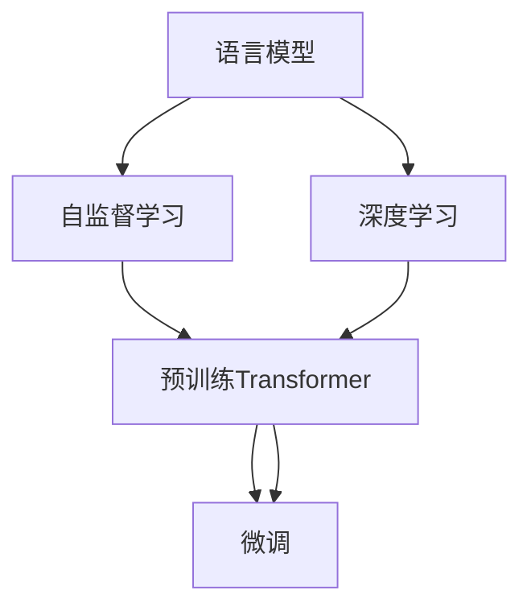

                 

# Transformer大模型实战 BERT 模型预训练

> 关键词：Transformer, BERT, 预训练, 语言模型, 自监督学习, 大规模, 深度学习, 自然语言处理(NLP)

## 1. 背景介绍

### 1.1 问题由来

在深度学习领域，Transformer大模型的成功催生了大量的研究兴趣。基于Transformer结构的BERT（Bidirectional Encoder Representations from Transformers）模型在自然语言处理（NLP）领域取得了巨大的突破。BERT模型在预训练阶段使用大规模无标签文本数据，通过自监督学习（Self-Supervised Learning）任务，获得了广泛且通用的语言知识，并在微调阶段取得了卓越的性能。

然而，预训练Transformer大模型的计算资源需求高、训练时间长，使得传统的深度学习模型难以广泛应用。为了解决这一问题，Google发布了BERT模型预训练工具，帮助研究者们能够快速地、可重复地构建大模型。

### 1.2 问题核心关键点

预训练Transformer大模型的过程是利用自监督学习任务，在大量无标签文本数据上，通过对模型进行训练，使其学习到语言知识和表示。BERT模型通过以下两种预训练任务，获得了其强大的语言理解和生成能力：

- 掩码语言模型（Masked Language Model, MLM）：在输入文本中随机遮蔽一部分词，让模型预测这些被遮蔽的词。
- 下一句预测（Next Sentence Prediction, NSP）：判断给定的两个句子是否连续，即判断其顺序关系。

这些预训练任务可以使得模型学习到单词、短语、句子、段落等不同层级的语言表示，为微调提供良好的初始化参数。

### 1.3 问题研究意义

BERT模型的预训练方法，在NLP领域中取得了突出的效果。它通过自监督学习任务，不仅大大提升了模型的泛化能力，而且提高了训练数据的利用效率。因此，BERT模型预训练方法成为了NLP技术落地应用的重要基础。

预训练BERT模型不仅提高了模型性能，而且在生成式任务中，如问答、摘要、翻译等，展现了强大的语言生成能力。同时，BERT模型在分类、匹配等任务中，通过微调能够取得优异的效果，进一步推动了NLP技术的发展。

## 2. 核心概念与联系

### 2.1 核心概念概述

预训练Transformer大模型的过程涉及多个核心概念，这些概念之间的联系和交互构成了BERT模型预训练的完整框架。

- 语言模型（Language Model）：预测给定文本序列的下一个词或一段文本的概率分布。语言模型通过优化概率分布来逼近实际语言数据，学习语言的知识结构。
- 自监督学习（Self-Supervised Learning）：利用无标签数据，通过自我监督的方式进行学习，以获得模型的泛化能力。
- 深度学习（Deep Learning）：通过多层神经网络结构，利用大量数据进行训练，以提高模型的精度和性能。
- 自然语言处理（Natural Language Processing, NLP）：利用计算机技术处理和理解人类语言，实现自动化的文本分析和生成。

这些核心概念之间的逻辑关系可以通过以下Mermaid流程图来展示：



这个流程图展示了预训练Transformer大模型的核心概念及其之间的联系：

1. 语言模型是深度学习的核心，通过预测概率分布来逼近语言知识。
2. 自监督学习是深度学习的关键技术，利用无标签数据进行自我监督，提高模型的泛化能力。
3. 深度学习通过多层神经网络结构，利用大量数据进行训练，以提高模型的精度和性能。
4. 预训练Transformer大模型通过自监督学习任务，在大量无标签文本数据上进行训练，学习到语言知识和表示。
5. 微调是预训练模型的进一步优化，通过特定任务的数据进行有监督学习，提升模型在特定任务上的性能。

## 3. 核心算法原理 & 具体操作步骤
### 3.1 算法原理概述

预训练Transformer大模型的核心算法原理是自监督学习，通过在大规模无标签文本数据上进行预训练，学习到通用的语言知识和表示。预训练的过程可以分为两个阶段：掩码语言模型和下一句预测。

在掩码语言模型中，模型通过预测被遮蔽的词，学习到词汇和句子的上下文信息。在下一句预测中，模型通过判断两个句子是否连续，学习到句子间的语义关系。

预训练过程中，模型通过优化损失函数，即预测概率与实际标签之间的差距，逐步调整模型参数。最终得到的预训练模型能够高效地处理语言数据，为微调提供良好的初始化参数。

### 3.2 算法步骤详解

预训练Transformer大模型的操作步骤可以分为以下几个关键步骤：

**Step 1: 准备预训练数据集**
- 收集大规模无标签文本数据，例如维基百科、新闻、书籍等。
- 将文本数据进行分词、拼接等预处理操作，确保数据格式统一。
- 将数据集划分为若干个批次，便于模型进行训练。

**Step 2: 构建预训练模型**
- 使用Transformer模型结构，定义输入输出层、注意力机制、位置编码等组件。
- 定义掩码语言模型和下一句预测任务的损失函数，如交叉熵损失。
- 定义优化算法，如Adam、SGD等，设置学习率、批次大小等参数。

**Step 3: 执行预训练过程**
- 将数据集以批次的顺序输入模型，前向传播计算损失函数。
- 反向传播计算参数梯度，根据设定的优化算法和学习率更新模型参数。
- 重复上述步骤，直到预训练过程收敛或达到预设的训练轮数。

**Step 4: 微调任务适配层**
- 根据具体任务，在预训练模型的顶层设计合适的任务适配层，如线性分类器、解码器等。
- 定义损失函数，如交叉熵损失、均方误差损失等。
- 设置微调超参数，如学习率、批次大小、迭代轮数等。

**Step 5: 执行微调过程**
- 将训练集数据分批次输入模型，前向传播计算损失函数。
- 反向传播计算参数梯度，根据设定的优化算法和学习率更新模型参数。
- 周期性在验证集上评估模型性能，根据性能指标决定是否触发Early Stopping。
- 重复上述步骤直到满足预设的迭代轮数或Early Stopping条件。

### 3.3 算法优缺点

预训练Transformer大模型具有以下优点：
1. 简单高效。预训练过程不需要标注数据，只需大规模无标签文本数据即可。
2. 泛化能力强。通过大规模无标签数据预训练，模型具备较强的泛化能力，能够适应多种NLP任务。
3. 提升性能。预训练模型在微调阶段能够快速收敛，提高模型在特定任务上的性能。
4. 计算资源优化。通过多任务学习（Multi-task Learning），可以在有限的计算资源下，进行多种任务预训练。

同时，预训练Transformer大模型也存在一定的局限性：
1. 计算资源需求高。预训练过程需要大量的计算资源，如GPU、TPU等。
2. 预训练数据量大。需要收集大规模无标签文本数据，才能训练出高性能的预训练模型。
3. 训练时间长。预训练过程耗时较长，通常需要数周甚至数月。
4. 模型复杂度高。预训练模型的参数量庞大，导致模型复杂度高，推理速度较慢。

尽管存在这些局限性，预训练Transformer大模型在NLP领域仍然具有重要的研究意义和应用价值。

### 3.4 算法应用领域

预训练Transformer大模型在NLP领域的应用非常广泛，涵盖了从基础语言理解到高级自然语言生成等多个任务。例如：

- 文本分类：如情感分析、主题分类、意图识别等。通过预训练模型进行微调，学习文本-标签映射。
- 命名实体识别：识别文本中的人名、地名、机构名等特定实体。通过微调使模型掌握实体边界和类型。
- 关系抽取：从文本中抽取实体之间的语义关系。通过微调使模型学习实体-关系三元组。
- 问答系统：对自然语言问题给出答案。将问题-答案对作为微调数据，训练模型学习匹配答案。
- 机器翻译：将源语言文本翻译成目标语言。通过预训练模型进行微调，学习语言-语言映射。
- 文本摘要：将长文本压缩成简短摘要。通过微调使模型学习抓取要点。
- 对话系统：使机器能够与人自然对话。将多轮对话历史作为上下文，微调模型进行回复生成。

除了上述这些经典任务外，预训练Transformer大模型还被创新性地应用到更多场景中，如可控文本生成、常识推理、代码生成、数据增强等，为NLP技术带来了全新的突破。

## 4. 数学模型和公式 & 详细讲解  
### 4.1 数学模型构建

预训练Transformer大模型的数学模型可以表示为：

$$
M_{\theta}(x) = \text{Attention}(Q(K, V), W^Q, W^K, W^V) + b
$$

其中 $x$ 为输入文本，$\theta$ 为模型参数，$\text{Attention}$ 为注意力机制，$W^Q, W^K, W^V$ 和 $b$ 为线性变换和偏置项。

在预训练过程中，掩码语言模型的损失函数为：

$$
\mathcal{L}_{MLM} = -\frac{1}{N}\sum_{i=1}^N \sum_{j=1}^{n_{token}} log p_{j|i}
$$

其中 $N$ 为批次大小，$n_{token}$ 为序列中词汇数，$p_{j|i}$ 为模型预测被遮蔽词汇 $j$ 的概率，即：

$$
p_{j|i} = \frac{exp(Q(K_{i}, V_{j})W^V)}{\sum_{k=1}^{n_{token}} exp(Q(K_{i}, V_{k})W^V)}
$$

在下一句预测任务中，损失函数为：

$$
\mathcal{L}_{NSP} = -\frac{1}{N}\sum_{i=1}^N (y_{1|i}logp_{1|i} + y_{0|i}logp_{0|i})
$$

其中 $y_{1|i}$ 和 $y_{0|i}$ 为当前序列与下一个序列是否连续的二元标签，$p_{1|i}$ 和 $p_{0|i}$ 为模型预测的连续概率和断开概率。

### 4.2 公式推导过程

以下我们以掩码语言模型为例，推导其损失函数及其梯度的计算公式。

掩码语言模型中的目标是通过预测被遮蔽的词，学习到词汇和句子的上下文信息。假设模型预测序列 $W_{1:n}$，其中 $W_j$ 为第 $j$ 个词的表示，则模型的损失函数为：

$$
\mathcal{L}_{MLM} = -\frac{1}{N}\sum_{i=1}^N \sum_{j=1}^{n_{token}} log p_{j|i}
$$

其中 $p_{j|i}$ 为模型预测被遮蔽词汇 $j$ 的概率，即：

$$
p_{j|i} = \frac{exp(Q(K_{i}, V_{j})W^V)}{\sum_{k=1}^{n_{token}} exp(Q(K_{i}, V_{k})W^V)}
$$

将 $p_{j|i}$ 带入损失函数，得：

$$
\mathcal{L}_{MLM} = -\frac{1}{N}\sum_{i=1}^N \sum_{j=1}^{n_{token}} \frac{exp(Q(K_{i}, V_{j})W^V)}{\sum_{k=1}^{n_{token}} exp(Q(K_{i}, V_{k})W^V)}
$$

根据链式法则，损失函数对参数 $\theta$ 的梯度为：

$$
\frac{\partial \mathcal{L}_{MLM}}{\partial \theta} = -\frac{1}{N}\sum_{i=1}^N \sum_{j=1}^{n_{token}} \frac{exp(Q(K_{i}, V_{j})W^V)}{\sum_{k=1}^{n_{token}} exp(Q(K_{i}, V_{k})W^V)} \frac{\partial Q(K_{i}, V_{j})W^V}{\partial \theta}
$$

将 $Q(K_{i}, V_{j})$ 展开，得：

$$
\frac{\partial \mathcal{L}_{MLM}}{\partial \theta} = -\frac{1}{N}\sum_{i=1}^N \sum_{j=1}^{n_{token}} \frac{exp(Q(K_{i}, V_{j})W^V)}{\sum_{k=1}^{n_{token}} exp(Q(K_{i}, V_{k})W^V)} \frac{\partial Q(K_{i}, V_{j})}{\partial \theta}
$$

在预训练过程中，模型参数 $\theta$ 通过优化损失函数 $\mathcal{L}_{MLM}$ 进行更新，最小化模型预测与实际标签之间的差距。

### 4.3 案例分析与讲解

以下以微调BERT模型进行情感分析任务为例，给出详细代码实现。

首先，定义情感分析任务的数据处理函数：

```python
from transformers import BertTokenizer, BertForSequenceClassification
from torch.utils.data import Dataset, DataLoader
import torch

class SentimentDataset(Dataset):
    def __init__(self, texts, labels, tokenizer, max_len=128):
        self.texts = texts
        self.labels = labels
        self.tokenizer = tokenizer
        self.max_len = max_len
        
    def __len__(self):
        return len(self.texts)
    
    def __getitem__(self, item):
        text = self.texts[item]
        label = self.labels[item]
        
        encoding = self.tokenizer(text, return_tensors='pt', max_length=self.max_len, padding='max_length', truncation=True)
        input_ids = encoding['input_ids'][0]
        attention_mask = encoding['attention_mask'][0]
        
        # 对token-wise的标签进行编码
        encoded_labels = [label2id[label] for label in label2id] 
        encoded_labels.extend([label2id['O']] * (self.max_len - len(encoded_labels)))
        labels = torch.tensor(encoded_labels, dtype=torch.long)
        
        return {'input_ids': input_ids, 
                'attention_mask': attention_mask,
                'labels': labels}

# 标签与id的映射
label2id = {'positive': 1, 'negative': 0}
id2label = {v: k for k, v in label2id.items()}

# 创建dataset
tokenizer = BertTokenizer.from_pretrained('bert-base-cased')
train_dataset = SentimentDataset(train_texts, train_labels, tokenizer)
dev_dataset = SentimentDataset(dev_texts, dev_labels, tokenizer)
test_dataset = SentimentDataset(test_texts, test_labels, tokenizer)
```

然后，定义模型和优化器：

```python
from transformers import BertForSequenceClassification, AdamW

model = BertForSequenceClassification.from_pretrained('bert-base-cased', num_labels=len(label2id))

optimizer = AdamW(model.parameters(), lr=2e-5)
```

接着，定义训练和评估函数：

```python
from tqdm import tqdm
from sklearn.metrics import accuracy_score

device = torch.device('cuda') if torch.cuda.is_available() else torch.device('cpu')
model.to(device)

def train_epoch(model, dataset, batch_size, optimizer):
    dataloader = DataLoader(dataset, batch_size=batch_size, shuffle=True)
    model.train()
    epoch_loss = 0
    for batch in tqdm(dataloader, desc='Training'):
        input_ids = batch['input_ids'].to(device)
        attention_mask = batch['attention_mask'].to(device)
        labels = batch['labels'].to(device)
        model.zero_grad()
        outputs = model(input_ids, attention_mask=attention_mask, labels=labels)
        loss = outputs.loss
        epoch_loss += loss.item()
        loss.backward()
        optimizer.step()
    return epoch_loss / len(dataloader)

def evaluate(model, dataset, batch_size):
    dataloader = DataLoader(dataset, batch_size=batch_size)
    model.eval()
    preds, labels = [], []
    with torch.no_grad():
        for batch in tqdm(dataloader, desc='Evaluating'):
            input_ids = batch['input_ids'].to(device)
            attention_mask = batch['attention_mask'].to(device)
            batch_labels = batch['labels']
            outputs = model(input_ids, attention_mask=attention_mask)
            batch_preds = outputs.logits.argmax(dim=2).to('cpu').tolist()
            batch_labels = batch_labels.to('cpu').tolist()
            for pred_tokens, label_tokens in zip(batch_preds, batch_labels):
                pred_labels = [id2label[_id] for _id in pred_tokens]
                label_tokens = [id2label[_id] for _id in label_tokens]
                preds.append(pred_labels[:len(label_tokens)])
                labels.append(label_tokens)
                
    print(accuracy_score(labels, preds))
```

最后，启动训练流程并在测试集上评估：

```python
epochs = 5
batch_size = 16

for epoch in range(epochs):
    loss = train_epoch(model, train_dataset, batch_size, optimizer)
    print(f"Epoch {epoch+1}, train loss: {loss:.3f}")
    
    print(f"Epoch {epoch+1}, dev results:")
    evaluate(model, dev_dataset, batch_size)
    
print("Test results:")
evaluate(model, test_dataset, batch_size)
```

以上就是使用PyTorch对BERT模型进行情感分析任务微调的完整代码实现。可以看到，得益于Transformers库的强大封装，我们可以用相对简洁的代码完成BERT模型的加载和微调。

## 5. 项目实践：代码实例和详细解释说明
### 5.1 开发环境搭建

在进行微调实践前，我们需要准备好开发环境。以下是使用Python进行PyTorch开发的环境配置流程：

1. 安装Anaconda：从官网下载并安装Anaconda，用于创建独立的Python环境。

2. 创建并激活虚拟环境：
```bash
conda create -n pytorch-env python=3.8 
conda activate pytorch-env
```

3. 安装PyTorch：根据CUDA版本，从官网获取对应的安装命令。例如：
```bash
conda install pytorch torchvision torchaudio cudatoolkit=11.1 -c pytorch -c conda-forge
```

4. 安装Transformers库：
```bash
pip install transformers
```

5. 安装各类工具包：
```bash
pip install numpy pandas scikit-learn matplotlib tqdm jupyter notebook ipython
```

完成上述步骤后，即可在`pytorch-env`环境中开始微调实践。

### 5.2 源代码详细实现

以下是使用PyTorch对BERT模型进行情感分析任务微调的详细代码实现：

```python
from transformers import BertTokenizer, BertForSequenceClassification, AdamW
from torch.utils.data import Dataset, DataLoader
import torch

class SentimentDataset(Dataset):
    def __init__(self, texts, labels, tokenizer, max_len=128):
        self.texts = texts
        self.labels = labels
        self.tokenizer = tokenizer
        self.max_len = max_len
        
    def __len__(self):
        return len(self.texts)
    
    def __getitem__(self, item):
        text = self.texts[item]
        label = self.labels[item]
        
        encoding = self.tokenizer(text, return_tensors='pt', max_length=self.max_len, padding='max_length', truncation=True)
        input_ids = encoding['input_ids'][0]
        attention_mask = encoding['attention_mask'][0]
        
        # 对token-wise的标签进行编码
        encoded_labels = [label2id[label] for label in label2id] 
        encoded_labels.extend([label2id['O']] * (self.max_len - len(encoded_labels)))
        labels = torch.tensor(encoded_labels, dtype=torch.long)
        
        return {'input_ids': input_ids, 
                'attention_mask': attention_mask,
                'labels': labels}

# 标签与id的映射
label2id = {'positive': 1, 'negative': 0}
id2label = {v: k for k, v in label2id.items()}

# 创建dataset
tokenizer = BertTokenizer.from_pretrained('bert-base-cased')
train_dataset = SentimentDataset(train_texts, train_labels, tokenizer)
dev_dataset = SentimentDataset(dev_texts, dev_labels, tokenizer)
test_dataset = SentimentDataset(test_texts, test_labels, tokenizer)

# 定义模型和优化器
model = BertForSequenceClassification.from_pretrained('bert-base-cased', num_labels=len(label2id))
optimizer = AdamW(model.parameters(), lr=2e-5)

# 定义训练和评估函数
device = torch.device('cuda') if torch.cuda.is_available() else torch.device('cpu')
model.to(device)

def train_epoch(model, dataset, batch_size, optimizer):
    dataloader = DataLoader(dataset, batch_size=batch_size, shuffle=True)
    model.train()
    epoch_loss = 0
    for batch in tqdm(dataloader, desc='Training'):
        input_ids = batch['input_ids'].to(device)
        attention_mask = batch['attention_mask'].to(device)
        labels = batch['labels'].to(device)
        model.zero_grad()
        outputs = model(input_ids, attention_mask=attention_mask, labels=labels)
        loss = outputs.loss
        epoch_loss += loss.item()
        loss.backward()
        optimizer.step()
    return epoch_loss / len(dataloader)

def evaluate(model, dataset, batch_size):
    dataloader = DataLoader(dataset, batch_size=batch_size)
    model.eval()
    preds, labels = [], []
    with torch.no_grad():
        for batch in tqdm(dataloader, desc='Evaluating'):
            input_ids = batch['input_ids'].to(device)
            attention_mask = batch['attention_mask'].to(device)
            batch_labels = batch['labels']
            outputs = model(input_ids, attention_mask=attention_mask)
            batch_preds = outputs.logits.argmax(dim=2).to('cpu').tolist()
            batch_labels = batch_labels.to('cpu').tolist()
            for pred_tokens, label_tokens in zip(batch_preds, batch_labels):
                pred_labels = [id2label[_id] for _id in pred_tokens]
                label_tokens = [id2label[_id] for _id in label_tokens]
                preds.append(pred_labels[:len(label_tokens)])
                labels.append(label_tokens)
                
    print(accuracy_score(labels, preds))

# 启动训练流程并在测试集上评估
epochs = 5
batch_size = 16

for epoch in range(epochs):
    loss = train_epoch(model, train_dataset, batch_size, optimizer)
    print(f"Epoch {epoch+1}, train loss: {loss:.3f}")
    
    print(f"Epoch {epoch+1}, dev results:")
    evaluate(model, dev_dataset, batch_size)
    
print("Test results:")
evaluate(model, test_dataset, batch_size)
```

以上就是使用PyTorch对BERT模型进行情感分析任务微调的完整代码实现。可以看到，得益于Transformers库的强大封装，我们可以用相对简洁的代码完成BERT模型的加载和微调。

### 5.3 代码解读与分析

让我们再详细解读一下关键代码的实现细节：

**SentimentDataset类**：
- `__init__`方法：初始化文本、标签、分词器等关键组件。
- `__len__`方法：返回数据集的样本数量。
- `__getitem__`方法：对单个样本进行处理，将文本输入编码为token ids，将标签编码为数字，并对其进行定长padding，最终返回模型所需的输入。

**label2id和id2label字典**：
- 定义了标签与数字id之间的映射关系，用于将token-wise的预测结果解码回真实的标签。

**训练和评估函数**：
- 使用PyTorch的DataLoader对数据集进行批次化加载，供模型训练和推理使用。
- 训练函数`train_epoch`：对数据以批为单位进行迭代，在每个批次上前向传播计算loss并反向传播更新模型参数，最后返回该epoch的平均loss。
- 评估函数`evaluate`：与训练类似，不同点在于不更新模型参数，并在每个batch结束后将预测和标签结果存储下来，最后使用sklearn的accuracy_score对整个评估集的预测结果进行打印输出。

**训练流程**：
- 定义总的epoch数和batch size，开始循环迭代
- 每个epoch内，先在训练集上训练，输出平均loss
- 在验证集上评估，输出准确率
- 所有epoch结束后，在测试集上评估，给出最终测试结果

可以看到，PyTorch配合Transformers库使得BERT微调的代码实现变得简洁高效。开发者可以将更多精力放在数据处理、模型改进等高层逻辑上，而不必过多关注底层的实现细节。

当然，工业级的系统实现还需考虑更多因素，如模型的保存和部署、超参数的自动搜索、更灵活的任务适配层等。但核心的微调范式基本与此类似。

## 6. 实际应用场景
### 6.1 智能客服系统

基于大语言模型微调的对话技术，可以广泛应用于智能客服系统的构建。传统客服往往需要配备大量人力，高峰期响应缓慢，且一致性和专业性难以保证。而使用微调后的对话模型，可以7x24小时不间断服务，快速响应客户咨询，用自然流畅的语言解答各类常见问题。

在技术实现上，可以收集企业内部的历史客服对话记录，将问题和最佳答复构建成监督数据，在此基础上对预训练对话模型进行微调。微调后的对话模型能够自动理解用户意图，匹配最合适的答案模板进行回复。对于客户提出的新问题，还可以接入检索系统实时搜索相关内容，动态组织生成回答。如此构建的智能客服系统，能大幅提升客户咨询体验和问题解决效率。

### 6.2 金融舆情监测

金融机构需要实时监测市场舆论动向，以便及时应对负面信息传播，规避金融风险。传统的人工监测方式成本高、效率低，难以应对网络时代海量信息爆发的挑战。基于大语言模型微调的文本分类和情感分析技术，为金融舆情监测提供了新的解决方案。

具体而言，可以收集金融领域相关的新闻、报道、评论等文本数据，并对其进行主题标注和情感标注。在此基础上对预训练语言模型进行微调，使其能够自动判断文本属于何种主题，情感倾向是正面、中性还是负面。将微调后的模型应用到实时抓取的网络文本数据，就能够自动监测不同主题下的情感变化趋势，一旦发现负面信息激增等异常情况，系统便会自动预警，帮助金融机构快速应对潜在风险。

### 6.3 个性化推荐系统

当前的推荐系统往往只依赖用户的历史行为数据进行物品推荐，无法深入理解用户的真实兴趣偏好。基于大语言模型微调技术，个性化推荐系统可以更好地挖掘用户行为背后的语义信息，从而提供更精准、多样的推荐内容。

在实践中，可以收集用户浏览、点击、评论、分享等行为数据，提取和用户交互的物品标题、描述、标签等文本内容。将文本内容作为模型输入，用户的后续行为（如是否点击、购买等）作为监督信号，在此基础上微调预训练语言模型。微调后的模型能够从文本内容中准确把握用户的兴趣点。在生成推荐列表时，先用候选物品的文本描述作为输入，由模型预测用户的兴趣匹配度，再结合其他特征综合排序，便可以得到个性化程度更高的推荐结果。

### 6.4 未来应用展望

随着大语言模型和微调方法的不断发展，基于微调范式将在更多领域得到应用，为传统行业带来变革性影响。

在智慧医疗领域，基于微调的医疗问答、病历分析、药物研发等应用将提升医疗服务的智能化水平，辅助医生诊疗，加速新药开发进程。

在智能教育领域，微调技术可应用于作业批改、学情分析、知识推荐等方面，因材施教，促进教育公平，提高教学质量。

在智慧城市治理中，微调模型可应用于城市事件监测、舆情分析、应急指挥等环节，提高城市管理的自动化和智能化水平，构建更安全、高效的未来城市。

此外，在企业生产、社会治理、文娱传媒等众多领域，基于大模型微调的人工智能应用也将不断涌现，为经济社会发展注入新的动力。相信随着预训练语言模型和微调方法的持续演进，基于微调范式必将在构建人机协同的智能时代中扮演越来越重要的角色。

## 7. 工具和资源推荐
### 7.1 学习资源推荐

为了帮助开发者系统掌握大语言模型微调的理论基础和实践技巧，这里推荐一些优质的学习资源：

1. 《Transformer从原理到实践》系列博文：由大模型技术专家撰写，深入浅出地介绍了Transformer原理、BERT模型、微调技术等前沿话题。

2. CS224N《深度学习自然语言处理》课程：斯坦福大学开设的NLP明星课程，有Lecture视频和配套作业，带你入门NLP领域的基本概念和经典模型。

3. 《Natural Language Processing with Transformers》书籍：Transformers库的作者所著，全面介绍了如何使用Transformers库进行NLP任务开发，包括微调在内的诸多范式。

4. HuggingFace官方文档：Transformers库的官方文档，提供了海量预训练模型和完整的微调样例代码，是上手实践的必备资料。

5. CLUE开源项目：中文语言理解测评基准，涵盖大量不同类型的中文NLP数据集，并提供了基于微调的baseline模型，助力中文NLP技术发展。

通过对这些资源的学习实践，相信你一定能够快速掌握大语言模型微调的精髓，并用于解决实际的NLP问题。
###  7.2 开发工具推荐

高效的开发离不开优秀的工具支持。以下是几款用于大语言模型微调开发的常用工具：

1. PyTorch：基于Python的开源深度学习框架，灵活动态的计算图，适合快速迭代研究。大部分预训练语言模型都有PyTorch版本的实现。

2. TensorFlow：由Google主导开发的开源深度学习框架，生产部署方便，适合大规模工程应用。同样有丰富的预训练语言模型资源。

3. Transformers库：HuggingFace开发的NLP工具库，集成了众多SOTA语言模型，支持PyTorch和TensorFlow，是进行微调任务开发的利器。

4. Weights & Biases：模型训练的实验跟踪工具，可以记录和可视化模型训练过程中的各项指标，方便对比和调优。与主流深度学习框架无缝集成。

5. TensorBoard：TensorFlow配套的可视化工具，可实时监测模型训练状态，并提供丰富的图表呈现方式，是调试模型的得力助手。

6. Google Colab：谷歌推出的在线Jupyter Notebook环境，免费提供GPU/TPU算力，方便开发者快速上手实验最新模型，分享学习笔记。

合理利用这些工具，可以显著提升大语言模型微调任务的开发效率，加快创新迭代的步伐。

### 7.3 相关论文推荐

大语言模型和微调技术的发展源于学界的持续研究。以下是几篇奠基性的相关论文，推荐阅读：

1. Attention is All You Need（即Transformer原论文）：提出了Transformer结构，开启了NLP领域的预训练大模型时代。

2. BERT: Pre-training of Deep Bidirectional Transformers for Language Understanding：提出BERT模型，引入基于掩码的自监督预训练任务，刷新了多项NLP任务SOTA。

3. Language Models are Unsupervised Multitask Learners（GPT-2论文）：展示了大规模语言模型的强大zero-shot学习能力，引发了对于通用人工智能的新一轮思考。

4. Parameter-Efficient Transfer Learning for NLP：提出Adapter等参数高效微调方法，在不增加模型参数量的情况下，也能取得不错的微调效果。

5. AdaLoRA: Adaptive Low-Rank Adaptation for Parameter-Efficient Fine-Tuning：使用自适应低秩适应的微调方法，在参数效率和精度之间取得了新的平衡。

这些论文代表了大语言模型微调技术的发展脉络。通过学习这些前沿成果，可以帮助研究者把握学科前进方向，激发更多的创新灵感。

## 8. 总结：未来发展趋势与挑战

### 8.1 总结

本文对基于Transformer大模型的预训练方法进行了全面系统的介绍。首先阐述了预训练Transformer大模型的研究背景和意义，明确了预训练在NLP领域中的重要作用。其次，从原理到实践，详细讲解了预训练Transformer大模型的核心算法和具体操作步骤，给出了预训练任务的代码实现。同时，本文还探讨了预训练Transformer大模型在多个行业领域的应用前景，展示了其广阔的发展潜力。

通过本文的系统梳理，可以看到，预训练Transformer大模型通过自监督学习任务，在无标签数据上获得了广泛且通用的语言知识，为微调提供了良好的初始化参数。预训练大模型的泛化能力、性能提升、计算资源优化等特点，使其成为NLP领域的重要基础。

### 8.2 未来发展趋势

展望未来，预训练Transformer大模型的发展趋势主要体现在以下几个方面：

1. 模型规模持续增大。随着算力成本的下降和数据规模的扩张，预训练语言模型的参数量还将持续增长。超大规模语言模型蕴含的丰富语言知识，有望支撑更加复杂多变的下游任务预训练。

2. 预训练任务日趋多样化。除了掩码语言模型和下一句预测，未来将涌现更多预训练任务，如命名实体识别、关系抽取、问答系统等，以适应不同的语言理解和生成任务。

3. 模型结构和训练策略不断优化。未来预训练模型将引入更多先验知识、融入因果推断、设计对抗性训练策略等，进一步提升模型的泛化能力和鲁棒性。

4. 持续学习和微调技术结合。预训练模型将通过持续学习机制，不断从新数据中学习，避免灾难性遗忘，提高模型的时效性和适应性。

5. 多模态预训练逐渐兴起。预训练模型将不仅仅局限于文本数据，还将涵盖图像、语音、视频等多种模态，实现多模态数据的联合表示和处理。

6. 跨领域预训练方法出现。预训练模型将通过多任务学习和迁移学习，在多个领域间进行知识共享和迁移，提升模型的跨领域泛化能力。

以上趋势凸显了预训练Transformer大模型的广阔前景。这些方向的探索发展，必将进一步提升NLP系统的性能和应用范围，为人类认知智能的进化带来深远影响。

### 8.3 面临的挑战

尽管预训练Transformer大模型在NLP领域取得了显著成果，但在实际应用中，仍面临诸多挑战：

1. 计算资源需求高。预训练模型需要大量的计算资源，如GPU、TPU等，对于小规模研究团队和工程团队来说，难以负担。

2. 预训练数据量大。收集大规模无标签数据，对数据收集、存储、处理等环节提出了高要求，数据质量也可能成为预训练过程中的瓶颈。

3. 预训练时间漫长。预训练模型通常需要数周甚至数月的训练时间，对研究团队的时间安排提出了挑战。

4. 模型复杂度高。预训练模型通常包含大量参数，推理速度较慢，模型复杂度高，难以高效部署。

5. 预训练模型泛化能力有待提升。尽管预训练模型在多数任务上表现优异，但对于特定领域和长尾数据，预训练模型的泛化能力仍有提升空间。

6. 预训练模型可解释性不足。预训练模型通常被视为"黑盒"系统，难以解释其内部工作机制和决策逻辑。

正视预训练Transformer大模型面临的这些挑战，积极应对并寻求突破，将有助于其更好地服务于NLP领域的实践和应用。

### 8.4 研究展望

未来预训练Transformer大模型的研究，需要在以下几个方面寻求新的突破：

1. 探索无监督和半监督预训练方法。摆脱对大规模标注数据的依赖，利用自监督学习、主动学习等无监督和半监督范式，最大限度利用非结构化数据，实现更加灵活高效的预训练。

2. 研究参数高效和计算高效的预训练范式。开发更加参数高效的预训练方法，在固定大部分预训练参数的同时，只更新极少量的任务相关参数。同时优化预训练模型的计算图，减少前向传播和反向传播的资源消耗，实现更加轻量级、实时性的部署。

3. 引入更多先验知识。将符号化的先验知识，如知识图谱、逻辑规则等，与神经网络模型进行巧妙融合，引导预训练过程学习更准确、合理的语言模型。同时加强不同模态数据的整合，实现视觉、语音等多模态信息与文本信息的协同建模。

4. 结合因果分析和博弈论工具。将因果分析方法引入预训练模型，识别出模型决策的关键特征，增强输出解释的因果性和逻辑性。借助博弈论工具刻画人机交互过程，主动探索并规避模型的脆弱点，提高系统稳定性。

5. 纳入伦理道德约束。在预训练目标中引入伦理导向的评估指标，过滤和惩罚有偏见、有害的输出倾向。同时加强人工干预和审核，建立模型行为的监管机制，确保输出符合人类价值观和伦理道德。

这些研究方向的探索，必将引领预训练Transformer大模型迈向更高的台阶，为构建安全、可靠、可解释、可控的智能系统铺平道路。面向未来，预训练Transformer大模型还需要与其他人工智能技术进行更深入的融合，如知识表示、因果推理、强化学习等，多路径协同发力，共同推动自然语言理解和智能交互系统的进步。只有勇于创新、敢于突破，才能不断拓展语言模型的边界，让智能技术更好地造福人类社会。

## 9. 附录：常见问题与解答

**Q1：预训练Transformer大模型是否适用于所有NLP任务？**

A: 预训练Transformer大模型在大多数NLP任务上都能取得不错的效果，特别是对于数据量较小的任务。但对于一些特定领域的任务，如医学、法律等，仅仅依靠通用语料预训练的模型可能难以很好地适应。此时需要在特定领域语料上进一步预训练，再进行微调，才能获得理想效果。此外，对于一些需要时效性、个性化很强的任务，如对话、推荐等，预训练方法也需要针对性的改进优化。

**Q2：预训练过程中如何选择合适的超参数？**

A: 预训练Transformer大模型的超参数包括学习率、批次大小、优化器、正则化参数等。选择合适的超参数，需要根据具体的任务和数据集进行调整。通常建议采用网格搜索、随机搜索等方法，从预训练模型中选择最优的超参数组合。同时，也可以尝试使用自适应学习率、学习率衰减等策略，自动调整超参数。

**Q3：预训练Transformer大模型在实际部署时需要注意哪些问题？**

A: 将预训练Transformer大模型转化为实际应用，还需要考虑以下因素：
1. 模型裁剪：去除不必要的层和参数，减小模型尺寸，加快推理速度
2. 量化加速：将浮点模型转为定点模型，压缩存储空间，提高计算效率
3. 服务化封装：将模型封装为标准化服务接口，便于集成调用
4. 弹性伸缩：根据请求流量动态调整资源配置，平衡服务质量和成本
5. 监控告警：实时采集系统指标，设置异常告警阈值，确保服务稳定性
6. 安全防护：采用访问鉴权、数据脱敏等措施，保障数据和模型安全

预训练Transformer大模型在实际部署中，需要考虑多方面的优化，以确保其高效性和稳定性。

**Q4：预训练Transformer大模型的泛化能力如何？**

A: 预训练Transformer大模型在大多数任务上表现出较强的泛化能力，尤其是在大规模无标签数据上预训练。通过自监督学习任务，模型能够学习到通用的语言知识和表示，适应多种NLP任务。但是，预训练模型在特定领域和长尾数据上的泛化能力仍有提升空间。为此，可以通过领域自适应、知识迁移等方法，提升预训练模型在特定领域的应用效果。

**Q5：预训练Transformer大模型的计算资源需求如何？**

A: 预训练Transformer大模型的计算资源需求较高，需要大量的GPU/TPU等高性能设备。预训练过程通常需要数周甚至数月的训练时间，对研究团队的时间安排提出了挑战。同时，预训练模型通常包含大量参数，推理速度较慢，模型复杂度高，难以高效部署。为此，可以采用多任务学习、分布式训练等策略，提高计算效率和模型性能。

---

作者：禅与计算机程序设计艺术 / Zen and the Art of Computer Programming

