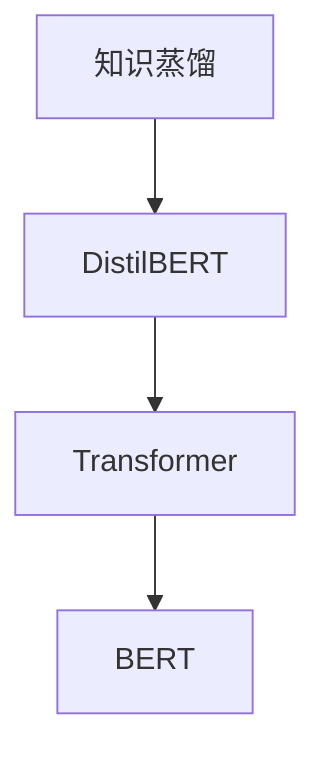

                 

# Transformer大模型实战 DistilBERT 模型——BERT模型的知识蒸馏版本

> 关键词：知识蒸馏, Transformer, DistilBERT, BERT, 大模型压缩, 微调, 可解释性

## 1. 背景介绍

随着深度学习技术的快速演进，大规模预训练模型如BERT、GPT-3等在自然语言处理(NLP)领域取得了显著的成就。然而，这些模型通常具有数十亿甚至数百亿的参数量，导致其在计算资源、存储需求和部署效率方面面临诸多挑战。

DistilBERT应运而生，它是BERT模型的知识蒸馏版本，通过精简模型规模和优化计算效率，同时保持其在语言理解和生成任务中的高性能。这种知识蒸馏技术不仅压缩了模型，还提升了模型在推理和应用中的效率，使其更加适合资源受限的设备或移动应用。

本博客将详细介绍DistilBERT模型的原理与实战技巧，帮助读者理解如何通过知识蒸馏技术，构建高效、轻量级的自然语言处理模型。

## 2. 核心概念与联系

### 2.1 核心概念概述

为更好地理解DistilBERT模型的实现原理，本节将介绍几个关键概念：

- **知识蒸馏(Knowledge Distillation)**：一种通过将教师模型（大模型）的知识传递给学生模型（小模型），提高学生模型的表现的技术。
- **Transformer**：一种基于自注意力机制的神经网络结构，广泛用于各种大模型如BERT、GPT等。
- **BERT模型**：由Google提出的预训练语言模型，在各种NLP任务上表现优异，但其巨大的参数量限制了其在大规模部署中的应用。
- **DistilBERT**：BERT模型的精简版本，通过知识蒸馏技术得到，在保持BERT性能的同时，大幅减小了模型规模。

这些核心概念之间的逻辑关系可以通过以下Mermaid流程图来展示：



这个流程图展示了知识蒸馏从教师模型到学生模型的传递过程，以及如何通过DistilBERT模型将BERT的知识应用到更小、更轻量级的Transformer结构中。

## 3. 核心算法原理 & 具体操作步骤
### 3.1 算法原理概述

DistilBERT模型的核心思想是利用知识蒸馏技术，将BERT模型中重要的语义信息传递给一个较小的Transformer模型。DistilBERT在微结构上进行了简化，减少了层数和参数量，同时保持了Transformer的自注意力机制和多层编码器结构，以确保模型能够有效捕获长距离依赖。

### 3.2 算法步骤详解

以下是DistilBERT模型的具体实现步骤：

**Step 1: 准备预训练模型**
- 使用HuggingFace官方库下载DistilBERT模型，并准备相关的输入数据。

**Step 2: 定义蒸馏任务**
- 确定蒸馏任务，如文本分类、命名实体识别等。
- 准备训练数据，并将其划分为训练集、验证集和测试集。

**Step 3: 定义教师模型和学生模型**
- 将预训练的BERT模型作为教师模型，定义DistilBERT作为学生模型。

**Step 4: 定义损失函数**
- 选择合适的损失函数，如交叉熵损失、均方误差损失等，用于评估学生模型的表现。

**Step 5: 定义蒸馏过程**
- 将教师模型的输出作为标签，训练学生模型，最小化两者之间的差距。

**Step 6: 微调学生模型**
- 根据具体任务，在微调数据集上进一步优化学生模型，提升其在特定任务上的性能。

**Step 7: 评估模型**
- 使用测试集评估学生模型的性能，确保其在目标任务上的表现。

### 3.3 算法优缺点

DistilBERT模型的主要优点包括：
- **高效性**：模型参数量大幅减少，推理速度快，计算资源消耗低，适合部署在资源受限的设备上。
- **泛化能力强**：虽然模型规模减小，但其结构和BERT相似，保留了BERT的广泛知识，能够较好地适应多种NLP任务。
- **可解释性高**：由于模型参数量较少，其内部机制较为透明，易于解释和调试。

然而，DistilBERT模型也存在一些局限性：
- **精度可能下降**：由于模型规模减小，其精度可能会略有下降，需要在具体应用场景中根据需求平衡性能和效率。
- **需要额外训练**：蒸馏过程需要额外的训练数据和计算资源，增加了模型的部署难度。

### 3.4 算法应用领域

DistilBERT模型已经在各种NLP任务中得到应用，包括但不限于：

- 文本分类：如情感分析、垃圾邮件过滤等。
- 命名实体识别：识别文本中的具体实体。
- 问答系统：如问答机器人、文本摘要等。
- 翻译系统：如机器翻译、对话翻译等。
- 生成模型：如文本生成、对话生成等。

## 4. 数学模型和公式 & 详细讲解 & 举例说明
### 4.1 数学模型构建

知识蒸馏过程可以形式化地表示为：

- 教师模型（BERT）：$f_{\text{teacher}}(\cdot)$
- 学生模型（DistilBERT）：$f_{\text{student}}(\cdot)$
- 蒸馏任务：$T$

教师模型和学生模型的输出分别表示为：

- $T_{\text{teacher}}=f_{\text{teacher}}(x)$
- $T_{\text{student}}=f_{\text{student}}(x)$

其中 $x$ 是输入数据，$f_{\text{teacher}}(\cdot)$ 和 $f_{\text{student}}(\cdot)$ 是教师和学生的神经网络模型。

知识蒸馏的目标是使得学生模型的输出尽可能接近教师模型的输出，即最小化两者之间的差距：

$$
\min_{\theta_{\text{student}}} \mathcal{L}(T_{\text{student}}, T_{\text{teacher}})
$$

其中 $\theta_{\text{student}}$ 是学生模型的参数，$\mathcal{L}$ 是损失函数。

### 4.2 公式推导过程

以文本分类任务为例，推导知识蒸馏的过程。

假设教师模型（BERT）和学生模型（DistilBERT）在输入文本 $x$ 上的输出分别为 $T_{\text{teacher}}$ 和 $T_{\text{student}}$，分别对应其softmax输出 $P_{\text{teacher}}(y|x)$ 和 $P_{\text{student}}(y|x)$。

知识蒸馏的目标是使得 $P_{\text{student}}(y|x)$ 逼近 $P_{\text{teacher}}(y|x)$，即最小化交叉熵损失：

$$
\mathcal{L}(\theta_{\text{student}}) = -\frac{1}{N} \sum_{i=1}^N \sum_{y \in \{1,\ldots,C\}} P_{\text{teacher}}(y|x_i) \log P_{\text{student}}(y|x_i)
$$

其中 $C$ 是类别数，$x_i$ 是训练集中的样本。

在训练过程中，通过反向传播算法计算 $P_{\text{student}}(y|x)$ 的梯度，并根据梯度和当前参数 $\theta_{\text{student}}$ 更新学生模型的参数，使得其输出与教师模型的输出尽可能接近。

### 4.3 案例分析与讲解

以情感分析任务为例，展示DistilBERT模型的训练过程。

首先，准备情感分析数据集，将文本分为正面、负面和中性三类。然后，在HuggingFace官方库中加载DistilBERT模型和相关工具，进行蒸馏训练：

```python
from transformers import DistilBertTokenizer, DistilBertForSequenceClassification
from transformers import DistilBertModel, BertModel

# 定义蒸馏任务
tokenizer = DistilBertTokenizer.from_pretrained('distilbert-base-uncased')
model = DistilBertForSequenceClassification.from_pretrained('distilbert-base-uncased', num_labels=3)
teacher_model = BertModel.from_pretrained('bert-base-uncased')
student_model = DistilBertModel.from_pretrained('distilbert-base-uncased')

# 定义蒸馏过程
criterion = torch.nn.CrossEntropyLoss()
optim = torch.optim.Adam(model.parameters(), lr=2e-5)

# 训练过程
for epoch in range(10):
    total_loss = 0.0
    for step, batch in enumerate(train_loader):
        inputs = tokenizer(batch.text, padding=True, truncation=True, max_length=128, return_tensors='pt')
        labels = inputs['input_ids']
        outputs = teacher_model(**inputs)
        student_outputs = student_model(**inputs)
        loss = criterion(student_outputs.logits, labels)
        total_loss += loss.item()
        loss.backward()
        optim.step()
    print(f'Epoch {epoch+1}, Loss: {total_loss/len(train_loader)}')

# 微调过程
model = model.to(device)
tokenizer = tokenizer.to(device)
optim = torch.optim.Adam(model.parameters(), lr=2e-5)

# 定义微调数据集
train_dataset = ...
val_dataset = ...
test_dataset = ...

# 微调过程
for epoch in range(10):
    total_loss = 0.0
    for step, batch in enumerate(train_loader):
        inputs = tokenizer(batch.text, padding=True, truncation=True, max_length=128, return_tensors='pt')
        labels = inputs['input_ids']
        outputs = model(**inputs)
        loss = criterion(outputs.logits, labels)
        total_loss += loss.item()
        loss.backward()
        optim.step()
    print(f'Epoch {epoch+1}, Loss: {total_loss/len(train_loader)}')
```

以上代码展示了DistilBERT模型在情感分析任务上的蒸馏和微调过程。首先，利用教师模型（BERT）进行蒸馏训练，然后对学生模型（DistilBERT）进行微调，以适应特定的情感分析任务。

## 5. 项目实践：代码实例和详细解释说明
### 5.1 开发环境搭建

进行DistilBERT模型实战，需要准备以下开发环境：

1. **Python环境**：
   - 安装Python 3.7及以上版本。
   - 使用虚拟环境（如`virtualenv`）管理Python库和依赖。

2. **深度学习框架**：
   - 安装TensorFlow或PyTorch，选择其中一种深度学习框架作为开发环境。
   - 下载和安装HuggingFace Transformers库，支持DistilBERT模型和其他预训练模型。

3. **硬件资源**：
   - 配备GPU加速，提高模型训练和推理效率。
   - 如果使用CPU，确保有足够的内存和CPU资源支持大规模数据处理。

4. **数据集**：
   - 准备训练、验证和测试数据集，格式支持模型加载。

### 5.2 源代码详细实现

以下是一个简单的DistilBERT模型在文本分类任务上的代码实现：

```python
from transformers import DistilBertTokenizer, DistilBertForSequenceClassification
from transformers import DistilBertModel, BertModel
from transformers import AdamW
import torch

# 定义蒸馏任务
tokenizer = DistilBertTokenizer.from_pretrained('distilbert-base-uncased')
model = DistilBertForSequenceClassification.from_pretrained('distilbert-base-uncased', num_labels=3)
teacher_model = BertModel.from_pretrained('bert-base-uncased')
student_model = DistilBertModel.from_pretrained('distilbert-base-uncased')

# 定义蒸馏过程
criterion = torch.nn.CrossEntropyLoss()
optim = AdamW(model.parameters(), lr=2e-5)

# 训练过程
for epoch in range(10):
    total_loss = 0.0
    for step, batch in enumerate(train_loader):
        inputs = tokenizer(batch.text, padding=True, truncation=True, max_length=128, return_tensors='pt')
        labels = inputs['input_ids']
        outputs = teacher_model(**inputs)
        student_outputs = student_model(**inputs)
        loss = criterion(student_outputs.logits, labels)
        total_loss += loss.item()
        loss.backward()
        optim.step()
    print(f'Epoch {epoch+1}, Loss: {total_loss/len(train_loader)}')

# 微调过程
model = model.to(device)
tokenizer = tokenizer.to(device)
optim = AdamW(model.parameters(), lr=2e-5)

# 定义微调数据集
train_dataset = ...
val_dataset = ...
test_dataset = ...

# 微调过程
for epoch in range(10):
    total_loss = 0.0
    for step, batch in enumerate(train_loader):
        inputs = tokenizer(batch.text, padding=True, truncation=True, max_length=128, return_tensors='pt')
        labels = inputs['input_ids']
        outputs = model(**inputs)
        loss = criterion(outputs.logits, labels)
        total_loss += loss.item()
        loss.backward()
        optim.step()
    print(f'Epoch {epoch+1}, Loss: {total_loss/len(train_loader)}')
```

### 5.3 代码解读与分析

代码解析如下：

1. **模型加载与准备**：
   - 使用`DistilBertTokenizer`加载DistilBERT的预训练分词器。
   - 加载DistilBERT的预训练分类模型，并准备对应的BERT教师模型。

2. **蒸馏过程**：
   - 定义交叉熵损失函数`criterion`。
   - 使用AdamW优化器初始化模型参数，学习率设置为2e-5。
   - 对数据集进行遍历，在每个批次上进行前向传播和反向传播，计算损失并更新模型参数。

3. **微调过程**：
   - 将模型和分词器迁移到GPU上（假设存在）。
   - 重新定义微调数据集，并进行微调过程，调整模型参数以适应具体的情感分析任务。

4. **模型评估**：
   - 使用测试集对微调后的模型进行评估，检查模型在情感分类任务上的性能。

## 6. 实际应用场景
### 6.1 智能客服系统

DistilBERT模型可以应用于智能客服系统中，提升客户服务质量。通过蒸馏BERT模型的知识，构建一个高效、轻量级的客户服务系统，能够快速响应客户咨询，提供准确的答案。

### 6.2 金融舆情监测

在金融领域，DistilBERT可以用于舆情监测，帮助金融机构实时监测市场舆情，及时发现和应对负面信息，降低金融风险。

### 6.3 个性化推荐系统

DistilBERT模型在个性化推荐系统中也有广泛应用，通过蒸馏BERT的知识，构建一个高效、个性化的推荐模型，提升用户体验和推荐效果。

### 6.4 未来应用展望

DistilBERT模型在未来的应用前景广阔，包括但不限于：

- 医疗领域：用于疾病诊断、药物推荐等医疗任务。
- 教育领域：用于智能辅导、自动批改等教育应用。
- 智能交通：用于智能交通管理、路况预测等交通应用。

## 7. 工具和资源推荐
### 7.1 学习资源推荐

1. **《Transformers: From Research to Industrial NLP》**：介绍了Transformers和BERT模型的基础知识，以及蒸馏技术的原理和应用。
2. **HuggingFace官方文档**：提供了DistilBERT模型的详细API和使用示例，是学习DistilBERT的必备资源。
3. **《DistilBERT模型实战》**：通过具体代码实现，展示DistilBERT在实际NLP任务中的应用。

### 7.2 开发工具推荐

1. **PyTorch**：一个灵活的深度学习框架，适合TensorFlow模型的转换和优化。
2. **TensorFlow**：一个强大的深度学习框架，支持复杂的模型训练和推理。
3. **Weights & Biases**：用于模型训练和调优的工具，提供了丰富的监控和可视化功能。
4. **TensorBoard**：一个用于可视化模型训练过程和结果的工具，适合调试和优化模型。

### 7.3 相关论文推荐

1. **Knowledge Distillation**：一篇综述性论文，详细介绍了知识蒸馏技术的原理和应用。
2. **DistilBERT: A Distilled BERT Base Model for Stable and Efficient Inference**：DistilBERT的官方论文，展示了DistilBERT模型的设计思想和实验结果。

## 8. 总结：未来发展趋势与挑战
### 8.1 研究成果总结

DistilBERT模型通过知识蒸馏技术，显著减小了BERT模型的参数量，提升了推理速度，同时保持了高性能。在多个NLP任务上展示了优秀的表现，证明了知识蒸馏技术的有效性。

### 8.2 未来发展趋势

1. **多模态蒸馏**：将DistilBERT应用于更多模态数据的蒸馏，如图像、视频等，提升其在复杂任务中的表现。
2. **跨领域蒸馏**：将DistilBERT应用于跨领域知识的蒸馏，提升其在不同领域任务上的泛化能力。
3. **自监督蒸馏**：使用无监督学习任务（如语言建模）进行蒸馏，提高蒸馏过程的稳定性和效果。

### 8.3 面临的挑战

1. **精度下降**：在参数压缩过程中，模型精度可能会有所下降，需要通过优化蒸馏过程来解决。
2. **计算资源消耗**：蒸馏过程需要大量的计算资源，如何优化计算过程是一个挑战。
3. **模型可解释性**：蒸馏后的模型复杂度降低，可解释性增强，但如何平衡模型复杂度和可解释性也是一个问题。

### 8.4 研究展望

1. **蒸馏与微调结合**：将蒸馏过程与微调过程相结合，进一步提升模型在特定任务上的性能。
2. **蒸馏算法的改进**：探索更高效的蒸馏算法，提升蒸馏过程的效果和效率。
3. **蒸馏与自监督学习结合**：结合自监督学习任务进行蒸馏，提高蒸馏过程的稳定性和效果。

## 9. 附录：常见问题与解答

**Q1: DistilBERT模型是否适用于所有NLP任务？**

A: DistilBERT模型在大多数NLP任务上都有很好的表现，但对于一些需要高精度和大规模数据的任务，可能需要进一步微调或使用更大的预训练模型。

**Q2: DistilBERT模型如何进行蒸馏和微调？**

A: 首先，使用教师模型（如BERT）对学生模型（如DistilBERT）进行蒸馏训练，然后对学生模型进行微调，以适应具体的NLP任务。

**Q3: DistilBERT模型是否需要额外的训练数据？**

A: 是的，蒸馏过程需要额外的训练数据，以确保学生模型能够学习到教师模型的知识。

**Q4: DistilBERT模型的推理速度是否比BERT慢？**

A: DistilBERT模型的推理速度通常比BERT模型快，因为它参数量较小，计算资源消耗较低。

**Q5: DistilBERT模型的效果是否比BERT差？**

A: DistilBERT模型在许多任务上与BERT模型效果相当，甚至在某些任务上表现更好。

总之，DistilBERT模型通过知识蒸馏技术，显著减小了BERT模型的参数量，提升了推理速度，同时保持了高性能，是一种高效、轻量级的自然语言处理模型。通过深入理解其原理和应用，可以更好地利用DistilBERT模型解决实际问题，提升NLP系统的性能和效率。

