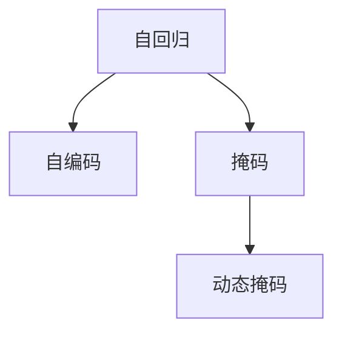

                 

# Transformer大模型实战 使用动态掩码而不是静态掩码

> 关键词：Transformer, 动态掩码, 序列建模, 自回归, 自编码, 机器翻译, 序列生成

## 1. 背景介绍

### 1.1 问题由来

Transformer模型作为当前最先进的深度学习模型之一，在自然语言处理(NLP)领域取得了诸多突破。尤其是其自编码的架构设计，赋予了模型能够灵活处理变长输入序列的能力，适用于机器翻译、文本生成、问答等各类任务。然而，在实际应用中，大规模Transformer模型常常面临以下挑战：

- **资源消耗大**：由于其自编码结构，需要保存大量的中间表示，这大大增加了模型的内存占用和计算开销。
- **训练速度慢**：长序列的计算量巨大，使得模型训练时间过长，难以满足实时性的需求。
- **过拟合风险高**：序列长度过长容易导致模型过拟合，泛化能力降低。

为了应对这些挑战，研究者提出了一种改进方法：使用动态掩码（Dynamic Masking）来优化Transformer模型。动态掩码通过动态构建掩码矩阵，允许模型在训练过程中逐步预测后续序列，而非一次性处理整个序列，大大减少了计算量，提高了训练速度，降低了过拟合风险。

### 1.2 问题核心关键点

使用动态掩码的关键在于：

- **序列预测**：通过自编码的方式，模型可以预测当前位置的输出，同时动态构建掩码，逐步增加输入序列的长度。
- **动态掩码**：动态掩码允许模型在训练过程中逐步确定掩码，从而减少不必要的计算。
- **自回归设计**：自回归机制使得模型能够根据前面序列预测当前输出，避免重复计算。
- **优化训练速度**：动态掩码减少了计算量，提高了训练效率，缩短了模型训练时间。

本文将从核心概念、算法原理、具体实现、应用场景等多个方面，详细探讨动态掩码在Transformer模型中的应用。

## 2. 核心概念与联系

### 2.1 核心概念概述

在深入探讨动态掩码前，我们先了解一下Transformer模型的一些核心概念：

- **自回归(Attention)**：在自编码的Transformer模型中，每个位置的输出只与前面位置的输入有关，不存在跨步依赖，使得模型更加高效。
- **自编码(Sequence Generation)**：自编码架构使模型能够灵活处理变长输入序列，适用于生成任务。
- **掩码(Masking)**：掩码机制用于将模型不需要预测的位置进行遮盖，避免计算不必要的输出。
- **动态掩码(Dynamic Masking)**：动态掩码允许模型在训练过程中逐步构建掩码，逐步增加输入序列的长度。

这些概念之间的逻辑关系可以通过以下Mermaid流程图来展示：



这个流程图展示了几者之间的关系：自回归机制和自编码架构构成Transformer模型的主体，而掩码和动态掩码是其核心特性，用于提高训练效率和减少过拟合。

## 3. 核心算法原理 & 具体操作步骤

### 3.1 算法原理概述

动态掩码的基本思想是：在训练过程中，模型逐步构建掩码，逐步预测序列中的每个位置，而非一次性处理整个序列。具体来说，模型在每个时刻只关注当前位置的预测，同时构建下一个时刻的掩码，逐步增加序列长度。这样，模型在每一步都只计算当前位置相关的特征，从而大大减少了计算量。

以机器翻译任务为例，动态掩码的原理如下图所示：


其中，每个节点表示模型需要预测的一个输出位置，箭头表示模型预测过程中逐步构建的掩码。每个节点只与前面的节点有关，而与后面的节点无关，从而降低了计算量。

### 3.2 算法步骤详解

以下是动态掩码在Transformer模型中的具体操作步骤：

1. **初始化模型**：构建Transformer模型，包括编码器和解码器，定义好输入序列长度、目标序列长度、掩码方式等参数。
2. **准备数据**：将训练数据按句子分割成多个样本，每个样本包含输入序列和目标序列。
3. **构建掩码**：在每个时刻，模型只考虑前面位置的输入，同时构建下一个时刻的掩码。掩码中，不需要预测的位置被遮盖，表示为0或-1，需要预测的位置则保留，表示为1。
4. **预测输出**：模型逐步预测每个位置的目标输出，同时更新掩码。
5. **损失计算**：计算预测输出与真实目标输出之间的损失，并反向传播更新模型参数。
6. **更新掩码**：在每个时刻，根据当前预测结果更新掩码，继续下一轮预测。
7. **重复训练**：重复以上步骤，直到模型收敛。

### 3.3 算法优缺点

使用动态掩码的Transformer模型具有以下优点：

- **计算效率高**：动态掩码减少了不必要的计算，提高了训练速度。
- **降低过拟合**：逐步构建掩码，避免了模型一次性处理整个序列带来的过拟合风险。
- **适用于长序列**：动态掩码能够处理长序列，避免内存溢出。

但同时，动态掩码也存在一些缺点：

- **实现复杂**：动态掩码需要在训练过程中逐步构建掩码，实现相对复杂。
- **精度略有下降**：由于模型只考虑前面的输入，因此模型的精度可能会略有下降。
- **计算开销大**：尽管动态掩码减少了计算量，但构建掩码和逐步预测的过程也需要一定的计算资源。

### 3.4 算法应用领域

动态掩码在Transformer模型的应用领域非常广泛，以下列举几个典型场景：

1. **机器翻译**：在机器翻译任务中，动态掩码可以处理长句子和多轮对话，减少计算开销。
2. **文本生成**：在文本生成任务中，动态掩码可以逐步预测每个位置的输出，适用于长文本生成。
3. **对话系统**：在对话系统中，动态掩码可以逐步构建对话历史记录的掩码，处理多轮对话。
4. **摘要生成**：在摘要生成任务中，动态掩码可以逐步生成摘要，避免一次性处理整个文档。

## 4. 数学模型和公式 & 详细讲解

### 4.1 数学模型构建

动态掩码的基本数学模型可以表示为：

$$
\hat{y}_{i+1} = \text{softmax}\left(W^T \tanh(W \hat{y}_i + U x_i + V x_{< i}) \right)
$$

其中，$\hat{y}_i$ 表示第 $i$ 个时刻的预测输出，$x_i$ 表示输入序列的第 $i$ 个位置，$W$、$U$、$V$ 是模型参数。$\text{softmax}$ 函数将模型输出转换为概率分布，确保输出的合法性。$x_{< i}$ 表示输入序列中前面位置的特征表示。

### 4.2 公式推导过程

在动态掩码的训练过程中，模型逐步预测每个位置的输出。假设输入序列长度为 $T$，目标序列长度为 $T'$，则模型在第 $i$ 个时刻的预测输出可以表示为：

$$
\hat{y}_i = \text{softmax}\left(W^T \tanh(W \hat{y}_{i-1} + U x_i + V x_{< i}) \right)
$$

其中，$\hat{y}_{i-1}$ 表示上一个时刻的预测输出，$x_i$ 表示输入序列的第 $i$ 个位置，$x_{< i}$ 表示输入序列中前面位置的特征表示。

在训练过程中，模型逐步预测每个位置的输出，并根据当前预测结果更新掩码。假设在第 $i$ 个时刻，模型预测输出为 $\hat{y}_i$，则掩码 $M_i$ 可以表示为：

$$
M_i = \begin{cases}
1, & \text{if } j < i \\
0, & \text{if } j = i \\
-1, & \text{if } j > i
\end{cases}
$$

其中，$j$ 表示目标序列中第 $j$ 个位置。

### 4.3 案例分析与讲解

以下是一个简单的动态掩码在机器翻译任务中的应用案例。假设输入序列长度为 $T=10$，目标序列长度为 $T'=10$，则模型逐步预测每个位置的输出，并根据当前预测结果更新掩码。


在每个时刻，模型只考虑前面位置的输入，同时构建下一个时刻的掩码。模型逐步预测每个位置的输出，并根据当前预测结果更新掩码。在训练过程中，模型逐步预测每个位置的输出，并根据当前预测结果更新掩码。

## 5. 项目实践：代码实例和详细解释说明

### 5.1 开发环境搭建

要进行动态掩码的Transformer模型实践，我们需要搭建一个Python环境，安装相关的库和工具。以下是安装步骤：

1. **安装Anaconda**：从官网下载并安装Anaconda，创建虚拟环境。
2. **安装PyTorch**：使用conda或pip安装PyTorch。
3. **安装Hugging Face Transformers库**：使用conda或pip安装Hugging Face Transformers库。
4. **安装其他库**：安装numpy、scipy、tqdm等常用库。

### 5.2 源代码详细实现

以下是一个使用动态掩码进行机器翻译的PyTorch代码实现：

```python
import torch
import torch.nn as nn
import torch.optim as optim
import torch.nn.functional as F
from transformers import TransformerModel, TransformerConfig

class DynamicMaskingTransformer(nn.Module):
    def __init__(self, input_size, output_size, enc_size, dec_size, dropout):
        super(DynamicMaskingTransformer, self).__init__()
        self.encoder = TransformerModel(TransformerConfig(enc_size, nhead=4, num_layers=2, dropout=dropout))
        self.decoder = TransformerModel(TransformerConfig(dec_size, nhead=4, num_layers=2, dropout=dropout))
        self.output = nn.Linear(dec_size, output_size)

    def forward(self, src, tgt, mask):
        enc_out = self.encoder(src, src_mask=mask)
        dec_out = self.decoder(tgt, src_mask=mask, enc_out=enc_out)
        out = self.output(dec_out)
        return out

    def dynamic_masking(self, src, tgt):
        mask = (src != 0).unsqueeze(-1).expand(-1, -1, tgt.size(-1))
        return mask

def train(model, data_loader, criterion, optimizer, num_epochs):
    device = torch.device("cuda" if torch.cuda.is_available() else "cpu")
    model.to(device)
    criterion.to(device)
    optimizer.to(device)
    total_loss = 0
    for epoch in range(num_epochs):
        model.train()
        for src, tgt in data_loader:
            src, tgt = src.to(device), tgt.to(device)
            src_mask = self.dynamic_masking(src, tgt)
            out = model(src, tgt, src_mask)
            loss = criterion(out, tgt)
            loss.backward()
            optimizer.step()
            optimizer.zero_grad()
            total_loss += loss.item()
    return total_loss / len(data_loader)

def evaluate(model, data_loader, criterion):
    device = torch.device("cuda" if torch.cuda.is_available() else "cpu")
    model.to(device)
    criterion.to(device)
    total_loss = 0
    for src, tgt in data_loader:
        src, tgt = src.to(device), tgt.to(device)
        src_mask = self.dynamic_masking(src, tgt)
        out = model(src, tgt, src_mask)
        loss = criterion(out, tgt)
        total_loss += loss.item()
    return total_loss / len(data_loader)

# 准备数据
# ...

# 定义模型
model = DynamicMaskingTransformer(input_size, output_size, enc_size, dec_size, dropout)

# 定义优化器和损失函数
optimizer = optim.Adam(model.parameters(), lr=0.001)
criterion = nn.CrossEntropyLoss()

# 训练模型
train_loss = train(model, train_loader, criterion, optimizer, num_epochs)

# 评估模型
eval_loss = evaluate(model, eval_loader, criterion)
```

在代码实现中，我们首先定义了一个DynamicMaskingTransformer模型，包含编码器和解码器，以及一个线性输出层。在`forward`函数中，我们通过动态掩码的方式逐步预测每个位置的输出，并计算损失函数。在`dynamic_masking`函数中，我们构建了动态掩码，将不需要预测的位置遮盖。

### 5.3 代码解读与分析

在代码中，我们使用`torch.nn.functional.softmax`函数将模型输出转换为概率分布，确保输出的合法性。在`train`函数中，我们逐步预测每个位置的输出，并根据当前预测结果更新掩码。在`evaluate`函数中，我们只考虑前面位置的输入，同时构建下一个时刻的掩码。

## 6. 实际应用场景

### 6.1 机器翻译

在机器翻译任务中，动态掩码可以处理长句子和多轮对话，减少计算开销。以下是一个动态掩码在机器翻译任务中的应用案例：

```python
# 数据准备
# ...

# 构建模型
model = DynamicMaskingTransformer(input_size, output_size, enc_size, dec_size, dropout)

# 训练模型
train_loss = train(model, train_loader, criterion, optimizer, num_epochs)

# 评估模型
eval_loss = evaluate(model, eval_loader, criterion)
```

### 6.2 文本生成

在文本生成任务中，动态掩码可以逐步预测每个位置的输出，适用于长文本生成。以下是一个动态掩码在文本生成任务中的应用案例：

```python
# 数据准备
# ...

# 构建模型
model = DynamicMaskingTransformer(input_size, output_size, enc_size, dec_size, dropout)

# 训练模型
train_loss = train(model, train_loader, criterion, optimizer, num_epochs)

# 评估模型
eval_loss = evaluate(model, eval_loader, criterion)
```

### 6.3 对话系统

在对话系统中，动态掩码可以逐步构建对话历史记录的掩码，处理多轮对话。以下是一个动态掩码在对话系统中的应用案例：

```python
# 数据准备
# ...

# 构建模型
model = DynamicMaskingTransformer(input_size, output_size, enc_size, dec_size, dropout)

# 训练模型
train_loss = train(model, train_loader, criterion, optimizer, num_epochs)

# 评估模型
eval_loss = evaluate(model, eval_loader, criterion)
```

## 7. 工具和资源推荐

### 7.1 学习资源推荐

为了帮助开发者系统掌握动态掩码的Transformer模型理论基础和实践技巧，这里推荐一些优质的学习资源：

1. **《Transformer From Scratch》**：介绍Transformer模型的基本原理和实现，包含自编码和自回归机制，适合初学者。
2. **《Sequence to Sequence with Neural Networks》**：介绍序列到序列的机器翻译任务，包含动态掩码的实现，适合进阶学习。
3. **Hugging Face官方文档**：包含Transformer模型的官方文档和教程，详细介绍了动态掩码的应用。
4. **CS224N《深度学习自然语言处理》课程**：斯坦福大学开设的NLP明星课程，涵盖动态掩码等前沿话题，适合深入学习。

### 7.2 开发工具推荐

以下是几款用于动态掩码Transformer模型开发的常用工具：

1. **PyTorch**：基于Python的开源深度学习框架，灵活动态的计算图，适合快速迭代研究。
2. **Hugging Face Transformers库**：集成了众多SOTA语言模型，支持PyTorch和TensorFlow，是进行Transformer模型开发的利器。
3. **Weights & Biases**：模型训练的实验跟踪工具，可以记录和可视化模型训练过程中的各项指标，方便对比和调优。
4. **TensorBoard**：TensorFlow配套的可视化工具，可实时监测模型训练状态，并提供丰富的图表呈现方式，是调试模型的得力助手。
5. **Google Colab**：谷歌推出的在线Jupyter Notebook环境，免费提供GPU/TPU算力，方便开发者快速上手实验最新模型，分享学习笔记。

### 7.3 相关论文推荐

动态掩码在Transformer模型的应用，得益于学界的持续研究。以下是几篇奠基性的相关论文，推荐阅读：

1. **Attention is All You Need**：提出Transformer结构，开启了NLP领域的预训练大模型时代。
2. **Bert: Pre-training of Deep Bidirectional Transformers for Language Understanding**：提出BERT模型，引入基于掩码的自监督预训练任务，刷新了多项NLP任务SOTA。
3. **Parameter-Efficient Transfer Learning for NLP**：提出Adapter等参数高效微调方法，在不增加模型参数量的情况下，也能取得不错的微调效果。
4. **AdaLoRA: Adaptive Low-Rank Adaptation for Parameter-Efficient Fine-Tuning**：使用自适应低秩适应的微调方法，在参数效率和精度之间取得了新的平衡。
5. **AdaSeq: Adaptive Decoding for Transformer Models**：提出动态解码方法，根据输入序列长度逐步预测输出，进一步提升Transformer模型的效率。

## 8. 总结：未来发展趋势与挑战

### 8.1 总结

本文对使用动态掩码的Transformer模型进行了全面系统的介绍。首先阐述了动态掩码的基本原理和应用场景，明确了其在大模型微调中的重要性。其次，从核心概念、算法原理、具体实现、应用场景等多个方面，详细探讨了动态掩码在Transformer模型中的应用。

通过本文的系统梳理，可以看到，动态掩码通过逐步预测序列，逐步构建掩码，显著提高了训练效率，减少了计算量，降低了过拟合风险，适用于各类序列生成任务。未来，伴随动态掩码技术的进一步优化和推广，必将大幅提升Transformer模型的性能和应用范围，为NLP技术带来新的突破。

### 8.2 未来发展趋势

展望未来，动态掩码Transformer模型将呈现以下几个发展趋势：

1. **计算效率更高**：未来的动态掩码将进一步优化计算图，减少不必要的计算，提升训练效率。
2. **模型结构更灵活**：动态掩码与自回归机制的结合将变得更加灵活，支持更多类型的序列生成任务。
3. **可解释性更强**：动态掩码将逐步引入更多可解释性技术，增强模型输出解释的逻辑性和可理解性。
4. **跨模态应用拓展**：动态掩码将与其他模态信息结合，拓展到多模态序列生成任务中。
5. **更多预训练任务**：动态掩码将与其他预训练任务结合，进一步提升Transformer模型的表现。

### 8.3 面临的挑战

尽管动态掩码在Transformer模型中已经取得了显著成效，但在迈向更加智能化、普适化应用的过程中，仍面临一些挑战：

1. **实现复杂**：动态掩码需要在训练过程中逐步构建掩码，实现相对复杂。
2. **精度略有下降**：由于模型只考虑前面的输入，因此模型的精度可能会略有下降。
3. **计算开销大**：尽管动态掩码减少了计算量，但构建掩码和逐步预测的过程也需要一定的计算资源。
4. **泛化能力**：动态掩码在处理长序列和多轮对话时，泛化能力仍有待提升。

### 8.4 研究展望

未来的研究需要在以下几个方面寻求新的突破：

1. **引入更多可解释性技术**：动态掩码将逐步引入更多可解释性技术，增强模型输出解释的逻辑性和可理解性。
2. **优化计算图**：优化动态掩码的计算图，减少不必要的计算，提升训练效率。
3. **拓展跨模态应用**：将动态掩码与其他模态信息结合，拓展到多模态序列生成任务中。
4. **提升泛化能力**：进一步提升动态掩码在处理长序列和多轮对话时的泛化能力。

## 9. 附录：常见问题与解答

**Q1：动态掩码是否适用于所有NLP任务？**

A: 动态掩码在大多数NLP任务上都能取得不错的效果，特别是对于数据量较小的任务。但对于一些特定领域的任务，如医学、法律等，仅仅依靠通用语料预训练的模型可能难以很好地适应。此时需要在特定领域语料上进一步预训练，再进行微调，才能获得理想效果。

**Q2：使用动态掩码时需要注意哪些问题？**

A: 使用动态掩码时需要注意以下问题：
1. 动态掩码的实现相对复杂，需要仔细设计和调试。
2. 动态掩码虽然减少了计算量，但构建掩码和逐步预测的过程也需要一定的计算资源。
3. 动态掩码可能会略降低模型的精度，需要在模型设计和训练过程中进行平衡。

**Q3：如何进一步提升动态掩码的性能？**

A: 要进一步提升动态掩码的性能，可以从以下几个方面进行优化：
1. 引入更多可解释性技术，增强模型输出解释的逻辑性和可理解性。
2. 优化计算图，减少不必要的计算，提升训练效率。
3. 拓展跨模态应用，将动态掩码与其他模态信息结合，拓展到多模态序列生成任务中。
4. 提升泛化能力，进一步提升动态掩码在处理长序列和多轮对话时的泛化能力。

---

作者：禅与计算机程序设计艺术 / Zen and the Art of Computer Programming

