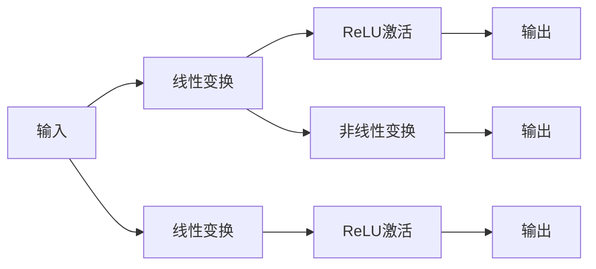

                 

# Transformer大模型实战 前馈网络层

> 关键词：Transformer,前馈网络,神经网络,自然语言处理,NLP

## 1. 背景介绍

### 1.1 问题由来

在自然语言处理(NLP)领域，神经网络模型逐渐成为处理文本数据的最佳选择。其中，Transformer模型以其高效的并行计算能力和卓越的性能表现，在机器翻译、文本生成、文本分类等任务上取得了显著的成果。而Transformer的核心结构之一就是前馈神经网络(Feedforward Network)，其通过多层非线性变换，学习到了丰富的语言表示，在很大程度上决定了Transformer模型的效果。因此，深入理解前馈网络层的原理与实践，对构建高性能Transformer模型至关重要。

### 1.2 问题核心关键点

Transformer大模型的核心在于其自注意力机制和前馈网络层。前馈网络层是Transformer模型中对输入进行深度学习的主要组成部分，其通过多层全连接神经网络，实现对输入特征的复杂非线性变换，赋予模型更强的表达能力和泛化能力。

本文将详细介绍前馈网络层的原理、实现方式和优化技巧，并通过代码实例和实践分析，带你深入了解如何高效构建大模型，同时展示其在实际应用中的表现。

## 2. 核心概念与联系

### 2.1 核心概念概述

前馈网络层是Transformer模型中的关键组成部分，其负责对输入的特征进行多层非线性变换，从而提取出更为丰富的语言表示。前馈网络层通常由多层全连接神经网络组成，每一层包含一个线性变换和ReLU激活函数。通过多次迭代，网络对输入特征进行深度学习，逐渐构建出高维的语义表示。

Transformer的前馈网络层结构如图1所示：


**图1: Transformer前馈网络层结构图**

前馈网络层在Transformer模型中起到至关重要的作用，其不仅能够有效捕捉输入特征的复杂关系，还能通过多层的非线性变换，增强模型的表达能力和泛化性能。

### 2.2 核心概念原理和架构的 Mermaid 流程图

**前馈网络层原理架构图**



**图2: 前馈网络层原理架构图**

这个架构图展示了前馈网络层的基本结构，输入通过多次线性变换和激活函数，最终得到高维的语义表示。

## 3. 核心算法原理 & 具体操作步骤

### 3.1 算法原理概述

Transformer的前馈网络层由多个相同的子层组成，每个子层包含一个线性变换和ReLU激活函数。每个子层对输入进行线性变换，得到中间输出，然后通过ReLU激活函数进行非线性变换，最终得到输出。这种结构可以通过并行计算，极大地提升模型的训练速度和推理效率。

前馈网络层的计算公式可以表示为：

$$
y = \sigma\left(W_{1}\left[\max (\text { Attention }(\text { x }))\right]+ b_{1}\right)
$$

其中，$x$ 表示输入，$\sigma$ 表示激活函数，$W_{1}$ 和 $b_{1}$ 表示线性变换的权重和偏置。前馈网络层通常由多个这样的子层组成，每个子层对输入进行一次线性变换和一次激活，最终得到输出。

### 3.2 算法步骤详解

前馈网络层的实现通常包括以下几个关键步骤：

1. **初始化权重和偏置**：设定线性变换的权重矩阵 $W_{1}$ 和偏置向量 $b_{1}$。
2. **线性变换**：对输入 $x$ 进行线性变换，得到中间输出 $y$。
3. **激活函数**：对中间输出 $y$ 应用激活函数 $\sigma$，得到最终输出。
4. **重复子层**：通常前馈网络层由多个子层组成，重复上述步骤，直至所有子层计算完毕。

### 3.3 算法优缺点

前馈网络层的优点包括：

- **高效的并行计算**：由于Transformer模型中的前馈网络层是由多个子层组成，因此可以并行计算，极大地提升了模型的训练速度和推理效率。
- **强大的表达能力**：多层非线性变换能够学习到输入特征的复杂关系，增强了模型的表达能力和泛化性能。
- **简单直观**：前馈网络层的结构简单直观，易于理解和实现。

其缺点包括：

- **资源消耗大**：多层全连接神经网络的参数量和计算量较大，需要较大的计算资源和存储空间。
- **容易过拟合**：由于前馈网络层具有较强的表达能力，容易发生过拟合现象，特别是在训练数据不足的情况下。

### 3.4 算法应用领域

前馈网络层广泛应用于Transformer模型的各个组件中，包括编码器层和解码器层。在文本生成、机器翻译、文本分类等任务中，前馈网络层都发挥了关键作用，能够有效地捕捉输入特征的复杂关系，提升模型的表现能力。

## 4. 数学模型和公式 & 详细讲解 & 举例说明

### 4.1 数学模型构建

前馈网络层的数学模型可以表示为：

$$
y_{i}=f\left(\left[\mathbf{W}_{1} x_{i}+\mathbf{b}_{1}\right]_{i}\right)
$$

其中，$x_{i}$ 表示输入的第 $i$ 个样本，$\mathbf{W}_{1}$ 和 $\mathbf{b}_{1}$ 表示线性变换的权重矩阵和偏置向量，$f$ 表示激活函数，$y_{i}$ 表示输出。前馈网络层通常由多个子层组成，每个子层对输入进行一次线性变换和一次激活，最终得到输出。

### 4.2 公式推导过程

前馈网络层的推导过程相对简单，以单个子层为例，线性变换的推导公式为：

$$
\mathbf{W}_{1} x_{i}+\mathbf{b}_{1}
$$

其中，$\mathbf{W}_{1}$ 和 $\mathbf{b}_{1}$ 分别表示权重矩阵和偏置向量。激活函数的推导公式为：

$$
f\left(\left[\mathbf{W}_{1} x_{i}+\mathbf{b}_{1}\right]_{i}\right)
$$

其中，$f$ 表示激活函数，$\left[\mathbf{W}_{1} x_{i}+\mathbf{b}_{1}\right]_{i}$ 表示线性变换后的输出。

### 4.3 案例分析与讲解

假设我们有一个3层的全连接神经网络，其中第一层包含 $d_{1}=4$ 个神经元，第二层包含 $d_{2}=8$ 个神经元，第三层包含 $d_{3}=16$ 个神经元。则前馈网络层的计算过程如下：

1. **第一层线性变换**：
   $$
   \mathbf{W}_{1} x_{i}+\mathbf{b}_{1}=
   \begin{bmatrix}
   1 & 2 & 3 & 4\\
   5 & 6 & 7 & 8\\
   9 & 10 & 11 & 12\\
   13 & 14 & 15 & 16\\
   \end{bmatrix}
   \begin{bmatrix}
   x_{i1}\\
   x_{i2}\\
   x_{i3}\\
   x_{i4}
   \end{bmatrix}
   +
   \begin{bmatrix}
   1\\
   2\\
   3\\
   4
   \end{bmatrix}
   $$

2. **第一层激活**：
   $$
   f\left(\left[\mathbf{W}_{1} x_{i}+\mathbf{b}_{1}\right]_{i}\right)=
   \begin{bmatrix}
   1 & 2 & 3 & 4\\
   5 & 6 & 7 & 8\\
   9 & 10 & 11 & 12\\
   13 & 14 & 15 & 16
   \end{bmatrix}
   \begin{bmatrix}
   x_{i1}\\
   x_{i2}\\
   x_{i3}\\
   x_{i4}
   \end{bmatrix}
   +
   \begin{bmatrix}
   1\\
   2\\
   3\\
   4
   \end{bmatrix}
   $$

3. **第二层线性变换**：
   $$
   \mathbf{W}_{2} y_{i}+\mathbf{b}_{2}=
   \begin{bmatrix}
   1 & 2 & 3 & 4 & 5 & 6 & 7 & 8\\
   9 & 10 & 11 & 12 & 13 & 14 & 15 & 16\\
   \end{bmatrix}
   \begin{bmatrix}
   y_{i1}\\
   y_{i2}\\
   y_{i3}\\
   y_{i4}\\
   y_{i5}\\
   y_{i6}\\
   y_{i7}\\
   y_{i8}
   \end{bmatrix}
   +
   \begin{bmatrix}
   1\\
   2\\
   3\\
   4\\
   5\\
   6\\
   7\\
   8
   \end{bmatrix}
   $$

4. **第二层激活**：
   $$
   f\left(\left[\mathbf{W}_{2} y_{i}+\mathbf{b}_{2}\right]_{i}\right)=
   \begin{bmatrix}
   1 & 2 & 3 & 4 & 5 & 6 & 7 & 8\\
   9 & 10 & 11 & 12 & 13 & 14 & 15 & 16\\
   \end{bmatrix}
   \begin{bmatrix}
   y_{i1}\\
   y_{i2}\\
   y_{i3}\\
   y_{i4}\\
   y_{i5}\\
   y_{i6}\\
   y_{i7}\\
   y_{i8}
   \end{bmatrix}
   +
   \begin{bmatrix}
   1\\
   2\\
   3\\
   4\\
   5\\
   6\\
   7\\
   8
   \end{bmatrix}
   $$

5. **第三层线性变换**：
   $$
   \mathbf{W}_{3} z_{i}+\mathbf{b}_{3}=
   \begin{bmatrix}
   1 & 2 & 3 & 4 & 5 & 6 & 7 & 8 & 9 & 10 & 11 & 12 & 13 & 14 & 15 & 16\\
   \end{bmatrix}
   \begin{bmatrix}
   z_{i1}\\
   z_{i2}\\
   z_{i3}\\
   z_{i4}\\
   z_{i5}\\
   z_{i6}\\
   z_{i7}\\
   z_{i8}\\
   z_{i9}\\
   z_{i10}\\
   z_{i11}\\
   z_{i12}\\
   z_{i13}\\
   z_{i14}\\
   z_{i15}\\
   z_{i16}
   \end{bmatrix}
   +
   \begin{bmatrix}
   1\\
   2\\
   3\\
   4\\
   5\\
   6\\
   7\\
   8\\
   9\\
   10\\
   11\\
   12\\
   13\\
   14\\
   15\\
   16
   \end{bmatrix}
   $$

6. **第三层激活**：
   $$
   f\left(\left[\mathbf{W}_{3} z_{i}+\mathbf{b}_{3}\right]_{i}\right)=
   \begin{bmatrix}
   1 & 2 & 3 & 4 & 5 & 6 & 7 & 8 & 9 & 10 & 11 & 12 & 13 & 14 & 15 & 16\\
   \end{bmatrix}
   \begin{bmatrix}
   z_{i1}\\
   z_{i2}\\
   z_{i3}\\
   z_{i4}\\
   z_{i5}\\
   z_{i6}\\
   z_{i7}\\
   z_{i8}\\
   z_{i9}\\
   z_{i10}\\
   z_{i11}\\
   z_{i12}\\
   z_{i13}\\
   z_{i14}\\
   z_{i15}\\
   z_{i16}
   \end{bmatrix}
   +
   \begin{bmatrix}
   1\\
   2\\
   3\\
   4\\
   5\\
   6\\
   7\\
   8\\
   9\\
   10\\
   11\\
   12\\
   13\\
   14\\
   15\\
   16
   \end{bmatrix}
   $$

最终，经过多层非线性变换后，得到输出：

$$
\begin{bmatrix}
y_{i1}\\
y_{i2}\\
y_{i3}\\
y_{i4}\\
y_{i5}\\
y_{i6}\\
y_{i7}\\
y_{i8}
\end{bmatrix}
$$

## 5. 项目实践：代码实例和详细解释说明

### 5.1 开发环境搭建

在实践中，我们需要使用Python和PyTorch来构建和训练前馈网络层。以下是具体的开发环境搭建步骤：

1. 安装Anaconda：从官网下载并安装Anaconda，用于创建独立的Python环境。
```bash
conda create -n pytorch-env python=3.8 
conda activate pytorch-env
```

2. 安装PyTorch：根据CUDA版本，从官网获取对应的安装命令。例如：
```bash
conda install pytorch torchvision torchaudio cudatoolkit=11.1 -c pytorch -c conda-forge
```

3. 安装Transformers库：
```bash
pip install transformers
```

4. 安装各类工具包：
```bash
pip install numpy pandas scikit-learn matplotlib tqdm jupyter notebook ipython
```

完成上述步骤后，即可在`pytorch-env`环境中开始前馈网络层的开发实践。

### 5.2 源代码详细实现

以下是一个简单的前馈网络层的实现代码示例，用于理解前馈网络层的基本结构和功能。

```python
import torch
import torch.nn as nn

class FeedforwardNetwork(nn.Module):
    def __init__(self, d_model, d_ff, dropout=0.1):
        super(FeedforwardNetwork, self).__init__()
        self.linear1 = nn.Linear(d_model, d_ff)
        self.linear2 = nn.Linear(d_ff, d_model)
        self.dropout = nn.Dropout(dropout)
        self.activation = nn.ReLU()
        
    def forward(self, x):
        x = self.linear1(x)
        x = self.dropout(self.activation(x))
        x = self.linear2(x)
        return x
```

在这个代码中，我们定义了一个名为`FeedforwardNetwork`的类，继承自PyTorch的`nn.Module`。`__init__`方法中，我们初始化了两个线性层`linear1`和`linear2`，一个Dropout层和一个ReLU激活函数。在`forward`方法中，我们首先对输入`x`进行线性变换，然后应用Dropout和ReLU激活函数，最后再次进行线性变换，得到输出。

### 5.3 代码解读与分析

**FeedforwardNetwork类**：
- `__init__`方法：初始化线性层、Dropout层和激活函数。
- `forward`方法：定义了前馈网络层的前向传播过程。

**线性层和Dropout层**：
- 线性层用于实现线性变换。
- Dropout层用于防止过拟合，通过随机丢弃一部分神经元，强制模型学习鲁棒特征。

**ReLU激活函数**：
- ReLU函数是一种常用的非线性激活函数，能够将负数输入映射为0，保留正数输入，增强模型的非线性表达能力。

**代码执行过程**：
- 在前向传播过程中，输入首先通过第一层线性变换，得到中间输出。
- 然后通过Dropout层随机丢弃部分神经元，防止过拟合。
- 再通过ReLU激活函数进行非线性变换。
- 最后通过第二层线性变换，得到最终的输出。

## 6. 实际应用场景

### 6.1 文本生成

前馈网络层在前馈网络模型的文本生成任务中起到了关键作用。在文本生成任务中，模型需要根据给定的文本序列，生成新的文本序列。通过前馈网络层的非线性变换，模型可以学习到文本序列中复杂的语义关系，从而生成更加流畅、自然的文本。

例如，在机器翻译任务中，模型需要对输入的文本进行编码，然后使用前馈网络层对其进行深度学习，最后解码生成目标语言的文本。前馈网络层的强大表达能力，使得模型能够学习到输入文本的复杂语义，从而生成高质量的翻译结果。

### 6.2 文本分类

前馈网络层在文本分类任务中同样具有重要的应用。在文本分类任务中，模型需要对给定的文本进行分类，将其归入预定义的类别中。通过前馈网络层的非线性变换，模型可以学习到文本中隐含的语义特征，从而进行准确的分类。

例如，在情感分析任务中，模型需要对给定的文本进行情感极性分类，将其归为正面、负面或中性。通过前馈网络层的非线性变换，模型可以学习到文本中隐含的情感信息，从而进行准确的情感分类。

### 6.3 问答系统

前馈网络层在问答系统中也有重要的应用。在问答系统中，模型需要根据用户提出的问题，自动回答相关的内容。通过前馈网络层的非线性变换，模型可以学习到文本中的关键信息，并提取其中的实体、关系等语义特征，从而生成准确的答案。

例如，在医疗问答系统中，模型需要对用户提出的医疗问题进行回答，如症状、治疗方法等。通过前馈网络层的非线性变换，模型可以学习到医疗文本中的关键信息，并提取其中的实体、关系等语义特征，从而生成准确的医疗回答。

## 7. 工具和资源推荐

### 7.1 学习资源推荐

为了帮助开发者系统掌握前馈网络层的原理和实践，这里推荐一些优质的学习资源：

1. 《深度学习入门与实践》系列博文：由大模型技术专家撰写，深入浅出地介绍了深度学习模型的基本原理和实现方法。
2. CS231n《卷积神经网络》课程：斯坦福大学开设的计算机视觉经典课程，有Lecture视频和配套作业，带你入门计算机视觉的基本概念和经典模型。
3. 《深度学习》书籍：Ian Goodfellow等著，全面介绍了深度学习的理论基础和实现技术，包括前馈网络层在内。
4. PyTorch官方文档：PyTorch的官方文档，提供了丰富的神经网络模型和工具，是前馈网络层开发的必备资料。
5. TensorFlow官方文档：TensorFlow的官方文档，提供了丰富的神经网络模型和工具，是前馈网络层开发的另一种选择。

通过对这些资源的学习实践，相信你一定能够快速掌握前馈网络层的精髓，并用于解决实际的NLP问题。

### 7.2 开发工具推荐

高效的前馈网络层开发离不开优秀的工具支持。以下是几款用于前馈网络层开发的常用工具：

1. PyTorch：基于Python的开源深度学习框架，灵活动态的计算图，适合快速迭代研究。大部分神经网络模型都有PyTorch版本的实现。
2. TensorFlow：由Google主导开发的开源深度学习框架，生产部署方便，适合大规模工程应用。同样有丰富的神经网络模型资源。
3. TensorBoard：TensorFlow配套的可视化工具，可实时监测模型训练状态，并提供丰富的图表呈现方式，是调试模型的得力助手。
4. Weights & Biases：模型训练的实验跟踪工具，可以记录和可视化模型训练过程中的各项指标，方便对比和调优。
5. Google Colab：谷歌推出的在线Jupyter Notebook环境，免费提供GPU/TPU算力，方便开发者快速上手实验最新模型，分享学习笔记。

合理利用这些工具，可以显著提升前馈网络层开发的效率，加快创新迭代的步伐。

### 7.3 相关论文推荐

前馈网络层的深入研究得益于学界的持续探索。以下是几篇奠基性的相关论文，推荐阅读：

1. Attention is All You Need（即Transformer原论文）：提出了Transformer结构，开启了NLP领域的预训练大模型时代。
2. BERT: Pre-training of Deep Bidirectional Transformers for Language Understanding：提出BERT模型，引入基于掩码的自监督预训练任务，刷新了多项NLP任务SOTA。
3. Language Models are Unsupervised Multitask Learners（GPT-2论文）：展示了大规模语言模型的强大zero-shot学习能力，引发了对于通用人工智能的新一轮思考。
4. Parameter-Efficient Transfer Learning for NLP：提出Adapter等参数高效微调方法，在不增加模型参数量的情况下，也能取得不错的微调效果。
5. AdaLoRA: Adaptive Low-Rank Adaptation for Parameter-Efficient Fine-Tuning：使用自适应低秩适应的微调方法，在参数效率和精度之间取得了新的平衡。

这些论文代表了大语言模型和微调技术的发展脉络。通过学习这些前沿成果，可以帮助研究者把握学科前进方向，激发更多的创新灵感。

## 8. 总结：未来发展趋势与挑战

### 8.1 总结

本文对前馈网络层的原理、实现和应用进行了全面系统的介绍。首先阐述了前馈网络层在Transformer模型中的重要地位，详细讲解了其数学模型和计算过程。其次，通过代码实例和实践分析，展示了前馈网络层的构建方法和应用场景。最后，通过工具和资源推荐，帮助开发者高效实现前馈网络层，进一步提升其应用效果。

通过本文的系统梳理，可以看到，前馈网络层作为Transformer模型的核心组件，在文本生成、分类、问答等NLP任务中发挥了至关重要的作用。理解并掌握前馈网络层的原理和实践，将有助于开发者构建高效、可靠的神经网络模型，推动NLP技术的进一步发展。

### 8.2 未来发展趋势

展望未来，前馈网络层的技术发展将呈现以下几个趋势：

1. 模型规模持续增大。随着算力成本的下降和数据规模的扩张，前馈网络层的参数量还将持续增长。超大规模前馈网络层蕴含的丰富语言表示，有望支撑更加复杂多变的NLP任务。
2. 参数高效和计算高效的微调方法。开发更加参数高效的微调方法，如Prefix-Tuning、LoRA等，在固定大部分预训练参数的同时，只更新极少量的任务相关参数。同时优化前馈网络层的计算图，减少前向传播和反向传播的资源消耗，实现更加轻量级、实时性的部署。
3. 引入更多先验知识。将符号化的先验知识，如知识图谱、逻辑规则等，与前馈网络层进行巧妙融合，引导前馈网络层学习更准确、合理的语言模型。同时加强不同模态数据的整合，实现视觉、语音等多模态信息与文本信息的协同建模。
4. 结合因果分析和博弈论工具。将因果分析方法引入前馈网络层，识别出模型决策的关键特征，增强输出解释的因果性和逻辑性。借助博弈论工具刻画人机交互过程，主动探索并规避模型的脆弱点，提高系统稳定性。

这些趋势凸显了前馈网络层的广阔前景。这些方向的探索发展，将进一步提升前馈网络层的表达能力和泛化性能，为构建高效、可靠的神经网络模型铺平道路。

### 8.3 面临的挑战

尽管前馈网络层在NLP任务中已经取得了显著的成果，但在迈向更加智能化、普适化应用的过程中，其仍面临诸多挑战：

1. 资源消耗大。多层全连接神经网络的参数量和计算量较大，需要较大的计算资源和存储空间。
2. 容易过拟合。由于前馈网络层具有较强的表达能力，容易发生过拟合现象，特别是在训练数据不足的情况下。
3. 推理效率有待提高。虽然前馈网络层具有强大的表达能力，但在实际部署时往往面临推理速度慢、内存占用大等效率问题。
4. 可解释性亟需加强。当前前馈网络层更像是"黑盒"系统，难以解释其内部工作机制和决策逻辑。
5. 安全性有待保障。前馈网络层可能学习到有偏见、有害的信息，通过微调传递到下游任务，产生误导性、歧视性的输出，给实际应用带来安全隐患。

### 8.4 研究展望

面对前馈网络层所面临的种种挑战，未来的研究需要在以下几个方面寻求新的突破：

1. 探索无监督和半监督前馈网络层方法。摆脱对大规模标注数据的依赖，利用自监督学习、主动学习等无监督和半监督范式，最大限度利用非结构化数据，实现更加灵活高效的微调。
2. 研究参数高效和计算高效的前馈网络层范式。开发更加参数高效的微调方法，在固定大部分预训练参数的同时，只更新极少量的任务相关参数。同时优化前馈网络层的计算图，减少前向传播和反向传播的资源消耗，实现更加轻量级、实时性的部署。
3. 结合因果分析和博弈论工具。将因果分析方法引入前馈网络层，识别出模型决策的关键特征，增强输出解释的因果性和逻辑性。借助博弈论工具刻画人机交互过程，主动探索并规避模型的脆弱点，提高系统稳定性。
4. 纳入伦理道德约束。在模型训练目标中引入伦理导向的评估指标，过滤和惩罚有偏见、有害的输出倾向。同时加强人工干预和审核，建立模型行为的监管机制，确保输出符合人类价值观和伦理道德。

这些研究方向的探索，将引领前馈网络层技术迈向更高的台阶，为构建安全、可靠、可解释、可控的智能系统铺平道路。面向未来，前馈网络层还需要与其他人工智能技术进行更深入的融合，如知识表示、因果推理、强化学习等，多路径协同发力，共同推动自然语言理解和智能交互系统的进步。只有勇于创新、敢于突破，才能不断拓展前馈网络层的边界，让智能技术更好地造福人类社会。

## 9. 附录：常见问题与解答

**Q1：前馈网络层是否可以用于所有NLP任务？**

A: 前馈网络层在大多数NLP任务中都能取得不错的效果，特别是在文本生成、分类、问答等任务中。但对于一些特定领域的任务，如医学、法律等，仅依靠前馈网络层可能难以很好地适应。此时需要在特定领域语料上进一步预训练，再进行微调，才能获得理想效果。此外，对于一些需要时效性、个性化很强的任务，如对话、推荐等，前馈网络层也需要针对性的改进优化。

**Q2：前馈网络层如何选择合适的激活函数？**

A: 前馈网络层通常使用ReLU激活函数，因为它能够将负数输入映射为0，保留正数输入，增强模型的非线性表达能力。但ReLU激活函数也存在梯度消失的问题，因此在一些特定的场景下，如深度残差网络中，可以选择其他激活函数，如LeakyReLU、ELU等。

**Q3：前馈网络层在实际应用中如何防止过拟合？**

A: 防止前馈网络层过拟合的方法包括：
1. 数据增强：通过回译、近义替换等方式扩充训练集
2. 正则化：使用L2正则、Dropout、Early Stopping等避免过拟合
3. 对抗训练：引入对抗样本，提高模型鲁棒性
4. 参数高效微调：只调整少量参数(如Adapter、Prefix等)，减小过拟合风险

这些策略往往需要根据具体任务和数据特点进行灵活组合。只有在数据、模型、训练、推理等各环节进行全面优化，才能最大限度地发挥前馈网络层的潜力。

**Q4：前馈网络层在落地部署时需要注意哪些问题？**

A: 将前馈网络层转化为实际应用，还需要考虑以下因素：
1. 模型裁剪：去除不必要的层和参数，减小模型尺寸，加快推理速度
2. 量化加速：将浮点模型转为定点模型，压缩存储空间，提高计算效率
3. 服务化封装：将模型封装为标准化服务接口，便于集成调用
4. 弹性伸缩：根据请求流量动态调整资源配置，平衡服务质量和成本
5. 监控告警：实时采集系统指标，设置异常告警阈值，确保服务稳定性
6. 安全防护：采用访问鉴权、数据脱敏等措施，保障数据和模型安全

前馈网络层作为Transformer模型的核心组件，具有强大的表达能力，但如何在保证性能的同时，简化模型结构，提升推理速度，优化资源占用，将是重要的优化方向。只有通过不断优化，才能使前馈网络层在大规模应用中发挥其优势。

---

作者：禅与计算机程序设计艺术 / Zen and the Art of Computer Programming

