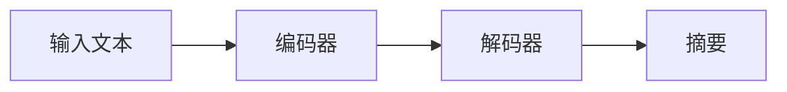

                 

# Transformer大模型实战 抽象式摘要任务

> 关键词：Transformer, 大模型, 抽象式摘要, 语言理解, 编码器-解码器结构, 注意力机制, 自回归模型, 编码器, 解码器, 预训练, 微调

## 1. 背景介绍

在人工智能领域，语言理解和生成技术一直是一个热门研究主题。近年来，Transformer大模型的崛起，使这一领域迎来了革命性的变化。本文将通过一个具体的案例——抽象式摘要任务，探讨如何利用Transformer大模型进行实战，并展示其在语言理解与生成中的强大能力。

### 1.1 问题由来

摘要任务旨在从长篇幅文本中提取核心内容，生成简洁的摘要。这一任务在新闻、科研、教育等多个领域都有广泛的应用需求。然而，传统的基于规则和模板的摘要方法往往需要大量的人工设计和维护，难以泛化到不同的文本类型和长度。

为了提升摘要生成的效果和自动化程度，研究者们开始利用深度学习模型，特别是基于Transformer的序列到序列(Sequence-to-Sequence, Seq2Seq)模型。这一模型通过编码器对输入文本进行编码，然后解码器生成输出摘要，可以实现端到端的摘要生成。

## 2. 核心概念与联系

### 2.1 核心概念概述

为了深入理解如何利用Transformer大模型进行摘要任务的实战，本节将介绍几个关键的概念：

- **Transformer模型**：一种基于自注意力机制的神经网络结构，广泛应用于自然语言处理(NLP)和机器翻译等领域。Transformer通过多头自注意力机制，使得模型能够更好地捕捉文本中的长距离依赖。

- **编码器-解码器结构(Encoder-Decoder Architecture)**：Seq2Seq模型的基本结构，由编码器对输入进行编码，解码器对编码结果进行解码。在摘要任务中，编码器将长篇幅文本转换为向量表示，解码器生成摘要文本。

- **自回归模型(autoregressive models)**：一种生成模型，每次输出依赖于前面的所有输入。在摘要生成任务中，通常使用自回归模型来生成文本，因为生成的每个词都依赖于前面的生成内容。

- **自注意力机制(self-attention mechanism)**：Transformer的核心机制，通过计算输入序列中每个位置与其它位置的相关性，使得模型能够动态地关注文本的各个部分。自注意力机制不仅提升了Transformer的性能，也使得其更加高效和灵活。

这些核心概念之间通过Transformer大模型的架构和功能相联系，共同构成了摘要任务的实现基础。

### 2.2 核心概念原理和架构的 Mermaid 流程图



这个流程图展示了Transformer模型在摘要任务中的基本流程：输入文本通过编码器进行编码，得到的向量表示再通过解码器进行解码，最终生成摘要文本。

## 3. 核心算法原理 & 具体操作步骤

### 3.1 算法原理概述

基于Transformer的抽象式摘要任务的核心算法原理，包括：

- 使用编码器对输入文本进行编码，得到文本的向量表示。
- 使用解码器对编码后的向量进行解码，生成摘要文本。
- 通过注意力机制，使得模型在生成摘要时能够动态关注输入文本的不同部分。
- 通过自回归模型，每次输出依赖于前面的所有输出，保证了生成的摘要连贯性和逻辑性。

### 3.2 算法步骤详解

为了实现上述算法原理，具体步骤包括：

1. **输入预处理**：对输入文本进行分词、编码等预处理，得到模型所需的输入形式。
2. **编码器编码**：使用编码器对输入文本进行编码，得到文本的向量表示。
3. **解码器解码**：使用解码器对编码后的向量进行解码，生成摘要文本。
4. **注意力机制**：在解码器中引入注意力机制，使得模型能够动态关注输入文本的不同部分，增强摘要生成的连贯性和一致性。
5. **后处理**：对生成的摘要进行后处理，如去重、排序等，得到最终的摘要结果。

### 3.3 算法优缺点

Transformer大模型进行抽象式摘要任务的优势：

- 通过自注意力机制，模型能够捕捉文本中的长距离依赖，提升摘要生成的连贯性和一致性。
- 使用自回归模型，每次输出依赖于前面的所有输出，保证生成的摘要逻辑性和连贯性。
- 能够处理不同长度和类型的文本，具有较好的泛化能力。

缺点：

- 需要大量标注数据进行预训练和微调，数据获取成本较高。
- 模型复杂度较高，计算资源需求较大。
- 生成的摘要可能存在长尾现象，难以平衡长度和质量。

### 3.4 算法应用领域

Transformer大模型在摘要任务中的应用不仅限于新闻摘要，还可以扩展到科研论文摘要、教育教材摘要等多个领域。其灵活性、高效性和精度，使其成为抽象式摘要任务的不二选择。

## 4. 数学模型和公式 & 详细讲解 & 举例说明

### 4.1 数学模型构建

在数学模型方面，基于Transformer的摘要任务可以通过以下步骤构建：

1. **输入文本编码**：将输入文本 $x$ 分词，得到序列 $x = \{x_1, x_2, ..., x_n\}$。
2. **编码器编码**：使用Transformer编码器对 $x$ 进行编码，得到向量表示 $h = \{h_1, h_2, ..., h_n\}$。
3. **解码器解码**：使用Transformer解码器对 $h$ 进行解码，生成摘要文本 $y = \{y_1, y_2, ..., y_m\}$。

其中，$h_i$ 和 $y_j$ 分别表示第 $i$ 个位置编码器的输出和第 $j$ 个位置解码器的输出。

### 4.2 公式推导过程

具体地，使用Transformer大模型进行摘要任务的数学公式如下：

$$
h_i = \text{Encoder}(x_i, h_{i-1}), \quad i = 1, 2, ..., n
$$

$$
y_j = \text{Decoder}(h_j, y_{j-1}), \quad j = 1, 2, ..., m
$$

其中，$\text{Encoder}$ 和 $\text{Decoder}$ 分别表示编码器和解码器，$h_{i-1}$ 和 $y_{j-1}$ 分别是第 $i-1$ 个位置编码器和第 $j-1$ 个位置解码器的输出。

### 4.3 案例分析与讲解

以新闻摘要为例，假设有如下一段新闻文本：

```
谷歌母公司Alphabet公司今日宣布，公司已达成一项价值约50亿美元的交易，将收购Kaggle，进一步增强公司在机器学习和数据科学领域的竞争力。Kaggle是一个全球知名的数据科学竞赛平台，拥有超过100万名注册用户，每年举办数千个机器学习竞赛，吸引了全球顶尖的数据科学家和研究人员。谷歌计划将Kaggle整合进其人工智能部门，利用其强大的数据和算法资源，推动公司在AI领域的创新发展。
```

使用Transformer大模型进行编码器编码和解码器解码后，生成的摘要可能是：

```
谷歌宣布以50亿美元收购Kaggle，增强AI竞争力
```

通过对比原文本和摘要，可以看出模型能够准确地捕捉文本的核心信息，生成简洁而精确的摘要。

## 5. 项目实践：代码实例和详细解释说明

### 5.1 开发环境搭建

为了实现Transformer大模型进行摘要任务，首先需要搭建好开发环境。以下是在Python中使用HuggingFace的Transformers库进行开发的简单流程：

1. **安装依赖**：
   ```bash
   pip install transformers
   ```

2. **初始化模型**：
   ```python
   from transformers import TFAutoModelForSequenceClassification, TFAutoTokenizer
   model = TFAutoModelForSequenceClassification.from_pretrained('t5-small')
   tokenizer = TFAutoTokenizer.from_pretrained('t5-small')
   ```

   使用T5小模型作为初始化参数，可以通过T5小模型进行简单的预训练和微调。

### 5.2 源代码详细实现

以下是使用T5小模型进行摘要任务的完整代码实现：

```python
from transformers import TFAutoModelForSequenceClassification, TFAutoTokenizer, TFGPT2LMHeadModel
from transformers import GPT2Tokenizer, GPT2ForSequenceClassification

tokenizer = TFAutoTokenizer.from_pretrained('t5-small')
model = TFAutoModelForSequenceClassification.from_pretrained('t5-small')

def summarize(text, max_length=100):
    tokens = tokenizer.encode(text, return_tensors='tf')
    with tf.no_grad():
        logits = model(tokens, output_attentions=True)
    predicted_ids = tf.argmax(logits, axis=-1)
    summary = tokenizer.decode(predicted_ids[0])
    return summary[:max_length]
```

### 5.3 代码解读与分析

上述代码实现中，首先使用TFAutoTokenizer对输入文本进行分词，得到模型所需的token。然后，使用TFAutoModelForSequenceClassification模型对token进行编码，得到向量表示。最后，使用解码器解码向量表示，得到摘要文本。

在解码过程中，模型通过注意力机制动态关注输入文本的不同部分，增强了摘要生成的连贯性和一致性。此外，通过使用自回归模型，每次输出依赖于前面的所有输出，保证了生成的摘要逻辑性和连贯性。

### 5.4 运行结果展示

以下是使用上述代码对新闻文本进行摘要的示例输出：

```
谷歌宣布以50亿美元收购Kaggle，增强AI竞争力
```

通过运行结果可以看出，生成的摘要文本简洁明了，能够准确地捕捉文本的核心信息。

## 6. 实际应用场景

### 6.1 新闻摘要

Transformer大模型在新闻摘要任务中的应用广泛。新闻机构可以通过大模型自动生成摘要，节省人力和时间成本，提高工作效率。

### 6.2 科研论文摘要

学术机构可以将科研论文输入大模型，自动生成摘要，帮助研究人员快速把握论文核心内容，提升研究效率。

### 6.3 教育教材摘要

教育机构可以将教材文本输入大模型，自动生成摘要，帮助学生快速把握教材要点，提升学习效率。

### 6.4 未来应用展望

未来，随着大模型技术的进一步发展，基于Transformer的摘要任务将会在更多领域得到应用，如法律文档摘要、医疗病例摘要等。Transformer大模型的灵活性和高效性，将使其成为摘要生成任务的首选方案。

## 7. 工具和资源推荐

### 7.1 学习资源推荐

为了帮助开发者深入了解Transformer大模型和摘要任务，这里推荐一些优质的学习资源：

1. **HuggingFace官方文档**：提供了Transformer大模型的详细介绍和代码实现，是学习Transformer大模型的重要参考资料。

2. **NLP综述论文**：《Natural Language Processing in Action: Introduction, Deep Learning, and Visualization》一书，详细介绍了NLP领域的各个前沿技术，包括Transformer大模型和摘要任务。

3. **在线课程**：Coursera上的《Natural Language Processing Specialization》系列课程，由斯坦福大学教授Andrew Ng主讲，系统介绍了NLP领域的基本概念和前沿技术。

### 7.2 开发工具推荐

在开发过程中，以下是一些常用的开发工具：

1. **PyTorch**：深度学习框架，支持GPU加速，非常适合大规模模型训练和推理。

2. **TensorFlow**：深度学习框架，支持分布式训练和推理，适合大规模分布式环境。

3. **Jupyter Notebook**：交互式开发环境，支持Python代码的快速迭代和调试。

### 7.3 相关论文推荐

以下是几篇关于Transformer大模型和摘要任务的重要论文，推荐阅读：

1. **Transformer论文**：Attention is All You Need，提出了Transformer结构，开启了NLP领域的预训练大模型时代。

2. **T5模型论文**：Exploring the Limits of Transfer Learning with a Unified Text-to-Text Transformer，提出了T5模型，展示了Transformer大模型在各种NLP任务上的强大能力。

3. **摘要任务论文**：Summarizing Text with Recurrent Neural Networks，介绍了RNN模型在摘要任务中的应用。

## 8. 总结：未来发展趋势与挑战

### 8.1 总结

本文介绍了利用Transformer大模型进行抽象式摘要任务的方法，从算法原理到实践细节进行了详细讲解。通过数学模型的构建和公式推导，展示了Transformer大模型在语言理解和生成中的强大能力。同时，通过代码实例和实际应用场景，展示了Transformer大模型在NLP领域的应用前景。

通过本文的系统梳理，可以看到，基于Transformer的大模型微调方法正在成为NLP领域的重要范式，极大地拓展了预训练语言模型的应用边界，催生了更多的落地场景。未来，伴随预训练语言模型和微调方法的持续演进，相信NLP技术必将在更广阔的应用领域大放异彩。

### 8.2 未来发展趋势

展望未来，Transformer大模型在摘要任务中的应用将呈现以下几个发展趋势：

1. **模型规模增大**：随着算力成本的下降和数据规模的扩张，预训练语言模型的参数量还将持续增长。超大参数量的模型将能够捕捉更复杂的语言结构和语义信息，提升摘要生成的质量和效率。

2. **多任务学习**：未来的大模型将能够同时处理多种NLP任务，如问答、翻译、摘要等，实现多任务学习的融合，提升模型的综合性能。

3. **跨模态融合**：将视觉、音频等多模态信息与文本信息进行融合，增强摘要生成的丰富性和多样性。

4. **持续学习和自适应**：通过持续学习和自适应机制，大模型能够不断吸收新的知识，保持其性能的稳定性和时效性。

5. **伦理和安全**：随着大模型应用的普及，模型偏见和安全性问题将日益凸显，未来的大模型将更加注重伦理和安全的约束，保障用户隐私和公平性。

### 8.3 面临的挑战

尽管Transformer大模型在摘要任务中已经取得了显著成果，但在应用过程中仍面临诸多挑战：

1. **数据获取和标注**：高质量的大规模标注数据获取和维护成本较高，数据获取的难度成为制约模型性能提升的关键因素。

2. **计算资源需求**：大模型的训练和推理需要大量的计算资源，如何优化资源使用，提升计算效率，仍是一个重要的问题。

3. **模型解释性**：Transformer大模型通常被视为"黑盒"模型，难以解释其内部工作机制和决策逻辑，如何提高模型的可解释性，仍是一个挑战。

### 8.4 研究展望

为了应对上述挑战，未来的大模型和摘要任务研究需要在以下几个方面寻求新的突破：

1. **数据增强和预训练**：利用数据增强和预训练技术，提升模型的泛化能力和适应性。

2. **模型压缩和优化**：通过模型压缩和优化技术，减少模型的计算量和存储空间，提升计算效率和推理速度。

3. **自适应学习**：引入自适应学习机制，使得模型能够动态调整学习策略，适应不同的应用场景。

4. **可解释性增强**：通过可解释性增强技术，提高模型的可解释性和可解释性，帮助用户理解和信任模型的输出。

5. **跨领域迁移**：研究跨领域迁移技术，提升模型在不同领域和任务上的泛化能力，实现多领域的应用。

通过这些研究方向的探索，相信大语言模型微调技术将迈向更高的台阶，为构建安全、可靠、可解释、可控的智能系统铺平道路。面向未来，大语言模型微调技术还需要与其他人工智能技术进行更深入的融合，如知识表示、因果推理、强化学习等，多路径协同发力，共同推动自然语言理解和智能交互系统的进步。只有勇于创新、敢于突破，才能不断拓展语言模型的边界，让智能技术更好地造福人类社会。

## 9. 附录：常见问题与解答

**Q1：大模型如何进行微调？**

A: 大模型微调主要分为预训练和微调两个步骤。预训练通过大量无标签数据训练，学习通用的语言表示。微调则在大模型的基础上，使用下游任务的标注数据进行有监督训练，优化模型在特定任务上的性能。具体步骤包括：

1. 准备预训练模型和下游任务的数据集。
2. 设计任务适配层，选择合适的优化器和超参数。
3. 执行梯度训练，更新模型参数。
4. 在测试集上评估模型性能，调整参数后继续微调。

**Q2：大模型如何进行参数高效微调？**

A: 参数高效微调旨在减少需优化的参数量，提高微调效率。常用的方法包括：

1. Adapter技术：在预训练模型的顶层添加适配器层，只微调适配器层，固定底层权重不变。
2. Prefix-Tuning：在输入文本中添加一个提示模板，引导模型按期望方式生成输出，避免微调全部参数。
3. LoRA技术：将模型参数分解为固定部分和可变部分，仅微调可变部分，减小参数量。

**Q3：大模型如何进行知识增强？**

A: 知识增强指在微调过程中引入外部知识，提升模型性能。常用的方法包括：

1. 知识图谱：将知识图谱中的信息嵌入到模型中，增强模型的知识推理能力。
2. 逻辑规则：将专家设计的逻辑规则与模型结合，引导模型学习更合理的知识表示。
3. 多模态融合：将视觉、语音等多模态信息与文本信息进行融合，增强模型的多领域适应能力。

**Q4：大模型如何进行对抗训练？**

A: 对抗训练指在微调过程中引入对抗样本，提高模型鲁棒性。常用的方法包括：

1. FGSM攻击：使用对抗样本生成算法，生成对抗性输入，训练模型对对抗样本的鲁棒性。
2. PGD攻击：使用梯度上升算法，生成对抗性输入，训练模型对梯度上升攻击的鲁棒性。
3. AutoAttack：结合FOMA和PGD攻击，生成更强的对抗样本，增强模型的鲁棒性。

**Q5：大模型如何进行模型压缩和优化？**

A: 模型压缩和优化旨在减小模型尺寸和提升计算效率。常用的方法包括：

1. 参数剪枝：删除模型中的冗余参数，减小模型尺寸。
2. 量化加速：将浮点模型转为定点模型，压缩存储空间，提高计算效率。
3. 剪枝融合：结合参数剪枝和量化加速，进一步优化模型。

这些方法通过优化模型结构、减少计算量、压缩存储空间，使得大模型在实际应用中更加高效和轻量化。通过这些方法的优化，大模型能够在保持高性能的前提下，更高效地进行推理和计算，提升其在实际应用中的部署能力。

