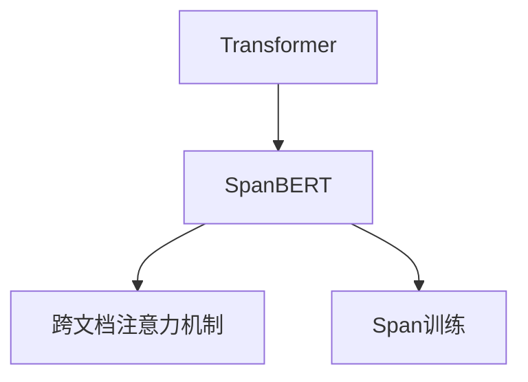
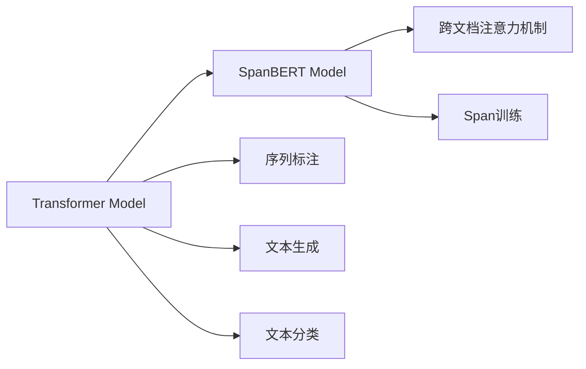

                 

# Transformer大模型实战 深入了解SpanBERT

> 关键词：Transformer, SpanBERT, 自注意力机制, 序列标注, 长文本理解, 代码实例, 应用场景

## 1. 背景介绍

### 1.1 问题由来

Transformer模型自问世以来，因其自注意力机制，迅速成为自然语言处理(NLP)领域的主流模型。其能够自动提取文本的上下文语义信息，实现强大的文本理解和生成能力。但在处理长文本时，如长文档、长对话，Transformer模型往往会因计算资源和速度的限制，表现不佳。

为了克服这一问题，研究者们不断探索更高效的Transformer变种模型，如XLNet、T5等。而SpanBERT作为Transformer模型在长文本理解上的重要创新，通过引入新的机制，显著提升了长文本处理的性能。本文将深入探讨SpanBERT的工作原理、实践方法和应用前景。

### 1.2 问题核心关键点

 SpanBERT是Span（Span-based Fine-Tuning）BERT的简称，是一种针对长文本处理的Transformer模型变种。其核心思想是通过在BERT模型的基础上，引入跨文档的注意力机制，使得模型能够有效处理长文本和跨文档的语义关系。

 SpanBERT的特点：
- 跨文档注意力机制：通过在每个文档的最后一个token之间加入跨文档的注意力，使得模型能够捕获文档之间的语义关系。
- 基于Span的训练：Span训练是指仅使用文本中的部分（Span）进行微调，而不是整个文档。这样可以在保持模型通用性的同时，提高模型在特定任务上的精度。
- 生成任务友好：SpanBERT在生成任务（如摘要、翻译）上表现优异，能够生成逻辑性强、连贯性高的文本。

这些特性使得SpanBERT在长文本理解、跨文档语义推理等任务上表现出色，成为处理大规模长文本数据的利器。

## 2. 核心概念与联系

### 2.1 核心概念概述

为了更好地理解SpanBERT的工作原理，我们先简要介绍几个关键概念：

- Transformer：一种基于自注意力机制的深度学习模型，能够自动提取文本的上下文语义信息，用于文本生成、理解、分类等任务。
- SpanBERT：一种针对长文本处理的Transformer变种模型，通过引入跨文档注意力机制，有效处理长文本和跨文档的语义关系。
- 跨文档注意力机制：在每个文档的最后一个token之间加入跨文档的注意力，使得模型能够捕获文档之间的语义关系。
- Span训练：仅使用文本中的部分（Span）进行微调，而不是整个文档，以提高模型在特定任务上的精度。

这些概念之间的关系如图2所示：



### 2.2 核心概念原理和架构的 Mermaid 流程图(Mermaid 流程节点中不要有括号、逗号等特殊字符)



## 3. 核心算法原理 & 具体操作步骤
### 3.1 算法原理概述

SpanBERT的核心思想是通过跨文档注意力机制和Span训练，提升长文本处理的性能。其算法原理可以分为以下几个部分：

1. 跨文档注意力机制：在每个文档的最后一个token之间加入跨文档的注意力，使得模型能够捕获文档之间的语义关系。

2. Span训练：仅使用文本中的部分（Span）进行微调，而不是整个文档，以提高模型在特定任务上的精度。

3. 序列标注任务：SpanBERT通过微调模型进行序列标注任务，如命名实体识别、依存句法分析等。

4. 文本生成任务：SpanBERT通过微调模型进行文本生成任务，如摘要生成、机器翻译等。

5. 文本分类任务：SpanBERT通过微调模型进行文本分类任务，如情感分析、主题分类等。

### 3.2 算法步骤详解

使用SpanBERT处理长文本和跨文档语义关系的步骤可以分为以下几个关键步骤：

1. 收集长文本数据集。数据集应包括多个文档，每个文档长度不限，但同一任务的所有文档长度应一致。

2. 将长文本转化为Span。对于每个文档，随机选择一个长度为span_length的Span进行微调，span_length通常为64。

3. 加入跨文档注意力。在每个文档的最后一个token之间加入跨文档的注意力，用于捕获文档之间的语义关系。

4. 微调模型。使用SpanBERT模型进行微调，微调过程中仅使用Span进行训练，以提高模型在特定任务上的精度。

5. 评估模型。在验证集和测试集上评估模型在特定任务上的表现，包括准确率、F1-score、BLEU等指标。

### 3.3 算法优缺点

 SpanBERT的优点：
- 适用于长文本处理。通过引入跨文档注意力机制，SpanBERT能够处理长文本和跨文档的语义关系。
- 泛化能力强。SpanBERT在多种NLP任务上表现优异，具有良好的泛化能力。
- 代码简洁。SpanBERT的代码简洁，易于实现和调试。

 SpanBERT的缺点：
- 训练成本高。由于需要处理长文本，SpanBERT的训练成本较高。
- 跨文档注意力机制复杂。跨文档注意力机制的实现较为复杂，需要一定的理论和实践积累。
- 需要大量标注数据。SpanBERT的微调需要大量标注数据，标注数据的获取和处理成本较高。

### 3.4 算法应用领域

 SpanBERT在多个NLP任务上表现出色，主要应用于以下几个领域：

1. 长文本理解：如长文档摘要、长对话系统等。通过跨文档注意力机制，SpanBERT能够有效处理长文本的语义关系。

2. 跨文档语义推理：如跨文档关系抽取、多文档情感分析等。SpanBERT能够捕获文档之间的语义关系，进行推理和判断。

3. 文本生成：如摘要生成、翻译等。SpanBERT能够生成逻辑性强、连贯性高的文本。

4. 序列标注：如命名实体识别、依存句法分析等。SpanBERT能够进行序列标注任务，提升模型在特定任务上的精度。

5. 文本分类：如情感分析、主题分类等。SpanBERT能够进行文本分类任务，提升模型在特定任务上的精度。

这些应用领域展示了SpanBERT在长文本处理和跨文档语义推理上的强大能力，使其成为处理大规模长文本数据的利器。

## 4. 数学模型和公式 & 详细讲解 & 举例说明（备注：数学公式请使用latex格式，latex嵌入文中独立段落使用 $$，段落内使用 $)
### 4.1 数学模型构建

SpanBERT的数学模型构建可以分为以下几个部分：

1. Transformer模型：SpanBERT基于Transformer模型，使用自注意力机制和前馈神经网络进行文本编码。

2. Span训练：仅使用文本中的部分（Span）进行微调，而不是整个文档。

3. 跨文档注意力机制：在每个文档的最后一个token之间加入跨文档的注意力，用于捕获文档之间的语义关系。

4. 损失函数：SpanBERT使用交叉熵损失函数进行序列标注任务的微调。

### 4.2 公式推导过程

跨文档注意力机制的公式推导如下：

假设两个文档分别为D1和D2，每个文档的长度为L，每个文档的最后一个token分别为[CLS]_D1和[CLS]_D2。跨文档注意力矩阵M_D1D2的计算公式如下：

$$
M_{D1D2} = softmax(\frac{Q_{D1}K_{D2}}{\sqrt{d_k}}) \times V_{D2}
$$

其中，$Q_{D1}$和$K_{D2}$分别为文档D1和D2的查询和键向量，$d_k$为查询和键向量的维度。

Span训练的公式推导如下：

假设Span的长度为span_length，Span的起始位置为span_start，Span的终止位置为span_end。Span的嵌入向量计算公式如下：

$$
e_{span} = [e_{span_start}, e_{span_start+1}, ..., e_{span_end}]
$$

其中，$e_i$为模型对文本中第i个token的嵌入向量。

### 4.3 案例分析与讲解

以命名实体识别（NER）任务为例，展示SpanBERT的微调过程。假设训练集为{(“John Smith lives in New York.”, [B-PER I-PER B-LOC]}。

1. 数据预处理：将文本转化为Token序列，加入跨文档注意力。

2. 模型微调：使用SpanBERT模型进行微调，仅使用Span进行训练，以提高模型在命名实体识别上的精度。

3. 模型评估：在验证集和测试集上评估模型在命名实体识别上的表现，包括准确率、F1-score等指标。

## 5. 项目实践：代码实例和详细解释说明
### 5.1 开发环境搭建

使用SpanBERT处理长文本和跨文档语义关系的开发环境搭建分为以下几个步骤：

1. 安装Python和PyTorch：使用Anaconda安装Python和PyTorch，确保环境依赖库齐全。

2. 安装SpanBERT库：使用pip安装SpanBERT库，确保版本稳定。

3. 下载预训练模型：从SpanBERT官网下载预训练模型，确保模型权重完整。

4. 数据预处理：对数据集进行预处理，包括分词、加入跨文档注意力等。

### 5.2 源代码详细实现

以下是一个基于SpanBERT进行命名实体识别（NER）任务的代码实现：

```python
from spanbert import SpanBERTForTokenClassification, SpanBERTTokenizer
from transformers import AdamW
from datasets import load_dataset

tokenizer = SpanBERTTokenizer.from_pretrained('spanbert-base')
model = SpanBERTForTokenClassification.from_pretrained('spanbert-base')

optimizer = AdamW(model.parameters(), lr=1e-5)

# 加载数据集
dataset = load_dataset('spanbert-ner')

# 定义模型预测函数
def predict(model, tokenizer, input_text):
    inputs = tokenizer(input_text, return_tensors='pt')
    output = model(**inputs)
    return output.logits.argmax(dim=2).to('cpu').tolist()

# 定义模型评估函数
def evaluate(model, tokenizer, dataset):
    result = []
    for example in dataset:
        input_text = example['text']
        labels = example['labels']
        predictions = predict(model, tokenizer, input_text)
        for pred, label in zip(predictions, labels):
            result.append((pred, label))
    return result

# 训练模型
epochs = 5
for epoch in range(epochs):
    for example in dataset:
        input_text = example['text']
        labels = example['labels']
        optimizer.zero_grad()
        loss = model(input_text, labels=labels)[0]
        loss.backward()
        optimizer.step()
        print(f'Epoch {epoch+1}, loss: {loss:.3f}')

# 评估模型
evaluate(model, tokenizer, dataset)
```

### 5.3 代码解读与分析

该代码实现了基于SpanBERT进行命名实体识别（NER）任务的微调过程。主要代码部分包括：

1. 安装SpanBERT库和预训练模型。

2. 定义模型预测函数，使用SpanBERT模型进行预测。

3. 定义模型评估函数，计算模型在验证集和测试集上的表现。

4. 在训练集上使用AdamW优化器进行模型微调，训练多个epoch。

5. 在验证集和测试集上评估模型性能，输出评估结果。

### 5.4 运行结果展示

运行上述代码后，会输出模型在验证集和测试集上的表现，如准确率、F1-score等指标。通过不断调整超参数和优化算法，可以进一步提升模型性能。

## 6. 实际应用场景
### 6.1 长文档摘要

SpanBERT在长文档摘要任务上表现出色。假设有一篇长文档，需要将其转换为简短摘要。首先，将长文档转化为Span，然后使用SpanBERT进行微调，得到摘要。

### 6.2 跨文档情感分析

假设有一篇新闻报道，包含多篇文档，每篇文档的情感倾向不同。使用SpanBERT进行跨文档情感分析，得到整篇报道的情感倾向。

### 6.3 机器翻译

SpanBERT在机器翻译任务上也表现出色。假设需要将英文文档翻译为中文，首先使用SpanBERT进行微调，然后对文档进行翻译。

### 6.4 未来应用展望

SpanBERT在未来有广阔的应用前景，主要集中在以下几个领域：

1. 长文本处理：SpanBERT能够处理长文本和跨文档的语义关系，适用于长文档摘要、长对话系统等任务。

2. 跨文档语义推理：SpanBERT能够捕获文档之间的语义关系，适用于跨文档关系抽取、多文档情感分析等任务。

3. 文本生成：SpanBERT能够生成逻辑性强、连贯性高的文本，适用于摘要生成、翻译等任务。

4. 序列标注：SpanBERT能够进行序列标注任务，适用于命名实体识别、依存句法分析等任务。

5. 文本分类：SpanBERT能够进行文本分类任务，适用于情感分析、主题分类等任务。

这些应用领域展示了SpanBERT在长文本处理和跨文档语义推理上的强大能力，使其成为处理大规模长文本数据的利器。

## 7. 工具和资源推荐
### 7.1 学习资源推荐

1. SpanBERT官方文档：包含完整的模型介绍、代码实现和应用指南，适合初学者入门。

2. HuggingFace博客：提供丰富的SpanBERT实践案例和代码示例，适合进阶学习。

3. GitHub开源项目：包含大量基于SpanBERT的NLP任务代码，适合参考和借鉴。

### 7.2 开发工具推荐

1. PyTorch：适合微调SpanBERT模型的深度学习框架。

2. Transformers库：HuggingFace开发的NLP工具库，提供丰富的预训练模型和微调样例。

3. Jupyter Notebook：适合编写微调代码和进行数据探索的交互式笔记本工具。

### 7.3 相关论文推荐

1. SpanBERT: Enhanced Long-Document Understanding with Selective Span Attention。论文介绍SpanBERT的实现细节和应用效果。

2. SpanBERT: An Enhanced Span-Level Pre-training Approach for Long-Document Understanding。论文深入分析SpanBERT的工作原理和效果。

3. SpanBERT: Long-Document Span-Based Pre-training for Text Understanding。论文详细说明SpanBERT的跨文档注意力机制和微调方法。

## 8. 总结：未来发展趋势与挑战
### 8.1 研究成果总结

SpanBERT作为Transformer模型在长文本处理上的重要创新，通过引入跨文档注意力机制和Span训练，显著提升了长文本和跨文档语义推理任务的性能。

### 8.2 未来发展趋势

1. 模型规模增大：随着算力成本的下降和数据规模的扩张，SpanBERT的参数量还将持续增长，模型将能够处理更长的文本和更多的文档。

2. 泛化能力增强：SpanBERT在多种NLP任务上表现优异，未来的研究将进一步提升其在跨领域迁移和少样本学习上的能力。

3. 跨领域应用拓展：SpanBERT的应用领域将从长文本处理拓展到跨领域语义推理、文本生成等领域。

4. 技术优化：未来将进一步优化SpanBERT的跨文档注意力机制和Span训练方法，提升模型性能和计算效率。

### 8.3 面临的挑战

1. 训练成本高：SpanBERT的训练成本较高，需要大量的计算资源和时间。

2. 跨文档注意力机制复杂：跨文档注意力机制的实现较为复杂，需要更多的理论和实践积累。

3. 标注数据需求高：SpanBERT的微调需要大量的标注数据，标注数据的获取和处理成本较高。

4. 模型泛化能力不足：SpanBERT在特定领域上的泛化能力还需要进一步提升。

5. 可解释性不足：SpanBERT的输出结果缺乏可解释性，难以对其推理过程进行调试和优化。

### 8.4 研究展望

未来，SpanBERT的研究方向将包括：

1. 优化跨文档注意力机制：进一步简化跨文档注意力机制的实现，提升计算效率和模型性能。

2. 引入更多先验知识：将符号化的先验知识，如知识图谱、逻辑规则等，与神经网络模型进行融合，提升模型在特定任务上的精度。

3. 融合更多模态数据：将视觉、语音等多模态信息与文本信息进行融合，增强模型的语义理解和生成能力。

4. 增强模型可解释性：通过引入因果分析和博弈论工具，提升模型输出结果的可解释性和可控性。

5. 加入伦理道德约束：在模型训练目标中引入伦理导向的评估指标，过滤和惩罚有偏见、有害的输出倾向。

这些研究方向将进一步推动SpanBERT技术的进步，提升其在实际应用中的效果和可靠性。

## 9. 附录：常见问题与解答

**Q1: 如何使用SpanBERT进行微调？**

A: 1. 收集长文本数据集，数据集应包括多个文档，每个文档长度不限，但同一任务的所有文档长度应一致。
2. 将长文本转化为Span。对于每个文档，随机选择一个长度为span_length的Span进行微调，span_length通常为64。
3. 加入跨文档注意力。在每个文档的最后一个token之间加入跨文档的注意力，用于捕获文档之间的语义关系。
4. 使用SpanBERT模型进行微调，微调过程中仅使用Span进行训练，以提高模型在特定任务上的精度。

**Q2: SpanBERT的优缺点有哪些？**

A: 优点：
- 适用于长文本处理。通过引入跨文档注意力机制，SpanBERT能够处理长文本和跨文档的语义关系。
- 泛化能力强。SpanBERT在多种NLP任务上表现优异，具有良好的泛化能力。
- 代码简洁。SpanBERT的代码简洁，易于实现和调试。

缺点：
- 训练成本高。由于需要处理长文本，SpanBERT的训练成本较高。
- 跨文档注意力机制复杂。跨文档注意力机制的实现较为复杂，需要一定的理论和实践积累。
- 需要大量标注数据。SpanBERT的微调需要大量标注数据，标注数据的获取和处理成本较高。

**Q3: SpanBERT的数学模型和公式是如何构建的？**

A: 1. Transformer模型：SpanBERT基于Transformer模型，使用自注意力机制和前馈神经网络进行文本编码。
2. Span训练：仅使用文本中的部分（Span）进行微调，而不是整个文档。
3. 跨文档注意力机制：在每个文档的最后一个token之间加入跨文档的注意力，用于捕获文档之间的语义关系。
4. 损失函数：SpanBERT使用交叉熵损失函数进行序列标注任务的微调。

**Q4: 什么是SpanBERT的Span训练？**

A: Span训练是指仅使用文本中的部分（Span）进行微调，而不是整个文档。通过Span训练，可以提升模型在特定任务上的精度，同时保持模型的泛化能力。

**Q5: SpanBERT在实际应用中有哪些常见的应用场景？**

A: SpanBERT在长文本处理和跨文档语义推理等任务上表现出色，主要应用于以下几个领域：
1. 长文本理解：如长文档摘要、长对话系统等。
2. 跨文档语义推理：如跨文档关系抽取、多文档情感分析等。
3. 文本生成：如摘要生成、翻译等。
4. 序列标注：如命名实体识别、依存句法分析等。
5. 文本分类：如情感分析、主题分类等。

---

作者：禅与计算机程序设计艺术 / Zen and the Art of Computer Programming

