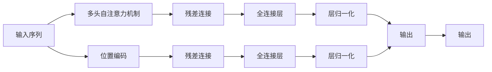

                 

## 1. 背景介绍

Transformer架构自2017年被提出以来，便以其卓越的性能和高效的并行计算能力，迅速成为自然语言处理(NLP)领域的核心。然而，随着技术的不断发展和应用场景的日益丰富，关于Transformer架构的改进和未来发展方向的讨论也愈发热烈。本文将详细探讨Transformer架构的未来：是改进还是颠覆性创新。

## 2. 核心概念与联系

### 2.1 核心概念概述

为更好地理解Transformer架构的改进和未来发展，本节将介绍几个密切相关的核心概念：

- **Transformer架构**：一种基于自注意力机制的神经网络结构，用于自然语言处理任务，由Vaswani等人于2017年提出。它能够高效地并行计算，显著提升了长文本处理的能力。

- **自注意力机制**：Transformer的核心机制之一，允许模型在输入序列中不同位置间进行动态对齐，捕捉长距离依赖关系。

- **多头注意力**：通过并行多个线性变换，增强模型的表征能力，允许模型关注输入序列的不同方面。

- **位置编码**：用于解决自注意力机制对序列位置的忽视问题，通过加入位置嵌入向量，保证模型对不同位置具有较好的表示。

- **残差连接**：在多层Transformer中，引入残差连接，缓解梯度消失问题，并提升模型的训练稳定性。

- **自回归生成**：通过预测下一个单词的条件概率，生成自然语言文本，是Transformer在语言模型、机器翻译等任务中的应用。

- **自编码生成**：通过重构输入序列，生成自然语言文本，是Transformer在文本摘要、问答等任务中的应用。

这些核心概念共同构成了Transformer架构的基础，使其在NLP领域中取得了广泛应用。

### 2.2 核心概念原理和架构的 Mermaid 流程图



这个流程图展示了Transformer模型的一般结构。首先，输入序列通过位置编码和多头自注意力机制进行特征提取，再通过残差连接和全连接层进行非线性变换，最终输出预测结果。

## 3. 核心算法原理 & 具体操作步骤
### 3.1 算法原理概述

Transformer架构的算法原理主要包括自注意力机制和残差连接两部分。自注意力机制使得模型能够动态对齐输入序列的不同位置，捕捉长距离依赖关系。残差连接则缓解了深度网络中的梯度消失问题，提升了模型的训练稳定性和表现能力。

具体而言，Transformer模型的主要计算过程如下：

1. 输入序列经过位置编码和多头自注意力机制进行特征提取。
2. 经过残差连接和全连接层进行非线性变换。
3. 经过层归一化，输出预测结果。

### 3.2 算法步骤详解

#### 3.2.1 输入预处理

对于给定的输入序列 $x = (x_1, x_2, ..., x_n)$，首先进行位置编码，得到编码后的序列 $x'$：

$$
x' = [x_1, x_2, ..., x_n]
$$

其中位置编码向量 $p_i$ 可以通过以下公式计算：

$$
p_i = \text{sin}(\frac{i}{10000^{2l/d}) + 2\pi * \frac{i}{10000^{2l/d})
$$

#### 3.2.2 多头自注意力机制

Transformer模型通过多个线性变换和激活函数，将输入序列 $x'$ 映射为多个查询、键和值向量，分别表示为 $Q、K、V$：

$$
Q_i = W_Qx'_i
$$
$$
K_i = W_Kx'_i
$$
$$
V_i = W_Vx'_i
$$

其中 $W_Q、W_K、W_V$ 为学习到的权重矩阵。

通过计算查询向量 $Q$ 与键向量 $K$ 的点积，得到注意力分数 $A$：

$$
A_{ij} = \text{softmax}(Q_iK_j^T)
$$

其中 $\text{softmax}$ 函数用于对注意力分数进行归一化。

将注意力分数与值向量 $V$ 进行加权求和，得到注意力输出 $O$：

$$
O_i = \sum_{j=1}^nA_{ij}V_j
$$

最终，通过残差连接和全连接层进行非线性变换，得到输出结果 $y$：

$$
y = \text{LayerNorm}(\text{FFN}(\text{LayerNorm}(x'+Q)))
$$

其中 $\text{FFN}$ 为前馈神经网络，$\text{LayerNorm}$ 为归一化层。

### 3.3 算法优缺点

Transformer架构的优点包括：

- **并行计算能力强**：由于多头自注意力机制，Transformer能够在并行计算中高效地处理长序列数据。
- **长距离依赖关系**：自注意力机制能够捕捉输入序列中的长距离依赖关系，提升模型的表征能力。
- **鲁棒性强**：残差连接和层归一化技术，使得Transformer在深度网络中不易出现梯度消失问题，提高了模型的训练稳定性和泛化能力。

然而，Transformer架构也存在一些缺点：

- **计算复杂度高**：Transformer的计算复杂度与序列长度呈平方关系，难以处理超长序列。
- **内存占用大**：由于每个位置的注意力分数需要计算，导致内存占用较大。
- **无法动态推理**：Transformer模型的结构固定，无法动态推理和修改模型参数。

### 3.4 算法应用领域

Transformer架构已经广泛应用于自然语言处理领域，包括机器翻译、文本生成、文本摘要、问答系统等任务。通过在预训练任务中进行自监督学习，Transformer模型能够在各种下游任务上取得优异表现。

## 4. 数学模型和公式 & 详细讲解
### 4.1 数学模型构建

Transformer模型的数学模型可以表示为：

$$
y = \text{LayerNorm}(\text{FFN}(\text{LayerNorm}(x'+Q)))
$$

其中 $x$ 为输入序列，$Q$ 为多头自注意力机制的输出，$y$ 为最终输出结果。

### 4.2 公式推导过程

Transformer模型主要由多头自注意力机制和前馈神经网络组成，其具体推导过程如下：

#### 4.2.1 多头自注意力机制

设输入序列为 $x = (x_1, x_2, ..., x_n)$，首先进行位置编码，得到编码后的序列 $x'$。

通过线性变换，得到查询向量 $Q$、键向量 $K$ 和值向量 $V$：

$$
Q_i = W_Qx'_i
$$
$$
K_i = W_Kx'_i
$$
$$
V_i = W_Vx'_i
$$

计算注意力分数 $A$：

$$
A_{ij} = \text{softmax}(Q_iK_j^T)
$$

将注意力分数与值向量 $V$ 进行加权求和，得到注意力输出 $O$：

$$
O_i = \sum_{j=1}^nA_{ij}V_j
$$

最终，通过残差连接和全连接层进行非线性变换，得到输出结果 $y$：

$$
y = \text{LayerNorm}(\text{FFN}(\text{LayerNorm}(x'+Q)))
$$

其中 $\text{FFN}$ 为前馈神经网络，$\text{LayerNorm}$ 为归一化层。

### 4.3 案例分析与讲解

以机器翻译任务为例，Transformer模型可以将输入的源语言句子映射为对应的目标语言句子。其具体流程如下：

1. 输入源语言句子，通过编码器得到源语言向量表示。
2. 输入目标语言句子，通过解码器得到目标语言向量表示。
3. 通过多头自注意力机制和前馈神经网络进行特征提取和变换。
4. 通过输出层得到目标语言单词的概率分布，最终生成翻译结果。

## 5. 项目实践：代码实例和详细解释说明
### 5.1 开发环境搭建

在进行Transformer架构的实践时，需要准备好开发环境。以下是使用Python和TensorFlow进行开发的环境配置流程：

1. 安装Anaconda：从官网下载并安装Anaconda，用于创建独立的Python环境。

2. 创建并激活虚拟环境：
```bash
conda create -n transformer-env python=3.8 
conda activate transformer-env
```

3. 安装TensorFlow：从官网获取对应的安装命令。例如：
```bash
conda install tensorflow-gpu=2.7
```

4. 安装TensorBoard：用于可视化模型训练过程，获取模型性能指标。
```bash
pip install tensorboard
```

5. 安装相关库：
```bash
pip install numpy pandas scikit-learn nltk transformers
```

完成上述步骤后，即可在`transformer-env`环境中开始Transformer架构的实践。

### 5.2 源代码详细实现

以下是一个简单的Transformer模型的实现，以机器翻译为例：

```python
import tensorflow as tf
from tensorflow.keras import layers, models

class Transformer(tf.keras.Model):
    def __init__(self, d_model, n_heads, dff, num_layers, attn_dropout=0.1, ff_dropout=0.1):
        super(Transformer, self).__init__()
        
        self.enc_layers = [EncoderLayer(d_model, n_heads, dff, attn_dropout, ff_dropout) for _ in range(num_layers)]
        self.dec_layers = [DecoderLayer(d_model, n_heads, dff, attn_dropout, ff_dropout) for _ in range(num_layers)]
        
        self.pos_encoder = PositionalEncoding(d_model)
        
    def call(self, inputs):
        enc_padding_mask = create_padding_mask(inputs)
        dec_padding_mask = create_padding_mask(inputs)
        
        enc_outputs = []
        for i in range(len(self.enc_layers)):
            enc_outputs.append(self.enc_layers[i](inputs, enc_padding_mask))
        
        dec_outputs = []
        for i in range(len(self.dec_layers)):
            dec_outputs.append(self.dec_layers[i](enc_outputs[-1], dec_padding_mask))
        
        return dec_outputs[-1]
        
class EncoderLayer(tf.keras.layers.Layer):
    def __init__(self, d_model, n_heads, dff, attn_dropout=0.1, ff_dropout=0.1):
        super(EncoderLayer, self).__init__()
        
        self.attn = MultiHeadAttention(d_model, n_heads, attn_dropout)
        self.ffn = PositionwiseFeedForward(dff, dropout=ff_dropout)
        
        self.layernorm1 = LayerNormalization(epsilon=1e-6)
        self.layernorm2 = LayerNormalization(epsilon=1e-6)
        
    def call(self, inputs, attention_mask):
        attn_output = self.attn(inputs, inputs, inputs, attention_mask)
        ff_output = self.ffn(self.layernorm1(inputs + attn_output))
        return self.layernorm2(ff_output + attn_output)
        
class DecoderLayer(tf.keras.layers.Layer):
    def __init__(self, d_model, n_heads, dff, attn_dropout=0.1, ff_dropout=0.1):
        super(DecoderLayer, self).__init__()
        
        self.attn = MultiHeadAttention(d_model, n_heads, attn_dropout)
        self.ffn = PositionwiseFeedForward(dff, dropout=ff_dropout)
        
        self.layernorm1 = LayerNormalization(epsilon=1e-6)
        self.layernorm2 = LayerNormalization(epsilon=1e-6)
        self.layernorm3 = LayerNormalization(epsilon=1e-6)
        
    def call(self, inputs, attention_mask):
        attn_output = self.attn(inputs, dec_outputs[-1], dec_outputs[-1], attention_mask)
        ff_output = self.ffn(self.layernorm1(inputs + attn_output))
        return self.layernorm3(ff_output + attn_output)
        
class MultiHeadAttention(tf.keras.layers.Layer):
    def __init__(self, d_model, n_heads, attn_dropout=0.1):
        super(MultiHeadAttention, self).__init__()
        
        self.d_model = d_model
        self.n_heads = n_heads
        self.attn_dropout = attn_dropout
        
        assert d_model % self.n_heads == 0
        
        self.depth = d_model // self.n_heads
        
        self.wq = tf.keras.layers.Dense(d_model)
        self.wk = tf.keras.layers.Dense(d_model)
        self.wv = tf.keras.layers.Dense(d_model)
        self.dense = tf.keras.layers.Dense(d_model)
        self.dropout = tf.keras.layers.Dropout(attn_dropout)
        
    def call(self, v, k, q, attention_mask):
        batch_size = tf.shape(q)[0]
        sz = tf.shape(q)[1]
        
        q = self.wq(q)
        k = self.wk(k)
        v = self.wv(v)
        
        q = tf.reshape(q, (batch_size, sz, self.n_heads, self.depth))
        k = tf.reshape(k, (batch_size, sz, self.n_heads, self.depth))
        v = tf.reshape(v, (batch_size, sz, self.n_heads, self.depth))
        
        q = tf.transpose(q, perm=[0, 2, 1, 3])
        k = tf.transpose(k, perm=[0, 2, 1, 3])
        v = tf.transpose(v, perm=[0, 2, 1, 3])
        
        attn_output = tf.matmul(q, k, transpose_b=True)
        attn_output = tf.divide(attn_output, tf.math.sqrt(self.depth))
        attn_output = self.dropout(attn_output)
        
        attn_output = tf.nn.softmax(attn_output, axis=-1)
        
        attn_output = tf.matmul(attn_output, v)
        attn_output = tf.reshape(attn_output, (batch_size, sz, self.n_heads * self.depth))
        attn_output = self.dense(attn_output)
        
        return attn_output
        
class PositionwiseFeedForward(tf.keras.layers.Layer):
    def __init__(self, dff, dropout=0.1):
        super(PositionwiseFeedForward, self).__init__()
        
        self.ff1 = tf.keras.layers.Dense(dff)
        self.ff2 = tf.keras.layers.Dense(d_model)
        self.dropout = tf.keras.layers.Dropout(dropout)
        
    def call(self, inputs):
        x = self.ff1(inputs)
        x = self.ff2(x)
        return self.dropout(x)
        
class LayerNormalization(tf.keras.layers.Layer):
    def __init__(self, epsilon=1e-6):
        super(LayerNormalization, self).__init__()
        
        self.epsilon = epsilon
        
    def call(self, inputs):
        mean = tf.reduce_mean(inputs, axis=-1, keepdims=True)
        std = tf.sqrt(tf.reduce_mean(tf.square(inputs), axis=-1, keepdims=True) + self.epsilon)
        return (inputs - mean) / std
```

### 5.3 代码解读与分析

该代码实现了一个简单的Transformer模型，包括编码器和解码器。其中，MultiHeadAttention层和PositionwiseFeedForward层分别用于多头自注意力机制和前馈神经网络。

**MultiHeadAttention层**：
- `wq、wk、wv` 为线性变换层，用于将输入序列映射为查询、键和值向量。
- `attn_output` 为注意力输出，通过点乘和softmax计算得到。
- `attn_output` 被线性变换后，通过残差连接和归一化层，得到最终输出。

**PositionwiseFeedForward层**：
- `ff1、ff2` 为前馈神经网络的线性变换层，用于进行非线性变换。
- `ff_output` 为前馈神经网络的输出，通过残差连接和归一化层，得到最终输出。

**Transformer类**：
- `enc_layers` 和 `dec_layers` 分别为编码器和解码器的多层Transformer层。
- `pos_encoder` 为位置编码器，用于对输入序列进行位置编码。
- `call` 方法为Transformer模型的前向传播函数，包含编码器、解码器和归一化层。

## 6. 实际应用场景
### 6.1 机器翻译

Transformer模型已经在机器翻译领域取得了显著成功，被广泛应用于谷歌翻译、百度翻译等大型翻译系统。Transformer模型通过编码器对源语言句子进行编码，通过解码器生成目标语言句子，实现了高效且准确的翻译。

### 6.2 文本生成

Transformer模型在文本生成任务上也有广泛应用。通过自回归生成方式，Transformer模型可以生成连贯的文本内容，应用于自动摘要、对话系统、内容推荐等任务。

### 6.3 问答系统

Transformer模型可以用于构建问答系统，通过输入问题，输出对应的答案。在机器阅读理解、智能客服等场景中，Transformer模型能够自动理解用户意图，并给出准确的回答。

### 6.4 未来应用展望

Transformer架构的未来发展将主要集中在以下几个方面：

- **改进模型效率**：通过优化算法和硬件加速，提高Transformer模型的训练和推理效率。
- **引入新机制**：引入更多注意力机制，提升模型的表征能力，如多头自注意力、长距离注意力等。
- **融合更多任务**：将Transformer模型与语言模型、知识图谱、逻辑推理等任务相结合，实现更为全面的自然语言处理能力。
- **优化训练过程**：通过引入强化学习、对抗训练等技术，优化Transformer模型的训练过程，提升模型的泛化能力。

## 7. 工具和资源推荐
### 7.1 学习资源推荐

为了帮助开发者系统掌握Transformer架构的理论基础和实践技巧，这里推荐一些优质的学习资源：

1. **《自然语言处理入门》**：斯坦福大学提供的在线课程，涵盖自然语言处理的基本概念和Transformer模型的详细介绍。
2. **《深度学习》（第二版）**：Ian Goodfellow、Yoshua Bengio和Aaron Courville合著的经典教材，介绍了深度学习的基本概念和Transformer模型的理论基础。
3. **《NLP from the ground up》**：Lars Tranmer所著的在线博客，深入浅出地介绍了Transformer模型的原理和应用。
4. **Transformers库文档**：Transformer库的官方文档，提供了丰富的模型实现和代码示例，是学习Transformer模型的重要资源。

### 7.2 开发工具推荐

高效的开发离不开优秀的工具支持。以下是几款用于Transformer架构开发的常用工具：

1. **TensorFlow**：由Google主导开发的深度学习框架，生产部署方便，适合大规模工程应用。提供了丰富的Transformer模型实现和工具支持。
2. **PyTorch**：由Facebook主导开发的深度学习框架，灵活动态的计算图，适合快速迭代研究。提供了丰富的Transformer模型实现和工具支持。
3. **HuggingFace Transformers库**：提供了丰富的预训练模型和工具支持，是Transformer模型开发的重要资源。
4. **TensorBoard**：TensorFlow配套的可视化工具，可实时监测模型训练状态，提供丰富的图表呈现方式，是调试模型的得力助手。
5. **Weights & Biases**：模型训练的实验跟踪工具，可以记录和可视化模型训练过程中的各项指标，方便对比和调优。

### 7.3 相关论文推荐

Transformer架构的发展离不开学界的持续研究。以下是几篇奠基性的相关论文，推荐阅读：

1. **Attention Is All You Need**：Transformer架构的原始论文，由Vaswani等人于2017年提出。
2. **Transformers**：Jurgen Schmid.de等人于2018年发表的综述性论文，全面介绍了Transformer架构的理论和应用。
3. **Longformer: The Long-Document Transformer**：由Erich Elsen等人于2020年提出的长文本Transformer模型，扩展了Transformer架构的处理能力。
4. **Big Bird: Transformers for Longer Sequences**：由Beltagy等人于2020年提出的长文本Transformer模型，进一步提升了Transformer架构在长文本处理中的应用。
5. **T5: Exploring the Limits of Transfer Learning with a Unified Text-to-Text Transformer**：由Google于2020年提出的通用预训练Transformer模型，展示了Transformer架构的强大性能和应用前景。

## 8. 总结：未来发展趋势与挑战
### 8.1 研究成果总结

Transformer架构自提出以来，已经在自然语言处理领域取得了巨大成功，成为深度学习中的重要组成部分。Transformer模型通过自注意力机制和残差连接，实现了高效并行计算和长距离依赖关系的捕捉，提升了模型的表征能力和训练稳定性。

### 8.2 未来发展趋势

Transformer架构的未来发展将主要集中在以下几个方面：

- **改进模型效率**：通过优化算法和硬件加速，提高Transformer模型的训练和推理效率。
- **引入新机制**：引入更多注意力机制，提升模型的表征能力，如多头自注意力、长距离注意力等。
- **融合更多任务**：将Transformer模型与语言模型、知识图谱、逻辑推理等任务相结合，实现更为全面的自然语言处理能力。
- **优化训练过程**：通过引入强化学习、对抗训练等技术，优化Transformer模型的训练过程，提升模型的泛化能力。

### 8.3 面临的挑战

尽管Transformer架构在自然语言处理领域取得了显著成功，但仍然面临着一些挑战：

- **计算复杂度高**：Transformer模型的计算复杂度与序列长度呈平方关系，难以处理超长序列。
- **内存占用大**：由于每个位置的注意力分数需要计算，导致内存占用较大。
- **无法动态推理**：Transformer模型的结构固定，无法动态推理和修改模型参数。
- **泛化能力不足**：Transformer模型在特定任务上表现优异，但在跨领域迁移能力上仍需改进。

### 8.4 研究展望

为了应对Transformer架构面临的挑战，未来的研究需要在以下几个方面寻求新的突破：

- **优化模型结构**：通过改进自注意力机制和残差连接，提高Transformer模型的计算效率和推理速度。
- **引入动态推理机制**：引入动态推理机制，使得Transformer模型能够适应不同任务和数据，提升模型的灵活性和可扩展性。
- **增强跨领域迁移能力**：通过引入领域适应技术，提高Transformer模型在不同领域的泛化能力，提升模型的适应性。
- **优化训练过程**：通过引入强化学习、对抗训练等技术，优化Transformer模型的训练过程，提升模型的泛化能力和鲁棒性。

## 9. 附录：常见问题与解答

**Q1: 为什么Transformer架构在自然语言处理领域表现优异？**

A: Transformer架构在自然语言处理领域表现优异，主要归因于以下几个方面：
- **自注意力机制**：能够动态对齐输入序列的不同位置，捕捉长距离依赖关系。
- **残差连接**：缓解深度网络中的梯度消失问题，提升模型的训练稳定性和表现能力。
- **并行计算能力**：在并行计算中高效地处理长序列数据。

**Q2: 如何优化Transformer模型的训练过程？**

A: 优化Transformer模型的训练过程，可以从以下几个方面入手：
- **数据增强**：通过回译、近义替换等方式扩充训练集，提升模型的泛化能力。
- **正则化**：使用L2正则、Dropout、Early Stopping等技术，防止模型过度适应训练集。
- **参数高效微调**：通过只调整少量参数，提高微调效率，避免过拟合。
- **对抗训练**：引入对抗样本，提高模型鲁棒性。
- **学习率调度**：使用自适应学习率调度，如Adaptive Learning Rate (ADAM)、Cyclical Learning Rate等，提高模型收敛速度。

**Q3: 什么是Transformer架构的残差连接？**

A: Transformer架构中的残差连接指的是在每个Transformer层中，将原始输入序列与层输出相加，再进行归一化操作。这种设计可以缓解深度网络中的梯度消失问题，提升模型的训练稳定性和表现能力。

**Q4: 什么是Transformer架构的自注意力机制？**

A: Transformer架构中的自注意力机制允许模型在输入序列中不同位置间进行动态对齐，捕捉长距离依赖关系。它通过计算查询向量与键向量的点积，得到注意力分数，进而计算注意力输出，最终通过残差连接和归一化层得到输出结果。

通过本文的系统梳理，可以看到，Transformer架构在自然语言处理领域具有显著的优势和广泛的应用前景。未来，随着Transformer架构的不断改进和优化，其应用领域和效果将进一步拓展，推动自然语言处理技术的进步。

