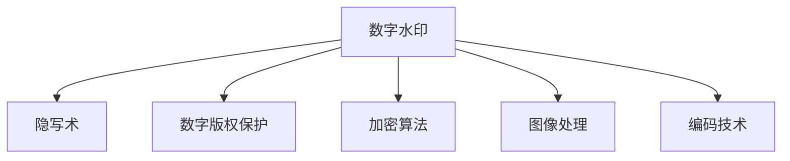

                 

# Watermark 原理与代码实例讲解

> 关键词：水印,隐写术,信息隐藏,数字版权保护,加密算法,图像处理,编码技术

## 1. 背景介绍

### 1.1 问题由来
随着数字技术的发展，信息传播和存储方式发生了巨大变化。数字图像、音频、视频等内容的广泛应用，极大地丰富了人们的生活和工作方式。但与此同时，这些数字内容也面临着被非法复制、篡改、盗用的风险，严重威胁到了个人隐私和知识产权。

为解决这一问题，数字水印（Digital Watermarking）技术应运而生。数字水印是一种将特定信息嵌入到数字内容中的隐秘技术，在保证不破坏原有内容的前提下，对内容进行身份验证、版权保护等操作。数字水印技术因其低成本、高安全性、不可感知性等特点，在数字版权保护、安全通信等领域得到了广泛应用。

### 1.2 问题核心关键点
数字水印的核心在于如何在数字内容中安全、可靠地嵌入和提取水印信息。理想的水印应该具有以下特点：
- 鲁棒性：在经过多次攻击、处理或传输后，仍能保持完整性。
- 不可见性：嵌入水印后，不影响原始内容的感知效果。
- 随机性：水印信息不易被预测，难以被恶意篡改。
- 透明性：水印信息嵌入过程透明，不对用户产生额外干扰。
- 可证明性：能提供有力的证据，证明数字内容的所有权和使用权限。

数字水印技术的核心在于算法的设计和实现。常见的数字水印算法有：统计模型、变换域方法、压缩域方法、视觉密码学等。这些算法各有优劣，在不同的应用场景下具有不同的适用性。

## 2. 核心概念与联系

### 2.1 核心概念概述

为更好地理解数字水印技术，本节将介绍几个密切相关的核心概念：

- **数字水印（Digital Watermarking）**：将特定信息（如版权信息、个人标识等）嵌入到数字内容中，以保护版权、证明内容真实性、提高内容的可信度。
- **隐写术（Steganography）**：将信息隐藏在媒体内容中，使信息不易被发现。隐写术与数字水印技术关系密切，但与水印不同的是，隐写术强调信息的隐蔽性，而不是完整性和安全性。
- **数字版权保护（Digital Rights Management, DRM）**：通过技术手段限制数字内容的复制、使用等行为，保护数字内容所有者的权益。数字水印技术是DRM的重要手段之一。
- **加密算法（Encryption）**：通过特定的算法将数据转换为密文，只有特定授权用户才能解密获取原数据。加密算法与数字水印技术结合，可以提升数据安全性。
- **图像处理（Image Processing）**：包括图像压缩、增强、分割、识别等技术，是数字水印嵌入和提取的重要基础。
- **编码技术（Coding Techniques）**：如哈夫曼编码、LZW压缩等，用于优化数字水印信息的嵌入过程，减小对原始内容的影响。

这些核心概念之间的逻辑关系可以通过以下Mermaid流程图来展示：



这个流程图展示了大数字水印技术的核心概念及其之间的关系：

1. 数字水印是数字版权保护的重要手段。
2. 数字水印与隐写术密切相关，但重点不同。
3. 数字水印可以与加密算法结合，提升安全性。
4. 图像处理和编码技术是数字水印嵌入和提取的基础。

这些概念共同构成了数字水印技术的核心框架，使其在信息安全、内容认证等领域发挥重要作用。

## 3. 核心算法原理 & 具体操作步骤
### 3.1 算法原理概述

数字水印技术主要分为嵌入和提取两个阶段。嵌入阶段在原始数字内容中嵌入水印信息，提取阶段则从处理后的内容中恢复水印信息。

嵌入阶段的基本思路是将水印信息作为数字信号嵌入到原始数字信号中，使得水印信号与原始信号紧密耦合，难以分离。常见的嵌入方法包括直接序列调制、扩频通信、频域嵌入等。

提取阶段则是从处理后的数字内容中恢复原始水印信号。提取方法一般分为统计方法、频域方法、空域方法等，常见的提取方法包括相关分析、峰值检测、频谱分析等。

数字水印算法的设计需考虑以下因素：
- 水印信号的设计：选择合适的水印信号，如二值图像、伪随机序列等。
- 嵌入位置和强度的确定：选择合适的嵌入位置和强度，以平衡鲁棒性和可见性。
- 嵌入策略的优化：采用合适的嵌入策略，如频域嵌入、空域嵌入、混合嵌入等。
- 攻击鲁棒性的提升：考虑常见的攻击方式，如压缩、滤波、剪切等，并设计鲁棒水印算法。
- 提取算法的优化：设计高效、精确的提取算法，恢复水印信号。

### 3.2 算法步骤详解

以下是数字水印嵌入和提取的一般流程：

**嵌入阶段：**
1. 选择水印信号：根据应用需求，选择合适的水印信号，如二值图像、伪随机序列等。
2. 将水印信号进行预处理：如二值化、归一化、分块等，以提高嵌入效率。
3. 选择合适的嵌入算法：如扩频通信、频域嵌入、空域嵌入等。
4. 将水印信号嵌入原始数字内容中：将水印信号作为数字信号嵌入到原始信号中，形成含水印内容。
5. 对含水印内容进行压缩、滤波等处理：确保含水印内容经过多次攻击后仍能提取到水印信息。

**提取阶段：**
1. 对处理后的含水印内容进行预处理：如反滤波、反压缩等。
2. 选择合适的提取算法：如相关分析、峰值检测、频谱分析等。
3. 从处理后的含水印内容中恢复水印信号：通过提取算法，从含水印内容中恢复水印信号。
4. 验证水印信息的完整性和可靠性：通过统计方法或频谱分析，验证恢复水印信号的完整性和可靠性。

### 3.3 算法优缺点

数字水印技术具有以下优点：
1. 成本低：相对于传统的数字版权保护手段（如硬件加密、数字证书等），数字水印技术成本较低。
2. 安全性高：数字水印的嵌入过程难以察觉，嵌入后的水印信号难以被恶意篡改。
3. 不可见性好：通过优化嵌入算法，可以有效减少水印信号对原始内容的视觉影响。
4. 灵活性高：可以根据不同的应用需求，选择合适的水印信号和嵌入算法。

同时，数字水印技术也存在以下局限：
1. 鲁棒性不足：数字水印在经过多次攻击、处理或传输后，可能被破坏。
2. 嵌入容量有限：嵌入水印信号对原始内容有一定的影响，嵌入容量有限。
3. 提取过程复杂：不同的攻击方式可能对提取过程产生影响，提取过程需要特定的算法和技术支持。
4. 依赖外部设备：数字水印技术的嵌入和提取需要特定的软硬件设备，具有一定的局限性。

尽管存在这些局限性，但数字水印技术凭借其低成本、高安全性、不可见性等特点，已成为数字内容保护的重要手段，在数字版权保护、安全通信等领域得到了广泛应用。

### 3.4 算法应用领域

数字水印技术在多个领域得到了广泛应用，主要包括以下几个方面：

- **数字版权保护**：将版权信息嵌入到数字内容中，证明内容所有权和使用权限，防止内容被盗用和篡改。
- **数字证据保全**：将关键信息嵌入到数字内容中，用于追踪和证明内容的真实性，防止内容被篡改。
- **个人隐私保护**：将个人信息嵌入到数字内容中，防止信息泄露和非法使用，保护个人隐私。
- **网络安全**：通过数字水印技术，可以保护网络传输中的数据安全，防止数据泄露和篡改。
- **医学影像**：在医学影像中嵌入水印，防止影像被非法复制和篡改，保护患者隐私和医疗数据安全。
- **电子文档**：在电子文档中嵌入水印，防止文档被盗用和篡改，保护文档所有权和使用权限。

## 4. 数学模型和公式 & 详细讲解 & 举例说明（备注：数学公式请使用latex格式，latex嵌入文中独立段落使用 $$，段落内使用 $)
### 4.1 数学模型构建

数字水印技术的基本模型可以表示为：

$$
\begin{aligned}
&\min_{x,y} \quad \text{Loss}(x,y) \\
&\text{s.t.} \quad M(x) = \text{Watermark}(y) \\
&\quad M(x) = f_x(x) \quad f_x: \mathcal{X} \rightarrow \mathcal{Y}
\end{aligned}
$$

其中 $x$ 为原始数字内容，$y$ 为水印信息，$M(x)$ 为含水印的数字内容，$\text{Watermark}(y)$ 为水印信号，$f_x$ 为嵌入算法。$\text{Loss}(x,y)$ 为损失函数，用于衡量嵌入水印后的数字内容与原始内容的差异。

### 4.2 公式推导过程

以常见的频域数字水印算法为例，假设原始数字内容 $x \in \mathbb{R}^n$，水印信息 $y \in \mathbb{R}^m$。嵌入过程可以表示为：

$$
\begin{aligned}
&z = x + \lambda y \\
&z \in \mathbb{R}^n \\
&\lambda \in \mathbb{R}
\end{aligned}
$$

其中 $z$ 为含水印数字内容，$\lambda$ 为嵌入强度系数。嵌入后，$z$ 经过DCT、DWT等变换，得到频域表示 $Z \in \mathbb{C}^{n \times n}$。

提取过程可以表示为：

$$
\begin{aligned}
&\hat{z} = Z \\
&\hat{x} = \hat{z} - \hat{y} \\
&\hat{x} \in \mathbb{R}^n
\end{aligned}
$$

其中 $\hat{z}$ 为经过处理后的含水印数字内容，$\hat{y}$ 为提取的水印信息，$\hat{x}$ 为提取后的原始数字内容。

### 4.3 案例分析与讲解

以扩频通信数字水印算法为例，其基本思想是将水印信息通过特定的编码方式嵌入到原始数字内容中。假设原始数字内容为图像 $I \in \mathbb{R}^{m \times n}$，水印信息为二进制序列 $B \in \{0,1\}^k$，嵌入过程可以表示为：

$$
\begin{aligned}
&W = \text{Encode}(B) \\
&W \in \mathbb{R}^{m \times n} \\
&I' = I + \lambda W \\
&I' \in \mathbb{R}^{m \times n}
\end{aligned}
$$

其中 $\text{Encode}(B)$ 为水印信息编码函数，$\lambda$ 为嵌入强度系数。提取过程可以表示为：

$$
\begin{aligned}
&I'' = I' - \lambda W \\
&B' = \text{Decode}(I'') \\
&B' \in \{0,1\}^k
\end{aligned}
$$

其中 $\text{Decode}(I'')$ 为水印信息解码函数，$I''$ 为经过处理后的含水印数字内容，$B'$ 为提取的水印信息。

## 5. 项目实践：代码实例和详细解释说明
### 5.1 开发环境搭建

在进行数字水印项目实践前，我们需要准备好开发环境。以下是使用Python进行数字水印开发的常用环境配置流程：

1. 安装Anaconda：从官网下载并安装Anaconda，用于创建独立的Python环境。

2. 创建并激活虚拟环境：
```bash
conda create -n watermark-env python=3.8 
conda activate watermark-env
```

3. 安装必要的Python库：
```bash
pip install numpy scipy matplotlib scikit-image opencv-python
```

4. 安装PyTorch：
```bash
pip install torch torchvision
```

5. 安装OpenCV：
```bash
pip install opencv-python-headless
```

完成上述步骤后，即可在`watermark-env`环境中开始数字水印项目的实践。

### 5.2 源代码详细实现

以下是使用PyTorch和OpenCV进行数字水印嵌入和提取的Python代码实现。

首先，定义数字水印嵌入函数：

```python
import cv2
import numpy as np
import torch

def embed_watermark(image, watermark, strength):
    image = cv2.cvtColor(image, cv2.COLOR_BGR2RGB)
    watermark = cv2.cvtColor(watermark, cv2.COLOR_GRAY2RGB) * strength
    image = image + watermark
    image = np.clip(image, 0, 255).astype(np.uint8)
    return cv2.cvtColor(image, cv2.COLOR_RGB2BGR)

# 水印信息编码为二值图像
def encode_watermark(watermark):
    encoded_watermark = np.zeros_like(watermark)
    for i in range(watermark.shape[0]):
        for j in range(watermark.shape[1]):
            if watermark[i, j] == 255:
                encoded_watermark[i, j] = 1
    return encoded_watermark

# 水印信息解码为二值图像
def decode_watermark(image):
    decoded_watermark = np.zeros_like(image)
    for i in range(image.shape[0]):
        for j in range(image.shape[1]):
            if image[i, j] == 255:
                decoded_watermark[i, j] = 1
    return decoded_watermark

# 水印信息提取函数
def extract_watermark(image, strength):
    image = cv2.cvtColor(image, cv2.COLOR_BGR2RGB)
    watermark = image * strength
    watermark = np.clip(watermark, 0, 255).astype(np.uint8)
    watermark = cv2.cvtColor(watermark, cv2.COLOR_RGB2GRAY)
    return decode_watermark(watermark)

# 数字水印嵌入和提取示例
if __name__ == '__main__':
    # 加载原始图像和水印图像
    original_image = cv2.imread('original_image.jpg')
    watermark_image = cv2.imread('watermark.png', cv2.IMREAD_GRAYSCALE)
    
    # 水印信息编码为二值图像
    encoded_watermark = encode_watermark(watermark_image)
    
    # 水印信息嵌入
    embedded_image = embed_watermark(original_image, encoded_watermark, 0.5)
    
    # 水印信息提取
    extracted_watermark = extract_watermark(embedded_image, 0.5)
    
    # 打印提取结果
    print(np.mean(extracted_watermark == watermark_image))
```

代码中使用了OpenCV进行图像处理，PyTorch进行深度学习运算。嵌入函数将水印信息按照一定的强度系数嵌入到原始图像中，提取函数从嵌入后的图像中恢复水印信息。通过这些函数的组合，可以实现数字水印的嵌入和提取。

### 5.3 代码解读与分析

代码中主要包含以下几个关键部分：

**图像预处理**：
- 使用OpenCV库对原始图像和水印图像进行预处理，将图像转换为RGB格式。

**水印信息编码**：
- 水印信息编码为二值图像，每个像素点的值为0或1，便于后续的嵌入和提取。

**水印信息嵌入**：
- 将水印信息按照一定的强度系数嵌入到原始图像中，强度系数控制水印信息的可见性，强度系数越大，水印越明显，但可能对原始图像的视觉效果产生影响。

**水印信息提取**：
- 从嵌入后的图像中恢复水印信息，通过简单的阈值操作将水印信息解码为二值图像。

**提取结果验证**：
- 验证提取后的水印信息是否与原始水印信息一致，通过计算像素值的平均值，判断水印的恢复效果。

在实际应用中，还需要根据具体需求对嵌入算法和强度系数进行优化。例如，在嵌入二值图像时，可以通过LSB（Least Significant Bit）嵌入算法，将水印信息嵌入到图像的最低有效位中，以最小化对图像的视觉影响。

## 6. 实际应用场景

### 6.1 数字版权保护

数字水印技术在数字版权保护中有着广泛应用。数字版权保护技术旨在通过特定手段，保护数字内容的版权和使用权限。数字水印技术可以嵌入版权信息、水印码等，用于证明内容所有权和使用权限。

例如，在出版物中嵌入作者和出版社信息，通过提取水印信息，证明出版物的版权和使用权限。在音乐和视频中嵌入版权信息，防止非法复制和传播，保护版权所有者的权益。

### 6.2 个人隐私保护

数字水印技术还可以用于个人隐私保护。在数字内容中嵌入个人隐私信息，如身份标识、指纹等，用于防止信息泄露和非法使用，保护个人隐私。

例如，在医疗记录中嵌入患者姓名和身份证号，防止医疗记录被盗用和非法传播，保护患者隐私。在社交媒体中嵌入个人信息，防止信息泄露和隐私侵犯。

### 6.3 网络安全

数字水印技术在网络安全中也有着重要应用。通过数字水印技术，可以保护网络传输中的数据安全，防止数据泄露和篡改，提升网络安全。

例如，在电子邮件中嵌入加密信息，防止邮件被非法篡改和窃取。在网络通信中嵌入数字签名，验证通信方的身份和数据的完整性，防止通信被中间人攻击和篡改。

### 6.4 未来应用展望

随着数字技术的不断进步，数字水印技术也在不断演进，未来将有更广阔的应用前景。

未来，数字水印技术将在以下几个方面进一步发展：
1. 多模态数字水印：结合图像、音频、视频等多模态数据，实现综合的数字水印嵌入和提取，提升水印信息的鲁棒性和不可见性。
2. 动态数字水印：在动态图像和视频中嵌入动态水印，实现实时监控和追踪，提升数字内容的实时性。
3. 分布式数字水印：在分布式网络中嵌入数字水印，实现全链路的版权保护和追踪，提升网络安全。
4. 自适应数字水印：根据数字内容的特点和攻击方式，自动调整水印嵌入策略和强度，提升数字水印的鲁棒性和适应性。

这些方向的发展，将使数字水印技术在更多领域得到应用，为数字内容保护和网络安全提供更加强大的手段。

## 7. 工具和资源推荐
### 7.1 学习资源推荐

为了帮助开发者系统掌握数字水印技术，这里推荐一些优质的学习资源：

1. 《数字水印与隐写术》书籍：全面介绍数字水印与隐写术的基本原理、算法和应用，是学习数字水印技术的入门必读。
2. 《数字图像处理与视觉密码学》课程：斯坦福大学开设的计算机视觉课程，涵盖数字图像处理和视觉密码学的基本知识，适合深入学习数字水印技术。
3. 《数字版权保护技术》讲座：知名专家讲解数字版权保护的基本技术和应用场景，提供实际案例和经验分享。
4. 《数字水印技术及应用》课程：国内知名高校开设的数字水印课程，涵盖数字水印技术的基本原理、算法和应用，适合系统学习。
5. 《数字水印技术综述》论文：系统总结数字水印技术的最新进展和应用，提供理论分析和案例分析。

通过对这些资源的学习实践，相信你一定能够系统掌握数字水印技术，并应用于实际项目中。

### 7.2 开发工具推荐

高效的开发离不开优秀的工具支持。以下是几款用于数字水印开发的常用工具：

1. OpenCV：开源计算机视觉库，支持图像处理、视频分析、人脸识别等，是数字水印嵌入和提取的基础。
2. Matplotlib：Python绘图库，支持绘制各种图表，适合对数字水印嵌入和提取的效果进行可视化展示。
3. PyTorch：基于Python的深度学习框架，支持高效计算和优化，适合数字水印算法的实现。
4. TensorFlow：谷歌开源的深度学习框架，支持分布式计算和自动微分，适合大规模数字水印项目的开发。
5. Weights & Biases：模型训练的实验跟踪工具，可以记录和可视化模型训练过程中的各项指标，方便调试和优化。
6. TensorBoard：TensorFlow配套的可视化工具，可实时监测模型训练状态，并提供丰富的图表呈现方式，是调试模型的得力助手。

合理利用这些工具，可以显著提升数字水印项目的开发效率，加快创新迭代的步伐。

### 7.3 相关论文推荐

数字水印技术的发展离不开学界的持续研究。以下是几篇奠基性的相关论文，推荐阅读：

1. "Digital Watermarking Techniques"（数字水印技术）：系统总结了数字水印技术的各类算法和应用，提供理论分析和实验结果。
2. "Steganography: Extracting Hidden Messages from Digital Images"（隐写术：从数字图像中提取隐藏信息）：介绍了隐写术的基本原理和实现方法，提供实际案例和实验结果。
3. "A Survey of Digital Watermarking Techniques"（数字水印技术综述）：全面总结了数字水印技术的最新进展和应用，提供理论分析和实验结果。
4. "Digital Rights Management"（数字版权管理）：介绍了数字版权管理的各类技术和应用，提供实际案例和经验分享。
5. "A Review on Robust Watermarking Techniques for Multimedia Data"（多媒体数据的鲁棒水印技术综述）：总结了多媒体数据中的鲁棒水印算法和应用，提供理论分析和实验结果。

这些论文代表了大数字水印技术的发展脉络。通过学习这些前沿成果，可以帮助研究者把握学科前进方向，激发更多的创新灵感。

## 8. 总结：未来发展趋势与挑战

### 8.1 总结

本文对数字水印技术进行了全面系统的介绍。首先阐述了数字水印技术在数字内容保护中的应用背景和重要性，明确了数字水印在鲁棒性、不可见性等方面的关键特点。其次，从原理到实践，详细讲解了数字水印嵌入和提取的基本流程，给出了数字水印嵌入和提取的完整代码实例。同时，本文还广泛探讨了数字水印技术在数字版权保护、个人隐私保护、网络安全等多个领域的应用前景，展示了数字水印技术的广阔前景。

通过本文的系统梳理，可以看到，数字水印技术在信息保护和内容认证等领域具有重要价值，具备低成本、高安全性、不可见性等特点，成为数字内容保护的重要手段。未来，数字水印技术将在更多领域得到应用，为信息安全和内容认证提供更加强大的技术支持。

### 8.2 未来发展趋势

展望未来，数字水印技术将呈现以下几个发展趋势：

1. 多模态数字水印：结合图像、音频、视频等多模态数据，实现综合的数字水印嵌入和提取，提升水印信息的鲁棒性和不可见性。
2. 动态数字水印：在动态图像和视频中嵌入动态水印，实现实时监控和追踪，提升数字内容的实时性。
3. 分布式数字水印：在分布式网络中嵌入数字水印，实现全链路的版权保护和追踪，提升网络安全。
4. 自适应数字水印：根据数字内容的特点和攻击方式，自动调整水印嵌入策略和强度，提升数字水印的鲁棒性和适应性。

这些趋势凸显了数字水印技术的广阔前景。这些方向的探索发展，必将进一步提升数字水印技术的性能和应用范围，为信息安全和内容认证提供更加强大的手段。

### 8.3 面临的挑战

尽管数字水印技术已经取得了瞩目成就，但在迈向更加智能化、普适化应用的过程中，它仍面临着诸多挑战：

1. 鲁棒性不足：数字水印在经过多次攻击、处理或传输后，可能被破坏。如何在保证水印不可见性的同时，提升鲁棒性，是需要解决的重要问题。
2. 嵌入容量有限：嵌入水印信号对原始内容有一定的影响，嵌入容量有限。如何在有限的嵌入容量下，提高水印的鲁棒性和不可见性，是一个重要的研究方向。
3. 提取过程复杂：不同的攻击方式可能对提取过程产生影响，提取过程需要特定的算法和技术支持。如何设计高效、精确的提取算法，是一个重要的研究方向。
4. 依赖外部设备：数字水印技术的嵌入和提取需要特定的软硬件设备，具有一定的局限性。如何在不依赖外部设备的情况下，实现数字水印的嵌入和提取，是一个重要的研究方向。

尽管存在这些挑战，但数字水印技术凭借其低成本、高安全性、不可见性等特点，已成为数字内容保护的重要手段，在数字版权保护、个人隐私保护、网络安全等领域得到了广泛应用。未来，随着技术的不断发展，数字水印技术将在更多领域得到应用，为信息安全和内容认证提供更加强大的技术支持。

### 8.4 研究展望

面对数字水印技术所面临的挑战，未来的研究需要在以下几个方面寻求新的突破：

1. 设计鲁棒性强、不可见性好的水印算法：结合信号处理、图像处理和编码技术，设计鲁棒性强、不可见性好的水印算法，提升数字水印的鲁棒性和不可见性。
2. 开发高效、精确的水印提取算法：结合统计分析、频域分析等技术，开发高效、精确的水印提取算法，提高数字水印的提取效果。
3. 引入人工智能技术：结合深度学习、强化学习等人工智能技术，提升数字水印技术的智能化水平，实现自适应数字水印嵌入和提取。
4. 发展分布式数字水印技术：结合区块链、共识算法等技术，实现分布式数字水印嵌入和提取，提升数字水印技术的可信性和安全性。

这些研究方向的探索，必将引领数字水印技术迈向更高的台阶，为信息安全和内容认证提供更加强大的技术支持。面向未来，数字水印技术还需要与其他人工智能技术进行更深入的融合，共同推动数字水印技术的发展和应用。只有勇于创新、敢于突破，才能不断拓展数字水印技术的边界，为信息安全和内容认证提供更加可靠、高效的技术手段。

## 9. 附录：常见问题与解答

**Q1：数字水印是否容易被破解？**

A: 数字水印的破解难度取决于嵌入算法和攻击方式。一般来说，采用鲁棒性强的嵌入算法，结合多种攻击方式的抵御能力，可以有效提高数字水印的破解难度。在实际应用中，数字水印的破解难度需要根据具体需求进行评估和优化。

**Q2：数字水印对原始内容的影响如何？**

A: 数字水印嵌入过程中，会对原始内容产生一定的影响，主要表现在两个方面：
1. 视觉影响：嵌入水印后，原始内容可能会出现一定的视觉变化，如亮度、对比度等。
2. 信息损失：嵌入水印后，原始内容可能会出现一定的信息损失，如细节模糊、图像失真等。

这些影响需要通过优化嵌入算法和嵌入强度系数进行控制，以达到平衡鲁棒性和不可见性的效果。

**Q3：数字水印如何保证不可见性？**

A: 数字水印的不可见性取决于嵌入算法和嵌入强度系数。一般来说，采用不可见性强的嵌入算法，结合适当的嵌入强度系数，可以有效提高数字水印的不可见性。在实际应用中，数字水印的不可见性需要根据具体需求进行评估和优化。

**Q4：数字水印如何保证鲁棒性？**

A: 数字水印的鲁棒性取决于嵌入算法和攻击方式。一般来说，采用鲁棒性强的嵌入算法，结合多种攻击方式的抵御能力，可以有效提高数字水印的鲁棒性。在实际应用中，数字水印的鲁棒性需要根据具体需求进行评估和优化。

**Q5：数字水印如何结合深度学习技术？**

A: 数字水印技术可以结合深度学习技术，实现自适应数字水印的嵌入和提取。具体而言，可以通过深度学习算法，自动调整水印嵌入强度和位置，提升数字水印的鲁棒性和不可见性。在提取过程中，可以结合深度学习算法，提高水印提取的精度和鲁棒性。

这些问题的解答，可以更好地理解数字水印技术的基本原理和应用场景，有助于开发者在实际应用中做出合理的决策和选择。

---

作者：禅与计算机程序设计艺术 / Zen and the Art of Computer Programming

