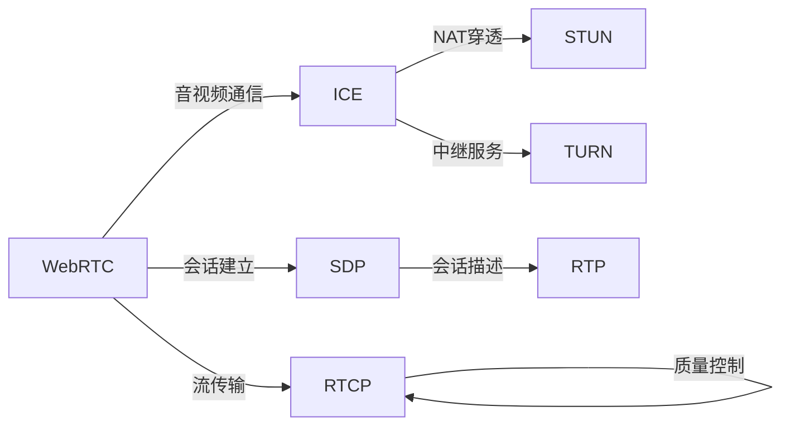

                 

## 1. 背景介绍

### 1.1 问题由来
随着互联网的发展和移动设备的普及，实时通信应用（Real-Time Communication, RTC）在社交、教育、医疗、娱乐等各个领域得到了广泛的应用。传统的基于Web的通信方式主要依赖浏览器的插件（如Flash）或插件化的解决方案（如WebRTC）来实现实时音视频通信。然而，这些传统方式存在着诸多问题，如兼容性差、插件管理复杂、用户体验不佳等。

WebRTC技术的出现为这些问题提供了解决方案。WebRTC是一种基于浏览器的开放标准，旨在为Web应用提供直接在浏览器中实现音视频通信的能力。它提供了一种高效、可靠、低延迟的实时通信解决方案，同时具有良好的跨平台兼容性和易于开发的特性。

### 1.2 问题核心关键点
WebRTC技术基于标准的RTP/SDP协议，通过ICE协议进行网络穿透和多媒体会话的建立。它的核心在于将音视频流的编解码、传输、同步和控制过程全部封装在Web浏览器中，简化了实时通信的开发流程。

WebRTC的主要特点包括：
- 基于浏览器：无需安装插件或软件，直接使用Web浏览器即可实现音视频通信。
- 高兼容性：支持几乎所有主流的浏览器和操作系统，兼容性好。
- 低延迟：采用直接TCP连接和NAT traversal技术，实现低延迟的音视频通信。
- 高效编码：支持多种编解码器和格式，适配不同的网络环境和带宽条件。
- 标准化：遵循IETF标准，确保其跨平台和跨厂商的互操作性。

### 1.3 问题研究意义
WebRTC技术的出现，不仅解决了传统音视频通信方式的诸多问题，还为开发者提供了更加高效、便捷的实时通信开发工具。它的应用范围广泛，涵盖了社交网络、在线教育、医疗咨询、远程办公等多个领域。

WebRTC技术的发展，为实时通信应用带来了新的机遇和挑战。通过学习和掌握WebRTC技术，开发者可以构建高质量、高稳定性的实时通信应用，提升用户体验，推动业务创新。同时，WebRTC技术的深入研究和应用，也将为人工智能、物联网等领域带来新的突破和发展机会。

## 2. 核心概念与联系

### 2.1 核心概念概述
WebRTC技术主要包括以下几个关键概念：

- **WebRTC**：一种基于浏览器的实时通信技术，提供音视频通信、文件传输、信令传输等功能。
- **ICE**：用于网络穿透和多媒体会话建立的协议，能够通过STUN、TURN等技术穿越NAT和防火墙。
- **RTP/SDP**：用于音视频编解码和会话描述的标准协议，支持多种编解码器和格式。
- **RTCP**：用于传输控制协议，用于音视频流传输的质量控制和反馈机制。

这些核心概念之间的联系紧密，通过协同工作，实现了高效、可靠的实时通信应用。

### 2.2 核心概念原理和架构的 Mermaid 流程图


## 3. 核心算法原理 & 具体操作步骤

### 3.1 算法原理概述
WebRTC技术的工作原理主要包括以下几个步骤：
1. 发送方生成RTCP包，包括媒体流信息、音视频编解码参数等。
2. 发送方将RTCP包发送到接收方，接收方解析后进行处理。
3. 接收方根据RTCP包信息，生成并发送RTCP应答包，反馈音视频质量信息。
4. 发送方根据RTCP应答包，调整音视频编码参数，确保通信质量。

WebRTC的核心在于通过ICE协议实现音视频流的双向传输和多媒体会话的建立。ICE协议通过STUN和TURN等技术，自动选择最优的传输路径，确保音视频流能够穿透NAT和防火墙，实现跨网络通信。

### 3.2 算法步骤详解
1. **创建WebRTC对象**：通过JavaScript API创建WebRTC对象，设置本地流媒体设备、编解码器、传输参数等。
2. **建立ICE连接**：通过ICE协议建立音视频流的双向连接，自动选择最优的传输路径。
3. **建立RTCP连接**：通过RTCP协议建立质量控制和反馈机制，实时监测音视频流质量。
4. **传输媒体流**：通过RTP协议传输音视频流，实现多媒体通信。

### 3.3 算法优缺点
WebRTC技术的主要优点包括：
- 跨平台兼容性好：支持主流浏览器和操作系统。
- 低延迟、高可靠性：采用直接TCP连接和ICE协议，实现低延迟和稳定的音视频通信。
- 高效编码：支持多种编解码器和格式，适配不同的网络环境和带宽条件。

WebRTC技术的主要缺点包括：
- 功能受浏览器限制：浏览器的兼容性限制了WebRTC的部分功能实现。
- 复杂性较高：需要处理网络穿透、质量控制等复杂问题。
- 安全性问题：需要解决音视频流传输的安全性问题。

### 3.4 算法应用领域
WebRTC技术广泛应用于以下几个领域：
- 社交网络：实现点对点或组播的音视频通信，如WhatsApp、Skype等。
- 在线教育：实现教师和学生的实时互动，如Zoom、Google Meet等。
- 医疗咨询：实现远程诊断和治疗，如Telemedicine等。
- 远程办公：实现团队协作和沟通，如Microsoft Teams、Slack等。
- 娱乐直播：实现实时音视频直播，如Twitch、YouTube Live等。

## 4. 数学模型和公式 & 详细讲解 & 举例说明

### 4.1 数学模型构建
WebRTC技术主要涉及以下数学模型：
- **音视频编码模型**：包括H.264、VP8等编解码器，用于将音视频流压缩为低延迟的编码流。
- **网络传输模型**：基于TCP/UDP协议，实现音视频流的网络传输。
- **质量控制模型**：基于RTCP协议，实现音视频流质量的实时监测和反馈。

### 4.2 公式推导过程
音视频编码模型的基本公式如下：
$$
C = \frac{R_b}{R_a}
$$
其中，$C$ 表示编码率，$R_b$ 表示输出编码流速率，$R_a$ 表示输入音视频流速率。

网络传输模型的基本公式如下：
$$
R = \frac{B}{T}
$$
其中，$R$ 表示传输速率，$B$ 表示网络带宽，$T$ 表示传输时间。

质量控制模型的基本公式如下：
$$
Q = \frac{C}{C_{\text{max}}}
$$
其中，$Q$ 表示音视频质量，$C_{\text{max}}$ 表示最大编码率。

### 4.3 案例分析与讲解
以音视频编码模型为例，我们以H.264为例，推导其基本参数。

H.264的基本参数包括：
- **编码块大小**：通常为16x16或8x8的块。
- **量化参数**：用于控制编码率。
- **帧率**：通常为30fps或更高的帧率。

## 5. 项目实践：代码实例和详细解释说明

### 5.1 开发环境搭建
WebRTC技术需要依赖浏览器的环境，开发者可以通过Chrome、Firefox等主流浏览器进行开发和测试。具体步骤如下：
1. 下载并安装Chrome浏览器。
2. 配置Chrome DevTools环境，打开开发者模式。
3. 安装WebRTC SDK和相关依赖库。

### 5.2 源代码详细实现
以下是WebRTC技术在音视频通信中的基本实现代码：

```javascript
// 创建WebRTC对象
var rtc = new RTCPeerConnection();

// 添加本地流媒体设备
var localStream = navigator.mediaDevices.getUserMedia({
  video: true,
  audio: true
});
rtc.addStream(localStream);

// 设置编解码器和传输参数
rtc.setEncoder('vp8', {frameRate: 30});
rtc.setMaxBitrate(500);

// 建立ICE连接
rtc.createOffer(function(sdp) {
  rtc.setLocalDescription(sdp);
  call.remoteDescription = new RTCSessionDescription(sdp);
  call.setRemoteDescription(sdp);
  rtc.onicecandidate = function(event) {
    if (event.candidate) {
      call.setIceCandidate(event.candidate);
    }
  };
});

// 建立RTCP连接
rtc.onICEConnectionStateChange = function() {
  if (rtc.iceConnectionState == 'connected') {
    rtc.ondatachannel = function(event) {
      var channel = event.channel;
      channel.onmessage = function(event) {
        console.log('Received message: ' + event.data);
      };
      channel.onerror = function(event) {
        console.log('Error occurred: ' + event.data);
      };
    };
  }
};
```

### 5.3 代码解读与分析
在上述代码中，我们通过JavaScript API创建了WebRTC对象，并添加了本地流媒体设备、编解码器和传输参数。通过`setEncoder`和`setMaxBitrate`方法，我们设置了音视频编码和传输参数。通过`createOffer`和`setLocalDescription`方法，我们建立了ICE连接，实现了音视频流的双向传输。通过`setIceCandidate`和`onICEConnectionStateChange`方法，我们实现了音视频流的网络穿透。通过`ondatachannel`方法，我们实现了RTCP连接的建立，处理音视频流的数据传输。

### 5.4 运行结果展示
在Chrome DevTools中，我们可以通过控制台输出和调试工具，实时查看音视频流的传输情况和质量控制信息。

## 6. 实际应用场景

### 6.1 社交网络
WebRTC技术在社交网络中的应用广泛，可以实现点对点或组播的音视频通信。例如，WhatsApp和Skype等应用，通过WebRTC技术实现了实时音视频通话功能。

### 6.2 在线教育
在线教育平台如Zoom和Google Meet，利用WebRTC技术实现了教师和学生的实时互动，提高了教学效果和学生体验。

### 6.3 医疗咨询
远程医疗平台如Telemedicine，利用WebRTC技术实现了医生和患者的实时沟通，提高了医疗服务的可达性和便捷性。

### 6.4 远程办公
远程办公工具如Microsoft Teams和Slack，利用WebRTC技术实现了团队协作和沟通，支持了远程办公的普及和应用。

### 6.5 娱乐直播
娱乐直播平台如Twitch和YouTube Live，利用WebRTC技术实现了实时音视频直播，丰富了用户的娱乐体验。

## 7. 工具和资源推荐

### 7.1 学习资源推荐
1. **《WebRTC: Getting Started with Real-Time Communications in Web and Mobile》**：一本介绍WebRTC技术的经典书籍，详细讲解了WebRTC的原理、实现和应用。
2. **《WebRTC on the Web》**：一篇深入浅出的WebRTC技术博客，介绍了WebRTC的核心概念、实现方法和最佳实践。
3. **Mozilla Developer Network (MDN)**：Mozilla提供的WebRTC技术文档，包含详细的API参考和代码示例。

### 7.2 开发工具推荐
1. **Chrome DevTools**：Chrome浏览器提供的开发者工具，支持实时调试和分析WebRTC应用程序。
2. **Firefox Developer Tools**：Firefox浏览器提供的开发者工具，支持实时调试和分析WebRTC应用程序。
3. **WebRTC-Echo Test**：WebRTC开发者常用的测试工具，用于测试音视频流的传输质量和网络穿透效果。

### 7.3 相关论文推荐
1. **"WebRTC: Real-Time Communication Protocol Standard"**：IETF标准文档，介绍了WebRTC技术的核心协议和实现细节。
2. **"WebRTC Technology: A Survey of its Recent Advances"**：一篇关于WebRTC技术进展的综述论文，总结了WebRTC技术的最新研究成果和应用场景。

## 8. 总结：未来发展趋势与挑战

### 8.1 研究成果总结
WebRTC技术作为一种基于浏览器的实时通信解决方案，已经在社交网络、在线教育、医疗咨询等多个领域得到了广泛应用。WebRTC技术的工作原理包括音视频编码、网络传输、质量控制等核心模块，通过ICE协议实现音视频流的双向传输和多媒体会话的建立。

### 8.2 未来发展趋势
WebRTC技术的未来发展趋势主要包括以下几个方面：
1. 音视频编码和解码的性能提升。随着硬件的进步和算法优化，未来的WebRTC将支持更高的帧率和更低的延迟。
2. 网络传输质量的提升。通过改进网络穿透和质量控制算法，未来的WebRTC将支持更稳定的音视频通信。
3. 跨平台兼容性的增强。未来的WebRTC将支持更多的主流浏览器和操作系统，提升其跨平台兼容性。
4. 安全性、隐私保护的加强。未来的WebRTC将加强音视频传输的安全性和隐私保护，防止数据泄露和攻击。

### 8.3 面临的挑战
WebRTC技术在发展过程中也面临着诸多挑战，主要包括以下几个方面：
1. 兼容性问题。尽管WebRTC支持主流浏览器，但部分浏览器的兼容性和支持程度仍然存在差异，需要开发者进行额外的兼容性处理。
2. 性能问题。在网络质量不稳定的情况下，WebRTC的音视频传输质量可能会受到影响，需要优化网络穿透和质量控制算法。
3. 安全性问题。WebRTC在音视频传输过程中需要处理安全性问题，如数据加密和认证等。

### 8.4 研究展望
未来的WebRTC技术研究将主要集中在以下几个方面：
1. 提升音视频编解码性能。通过优化编解码算法和硬件加速，提高WebRTC的音视频传输质量。
2. 改进网络穿透算法。通过改进ICE协议和NAT穿透技术，提升WebRTC的网络穿透能力和稳定性。
3. 加强隐私保护和安全认证。通过数据加密和认证技术，增强WebRTC的安全性和隐私保护能力。
4. 拓展WebRTC的应用场景。将WebRTC技术应用于更多领域，如远程医疗、智能家居等，拓展其应用范围和应用深度。

## 9. 附录：常见问题与解答

**Q1: 如何处理WebRTC的兼容性问题？**

A: 开发者可以通过以下方法处理WebRTC的兼容性问题：
1. 使用WebRTC polyfill或polyfill库，兼容不支持WebRTC的浏览器。
2. 进行兼容性检测，根据不同浏览器的支持程度进行代码适配。
3. 提供多种支持的WebRTC版本，让用户选择。

**Q2: WebRTC的音视频传输质量如何保障？**

A: WebRTC的音视频传输质量主要依赖于以下几个方面：
1. 网络穿透。通过ICE协议，自动选择最优的传输路径，减少网络延迟。
2. 质量控制。通过RTCP协议，实时监测音视频流质量，并调整编解码参数。
3. 自适应码率控制。根据网络带宽和设备性能，动态调整编码率，保障音视频质量。

**Q3: WebRTC的安全性问题如何解决？**

A: WebRTC的安全性问题主要依赖于以下几个方面：
1. 数据加密。使用AES等算法对音视频数据进行加密，防止数据泄露。
2. 认证和授权。通过OAuth等认证机制，确保通信双方的身份合法性。
3. 防止中间人攻击。通过SSL/TLS等安全协议，确保通信过程中的数据安全。

**Q4: WebRTC的应用场景有哪些？**

A: WebRTC的应用场景非常广泛，主要包括：
1. 社交网络：实现点对点或组播的音视频通信。
2. 在线教育：实现教师和学生的实时互动。
3. 医疗咨询：实现医生和患者的远程沟通。
4. 远程办公：实现团队协作和沟通。
5. 娱乐直播：实现实时音视频直播。

作者：禅与计算机程序设计艺术 / Zen and the Art of Computer Programming

